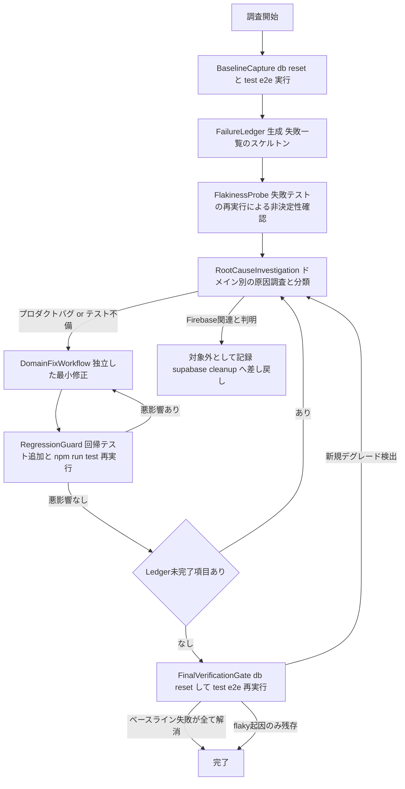
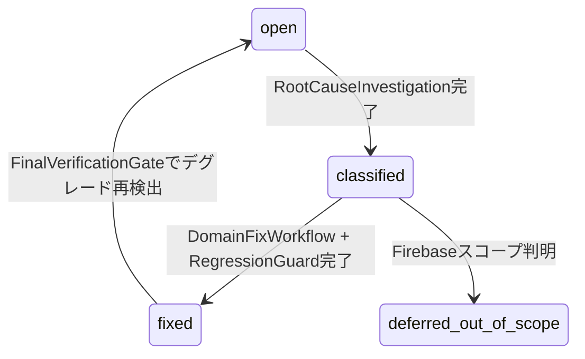

# Technical Design - e2e-suite-stabilization

## Overview

本機能は、ローカル環境で `npm run test:e2e` を実行した際に発生する156件中50件規模のE2Eテスト失敗について、機能ドメインをまたいだ根本原因調査・分類・独立修正・リグレッション防止・最終検証を安全に遂行するための調査・修正プロセスを提供する。

**Purpose**: 開発チームに対し、「どの失敗が本物のプロダクトバグで、どれがテストコード自体の不備・環境要因か」を機械的に区別できる調査基盤（Failure Ledger と再現可能な差分検証）と、ドメイン単位で安全に独立修正を進めるためのゲート付きプロセスを提供する。
**Users**: 本スペックを実行する開発者が、調査・修正・最終検証の各段階でこの設計に基づいて作業する。
**Impact**: `research.md` の実測により、`e2e/*.spec.ts`（32ファイル）は機能ドメイン単位で1ファイルにまとまっており、既存のテストコード自体に `waitForTimeout` 固定待機や `isVisible().catch()` フォールバックなどタイミング依存の記述が多く、失敗の一部が「テストコード自体の不備」に起因する可能性が高いことが判明した。本設計は、この事実を踏まえ、プロダクトコードの実際の欠陥とテストコードの不備を明確に切り分けて記録する調査基盤を中心コンポーネントに据える。

### Goals
- ベースラインとなる失敗一覧を再現可能な形で確定し、以後の全作業がこの母集合に対して閉じるようにする
- 各失敗の根本原因を「プロダクトコードの不具合」「テストコード自体の不備」「テスト環境・設定の問題」に分類し、ドメイン単位で独立して修正できるようにする
- 修正の副作用（リグレッション）と、最終検証時の新規デグレードを機械的に検出できるようにする
- Firebase削除作業（`supabase-cleanup`）のスコープには一切踏み込まない

### Non-Goals
- Firebase関連コード・パッケージ・設定の削除やそれに伴う変更（`supabase-cleanup` で完了済み）
- `saveQuiz` のINSERT順序バグ・`applyCursorFilter` のthenable自動実行バグの再修正（コミット `d067070` で対応済み。本スペックの母集合から除外）
- 新機能追加やUI/UXの改善（バグ修正に必要な最小限の変更を除く）
- 根本原因が特定できない非決定的flakyテストの完全安定化（分類・記録のみ行い、安定化自体は対象外）

## Boundary Commitments

### This Spec Owns
- ベースラインとなる失敗一覧の確定手順（`supabase db reset` → `npm run test:e2e` の再現手順）と、その結果を記録する Failure Ledger
- 各失敗の根本原因調査・分類（プロダクトバグ／テスト不備／環境問題）とドメイン単位のグルーピング
- 特定された根本原因ごとの独立した修正（プロダクトコードまたはテストコードのいずれか一方のみ）
- 修正済み欠陥に対するリグレッションテストの追加・更新
- ベースラインとの機械的な差分比較による最終検証ゲート

### Out of Boundary
- Firebase関連コード・設定・パッケージの削除作業そのもの（`supabase-cleanup` の責務。完了済み）
- `saveQuiz` / `applyCursorFilter` の既知バグ2件の再修正（コミット `d067070` で対応済み）
- 新機能の追加、UI/UXデザインの変更
- flakyテスト（非決定的に成否が入れ替わるテスト）自体の安定化実装。分類・記録は行うが、恒久対策は本スペックの完了条件に含めない

### Allowed Dependencies
- `supabase-cleanup` スペックの完了状態（コミット `d067070` 時点のコードベース）を前提条件として参照する（読み取り専用）
- Supabase CLI ローカル環境（`supabase start` / `supabase db reset`）、既存の `e2e/global-setup.ts` の冪等シード処理
- Playwright（既存バージョン、組み込み `json` reporter を含む）、Jest（既存の `jest.mock('@/lib/supabase/client')` チェーンモックパターン）
- `.kiro/steering/product.md` に記載された機能仕様を、プロダクトバグか否かを判定する基準として参照する

### Revalidation Triggers
- ベースライン確定後に `e2e/*.spec.ts` へ新規テストが追加・削除され、母集合（156件）の前提が変化した場合
- 本スペックの修正対象ファイルが、並行して進行中の他スペックのサービス層契約に影響する場合
- 根本原因のドメイン間またがり（Requirement 2.3のグルーピング）が想定より大規模で、単一スペック内での独立修正が困難と判明した場合

## Architecture

### Existing Architecture Analysis

- E2Eテストは `e2e/*.spec.ts`（32ファイル）に機能ドメイン単位で配置され、`playwright.config.ts` で `fullyParallel: false` / `workers: 1` により逐次実行される。ローカル実行時は既存の `npx next dev` サーバーを再利用する（`reuseExistingServer: true`）。
- `e2e/global-setup.ts` は Supabase Auth ユーザー・`users` テーブルの admin ロール・ジャンルマスタ・広告テスト用ダミークイズ25件を冪等（upsert / 事前削除+再投入）にシードしており、`supabase db reset` を挟まずに複数回実行しても矛盾しない。
- 現行の `reporter` 設定は `list` と `html` のみで、テスト単位の成否を機械的に比較できる構造化出力（JSON）が存在しない。これはベースラインと最終検証の差分比較を行う本スペックにとって不足している基盤である。
- 既存のE2Eテストコードは `page.waitForTimeout(N)` による固定待機、`isVisible().catch(() => false)` によるフォールバック分岐、複数ロケータの `.or()` 連結が多用されており、失敗要因がプロダクトコードとテストコードのどちらにあるか自明でないケースが多い（詳細は `research.md`）。

### Architecture Pattern & Boundary Map

**Selected Pattern**: Gated Investigate-Fix-Verify Pipeline — `supabase-cleanup` で採用された Gated Sequential Pipeline を踏襲し、ベースライン確定・原因調査・独立修正・リグレッション防止・最終検証の各段階をゲートで区切る。全段階を通じて単一の Failure Ledger を状態管理の一次情報源とする。



**Architecture Integration**:
- 選定パターンの理由: 各段階の判断を「宣言」ではなく実行結果の実測に基づかせる方針を `supabase-cleanup` から継承し、50件規模・8ドメイン以上にまたがる調査でも進捗と状態を一元管理できるようにする
- ドメイン境界: `e2e/*.spec.ts` のファイル単位をそのままドメイン境界として扱い、新しい分類体系を追加しない（`research.md` 参照）
- 既存パターンの維持: `scripts/*.mjs` のNode ESMスクリプト規約、`jest.mock('@/lib/supabase/client')` チェーンモックパターン、`e2e/global-setup.ts` の冪等シード処理
- 新規コンポーネントの理由: `FailureLedger` と差分比較スクリプトは、50件規模の失敗を一元的に追跡する既存の仕組みが存在しないため新設する
- Steering準拠: `tech.md` に記載のテスト方針（Jest単体テスト・Playwright E2Eテストの役割分担）を変更せず、その運用を安定化させることに限定する

### Technology Stack

| Layer | Choice / Version | Role in Feature | Notes |
|-------|------------------|------------------|-------|
| E2E Test Runner | Playwright（既存バージョン） | ベースライン取得・最終検証の実行基盤 | 組み込み `json` reporter を追加利用。新規パッケージ追加なし |
| Unit/Integration Test | Jest（既存バージョン） | リグレッションテストの追加先（プロダクトバグ修正時） | 既存の `jest.mock('@/lib/supabase/client')` パターンを踏襲 |
| Local Backend | Supabase CLI（`supabase start` / `supabase db reset`） | ベースライン・最終検証実行前の状態初期化 | 既存の `e2e/global-setup.ts` をそのまま利用 |
| Tooling / Scripts | Node.js ESM（`.mjs`） | `scripts/e2e-report-to-ledger.mjs`・`scripts/e2e-baseline-diff.mjs` の実装言語 | 既存 `scripts/verify-firebase-removed.js` と同一規約 |

## File Structure Plan

本スペックは根本原因が調査開始前に未確定であるため、修正対象となるプロダクトコード・テストコードのファイルを設計時点で網羅列挙することはできない（`supabase-cleanup` のように削除対象が事前に判明している性質のスペックとは異なる）。Requirement 2 の調査を通じて特定された対象ファイルは Failure Ledger の各レコードに記録し、`tasks.md` 生成時にタスク単位へマッピングする。

### Directory Structure
```
.kiro/specs/e2e-suite-stabilization/
└── failure-ledger.md         # 新規: 失敗一覧・分類・原因・修正参照を追跡する一次情報源

scripts/
├── e2e-report-to-ledger.mjs  # 新規: playwright-report/results.json からLedgerスケルトンを生成
└── e2e-baseline-diff.mjs     # 新規: 2時点のresults.jsonを比較し新規修正/未修正/デグレードを判定
```

### Modified Files
- `playwright.config.ts` — `reporter` 配列に `['json', { outputFile: 'playwright-report/results.json' }]` を追加（既存の `list`/`html` 設定は変更しない）
- `package.json` — `scripts` に `e2e:ledger`（`node scripts/e2e-report-to-ledger.mjs` 相当）と `e2e:diff`（`node scripts/e2e-baseline-diff.mjs` 相当）を追加
- 個々の根本原因に対応するプロダクトコード（`src/services/**`, `src/components/**`, `src/hooks/**` 等）またはテストコード（`e2e/*.spec.ts`）— Requirement 2 の調査結果として Failure Ledger に記録され、対応するタスクでのみ確定する

## Requirements Traceability

| Requirement | Summary | Components | Interfaces | Flows |
|---|---|---|---|---|
| 1.1 | `db reset` 後の `test:e2e` 実行と失敗一覧記録 | BaselineCapture | Batch | Baseline → Ledger |
| 1.2 | ベースラインとして確定 | BaselineCapture | Batch | Ledger |
| 1.3 | 非決定的な失敗をflaky分類 | FlakinessProbe | Batch | Flaky |
| 1.4 | Firebase関連コードへの非変更 | BaselineCapture | — | Baseline |
| 2.1 | 3分類への分類 | RootCauseInvestigation | State | Investigate |
| 2.2 | 全ドメインの調査実施 | RootCauseInvestigation | State | Investigate |
| 2.3 | 同一原因のグルーピング | RootCauseInvestigation | State | Investigate |
| 2.4 | 再現手順・該当箇所の記録 | RootCauseInvestigation | State | Investigate |
| 2.5 | Firebaseスコープ判明時の対象除外 | RootCauseInvestigation | State | Investigate → ExcludeOut |
| 3.1 | 対応原因のみの最小修正 | DomainFixWorkflow | — | Fix |
| 3.2 | Firebase関連コードを対象外 | DomainFixWorkflow | — | Fix |
| 3.3 | プロダクトバグは実装修正・期待値変更禁止 | DomainFixWorkflow | — | Fix |
| 3.4 | テスト不備はテストコードのみ修正 | DomainFixWorkflow | — | Fix |
| 3.5 | 機能仕様の非変更 | DomainFixWorkflow | — | Fix |
| 4.1 | 修正への回帰テスト追加 | RegressionGuard | — | Regression |
| 4.2 | 既存成功テストの非退行 | RegressionGuard | — | Regression |
| 4.3 | `npm run test` 再実行確認 | RegressionGuard | Batch | Regression |
| 5.1 | 全修正後の `test:e2e` 再実行 | FinalVerificationGate | Batch | FinalGate |
| 5.2 | ベースライン失敗の全件成功確認 | FinalVerificationGate | Batch | FinalGate |
| 5.3 | flaky残存時の完了判定への非影響 | FinalVerificationGate | Batch | FinalGate → Done |
| 5.4 | 新規デグレード検出時の非完了判定 | FinalVerificationGate | Batch | FinalGate → Investigate |
| 5.5 | `npm run test` 最終確認 | FinalVerificationGate | Batch | FinalGate → Done |

## Components and Interfaces

| Component | Domain/Layer | Intent | Req Coverage | Key Dependencies (P0/P1) | Contracts |
|-----------|--------------|--------|--------------|--------------------------|-----------|
| BaselineCapture | Tooling / CLI | `db reset` 後に `test:e2e` を実行し、失敗一覧をFailure Ledgerのスケルトンとして記録する | 1.1, 1.2, 1.4 | Supabase CLIローカル環境（P0）, Playwright JSON reporter出力（P0） | Batch |
| FlakinessProbe | Tooling / CLI | ベースラインの失敗テストを複数回再実行し、非決定的な成否の入れ替わりを検出する | 1.3 | BaselineCaptureの出力（P0） | Batch |
| RootCauseInvestigation | Process / Documentation | Failure Ledgerの各レコードについて原因を3分類し、共有原因をグルーピングする | 2.1, 2.2, 2.3, 2.4, 2.5 | Failure Ledger（P0）, `.kiro/steering/product.md`（P1） | State |
| DomainFixWorkflow | Process（対象は各ドメインのService/Component/Hook/E2Eテスト） | 分類済みの根本原因に対して独立した最小修正を行う | 3.1, 3.2, 3.3, 3.4, 3.5 | RootCauseInvestigationの分類結果（P0） | — |
| RegressionGuard | Process / Testing | 修正済み欠陥にリグレッションテストを追加し、`npm run test` で既存テストへの悪影響を確認する | 4.1, 4.2, 4.3 | DomainFixWorkflowの成果物（P0）, Jestスイート（P0） | Batch |
| FinalVerificationGate | Tooling / CLI | 全修正後にBaselineCaptureを再実行し、Ledgerとの差分比較で完了可否を判定する | 5.1, 5.2, 5.3, 5.4, 5.5 | BaselineCapture（P0）, Failure Ledger（P0） | Batch |

### Tooling / CLI

#### BaselineCapture

| Field | Detail |
|-------|--------|
| Intent | ローカルSupabaseをリセットした状態でE2Eスイート全体を実行し、失敗したテストの一覧をFailure Ledgerのスケルトンとして書き出す |
| Requirements | 1.1, 1.2, 1.4 |

**Responsibilities & Constraints**
- `supabase db reset` を実行してからplaywrightの `json` reporter出力（`playwright-report/results.json`）を生成する
- `scripts/e2e-report-to-ledger.mjs` が `results.json` を読み取り、失敗（`status !== 'passed'`）したテストごとに `specFile` / `testTitle` / `domain`（specファイル名から導出）を抽出し、`failure-ledger.md` の各レコードを `status: open` で初期化する
- 既にLedgerに存在するテストIDのレコードは上書きせず、`status` 等の既存の調査結果を保持したまま再実行できる（最終検証時の再利用を可能にするため）
- Firebase関連コード（`supabase-cleanup` のスコープ）には一切変更を加えない

**Dependencies**
- Inbound: 開発者による手動実行（`npm run e2e:ledger` 相当）（P0）
- Outbound: `failure-ledger.md` への書き込み（P0）
- External: Supabase CLIローカル環境（P0）、Playwright `json` reporter出力（P0）

**Contracts**: Service [ ] / API [ ] / Event [ ] / Batch [x] / State [ ]

##### Batch / Job Contract
- Trigger: 開発者による手動実行。ベースライン確定時（Requirement 1）と最終検証時（Requirement 5）の双方で同一手順を再利用する
- Input / validation: `playwright-report/results.json`（Playwright `json` reporter出力）。ローカルSupabaseが起動済みであることを前提とする
- Output / destination: `.kiro/specs/e2e-suite-stabilization/failure-ledger.md` の該当レコードを新規追加または既存レコードの実行結果欄（最終確認ステータス）のみ更新
- Idempotency & recovery: 同一テストIDに対する再実行は、調査済みフィールド（分類・原因・修正参照）を破壊せず実行結果のみ更新する。Supabase起動失敗時はLedgerを生成せず、インフラ起因のエラーとして報告する

**Implementation Notes**
- Integration: `package.json` に `"e2e:ledger": "node scripts/e2e-report-to-ledger.mjs"` を追加
- Validation: 生成されたLedgerの失敗件数が `npm run test:e2e` のサマリー行（`X failed`）と一致することを確認する
- Risks: Playwrightの`json` reporter出力形式に依存するため、Playwrightのメジャーバージョン更新時にパーサーの追従が必要になる

#### FlakinessProbe

| Field | Detail |
|-------|--------|
| Intent | ベースラインで失敗したテストのみを対象に再実行し、非決定的に成否が入れ替わるテストを検出する |
| Requirements | 1.3 |

**Responsibilities & Constraints**
- BaselineCaptureで `open` となったテストIDのみを対象に、Playwrightの `--grep` 等でテストを絞り込んで複数回（目安2〜3回）再実行する
- 実行結果が試行ごとに揺れるテストIDについて、Failure Ledgerの `flaky` フィールドを `true` に設定する
- flaky判定はRootCauseInvestigationの分類（Requirement 2.1）とは独立した属性として扱う（flakyであっても根本原因調査自体は継続する）

**Dependencies**
- Inbound: BaselineCaptureの出力（P0）
- Outbound: Failure Ledgerの `flaky` フィールド更新（P0）
- External: なし

**Contracts**: Service [ ] / API [ ] / Event [ ] / Batch [x] / State [ ]

##### Batch / Job Contract
- Trigger: BaselineCapture完了後、開発者が手動実行
- Input / validation: Failure Ledger上の `status: open` レコード一覧
- Output / destination: Failure Ledgerの `flaky` フィールド更新
- Idempotency & recovery: 再実行しても既存の `flaky` 判定を上書きするのみで副作用はない

### Process / Documentation

#### RootCauseInvestigation

| Field | Detail |
|-------|--------|
| Intent | Failure Ledgerの各レコードについて根本原因を調査し、3分類・ドメイン・グルーピング・再現手順を記録する |
| Requirements | 2.1, 2.2, 2.3, 2.4, 2.5 |

**Responsibilities & Constraints**
- 各失敗レコードについて、原因を `product-bug` / `test-defect` / `env-config` のいずれかに分類する（`.kiro/steering/product.md` の機能仕様との差異が確認できればプロダクトバグ、テストコード側の待機・アサーション不備であればテスト不備と判定する）
- バッジ付与・管理者ポータル・ソーシャル機能・リーダーボード・学習支援・ストリーミングスケルトン・クイズ検索・SEO共有を含む、Ledgerに存在する全ドメイン（`e2e/*.spec.ts` の各ファイル）を調査対象とする
- 複数レコードが同一の根本原因を共有すると判明した場合、Ledger上で共通の `rootCauseGroup` 識別子を付与し、単一の修正対象として扱う
- 各レコードに再現手順（`sourceRefs`: 該当ファイル・行）を記録する
- 調査の結果、原因が `supabase-cleanup` のスコープ（Firebase関連コード）に起因すると判明した場合、当該レコードの `status` を `deferred-out-of-scope` とし、対象スペック名を記録した上で本スペックの修正対象から除外する

**Dependencies**
- Inbound: Failure Ledger（BaselineCapture / FlakinessProbeの出力）（P0）
- Outbound: DomainFixWorkflowへの分類済みレコード（P0）
- External: `.kiro/steering/product.md`（P1、判定基準として参照）

**Contracts**: Service [ ] / API [ ] / Event [ ] / Batch [ ] / State [x]

##### State Management
- State model: Failure Ledgerの各レコードが `status`（`open` → `classified` → `fixed` / `deferred-out-of-scope`）で状態遷移する
- Persistence & consistency: `.kiro/specs/e2e-suite-stabilization/failure-ledger.md` への手動更新（Markdownテーブルまたは同等の構造化記述）
- Concurrency strategy: 単一開発者による逐次更新を前提とし、同時更新の排他制御は行わない

**Implementation Notes**
- Integration: ドメインごとに独立して調査を進められるため、複数の根本原因グループを並行して調査してよい（Ledger上のレコード単位で競合しない限り）
- Validation: 全レコードが `open` のまま残らないこと（`classified` 以降に遷移していること）を調査完了の目安とする
- Risks: 1つの根本原因が複数ドメインをまたぐ場合（例: 共通コンポーネントのバグ）、ドメイン単位の独立修正という前提が崩れる。`rootCauseGroup` によるグルーピングで対応する

#### DomainFixWorkflow

| Field | Detail |
|-------|--------|
| Intent | 分類済みの根本原因ごとに、対応するプロダクトコードまたはテストコードのみを対象とした最小修正を行う |
| Requirements | 3.1, 3.2, 3.3, 3.4, 3.5 |

**Responsibilities & Constraints**
- `category: product-bug` のレコードは、実際の機能不具合を修正する。テストの期待値をプロダクトコードの不具合のある挙動に合わせて変更してはならない
- `category: test-defect` のレコードは、プロダクトコードを変更せずテストコード（`e2e/*.spec.ts`）のみを修正する
- 修正はFailure Ledgerで紐付けられた `rootCauseGroup` 単位で行い、無関係なリファクタリングを含めない
- Firebase関連コード（`supabase-cleanup` のスコープ）を変更対象に含めない
- `.kiro/steering/product.md` に記載された対象ドメインの機能仕様を変更しない

**Dependencies**
- Inbound: RootCauseInvestigationの分類結果（P0）
- Outbound: RegressionGuardへの修正済み成果物（P0）
- External: 各ドメインの既存Service/Component/Hook実装（P0、修正対象）

**Contracts**: Service [ ] / API [ ] / Event [ ] / Batch [ ] / State [ ]

**Implementation Notes**
- Integration: 修正対象ファイルはFailure Ledgerの `sourceRefs` / `fixRef` フィールドに記録し、`tasks.md` のタスク単位と対応付ける
- Validation: 修正後、当該ドメインの該当E2Eテスト（`e2e/<domain>.spec.ts`）が単体で成功することを確認してからRegressionGuardへ進む
- Risks: プロダクトバグ修正が既存の他ドメインの挙動に影響する可能性がある場合、RegressionGuardの `npm run test` 全体実行で検出する

### Process / Testing

#### RegressionGuard

| Field | Detail |
|-------|--------|
| Intent | 修正済みの欠陥に対してリグレッションテストを追加し、既存テストへの悪影響がないことを確認する |
| Requirements | 4.1, 4.2, 4.3 |

**Responsibilities & Constraints**
- `category: product-bug` の修正には、当該不具合を再現するJest単体テストまたはPlaywright E2Eテストを追加・更新する
- 修正1件ごとに `npm run test` を再実行し、既存のJestテストスイート（219スイート/1222テスト規模、既存実績）に悪影響がないことを確認する
- 既存の成功していたE2Eテスト・Jestテストを退行させてはならない

**Dependencies**
- Inbound: DomainFixWorkflowの修正成果物（P0）
- Outbound: FinalVerificationGateへの確定済み修正（P0）
- External: Jestテストスイート（P0）

**Contracts**: Service [ ] / API [ ] / Event [ ] / Batch [x] / State [ ]

##### Batch / Job Contract
- Trigger: DomainFixWorkflowでの修正完了直後、開発者が手動実行
- Input / validation: 修正差分と、対応するリグレッションテスト
- Output / destination: `npm run test` の実行結果（成功/失敗）
- Idempotency & recovery: 失敗時は当該修正をDomainFixWorkflowへ差し戻し、Failure Ledgerの `status` を `classified` に戻す

**Implementation Notes**
- Integration: リグレッションテストの追加先は既存の `tests/` ディレクトリ構造（`src/` をミラー）に従う
- Validation: 追加したリグレッションテストが「修正前はRED、修正後はGREEN」であることをTDDで確認する（`supabase-cleanup` タスク5.3で確立済みの手順を踏襲）
- Risks: なし（既存のテスト実行基盤をそのまま利用するため新規リスクは発生しない）

#### FinalVerificationGate

| Field | Detail |
|-------|--------|
| Intent | Failure Ledger上の全レコードの修正完了後、BaselineCaptureを再実行してベースラインとの差分を機械的に比較し、完了可否を判定する |
| Requirements | 5.1, 5.2, 5.3, 5.4, 5.5 |

**Responsibilities & Constraints**
- Failure Ledger上の全レコードが `fixed` または `deferred-out-of-scope` になった時点で、`supabase db reset` した状態で `npm run test:e2e` を再実行する
- `scripts/e2e-baseline-diff.mjs` が、ベースライン時の `results.json` と最終検証時の `results.json` をテスト単位（`specFile` + `testTitle`）で突き合わせ、「ベースラインで失敗→今回成功」「ベースラインで失敗→今回も失敗」「ベースラインに存在しない新規失敗」の3区分に分類する
- 「ベースラインで失敗→今回も失敗」のレコードのうち `flaky: true` のものは完了判定をブロックしない。`flaky: false` のものが1件でも残る場合は完了と判定しない
- 「ベースラインに存在しない新規失敗（デグレード）」が1件でも検出された場合、完了と判定せず、当該テストをFailure Ledgerに新規レコードとして追加しRootCauseInvestigationへ差し戻す
- 最終検証が完了したら `npm run test` を実行し、Jestスイート全体が成功することを最終確認する

**Dependencies**
- Inbound: RegressionGuardで確定した全修正（P0）、Failure Ledger（P0）
- Outbound: なし（本スペックの完了判定そのもの）
- External: Supabase CLIローカル環境（P0）

**Contracts**: Service [ ] / API [ ] / Event [ ] / Batch [x] / State [ ]

##### Batch / Job Contract
- Trigger: Failure Ledgerの全レコードが `fixed` / `deferred-out-of-scope` になった時点で開発者が手動実行
- Input / validation: ベースライン時・最終検証時の2つの `results.json`
- Output / destination: 差分レポート（新規修正/未修正/デグレードの一覧）。終了コードは全条件を満たした場合のみ `0`
- Idempotency & recovery: Fail時は差分レポートに従い該当レコードをRootCauseInvestigationへ差し戻し、解消後に再実行する

**Implementation Notes**
- Integration: BaselineCapture（`scripts/e2e-report-to-ledger.mjs`）を再利用し、二重実装しない
- Validation: 差分スクリプトの単体テストで3区分の判定ロジックを検証する
- Risks: Playwrightのテストタイトルが調査途中で変更された場合、`specFile` + `testTitle` によるテスト同定が失敗する可能性がある。テストタイトル変更を伴う修正時はFailure Ledgerの該当レコードも同時に更新する運用とする

## Data Models

### Domain Model

Failure Ledgerが管理する唯一の集約は `FailureRecord` であり、調査開始（BaselineCapture）から完了判定（FinalVerificationGate）までの状態遷移をこのレコード単位で追跡する。



### Logical Data Model

**FailureRecord**（`failure-ledger.md` の1テーブル行に対応）

| フィールド | 型 | 説明 |
|---|---|---|
| id | string | `<specFile>::<testTitle>` 形式の一意識別子 |
| specFile | string | `e2e/*.spec.ts` の相対パス |
| testTitle | string | Playwrightのテストタイトル |
| domain | string | `specFile` のファイル名から導出（例: `leaderboard`, `admin-portal`） |
| category | `product-bug` \| `test-defect` \| `env-config` \| `undetermined` | 根本原因の分類（Requirement 2.1） |
| rootCauseGroup | string \| null | 同一原因を共有するレコードを束ねる識別子（Requirement 2.3） |
| rootCauseSummary | string | 根本原因の要約 |
| sourceRefs | string[] | 再現手順・該当ソースファイル:行（Requirement 2.4） |
| fixRef | string \| null | 修正コミット・PR等の参照 |
| regressionTestRef | string \| null | 追加・更新したリグレッションテストの参照 |
| flaky | boolean | 非決定的な成否の入れ替わりが確認されたか（Requirement 1.3） |
| status | `open` \| `classified` \| `fixed` \| `deferred_out_of_scope` | 状態 |

**Consistency & Integrity**:
- `id` はベースライン取得時（BaselineCapture）に確定し、以後変化しない。テストタイトル変更時はレコードを引き継ぐ運用とする
- `status: fixed` に遷移するには `fixRef` および（`category: product-bug` の場合は）`regressionTestRef` が入力済みであることを前提とする

## Error Handling

### Error Strategy
各段階の失敗は次段階へ進めず、原因をFailure Ledgerまたは実行ログに記録した上で該当段階に差し戻す。自動リトライや部分的な完了判定は行わない。

### Error Categories and Responses
- **インフラ起因の失敗（BaselineCapture / FinalVerificationGate）**: Supabaseローカル環境が未起動、または `next dev` サーバーが応答しない場合、Ledgerの生成・比較を行わずインフラエラーとして報告する
- **分類不能（Requirement 2.1）**: 根本原因が判別できないレコードは `category: undetermined` のまま残し、`status: classified` に遷移させない。DomainFixWorkflowへは進めない
- **デグレード検出（Requirement 5.4）**: FinalVerificationGateで新規失敗が検出された場合、完了と判定せずRootCauseInvestigationへ差し戻す
- **flaky残存（Requirement 1.3, 5.3）**: 非決定的と確認されたレコードは完了判定をブロックしないが、`flaky: true` である旨と再現頻度をLedgerに記録し続ける

### Monitoring
本スペックは一度限りの調査・修正作業であるため常時監視は不要。Failure LedgerとBaselineCapture/FinalVerificationGateの実行ログ（`playwright-report/`）を作業記録として保持する。

## Testing Strategy

- **Unit Tests**: `scripts/e2e-report-to-ledger.mjs` が `results.json` フィクスチャから `specFile`/`testTitle`/`domain` を正しく抽出し、既存レコードの調査済みフィールドを上書きしないことを検証する。`scripts/e2e-baseline-diff.mjs` が「新規修正」「未修正」「新規デグレード」の3パターンを正しく判定することを検証する
- **Integration Tests**: BaselineCaptureをローカルSupabase環境に対して実行し、生成されたLedgerの失敗件数が `npm run test:e2e` のサマリー行と一致することを確認する
- **Regression Tests**: `category: product-bug` として修正した各欠陥について、対応するJest単体テストまたはPlaywright E2Eテストが「修正前RED・修正後GREEN」であることを確認する（TDD、`supabase-cleanup` タスク5.3の手順を踏襲）
- **E2E/最終検証**: FinalVerificationGateによる `npm run test:e2e` 全件再実行が、ベースラインの失敗を全て解消し新規デグレードを含まないことをもって受け入れ基準とする

## Supporting References

- 実測ベースラインの詳細（実行構成・既存テストコードの傾向）: [research.md](./research.md)
- Gated Sequential Pipelineパターンの参照元: [supabase-cleanup/design.md](../supabase-cleanup/design.md)
