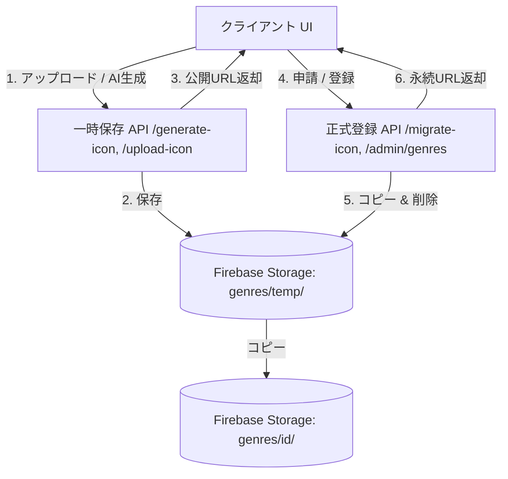
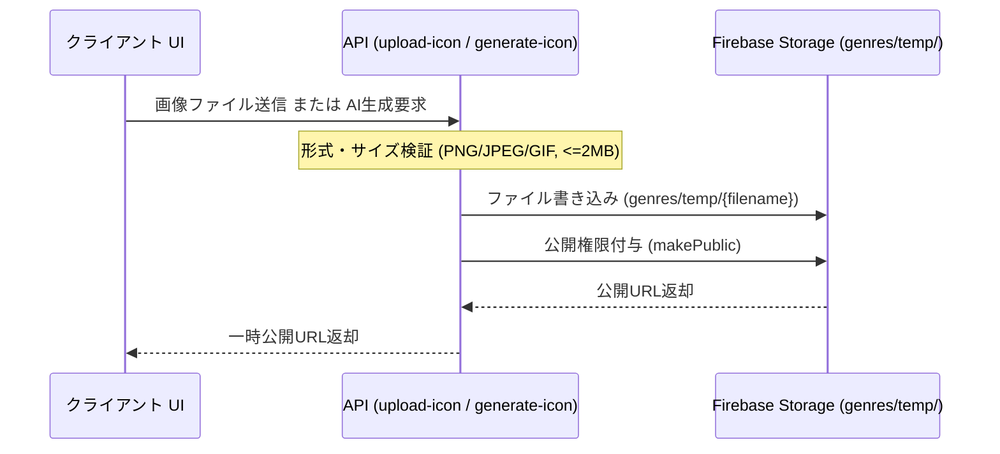
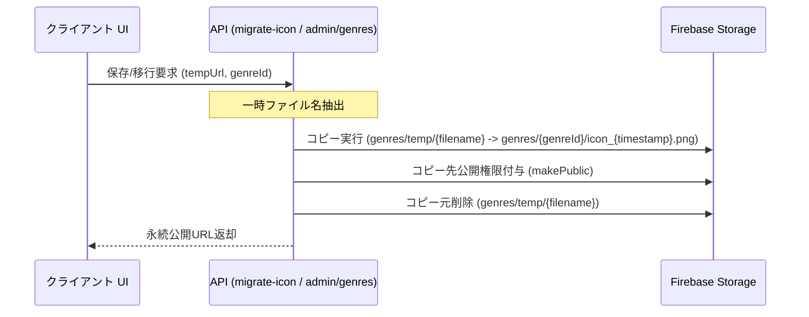

# Design Document: genre-icons

## Overview
本機能は、ジャンル新設申請や管理者画面におけるジャンルのアイコン画像を、従来のローカルサーバーのファイルシステムから Firebase Storage へ移行するためのものです。画像のアセット管理を BaaS 側に閉じることで、Vercel などのサーバーレス環境やマルチインスタンス構成においても、永続的で信頼性の高い画像配信を実現します。

### Goals
- ジャンルアイコンアセットのローカル依存を排除し、Firebase Storage 上で一元管理する。
- 一時アップロード、AI生成、正式移行（承認・保存時）の処理を Firebase Storage SDK を用いて再構築する。
- 画像配信URLを Firebase Storage の直接公開 URL に統一する。

### Non-Goals
- ジャンルアイコン以外の画像アセット（クイズのカバー画像等）の設計変更。
- 本番 DB にすでに格納されている既存ジャンルの画像 URL に対する自動バッチマイグレーション（テストデータによる整合確認のみとする）。

## Boundary Commitments

### This Spec Owns
- Firebase Storage 内の `genres/temp/` への一時画像アセットのアップロードおよび公開 URL 返却。
- 申請承認・可決、または管理者登録時に、一時画像アセットを `genres/${genreId}/` の正式パスにコピーし、元のファイルを削除するライフサイクル処理。
- 関連する API エンドポイントの改修（`upload-icon`, `generate-icon`, `migrate-icon`, `/api/admin/genres`）。
- 不要になったローカルアセット配信 API (`/api/assets/genre/[...path]`) の廃止。

### Out of Boundary
- フロントエンド UI 側のレイアウトやスタイルの変更（既存の `iconImageUrl` 参照処理は不変）。
- Firebase Storage 以外のストレージ（S3 等）の導入。

### Allowed Dependencies
- **Firebase Storage Bucket / SDK**: アセットの永続化とファイル操作の基盤。
- **Firebase Admin SDK (`@google-cloud/storage`)**: サーバーサイドでのアトミックなコピー・削除・公開権限付与。

### Revalidation Triggers
- `uploadTemporaryGenreIconBuffer` ヘルパーの引数や戻り値の型定義の変更。
- `migrate-icon` API のリクエスト/レスポンス形式の変更。

## Architecture

### Existing Architecture Analysis
現状、クイズのカバー画像はすでに Firebase Storage への直接保存が実現されており、以下の配信 URL スキーマが使用されています。
`https://storage.googleapis.com/${bucketName}/quizzes/...`

一方、ジャンルアイコンのみが `/api/assets/genre/...` の形式でローカル配信されており、アーキテクチャの不整合が発生しています。本設計はジャンルアイコンをクイズカバー画像と同等の Firebase Storage 直接保存・直接配信パターンへ統合します。



### Technology Stack

| Layer | Choice / Version | Role in Feature | Notes |
|-------|------------------|-----------------|-------|
| Backend / Services | Next.js API Routes | アップロード受付、AI生成、コピー移行 API の提供 | `upload-icon`, `generate-icon`, `migrate-icon` |
| Data / Storage | Firebase Storage / SDK | アセットの物理永続化およびコピー・削除、公開権限の提供 | `genres/temp/`, `genres/{id}/` |
| Cloud SDK | `@google-cloud/storage` (Admin SDK) | サーバーサイドでのファイル操作（コピー・削除・公開化） | `storage-admin.ts` |

## File Structure Plan

### Directory Structure
既存のファイルを変更し、不要なファイルを削除します。

```
src/
├── app/
│   └── api/
│       ├── admin/
│       │   └── genres/
│       │       └── route.ts         # MODIFY: 管理者登録時の一時画像移行を Storage 操作に変更
│       ├── assets/
│       │   └── genre/
│       │       └── [...path]/
│       │           └── route.ts     # DELETE: 不要となったローカル配信 API を削除
│       └── genres/
│           ├── migrate-icon/
│           │   └── route.ts         # MODIFY: Storage 上でのコピー & 削除処理に変更
│           └── upload-icon/
│               └── route.ts         # MODIFY: Storage 一時パスへの保存に変更
└── services/
    └── storage-admin.ts             # MODIFY: uploadTemporaryGenreIconBuffer を Storage 向けに実装変更
```

## System Flows

### ジャンルアイコンの一時アップロードおよび生成フロー


### ジャンルアイコンの正式移行（承認・保存）フロー


## Components and Interfaces

### Storage Service

#### uploadTemporaryGenreIconBuffer
| Field | Detail |
|-------|--------|
| Intent | AI生成された画像バッファ（または手動アップロードデータ）を Firebase Storage に一時保存し、公開 URL を返す。 |
| Requirements | 1.1, 1.3 |

**Responsibilities & Constraints**
- バッファ形式のデータを Firebase Storage の `genres/temp/${uid}_${timestamp}.png` パスへ保存する。
- アップロードしたアセットに公開権限（`makePublic`）を付与する。
- 戻り値として直接参照可能な公開 URL (`https://storage.googleapis.com/...`) を返却する。

##### Service Interface
```typescript
export function uploadTemporaryGenreIconBuffer(
  buffer: Buffer,
  uid: string
): Promise<string>;
```

---

### API Contracts

#### POST /api/genres/upload-icon
手動選択されたファイルを Firebase Storage の一時フォルダに保存する。

| Method | Endpoint | Request | Response | Errors |
|--------|----------|---------|----------|--------|
| POST | /api/genres/upload-icon | FormData (file: File) | `{ success: true, tempUrl: string }` | 400, 500 |

- **Validation Rules (SEC-08 準拠)**:
  - ファイル種別: `image/png`, `image/jpeg`, `image/gif` のみ（SVG は拒否）
  - ファイルサイズ: 2MB 以下

#### POST /api/genres/migrate-icon
一時保存された Storage 上の画像を、正式なジャンル保存先パスへ移行する。

| Method | Endpoint | Request | Response | Errors |
|--------|----------|---------|----------|--------|
| POST | /api/genres/migrate-icon | `{ tempUrl: string, genreId: string, userId: string }` | `{ success: true, iconImageUrl: string }` | 400, 401, 404, 500 |

- **URL 解析とセキュリティガード**:
  - `tempUrl` が Firebase Storage の有効な一時公開 URL (`https://storage.googleapis.com/.../genres/temp/`) で始まっていることを厳格に検証する。
  - `genreId` が `^[a-z0-9-]+$` の形式であることを検証し、不正なパス操作を防ぐ。
  - コピー成功後、`genres/temp/...` の元ファイルを確実に削除（`unlink` 相当）する。

## Data Models
本機能では新規のデータストアは導入しませんが、DB 上のデータ値および保存形式が以下のように変化します。

### metadata_genres & genreRequests
- `iconImageUrl`: `https://storage.googleapis.com/${bucketName}/genres/${genreId}/icon_${timestamp}.png` 形式の Firebase Storage 直接公開 URL（従来は `/api/assets/genre/...` のローカル URL）。

## Error Handling

### Error Strategy
- **検証エラー (400)**: ファイル形式が非対応、またはサイズが2MBを超える場合、アップロードを即座にブロックしてエラーを返却する。
- **Storage 操作失敗 (500)**: コピー処理に失敗した場合はトランザクションを中断し、コピー元の一時ファイルを削除しないことでアセット損失を防ぐ。

## Testing Strategy

### Unit Tests
- `storage-admin.test.ts` (新規): `uploadTemporaryGenreIconBuffer` が Storage SDK を正しく呼び出してアップロードを行うことのモック検証。

### Integration / E2E Tests
- `e2e/genre-icons.spec.ts` (新規):
  1. 新設申請画面で手動で画像をアップロードし、一時URLプレビューが表示されること。
  2. 新設申請画面で AI 生成を実行し、画像プレビューが表示されること。
  3. 申請送信時に、一時画像が正式パスに正しくコピーされ、新設申請ドキュメントに正しい Storage 公開 URL が保存されること。
  4. 管理者画面からジャンルを直接作成した際に、Storage 移行が完了し正常に画像が表示されること。
