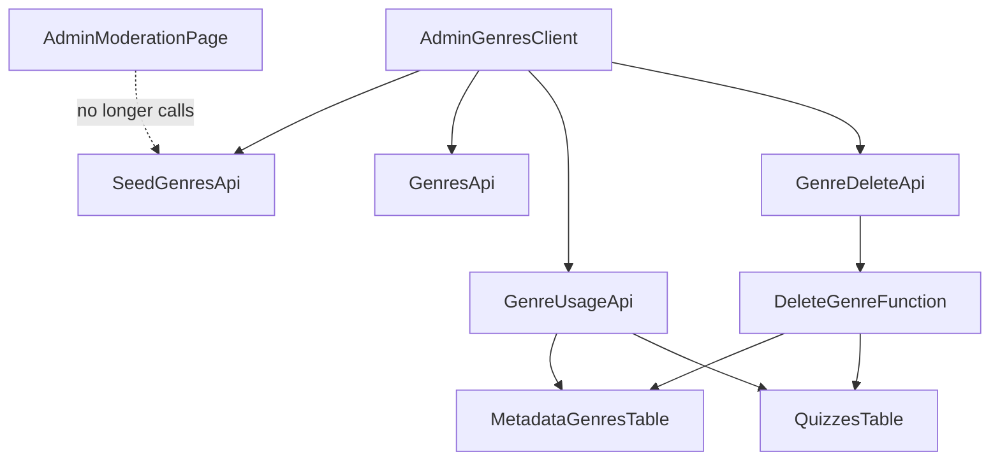

# Technical Design

## Overview
本機能は、管理者専用のジャンル直接管理画面 (`/admin/genres`) を拡張し、(1) 現在モデレーション審査画面 (`/admin/moderation`) にある初期ジャンル一括投入UIをジャンル管理画面へ移動し、(2) 既存クイズの再割当てを伴うジャンル削除機能を新設する。

**Purpose**: ジャンルに関する管理者操作（追加・一括投入・削除）を単一画面に集約し、削除時のデータ整合性（既存クイズの宙ぶらりん防止）を保証する。
**Users**: プラットフォーム管理者（`moderation_tier: 'admin'` または `role: 'admin'`）が `/admin/genres` からジャンルのライフサイクル管理全般を行う。
**Impact**: `src/app/admin/moderation/page.tsx` から一括投入UIブロックを除去し、`src/app/admin/genres/admin-genres-client.tsx` に統合する。ジャンル削除のための新規API・DB関数を追加する。既存のジャンル追加・一覧表示機能への変更はない。

### Goals
- 初期ジャンル一括投入UIを `/admin/genres` に統合し、`/admin/moderation` から除去する。
- 管理者がジャンル一覧から特定ジャンルを削除できるようにする。
- 削除対象ジャンルに紐づく既存クイズを、削除前に管理者が指定した別ジャンルへ一括再割当てする。
- 再割当てとジャンル削除をアトミックに実行し、部分適用（クイズだけ更新されて削除は失敗、またはその逆）を防ぐ。

### Non-Goals
- ジャンルのマージ（統合）機能自体の変更（既存の `community/merge` 機能とは独立に維持する）。
- ジャンルアイコン画像のStorage上のファイル削除（削除後の孤立画像クリーンアップは本仕様の対象外）。
- 承認待ちのジャンル新設申請 (`genre_requests`) との整合処理。
- `metadata_genres.canonical_id` / `merged_genre_ids`（マージ機能用フィールド）の削除時のクリーンアップ。

## Boundary Commitments

### This Spec Owns
- `/admin/genres` 画面における初期ジャンル一括投入UI（ボタン、ローディング状態、成功/失敗メッセージ）。
- `/admin/genres` 画面におけるジャンル削除UI（削除操作の開始、影響クイズ件数の表示、再割当て先選択、確認ダイアログ）。
- `DELETE /api/admin/genres/:id`（ジャンル削除・既存クイズ再割当て実行API）。
- `GET /api/admin/genres/:id/usage`（削除対象ジャンルに紐づく既存クイズ件数取得API）。
- DB関数 `delete_genre_with_reassignment`（既存クイズ再割当てとジャンル削除をアトミックに実行する）。

### Out of Boundary
- `handle_vote_merge_request` などジャンルマージ機能のPL/pgSQL関数・UI（変更しない）。
- Supabase Storage 上のジャンルアイコン画像ファイルの削除（`src/services/storage-admin.ts` の変更は行わない）。
- `genre_requests` テーブルおよび新設申請フローとの整合処理。
- `user_genre_follows` の削除処理（既存の `ON DELETE CASCADE` 制約に委ねる）。

### Allowed Dependencies
- 既存の管理者認可ヘルパーパターン（`src/app/api/admin/genres/route.ts` 内 `authorizeAdmin()` と同型のロジック）。
- 既存の `createAdminClient()`（service role、RLSバイパス）。
- 既存UIコンポーネント: `@/components/ui/alert-dialog` ベースの確認ダイアログパターン（`src/components/admin/confirm-action-dialog.tsx` を参考に専用ダイアログを新設）、`@/components/ui/select`。
- `metadata_genres`, `quizzes` テーブル（既存スキーマ、スキーマ変更は行わない）。

### Revalidation Triggers
- `quizzes.canonical_genre_id` / `quizzes.genre` に外部キー制約が追加された場合（本設計のアプリ層再割当てロジックと重複・競合する可能性がある）。
- `metadata_genres` テーブルにマージ機能以外の新規参照カラムが追加された場合。
- `seed-genres-btn` のUI配置・IDに依存する既存テスト（`tests/app/admin/moderation-seed.test.tsx`, `e2e/admin-genres.spec.ts`）の前提が変わった場合。

## Architecture

### Existing Architecture Analysis
- ジャンル管理APIは `src/app/api/admin/genres/route.ts` にGET/POSTのみ実装され、`authorizeAdmin()` ヘルパーでBearerトークン検証 → `users` テーブルの `moderation_tier`/`role` 参照 → `isAdminUser()` 判定、という二段階の認可パターンを踏襲している。
- ジャンルの一括付け替え（マージ機能）は `handle_vote_merge_request` PL/pgSQL関数内で `UPDATE quizzes SET genre = ..., canonical_genre_id = ... WHERE canonical_genre_id = ...` として実装済みであり、本設計の再割当てロジックはこのパターンを踏襲する。
- 一括投入UIとそのハンドラ（`handleSeedGenres`, `assertSeedGenresAccess` 呼び出し, `/api/admin/seed-genres` POST）は `src/app/admin/moderation/page.tsx` に自己完結しており、既存の `/api/admin/seed-genres` エンドポイント自体は変更不要（呼び出し元の画面のみが変わる）。

### Architecture Pattern & Boundary Map



**Architecture Integration**:
- 選択パターン: 既存のNext.js App Router API Routeパターンを踏襲し、DBトランザクション整合性が必要な処理のみPL/pgSQL関数に委譲する（ハイブリッド構成）。
- ドメイン境界: UI操作（`admin-genres-client.tsx`）とデータ整合性保証（DB関数）を分離し、API Routeは認可・バリデーション・呼び出しの薄い層に徹する。
- 既存パターン継承: `authorizeAdmin()` 認可パターン、`createAdminClient()` service role利用、`ConfirmActionDialog` の確認ダイアログUXパターン。
- 新規コンポーネントの理由: 削除フローは「影響確認 → 条件付き再割当て先選択 → 確認」という既存の単純な確認ダイアログにはない複数ステップを持つため、専用ダイアログコンポーネントを新設する。
- Steering準拠: RLSはservice role実行のため実質バイパスされるが、API層の `authorizeAdmin()` が唯一の認可ゲートとして機能する（`security.md` の「二重検証」原則における二次防御に相当）。

### Technology Stack

| Layer | Choice / Version | Role in Feature | Notes |
|-------|------------------|-----------------|-------|
| Frontend | Next.js App Router (既存), React, shadcn `Select`/`AlertDialog` | 削除フローUI、一括投入UI移動 | 新規ライブラリ追加なし |
| Backend / Services | Next.js API Route (既存パターン) | `DELETE /api/admin/genres/:id`, `GET /api/admin/genres/:id/usage` | `src/app/api/admin/genres/route.ts` の `authorizeAdmin()` を踏襲 |
| Data / Storage | Supabase Postgres, PL/pgSQL関数 | `delete_genre_with_reassignment` によるアトミックな再割当て+削除 | 新規マイグレーション1本追加 |

## File Structure Plan

### Directory Structure
```
src/
├── app/
│   ├── admin/
│   │   ├── moderation/
│   │   │   └── page.tsx              # 一括投入UIブロックを除去
│   │   └── genres/
│   │       └── admin-genres-client.tsx  # 一括投入UI追加 + 削除フロー追加
│   └── api/
│       └── admin/
│           └── genres/
│               ├── route.ts          # 変更なし（GET/POST既存のまま）
│               └── [id]/
│                   ├── route.ts      # 新規: DELETE ハンドラ
│                   └── usage/
│                       └── route.ts  # 新規: GET ハンドラ（紐づくクイズ件数）
└── components/
    └── admin/
        └── delete-genre-dialog.tsx   # 新規: 削除確認 + 再割当て先選択ダイアログ
supabase/
└── migrations/
    └── 20260715000000_genre_deletion_reassignment.sql  # 新規: delete_genre_with_reassignment関数
```

### Modified Files
- `src/app/admin/moderation/page.tsx` — `handleSeedGenres`、`seedLoading`/`seedSuccessMessage`/`seedErrorMessage` state、`assertSeedGenresAccess` import、一括投入UIのCardブロックを削除。既存の通報審査キュー機能には影響しない。
- `src/app/admin/genres/admin-genres-client.tsx` — `handleSeedGenres` 等のロジックとUIブロックを移植（`seed-genres-btn` idを維持）。ジャンル一覧テーブルの各行に削除操作用の列を追加し、`DeleteGenreDialog` の呼び出し・状態管理（削除対象ジャンル、影響クイズ件数取得、削除実行）を追加。

> Modified Filesの詳細な役割分担はComponents and Interfacesを参照。

## Requirements Traceability

| Requirement | Summary | Components | Interfaces | Flows |
|-------------|---------|------------|------------|-------|
| 1.1 | 一括投入UIをGenres画面に表示 | AdminGenresClient | - | - |
| 1.2 | Moderation画面から一括投入UIを除去 | AdminModerationPage (Modified) | - | - |
| 1.3-1.6 | 一括投入ボタン操作・ローディング・成功/失敗表示 | AdminGenresClient | `SeedGenresApi`（既存, 変更なし） | - |
| 1.7 | 非管理者へのアクセス制限 | AdminGenresClient | - | - |
| 2.1-2.6 | 削除操作の開始・影響確認・再割当て先選択・キャンセル | AdminGenresClient, DeleteGenreDialog | `GenreUsageApi` | 削除フロー Sequence |
| 3.1-3.3 | 削除実行時の再割当てとアトミック性 | GenreDeleteApi, DeleteGenreFunction | `GenreDeleteApi`, Service Interface | 削除フロー Sequence |
| 3.4-3.5 | 削除成功/失敗時のUI反映 | AdminGenresClient | `GenreDeleteApi` | 削除フロー Sequence |
| 3.6-3.8 | 権限拒否・不正な再割当て先・再割当て先未指定のエラー | GenreDeleteApi, DeleteGenreFunction | `GenreDeleteApi` | 削除フロー Sequence |

## Components and Interfaces

| Component | Domain/Layer | Intent | Req Coverage | Key Dependencies (P0/P1) | Contracts |
|-----------|--------------|--------|--------------|--------------------------|-----------|
| AdminGenresClient (Modified) | UI | 一括投入UI + ジャンル削除フローの起点 | 1.1, 1.3-1.7, 2.1-2.6, 3.4-3.5 | GenreUsageApi (P0), GenreDeleteApi (P0), DeleteGenreDialog (P0) | State |
| AdminModerationPage (Modified) | UI | 一括投入UIブロックの除去のみ | 1.2 | - | State |
| DeleteGenreDialog | UI | 影響確認結果の表示・再割当て先選択・削除確定 | 2.2-2.6 | AdminGenresClient (P0) | State |
| GenreUsageApi | API Route | 削除対象ジャンルに紐づく既存クイズ件数を返す | 2.2 | metadata_genres, quizzes (P0) | API |
| GenreDeleteApi | API Route | 削除リクエストの認可・バリデーション・DB関数呼び出し | 3.1-3.3, 3.6-3.8 | DeleteGenreFunction (P0) | API |
| DeleteGenreFunction | Data / DB Function | 既存クイズの一括再割当てとジャンル削除をアトミックに実行 | 3.1-3.3, 3.7-3.8 | metadata_genres, quizzes (P0) | Batch |

### UI

#### AdminGenresClient (Modified)

| Field | Detail |
|-------|--------|
| Intent | ジャンルの新規追加・一覧表示に加え、一括投入と削除フローの起点となる |
| Requirements | 1.1, 1.3, 1.4, 1.5, 1.6, 1.7, 2.1, 2.2, 2.3, 2.6, 3.4, 3.5 |

**Responsibilities & Constraints**
- 既存の新規追加フォーム・一覧表示ロジックは変更しない。
- 一括投入セクション: `src/app/admin/moderation/page.tsx` の `handleSeedGenres` ロジック（`assertSeedGenresAccess` によるクライアント側事前チェック → `/api/admin/seed-genres` POST → 成功/失敗メッセージ表示）をそのまま移植し、`seedLoading`/`seedSuccessMessage`/`seedErrorMessage` のstateを追加する。ボタン `id="seed-genres-btn"` を維持する。
- ジャンル一覧テーブルの各行に削除操作要素（アイコンボタン等）を追加する。削除操作開始時、`GET /api/admin/genres/:id/usage` を呼び出して影響件数を取得してから `DeleteGenreDialog` を開く。
- `DeleteGenreDialog` からの確定コールバックで `DELETE /api/admin/genres/:id` を呼び出し、成功時は一覧を再取得（`fetchGenres()`）し成功メッセージを表示、失敗時はエラーメッセージを表示してダイアログを閉じる（対象ジャンルは一覧に残る）。

**Dependencies**
- Outbound: GenreUsageApi — 削除対象ジャンルの影響件数取得 (P0)
- Outbound: GenreDeleteApi — 削除実行 (P0)
- Outbound: DeleteGenreDialog — 削除確認UI (P0)

**Contracts**: Service [ ] / API [ ] / Event [ ] / Batch [ ] / State [x]

##### State Management
- 追加state: `seedLoading: boolean`, `seedSuccessMessage: string | null`, `seedErrorMessage: string | null`（一括投入用）、`deleteTargetGenre: GenreMetadata | null`, `deleteUsageCount: number | null`, `deleteUsageLoading: boolean`, `deleteSubmitLoading: boolean`（削除フロー用）。
- 削除フローの状態遷移: `idle` → （削除操作開始）→ `usage-loading` → `usage-loaded`（ダイアログ表示）→（確定）→ `deleting` → `idle`（成功時、一覧更新）または `usage-loaded`（失敗時、エラー表示）。

**Implementation Notes**
- Integration: `assertSeedGenresAccess`（`src/lib/seed-genres-access.ts`、既存・変更なし）を継続利用。
- Validation: 削除確定ボタンは、影響件数が1件以上かつ再割当て先が未選択の場合は非活性化する（2.3）。
- Risks: 一覧が大きい場合でも削除操作は行単位のため一覧全体のパフォーマンスに影響しない。

#### AdminModerationPage (Modified)

| Field | Detail |
|-------|--------|
| Intent | 一括投入UIブロックの除去のみ。通報審査キュー機能は変更しない |
| Requirements | 1.2 |

**Implementation Notes**
- Integration: `handleSeedGenres` 関数本体、`seedLoading`/`seedSuccessMessage`/`seedErrorMessage` state、`assertSeedGenresAccess` importおよび一括投入CardのJSXブロック（`id="seed-genres-heading"`, `id="seed-genres-btn"` を含む）を削除する。
- Validation: 通報審査キューの表示・操作（`executeAction`, `ConfirmActionDialog` 利用）には変更を加えない。
- Risks: `tests/app/admin/moderation-seed.test.tsx` は本変更により対象UIが存在しなくなるため、`admin-genres` 側のテストへ移設する必要がある（実装時にテストファイルごと移動）。

#### DeleteGenreDialog (New)

| Field | Detail |
|-------|--------|
| Intent | 削除対象ジャンルの影響件数を表示し、必要に応じて再割当て先ジャンルの選択を求めた上で削除を確定させる |
| Requirements | 2.2, 2.3, 2.4, 2.5, 2.6 |

**Responsibilities & Constraints**
- `affectedQuizCount` が `null`（取得中）の間はローディング表示のみ行う。
- `affectedQuizCount > 0` の場合、再割当て先ジャンルを選択する `Select`（`@/components/ui/select` ベース）を表示し、削除対象ジャンル自身を選択肢から除外する（2.4）。未選択の間は確定ボタンを非活性化する（2.3）。
- `affectedQuizCount === 0` の場合、再割当て先選択UIを表示せず、通常の削除確認のみ行う（2.5）。
- キャンセル時（`onOpenChange(false)`）は選択状態を破棄し、`onConfirm` を呼ばない（2.6）。

**Dependencies**
- Inbound: AdminGenresClient — 削除対象ジャンル・影響件数・他ジャンル一覧を渡す (P0)

**Contracts**: Service [ ] / API [ ] / Event [ ] / Batch [ ] / State [x]

```typescript
interface DeleteGenreDialogProps {
  open: boolean;
  targetGenre: GenreMetadata;
  otherGenres: GenreMetadata[]; // targetGenreを除いた選択肢
  affectedQuizCount: number | null; // null = 取得中
  submitLoading: boolean;
  errorMessage: string | null;
  onOpenChange: (open: boolean) => void;
  onConfirm: (reassignToGenreId: string | null) => void;
}
```

##### State Management
- 内部state: `selectedReassignId: string | null`（再割当て先の選択値）。
- 確定ボタンの活性条件: `affectedQuizCount === 0` または (`affectedQuizCount > 0` かつ `selectedReassignId !== null`)。

**Implementation Notes**
- Integration: 確認ダイアログの見た目・構造は `src/components/admin/confirm-action-dialog.tsx` の `AlertDialog` 系コンポーネントを踏襲する。
- Validation: `selectedReassignId` は `otherGenres` に含まれるIDのみ許可（Select自体が選択肢を制限するため、追加のクライアント側バリデーションは不要）。
- Risks: なし。

### API

#### GenreUsageApi (New)

| Field | Detail |
|-------|--------|
| Intent | 削除対象ジャンルに紐づく既存クイズの件数を返す |
| Requirements | 2.2 |

**Responsibilities & Constraints**
- `src/app/api/admin/genres/route.ts` の `authorizeAdmin()` と同型の認可ロジックを適用する。
- 対象ジャンルIDが `metadata_genres` に存在しない場合は404を返す。

**Dependencies**
- Outbound: `metadata_genres`, `quizzes` テーブル（`createAdminClient()` 経由） (P0)

**Contracts**: Service [ ] / API [x] / Event [ ] / Batch [ ] / State [ ]

##### API Contract
| Method | Endpoint | Request | Response | Errors |
|--------|----------|---------|----------|--------|
| GET | /api/admin/genres/:id/usage | - | `{ quizCount: number }` | 401, 403, 404, 500 |

#### GenreDeleteApi (New)

| Field | Detail |
|-------|--------|
| Intent | ジャンル削除リクエストを認可・検証し、`DeleteGenreFunction` を1回呼び出して結果をレスポンスへ変換する |
| Requirements | 3.1, 3.2, 3.3, 3.6, 3.7, 3.8 |

**Responsibilities & Constraints**
- `authorizeAdmin()` 相当の認可チェックを行い、失敗時は401/403を返す（3.6）。
- リクエストボディ `{ reassignToGenreId?: string }` を受け取り、`DeleteGenreFunction`（RPC）へそのまま橋渡しする。
- `DeleteGenreFunction` から返るエラーメッセージ文字列を以下のようにHTTPステータスへマッピングする:
  - `genre-not-found` → 404
  - `same-genre` → 400（再割当て先が削除対象自身と同一）
  - `reassign-required` → 400（3.8: 紐づくクイズが存在するのに再割当て先未指定）
  - `invalid-reassign-target` → 400（3.7: 指定された再割当て先IDが存在しない）
  - その他 → 500
- 成功時、DB関数の戻り値（再割当てされたクイズ件数）を含むレスポンスを返す。

**Dependencies**
- Outbound: DeleteGenreFunction（RPC呼び出し） (P0)

**Contracts**: Service [ ] / API [x] / Event [ ] / Batch [ ] / State [ ]

##### API Contract
| Method | Endpoint | Request | Response | Errors |
|--------|----------|---------|----------|--------|
| DELETE | /api/admin/genres/:id | `{ reassignToGenreId?: string }` | `{ success: true, reassignedCount: number }` | 400, 401, 403, 404, 500 |

**Implementation Notes**
- Integration: `authorizeAdmin()` ロジックは `src/app/api/admin/genres/route.ts` と重複するため、`[id]/route.ts` からも同一パターンを実装する（既存ファイルの関数をそのまま再利用するか、共通ヘルパー化するかは実装時にコードレビューで判断。挙動は同一とする）。
- Validation: 認可失敗時は401/403、その他の入力エラーは400、DB関数の `genre-not-found` は404で応答する。
- Risks: なし（DB関数がアトミック性を保証するため、API層でのリトライ・補償処理は不要）。

### Data

#### DeleteGenreFunction (New)

| Field | Detail |
|-------|--------|
| Intent | 削除対象ジャンルに紐づく既存クイズを指定の再割当て先へ一括更新し、その後ジャンルレコードを削除する処理を単一トランザクションで実行する |
| Requirements | 3.1, 3.2, 3.3, 3.7, 3.8 |

**Responsibilities & Constraints**
- PL/pgSQL関数として実装し、単一トランザクション内で「存在チェック → 影響件数カウント → （必要なら）再割当て先バリデーション → 一括UPDATE → DELETE」を行う。
- 途中で例外が発生した場合、それ以前の `UPDATE`/`DELETE` はすべて自動ロールバックされる（3.3）。
- `p_reassign_to_id` が `NULL` かつ影響クイズが0件の場合は再割当てをスキップして削除のみ行う（3.2）。
- `p_reassign_to_id` が `NULL` かつ影響クイズが1件以上の場合は `reassign-required` 例外を送出する（3.8）。
- `p_reassign_to_id` が指定されているが `metadata_genres` に存在しない場合は `invalid-reassign-target` 例外を送出する（3.7）。
- `p_reassign_to_id` が `p_genre_id` と同一の場合は `same-genre` 例外を送出する。
- `p_genre_id` が `metadata_genres` に存在しない場合は `genre-not-found` 例外を送出する。

**Dependencies**
- Inbound: GenreDeleteApi (P0)
- Outbound: `metadata_genres`, `quizzes` テーブル (P0)

**Contracts**: Service [ ] / API [ ] / Event [ ] / Batch [x] / State [ ]

##### Batch / Job Contract
- Trigger: `GenreDeleteApi` からのRPC呼び出し（同期実行、非同期ジョブではない）
- Input / validation: `p_genre_id TEXT`（必須）, `p_reassign_to_id TEXT DEFAULT NULL`
- Output / destination: 再割当てされたクイズ件数（`INTEGER`）を戻り値として返す
- Idempotency & recovery: 冪等ではない（同一 `p_genre_id` への2回目の呼び出しは `genre-not-found` で失敗する）。トランザクション内失敗時は完全ロールバックされるため、呼び出し元は失敗時に安全にリトライ可能。

```sql
CREATE OR REPLACE FUNCTION delete_genre_with_reassignment(
    p_genre_id TEXT,
    p_reassign_to_id TEXT DEFAULT NULL
) RETURNS INTEGER
LANGUAGE plpgsql
AS $$
DECLARE
    v_affected_count INTEGER;
BEGIN
    IF NOT EXISTS (SELECT 1 FROM metadata_genres WHERE id = p_genre_id) THEN
        RAISE EXCEPTION 'genre-not-found';
    END IF;

    IF p_reassign_to_id IS NOT NULL AND p_reassign_to_id = p_genre_id THEN
        RAISE EXCEPTION 'same-genre';
    END IF;

    SELECT count(*) INTO v_affected_count
    FROM quizzes
    WHERE canonical_genre_id = p_genre_id;

    IF v_affected_count > 0 THEN
        IF p_reassign_to_id IS NULL THEN
            RAISE EXCEPTION 'reassign-required';
        END IF;
        IF NOT EXISTS (SELECT 1 FROM metadata_genres WHERE id = p_reassign_to_id) THEN
            RAISE EXCEPTION 'invalid-reassign-target';
        END IF;

        UPDATE quizzes
        SET genre = p_reassign_to_id,
            canonical_genre_id = p_reassign_to_id,
            updated_at = now()
        WHERE canonical_genre_id = p_genre_id;
    END IF;

    DELETE FROM metadata_genres WHERE id = p_genre_id;

    RETURN v_affected_count;
END;
$$;
```

**Implementation Notes**
- Integration: `SECURITY DEFINER` は付与しない。呼び出し元が `createAdminClient()`（service role）経由のみのため、RLSは実行時点で既にバイパスされている。
- Validation: 例外メッセージ文字列（`genre-not-found`, `same-genre`, `reassign-required`, `invalid-reassign-target`）を `GenreDeleteApi` がそのままエラー分岐条件として使用する。
- Risks: `canonical_genre_id` には既存の複合インデックス（`idx_quizzes_search` 等）が存在し、`WHERE canonical_genre_id = p_genre_id` はこれを利用できるため、大量データでも許容範囲のパフォーマンスと判断。

## Data Models

### Logical Data Model
本仕様はスキーマ変更を行わない。既存の `metadata_genres`（削除対象）と `quizzes`（`genre`, `canonical_genre_id` を一括更新）を対象とする。関連の詳細は `research.md` を参照。

## Error Handling

### Error Strategy
- クライアント側（`AdminGenresClient`, `DeleteGenreDialog`）は、APIから返るエラーメッセージをそのままアラート表示する（既存の `errorMessage`/`successMessage` パターンを踏襲）。
- API層は認可エラー（401/403）、入力/状態エラー（400/404）、想定外エラー（500）を明確に区別してJSONで返す。

### Error Categories and Responses
- **User Errors (4xx)**: 再割当て先未指定（400, 3.8）、不正な再割当て先ID（400, 3.7）、削除対象ジャンル不存在（404）、削除対象と再割当て先が同一（400）。
- **System Errors (5xx)**: DB接続断・想定外例外 → 500、UI側はエラーメッセージ表示のみ（自動リトライは行わない、既存パターンと同様）。
- **Business Logic Errors**: 権限不足（403, 3.6）。

## Testing Strategy

### Unit Tests
- `delete_genre_with_reassignment`: 紐づくクイズ0件時、再割当てなしで削除される（3.2）。
- `delete_genre_with_reassignment`: 紐づくクイズ1件以上・再割当て先指定時、一括UPDATE後に削除される（3.1）。
- `delete_genre_with_reassignment`: 再割当て先未指定かつ紐づくクイズ1件以上のとき `reassign-required` 例外（3.8）。
- `delete_genre_with_reassignment`: 存在しない再割当て先IDのとき `invalid-reassign-target` 例外（3.7）。
- `delete_genre_with_reassignment`: 削除対象=再割当て先のとき `same-genre` 例外。

### Integration Tests
- `DELETE /api/admin/genres/:id`: 非管理者からのリクエストが403で拒否される（3.6）。
- `DELETE /api/admin/genres/:id`: 正常系で `reassignedCount` を含む200レスポンスが返り、対応するクイズの `canonical_genre_id` が更新されていることをDBで確認する。
- `GET /api/admin/genres/:id/usage`: 紐づくクイズ件数が正しく返る（2.2）。
- `AdminGenresClient`: 削除ボタン押下 → usage取得 → `DeleteGenreDialog` 表示 → 再割当て先未選択時は確定ボタン非活性（2.3）。
- `AdminGenresClient`: 一括投入ボタンが `/admin/genres` に表示され、`/admin/moderation` には表示されないことを確認する（1.1, 1.2）。

### E2E/UI Tests
- 管理者が `/admin/genres` でジャンルを削除し、紐づくクイズが指定した再割当て先ジャンルへ変更されたことをクイズ詳細等で確認する。
- 管理者が影響クイズ0件のジャンルを再割当て先選択なしで削除できることを確認する。
- 管理者が `/admin/genres` で初期ジャンル一括投入を実行し、成功メッセージと一覧更新を確認する（`seed-genres-btn` の新配置での既存E2Eシナリオの移設）。
