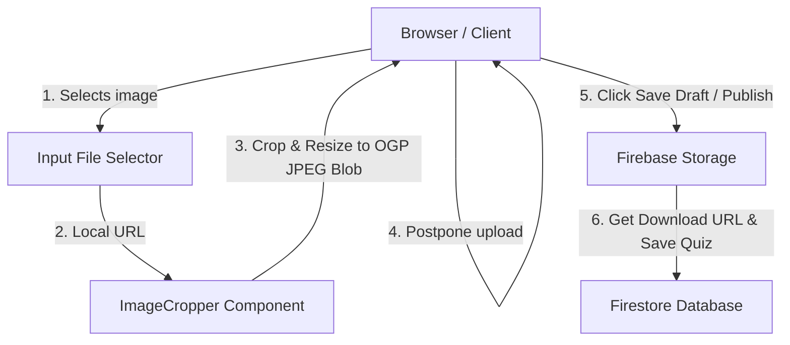
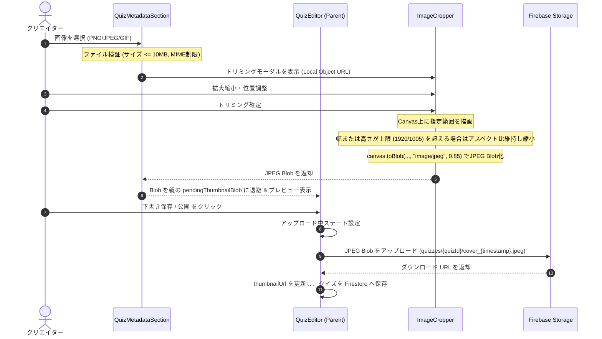

# Design Document: quizetika-quiz-image-upload

## Overview
ユーザー（クリエイター）がクイズを作成・編集する際、自前の画像をローカルからアップロード・トリミング（1.91:1 OGP）し、最大解像度幅1920、高さ1005以下のJPEGに最適化して Firebase Storage へ保存する機能を提供します。

### Goals
- クイズエディタで 1.91:1 (OGP規格) のアスペクト比で直感的に画像をトリミング可能にする。
- トリミング時に最大解像度幅1920、高さ1005以下の制限および JPEG 形式への変換を行い、サイズを 10MB 以下に抑える。
- 既存の AI サムネイル生成機能と競合せずに共存する。

### Non-Goals
- 各設問（クイズ内の個別問題）での画像アップロード対応。
- クイズ一覧以外の画像管理。

---

## Boundary Commitments

### This Spec Owns
- `src/components/ui/image-cropper.tsx` (新規のトリミングモーダルコンポーネント)
- `src/components/quiz/editor/quiz-metadata-section.tsx` (ファイル選択およびトリミングの呼び出しUI)
- クライアントサイドでの画像検証、アスペクト比 1.91:1 (OGP規格) への切り出し、解像度上限制限、JPEG変換ロジック
- Firebase Storage への遅延アップロード処理

> **共有拡張の記録（`quizeum-auth-profile-ui` Phase 31, 2026-07-16）**: `image-cropper.tsx` は本specの所有物として維持しつつ、`quizeum-auth-profile-ui` がアバター円形トリミング用に `aspect` / `cropShape` / `maxWidth` / `maxHeight` / `quality` / `onError` / `confirmTestId` / `cancelTestId` をPropsとして追加する後方互換拡張を行った（全Propsにデフォルト値あり、本specの呼び出し・出力契約は無変更）。本spec側で `image-cropper.tsx` のデフォルト値・呼び出しシグネチャを変更する場合は、`quizeum-auth-profile-ui` の Revalidation Triggers に従い影響有無を確認すること。

### Out of Boundary
- コアのクイズ保存処理（Firestore への `thumbnailUrl` の保存自体は既存のエディタ・コアロジックをそのまま使用する）

### Allowed Dependencies
- `react-easy-crop` (トリミングUI)
- `@radix-ui/react-dialog` (または `src/components/ui/dialog.tsx` などプロジェクトで定義された Dialog プリミティブ)
- `firebase/storage` (SDKによる直接アップロード)

### Revalidation Triggers
- `quizzes/{quizId}/cover` の Storage パス構造の変更

---

## Architecture

本機能は、サーバーレス環境を活かし、クライアントサイドで画像のトリミング・リサイズ・フォーマット変換（JPEG）を行い、Firebase Storage SDK を用いて直接保存するパターンを採用します。さらに、トリミング確定時にはアップロードを行わず一時Object URLを設定し、クイズ全体の保存時に一括してアップロードを行う（遅延アップロード）ことで、余分なアップロード負荷を抑え、10MB制限の確実なクリアを実現します。

### Architecture Pattern & Boundary Map


### Technology Stack
| Layer | Choice / Version | Role in Feature | Notes |
|-------|------------------|-----------------|-------|
| Frontend | React 19.2.4 / Next.js 16.2.6 | UI画面・状態管理 | 既存のクイズエディタ |
| Component | react-easy-crop | 画像のインタラクティブ切り抜き | 新規追加。要 `--legacy-peer-deps` |
| Backend / Storage | Firebase Cloud Storage | 切り抜かれたJPEG画像の保存 | 既存の rules を利用 |

---

## File Structure Plan

### Directory Structure
```
src/
├── components/
│   ├── ui/
│   │   └── image-cropper.tsx      # [NEW] 1.91:1 (OGP) トリミング用モーダルUI
│   └── quiz/
│       └── editor/
│           └── quiz-metadata-section.tsx  # [MODIFY] アップロード動線、モーダル呼び出しの統合
└── services/
    └── storage.ts                  # [MODIFY] サムネイルアップロード関数の追加
```

### Modified Files
* **`src/services/storage.ts`**:
  * クイズカバーのアップロード関数 `uploadQuizCover(file: File | Blob, quizId: string): Promise<string>` を追加。
  * `getQuizCoverPath(quizId, 'jpeg')` により `quizzes/{quizId}/cover_{timestamp}.jpeg` に保存。
* **`src/components/quiz/editor/quiz-metadata-section.tsx`**:
  * サムネイル画像表示エリアのホバー時に「ローカル画像を選択」ボタンを表示し、非表示の `<input type="file" accept="image/png,image/jpeg,image/gif" />` をトリガー。
  * ファイルサイズ検証（10MB以下）および拡張子検証（SVG排除）を適用。
  * `ImageCropper` コンポーネントをインポートし、画像選択時にモーダルを表示。
  * トリミング完了時に返される Blob は、親コンポーネント `quiz-editor.tsx` 側の `pendingThumbnailBlob` 状態に退避。
  * 親コンポーネントが「下書き保存」または「公開」を実行した瞬間に、`uploadQuizCover` を用いて Firebase Storage に遅延アップロードを行い、URLを確定してクイズを保存する。

---

## System Flows

### アップロードおよびトリミングシーケンス


---

## Components and Interfaces

### ImageCropper (`src/components/ui/image-cropper.tsx`) [NEW]
* **Intent**: 選択された画像を 1.91:1 (OGP規格) でトリミングし、上限サイズ以下の JPEG Blob を生成して返却するモーダル。
* **Requirements**: 2.1, 2.2, 2.3, 2.4
* **Contracts**: State [x]

```typescript
export interface ImageCropperProps {
  imageSrc: string; // ローカル画像の Object URL (URL.createObjectURLで生成)
  isOpen: boolean;
  onClose: () => void;
  onCropComplete: (croppedBlob: Blob) => void;
}
```
* **仕様と制約**:
  * モーダル内では `react-easy-crop` を配置し、`aspect={1.91}` を強制。
  * ズーム用スライダーを配置。コンテナサイズに合わせた動的な最小ズーム（minZoom）を設定し、初期状態で画像の横幅がクロップ領域とぴったり一致するように制御する（左右に不要なパン余地を残さない）。
  * 確定ボタンクリック時、Canvas 要素を生成してトリミング範囲をレンダリング。
  * 切り出し後の寸法が `width > 1920` または `height > 1005` の場合、アスペクト比 1.91:1 を保ったまま長辺を最大値（幅1920または高さ1005）に縮小して Canvas 上で再描画する。
  * 最終的に `canvas.toBlob(blob => onCropComplete(blob), 'image/jpeg', 0.85)` により、上限解像度以下の JPEG 形式 Blob を生成してコールバックに返却する。

### QuizMetadataSection (`src/components/quiz/editor/quiz-metadata-section.tsx`) [MODIFY]
* **Intent**: クイズの基本設定用フォームセクション。AI生成とローカルアップロードの統合UIを提供。
* **Requirements**: 1.1, 1.2, 1.3, 1.4, 3.1, 3.2, 3.3, 3.4, 4.1, 4.2, 4.3

* **追加Props**:
```typescript
// QuizMetadataSectionProps に追加されるProps
export interface QuizMetadataSectionProps {
  // ... 既存Props ...
  quizId: string; // Storageの保存パス指定用
  onThumbnailChange: (url: string | null, blob: Blob | null) => void; // 親の thumbnailUrl と Blob を更新するコールバック
}
```
* **実装ノート**:
  * サムネイル画像表示枠（`thumbnailUpload`）の中にホバーUIとして「ファイル選択」をトリガーするボタンを追加。
  * 画像選択ハンドラー内で拡張子チェックおよびサイズチェック（10MB以下）を実行し、合格した場合は `URL.createObjectURL(file)` で一時URLを生成して `ImageCropper` をオープン。
  * `ImageCropper` 確定時に親の `onThumbnailChange` を呼び出し、プレビュー反映と Blob 退避を同時に行う。

---

## Data Models

本スペックでのデータベース構造の変更はありません。クイズドキュメントの既存フィールドである `thumbnailUrl: string | null` にアップロードされた URL が保存されます。

### Storage パス
* 保存パス: `quizzes/{quizId}/cover_{timestamp}.jpeg`
* Content-Type: `image/jpeg`
* 最大サイズ: 10MB以下

---

## Error Handling

### エラーカテゴリと応答 (Requirements 1.3, 1.4, 3.4)
* **画像バリデーションエラー**:
  * ファイルサイズが10MBを超える場合: クイズエディタ内に「ファイルサイズは 10MB 以下にしてください。」とインラインエラーを表示（Requirement 1.3）。
  * 許可されていない拡張子/MIME（SVG等）の場合: 「PNG, JPEG, GIF 形式の画像のみアップロード可能です。」と表示（Requirement 1.4）。
* **Storage アップロードエラー**:
  * ネットワークエラーやStorage書き込み制限による失敗時、「カバー画像のアップロードに失敗したため、クイズを保存できません。」とエラー表示を行い、保存処理を中断して以前の状態を維持。

---

## Testing Strategy

### Unit Tests
* **リサイズ・アスペクト比計算ロジックのテスト**:
  * OGP制限（長辺1920/1005）を超えるサイズ（例：3000x1571）が入力された際、アスペクト比 1.91:1 を維持して 1920x1005 に正しく縮小計算されるかのユニットテスト。
* **ファイルバリデーション関数のテスト**:
  * 10MB以上のサイズ、または `image/svg+xml` MIMEタイプが正しく拒否され、期待されるエラーメッセージが返却されるかのユニットテスト。

### E2E / UI Tests (Playwright)
* **画像選択・モーダル表示・トリミング確定フロー**:
  * ファイル選択UIにてダミーのPNG画像を選択した際、トリミングモーダルが表示されることを検証。
  * モーダルの「確定」をクリックし、画像 URL がプレビューに一時 `blob:` 形式で反映されることを検証。
  * その後、クイズ全体の下書き保存を実行した時点で Firebase Storage へのアップロードが走り、ダッシュボードへ遷移することを検証。
  * 10MBを超えるダミー画像を投入した際、バリデーションエラーが表示されアップロードが中断されることを検証。��は `height > 1080` の場合、アスペクト比 16:9 を保ったまま長辺を最大値（幅1920または高さ1080）に縮小して Canvas 上で再描画する。
  * 最終的に `canvas.toBlob(blob => onCropComplete(blob), 'image/jpeg', 0.85)` により、フルHD以下の JPEG 形式 Blob を生成してコールバックに返却する。

### QuizMetadataSection (`src/components/quiz/editor/quiz-metadata-section.tsx`) [MODIFY]
* **Intent**: クイズの基本設定用フォームセクション。AI生成とローカルアップロードの統合UIを提供。
* **Requirements**: 1.1, 1.2, 1.3, 1.4, 3.1, 3.2, 3.3, 3.4, 4.1, 4.2, 4.3

* **追加Props**:
```typescript
// QuizMetadataSectionProps に追加されるProps
export interface QuizMetadataSectionProps {
  // ... 既存Props ...
  quizId: string; // Storageの保存パス指定用
  onSetThumbnailUrl: (url: string | null) => void; // 親の thumbnailUrl を更新するコールバック
}
```
* **実装ノート**:
  * サムネイル画像表示枠（`thumbnailUpload`）の中にホバーUIとして「ファイル選択」をトリガーするボタンを追加。
  * 画像選択ハンドラー内で `validateQuizCoverFile(file)` を実行し、合格した場合は `URL.createObjectURL(file)` で一時URLを生成して `ImageCropper` をオープン。
  * `ImageCropper` 確定時に `isUploading` を `true` にし、`uploadQuizCover(croppedBlob, quizId)` を実行。完了後に `onSetThumbnailUrl` で親の state を更新する。

---

## Data Models

本スペックでのデータベース構造の変更はありません。クイズドキュメントの既存フィールドである `thumbnailUrl: string | null` にアップロードされた URL が保存されます。

### Storage パス
* 保存パス: `quizzes/{quizId}/cover_{timestamp}.jpeg`
* Content-Type: `image/jpeg`
* 最大サイズ: 2MB未満

---

## Error Handling

### エラーカテゴリと応答 (Requirements 1.3, 1.4, 3.4)
* **画像バリデーションエラー**:
  * ファイルサイズが2MBを超える場合: クイズエディタ内に「画像サイズは2MB以下にしてください。」とトーストまたはインラインエラーを表示（Requirement 1.3）。
  * 許可されていない拡張子/MIME（SVG等）の場合: 「PNG, JPEG, GIF 形式の画像のみアップロード可能です。」と表示（Requirement 1.4）。
* **Storage アップロードエラー**:
  * ネットワークエラーやStorage書き込み制限による失敗時、「サムネイル画像のアップロードに失敗しました。」とエラー表示を行い、ローディングステートを解除（Requirement 3.4）。

---

## Testing Strategy

### Unit Tests
* **リサイズ・アスペクト比計算ロジックのテスト**:
  * FHD制限（長辺1920/1080）を超えるサイズ（例：3000x1687）が入力された際、アスペクト比 16:9 を維持して 1920x1080 に正しく縮小計算されるかのユニットテスト。
* **ファイルバリデーション関数のテスト**:
  * 2MB以上のサイズ、または `image/svg+xml` MIMEタイプが正しく拒否され、期待されるエラーメッセージが返却されるかのユニットテスト。

### E2E / UI Tests (Playwright)
* **画像選択・モーダル表示・トリミング確定フロー**:
  * ファイル選択UIにてダミーのPNG画像を選択した際、トリミングモーダルが表示されることを検証。
  * モーダルの「確定」をクリックし、アップロード中インジケータが表示された後、画像 URL がプレビューに反映されることを検証。
  * 2MBを超えるダミー画像を投入した際、バリデーションエラーが表示されアップロードが中断されることを検証。
