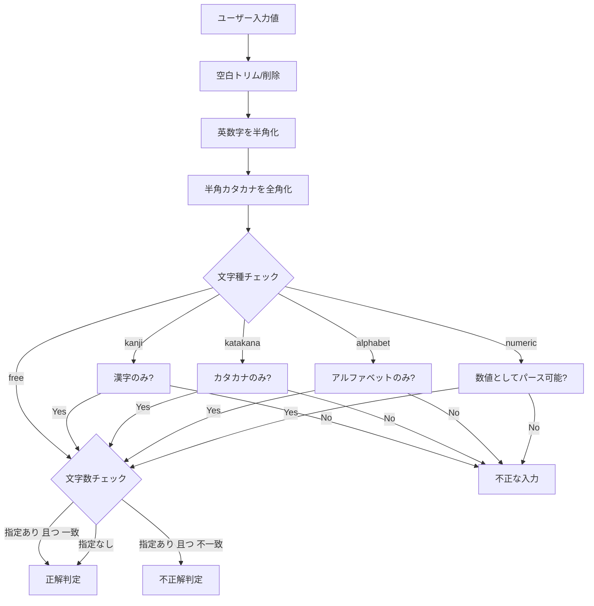

# Technical Design: quizetika-text-validation-enhancement

## Overview
本機能は、記述式（短答）クイズにおける解答の検証仕様を再設計し、文字種（フリー、漢字、カタカナ、アルファベット、数字）およびオプションとしての要求文字数の統合的な制限を可能にします。また、入力値および正解候補に対して自動変換（英数字の半角化、半角カタカナの全角カタカナ化、空白の標準化）を行うことで、表記揺れによる解答不一致を完全に防ぎます。

### Goals
- `textInputMode` を文字種指定として再定義（`free`, `kanji`, `katakana`, `alphabet`, `numeric`）。
- 文字数指定（`textInputCharCount`）をすべての文字種において、オプション（任意）の固定長制限として動作可能にする。
- アルファベット・数字の自動半角変換、半角カタカナから全角カタカナへの自動変換を実装し、エディタとプレイヤーで共有する。
- プレイ画面、テストプレイ画面、復習画面等において、入力制限（最大文字数の適用やキーボードタイプなど）が設定に応じて動的に適用される。

### Non-Goals
- 記述式以外の問題タイプ（選択式、並び替え、連想、水平思考）の検証変更。
- 常用漢字以外の文字の辞書を用いた漢字厳格チェック。

## Boundary Commitments

### This Spec Owns
- 記述式解答の正規化・変換関数（半角カナ→全角カナ、全角英数→半角英数、空白トリム・無視）。
- 各文字種（漢字、カタカナ、アルファベット、数字、フリー）に対するバリデーション正規表現および判定ロジック。
- 要求文字数（固定長一致または指定なし）の検証処理。
- 作問エディタでの新しい文字種選択、文字数設定UI、および保存前バリデーション処理。
- 解答画面（プレイ、テストプレイ、復習）でのインプット属性（`inputMode`, `maxLength`）の適用および正誤判定処理。
- 既存の `'text' | 'numeric' | 'char-count'` を新しい仕様へアップキャストする後方互換マッピング。

### Out of Boundary
- ウミガメのスープ（水平思考クイズ）におけるAI真相判定ロジック。
- 一般的なテキストクローリングや他形式のクイズプレイデータ。

### Allowed Dependencies
- `src/types/index.ts`（型定義）
- `src/services/text-answer-utils.ts`（記述式判定共通ユーティリティ）
- `src/services/quiz-validation.ts`（作問バリデーション）

### Revalidation Triggers
- `TextInputMode` の取りうる文字列の追加や変更。
- 解答判定に影響する正規化・自動変換ルールの変更。

## Architecture

### Existing Architecture Analysis
現在、記述式解答の正誤判定およびインプット属性生成は `text-answer-utils.ts` 内の `isTextInputAnswerCorrect` および `getTextInputFieldProps` で管理されています。
本設計では、これらの関数の中に新しい文字種別の正規化およびバリデーションロジックを統合し、呼び出し側はインターフェースを変更せずに自動的に新仕様へ対応させます。

### Architecture Pattern & Boundary Map



### Technology Stack
- **Frontend / CLI**: React 19, TypeScript
- **Services**: `text-answer-utils.ts`, `quiz-validation.ts`

## File Structure Plan

### Directory Structure
```
src/
├── types/
│   └── index.ts               # [MODIFY] TextInputMode 型の変更
├── services/
│   ├── text-answer-utils.ts   # [MODIFY] 正規化、バリデーション、解答判定、inputProps生成の実装
│   └── quiz-validation.ts     # [MODIFY] 保存前バリデーション（文字種・文字数検証）の更新
├── components/
│   └── quiz/
│       ├── quiz-editor.tsx    # [MODIFY] 文字種・文字数変更用ハンドラーの更新
│       └── editor/
│           └── question-type-editors/
│               └── text-input-editor.tsx  # [MODIFY] 文字種セレクトと文字数入力のUI更新
tests/
└── services/
    └── text-answer-utils.test.ts # [NEW] 新規追加する単体テスト
```

## System Flows
解答時および作問時の文字の正規化・変換処理は、すべて同一のユーティリティ関数 `normalizeTextAnswer` （またはその派生関数）によって一意に行われます。

## Requirements Traceability

| Requirement | Summary | Components | Interfaces | Flows |
|-------------|---------|------------|------------|-------|
| 1.1 | 英数字の自動半角変換 | `text-answer-utils` | `toHalfWidthAlphanumeric` | Mermaid Flow |
| 1.2 | カタカナの半角→全角変換 | `text-answer-utils` | `toFullWidthKatakana` | Mermaid Flow |
| 1.3 | 空白（スペース）の除去と無視 | `text-answer-utils` | `normalizeTextAnswer` | Mermaid Flow |
| 1.4 | 作問エディタでの自動変換適用 | `text-answer-utils`, `text-input-editor` | `normalizeTextAnswer` | |
| 2.1 | 漢字のみのバリデーション | `text-answer-utils`, `quiz-validation` | `isTextInputAnswerCorrect` | Mermaid Flow |
| 2.2 | カタカナのみのバリデーション | `text-answer-utils`, `quiz-validation` | `isTextInputAnswerCorrect` | Mermaid Flow |
| 2.3 | アルファベットのみのバリデーション | `text-answer-utils`, `quiz-validation` | `isTextInputAnswerCorrect` | Mermaid Flow |
| 2.4 | 数字のみのバリデーション | `text-answer-utils`, `quiz-validation` | `isTextInputAnswerCorrect`, `parseNumericAnswer` | Mermaid Flow |
| 2.5 | 要求文字数の固定長一致判定 | `text-answer-utils`, `quiz-validation` | `isTextInputAnswerCorrect` | Mermaid Flow |
| 2.6 | 要求文字数の指定なし（制限なし） | `text-answer-utils`, `quiz-validation` | `isTextInputAnswerCorrect` | Mermaid Flow |
| 3.1 | エディタでの文字種選択UI | `text-input-editor`, `quiz-editor` | `TextInputEditor` | |
| 3.2 | エディタでの文字数入力UIの常時表示 | `text-input-editor` | `TextInputEditor` | |
| 3.3 | エディタでの文字数クリアの許容 | `quiz-editor` | `handleTextInputCharCountChange` | |
| 3.4 | 作問保存時の入力制限バリデーション | `quiz-validation` | `validateQuiz` | |
| 4.1 | 数字モードでの `inputMode="decimal"` 適用 | `text-answer-utils`, 解答UI | `getTextInputFieldProps` | |
| 4.2 | 文字数指定時の `maxLength` 制限適用 | `text-answer-utils`, 解答UI | `getTextInputFieldProps` | |
| 4.3 | 文字数指定時のプレースホルダー自動変更 | `text-answer-utils`, 解答UI | `getTextInputFieldProps` | |

## Components and Interfaces

### Services

#### `text-answer-utils`

| Field | Detail |
|-------|--------|
| Intent | 記述式解答の正規化、半角・全角変換、正誤判定、UIプロパティ生成 |
| Requirements | 1.1, 1.2, 1.3, 1.4, 2.1, 2.2, 2.3, 2.4, 2.5, 2.6, 4.1, 4.2, 4.3 |

**Responsibilities & Constraints**
- 英数字の半角化、半角カナの全角カナ化、空白除去。
- 漢字、カタカナ、アルファベット、数字（マイナス・小数含む）の正規表現による検証。
- 指定された要求文字数（固定長）との完全一致検証。
- 既存の `'text' | 'numeric' | 'char-count'` を新仕様に変換する `resolveTextInputMode` の後方互換対応。

**Contracts**: Service [x] / API [ ] / Event [ ] / Batch [ ] / State [ ]

##### Service Interface
```typescript
export type TextInputMode = 'free' | 'kanji' | 'katakana' | 'alphabet' | 'numeric';

export function resolveTextInputMode(question: Pick<Question, 'textInputMode'>): TextInputMode;

export function toHalfWidthAlphanumeric(str: string): string;

export function toFullWidthKatakana(str: string): string;

export function normalizeTextAnswer(input: string, mode?: TextInputMode): string;

export function isTextInputAnswerCorrect(
  rawInput: string,
  question: Pick<Question, 'correctTextAnswerList' | 'textInputMode' | 'textInputCharCount'>
): boolean;

export function getTextInputFieldProps(
  question: Pick<Question, 'textInputMode' | 'textInputCharCount'>,
  options?: { placeholder?: string }
): {
  type: 'text';
  inputMode?: 'text' | 'decimal';
  maxLength?: number;
  minLength?: number;
  placeholder: string;
};
```

---

#### `quiz-validation`

| Field | Detail |
|-------|--------|
| Intent | クイズ作成・保存時の入力バリデーション |
| Requirements | 2.1, 2.2, 2.3, 2.4, 2.5, 2.6, 3.4 |

**Responsibilities & Constraints**
- 記述式問題において、設定された文字種（漢字、カタカナ、アルファベット、数字）に正解候補テキストが違反していないかのチェック。
- 設定された要求文字数（1〜100）と、全正解候補テキストの文字数が一致しているかのチェック。

**Contracts**: Service [x]

---

### UI Components

#### `TextInputEditor`

| Field | Detail |
|-------|--------|
| Intent | 作問エディタ内の記述式問題用設定・正解候補入力フォーム |
| Requirements | 1.4, 3.1, 3.2, 3.3 |

**Responsibilities & Constraints**
- 入力文字種をトグルグループ（フリー、漢字、カタカナ、アルファベット、数字）で選択可能にする。
- 選択された文字種に関わらず、要求文字数の入力欄を常に表示する。
- ユーザーが文字数を空欄にした場合は、文字数指定なし（制限なし）とする。

#### `QuizPlayClient` / `TestPlayClient` / `ReviewClient`
- `getTextInputFieldProps(question)` から返された `maxLength`, `inputMode`, `placeholder` を `<input>` 要素にそのまま渡し、UIに反映します。

## Data Models
データモデルのスキーマ（PostgreSQLテーブル定義など）には変更はありません。既存の `questions.text_input_mode`（`TEXT` 型）および `questions.text_input_char_count`（`INTEGER` 型）をそのまま利用します。

## Error Handling

### User Errors
- エディタで文字種・文字数制限に合致しない正解候補を入力した場合、即座にバリデーションエラー（「漢字のみで入力してください」「文字数が一致しません」など）を表示し、保存ボタンを無効化します。
- 実際の回答画面では、文字数制限（`maxLength`）によって要求文字数以上の入力を防止します。

## Testing Strategy

### Unit Tests
- `tests/services/text-answer-utils.test.ts` を新規作成し、以下のケースを検証：
  1. `toHalfWidthAlphanumeric` による全角英数字→半角変換
  2. `toFullWidthKatakana` による半角カタカナ→全角変換
  3. 各 `TextInputMode` における `normalizeTextAnswer` の正規化結果
  4. 各 `TextInputMode` および文字数制限設定下における `isTextInputAnswerCorrect` の正誤判定（小数・マイナス含む）
  5. `getTextInputFieldProps` から生成される `inputMode`, `maxLength`, `placeholder` の妥当性

### Integration Tests
- エディタバリデーション（`quiz-validation.ts`）に対して、不正な形式（カタカナモードに漢字が含まれるなど）の正解候補を設定した際、バリデーションエラーが正しく返されることを確認するテスト。
