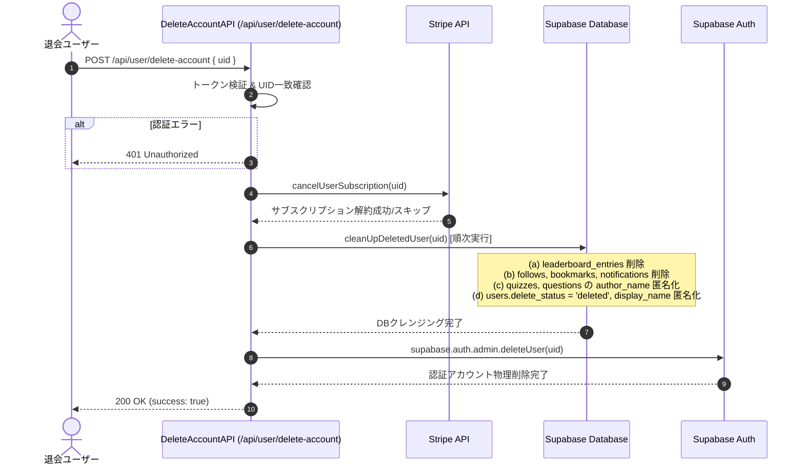

# Design Document: quizeum-account-deletion-cleansing

## Overview
本機能は、ユーザーが退会を要求した際に、そのユーザーが作成したクイズや問題をプラットフォーム上に安全に残しつつ、個人情報を匿名化し、不要な関連データを同期的に削除するクレンジングシステムを提供します。

### Goals
- ユーザー退会時に、作成されたクイズおよび問題を CASCADE 消失させることなく維持する。
- 退会ユーザーの表示名、メールアドレス、アバター、自己紹介などの個人情報を確実に匿名化する。
- 該当ユーザーのリーダーボードエントリー、および不要なソーシャルデータ（フォロー、ブックマーク、通知）を完全に削除する。
- 同一APIリクエストのフロー内で、データベースのクレンジングと Supabase Auth アカウントの物理削除を完結させる。

### Non-Goals
- 退会ユーザーのプレイ履歴（attempts）の削除（システム統計および整合性のために残存させます）。
- 管理者画面におけるBAN処理の変更。

## Boundary Commitments

### This Spec Owns
- `users.delete_status` チェック制約を変更する SQL マイグレーション。
- 退会 API `/api/user/delete-account` のクレンジング処理統合のための機能拡張。
- `UserService` における関連データの削除および匿名化更新ロジック (`cleanUpDeletedUser`)。
- Supabase Auth からのユーザーアカウントの物理削除処理。

### Out of Boundary
- Stripe 側の顧客アカウントそのものの削除（サブスクリプション解約のみを実行し、Stripeの顧客データ自体は Stripe 側に任せます）。
- プレイ履歴（attempts）データのクレンジング。

### Allowed Dependencies
- Supabase Server Admin Client (`createAdminClient`)
- Stripe API (`cancelUserSubscription`)

### Revalidation Triggers
- `users` テーブルまたは `quizzes` テーブルのキャッシュ構造の変更。
- Supabase Auth 関連の API コールバックや認証構成の変更。

## Architecture

### Existing Architecture Analysis
退会処理は現在 `/api/user/delete-account` API エンドポイントにて実行されています。既存の実装では、認証情報（Access Token）の検証後に Stripe サブスクのキャンセルを行い、データベースの `users.delete_status` を `'delete_pending'` に変更するのみで処理を終了しています。
本設計では、この API の処理フローを拡張し、`UserService` に新設するクレンジング処理を呼び出し、DB更新・削除が全て完了した段階で最後に Supabase Auth からアカウントを削除するように変更します。

### Technology Stack
| Layer | Choice / Version | Role in Feature | Notes |
|-------|------------------|-----------------|-------|
| Backend / Services | Next.js API Routes | `/api/user/delete-account` エンドポイントの拡張 | `src/app/api/user/delete-account/route.ts` |
| Data / Storage | Supabase (PostgreSQL) | クレンジング用 SQL クエリの実行および制約変更 | `src/services/user.ts` およびマイグレーション |
| Infrastructure / Runtime | Supabase Auth | Admin API を用いたユーザーアカウント物理削除 | `supabase.auth.admin.deleteUser` の実行 |

## File Structure Plan

### Modified Files
- `src/app/api/user/delete-account/route.ts` — Stripe解約完了後、`UserService.cleanUpDeletedUser` によるクレンジングを呼び出し、最後に Supabase Auth からユーザーを削除するように拡張します。
- `src/services/user.ts` — `cleanUpDeletedUser(uid)` サービス関数を追加し、関連データの削除および匿名化更新を一括して実行します。
- `src/types/index.ts` — `User` 型の `deleteStatus` プロパティの定義に `'deleted'` を追加します。
- `tests/api/delete-account.test.ts` — 新しいクレンジングおよび Auth 削除の同期フローを検証するテストを追加します。

### New Files
- `supabase/migrations/20260722000000_update_delete_status_check.sql` — `users.delete_status` のチェック制約を更新し、`'deleted'` を許容する移行スクリプト。

## System Flows



## Requirements Traceability

| Requirement | Summary | Components | Interfaces | Flows |
|-------------|---------|------------|------------|-------|
| 1.1 | サブスク解約 | DeleteAccountAPI | `cancelUserSubscription` | 4, 5 |
| 1.2 | データクレンジングとステータス更新 | UserService | `cleanUpDeletedUser` | 6, 7 |
| 1.3 | Authアカウント物理削除 | DeleteAccountAPI | `deleteUser` | 8, 9 |
| 2.1 | クイズの匿名化 | UserService | `cleanUpDeletedUser` (quizzes) | 7 |
| 2.2 | 問題の匿名化 | UserService | `cleanUpDeletedUser` (questions) | 7 |
| 3.1 | リーダーボード削除 | UserService | `cleanUpDeletedUser` (leaderboard) | 7 |
| 4.1 | プロフィール情報のクリア | UserService | `cleanUpDeletedUser` (users display_name, etc.) | 7 |
| 4.2 | メールアドレスのダミー化 | UserService | `cleanUpDeletedUser` (users email) | 7 |
| 4.3 | フォロー関係の削除 | UserService | `cleanUpDeletedUser` (follows) | 7 |
| 4.4 | ブックマークの削除 | UserService | `cleanUpDeletedUser` (bookmarks) | 7 |
| 4.5 | 通知の削除 | UserService | `cleanUpDeletedUser` (notifications) | 7 |
| 5.1 | DB処理のエラーハンドリング | DeleteAccountAPI / UserService | `cleanUpDeletedUser` (try-catch) | 6-7 |
| 5.2 | Auth削除エラーのログ記録 | DeleteAccountAPI | `deleteUser` (try-catch) | 8-9 |

## Components and Interfaces

### DeleteAccountAPI
| Field | Detail |
|-------|--------|
| Intent | 退会リクエストを受け取り、サブスク解約、DBクレンジング、Auth削除のフローを同期的に制御する |
| Requirements | 1.1, 1.2, 1.3, 5.1, 5.2 |

**Contracts**: API [x] / Service [ ]

##### API Contract
| Method | Endpoint | Request | Response | Errors |
|--------|----------|---------|----------|--------|
| POST | `/api/user/delete-account` | `{ uid: string }` | `{ success: true }` | 400 (missing-uid), 401 (unauthorized), 500 (internal-error) |

---

### UserService
| Field | Detail |
|-------|--------|
| Intent | 対象ユーザーの全関連データの削除および個人情報の匿名化更新をデータベースに対して実行する |
| Requirements | 1.2, 2.1, 2.2, 3.1, 4.1, 4.2, 4.3, 4.4, 4.5, 5.1 |

**Contracts**: Service [x] / API [ ]

##### Service Interface
```typescript
/**
 * 退会済みユーザーのデータを安全にクレンジングおよび匿名化する
 * @param uid 対象ユーザーのUID
 */
export async function cleanUpDeletedUser(uid: string): Promise<void>;
```
- **Preconditions**:
  - `uid` が有効な文字列であり、対象ユーザーがデータベース上に存在すること。
  - 管理者権限（Admin Client）を使用して実行されること。
- **Postconditions**:
  - `leaderboard_entries` から該当ユーザーのエントリーが削除される。
  - `follows`（フォロー・被フォロー関係）、`bookmarks`、`notifications` から該当ユーザーのレコードが削除される。
  - `quizzes` および `questions` の `author_name` が `'退会済ユーザー'` に、`author_avatar` が `null` に更新される。
  - `users` の `display_name` が `'退会済ユーザー'` に、`email` が `deleted_${uid}@example.com` に更新され、その他の個人情報フィールドが初期化され、`delete_status` が `'deleted'` になる。

## Data Models

### Physical Data Model (Migration)
#### `supabase/migrations/20260722000000_update_delete_status_check.sql`
```sql
-- users テーブルの delete_status チェック制約を更新し、'deleted' を許容するように変更
ALTER TABLE users DROP CONSTRAINT IF EXISTS users_delete_status_check;
ALTER TABLE users ADD CONSTRAINT users_delete_status_check CHECK (delete_status IN ('active', 'delete_pending', 'deleted'));
```

### TypeScript 型定義の変更
`src/types/index.ts` の `User` インターフェース定義を変更します。
```typescript
export interface User {
  // ...既存のプロパティ
  deleteStatus: 'active' | 'delete_pending' | 'deleted'; // 'deleted' を追加
  // ...既存のプロパティ
}
```

## Error Handling

### Error Strategy
API内の処理フローにおいて、Stripeの解約処理がエラーとなった場合でも、DBのクレンジング処理は続行します（すでに実装されている仕様を踏襲）。
しかし、DBクレンジング処理（`cleanUpDeletedUser`）でエラーが発生した場合は、重大なデータ不整合（Auth側は消えたがDBは匿名化されていない、など）を防ぐため、**処理を即座に中断（ロールバック）し、Auth削除を実行せずに 500 エラーを返します**。

### Monitoring
DBクレンジングの失敗、および Auth 側のアカウント削除の失敗時には、エラー情報を詳細に `console.error` でログ出力し、管理者が検知・手動修正できるようにします。

## Testing Strategy

### Unit / Integration Tests
`tests/api/delete-account.test.ts` を拡張し、以下のテストケースを追加します：
- **Stripe解約成功時、クレンジングが実行され、最終的に Auth ユーザーが削除されること**:
  - `cancelUserSubscription` が呼ばれること。
  - `UserService.cleanUpDeletedUser` が呼ばれること。
  - `supabase.auth.admin.deleteUser` が正しい `uid` で呼ばれること。
- **DBクレンジング処理でエラーが発生した場合、APIが 500 エラーを返し、Auth 削除が実行されないこと**:
  - `cleanUpDeletedUser` がエラーをスローしたとき、`deleteUser` が呼び出されないことを検証。
- **Auth 削除が失敗した場合、APIは失敗エラーをログ出力しつつ、適切なレスポンスまたは500エラーを返すこと**。
