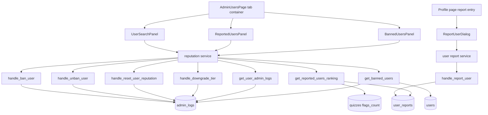
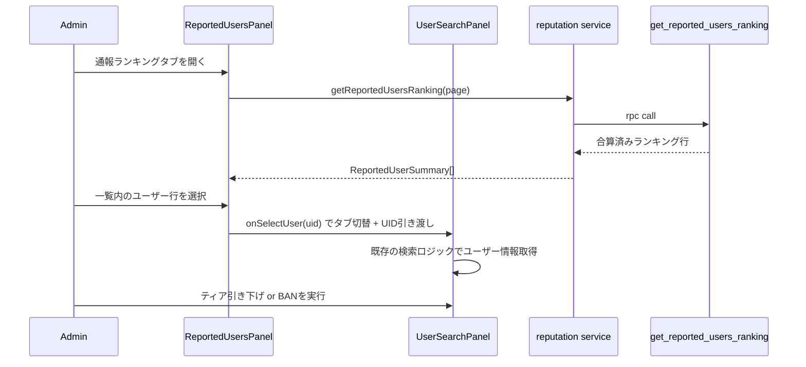
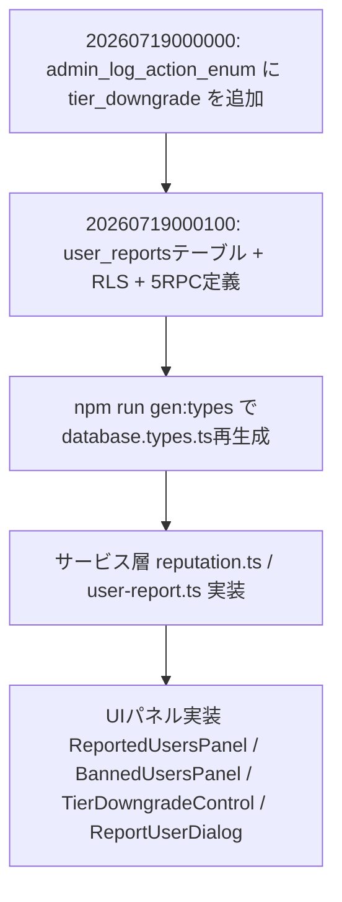

# Design Document: quizeum-admin-users-ui（BAN機能見直し）

> **注記（2026-07-12）**: 本ドキュメントは初版（Firebase/Firestore前提）から、プロジェクト全体のSupabase移行完了（`.kiro/steering/tech.md`、`supabase-cleanup`）および今回のBAN機能見直しに合わせて全面的に書き換えたものである。旧版のFirestore/Firebase Admin SDKに関する記述は、実装済みの現行コード（`src/services/reputation.ts` 等がSupabase RPCを使用）と一致しないため置き換えている。

## Overview

本設計は、既存の `/admin/users` 画面（UID単発検索によるリセット/BAN/UNBAN、`/banned` 停止画面）を、通報数が多いユーザーを能動的に発見し、段階的な処分（ティア引き下げ）を行い、誤BANを速やかに是正できる管理ツールへと拡張する。

**Purpose**: 管理者が「誰が問題を起こしているか」を待ち受け型（UID検索）ではなく発見型（通報ランキング）で把握し、全リセットに限らない柔軟な処分（ティア引き下げ）と、誤操作からの迅速な復旧（BAN一覧・解除）を行えるようにする。
**Users**: システム管理者（`role === 'admin'`）が本機能一式を使用する。一般ユーザーは新設される「ユーザー直接通報」機能の送信者としてのみ関与する。
**Impact**: `/admin/users` を単一フォーム画面からタブ構成の複合画面へ変更する。新規テーブル `user_reports`、新規RPC 5種、`admin_log_action_enum` への値追加を伴う。既存のRequirement 1–6（検索・リセット・BAN/UNBAN・`/banned`画面）の挙動・契約は変更しない。Requirement 7（非同期表示最適化）は要件として承認済みだが、現行コードには未実装（ページ全体ローディングのみ、監査ログ履歴リスト自体も未実装）であることがタスク生成時の調査で判明したため、本specの範囲内で新規実装する。

### Goals
- 既存の検索・リセット・BAN/UNBAN・`/banned`画面の契約を、現行実装（Supabase RPC + RLS）どおりに正しく記録する
- 通報数（クイズ通報合算＋ユーザー直接通報）順にユーザーを一覧表示し、行選択から既存の詳細操作へシームレスに遷移できるようにする
- モデレータティアーを、全リセットに限らず任意の下位ティアへ直接変更できるようにする
- BAN済みユーザーをBAN日時・キーワードで絞り込み、一覧から直接UNBANできるようにする
- `/admin/users` および `/banned` 画面に、承認済みだが未実装だったRequirement 7（セクション単位のスケルトン表示、監査ログ履歴リスト表示）を実装する

### Non-Goals
- ユーザー直接通報・クイズ通報の個別審査ワークフロー（承認/却下の詳細画面）は対象外（引き続き `quizeum-moderation-governance-ui` 等の領域）
- 通報数のしきい値到達による自動処罰（自動BAN・自動ティア変更）は対象外。すべて管理者の手動操作のみ
- ユーザーの物理削除、過去投稿コンテンツの遡及的な非公開化は対象外

## Boundary Commitments

### This Spec Owns
- `/admin/users` 画面のタブ構成（UID検索・通報ランキング・BAN管理）とその中で完結するUI状態
- `/api/admin/users/{reset,ban,unban,downgrade-tier}` および `/api/users/report` エンドポイントの認可ガードおよび実行ロジック
- `admin_logs` テーブルへの書込み（既存の `reputation_reset`/`ban`/`unban` に加え、新規 `tier_downgrade` アクション）
- `src/services/reputation.ts` の `resetUserReputation` / `banUser` / `unbanUser`（既存、無変更）および新規 `downgradeUserTier` / `getReportedUsersRanking` / `getBannedUsers` / `getUserAdminLogs`
- ユーザー直接通報の受付経路（新規RPC `handle_report_user`、新規テーブル `user_reports`）とその重複防止ロジック
- 通報数ランキング集計（クイズ通報合算＋直接通報合算）を返す新規RPC `get_reported_users_ranking`
- BAN済みユーザー一覧（実行者情報を含む）を返す新規RPC `get_banned_users`、対象ユーザーの監査ログ履歴を返す新規RPC `get_user_admin_logs`（いずれも `admin_logs` がクライアントSELECT不可のため必須）
- アカウント停止状態をユーザーに通知する `/banned` 画面のUI（既存の遮断ロジックは無変更、表示部分にRequirement 7のスケルトン化を新規実装）
- `/admin/users` 各セクション（検索結果、監査ログ、通報ランキング、BAN一覧）および `/banned` 画面のセクション単位スケルトン表示（Requirement 7、未実装だったため新規実装）
- `admin_log_action_enum` への `tier_downgrade` 値追加

### Out of Boundary
- クイズ単位の通報受付・審査キュー処理そのもの（`flagContent` / `resolveFlag` / `quizeum-moderation-governance-ui` の既存領域、変更しない）
- ユーザー直接通報・クイズ通報の内容審査（却下/是正等の詳細ワークフロー）
- `quizzes_read` RLSポリシーの一般的な見直し（本設計は通報数集計RPC内でのみ `SECURITY DEFINER` によりこの制約を回避する。ポリシー自体の変更は行わない）
- BANユーザーのアクセス遮断機構自体（`/banned` 画面へのミドルウェアリダイレクト、`is_not_banned()`）— 既存のまま、無変更
- ユーザー自身が実行するプロフィール編集（`quizeum-auth-profile-ui` が所有）

### Allowed Dependencies
- `is_admin()` / `is_moderator_or_admin()`（`governance_normalization.sql` で定義済み）を新規RPCの権限チェックに使用する
- 既存の `admin_logs` テーブルとその書込規約（`SECURITY DEFINER` RPC経由のみ）を新規アクション（`tier_downgrade`）にも適用する
- 既存の `users.is_banned` / `banned_reason` / `banned_at` / `moderation_tier` カラムをそのまま参照する（新規カラム追加なし）
- `quizzes.flags_count` を通報数集計の入力として参照する（読み取りのみ、書込みは行わない）
- ミドルウェア（`src/middleware.ts`）・`AuthContext`（`src/context/auth-context.tsx`）によるBAN検知と `/banned` へのリダイレクト機構（既存、無変更）

### Revalidation Triggers
- `admin_log_action_enum` の値構成が変わる場合、監査ログを消費する他機能（監査ログ閲覧UI等）に影響しないか確認が必要
- `moderation_tier_enum` の段階構成（現在4値: newcomer/contributor/moderator/senior_moderator）が変わる場合、Requirement 10 のティア引き下げ選択肢ロジックを見直す必要がある
- `quizzes.flags_count` のセマンティクス（増減タイミング、`resolveFlag`によるリセット挙動）が変わる場合、Requirement 9 の集計結果に影響する

## Architecture

### Existing Architecture Analysis

- `/admin/users` は現在単一のクライアントコンポーネント（`page.tsx`）で、UID検索→アクションの単線フローのみを扱う。
- すべての特権書込み操作（リセット/BAN/UNBAN）は `src/services/reputation.ts` の薄いラッパーから `SECURITY DEFINER` のPostgreSQL RPC（`handle_reset_user_reputation` / `handle_ban_user` / `handle_unban_user`）を呼び出す設計に統一されている。クライアントからのテーブル直接書込みは行われない。
- `users` テーブルの `users_read` RLSポリシーは `USING (TRUE)` であり、全ユーザーが横断SELECT可能。一方 `quizzes_read` は `published` かつ `public`、または著者本人／フォロワーに限定されており、`is_admin()` による例外が存在しない。既存の `/admin/moderation` 画面がクライアントから直接 `suspended` クイズをクエリしている箇所は、このRLS制約の影響を受ける可能性があるが、本specの対象外として記録に留める（`research.md` 参照）。
- `admin_logs` テーブルは `admin_logs_policy ON admin_logs FOR ALL USING (FALSE)` によりクライアントからのSELECTも含め完全に遮断されている。監査ログを参照する機能（BAN済み一覧の実行者表示、監査ログ履歴リスト）はすべて `SECURITY DEFINER` RPC経由が必須となる。
- BANユーザーの即時遮断は、`middleware.ts` の Cookie判定と `AuthContext` の `isBanned` 監視、および各テーブルの RLS 上の `is_not_banned()` チェックによる多重防衛で実現済み（無変更）。

### Architecture Pattern & Boundary Map



**Architecture Integration**:
- Selected pattern: 既存の「UI → 薄いサービスラッパー → `SECURITY DEFINER` RPC → テーブル」の3層パターンをそのまま延長する
- Domain/feature boundaries: 検索/ランキング/BAN一覧はそれぞれ独立したパネルコンポーネントとして分離し、共通の「選択中ユーザー」状態のみを `AdminUsersPage` にリフトアップして共有する（Option C: ハイブリッド、`research.md` 参照）
- Existing patterns preserved: `ConfirmActionDialog` によるアクション確認、10文字以上の理由必須バリデーション、`admin_logs` への監査ログ記録、API Route + Bearerトークン検証の二重防御
- New components rationale: `admin_logs` はRLSで `USING (FALSE)`（クライアントSELECT不可）、`quizzes_read` は `suspended`/非公開行を隠すため、通報ランキング・BAN一覧・監査ログ履歴のいずれもクライアント直接クエリでは実現できず、5種すべて `SECURITY DEFINER` RPCとして設計する
- Steering compliance: 二重検証（フロント=UX、実処理=RLS/RPC）、`src/services/*.ts` 単一責任、`@/*` 絶対パスインポートを維持

### Technology Stack

| Layer | Choice / Version | Role in Feature | Notes |
|-------|------------------|-----------------|-------|
| Frontend | Next.js 16 App Router / React 19 | `/admin/users` タブUI、`ReportUserDialog`、`/banned` 画面（既存） | 既存 `shadcn/ui` の `Tabs`（`src/components/ui/tabs.tsx`）を採用。`community/merge/page.tsx` と同型のタブ構成パターンを踏襲 |
| Backend | Next.js API Routes | `/api/admin/users/{reset,ban,unban,downgrade-tier}`, `/api/users/report` | 既存 `route.ts` の Bearer検証パターンを踏襲 |
| Data / Storage | Supabase PostgreSQL | `users` / `quizzes` / `admin_logs`（既存）、`user_reports`（新規）、新規RPC5種（`handle_report_user`, `handle_downgrade_tier`, `get_reported_users_ranking`, `get_banned_users`, `get_user_admin_logs`）、`admin_log_action_enum` 拡張 | `SECURITY DEFINER` RPCパターンを踏襲。新規ORM/権限ライブラリの導入なし |
| Runtime prerequisite | Supabase CLI（`npm run gen:types`） | マイグレーション適用後の型再生成 | ローカル `supabase start` 起動中に実行 |

## File Structure Plan

### Directory Structure
```
src/
├── app/
│   ├── admin/users/
│   │   ├── page.tsx                          # 変更: タブコンテナ化（既存の検索ロジックはpanelへ移動）
│   │   ├── admin-user-search-panel.tsx        # 新規: 既存の検索/リセット/BAN/UNBAN/新規ティア引き下げロジック
│   │   ├── admin-reported-users-panel.tsx     # 新規: 通報ランキング一覧（Requirement 9）
│   │   └── admin-banned-users-panel.tsx       # 新規: BAN済み一覧・フィルタ・解除（Requirement 11）
│   ├── banned/page.tsx                        # 既存、無変更（Requirement 6）+ スケルトン新規実装（Requirement 7）
│   ├── api/admin/users/
│   │   ├── reset/route.ts                     # 既存、無変更
│   │   ├── ban/route.ts                       # 既存、無変更
│   │   ├── unban/route.ts                     # 既存、無変更
│   │   └── downgrade-tier/route.ts            # 新規: ティア引き下げAPI（Requirement 10）
│   └── api/users/
│       └── report/route.ts                    # 新規: ユーザー直接通報API（Requirement 8）
├── components/
│   ├── admin/
│   │   ├── confirm-action-dialog.tsx          # 既存、無変更（再利用）
│   │   └── tier-downgrade-control.tsx         # 新規: 下位ティア選択ドロップダウン + 確認フロー
│   └── profile/
│       └── report-user-dialog.tsx             # 新規: `report-modal.tsx` と同型のユーザー通報ダイアログ
├── services/
│   ├── reputation.ts                          # 変更: downgradeUserTier / getReportedUsersRanking / getBannedUsers / getUserAdminLogs を追加（サーバー専用クライアント使用、API Route専用）
│   ├── reputation-client.ts                   # 新規（実装時追加）: getReportedUsersRanking / getBannedUsers / getUserAdminLogs / unbanUser のブラウザクライアント版。
│   │                                           #   reputation.tsはnext/headers依存のサーバークライアントを使うため、クライアントコンポーネント
│   │                                           #   （admin-user-search-panel.tsx等）から直接importするとnext buildが失敗する。読み取り系3関数と
│   │                                           #   unbanUserのクライアント向け複製をこのファイルに分離し、3パネルはここからimportする。
│   └── user-report.ts                         # 新規: submitUserReport（handle_report_user RPC呼び出し）
└── types/
    └── index.ts                               # 変更: UserReport, ReportedUserSummary, BannedUserSummary, AdminLogEntry 型を追加

supabase/migrations/
├── 20260719000000_admin_log_action_enum_tier_downgrade.sql   # 新規: enum値追加のみ（別トランザクション）
└── 20260719000100_user_reports_and_ranking.sql                # 新規: user_reportsテーブル、RLS、5種のRPC定義（handle_report_user, handle_downgrade_tier, get_reported_users_ranking, get_banned_users, get_user_admin_logs）
```

### Modified Files
- `src/app/admin/users/page.tsx` — 既存の検索フォーム実装を `AdminUserSearchPanel` に移し、`Tabs`（検索/通報ランキング/BAN管理）の器とし、`selectedUid` を状態としてリフトアップして各パネルに `onSelectUser` として渡す
  - **回帰防止の制約**: `e2e/admin-users.spec.ts` が依存する既存の `id`/`data-testid` 属性（`execute-reset-btn`, `execute-ban-btn`, `execute-unban-btn` 等）は、`AdminUserSearchPanel` への移設時に一切変更しない。属性値・DOM上の意味を維持したままファイルのみを移動する
- `src/app/profile/[uid]/profile-client.tsx` — 「ユーザーを通報」ボタンと `ReportUserDialog` の呼び出しを追加（自分自身のプロフィールでは非表示）
- `src/services/reputation.ts` — 新規関数4つ（`downgradeUserTier` / `getReportedUsersRanking` / `getBannedUsers` / `getUserAdminLogs`）を追加。既存の `resetUserReputation` / `banUser` / `unbanUser` は無変更
- `src/types/index.ts` — 新規型を追加。既存 `User` 型は無変更
- `src/lib/supabase/database.types.ts` — `npm run gen:types` により自動再生成（手動編集しない）

## System Flows

### 通報ランキング表示からアクション実行までのフロー



- `get_reported_users_ranking` は `SECURITY DEFINER` として実行され、呼び出し元が `is_admin()` でない場合は `permission-denied` を返す（既存RPCと同じエラー規約）。
- タブ切替時、`AdminUsersPage` が `selectedUid` を保持し、`SearchPanel` は `selectedUid` の変更を検知して自動的に検索を実行する（Requirement 9.7）。

## Requirements Traceability

| Requirement | Summary | Components | Interfaces | Flows |
|-------------|---------|------------|------------|-------|
| 1.1, 1.2 | アクセス制限 | AdminUsersPage | — | 既存（無変更） |
| 2.1, 2.2 | UID検索・表示 | UserSearchPanel | `getUserProfile` | 既存（無変更） |
| 3.1–3.4 | 手動リセット・監査ログ | UserSearchPanel, reputation service | `resetUserReputation` | 既存（無変更） |
| 4.1, 4.2 | 管理用ナビゲーション | AdminUsersPage | — | 既存（無変更） |
| 5.1–5.5 | BAN/UNBAN | UserSearchPanel, reputation service | `banUser`, `unbanUser` | 既存（無変更） |
| 6.1–6.3 | `/banned` 画面・即時遮断 | `/banned` page, middleware, AuthContext | — | 既存（無変更） |
| 7.1–7.10 | 非同期表示最適化・監査ログ履歴表示 | AdminUsersPage, UserSearchPanel, `/banned` page, reputation service | `getUserAdminLogs` → `get_user_admin_logs` | 未実装（現行コードはページ全体のローディング表示のみで、セクション単位のスケルトンおよび監査ログ履歴リスト自体が存在しない。本specで新規実装する） |
| 8.1–8.6 | ユーザー直接通報 | ReportUserDialog, user-report service | `submitUserReport` → `handle_report_user` | — |
| 9.1–9.9 | 通報数上位ユーザー一覧 | AdminReportedUsersPanel, reputation service | `getReportedUsersRanking` → `get_reported_users_ranking` | 通報ランキング表示フロー |
| 10.1–10.7 | ティア段階的引き下げ | TierDowngradeControl, reputation service | `downgradeUserTier` → `handle_downgrade_tier` | 通報ランキング表示フロー（行選択後） |
| 11.1–11.9 | BAN済み一覧・検索・フィルタ・解除 | AdminBannedUsersPanel, reputation service | `getBannedUsers` → `get_banned_users`, `unbanUser` | — |

## Components and Interfaces

| Component | Domain/Layer | Intent | Req Coverage | Key Dependencies (P0/P1) | Contracts |
|-----------|--------------|--------|--------------|--------------------------|-----------|
| AdminUsersPage | UI | タブコンテナ、選択中UIDの状態管理、`admin`ロールガード | 1, 4, 9.7 | UserSearchPanel (P0), ReportedUsersPanel (P0), BannedUsersPanel (P0) | State |
| UserSearchPanel | UI | 既存検索/リセット/BAN/UNBAN/新規ティア引き下げのフォーム群、対象ユーザーの監査ログ履歴リスト表示（新規、Requirement 7の前提として必要） | 2, 3, 5, 7, 10 | reputation service (P0) | Service, State |
| BannedPage（既存） | UI | BAN通知画面、非BANアクセス時のリダイレクト、セクションスケルトン表示（新規） | 6, 7 | AuthContext (P0), Middleware (P0) | State |
| ReportedUsersPanel | UI | 通報数ランキングの一覧表示・ページネーション | 9 | reputation service (P0) | Service |
| BannedUsersPanel | UI | BAN済み一覧・日時フィルタ・キーワード検索・解除 | 11 | reputation service (P0) | Service |
| TierDowngradeControl | UI | 下位ティアのみを選択肢とするドロップダウンと確認 | 10 | reputation service (P0) | Service |
| ReportUserDialog | UI | ユーザー直接通報フォーム（`report-modal.tsx`と同型） | 8 | user-report service (P0) | Service |
| reputation service（既存拡張） | Service | ユーザー評判・権限・BAN関連のデータ操作、対象ユーザーの監査ログ履歴取得（新規） | 3, 5, 7, 9, 10, 11 | Supabase RPC (P0) | Service |
| user-report service（新規） | Service | ユーザー直接通報の送信 | 8 | Supabase RPC (P0) | Service |
| downgrade-tier API Route | Service | ティア引き下げのサーバー境界検証 | 10 | reputation service (P0) | API |
| report API Route | Service | ユーザー通報のサーバー境界検証 | 8 | user-report service (P0) | API |

### UI Layer

#### BannedPage（既存、Page: `/banned`）

| Field | Detail |
|-------|--------|
| Intent | アカウントが停止されたユーザーに対して、その旨を伝える専用メッセージ表示画面 |
| Requirements | 6.1, 6.2, 6.3 |

**Responsibilities & Constraints**
- ログイン中のユーザーが非BANである場合、または未ログインの場合は即座にホーム画面（`/`）へリダイレクトする（6.2）
- `AuthContext` の `isBanned` 監視と `middleware.ts` のCookie判定により、BAN検知時は強制ログアウト＋`/banned` への強制遷移を行う（6.1, 6.3、既存実装のまま変更なし）

#### ReportedUsersPanel

| Field | Detail |
|-------|--------|
| Intent | 総通報数（クイズ通報合算＋直接通報）の降順でユーザーを一覧表示し、行選択で詳細操作へ遷移する |
| Requirements | 9.1, 9.2, 9.3, 9.4, 9.5, 9.6, 9.7, 9.8, 9.9 |

**Responsibilities & Constraints**
- 総通報数が0件のユーザーは一覧に含めない（9.5）
- ページネーションは limit/offset ベースの「前へ/次へ」方式（無限スクロールは採用しない、`research.md` Simplification参照）
- 行選択時は `onSelectUser(uid)` を呼び出すのみで、詳細操作の実装は保持しない（Single Responsibility）

**Dependencies**
- Outbound: reputation service — `getReportedUsersRanking` 呼び出し (P0)

**Contracts**: Service [x] / API [ ] / Event [ ] / Batch [ ] / State [ ]

##### Service Interface
```typescript
interface ReportedUserSummary {
  uid: string;
  displayName: string;
  moderationTier: 'newcomer' | 'contributor' | 'moderator' | 'senior_moderator';
  isBanned: boolean;
  totalReportCount: number;
  latestReportAt: string;
}

interface GetReportedUsersRankingResult {
  items: ReportedUserSummary[];
  hasMore: boolean;
}

function getReportedUsersRanking(
  page: number,
  pageSize: number
): Promise<GetReportedUsersRankingResult>;
```
- Preconditions: 呼び出し元は `admin` ロールを持つ（RPC側で再検証）
- Postconditions: `totalReportCount` は「著者のクイズの `flags_count` 合計」+「`user_reports` のうち `status='open'` の件数」
- Invariants: 結果は `totalReportCount` 降順、同数の場合は `latestReportAt` 降順

**Implementation Notes**
- Integration: `data-testid="admin-reported-users-skeleton"` をロード中プレースホルダーに付与（9.8）
- Validation: 該当ユーザーが0件の場合は空状態メッセージ（9.9）
- Risks: 集計はRPC内での都度計算（マテリアライズドビューではない）。ユーザー数増加時の性能劣化はPerformance & Scalabilityに記載

#### BannedUsersPanel

| Field | Detail |
|-------|--------|
| Intent | BAN済みユーザーを日時範囲・キーワードで絞り込み、一覧から解除する |
| Requirements | 11.1, 11.2, 11.3, 11.4, 11.5, 11.6, 11.7, 11.8, 11.9 |

**Responsibilities & Constraints**
- `admin_logs` テーブルは `admin_logs_policy ON admin_logs FOR ALL USING (FALSE)` によりクライアントからのSELECTも含め完全に遮断されている（`supabase/migrations/20260702000000_init.sql`で確認済み、design初版の想定を訂正）。そのため `bannedByExecutorId` を含む一覧取得は `SECURITY DEFINER` RPC（`get_banned_users`）を経由する
- 解除操作は既存の `unbanUser`（5.5と同一のRPC）を呼び出す

**Dependencies**
- Outbound: reputation service — `getBannedUsers`, `unbanUser` (P0)

**Contracts**: Service [x] / API [ ] / Event [ ] / Batch [ ] / State [ ]

##### Service Interface
```typescript
interface BannedUserFilters {
  bannedFrom?: string;   // ISO日時
  bannedTo?: string;     // ISO日時
  keyword?: string;      // UIDまたは表示名の部分一致
  page: number;
  pageSize: number;
}

interface BannedUserSummary {
  uid: string;
  displayName: string;
  bannedReason: string | null;
  bannedAt: string;
  bannedByExecutorId: string | null;
}

function getBannedUsers(
  filters: BannedUserFilters
): Promise<{ items: BannedUserSummary[]; hasMore: boolean }>;
```
- Preconditions: 呼び出し元は `admin` ロールを持つ（RPC側で再検証）
- Postconditions: `bannedAt` 降順で返却
- Invariants: `is_banned = true` の行のみを対象とする。`bannedByExecutorId` は対象ユーザーに対する直近の `action='ban'` の `admin_logs` 行から導出する

**Implementation Notes**
- Integration: `data-testid="admin-banned-users-skeleton"`（11.9）、該当なし時は空状態メッセージ（11.8）
- Validation: 解除操作は既存の `ConfirmActionDialog` パターンを再利用
- Risks: `admin_logs` はRLSで `USING (FALSE)` となっておりクライアントからのSELECTが一切許可されないため（`get_reported_users_ranking` と同じ制約）、`getBannedUsers` はRPC (`get_banned_users`) 内で `users` と `admin_logs` をサーバーサイドでJOINし、`BannedUserSummary` を直接返す。クライアント側での2クエリ結合は行わない（design初版の誤った前提を訂正）

#### TierDowngradeControl

| Field | Detail |
|-------|--------|
| Intent | 現在のティアより下位のティアのみを選択肢とするドロップダウンと理由入力、確認フロー |
| Requirements | 10.1, 10.2, 10.3, 10.4, 10.5, 10.6, 10.7 |

**Responsibilities & Constraints**
- 選択肢は `moderation_tier_enum` の順位（`newcomer` < `contributor` < `moderator` < `senior_moderator`）のうち、現在のティアより厳密に下位のもののみ
- 現在 `newcomer` の場合は操作自体を非活性化（10.7）

**Contracts**: Service [x] / API [ ] / Event [ ] / Batch [ ] / State [ ]

##### Service Interface
```typescript
type ModerationTier = 'newcomer' | 'contributor' | 'moderator' | 'senior_moderator';

function downgradeUserTier(
  targetUid: string,
  executorId: string,
  newTier: ModerationTier,
  reason: string
): Promise<void>;
```
- Preconditions: `reason.length >= 10`、`newTier` が現在のティアより厳密に下位
- Postconditions: `users.moderation_tier` が更新され、`admin_logs` に `action = 'tier_downgrade'` の行が追加される
- Invariants: RPC側で `newTier` が現在のティアより下位であることを再検証し、条件を満たさない場合はエラーを返す（クライアント側バリデーションのみに依存しない）

#### ReportUserDialog

| Field | Detail |
|-------|--------|
| Intent | ユーザー本人への直接通報フォーム（`report-modal.tsx` と同型） |
| Requirements | 8.1, 8.2, 8.3, 8.4, 8.5, 8.6 |

**Contracts**: Service [x] / API [ ] / Event [ ] / Batch [ ] / State [ ]

##### Service Interface
```typescript
type UserReportCategory = 'harassment' | 'impersonation' | 'spam' | 'other';

function submitUserReport(
  reporterId: string,
  targetUid: string,
  category: UserReportCategory,
  detail: string
): Promise<void>;
```
- Preconditions: `reporterId !== targetUid`（自己通報防止、8.5）、`detail` が空でない、`category` が `UserReportCategory` の4値のいずれか
- Postconditions: `user_reports` に新規行が追加される。ただし `(reporter_id, target_uid)` の組み合わせで `status = 'open'` の行が既に存在する場合は新規挿入を行わない（冪等、8.6）
- Invariants: RPC (`handle_report_user`) 側で自己通報チェック・重複チェックに加え、`category` が許容4値以外の場合の拒否（テーブルCHECK制約と二重）を再実施する

### Backend Services（既存、無変更）

#### reputation service（既存部分）

| Field | Detail |
|-------|--------|
| Intent | 信頼スコア・BAN状態の更新・管理ロジック（既存3関数） |
| Requirements | 3.2, 5.2, 5.5 |

##### Service Interface（既存、参考として記載）
```typescript
export async function resetUserReputation(
  targetUid: string,
  executorId: string,
  reason: string
): Promise<void>;

export async function banUser(
  targetUid: string,
  executorId: string,
  reason: string
): Promise<void>;

export async function unbanUser(
  targetUid: string,
  executorId: string
): Promise<void>;
```
- 実装は Supabase RPC（`handle_reset_user_reputation` / `handle_ban_user` / `handle_unban_user`、いずれも `SECURITY DEFINER`）を呼び出す薄いラッパーであり、Firestoreトランザクションではない（初版からの訂正）。

#### reputation service（新規: 監査ログ履歴取得）

| Field | Detail |
|-------|--------|
| Intent | 対象ユーザーに関する `admin_logs` 履歴リストの取得（Requirement 7.4/7.5の前提として必要な、未実装だった一覧表示機能） |
| Requirements | 7.4, 7.5 |

##### Service Interface
```typescript
interface AdminLogEntry {
  id: string;
  action: 'reputation_reset' | 'ban' | 'unban' | 'tier_downgrade';
  executorId: string | null;
  reason: string | null;
  createdAt: string;
}

function getUserAdminLogs(targetUid: string): Promise<AdminLogEntry[]>;
```
- Preconditions: 呼び出し元は `admin` ロールを持つ（`admin_logs` はクライアント直接SELECTを許可しないため、`is_admin()` を検証する `SECURITY DEFINER` RPC経由で取得する）
- Postconditions: `createdAt` 降順で返却
- Invariants: `target_uid = targetUid` の行のみを対象とする

#### Admin Users API Endpoints

| Method | Endpoint | Request | Response | Errors | Requirements |
|--------|----------|---------|----------|--------|--------------|
| POST | `/api/admin/users/reset` | `{ targetUid: string, reason: string }` | `{ success: boolean }` | 400, 401/403, 404, 500 | 3.2（既存） |
| POST | `/api/admin/users/ban` | `{ targetUid: string, reason: string }` | `{ success: boolean }` | 400, 401/403, 404, 500 | 5.2（既存） |
| POST | `/api/admin/users/unban` | `{ targetUid: string }` | `{ success: boolean }` | 401/403, 404, 500 | 5.5（既存） |
| POST | `/api/admin/users/downgrade-tier` | `{ targetUid: string, newTier: ModerationTier, reason: string }` | `{ success: boolean }` | 400, 401/403, 404, 409（不正な引き下げ先）, 500 | 10.3（新規） |
| POST | `/api/users/report` | `{ targetUid: string, category: UserReportCategory, detail: string }` | `{ success: boolean }` | 400, 401, 409（自己通報）, 500 | 8.3（新規） |

## Data Models

### Logical Data Model

- `users`（既存、無変更）: `is_banned`, `banned_reason`, `banned_at`, `moderation_tier`, `reputation_score` を保持。
- `admin_logs`（既存拡張）: `action` の enum を `'reputation_reset' | 'ban' | 'unban' | 'tier_downgrade'` に拡張。
- `user_reports`（新規）: `reporter_id`（FK→users.id）、`target_uid`（FK→users.id）、`category`、`detail`、`status`（`open` | `resolved`）、`created_at`。`(reporter_id, target_uid)` に `status = 'open'` の部分ユニークインデックスを設定し、重複通報を防止する（`feedback_reports` の重複防止パターンを踏襲）。

### Physical Data Model

**マイグレーション1: `20260719000000_admin_log_action_enum_tier_downgrade.sql`**
```sql
ALTER TYPE admin_log_action_enum ADD VALUE 'tier_downgrade';
```
- enum値の追加のみを行う専用ファイルとし、同一トランザクション内で新値を参照するRPCを定義しない（PostgreSQLの制約への対応、`research.md` 参照）。

**マイグレーション2: `20260719000100_user_reports_and_ranking.sql`**
```sql
CREATE TABLE user_reports (
  id UUID PRIMARY KEY DEFAULT gen_random_uuid(),
  reporter_id UUID NOT NULL REFERENCES users(id),
  target_uid UUID NOT NULL REFERENCES users(id),
  category TEXT NOT NULL CHECK (category IN ('harassment', 'impersonation', 'spam', 'other')),
  detail TEXT NOT NULL,
  status TEXT NOT NULL DEFAULT 'open',
  created_at TIMESTAMPTZ NOT NULL DEFAULT now()
);

CREATE UNIQUE INDEX user_reports_open_unique
  ON user_reports (reporter_id, target_uid)
  WHERE status = 'open';

ALTER TABLE user_reports ENABLE ROW LEVEL SECURITY;
-- クライアントからの直接SELECT/INSERT/UPDATEは許可しない（admin_logsと同じ規約）。
-- 読み書きは以下のSECURITY DEFINER RPCのみを経由する。

CREATE OR REPLACE FUNCTION handle_report_user(
  p_target_uid UUID,
  p_category TEXT,
  p_detail TEXT
) RETURNS VOID AS $$ ... $$ LANGUAGE plpgsql SECURITY DEFINER;
-- auth.uid() = p_target_uid の場合は例外を送出（自己通報防止）
-- p_category がテーブルのCHECK制約に定義された4値（harassment/impersonation/spam/other）以外の場合は例外を送出
--   （テーブルCHECK制約でも拒否されるが、RPC内で早期検証しユーザーフレンドリーなエラー識別子を返す）
-- 既存の status='open' 行がある場合は何もしない（冪等）

CREATE OR REPLACE FUNCTION handle_downgrade_tier(
  p_target_uid UUID,
  p_new_tier moderation_tier_enum,
  p_reason TEXT
) RETURNS VOID AS $$ ... $$ LANGUAGE plpgsql SECURITY DEFINER;
-- is_admin() でない場合 'permission-denied'
-- p_new_tier が対象ユーザーの現在のティアより下位でない場合は例外
-- users.moderation_tier を更新し、admin_logs に action='tier_downgrade' で記録

CREATE OR REPLACE FUNCTION get_reported_users_ranking(
  p_limit INT,
  p_offset INT
) RETURNS TABLE (...) AS $$ ... $$ LANGUAGE plpgsql SECURITY DEFINER STABLE;
-- is_admin() でない場合 'permission-denied'
-- quizzes.flags_count を author_id ごとに SUM し、user_reports(status='open') 件数を加算
-- 合計0件のユーザーを除外し、合計降順・最新通報日時降順でページング返却

CREATE OR REPLACE FUNCTION get_banned_users(
  p_limit INT,
  p_offset INT,
  p_banned_from TIMESTAMPTZ,
  p_banned_to TIMESTAMPTZ,
  p_keyword TEXT
) RETURNS TABLE (...) AS $$ ... $$ LANGUAGE plpgsql SECURITY DEFINER STABLE;
-- is_admin() でない場合 'permission-denied'
-- users を is_banned=true かつ banned_at がp_banned_from/p_banned_to範囲内、
--   かつ id::text または display_name が p_keyword に部分一致する行に絞り込み
-- 各行について admin_logs から action='ban' の最新行をLEFT JOINしてexecutor_idを取得
-- banned_at 降順でページング返却（admin_logsがクライアントSELECT不可のため、design初版の
--   「クライアント直接クエリ」前提を訂正し新規RPCとして追加、research.md参照）

CREATE OR REPLACE FUNCTION get_user_admin_logs(
  p_target_uid UUID
) RETURNS TABLE (...) AS $$ ... $$ LANGUAGE plpgsql SECURITY DEFINER STABLE;
-- is_admin() でない場合 'permission-denied'
-- admin_logs を target_uid = p_target_uid で絞り込み、created_at 降順で返却
-- （Requirement 7.4/7.5が前提とする監査ログ履歴リスト表示のために新規追加）
```

### Data Contracts & Integration

- `get_reported_users_ranking` / `get_banned_users` / `get_user_admin_logs` の戻り値は、それぞれ対応するService Interfaceの型（`ReportedUserSummary` / `BannedUserSummary` / `AdminLogEntry`）に1:1対応する行セットとする。
- `handle_downgrade_tier` / `handle_report_user` は戻り値を持たず、失敗時は既存RPCと同じ文字列規約（`permission-denied` / `target-not-found` 等）の例外を送出し、サービス層で日本語エラーメッセージに変換する（既存 `reputation.ts` のパターンを踏襲）。

## Error Handling

### Error Strategy
既存の3種のRPC（`handle_ban_user`等）と同じエラー規約を新規RPCにも適用する：RPCは短い識別子文字列（`permission-denied` / `target-not-found` / 業務エラー）を例外として送出し、サービス層（`reputation.ts` / `user-report.ts`）が日本語メッセージに変換し、API RouteがHTTPステータスにマッピングする。

### Error Categories and Responses
- **ユーザーエラー**: リセット/BAN理由10文字未満（既存、3.1/5.1）、引き下げ理由10文字未満・ティア未選択（10.4）、通報理由未入力（8.2）、自己通報（8.5） → インラインエラー、送信ブロック
- **権限エラー**: 非adminによるRPC呼び出し → 403（既存の `forbidden` レスポンスパターンを流用）
- **Not Found**: 対象UIDがシステムに存在しない（既存、2.2）
- **重複エラー（非エラー扱い）**: 重複通報（8.6）はエラーとせず、既存状態を維持したまま「通報を受け付けました」を表示する（ユーザーに内部状態の詳細を漏らさない）
- **空状態**: 一覧該当なし（9.9, 11.8）→ エラーではなく専用の空状態メッセージ

## Testing Strategy

- **Unit Tests**（`tests/services/`）
  - `reputation.test.ts`（既存に追加）: `downgradeUserTier` が理由10文字未満でエラーになること、`getReportedUsersRanking` / `getBannedUsers` / `getUserAdminLogs` がRPC/クエリのモック結果を正しく整形すること
  - `user-report.test.ts`（新規）: `submitUserReport` が自己通報時にRPCを呼ばずエラーを返すこと
- **Integration Tests**（`tests/components/`）
  - `admin-reported-users-panel.test.tsx`: 一覧行選択で `onSelectUser` が正しいUIDで呼ばれること、0件時に空状態が表示されること
  - `admin-banned-users-panel.test.tsx`: 日時フィルタ・キーワード検索の組み合わせで表示件数が絞り込まれること、解除操作後に一覧が更新されること
  - `tier-downgrade-control.test.tsx`: 現在のティアが `newcomer` のとき操作が非活性化されること、選択肢に現在ティア以上が含まれないこと
- **E2E Tests**（`e2e/`）
  - 管理者が通報ランキングから行を選択し、検索タブへ切り替わって詳細情報が表示されるまでの一連の流れ（Requirement 9.7）
  - 一般ユーザーがプロフィール画面から他ユーザーを通報し、成功メッセージが表示されるまでの流れ（Requirement 8.1–8.3）
  - 管理者がBAN済み一覧をBAN日時で絞り込み、UNBANを実行して一覧から除外されるまでの流れ（Requirement 11.4, 11.7）
  - （既存、無変更）BANされたユーザーが操作中に強制ログアウトされ `/banned` へ遷移すること（Requirement 6）

## Security Considerations

- 新規RPC5種（`handle_report_user`, `handle_downgrade_tier`, `get_reported_users_ranking`, `get_banned_users`, `get_user_admin_logs`）はすべて `SECURITY DEFINER` とし、うち管理者専用の4種（`handle_downgrade_tier`, `get_reported_users_ranking`, `get_banned_users`, `get_user_admin_logs`）は `is_admin()` を関数内部で必ず再検証する（クライアント側のロールチェックはUXのみ、既存の二重防御方針を継承）。
- `user_reports` テーブルはRLSを有効化した上でクライアントからの直接SELECT/INSERTを許可しない。読み取りは管理者向け集計RPC経由のみに限定し、通報内容（`detail`）が一般ユーザーに漏洩しない設計とする。
- `admin_logs` テーブルは既存の `USING (FALSE)` ポリシーによりクライアントからのSELECTも禁止されているため、`get_banned_users` / `get_user_admin_logs` はいずれも `is_admin()` 検証を経た `SECURITY DEFINER` RPC内でのみ `admin_logs` を参照する。
- `handle_downgrade_tier` は対象ティアが現在より厳密に下位であることをRPC内部で再検証し、クライアントから昇格方向のリクエストが送られても拒否する。
- `handle_report_user` は `auth.uid() = p_target_uid` の自己通報をRPC内部で拒否し、クライアント側チェックのバイパスを防止する。

## Migration Strategy


- enum値追加とRPC定義を別ファイルに分離するのは、PostgreSQLが `ALTER TYPE ... ADD VALUE` を実行した同一トランザクション内でその値を直後に使用できない制約を回避するため（`research.md` 参照）。
- ロールバック時は、まずUI/サービス層の参照を除去してからRPC・テーブルを削除し、最後に enum 値追加はロールバック不可（PostgreSQLの制約上、enum値の削除は型再作成が必要）である点に留意する。
