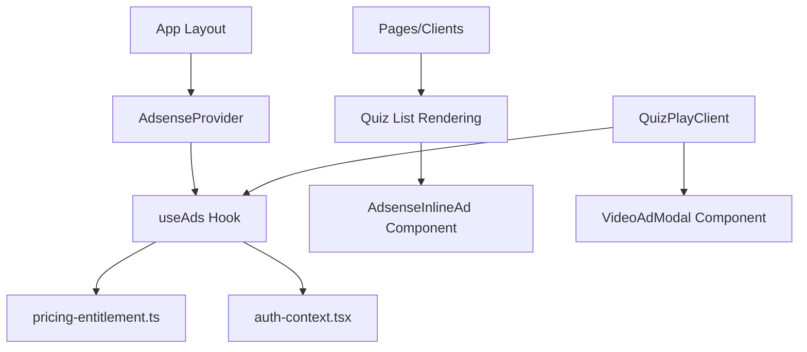
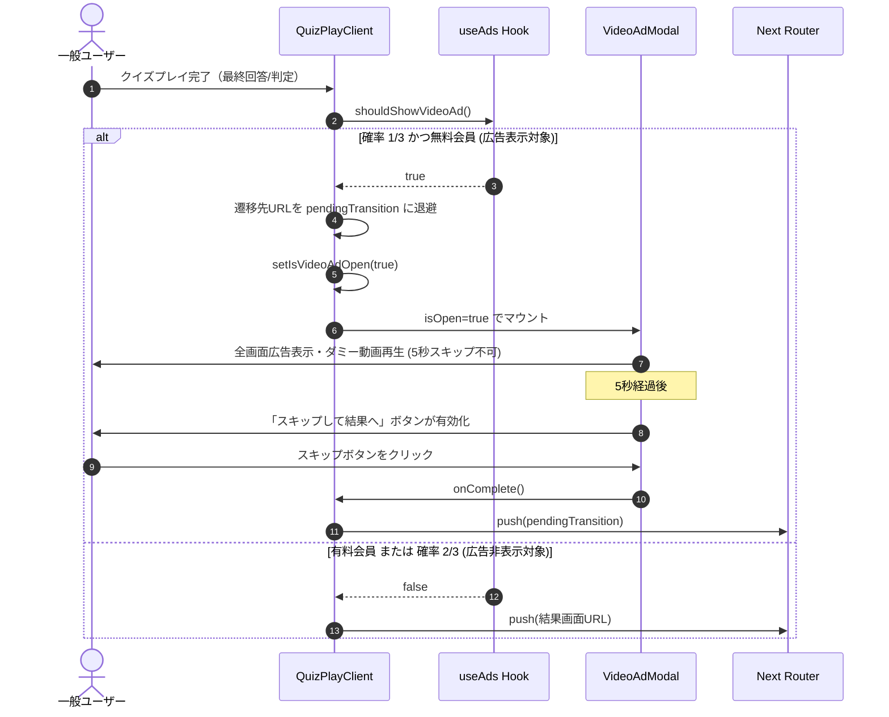

# Design Document: quizeum-ads

---
**Purpose**: 無料ユーザー向けの広告統合（Google AdSense & 自前動画広告モーダル）と、有料ユーザー向けの完全広告非表示制御を実現するための、クリーンなクライアントサイドの設計仕様を提供します。
**Approach**: 
- クライアントサイドでの関心分離（Separation of Concerns）を徹底し、既存のデータモデルやサーバーAPIを変更せずに、UIレイヤーでのインライン挿入および画面遷移のインターセプトを行います。
- 有料会員への余分なネットワークロードを防ぐため、プロバイダー層でスクリプトのロード自体を完全に制限します。
---

## Overview
本機能は、無料プラン（一般ユーザー）向けの収益化手段として Google AdSense スポンサー広告およびクイズプレイ完了時の自前動画広告を提供し、かつ Stripe 決済によって有効化した有料プラン（Pro/Premium）のユーザーには一切の広告を表示させず、ロードも行わない制御を実装します。

### Goals
- ユーザーのプラン状態（有料・無料・未ログイン）に応じた、確実で安全な広告ロード・表示制御。
- ホーム・検索・ジャンル・タグ一覧等のクイズカードグリッドにおいて、10件ごとに1件のインライン広告（PRマーク付き）の動的差し込み。
- クイズ完了後から結果画面に遷移する直前で、確率 1/3 でトリガーされる全画面動画広告モーダル（5秒間スキップ不可）の表示および遷移の割り込み制御。
- ローカル開発や Playwright による E2E テスト時に、広告表示・非表示の検証を確実に行えるテスト用モック機構の整備。

### Non-Goals
- Google AdSense 以外のサードパーティ広告SDKの新規導入。
- クイズプレイ中（解答操作中）の画面内へのインラインバナー広告の表示（プレイ没入感維持のため）。
- 5秒未満でのスキップ不可能な強制動画広告の実装。

## Boundary Commitments

### This Spec Owns
- 広告ロードおよびテストモック状態を一元管理する `useAds` フック。
- Google AdSense スクリプトタグを動的にレンダリングする `AdsenseProvider`。
- PRチップ付きのインライン広告カードコンポーネント `AdsenseInlineAd`。
- 5秒間のカウントダウン機能とダミー動画を搭載した全画面モーダル `VideoAdModal`。
- E2Eテスト用の LocalStorage による広告状態コントロール機能。

### Out of Boundary
- ユーザーのサブスクリプションプラン判定処理自体（`src/lib/pricing-entitlement.ts` が提供する `computeHasPaidEntitlements` に委譲）。
- Stripe による課金決済および Webhook 処理（`quizeum-billing-subscription-ui` の管轄）。

### Allowed Dependencies
- `src/context/auth-context.tsx`（`useAuth` によるユーザー情報の取得）
- `src/lib/pricing-entitlement.ts`（有料会員の権利判定）
- `next/script`（AdSense スクリプトの動的読み込み）

### Revalidation Triggers
- `pricing-entitlement.ts` における有料プラン判定ロジックの変更。
- Next.js (App Router) のルートレイアウト構造の変更。

## Architecture

### Existing Architecture Analysis
現在、Stripe による決済 Webhook を経由して Firestore の `users` ドキュメントに `subscriptionTier` (`pro` | `premium`) および `subscriptionStatus` (`active` | `trialing`) が書き込まれる仕組みが稼働しています。
本設計はこの既存のインフラおよび判定ロジックを上流依存として再利用し、完全に独立したフロントエンドの広告コンポーネントとして構築します。

### Architecture Pattern & Boundary Map



- **クライアントサイド完全注入パターン**:
  広告制御ロジックは React Hook (`useAds`) に集約されます。一覧のレンダリングループやクイズ完了ハンドラーがこのフックを呼び出すことで、有料/無料の表示分岐を行います。

### Technology Stack

| Layer | Choice / Version | Role in Feature | Notes |
|-------|------------------|-----------------|-------|
| Frontend | React 19.2.4 / Next.js 16.2.6 | 広告コンポーネント、フックの構築 | `next/script` による動的ロード |
| Styling | Vanilla CSS Modules / Tailwind v4 | PRバッジ・動画広告モーダルのレイアウト | 既存のネオンテーマと調和 |
| Integration | Google AdSense | スポンサー広告の配信 | 環境変数でパブリッシャーIDを管理 |

## File Structure Plan

### Directory Structure
```
src/
├── hooks/
│   └── useAds.ts              # [NEW] 広告表示ロジック、有料判定、動画広告判定、モック管理
├── components/
│   └── ads/                   # [NEW] 広告関連コンポーネントディレクトリ
│       ├── adsense-provider.tsx # [NEW] Google AdSense スクリプトの動的読み込みプロバイダー
│       ├── adsense-inline-ad.tsx # [NEW] クイズ一覧用インライン広告（PR表示含む）
│       └── video-ad-modal.tsx  # [NEW] プレイ完了後の 1/3 確率動画広告モーダル
```

### Modified Files
- `src/app/layout.tsx` — `AdsenseProvider` をルートにマウント。
- `src/app/search/search-client.tsx` — クイズカード一覧で10件ごとに `AdsenseInlineAd` を差し込む。
- `src/app/genres/[genreName]/genre-explore-client.tsx` — 同上。
- `src/app/tags/[tagName]/tag-explore-client.tsx` — 同上。
- `src/app/home-discovery-client.tsx` — カルーセル等で必要に応じて `showAds` による差し込みを行う。
- `src/app/quiz/[id]/play/quiz-play-client.tsx` — クイズ完了から結果遷移の間に動画広告の割り込みを実装。
- `src/app/quiz/test-play/play/test-play-client.tsx` — 同上。

## System Flows

### クイズプレイ完了時の動画広告割り込みフロー



## Requirements Traceability

| Requirement | Summary | Components | Interfaces | Flows |
|-------------|---------|------------|------------|-------|
| 1.1 | 有料会員時の広告非表示・ロード停止 | `useAds`, `AdsenseProvider` | `useAds()`, `AdsenseProvider` | N/A |
| 1.2 | 無料会員時の AdSense ロード・表示 | `useAds`, `AdsenseProvider` | `useAds()`, `AdsenseProvider` | N/A |
| 1.3 | テストモックによる広告除外 | `useAds` | `useAds()` | N/A |
| 2.1 | クイズ一覧への 10 件ごとインライン広告挿入 | `AdsenseInlineAd`, 各 Client 画面 | `AdsenseInlineAd` | N/A |
| 2.2 | 広告カードへの「PR」チップの表示 | `AdsenseInlineAd` | `AdsenseInlineAd` | N/A |
| 2.3 | アップグレード時の即時広告非表示 | `useAds`, `AdsenseInlineAd` | `useAds()` | N/A |
| 3.1 | クイズ完了時の 1/3 確率動画広告表示 | `useAds`, `VideoAdModal`, `QuizPlayClient` | `shouldShowVideoAd()`, `VideoAdModal` | 動画広告割り込みフロー |
| 3.2 | 動画広告表示中の結果遷移の一時停止・再生 | `VideoAdModal`, `QuizPlayClient` | `VideoAdModalProps` | 動画広告割り込みフロー |
| 3.3 | 動画広告表示から5秒間のスキップ不可制御 | `VideoAdModal` | `VideoAdModalProps` | 動画広告割り込みフロー |
| 3.4 | 5秒経過後のスキップ活性化・結果遷移実行 | `VideoAdModal`, `QuizPlayClient` | `VideoAdModalProps` | 動画広告割り込みフロー |
| 3.5 | 有料会員時の確率判定バイパス | `useAds`, `QuizPlayClient` | `shouldShowVideoAd()` | 動画広告割り込みフロー |

## Components and Interfaces

### Component Summary Table
| Component | Domain/Layer | Intent | Req Coverage | Key Dependencies (P0/P1) | Contracts |
|-----------|--------------|--------|--------------|--------------------------|-----------|
| `useAds` | Hook | 有料会員判定、広告ロード判断、動画広告トリガー制御 | 1.1, 1.2, 1.3, 2.3, 3.1, 3.5 | `useAuth` (P0), `computeHasPaidEntitlements` (P0) | State |
| `AdsenseProvider` | UI Provider | AdSense スクリプトの動的読み込み | 1.1, 1.2 | `useAds` (P0), `next/script` (P1) | Service |
| `AdsenseInlineAd` | UI Component | PRチップ付きのインライン広告表示（ダミー/本物） | 2.1, 2.2 | `useAds` (P0) | Props |
| `VideoAdModal` | UI Component | 5秒スキップ不可の全画面ダミー動画広告モーダル | 3.2, 3.3, 3.4 | `useAds` (P0) | Props |

### Hooks

#### `useAds`
- **Intent**: ユーザーのプラン状況と LocalStorage のモック値に基づき、広告を表示すべきか、動画広告をトリガーすべきかを判断する。

##### Service Interface
```typescript
export interface UseAdsResult {
  showAds: boolean;               // 広告を表示すべきか（無料会員の場合 true）
  shouldShowVideoAd(): boolean;   // クイズ完了時に動画広告を表示すべきか（1/3確率 & 無料会員）
}

export function useAds(): UseAdsResult;
```
- **Preconditions**: `useAuth` からの認証情報ロードが完了していること。
- **Postconditions**: 有料会員（`pro` / `premium` プランがアクティブ）または LocalStorage の `e2e-mock-pro-user` が有効な場合は、`showAds` は `false`、`shouldShowVideoAd()` も `false` を返す。
- **Invariants**: 
  - `process.env.NODE_ENV === 'test'` または LocalStorage の `e2e-mock-force-video-ad === 'true'` が設定されている場合、`shouldShowVideoAd()` は確率判定をバイパスして必ず `true` (非有料会員時) を返す。

---

### UI Components

#### `AdsenseProvider`
- **Intent**: ルートレイアウトに設置され、一般ユーザーの場合のみ Google AdSense スクリプトをマウントする。
- **Contracts**: React Component (Children wrapping)

##### Service Interface
```typescript
interface AdsenseProviderProps {
  children: React.ReactNode;
}

export function AdsenseProvider({ children }: AdsenseProviderProps): React.JSX.Element;
```
- **Implementation Note**: `useAds` の `showAds` が `true` に変化したタイミングで、`next/script` を通じて `<Script src="https://pagead2.googlesyndication.com/pagead/js/adsbygoogle.js?client=ca-pub-xxx" strategy="afterInteractive" crossorigin="anonymous" />` を動的に読み込む。

#### `AdsenseInlineAd`
- **Intent**: クイズカードリスト内に10件ごとに表示されるカード風の広告ユニット。
- **Contracts**: Props

##### Service Interface
```typescript
interface AdsenseInlineAdProps {
  adSlot?: string; // AdSenseの広告スロットID (オプショナル)
  className?: string;
}

export function AdsenseInlineAd({ adSlot, className }: AdsenseInlineAdProps): React.JSX.Element | null;
```
- **Implementation Note**:
  - `useAds` の `showAds` が `false` の場合は何も描画しない (`null` 返却)。
  - `showAds` が `true` の場合、開発環境 (`process.env.NODE_ENV === 'development'`) または E2E テスト用モックフラグが立っている場合は、AdSense がエラーを吐くのを避けるため、プレースホルダーとして「PR: スポンサー広告 (AdSense モック)」といった枠線付きのカード（PRチップ付き）を描画する。
  - 本番環境では、AdSense の `<ins className="adsbygoogle" ...>` をマウントし、マウント完了時の `useEffect` で `try { (window.adsbygoogle = window.adsbygoogle || []).push({}); } catch(e) {}` を実行して広告をリクエストする。

#### `VideoAdModal`
- **Intent**: クイズ完了時に表示される5秒スキップ不可の全画面動画広告モーダル。
- **Contracts**: Props

##### Service Interface
```typescript
interface VideoAdModalProps {
  isOpen: boolean;            // モーダルの表示状態
  onComplete: () => void;     // スキップ完了時のコールバック
}

export function VideoAdModal({ isOpen, onComplete }: VideoAdModalProps): React.JSX.Element | null;
```
- **Implementation Note**:
  - モーダルが開かれたとき、`isSkippable` を `false`、`countdown` を `5` に初期化し、1秒ごとのカウントダウンタイマーを開始する。
  - 5秒経過後、`isSkippable` を `true` に切り替え、「スキップして結果へ」ボタンを活性化（クリック可能に）する。
  - モーダル内には、ユーザーが「動画広告」を体験していることを視覚的に示すダミーの動画表示エリア（アニメーションローダーやダミー動画画像）を表示する。

## Data Models

### Data Contracts & Integration

#### Environment Variables
- `NEXT_PUBLIC_ADSENSE_CLIENT_ID`: Google AdSense のパブリッシャーID (`ca-pub-XXXXXXXXXXXXXXXX` 形式) を管理する環境変数。

#### LocalStorage Keys
- `e2e-mock-pro-user`: 有料会員のモック判定用。
- `e2e-mock-force-video-ad`: 動画広告の確率 1/3 を無視して必ずトリガーさせるためのテスト用フラグ。
- `e2e-mock-ads-disabled`: E2E テスト中に広告自体を無効化するためのテスト用フラグ。

## Error Handling

### Error Strategy
- **AdSense スクリプト読み込み失敗 / 広告ブロック**: 
  一般的に広告ブロッカーなどで AdSense のスクリプトのロードがブロックされるか、`window.adsbygoogle.push` 呼び出し時に例外が発生します。
  - **対策**: `adsbygoogle.push` を呼び出す際は必ず `try-catch` ブロックで囲み、エラーを握りつぶすことで、アプリケーションの他のUI処理やゲームプレイ遷移に影響を与えないように防御します。
- **ハイドレーションの不整合（ハイドレーションミスマッチ）**:
  サーバーサイドレンダリング（SSR）時とクライアントサイドでのマウント時で、有料会員判定が切り替わることにより HTML が異なりエラーとなるのを防ぐ。
  - **対策**: `useAds` の `showAds` 状態判定は、マウントが完了する（`useEffect` が実行される）までは初期値として `false` を返し、クライアントサイドでマウント完了が確認されてから本来の値を反映します。

## Testing Strategy

### Unit Tests
- `useAds` フックの単体テスト:
  - ユーザーが未ログインの場合に `showAds` が `true` になること。
  - ユーザーが有料会員の場合に `showAds` が `false` になること。
  - LocalStorage のモック値に応じて判定が正常に切り替わること。
  - `shouldShowVideoAd()` の確率（1/3）およびテスト用強制フラグの挙動確認。

### E2E / Playwright Tests
- **インライン広告の検証**:
  - 一般ユーザー（無料会員）でアクセスした際、クイズ一覧に `AdsenseInlineAd` (ダミー表示) が10件ごとにマウントされ、「PR」の文字が確認できること。
  - 有料会員モックを注入した際、一覧に広告が一切マウントされないこと。
- **動画広告モーダルの検証**:
  - `e2e-mock-force-video-ad` フラグを有効化し、クイズ解答を完了したとき、全画面動画広告モーダルが表示されること。
  - 表示から3秒時点では「スキップ」ボタンがクリックできず、5秒経過した後に「スキップして結果へ」ボタンが押せるようになり、クリック後に結果画面への遷移が正常に完了すること。
  - 有料会員モックを注入した際、クイズ完了後にモーダルを挟まず直接結果画面へ遷移すること。
