# Technical Design Document: quizeum-ai-quiz-authoring

## Overview

**Purpose**: Pro 契約クリエイターがクイズエディタ内で対話型 AI チャットアシスタントを利用できるようにし、作問の「作成」「編集」「削除」「包括的チェック（ファクトチェック・誤字脱字校正）」を AI との対話および Tool Use によって実行可能にすることで、作問効率と Pro プラン価値を劇的に高める。

**Users**: 有効な Pro / Premium 契約を持つクイズ作成者が `/quiz/create` および `/quiz/[id]/edit` で利用する。

**Impact**: 
- 新規チャット用 API エンドポイント `POST /api/quiz/ai-chat-authoring` の新設。
- Vercel AI SDK（`useChat`）を用いた対話型チャットボット UI の追加。
- エディタ状態（問題リストなど）とチャットエージェントとの結合処理の実装。
- AI エージェントにおける Tool Use（作問操作ツール、Google検索ツール、包括チェックツール）の定義。
- 日次チャット制限（メッセージ送信およびツール実行の合計 100回/日）の導入。

### Goals
- 画面右下にフローティングチャットアイコンを常駐させ、クリックでエディタと併存するチャットパネルをスライド表示。
- AI エージェントがエディタの最新状態をコンテキストとして理解し、自然言語の指示でクイズデータを操作。
- `checkQuestion` (指定問題) および `checkAllQuestions` (全問題一括) による、事実検証（Google検索）、誤字脱字、表現校正、形式不適合の包括チェック。
- 包括チェックで検出された不備をチャットにリスト表示し、ユーザーの同意をもとに `updateQuestion` ツールでエディタに自動反映。
- サーバー側での厳格な Pro 判定・レート制限（100回/日、JST リセット、モデレータ免除）。
- AI チャットメッセージのマークダウンパース表示、安全なリンク開閉、およびコードブロックのコピーボタン提供による高品質な対話体験。

### Non-Goals
- クイズエディタ画面以外でのチャットボットの表示。
- チャット対話履歴の Firestore への永続化（リロードによる履歴リセットを許容）。
- 無料 tier のお試しチャット利用。
- チャットボットによる Firestore への自動下書き保存（ユーザーが明示的に保存ボタンを押すまで保存しない）。

## Boundary Commitments

### This Spec Owns
- **チャット UI**: 右下フローティングボタン `AiChatAssistantButton`、スライドインチャットパネル `AiChatAssistantPanel`（マークダウンおよびコードコピー対応）。
- **エディタとの結合ロジック**: `useChat` からのツールコールをインターセプトして `questions` 等のエディタ状態に反映するハンドラー。
- **API 契約定義**: チャット用 API エンドポイント（`POST /api/quiz/ai-chat-authoring`）の Request/Response/Error 型。
- **AI ツール群の定義**: `createQuestion`, `updateQuestion`, `deleteQuestion`, `generateBulkQuestions`, `generateThumbnail`, `checkQuestion`, `checkAllQuestions`, `googleSearch` のスキーマ定義。
- **簡易マークダウンパース拡張**: コードブロック、リスト、インラインコードなどをサポートする安全なマークダウンパースユーティリティ。
- **E2E テスト**: チャット開閉、メッセージ送信、ツール実行による問題の追加・編集・削除、エラー表示の検証。

### Out of Boundary
- 水平思考プレイ中の質問チャット UI およびその制限ロジック（`quizeum-play-flow-ui`）。
- 料金画面レイアウト（`quizeum-billing-subscription-ui`）。
- クイズ保存・公開・バリデーションライブラリ本体（既存 `quiz-validation` を呼び出すのみ）。
- Stripe 連携およびサブスクリプションエンタイトルメント同期のインフラ部分。

### Allowed Dependencies
- `quizeum-core`: `resolveUserEntitlements`, `verifyFirebaseIdToken`, `quiz-validation`, Firestore Admin, Storage Admin helper。
- `ai` (Vercel AI SDK): 対話インターフェース構築用。
- `@ai-sdk/google`: Gemini API 呼び出し用。
- `GEMINI_API_KEY`, `GEMINI_MODEL_ID`（env 環境変数）。

### Revalidation Triggers
- AI ツール（Tool Use）の引数スキーマの変更。
- 日次チャット上限値・カウンタ docId の変更。
- クイズデータモデル（`Question` 型）の変更。

## Architecture

### Existing Architecture Analysis
- **Gemini 連携**: すでに `GoogleGenerativeAI` を用いた一括作問（`POST /api/quiz/ai-generate-questions`）や、水平思考の真相判定（`POST /api/attempt/verify-truth`）が実装されている。
- **プロバイダの選定**: 今回は対話と Tool Use をスマートに管理するため、Vercel AI SDK（`ai` パッケージ）と `@ai-sdk/google` を採用し、`streamText` などのヘルパーを活用する。
- **エディタ**: `quiz-editor.tsx` が問題リスト（`questions`）を React `useState` で管理しており、子コンポーネントにハンドラーを伝播している。

### Architecture Pattern & Boundary Map

```mermaid
sequenceDiagram
    participant Editor as QuizEditor
    participant Btn as QuickActionButton (Generate/Check)
    participant Panel as AiChatAssistantPanel
    participant Hook as useAiChatAssistant (useChat)
    participant API as POST /api/quiz/ai-chat-authoring
    participant Gemini as Gemini Model
    participant FS as Firestore (Limits)
    participant GS as GoogleSearch

    Note over Editor, Btn: 1. クイックアクションによる起動
    Btn->>Panel: setIsChatOpen(true)
    Btn->>Hook: append({ role: 'user', content: '...' })
    
    Note over Panel, Hook: 2. 対話型メッセージ送信 (通常会話も同様)
    Hook->>API: POST /api/quiz/ai-chat-authoring (context + messages)
    API->>FS: check & increment daily limit
    API->>Gemini: streamText with tools
    
    rect rgb(30, 30, 40)
        note right of Gemini: サーバー側検証ループ (googleSearch)
        Gemini->>API: Call checkQuestion
        API->>GS: googleSearch (grounding)
        GS-->>API: search results
        API-->>Gemini: return search results
    end
    
    Gemini->>API: Call client tools (e.g. updateQuestion)
    API-->>Hook: stream tool call (updateQuestion)
    Hook->>Editor: setQuestions / state update
    API-->>Hook: Stream text response ("〜を更新しました")
    Hook-->>Panel: Render text response
```



### Technology Stack

| Layer | Choice / Version | Role in Feature | Notes |
|-------|------------------|-----------------|-------|
| Frontend | React 19 + CSS Modules | チャットパネル、UI 統合 | Tailwind を使わず Vanilla CSS |
| Chat SDK | Vercel AI SDK (`ai` ^4.0.0) | クライアント `useChat` & サーバー `streamText` | Tool Use およびストリーミング管理 |
| Model Provider | `@ai-sdk/google` ^1.0.0 | Gemini API 連携 | `gemini-2.5-flash` などのモデルを利用 |
| Google Search | Gemini Google Search Tool | 事実関係のグラウンディング検証 | Vertex AI/AI Studio Grounding または自作検索ツール |
| Limit Control | Firestore Admin | 日次チャット/ツール利用カウンタの永続化 | `users/{uid}/dailyAiAuthoringCounts/chat` |

## File Structure Plan

### Directory Structure
```
src/
├── app/api/quiz/
│   ├── ai-chat-authoring/route.ts       # POST チャットエンドポイント (Vercel AI SDK)
│   └── ai-authoring-usage/route.ts      # GET 残り回数取得 (チャット利用制限表示用)
├── services/
│   ├── ai-authoring-utils.ts            # カウンタ制御、JST 日時、プロンプト補助
│   └── ai-authoring-types.ts            # チャット用型定義
├── hooks/
│   └── useAiChatAssistant.ts            # useChat ラッパー、エディタ結合ロジック
├── components/quiz/editor/
│   ├── ai-chat-assistant-button.tsx     # フローティング起動ボタン UI
│   ├── ai-chat-assistant-panel.tsx      # チャットパネル UI (マークダウン表示 & コピー対応)
│   └── ai-chat-assistant.module.css     # チャットパネル用 CSS スタイル (マークダウン＆コピーボタン定義含む)
├── components/quiz/
│   └── quiz-editor.tsx                  # チャットアシスタント UI の配置 (修正)
├── components/markdown/
│   └── markdown-content.tsx             # マークダウン表示用共通コンポーネント (既存)
├── lib/security/
│   └── sanitize.ts                      # マークダウン簡易パース & サニタイズ (修正)
tests/
├── services/ai-authoring-utils.test.ts  # カウンタ・上限の単体テスト
└── api/ai-chat-authoring.test.ts        # API ルートとツールコールの結合テスト
e2e/
└── ai-chat-assistant.spec.ts            # チャット起動、作問、編集、削除、エラー表示の E2E
```

### Modified Files
- `src/lib/security/sanitize.ts` — `parseMarkdownToHtml` 関数の拡張。コードブロック、インラインコード、リストのパース、およびプレースホルダー保護処理の追加。
- `src/components/quiz/editor/ai-chat-assistant-panel.tsx` — `MarkdownContent` コンポーネントを使用したマークダウン表示の統合。および、`pre` 要素への動的なコピーボタン配置とクリップボードコピー用イベント処理（`useEffect`）の追加。
- `src/components/quiz/editor/ai-chat-assistant.module.css` — マークダウンタグ（pre, code, ul, ol, li, a）およびコードコピーボタン（.codeCopyButton）のスタイル定義の追加。
- `src/components/quiz/quiz-editor.tsx` — `AiChatAssistantButton` および `AiChatAssistantPanel` の統合。
- `firestore.rules` — `dailyAiAuthoringCounts/chat` のクライアント書き込みの禁止。

## System Flows

### クイックアクションボタンによるハイブリッド起動（コールドスタート対策）
#### 「全問包括チェック」クリック時
1. ユーザーがエディタ上の「全問包括チェック」をクリック。
2. クライアントはチャット開閉状態（`isChatOpen`）を `true` に設定し、スライドインチャットパネルを展開。
3. クライアントは `useAiChatAssistant` の `append` メソッドを呼び出し、「現在フォームにあるすべての問題の包括チェック（ファクトチェック・誤字脱字）を実行してください。」という指示文を自動送信。
4. AIエージェントへの API リクエストが即座に自動開始され、AI は `checkAllQuestions` ツールなどの検証処理を開始する。

#### 「AIで作問開始」クリック時
1. ユーザーがエディタ上の「AIで作問開始」をクリック。
2. クライアントはチャット開閉状態（`isChatOpen`）を `true` に設定し、スライドインチャットパネルを展開。
3. クライアントは `useAiChatAssistant` 内のメッセージ状態に、AIからの初期メッセージ（例:「クイズ作問アシスタントです。どのようなテーマや難易度で問題を作成したいですか？」）を追加する（APIへの自動送信は実行しない）。
4. チャットパネル上にウェルカムメッセージが表示され、ユーザーの手動入力待ち状態となる。

### 対話とツール実行（成功パス）
1. ユーザーがチャットで指示（「問題 2 の答えを 〇✕ 式から選択式にして」など）を送信。
2. クライアントはエディタの現在の `questions` 配列とメタデータを `body.quizState` として API に送信。
3. サーバー側 API で認証・認可を行い、Firestore カウンタを +1。
4. Gemini は渡されたコンテキストを解釈し、クライアント側ツール `updateQuestion` の呼び出しを決定。
5. サーバーはツールコールの指示をストリーミング。
6. クライアントの `useChat` はツール呼び出しを検知（`onToolCall` / `toolInvocations`）。
7. エディタ状態の `setQuestions` が走り、該当問題が編集される。
8. AIが「問題 2 を選択式に更新しました」とテキストで回答し、チャットにストリーミング表示される。

### 包括的チェックとファクトチェック（Google検索連携パス）
1. ユーザーが「問題 3 をファクトチェックして」、または「全問題を一括チェックして」と指示。
2. AI は `checkQuestion`（または `checkAllQuestions`）ツールを呼び出す。
3. AI ツール実行ループにおいて、AI は検証用のキーワードを抽出して `googleSearch` ツールを実行。
4. Google検索を実行し、取得された検索スニペットとソース URL をAIに返す。
5. AI は検索結果と問題の記述（および誤字脱字、表現の不自然さ）を比較・検証。
6. AI は検出された不備を整理し、チャットに応答しつつ、修正適用のため `updateQuestion` ツールを呼び出す（マルチステップ）。
7. クライアント側で問題が自動更新され、ソース URL がチャット上に表示される。

## Requirements Traceability

| Requirement | Summary | Components | Interfaces / Files | Flows / Notes |
|-------------|---------|------------|---------------------|---------------|
| 1.1 - 1.5 | UI開閉、Pro制限 | `AiChatAssistantButton`, `AiChatAssistantPanel` | `components/quiz/editor/` | 起動・スライド表示、Proプラン認可 |
| 2.1 - 2.4 | Vercel AI SDK基本対話 | `POST /api/quiz/ai-chat-authoring`, `useChat` | `route.ts`, `useAiChatAssistant.ts` | クイズのコンテキスト送信、ストリーミング |
| 2.5 | チャット内のマークダウン表示 | `AiChatAssistantPanel`, `MarkdownContent` | `ai-chat-assistant-panel.tsx`, `sanitize.ts` | マークダウン（リスト、インラインコード、コードブロック等）のパースとダークテーマ適合表示 |
| 2.6 | リンクの安全性と新タブ表示 | `MarkdownContent` | `sanitize.ts` | セキュリティ対策（rel="noopener noreferrer"）を施した新タブリンク遷移 |
| 2.7 | コードブロックコピー機能 | `AiChatAssistantPanel` | `ai-chat-assistant-panel.tsx`, `ai-chat-assistant.module.css` | コードブロック内のコピーボタン（レ点変化付き）の表示とクリップボードコピー処理 |
| 3.1 - 3.7 | エディタ操作ツール (Tool Use) | `createQuestion`, `updateQuestion`, `deleteQuestion`, `generateBulkQuestions`, `generateThumbnail` | API ツールスキーマ定義、クライアント Tool Handlers | クイズエディタ状態の即時更新と検証 |
| 4.1 - 4.5 | 包括チェック & Google検索ファクトチェック | `checkQuestion`, `checkAllQuestions`, `googleSearch` | API ツール定義、Gemini Search Grounding | Google検索結果のソース提示、誤字脱字・不自然表現の校正 |
| 5.1 - 5.5 | 100回/日利用制限 | `ai-authoring-utils`, Firestore カウンタ | `users/{uid}/dailyAiAuthoringCounts/chat` | サーバー側制限、チャットへの警告表示 |
| 6.1 - 6.3 | エラーハンドリング | チャットエラー UI | Panel / Hook | エラー時の再送ボタン、日本語での説明表示 |

## Components and Interfaces

### API ツール（Tool Use）のスキーマ定義

AI エージェントが実行可能なツールは、`streamText` の `tools` に定義され、引数は Zod スキーマで指定します。

```typescript
import { z } from 'zod';

const questionSchema = z.object({
  id: z.string().optional(),
  type: z.enum(['multiple-choice', 'true-false', 'text-input', 'quick-press', 'sorting', 'association', 'lateral-thinking']),
  questionText: z.string(),
  explanation: z.string(),
  hint: z.string().nullable().optional(),
  choices: z.array(z.object({
    id: z.string(),
    choiceText: z.string(),
    isCorrect: z.boolean(),
  })).optional(),
  correctTextAnswerList: z.array(z.string()).optional(),
  sortingItems: z.array(z.object({
    id: z.string(),
    text: z.string(),
    correctOrder: z.number(),
  })).optional(),
  associationHints: z.array(z.string()).optional(),
});

export const chatTools = {
  // 1. 一括生成
  generateBulkQuestions: {
    description: '指定されたテーマやプロンプトに沿って、複数のクイズ問題を一括生成します。通常10問生成されます。',
    parameters: z.object({
      questions: z.array(questionSchema).length(10),
    }),
  },
  // 2. 単一追加
  createQuestion: {
    description: '新しいクイズ問題を1問作成し、エディタの問題リストの末尾に追加します。',
    parameters: z.object({
      question: questionSchema,
    }),
  },
  // 3. 問題更新
  updateQuestion: {
    description: '指定された問題 ID の問題データ（問題文、選択肢、正解、解説など）を指定された新しい内容で更新します。',
    parameters: z.object({
      id: z.string().describe('更新対象の問題ID'),
      updates: questionSchema.partial(),
    }),
  },
  // 4. 問題削除
  deleteQuestion: {
    description: '指定された問題 ID の問題をエディタの問題リストから削除します。',
    parameters: z.object({
      id: z.string().describe('削除対象の問題ID'),
    }),
  },
  // 5. サムネ生成
  generateThumbnail: {
    description: '現在のクイズのタイトルと説明に基づいてクイズカバー画像をAI生成し、エディタに適用します。',
    parameters: z.object({
      prompt: z.string().optional().describe('画像のテーマに関する追加指示'),
    }),
  },
  // 6. 指定問題の包括的チェック
  checkQuestion: {
    description: '指定された問題の事実関係（ファクトチェック）、誤字脱字、および表現の不自然さを包括的に検証します。必要に応じて内部で googleSearch ツールを実行します。',
    parameters: z.object({
      id: z.string().describe('チェック対象の問題ID'),
      questionText: z.string().describe('チェック対象の問題文'),
      correctAnswer: z.string().describe('チェック対象の答えテキスト（正解テキストまたは正解選択肢）'),
    }),
  },
  // 7. 全問題の一括包括的チェック
  checkAllQuestions: {
    description: 'エディタ上にあるすべての問題について、事実関係、誤字脱字、表現の不自然さを一括して検証します。',
    parameters: z.object({
      questionIds: z.array(z.string()).describe('チェック対象のすべての問題IDの配列'),
    }),
  },
  // 8. Google 検索ツール
  googleSearch: {
    description: '事実関係を検証するための情報を Google 検索から取得します。',
    parameters: z.object({
      query: z.string().describe('Google検索クエリ'),
    }),
  },
};
```

*※ `checkQuestion` および `checkAllQuestions` はサーバー側で動作し、必要に応じて `googleSearch` ツールを実行した結果を受けて、AI が校正テキストをユーザーに返しつつ、自動で `updateQuestion` ツールを呼ぶことでクライアントの状態を書き換えます。*

### クライアント Hook インターフェース (`useAiChatAssistant`)

```typescript
export interface UseAiChatAssistantProps {
  userId?: string;
  isProUser: boolean;
  quizState: {
    title: string;
    description: string;
    genre: string;
    tags: string[];
    questions: Question[];
  };
  setQuestions: React.Dispatch<React.SetStateAction<Question[]>>;
  setTitle: (t: string) => void;
  setDescription: (d: string) => void;
  setThumbnailUrl: (url: string | null) => void;
}

export interface UseAiChatAssistantResult {
  messages: any[]; // Message[] from 'ai'
  input: string;
  handleInputChange: (e: React.ChangeEvent<HTMLInputElement | HTMLTextAreaElement>) => void;
  handleSubmit: (e: React.FormEvent<HTMLFormElement>) => void;
  append: (message: { role: 'user' | 'assistant' | 'system'; content: string }) => Promise<string | null | undefined>;
  triggerAuthoringWelcome: () => void; // 作問用ウェルカムメッセージ（自動送信なし）をセットしてチャットを開く
  isChatOpen: boolean;
  setIsChatOpen: (open: boolean) => void;
}

export function useAiChatAssistant(props: UseAiChatAssistantProps): UseAiChatAssistantResult {
  // Vercel AI SDK の useChat を内部で呼び出す
  // onToolCall で各ツール（createQuestion, updateQuestion, deleteQuestion, generateBulkQuestions, generateThumbnail）を処理し、setQuestions 等の State を更新
  // isChatOpen の開閉状態を State として保持し、append 呼び出し時に isChatOpen を true に自動変更する制御を組み込む
  // triggerAuthoringWelcome 呼び出し時に、チャットパネルを開き、チャットメッセージ履歴の先頭にAIアシスタントからのウェルカムメッセージ（初期設定）をセットする
}
```

### ユーザー UI コンポーネント (`AiChatAssistantPanel`)

| Field | Detail |
|-------|--------|
| Intent | スライドインチャットパネルおよび対話ログ、入力欄 UI の提供（マークダウンおよびコードコピー対応） |
| Requirements | 1.3, 1.5, 2.2, 2.4, 2.5, 2.7, 5.4, 6 |

**Implementation Notes**
- スライドイン時に右側から幅 500px のエリアを占有し、エディタ編集領域と並行して手動編集・操作可能。
- AIから返されたメッセージテキスト `textContent` を描画する際、プレーンテキストでの表示から共通コンポーネント `MarkdownContent`（`src/components/markdown/markdown-content.tsx`）を使用したHTMLレンダリングに変更する。
- メッセージ履歴コンテナ（`.history`）に `useEffect` による DOM 監視処理を実装。メッセージ配列の更新をトリガーに、レンダリングされた `<pre>` タグ（コードブロック）を検出する。
- 検出された各 `<pre>` タグの中に、絶対配置の「コピーボタン（`.codeCopyButton`）」を動的に生成して挿入する。
- コピーボタンがクリックされたら、`pre` 要素内の `code` タグのテキストコンテンツを取得し、`navigator.clipboard.writeText` でコピーを実行する。コピー成功時は、ボタンの見た目を「コピー完了（チェックマークと緑色）」へ 2 秒間遷移させる。

### マークダウンサニタイズユーティリティ (`parseMarkdownToHtml`)

| Field | Detail |
|-------|--------|
| Intent | 簡易マークダウンのテキストをサニタイズ済みの安全な HTML に変換するヘルパー |
| Requirements | 2.5, 2.6 |

**Implementation Notes**
- `src/lib/security/sanitize.ts` の `parseMarkdownToHtml` を拡張。
- **プレースホルダー退避処理**: マークダウン内のコードブロック（```` ``` ````）およびインラインコード（`` ` ``）をパース前に正規表現で検出し、一時的なユニークトークンプレースホルダー（`__CODE_BLOCK_N__`, `__INLINE_CODE_N__`）に中身を退避させる。これにより、コード内の改行文字やマークダウン類似記号が他のパース処理に干渉するのを完全に保護する。
- **標準パース**: 太字（`**`）、斜体（`*`）、およびリンク（`[text](url)`）を正規表現で HTML タグへ置換。リンク（`a` タグ）には安全性と要件適合のため必ず `target="_blank" rel="noopener noreferrer"` 属性を自動付与する。
- **リストのパース**: テキストを改行コードで分割し、箇条書き（`- `, `* `）および番号付きリスト（`1. ` 等）を状態フラグ（`inUl`, `inOl`）で管理しながら、`<ul><li>...</li></ul>` や `<ol><li>...</li></ol>` に構造的にパースする。
- **改行処理**: リストタグの内側やプレースホルダー部分を除いた、通常のテキスト行に対してのみ末尾に `<br />` を付与して結合する。
- **プレースホルダー復元**: 退避させていたコードブロック（`<pre><code>` でラッピング、`class="language-..."` も維持）およびインラインコードをプレースホルダー箇所に書き戻す。
- **強力なサニタイズ**: 最後に `DOMPurify.sanitize` を通してXSSを防止する。`DOMPurify` の `ALLOWED_TAGS` に `pre`, `code`, `ul`, `ol`, `li` を追加登録して、拡張されたマークダウン HTML が安全に許可されるようにする。

## Data Models

### Firestore: dailyAiAuthoringCounts/chat
- **Path**: `users/{uid}/dailyAiAuthoringCounts/chat`
- **Schema**:
  ```typescript
  interface DailyAiAuthoringChatCountDoc {
    count: number;             // メッセージ送信およびツール実行の合計回数
    lastUpdatedDate: string;   // YYYY-MM-DD (JST)
  }
  ```
- **Security Rules**: 読み取りは認証済み本人のみ可。書き込みはクライアントからは拒否（`allow write: if false`）、Admin SDK (API) のみ。

## Testing Strategy

### Unit / Integration Tests
- **ツール定義・スキーマ検証**: 各ツールの Zod スキーマが正しく定義され、不正な引数でエラーになることをテスト。
- **カウンタ検証**: `dailyAiAuthoringCounts/chat` のカウントが 100 に達した際に API が 429 エラーを返すこと、JST 日付変更時にリセットされること。
- **Google検索連携の検証**: `checkQuestion` 実行時に `googleSearch` が呼び出され、検索結果をコンテキストに含めて正しい修正提案が生成されること。
- **マークダウンパース検証**: `parseMarkdownToHtml` がコードブロック、インラインコード、リスト、セーフリンクを正しく安全な HTML に変換し、XSS 脆弱性がないこと。

### E2E Tests (`e2e/ai-chat-assistant.spec.ts`)
- **UI 表示・開閉**: 右下アイコンの表示、クリックでのスライドパネルの展開、閉じるボタンでのクローズの動作テスト。
- **対話による作問操作**: 
  - チャット送信欄から「日本の首都に関する問題を1問追加して」と送信し、エディタ末尾に問題が 1 問追加されること。
  - 「3問目を削除して」と送信し、該当問題がリストから消えること。
- **包括チェックの動作**:
  - 誤字や事実誤認を含んだ問題をエディタに配置し、「この問題をチェックして」と送信すると、不備がリストされ、修正案が提示されること。
- **マークダウン・コピーボタン検証**:
  - マークダウン記法を含む応答が正しく装飾表示されること。
  - コードブロックにコピーボタンが表示され、クリックでクリップボードにコードがコピーされること。
  - リンクをクリックしたとき、新しいタブ（`_blank`）で `noopener noreferrer` 付きで開かれること。

## Security Considerations
- **環境変数の秘匿**: `GEMINI_API_KEY` を含むすべてのセンシティブな環境変数はサーバー（API Route）側でのみ保持・使用する。
- **入力長バリデーション**: プロンプト長（チャット入力）はサーバー側で上限（例：500文字）をチェックし、超過時は即座にリターンする。
- **認証検証**: API 呼び出しの Bearer トークンを検証し、送信された `userId` が検証済み UID と一致しない場合はアクセスを遮断する。
