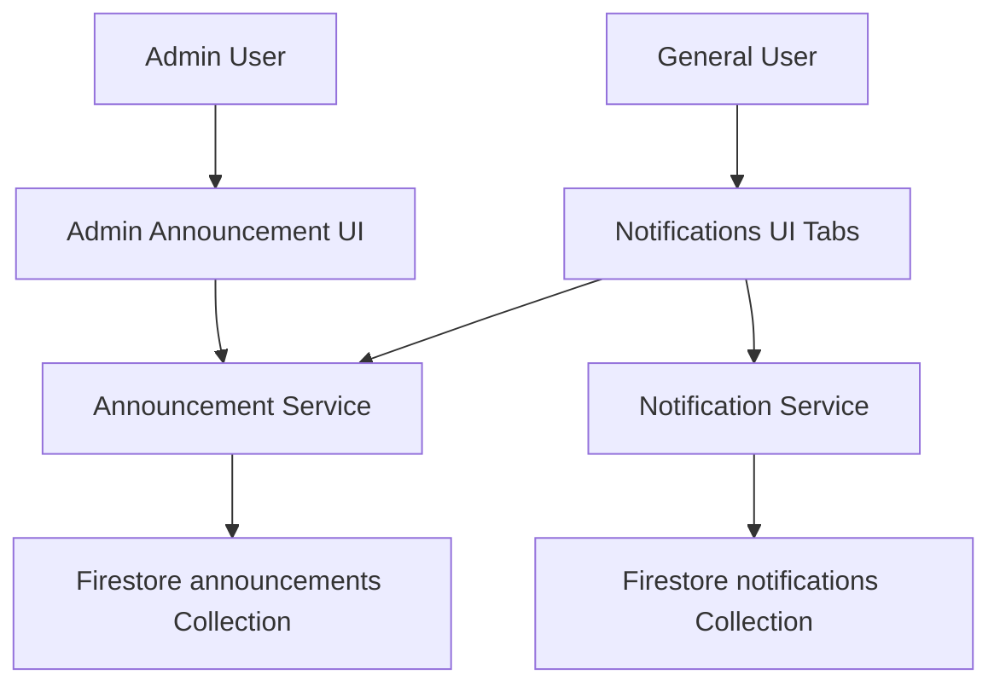
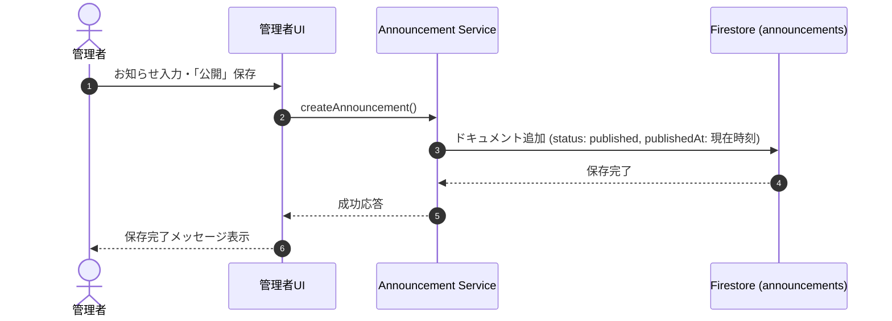

# Design Document: quizeum-announcements

## Overview
本機能は、クイズ投稿SNS「Quizeum」において、運営・管理者がソースコードのビルドやデプロイを行わずに、Web上の管理画面から動的に「運営からのお知らせ」を追加・編集・削除できるようにするものです。
また、一般ユーザー（未ログインユーザー含む）が通知メニュー（`/notifications`）からこれらのお知らせをマークダウン形式で閲覧できるようにします。

### Goals
- 運営メンバーがブラウザ上でお知らせの作成、編集、削除、公開ステータス変更（下書き/公開）を行えるようにする。
- 一般ユーザーおよびゲストユーザーが、ログイン状態を問わず「運営からのお知らせ」を閲覧できるようにする。
- 本文のマークダウン（太字、斜体、リンク、改行）に対応した安全なHTMLレンダリングをサポートする。
- 一般ユーザーに対する通知機能（`/notifications`）の中にタブ形式でお知らせを統合する。

### Non-Goals
- ユーザー個別へのお知らせ既読バッジ管理（既読ステート管理は対象外）。
- 特定グループやセグメント（例：有料プランユーザーのみ）に限定したお知らせの配信。

## Boundary Commitments

### This Spec Owns
- `announcements` コレクションにおけるデータモデル定義および Firestore サービス層。
- 管理者用お知らせ管理画面（`/admin/announcements`）の作成。
- `/notifications` ページでの「通知」と「運営からのお知らせ」の切り替え表示ロジック。
- 未ログインユーザー向けのお知らせ閲覧用のルーティング緩和。
- Firestore セキュリティルールにおける `announcements` のアクセス制御。

### Out of Boundary
- 個人向け通知システム（`notifications` コレクション、`getNotifications` 等のロジックおよび型定義）の機能変更。

### Allowed Dependencies
- `src/lib/security/sanitize.ts` の `parseMarkdownToHtml` を使用したマークダウン表示。
- `src/lib/middleware-auth-cookies.ts` の `isAdminUser` を使用した管理者判定。
- Firebase SDK (Firestore, Auth)。

### Revalidation Triggers
- `Announcement` 型の変更。
- `/notifications` ページのルーティング構造やタブ構造の大幅な変更。

## Architecture

### Existing Architecture Analysis
現在、`/notifications` はミドルウェア（`src/middleware.ts`）によってログインユーザー限定でガードされています。
本機能の実装にあたり、ミドルウェアの制限リストから `/notifications` を除外する必要があります。
その上で、ページ内部で「通知」タブを表示する際のみクライアントサイドでログイン判定（ログインしていなければ誘導UIを表示）を行います。

### Architecture Pattern & Boundary Map


### Technology Stack
| Layer | Choice / Version | Role in Feature | Notes |
|-------|------------------|-----------------|-------|
| Frontend / CLI | Next.js 16.2.6 (App Router), React 19.2.4 | UI / 画面構成 | shadcn/ui を使用 |
| Backend / Services | Firebase SDK 12.13.0 | データアクセス・サービス層 | Firestore 連携 |
| Data / Storage | Firestore | 永続化 | announcements コレクション |

## File Structure Plan

### Directory Structure
```
d:/quizeum/
├── src/
│   ├── app/
│   │   ├── admin/
│   │   │   ├── announcements/
│   │   │   │   ├── page.tsx               # [NEW] 管理者お知らせ管理画面
│   │   │   │   └── client.tsx             # [NEW] 管理者お知らせ管理クライアント
│   │   │   └── page.tsx                   # [MODIFY] 管理者ポータル（メニュー追加）
│   │   └── notifications/
│   │       ├── page.tsx                   # [MODIFY] Tabs化と未ログイン対応
│   │       └── announcements-tab.tsx      # [NEW] お知らせ一覧タブコンポーネント
│   ├── services/
│   │   └── announcement.ts                # [NEW] Firestore announcement サービス
│   ├── types/
│   │   └── index.ts                       # [MODIFY] Announcement 型定義の追加
│   └── middleware.ts                      # [MODIFY] /notifications ガード除外
```

### Modified Files
- `src/types/index.ts` — `Announcement` 型を追加。
- `src/middleware.ts` — `authRequiredPaths` から `/notifications` を除外。
- `src/app/admin/page.tsx` — 管理者メニューポータルに「運営からのお知らせ管理」へのリンクカードを追加。
- `firestore.rules` — `announcements` コレクションへのルールを追加。

## System Flows


## Requirements Traceability

| Requirement | Summary | Components | Interfaces | Flows |
|-------------|---------|------------|------------|-------|
| 1.1 | 管理ポータルからの遷移 | AdminPortalPage | `src/app/admin/page.tsx` | - |
| 1.2 | お知らせの保存・更新 | AdminAnnouncementsClient | `src/app/admin/announcements/client.tsx`, `AnnouncementService` | CRUD Flow |
| 1.3 | 公開ステータス設定 | AdminAnnouncementsClient | `src/app/admin/announcements/client.tsx`, `AnnouncementService` | CRUD Flow |
| 1.4 | Markdownプレビュー | AdminAnnouncementsClient | `parseMarkdownToHtml` (sanitize.ts) | - |
| 1.5 | お知らせの削除 | AdminAnnouncementsClient | `src/app/admin/announcements/client.tsx`, `AnnouncementService` | - |
| 2.1 | 通知画面のタブ切り替え | NotificationsPage | `src/app/notifications/page.tsx` | - |
| 2.2 | お知らせ一覧表示 | AnnouncementsTab | `src/app/notifications/announcements-tab.tsx` | - |
| 2.3 | 未ログイン閲覧許可 | RouteGuard | `src/middleware.ts`, `NotificationsPage` | - |
| 2.4 | 未ログイン時ログイン誘導 | NotificationsPage | `src/app/notifications/page.tsx` | - |
| 2.5 | Markdownレンダリング表示 | AnnouncementsTab | `parseMarkdownToHtml` (sanitize.ts) | - |
| 3.1 | 不正API呼び出し防御 | RouteGuard | `src/middleware.ts` | - |
| 3.2 | Firestore書込ルール | FirestoreRules | `firestore.rules` | - |
| 3.3 | 下書きの非公開保護 | FirestoreRules | `firestore.rules` | - |

## Components and Interfaces

### Services

#### AnnouncementService (`src/services/announcement.ts`)
- **Intent**: announcements コレクションに対する Firestore のデータアクセスをカプセル化する。
- **Requirements**: 1.2, 1.3, 1.5, 2.2, 3.3
- **Contracts**: Service [x] / API [ ] / Event [ ] / Batch [ ] / State [ ]

##### Service Interface
```typescript
export interface Announcement {
  id: string;
  title: string;
  content: string;
  category: 'info' | 'maintenance' | 'update' | 'bug';
  status: 'draft' | 'published';
  publishedAt: Date | null;
  createdAt: Date;
  updatedAt: Date;
  authorId: string;
}

export function getAnnouncements(limitCount?: number): Promise<Announcement[]>;
export function getAnnouncementById(id: string): Promise<Announcement | null>;
export function adminGetAnnouncements(): Promise<Announcement[]>;
export function createAnnouncement(announcement: Omit<Announcement, 'id' | 'createdAt' | 'updatedAt'>): Promise<string>;
export function updateAnnouncement(id: string, announcement: Partial<Announcement>): Promise<void>;
export function deleteAnnouncement(id: string): Promise<void>;
```

### UI Components

#### AnnouncementsTab (`src/app/notifications/announcements-tab.tsx`)
- **Intent**: 一般ユーザー向けにお知らせ一覧を公開日時降順で表示し、初期状態ではタイトルと省略された本文（プレーンテキスト最大100文字）を表示し、クリック時にアコーディオンのように全文をマークダウン形式で展開表示（トグル可）する。
- **Requirements**: 2.2, 2.5, 2.6, 2.7, 2.8
- **Dependencies**: `AnnouncementService.getAnnouncements`, `parseMarkdownToHtml`

#### AdminAnnouncementsClient (`src/app/admin/announcements/client.tsx`)
- **Intent**: 管理者がお知らせのCRUD操作（作成、編集、削除、プレビュー、カテゴリ「不具合」を含む選択）を行うためのインタラクティブなUIを提供する。
- **Requirements**: 1.2, 1.3, 1.4, 1.5, 1.6
- **Dependencies**: `AnnouncementService`, `parseMarkdownToHtml`

## Data Models

### Domain Model & Firestore Schema

#### `announcements` Collection Document
```json
{
  "title": "システムメンテナンスのお知らせ",
  "content": "**メンテナンス時間**\n2026年6月25日 02:00 - 05:00\n\n上記時間帯はサービスをご利用いただけません。",
  "category": "maintenance",
  "status": "published",
  "publishedAt": "Timestamp",
  "createdAt": "Timestamp",
  "updatedAt": "Timestamp",
  "authorId": "string"
}
```

## Error Handling

### Error Strategy
- Firestoreへの接続失敗や権限エラー（403）などのシステムエラー発生時は、トースト通知（Shadcn `useToast`）または警告バナーでユーザーに分かりやすく通知する。
- 管理者フォームでの入力値バリデーションは、クライアントサイドでタイトル（空不可）および本文（空不可）をチェックし、保存ボタンを制御する。

## Testing Strategy
- **Unit/Integration Tests**:
  - `src/services/announcement.ts` における `getAnnouncements` / `createAnnouncement` / `updateAnnouncement` のモック Firestore テスト。
- **E2E/UI Tests**:
  - 管理者ユーザーでログイン後、お知らせ管理画面から「下書き」保存、「公開」保存、編集、および削除が動作することの確認。
  - 未ログイン状態で `/notifications` にアクセスし、「運営からのお知らせ」が正常に表示されること、および「通知」タブ選択時にログイン誘導が表示されることの確認。
