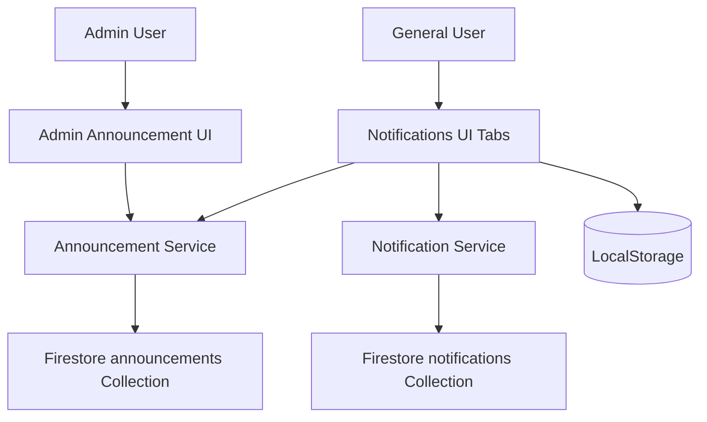
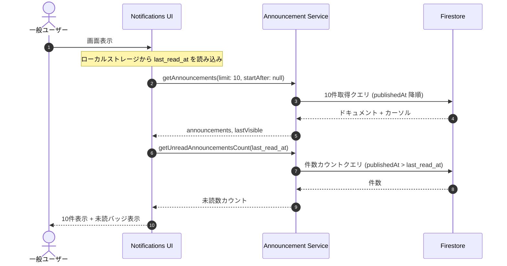

# Design Document: quizeum-announcements

## Overview
本機能は、クイズ投稿SNS「Quizeum」において、運営・管理者がソースコードのビルドやデプロイを行わずに、Web上の管理画面から動的に「運営からのお知らせ」を追加・編集・削除できるようにするものです。
また、一般ユーザー（未ログインユーザー含む）が通知メニュー（`/notifications`）からこれらのお知らせをマークダウン形式で閲覧できるようにします。さらに、お知らせや通知のページング、未読件数の表示、一括既読機能、および重要なお知らせの赤色強調表示を含みます。

### Goals
- 運営メンバーがブラウザ上でお知らせの作成、編集、削除、公開ステータス変更（下書き/公開）を行えるようにする。
- 一般ユーザーおよびゲストユーザーが、ログイン状態を問わず「運営からのお知らせ」を閲覧できるようにする。
- 一般ユーザーに対する通知機能（`/notifications`）の中にタブ形式でお知らせを統合し、デフォルトで「通知」タブをアクティブにする。
- 通知とお知らせの両方で10件ずつのページング取得を可能にし、Firestore の読み取りコストを最適化する。
- 各タブの横にそれぞれの未読数を表示し、一括で既読にする機能を提供する（お知らせはローカルストレージを利用）。
- カテゴリ「重要」を新設し、該当するお知らせを赤色で強調表示する。

### Non-Goals
- ログインユーザーの既読お知らせ情報を Firestore で管理しデバイス間で同期すること（インフラコスト削減と未ログイン対応のため、ローカルデバイス単位でのタイムスタンプ既読管理に限定します）。
- 特定グループやセグメント（例：有料プランユーザーのみ）に限定したお知らせの配信。

## Boundary Commitments

### This Spec Owns
- `announcements` コレクションにおけるデータモデル定義および Firestore サービス層。
- 管理者用お知らせ管理画面（`/admin/announcements`）の作成。
- `/notifications` ページでの「通知」と「運営からのお知らせ」の切り替え表示およびタブ順（左に通知、右にお知らせ、デフォルトは通知）。
- 未ログインユーザー向けのお知らせ閲覧用のルーティング緩和。
- Firestore セキュリティルールにおける `announcements` のアクセス制御。
- 通知および運営からのお知らせの10件ずつのページング取得ロジック（Firestore カーソル `QueryDocumentSnapshot` を利用）。
- 個人宛て通知の一括既読化 API と、運営お知らせのローカルタイムスタンプを用いた未読カウントおよび一括既読ロジック。
- お知らせのカテゴリ「重要」に対応する赤色バッジおよび赤枠によるUI強調表示。

### Out of Boundary
- 個人向け通知システム（`notifications` コレクション）のメッセージ構築ロジックの変更。
- ログイン不要時の通知タブ表示判定以外の、認証機能自体の変更。

### Allowed Dependencies
- `src/lib/security/sanitize.ts` の `parseMarkdownToHtml` を使用したマークダウン表示。
- `src/lib/middleware-auth-cookies.ts` の `isAdminUser` を使用した管理者判定。
- Firebase SDK (Firestore, Auth)。

### Revalidation Triggers
- `Announcement` 型の変更。
- `/notifications` ページのルーティング構造やタブ構造の大幅な変更。

## Architecture

### Existing Architecture Analysis
現在、`/notifications` はミドルウェア（`src/middleware.ts`）によってログインユーザー限定でガードされています。
本機能の実装にあたり、ミドルウェアの制限リストから `/notifications` を除外する必要があります。
その上で、ページ内部で「通知」タブを表示する際のみクライアントサイドでログイン判定を行います。
通知および運営お知らせのデータ取得は、初期表示時は最新の10件のみとし、ユーザー操作によって Firestore のクエリカーソル（`startAfter`）を用いた追加フェッチを行うサーバーサイドページング方式に変更します。

未読カウントについては：
- **個人宛て通知**: `isRead == false` のドキュメント件数をカウントする Firestore クエリを使用します。
- **運営お知らせ**: ローカルストレージに `quizeum_announcements_last_read_at` (タイムスタンプ) を保存し、`publishedAt > last_read_at` のお知らせ件数をカウントします（初期アクセス時は 0 または最新1件の公開日時で初期化）。

### Architecture Pattern & Boundary Map


### Technology Stack
| Layer | Choice / Version | Role in Feature | Notes |
|-------|------------------|-----------------|-------|
| Frontend / CLI | Next.js 16.2.6 (App Router), React 19.2.4 | UI / 画面構成 | shadcn/ui を使用 |
| Backend / Services | Firebase SDK 12.13.0 | データアクセス・サービス層 | Firestore ページング・一括更新 |
| Data / Storage | Firestore | 永続化 | announcements コレクション |

## File Structure Plan

### Directory Structure
```
d:/quizeum/
├── src/
│   ├── app/
│   │   ├── admin/
│   │   │   ├── announcements/
│   │   │   │   ├── page.tsx               # 管理者お知らせ管理画面
│   │   │   │   └── client.tsx             # [MODIFY] カテゴリ「重要」追加
│   │   │   └── page.tsx                   # 管理者ポータル（メニュー追加）
│   │   └── notifications/
│   │       ├── page.tsx                   # [MODIFY] ページング、「もっと見る」ボタン、未読バッジ、全件既読機能の統合
│   │       ├── notifications-client.tsx   # [MODIFY] デフォルトアクティブタブ、通知ページング、通知未読カウント
│   │       └── announcements-tab.tsx      # [MODIFY] お知らせページング、お知らせ未読カウント、一括既読、「重要」表示
│   ├── services/
│   │   ├── announcement.ts                # [MODIFY] ページング（カーソル）、未読カウント関数の追加
│   │   └── notification.ts                # [MODIFY] ページング（カーソル）、未読カウント、全件既読APIの追加
│   ├── types/
│   │   └── index.ts                       # [MODIFY] Announcement 型に 'important' を追加
│   └── middleware.ts                      # /notifications ガード除外
```

### Modified Files
- `src/types/index.ts` — `Announcement` 型の `category` に `'important'` を追加。
- `src/services/announcement.ts` — `getAnnouncements` をカーソル（`startAfter`）対応化。未読カウント取得APIを追加。
- `src/services/notification.ts` — `getNotifications` をカーソル対応化。未読カウント取得API、全件既読APIを追加。
- `src/app/admin/announcements/client.tsx` — カテゴリの選択肢に「重要 (important)」を追加。
- `src/app/notifications/notifications-client.tsx` — タブ順を左から「通知」、「運営からのお知らせ」とし、デフォルトを「通知」に。通知側の10件ページング、未読バッジ、全件既読、お知らせタブの未読バッジとの統合処理を実装。
- `src/app/notifications/announcements-tab.tsx` — お知らせ側の10件ページング、「もっと見る」ボタン、一括既読、および「重要」お知らせの赤色強調表示を実装。
- `firestore.rules` — `announcements` コレクションへのルールを追加。

## System Flows


## Requirements Traceability

| Requirement | Summary | Components | Interfaces | Flows |
|-------------|---------|------------|------------|-------|
| 1.6 | カテゴリ「重要」の選択 | AdminAnnouncementsClient | `src/app/admin/announcements/client.tsx` | - |
| 2.1 | 通知画面 of タブ順・初期タブ | NotificationsClient | `src/app/notifications/notifications-client.tsx` | - |
| 2.8 | バッジとアイコンの表示 | AnnouncementsTab | `src/app/notifications/announcements-tab.tsx` | - |
| 2.9 | 「重要」お知らせの赤色強調表示 | AnnouncementsTab | `src/app/notifications/announcements-tab.tsx` | - |
| 4.1 | 初期10件表示 | NotificationsClient, AnnouncementsTab | `src/app/notifications/notifications-client.tsx`, `announcements-tab.tsx` | - |
| 4.2 | 「もっと見る」ボタンによるページング | NotificationsClient, AnnouncementsTab | `src/app/notifications/notifications-client.tsx`, `announcements-tab.tsx` | - |
| 4.3 | 追加データなし時のボタン制御 | NotificationsClient, AnnouncementsTab | `src/app/notifications/notifications-client.tsx`, `announcements-tab.tsx` | - |
| 4.4 | 各タブの未読数バッジ表示 | NotificationsClient | `src/app/notifications/notifications-client.tsx` | - |
| 4.5 | 未ログイン時の通知未読非表示 | NotificationsClient | `src/app/notifications/notifications-client.tsx` | - |
| 4.6 | 通知の全件既読機能 | NotificationsClient, NotificationService | `src/app/notifications/notifications-client.tsx`, `src/services/notification.ts` | - |
| 4.7 | お知らせの全件既読機能 | AnnouncementsTab, LocalStorage | `src/app/notifications/announcements-tab.tsx` | - |

## Components and Interfaces

### Services

#### AnnouncementService (`src/services/announcement.ts`)
- **Intent**: announcements コレクションに対する Firestore のデータアクセスをカプセル化し、ページングおよび未読数の取得をサポートする。
- **Requirements**: 1.2, 1.3, 1.5, 2.2, 3.3, 4.1, 4.2, 4.4

##### Service Interface
```typescript
import { QueryDocumentSnapshot } from 'firebase/firestore';

export interface Announcement {
  id: string;
  title: string;
  content: string;
  category: 'info' | 'maintenance' | 'update' | 'bug' | 'important';
  status: 'draft' | 'published';
  publishedAt: Date | null;
  createdAt: Date;
  updatedAt: Date;
  authorId: string;
}

export interface PaginatedAnnouncements {
  items: Announcement[];
  lastVisible: QueryDocumentSnapshot | null;
}

export function getAnnouncements(
  limitCount?: number,
  startAfterDoc?: QueryDocumentSnapshot | null
): Promise<PaginatedAnnouncements>;

export function getAnnouncementById(id: string): Promise<Announcement | null>;
export function adminGetAnnouncements(): Promise<Announcement[]>;
export function getUnreadAnnouncementsCount(lastReadAt: Date | null): Promise<number>;
export function createAnnouncement(announcement: Omit<Announcement, 'id' | 'createdAt' | 'updatedAt'>): Promise<string>;
export function updateAnnouncement(id: string, announcement: Partial<Announcement>): Promise<void>;
export function deleteAnnouncement(id: string): Promise<void>;
```

#### NotificationService (`src/services/notification.ts`)
- **Intent**: notifications コレクションに対する Firestore のデータアクセスをカプセル化し、ページング、未読数取得、一括既読をサポートする。
- **Requirements**: 4.1, 4.2, 4.4, 4.6

##### Service Interface
```typescript
import { QueryDocumentSnapshot } from 'firebase/firestore';
import { Notification } from '@/services/notification';

export interface PaginatedNotifications {
  items: Notification[];
  lastVisible: QueryDocumentSnapshot | null;
}

export function getNotifications(
  userId: string,
  limitCount?: number,
  startAfterDoc?: QueryDocumentSnapshot | null
): Promise<PaginatedNotifications>;

export function getUnreadNotificationsCount(userId: string): Promise<number>;
export function markAllNotificationsAsRead(userId: string): Promise<void>;
export function markAsRead(notificationId: string): Promise<void>;
```

### UI Components

#### NotificationsClient (`src/app/notifications/notifications-client.tsx`)
- **Intent**: タブUI全体の制御を行い、デフォルトアクティブタブを「通知」にし、左に「通知」右に「運営からのお知らせ」を表示する。各タブの横に未読数をバッジ表示する。個人宛て通知の10件ずつのページング、「もっと見る」ボタン、および一括既読を管理する。
- **Requirements**: 2.1, 4.1, 4.2, 4.3, 4.4, 4.5, 4.6
- **Dependencies**: `NotificationService`, `AnnouncementService`

#### AnnouncementsTab (`src/app/notifications/announcements-tab.tsx`)
- **Intent**: 運営からのお知らせ一覧を公開日時降順で表示し、10件ずつのページング、アコーディオン形式の展開表示、ローカルストレージを利用した一括既読機能、「重要」お知らせの赤色（`border-rose-500`, `bg-rose-50/50` 等）強調表示を実装する。
- **Requirements**: 2.8, 2.9, 4.1, 4.2, 4.3, 4.7
- **Dependencies**: `AnnouncementService`, `parseMarkdownToHtml`

## Data Models

### Domain Model & Firestore Schema

#### `announcements` Collection Document
```json
{
  "title": "【重要】緊急システムメンテナンスのお知らせ",
  "content": "**メンテナンス時間**\n2026年6月25日 02:00 - 05:00\n\n上記時間帯はサービスをご利用いただけません。",
  "category": "important",
  "status": "published",
  "publishedAt": "Timestamp",
  "createdAt": "Timestamp",
  "updatedAt": "Timestamp",
  "authorId": "string"
}
```

## Error Handling

### Error Strategy
- ページング時のデータ追加取得で通信エラーなどが発生した場合は、トースト（Shadcn `useToast`）にてエラー通知を行い、既存の取得済みデータは保持して「もっと見る」ボタンを再試行可能な状態で維持します。
- Firestore のルールによって未認証ユーザーからの書き込み要求や、他人の個人通知へのアクセスが拒否された場合は、コンソールログにエラーを出力し、UI上に不正アクセスである旨を警告します。

## Testing Strategy
- **Unit/Integration Tests**:
  - `src/services/announcement.ts` において、`startAfter` を渡した際に次の10件が正しく取得できること、および `getUnreadAnnouncementsCount` が正常に動くことの検証。
  - `src/services/notification.ts` において、`markAllNotificationsAsRead` が実行された際に、該当ユーザーの `isRead == false` ドキュメントがすべて `isRead == true` に更新されることの検証。
- **E2E/UI Tests**:
  - `/notifications` ページ表示時、デフォルトで「通知」タブが左側でアクティブになっており、未ログイン時はログイン誘導が表示されることの検証。
  - 「運営からのお知らせ」タブで、「すべて既読にする」ボタンをクリックした際に、ローカルストレージのタイムスタンプが更新され、未読バッジのカウントが 0 になることの検証。
  - カテゴリが「重要」のお知らせカードが赤色で強調表示され、赤い「重要」カテゴリバッジが表示されることの検証。
