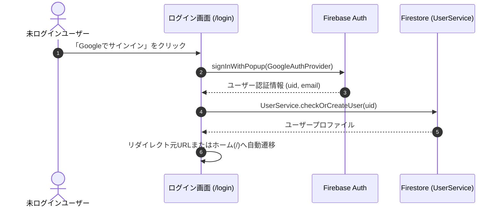

# Technical Design Document: quizeum-auth-profile-ui

## Overview
本ドキュメントは、クイズ投稿SNS「quizeum」におけるユーザー認証・プロフィール関連UIの技術設計仕様を定義します。ユーザー認証の入り口、個人プロフィールの閲覧・編集、ソーシャルフォロー連携、リアクション履歴、およびアクティビティ通知一覧を含む、アプリケーション全体の基本構造となる画面群を構築します。

本システムは、Next.jsのApp RouterおよびReact、TypeScriptのフロントエンド構成に加え、CSS Modulesによる親しみやすく洗練されたデザインシステムを実装し、Firebase AuthおよびFirestore上の `UserService` とのインターフェース接続を行います。

### Goals
- 21の画面群の基礎となるデザインシステム（温かみがあり、硬すぎないカジュアルモダンなUI）トークンおよびレイアウトの構築。
- Google認証を用いたセキュアなサインイン・新規登録UIと、セッションに基づく動的なページリダイレクト。
- プロフィール画面でのアバター、バッジ、評価、投稿クイズ/リストのタブ切替表示。
- 退会処理中（`delete_pending`）のユーザーデータへのアクセス制御（404フォールバック）をクライアントサイドで統合。

### Non-Goals
- クイズプレイ画面、クイズ作成画面、モデレーション画面の具体的なUI設計（それぞれの専用スペックが担当）。
- アカウント物理削除や大規模データ匿名化のバックエンド処理そのものの実装（`quizeum-core`が担当）。

---

## Boundary Commitments

### This Spec Owns
- **UIルーティング設計**: `/login`, `/profile/[uid]`, `/profile/edit`, `/profile/[uid]/connections`, `/notifications`, `/profile/[uid]/likes` の各ページコンポーネント。
- **デザインシステム**: `globals.css` および共通テーマ（カジュアルモダン、十分な角丸、温かみのあるカラー）。
- **認証連携と状態監視**: `useAuth` フックによるセッション状態とページアクセス保護（リダイレクト制御）。
- **クライアント側権限保護**: `deleteStatus == 'delete_pending'` アカウント閲覧時の404表示。

### Out of Boundary
- Firestoreデータベース内のセキュリティルール設計そのもの。
- 称号バッジ自動付与の判定サーバー処理（UIは単に `users.badges` を取得してアイコン表示するのみ）。

### Allowed Dependencies
- **`quizeum-core`**: `UserService`, `AuthContext`
- **デザイン・アイコンライブラリ**: `lucide-react` (アイコン用)

### Revalidation Triggers
- `UserService` または Firebase Auth 関連インターフェースの戻り値型変更。
- Next.js App Router での共通メタデータ構造の変更。

---

## Architecture

### Existing Architecture Analysis
現在、`src/app/login/page.tsx` に初期のFirebase Auth接続UIが存在しますが、CSSModulesの結合や、他の画面階層（`profile`, `notifications` 等）は完全に未実装です。本設計ではこれらを整理された Next.js App Router 構成の下で完全に再定義し、スタイリングを共通化します。

### Technology Stack
- **Frontend**: Next.js v16.2.6 (App Router), React v19.2.4, TypeScript
- **Styling**: Vanilla CSS (CSS Modules)
- **Icons**: `lucide-react`

---

## File Structure Plan

### Directory Structure
```
src/
├── app/
│   ├── globals.css                # 共通CSSトークン定義（硬すぎない親しみやすいフォント・角丸・配色）
│   ├── layout.tsx                 # 共通レイアウト（Headerを包含）
│   ├── login/
│   │   ├── page.tsx               # 認証画面 (1.1, 1.2, 1.3)
│   │   └── login.module.css
│   ├── profile/
│   │   ├── edit/
│   │   │   ├── page.tsx           # プロフィール編集画面 (3.1, 3.2, 3.3)
│   │   │   └── edit.module.css
│   │   └── [uid]/
│   │       ├── connections/
│   │       │   ├── page.tsx       # フォロー/フォロワー一覧画面 (4.1, 4.2)
│   │       │   └── connections.module.css
│   │       ├── likes/
│   │       │   ├── page.tsx       # リアクション履歴画面 (6.1, 6.2)
│   │       │   └── likes.module.css
│   │       ├── page.tsx           # プロフィール画面 (2.1, 2.2, 2.3, 2.4, 2.5)
│   │       └── profile.module.css
│   └── notifications/
│       ├── page.tsx               # 通知一覧画面 (5.1, 5.2)
│       └── notifications.module.css
└── components/
    └── layout/
        ├── header.tsx             # 共通ヘッダー（グローバルナビゲーション、アバター表示）
        └── header.module.css
```

### Modified Files
- `src/app/globals.css` — 共通カラー、角丸トークン（`--radius-md: 12px`, `--radius-lg: 20px`）、ボタンやカードの基本スタイルの追加。
- `src/app/login/page.tsx` — Googleログイン処理の統合とリダイレクト制御。

---

## System Flows

### 認証・ログインリダイレクトフロー


---

## Requirements Traceability

| Requirement | Summary | Components | Interfaces | Flows |
|-------------|---------|------------|------------|-------|
| 1.1 | Google OAuthログイン | `/login` Page | Firebase Auth | 認証フロー |
| 1.2 | ログイン成功時のリダイレクト | `/login` Page | `useAuth`, `useRouter` | 認証フロー |
| 1.3 | ログイン済みのログイン画面アクセス回避 | `/login` Page | `useAuth` | - |
| 2.1 | プロフィール基本情報・バッジ表示 | `/profile/[uid]` Page | `UserService` | - |
| 2.2 | 作成クイズ・リストのタブ表示 | `/profile/[uid]` Page | `UserService`, Tab UI | - |
| 2.3 | 他人のプロフィールのフォローボタン | `/profile/[uid]` Page | `UserService` | - |
| 2.4 | フォロー・フォロー解除のインタラクション | `/profile/[uid]` Page | `UserService.followUser` | - |
| 2.5 | 退会処理中アカウントへのアクセス制御 | `/profile/[uid]` Page | `UserService` (deleteStatus) | - |
| 3.1 | プロフィール編集入力フォーム | `/profile/edit` Page | Input Form | - |
| 3.2 | 表示名30字・自己紹介200字制限 | `/profile/edit` Page | Form Validation (Zod) | - |
| 3.3 | 編集保存とプロフィール画面への遷移 | `/profile/edit` Page | `UserService.updateProfile` | - |
| 4.1 | フォロー・フォロワーのタブ表示 | `/profile/[uid]/connections` Page | Tab UI | - |
| 4.2 | フォローカードとダイレクトトグル | `/profile/[uid]/connections` Page | UserCard, `UserService` | - |
| 5.1 | 通知の時系列一覧表示 | `/notifications` Page | Notification List | - |
| 5.2 | 指摘完了通知クリックによる遷移 | `/notifications` Page | Click-to-QuizDetail | - |
| 6.1 | 送受信リアクションのタブ表示 | `/profile/[uid]/likes` Page | Tab UI | - |
| 6.2 | リアクションカードと遷移 | `/profile/[uid]/likes` Page | LikeCard | - |

---

## Components and Interfaces

### Component Summary Table

| Component | Domain/Layer | Intent | Req Coverage | Key Dependencies | Contracts |
|-----------|--------------|--------|--------------|------------------|-----------|
| `LoginPage` | UI / Page | 認証の開始とリダイレクト制御 | 1.1, 1.2, 1.3 | `useAuth`, Firebase Auth | State |
| `ProfilePage` | UI / Page | プロフィール情報の閲覧とソーシャルトグル、退会チェック | 2.1, 2.2, 2.3, 2.4, 2.5 | `UserService`, `useAuth` | State, API |
| `ProfileEditPage` | UI / Page | プロフィール表示名・自己紹介の編集・バリデーション | 3.1, 3.2, 3.3 | `UserService`, Zod Schema | FormState |
| `ConnectionsPage` | UI / Page | フォロー/フォロワーのタブ切替一覧と直接フォロー制御 | 4.1, 4.2 | `UserService` | State |
| `NotificationsPage` | UI / Page | アクティビティ通知一覧の表示と詳細遷移 | 5.1, 5.2 | `NotificationService` | State |
| `LikesPage` | UI / Page | リアクション送信・獲得履歴のタブ表示と遷移 | 6.1, 6.2 | `ReactionService` | State |
| `Header` | UI / Layout | グローバルナビゲーションおよびログインアバターの表示 | - | `useAuth` | State |

---

## Data Models
本UIコンポーネント群は、`quizeum-core` で定義されたFirestoreドキュメントスキーマ（`User`, `Badge`, `Follow`, `Notification`, `Reaction` 等）と結合します。

### UI固有の型定義
```typescript
// プロフィール編集フォームの入力型
export interface ProfileEditFormInput {
  displayName: string;
  bio: string;
}
```

---

## Error Handling

### Error Strategy
- **認証エラー (Google Pop-up)**:
  - ユーザーがポップアップを閉じた、ブロックされた等のケースに対し、親しみやすい日本語メッセージ（例：「Googleログインがキャンセルされました。もう一度お試しください。」）を画面上にアラート表示します。
- **バリデーションエラー**:
  - プロフィール編集時、入力値が制限文字数（表示名30字、自己紹介200字）を超えた場合、送信ボタンを非活性化し、テキストの下に赤い警告メッセージをインライン表示します。
- **404フォールバック**:
  - `deleteStatus` が `'delete_pending'` のプロフィールにアクセスした場合、Next.js の `notFound()` をトリガーして即座に親切な404画面へと誘導します。

---

## Testing Strategy

### Unit Tests
- **編集入力長バリデーション**:
  - 表示名30文字、自己紹介200文字のバリデーションが入力時に即座に機能し、ボタン制御が行われるかを単体テスト。

### Integration Tests
- **ログイン状態遷移**:
  - `useAuth` のセッションが確立された時点で、ログイン画面からホーム画面へ、未ログイン時は保護ページからログイン画面へ、それぞれリダイレクトが動作することをテスト。

### E2E/UI Tests
- **プロフィールのタブ切り替え**:
  - プロフィール画面で「作成したクイズ」タブと「作成したリスト」タブが正しく機能し、表示要素が切り替わるかをブラウザテスト。
