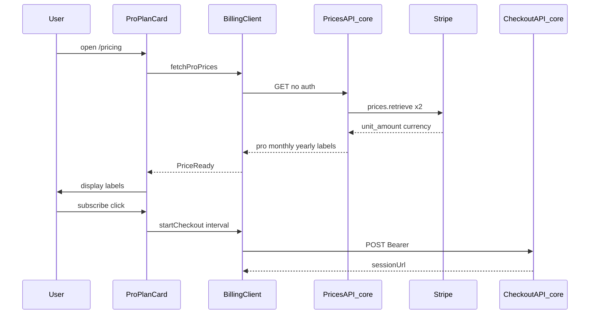
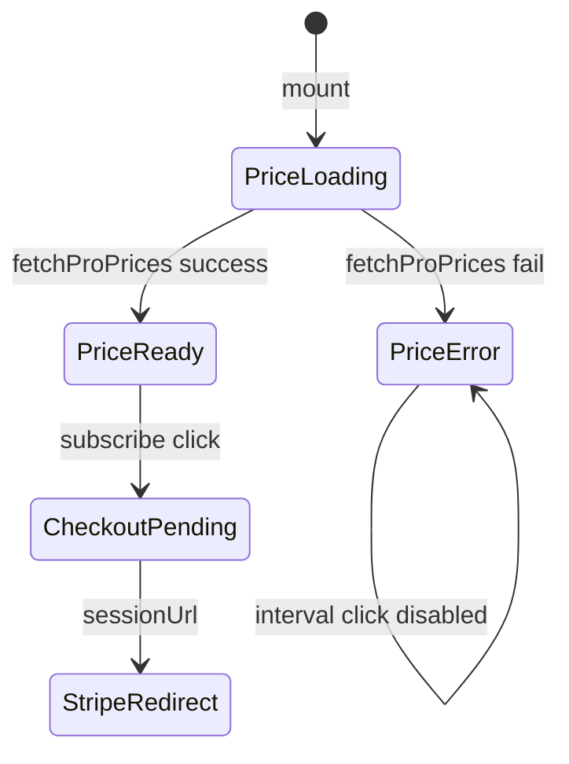
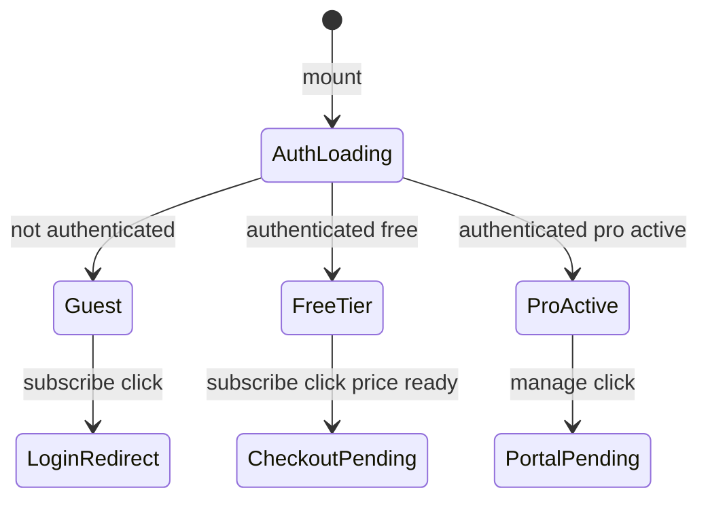

# Technical Design Document: quizeum-billing-subscription-ui

## Overview

本ドキュメントは、クイズ投稿SNS「quizeum」における料金画面（`/pricing`）、購読開始・契約管理 CTA、Checkout フィードバック、グローバルナビ導線、および **Pro プラン価格の動的表示** のフロントエンド UI 技術設計を定義します。

`quizeum-core` の購読開始 API・契約管理 API・**価格取得 API**・`subscriptionTier` エンタイトルメントを消費する薄い UI 層として実装します。決済処理本体・Webhook 同期・Stripe Price 取得のサーバー実装はコアが担当し、プレイ画面内の制限誘導は `quizeum-play-flow-ui` が担当します。

**Phase 1（2026-06）**: `/pricing`、Checkout/Portal CTA、契約状態表示、サイドバー導線 — **実装済み**。

**Phase 2（2026-06-08）**: Pro 月額・年額を決済サービス（Stripe）から動的取得して表示。取得失敗時は「価格を読み込めません」を表示し、購読 CTA を無効化。契約管理 CTA は維持。

### Goals
- ログイン済み無料ユーザーが `/pricing` から月額/年額を選び Stripe Checkout へ遷移できる（Phase 1 維持）。
- Pro 契約中ユーザーが Customer Portal へ遷移できる（Phase 1 維持）。
- **Pro 表示価格が Stripe Price と一致**し、Dashboard 価格変更時に手動同期が不要になる（Phase 2）。
- 価格取得失敗時に代替固定金額を出さず、ユーザーに障害を明示する（Phase 2）。

### Non-Goals
- Webhook、Firestore 課金フィールド書き込み、Rules の実装（`quizeum-core`）。
- プレイ画面の残り質問数・制限ダイアログ（`quizeum-play-flow-ui`）。
- Premium 販売 UI、Stripe Elements、アプリ内カード入力。
- Stripe Dashboard での Product/Price 作成。

---

## Boundary Commitments

### This Spec Owns
- **ルーティング**: `/pricing` ページおよび関連 CSS Modules。
- **マーケティング表示正本**: プラン名称・特典 bullets — `pricing-display.ts`（**金額は含めない**）。
- **価格表示 UI**: 価格取得 API の結果を Pro カードに描画、ローディング/エラー/CTA 無効化。
- **クライアント操作**: 購読開始 / 契約管理 / **価格取得** API の呼び出し、ローディング・エラー UI、外部 URL リダイレクト。
- **契約状態 UI**: auth-context の `User` に基づく CTA 切替・Pro バッジ（`pricing-entitlement.ts`）。
- **Checkout フィードバック**: `?checkout=success|canceled` の検知・バナー・URL クリーンアップ。
- **ナビ導線**: サイドバー `/pricing` リンクとアクティブハイライト。

### Out of Boundary
- `POST /api/billing/checkout-session`、`POST /api/billing/portal-session`、`POST /api/webhooks/stripe` の実装。
- **`GET /api/billing/prices` のサーバー実装**、Stripe `prices.retrieve`、価格キャッシュ、`pricing-format.ts` の整形ロジック（`quizeum-core` が担当）。
- `subscription-plans.ts` の Price ID マッピング、Stripe Customer ライフサイクル。
- `ask-ai` の tier ベース制限、プレイ中 `isPremium` 表示。

### Allowed Dependencies
- **`quizeum-core`（P0）**: Checkout/Portal API、**Prices API**、Checkout/Portal の redirect URL 設定。
- **`quizeum-auth-profile-ui`（P0）**: `useAuth`、`refreshUser`、`/login?redirect=`。
- **`@/types`（P0）**: `User`, `SubscriptionTier`, `PriceInterval`。
- **`getPaidTierDefinitions()`（P1）**: core 側 Price ID 参照（UI は直接 import しない）。
- **`@mui/icons-material`（P1）**: アイコン。

### Revalidation Triggers
- **Prices API** レスポンス形状変更（トップレベル `monthly` / `yearly` / `savingsLabel`）。
- Checkout / Portal API のリクエスト・レスポンス形状変更。
- `User` の `subscriptionTier` / `subscriptionStatus` 解釈変更（`pricing-entitlement.ts` 同期必須）。
- `pricing-display` の tier 配列構造変更（Premium 追加時）。

---

## Architecture

### Existing Architecture Analysis

| 領域 | Phase 1 状態 | Phase 2 変更 |
|------|-------------|-------------|
| `/pricing` ページ | **実装済** | 変更なし（子コンポーネントが価格取得） |
| `ProPlanCard` | **実装済**（ハードコード価格） | 価格状態機械・CTA ガード追加 |
| `pricing-display.ts` | **実装済**（¥980 固定） | 価格フィールド削除、特典のみ |
| `billing-client.ts` | **実装済**（POST のみ） | `fetchProPrices()` 追加 |
| Prices API | **未存在** | core が新規提供（本 UI は消費） |
| サイドバー導線 | **実装済** | 変更なし |

### Architecture Pattern & Boundary Map

**選択パターン**: Thin Client + Hosted Redirect + **Server-sourced Price Quotes**



**Architecture Integration**:
- 依存方向: `types` → `pricing-display` / `pricing-entitlement` → `billing-client` → `components/pricing` → `app/pricing/page.tsx`
- 価格の正本は **Stripe（core 経由）**。UI は取得結果の表示ラベルのみ保持（セッション中メモリ）。
- クライアントは `firebase-admin` / Stripe 秘密鍵に触れない。

### Technology Stack

| Layer | Choice / Version | Role in Feature | Notes |
|-------|------------------|-----------------|-------|
| Frontend | Next.js 16.2.6 App Router | `/pricing` ルート | Client Component 主体 |
| UI | React 19.2.4 | 価格状態・CTA | `useEffect` で価格取得 |
| Styling | CSS Modules | カード・ローディング | Tailwind 不使用 |
| Auth | Firebase Auth 12.x | Checkout/Portal トークン | 価格 GET は認証不要 |
| Upstream | quizeum-core billing routes | Checkout / Portal / **Prices** | UI は消費のみ |
| External | Stripe API via core | Price オブジェクト | `unit_amount` JPY |

---

## File Structure Plan

### Directory Structure（本スペック所有・改修）

```
src/
├── app/pricing/
│   ├── page.tsx                         # 料金画面（Phase 1 済、Phase 2 変更なし）
│   └── pricing.module.css
├── components/pricing/
│   ├── pro-plan-card.tsx                # Phase 2: 価格状態・CTA ガード
│   ├── pro-plan-card.module.css         # Phase 2: 価格ローディング/エラー用スタイル
│   ├── free-plan-card.tsx               # ¥0 固定（変更なし）
│   ├── subscription-status-badge.tsx
│   └── checkout-feedback-banner.tsx
└── lib/
    ├── billing-client.ts                # Phase 2: fetchProPrices() 追加
    ├── pricing-display.ts               # Phase 2: 価格ラベル削除、特典のみ
    └── pricing-entitlement.ts
```

### Upstream Files（quizeum-core 実装 — 本スペックは契約のみ定義）

```
src/
├── app/api/billing/prices/route.ts      # GET 価格クォート（認証不要）
├── services/billing-prices.ts           # stripe.prices.retrieve + 整形委譲
└── lib/pricing-format.ts                # JPY ラベル・savingsLabel 計算
```

### Modified Files
- `src/lib/pricing-display.ts` — `monthlyPriceLabel` / `yearlyPriceLabel` / `yearlySavingsLabel` を削除。`displayName` と `featureBullets` のみ。
- `src/lib/billing-client.ts` — `fetchProPrices()` と `ProPricesResult` 型を追加。
- `src/components/pricing/pro-plan-card.tsx` — 価格状態機械、失敗時 UI、購読/interval 無効化。
- `src/components/pricing/pro-plan-card.module.css` — 価格ローディング・エラーテキスト用。

### Test Files（Phase 2 追加分）

```
tests/
├── lib/
│   ├── pricing-display.test.ts          # 価格 assertion 削除
│   └── billing-client.test.ts           # fetchProPrices 成功/失敗
├── components/pricing/
│   └── pro-plan-card.test.tsx           # loading/error/disabled ケース
└── api/
    └── billing-prices.test.ts           # core 側（quizeum-core タスク境界）
```

---

## System Flows

### Pro 価格表示状態機械（ProPlanCard）



**Key Decisions**:
- `PriceError` 時: 価格欄に「価格を読み込めません」。購読ボタン無効（2.4）。interval トグル無効（10.5）。
- `ctaMode=manage` 時: `PriceError` でも Portal CTA は有効（3.7）。
- `ctaMode=guest` 時: ログイン誘導は価格成否に非依存（2.1）。
- 月額・年額の**いずれか一方でも取得失敗**した場合は全体を `PriceError` とする（部分成功は許容しない）。

### CTA 状態マシン（PricingPage — Phase 1 維持）



---

## Requirements Traceability

| Requirement | Summary | Components | Interfaces | Flows |
|-------------|---------|------------|------------|-------|
| 1.1–1.2 | `/pricing` Pro 表示 | `PricingPage`, `ProPlanCard` | — | 基本表示 |
| 1.3 | 動的価格（非ハードコード） | `ProPlanCard`, `billing-client` | Prices API | Price fetch |
| 1.4–1.5 | 未ログイン閲覧・Premium 拡張余地 | `PricingPage`, `pricing-display` | — | — |
| 2.1–2.3, 2.5–2.8 | 購読開始・認証・エラー | `ProPlanCard`, `billing-client` | Checkout API | Guest→Checkout |
| 2.4 | 価格未取得時購読無効 | `ProPlanCard` | — | PriceError gate |
| 3.1–3.6 | 契約管理 CTA | `ProPlanCard`, `billing-client` | Portal API | ProActive→Portal |
| 3.7 | 価格失敗時 Portal 維持 | `ProPlanCard` | — | manage CTA |
| 4.1–4.5 | Checkout フィードバック | `CheckoutFeedbackBanner`, `PricingPage` | — | success/canceled |
| 5.1–5.3 | サイドバー導線 | `sidebar.tsx` | — | ナビ |
| 6.1–6.4 | 契約状態表示 | `SubscriptionStatusBadge`, `pricing-entitlement` | Auth `User` | CTA 分岐 |
| 7.1–7.4 | API/認証エラー・スケルトン | `ProPlanCard`, `billing-client` | API errors | — |
| 7.5–7.6 | 価格ローディング/失敗表示 | `ProPlanCard` | Prices API | PriceLoading/Error |
| 8.1–8.4 | デザイン・a11y | pricing CSS | — | — |
| 9.1–9.6 | 境界・E2E | — | core APIs | E2E |
| 10.1–10.6 | 表示形式・お得・Free 固定 | `ProPlanCard`, core `pricing-format` | Prices API | PriceReady |

---

## Components and Interfaces

| Component | Domain/Layer | Intent | Req Coverage | Key Dependencies | Contracts |
|-----------|--------------|--------|--------------|------------------|-----------|
| `PricingPage` | UI / Route | 料金画面オーケストレーション | 1.4, 4, 6, 7.4 | `useAuth` (P0) | State |
| `ProPlanCard` | UI | Pro カード・価格状態・CTA | 1, 2, 3, 7.5–7.6, 10 | `billing-client` (P0) | State |
| `FreePlanCard` | UI | Free ¥0 固定表示 | 10.4 | `pricing-display` (P0) | — |
| `billing-client` | lib | API 呼び出し | 2, 3, 7, 10 | fetch (P0) | API |
| `pricing-display` | lib | 名称・特典正本 | 1, 10.6 | — | State |
| `pricing-entitlement` | lib | tier/CTA 解釈 | 3, 6 | `@/types` (P0) | State |
| `billing-prices`（core） | service | Stripe 価格取得 | 1.3, 9.2 | Stripe (P0) | Service |
| `pricing-format`（core） | lib | JPY ラベル整形 | 10.1–10.3 | — | Service |

### Lib Layer — billing-client（Phase 2 拡張）

**Contracts**: API

```typescript
export type ProPriceInterval = 'monthly' | 'yearly';

export interface ProPriceQuote {
  amount: number;       // JPY 整数（Stripe unit_amount）
  currency: 'jpy';
  label: string;        // 例: "¥980/月"
}

export interface ProPricesResult {
  monthly: ProPriceQuote;
  yearly: ProPriceQuote;
  savingsLabel?: string; // 例: "年額で約2ヶ月分お得"
}

export async function fetchProPrices(): Promise<ProPricesResult>;
```

- `fetchProPrices`: 認証不要の `GET /api/billing/prices`。失敗時 `BillingClientError`（code: `network` | `unknown`）。
- 既存 `startCheckoutSession` / `startPortalSession` は Phase 1 どおり。

##### API Contract（消費 — Prices）

| Method | Endpoint | Request | Response | Errors |
|--------|----------|---------|----------|--------|
| GET | `/api/billing/prices` | なし | `ProPricesResult` | 500 |

**Upstream 実装メモ（core）**:
- `getPaidTierDefinitions()` の Pro `priceIds` を使用し `stripe.prices.retrieve` を並列実行。
- JPY: `unit_amount` をそのまま円整数として扱う（Stripe JPY はゼロ小数）。
- `savingsLabel`: `(monthly.amount * 12 - yearly.amount) / monthly.amount` を切り捨て整数化し、1 以上のとき `"年額で約{N}ヶ月分お得"` を付与。
- `export const revalidate = 3600`（1 時間キャッシュ。`weekly-top` の 1800s より長く、価格変動頻度が低いため）。

### Lib Layer — pricing-display（Phase 2 改修）

```typescript
export interface PricingPlanDisplay {
  tier: 'free' | 'pro';
  displayName: string;
  featureBullets: readonly PricingFeatureBullet[];
  // monthlyPriceLabel / yearlyPriceLabel / yearlySavingsLabel は削除
}
```

- Free の `¥0` は `FreePlanCard` 内で固定表示（10.4）。`pricing-display` には金額フィールドを持たない。

### UI Layer — ProPlanCard（Phase 2 改修）

| Field | Detail |
|-------|--------|
| Intent | Pro プラン表示、動的価格、CTA |
| Requirements | 1.3, 2.4, 3.7, 7.5–7.6, 10.1–10.6 |

**State Management**

```typescript
type ProPriceUiState =
  | { status: 'loading' }
  | { status: 'ready'; prices: ProPricesResult }
  | { status: 'error' };
```

- `status === 'loading'`: 価格欄にスケルトンまたは「読み込み中…」（7.5）。
- `status === 'error'`: 価格欄「価格を読み込めません」（7.6）。`data-testid="pricing-price-error"`。
- `status === 'ready'`: `selectedInterval` に応じて `monthly.label` / `yearly.label` 表示。年額時 `savingsLabel` 表示（10.3）。
- `isSubscribeDisabled`: `loading || ctaMode === 'loading' || priceStatus !== 'ready'`（購読時）。Portal は `priceStatus` 非依存（3.7）。
- `isIntervalDisabled`: `loading || priceStatus !== 'ready'`（10.5）。

**Implementation Notes**
- Integration: マウント時 `useEffect` で `fetchProPrices()` 1 回。自動リトライは初版なし（ページ再読み込みで再取得）。
- Validation: 特典リストは `pricing-display` から常時表示（10.6）。
- Risks: Stripe 障害時は購読不可だが Portal は利用可 — 意図した劣化。

---

## Data Models

### API Data Transfer — Prices（新規）

```json
{
  "monthly": { "amount": 980, "currency": "jpy", "label": "¥980/月" },
  "yearly": { "amount": 9800, "currency": "jpy", "label": "¥9,800/年" },
  "savingsLabel": "年額で約2ヶ月分お得"
}
```

- `amount` は Checkout と同一 Price ID 由来のため、表示と課金の整合が保たれる。
- エラー時は HTTP 500 + `{ "error": "internal-error", "message": "..." }`。UI は詳細を出さない（7.3）。

---

## Error Handling

| 区分 | UI 応答 | 回復 |
|------|---------|------|
| Prices API 500 / network | 価格欄「価格を読み込めません」、購読無効 | ページ再読み込み |
| Checkout 401/409 等 | Phase 1 どおり | 既存ハンドラ |
| Portal 404 等 | Phase 1 どおり | 既存ハンドラ |

---

## Testing Strategy

### Unit Tests
1. `fetchProPrices` — 200 レスポンスのパース、500/network の `BillingClientError`（7.6 連携）。
2. `pricing-display` — Pro/Free の `displayName`・`featureBullets` のみ（価格フィールドなし）。
3. `pricing-format`（core）— `980` → `¥980/月`、`savingsLabel` 計算（10.1–10.3）。
4. `billing-prices` service（core）— Stripe mock で monthly/yearly 取得成功・一方失敗で 500。

### Integration Tests（Jest）
1. `ProPlanCard` — 価格 loading 中にスケルトン/読み込み表示（7.5）。
2. `ProPlanCard` — 価格 error 時「価格を読み込めません」、購読 disabled、Portal enabled（7.6, 2.4, 3.7）。
3. `ProPlanCard` — 価格 ready 時に月額/年額ラベル切替（10.1–10.2）。
4. Phase 1 回帰 — guest/subscribe/manage CTA、Checkout/Portal 呼び出し。

### E2E Tests（Playwright）
1. `/pricing` 表示後 Pro カードに価格ラベルまたはエラー文言が現れる（モック API 可）。
2. 価格エラー状態で購読ボタン disabled（2.4）。
3. Phase 1 回帰 — ログイン誘導、Checkout API 発火、success バナー（9.6）。

---

## Performance & Scalability

- Prices API は `revalidate = 3600` でサーバーキャッシュ。クライアントはページ表示ごとに 1 GET。
- Stripe API 呼び出しは core 側で Price ID 2 件の並列 retrieve に限定。

---

## Security Considerations

- Prices API は認証不要だが、レスポンスに Stripe 秘密情報・Price ID を含めない（表示ラベルと amount のみ）。
- Checkout/Portal は Phase 1 どおり Bearer 必須。
- 価格のクライアント改ざんは Checkout 金額に影響しない（サーバー側 Price ID 固定）。

---

## Supporting References

- ギャップ分析: `.kiro/specs/quizeum-billing-subscription-ui/research.md` Phase 2 節
- Upstream billing: `.kiro/specs/quizeum-core/design.md` Phase 13 節
