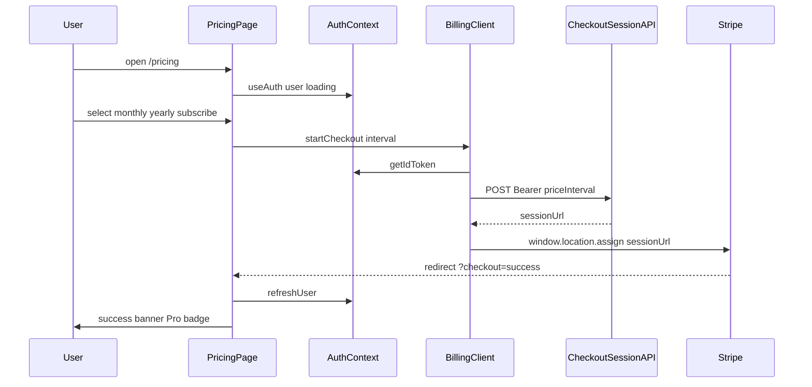
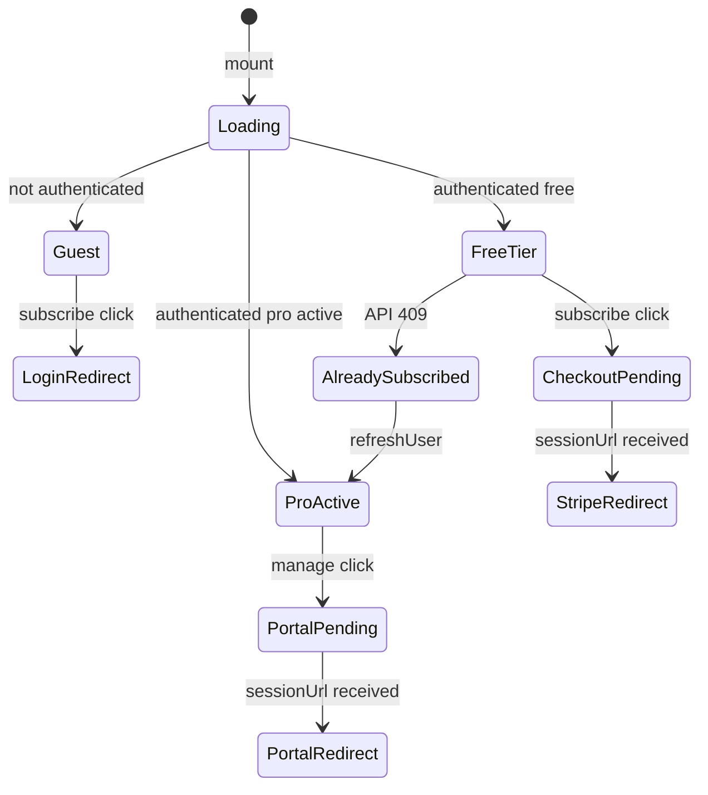

# Technical Design Document: quizeum-billing-subscription-ui

## Overview

本ドキュメントは、クイズ投稿SNS「quizeum」における Pro プラン料金画面（`/pricing`）、購読開始・契約管理 CTA、Checkout リダイレクト後フィードバック、およびグローバルナビ導線のフロントエンド UI 技術設計を定義します。

`quizeum-core` Phase 14 で実装済みの購読開始 API・契約管理 API・`subscriptionTier` エンタイトルメントを**消費する薄い UI 層**として実装します。決済処理本体・Webhook 同期・AI 制限判定はコアが担当し、プレイ画面内の制限誘導は `quizeum-play-flow-ui` が担当します。

**Phase 1（2026-06）**: 初版は Pro プランカード 1 枚のみ。Free tier は非表示。Premium は将来 `pricing-display` 配列拡張で対応可能な設計とする。

### Goals
- ログイン済み無料ユーザーが `/pricing` から月額/年額を選び Stripe Checkout へ遷移できる。
- Pro 契約中ユーザーが Customer Portal へ遷移できる。
- Checkout 成功/キャンセル後の画面フィードバックと `refreshUser` による契約状態反映。
- サイドバーから `/pricing` への導線（最小 1 か所）とネオンデザイン整合。

### Non-Goals
- Webhook、Firestore 課金フィールド書き込み、Rules（`quizeum-core`）。
- プレイ画面の残り質問数・制限ダイアログ（`quizeum-play-flow-ui`）。
- Free 比較行、Premium 販売 UI、Stripe Elements、アプリ内カード入力。
- Stripe Dashboard での Product/Price 作成。

---

## Boundary Commitments

### This Spec Owns
- **ルーティング**: `/pricing` ページおよび関連 CSS Modules。
- **表示正本**: Pro プランのマーケティング表示（名称、円価格ラベル、特典 bullets）— `pricing-display.ts`。
- **クライアント操作**: 購読開始 API / 契約管理 API の呼び出し、ローディング・エラー UI、外部 URL へのリダイレクト。
- **契約状態 UI**: auth-context の `User` に基づく CTA 切替・Pro バッジ（client-safe tier 解釈）。
- **Checkout フィードバック**: `?checkout=success|canceled` クエリの検知・バナー・URL クリーンアップ。
- **ナビ導線**: サイドバーへの `/pricing` リンクとアクティブハイライト。

### Out of Boundary
- `POST /api/billing/checkout-session`、`POST /api/billing/portal-session`、`POST /api/webhooks/stripe` の実装。
- `subscription-plans.ts` の Price ID マッピング、Stripe Customer ライフサイクル。
- `ask-ai` の tier ベース制限、プレイ中 `isPremium` 表示。
- プロフィール画面への契約バッジ（任意拡張、初版必須外）。

### Allowed Dependencies
- **`quizeum-core`（P0）**: 購読開始 API、契約管理 API、Checkout/Portal の `success_url` / `cancel_url` / `return_url` 設定。
- **`quizeum-auth-profile-ui`（P0）**: `useAuth`、`refreshUser`、`/login?redirect=` パターン。
- **`@/types`（P0）**: `User`, `SubscriptionTier`, `PriceInterval`。
- **`getPaidTierDefinitions()`（P1）**: tier キー整合の参照のみ（表示価格は UI 正本）。
- **`lucide-react`（P1）**: ナビ・カードアイコン。
- **`quizeum-sidebar-layout`（P1）**: サイドバー構造（本スペックが 1 項目追加）。

### Revalidation Triggers
- 購読開始 API / 契約管理 API のリクエスト・レスポンス形状変更。
- `User` の `subscriptionTier` / `subscriptionStatus` 解釈規則変更（core `computeUserEntitlements` 変更時は `pricing-entitlement.ts` 同期必須）。
- Checkout リダイレクト URL クエリ名の変更。
- `pricing-display` の tier 配列構造変更（Premium 追加時）。

---

## Architecture

### Existing Architecture Analysis

| 領域 | 現状 | 本フェーズ |
|------|------|-----------|
| `/pricing` ページ | 未存在 | 新規作成 |
| Billing API クライアント | 未存在 | `billing-client.ts` 新規 |
| サイドバー課金導線 | なし | `sidebar.tsx` 1 項目追加 |
| エンタイトルメント UI 判定 | なし | `pricing-entitlement.ts` 新規 |

既存の Bearer トークン付き `fetch` パターン（`useAiPlayState.ts`、`admin/users/page.tsx`）に合わせ、Firebase Auth `getIdToken()` で API を呼び出す。

### Architecture Pattern & Boundary Map

**選択パターン**: Thin Client + Hosted Redirect — UI はセッション URL のみ取得し、決済・契約変更は Stripe ホスト画面で完結。



**Architecture Integration**:
- 依存方向: `types` → `pricing-display` / `pricing-entitlement` → `billing-client` → `components/pricing` → `app/pricing/page.tsx`
- クライアントコンポーネントは `firebase-admin` 依存モジュールを import しない。
- `/play` 中はサイドバー非表示（既存 `LayoutWrapper` ルール維持、変更なし）。

### Technology Stack

| Layer | Choice / Version | Role in Feature | Notes |
|-------|------------------|-----------------|-------|
| Frontend | Next.js 16.2.6 App Router | `/pricing` ルート | Client Component 主体 |
| UI | React 19.2.4 | 状態・CTA・フィードバック | `useAuth`, `useSearchParams` |
| Styling | CSS Modules | ネオンカード・レスポンシブ | Tailwind 不使用 |
| Auth | Firebase Auth 12.x | ID トークン取得 | 既存 `auth` インスタンス |
| Icons | lucide-react | サイドバー・プランカード | 既存パターン |
| Upstream API | quizeum-core billing routes | Checkout/Portal セッション発行 | UI は消費のみ |

---

## File Structure Plan

### Directory Structure
```
src/
├── app/
│   └── pricing/
│       ├── page.tsx                    # 料金画面エントリ（Client）1.x–9.x
│       └── pricing.module.css          # ページレイアウト・グリッド
├── components/
│   └── pricing/
│       ├── pro-plan-card.tsx           # Pro カード・interval 選択・CTA 2.x, 3.x
│       ├── pro-plan-card.module.css
│       ├── subscription-status-badge.tsx  # Pro 契約中バッジ 3.1, 6.2
│       ├── subscription-status-badge.module.css
│       ├── checkout-feedback-banner.tsx   # success/canceled バナー 4.x
│       └── checkout-feedback-banner.module.css
├── lib/
│   ├── billing-client.ts               # Checkout/Portal API 呼び出し 2.x, 3.x, 7.x
│   ├── pricing-display.ts              # 表示用プラン定義（円価格・特典）1.3, 8.x
│   └── pricing-entitlement.ts            # client-safe tier/CTA 解釈 3.x, 6.x
└── components/layout/
    └── sidebar.tsx                     # /pricing ナビ項目追加 5.x
```

### Modified Files
- `src/components/layout/sidebar.tsx` — `menuItems` に `/pricing`（ラベル: 「Proプラン」等）を追加。全ログイン状態で表示（要件 5.1）。`pathname === '/pricing'` でアクティブ。
- `src/components/layout/sidebar.module.css` — 必要時のみナビ項目スタイル調整。

### Test Files（実装フェーズ）
```
tests/
├── lib/
│   ├── pricing-entitlement.test.ts
│   └── billing-client.test.ts
├── components/pricing/
│   └── pro-plan-card.test.tsx          # 任意：CTA 状態分岐
└── e2e/
    └── pricing-checkout.spec.ts        # 未契約→API 呼び出しまで 9.5
```

---

## System Flows

### CTA 状態マシン（PricingPage）



**Key Decisions**:
- `ProActive` は `pricing-entitlement.ts` の `hasPaidEntitlements === true` で判定（`subscriptionTier` + `subscriptionStatus`）。
- 未認証の購読クリックは API を呼ばず `router.push('/login?redirect=/pricing')`（2.1）。

---

## Requirements Traceability

| Requirement | Summary | Components | Interfaces | Flows |
|-------------|---------|------------|------------|-------|
| 1.1–1.5 | `/pricing` Pro 表示・Free 非表示 | `PricingPage`, `ProPlanCard`, `pricing-display` | — | 基本表示 |
| 2.1–2.7 | 購読開始・認証・エラー | `ProPlanCard`, `billing-client` | Checkout API | Guest→Checkout |
| 3.1–3.6 | 契約管理 CTA | `ProPlanCard`, `billing-client` | Portal API | ProActive→Portal |
| 4.1–4.5 | Checkout フィードバック | `CheckoutFeedbackBanner`, `PricingPage` | — | success/canceled |
| 5.1–5.3 | サイドバー導線 | `sidebar.tsx` | — | ナビ |
| 6.1–6.4 | 契約状態表示 | `SubscriptionStatusBadge`, `pricing-entitlement` | Auth `User` | CTA 分岐 |
| 7.1–7.4 | ローディング・エラー | `ProPlanCard`, `billing-client` | API errors | — |
| 8.1–8.4 | デザイン・a11y | 全 pricing CSS | — | — |
| 9.1–9.5 | 境界・E2E | — | core APIs | E2E スコープ |

---

## Components and Interfaces

| Component | Domain/Layer | Intent | Req Coverage | Key Dependencies | Contracts |
|-----------|--------------|--------|--------------|------------------|-----------|
| `PricingPage` | UI / Route | 料金画面オーケストレーション | 1, 4, 6, 7 | `useAuth` (P0) | State |
| `ProPlanCard` | UI | Pro カード・interval・CTA | 1, 2, 3, 8 | `billing-client` (P0) | State |
| `SubscriptionStatusBadge` | UI | Pro 契約中バッジ | 3.1, 6.2 | `pricing-entitlement` (P0) | — |
| `CheckoutFeedbackBanner` | UI | success/canceled メッセージ | 4.1–4.2 | — | — |
| `billing-client` | lib | API 呼び出し・リダイレクト | 2, 3, 7 | Firebase Auth (P0) | API |
| `pricing-display` | lib | 表示用プラン正本 | 1.3, 9.3 | — | State |
| `pricing-entitlement` | lib | client-safe tier 解釈 | 3, 6 | `@/types` (P0) | State |

### UI Layer

#### PricingPage

| Field | Detail |
|-------|--------|
| Intent | `/pricing` の認証・クエリ・子コンポーネント配置 |
| Requirements | 1.4, 4.3–4.5, 6.1, 7.4 |

**Responsibilities & Constraints**
- `useAuth` から `user`, `loading`, `refreshUser` を取得。
- `useSearchParams` で `checkout` を検知し `CheckoutFeedbackBanner` を表示。
- `checkout=success` 時に `refreshUser()` を 1 回実行（4.3）。
- Webhook 遅延時: `success` かつ `!hasPaidEntitlements` なら反映待ち案内（4.4）。

**Contracts**: State

##### State Management
- `checkoutFeedback: 'success' | 'canceled' | null` — クエリから派生。
- `pendingWebhook: boolean` — success 後も free tier の場合 true。

**Implementation Notes**
- Integration: `router.replace('/pricing')` でクエリ除去（4.5）。
- Validation: `loading` 中はスケルトン（7.4）。
- Risks: Webhook 遅延 — バナー + 再読み込み案内。

#### ProPlanCard

| Field | Detail |
|-------|--------|
| Intent | Pro プラン表示と CTA 操作 |
| Requirements | 1.1–1.3, 2.2–2.7, 3.1–3.6, 8.1, 8.4 |

**Responsibilities & Constraints**
- `pricing-display` から名称・価格ラベル・特典リストを描画。
- ローカル state `selectedInterval: PriceInterval`（月額/年額トグル）。
- CTA 分岐: Guest → ログイン誘導 / Free → 購読 / ProActive → Portal / 409 → 管理誘導。

**Contracts**: State

**Implementation Notes**
- `data-testid`: `pricing-pro-card`, `pricing-subscribe-btn`, `pricing-portal-btn`, `pricing-interval-monthly`, `pricing-interval-yearly`（E2E 9.5）。
- ボタン `aria-label` に操作内容を明示（8.4）。

#### SubscriptionStatusBadge

| Field | Detail |
|-------|--------|
| Intent | Pro 契約中の視覚インジケーター |
| Requirements | 3.1, 6.2 |

**Implementation Notes**
- `hasPaidEntitlements` が true のときのみ表示。モデレーター免除はバッジ対象外（契約バッジは課金契約のみ）。

#### CheckoutFeedbackBanner

| Field | Detail |
|-------|--------|
| Intent | Checkout 結果メッセージ |
| Requirements | 4.1, 4.2 |

**Implementation Notes**
- success: 祝福トーン（例: 「Pro プランへの加入が完了しました」）。
- canceled: 中立トーン + 購読 CTA 維持。

### Lib Layer

#### billing-client

| Field | Detail |
|-------|--------|
| Intent | 購読開始・契約管理 API の型安全ラッパー |
| Requirements | 2.2, 2.5–2.7, 3.2, 3.5–3.6, 7.1–7.3 |

**Service Interface**
```typescript
export type BillingApiErrorCode =
  | 'unauthorized'
  | 'forbidden'
  | 'already-subscribed'
  | 'no-subscription'
  | 'network'
  | 'unknown';

export interface BillingApiError {
  code: BillingApiErrorCode;
  message: string;
  httpStatus?: number;
}

export async function getFirebaseIdToken(): Promise<string | null>;

export async function startCheckoutSession(
  priceInterval: PriceInterval
): Promise<{ sessionUrl: string }>;

export async function startPortalSession(): Promise<{ sessionUrl: string }>;

export function redirectToExternalUrl(sessionUrl: string): void;
```

- Preconditions: `startCheckoutSession` / `startPortalSession` はトークン必須。未取得時は API 未呼び出し（7.2）。
- Postconditions: 成功時 `sessionUrl` は非空 URL。
- Errors: HTTP ステータスを `BillingApiError` にマップ。技術詳細はユーザーに非表示（7.3）。

##### API Contract（消費側 — upstream は core 所有）

| Method | Endpoint | Request | Response | Errors |
|--------|----------|---------|----------|--------|
| POST | `/api/billing/checkout-session` | `{ priceInterval: 'monthly' \| 'yearly' }` + Bearer | `{ sessionUrl: string }` | 401, 403, 409, 500 |
| POST | `/api/billing/portal-session` | Bearer のみ | `{ sessionUrl: string }` | 401, 404, 500 |

#### pricing-display

| Field | Detail |
|-------|--------|
| Intent | UI 表示用プラン定義の単一正本 |
| Requirements | 1.3, 1.5, 9.3 |

```typescript
export interface PricingFeatureBullet {
  id: string;
  label: string;
}

export interface PricingPlanDisplay {
  tier: 'pro'; // 将来 'premium' 追加
  displayName: string;
  monthlyPriceLabel: string;  // 例: "¥980/月"
  yearlyPriceLabel: string;   // 例: "¥9,800/年"
  yearlySavingsLabel?: string;
  featureBullets: readonly PricingFeatureBullet[];
}

export const PRICING_PLANS_DISPLAY: readonly PricingPlanDisplay[];
export function getPricingPlansForUi(): readonly PricingPlanDisplay[];
```

- 初版 `PRICING_PLANS_DISPLAY` は Pro 1 エントリ。特典は `unlimited_ai_questions` のみ（9.3）。
- 円ラベルは Stripe Dashboard と手動同期（research.md 参照）。

#### pricing-entitlement

| Field | Detail |
|-------|--------|
| Intent | auth `User` から UI CTA 状態を解釈（client-safe） |
| Requirements | 3.1, 6.1–6.3 |

```typescript
export type PricingUiCtaMode = 'guest' | 'subscribe' | 'manage' | 'loading';

export interface PricingUiState {
  ctaMode: PricingUiCtaMode;
  subscriptionTier: SubscriptionTier;
  hasPaidEntitlements: boolean;
  showProBadge: boolean;
}

export function resolvePricingUiState(
  user: User | null,
  authLoading: boolean
): PricingUiState;
```

- `hasPaidEntitlements`: `subscriptionTier` が `pro`|`premium` かつ `subscriptionStatus` が `active`|`trialing`（core と同一規則）。
- `ctaMode`: `loading` → `guest` → `manage`（hasPaid）→ `subscribe`。

---

## Data Models

### Domain Model（UI 表示層）

本スペックは永続データを所有しない。読み取りは `User`（auth-context）のみ。

| フィールド | UI 用途 | 書き込み |
|-----------|---------|----------|
| `subscriptionTier` | CTA 分岐・バッジ | なし（core Webhook） |
| `subscriptionStatus` | 有効契約判定 | なし |
| `currentPeriodEnd` | 初版は未表示（将来拡張可） | なし |

### API Data Transfer

**Checkout リクエスト**
```json
{ "priceInterval": "monthly" }
```

**Checkout レスポンス**
```json
{ "sessionUrl": "https://checkout.stripe.com/..." }
```

**Portal レスポンス**
```json
{ "sessionUrl": "https://billing.stripe.com/..." }
```

---

## Error Handling

### Error Strategy

| 区分 | UI 応答 | 回復 |
|------|---------|------|
| 401 unauthorized | 「ログインが必要です」+ ログイン導線 | `/login?redirect=/pricing` |
| 403 forbidden | BAN 案内（API message 表示） | 操作不可、ボタン再有効化 |
| 409 already-subscribed | 契約中メッセージ + Portal CTA 表示 | `refreshUser` 推奨 |
| 404 no-subscription | 購読 CTA にフォールバック | 状態再解釈 |
| network / 500 | 汎用日本語エラー | ボタン再有効化、再試行可 |

### Monitoring
- `console.error` に `[billing-client]` プレフィックスで API 失敗を記録（ユーザーには message のみ）。

---

## Testing Strategy

### Unit Tests
1. `resolvePricingUiState` — guest / free / pro active / pro canceled / loading の 5 ケース（3.x, 6.x）。
2. `billing-client` — 401/409/200 の fetch モックと `BillingApiError` マッピング（2.4–2.6, 7.1）。
3. `getPricingPlansForUi` — Pro 1 件・特典 bullet 含有（1.3, 9.3）。

### Integration Tests（Jest）
1. `ProPlanCard` — `ctaMode=subscribe` で購読ボタンが `startCheckoutSession` を呼ぶ（モック）。
2. `ProPlanCard` — `ctaMode=manage` で Portal ボタンのみ表示（3.1）。

### E2E Tests（Playwright）
1. 未ログインで `/pricing` 表示 → 購読クリック → `/login?redirect=%2Fpricing` へ遷移（2.1）。
2. ログイン済み free ユーザー → 月額選択 → 購読クリック → `POST /api/billing/checkout-session` が発火（モックまたは test env）（9.5）。
3. `?checkout=success` で成功バナー表示（4.1）。
4. サイドバーから `/pricing` 遷移、アクティブハイライト（5.1, 5.3）。

---

## Security Considerations

- ID トークンはメモリ上のみ使用。`sessionUrl` 以外の Stripe 秘密情報をクライアントに露出しない。
- 契約 tier のクライアント書き込みは行わない（2.7, 6.3）。表示は `User` 読み取りのみ。
- 外部 URL リダイレクト前に `sessionUrl` が `https://` で始まることを検証（Stripe ドメイン想定）。

---

## Supporting References

- 詳細調査ログ: `.kiro/specs/quizeum-billing-subscription-ui/research.md`
- Upstream API 設計: `.kiro/specs/quizeum-core/design.md` Phase 13 節
