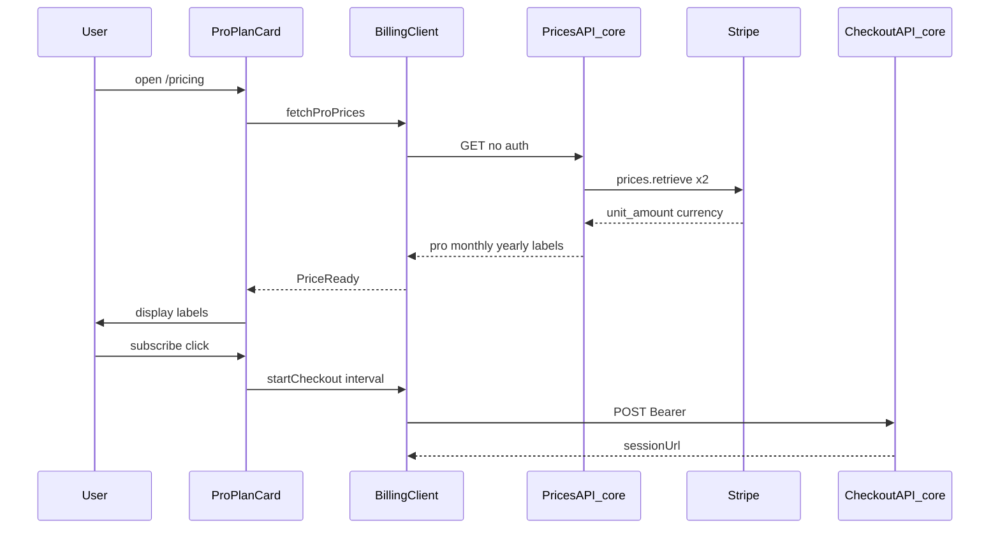
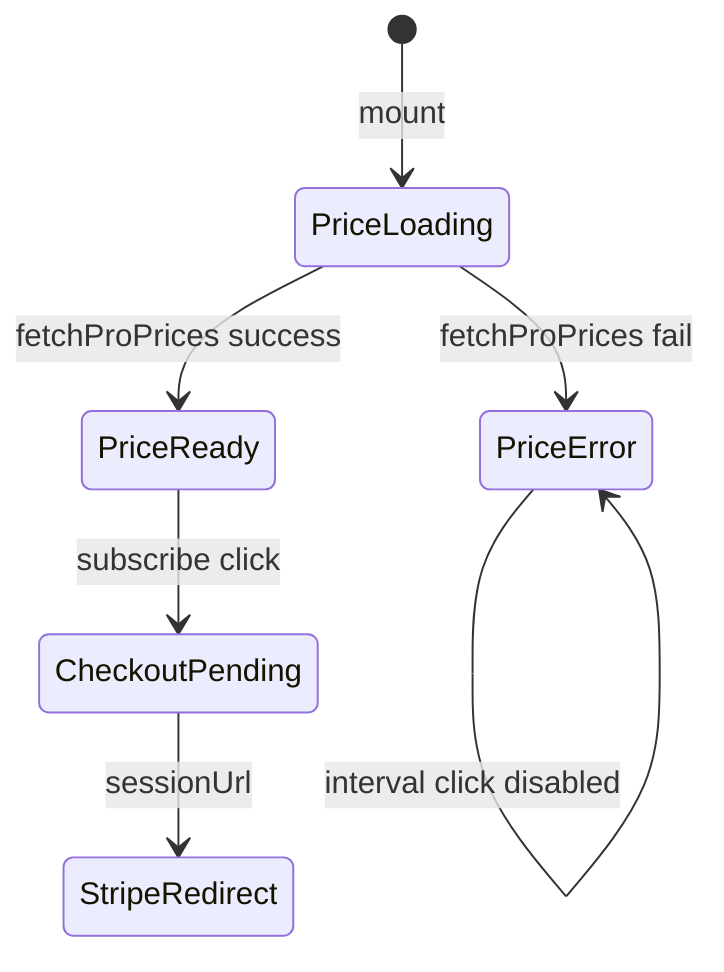
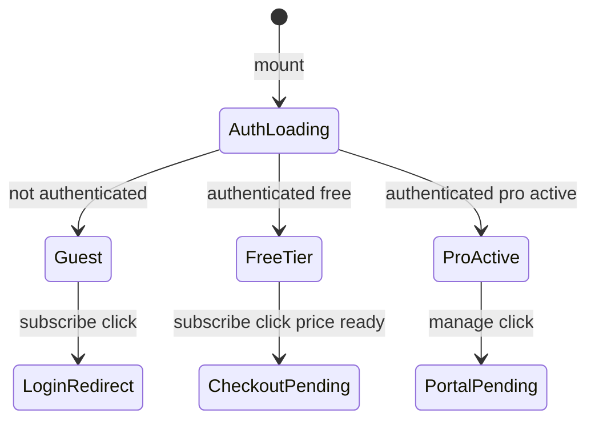
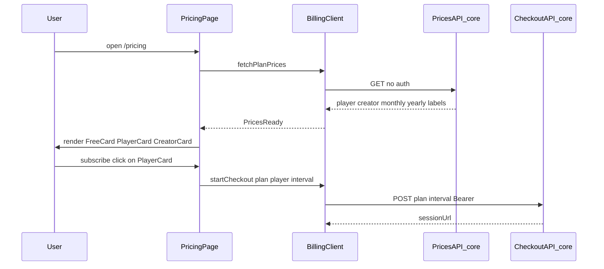
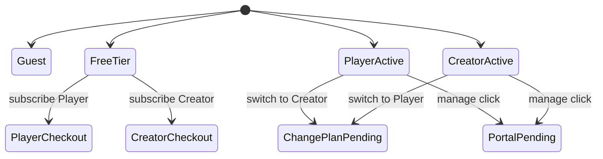
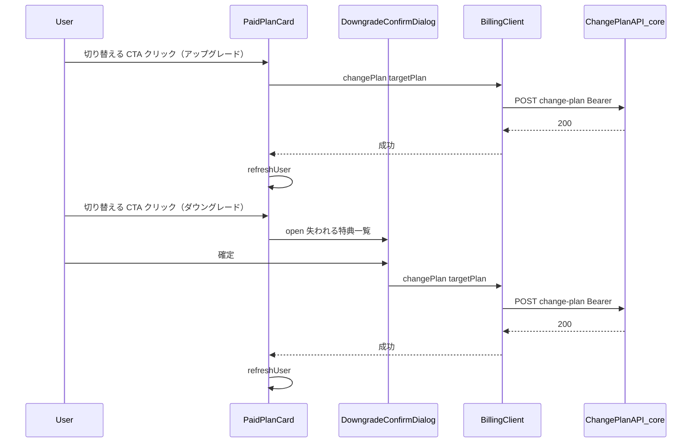

# Technical Design Document: quizetika-billing-subscription-ui

## Overview

本ドキュメントは、クイズ投稿SNS「quizetika」における料金画面（`/pricing`）、購読開始・契約管理 CTA、Checkout フィードバック、グローバルナビ導線、および **Pro プラン価格の動的表示** のフロントエンド UI 技術設計を定義します。

`quizetika-core` の購読開始 API・契約管理 API・**価格取得 API**・`subscriptionTier` エンタイトルメントを消費する薄い UI 層として実装します。決済処理本体・Webhook 同期・Stripe Price 取得のサーバー実装はコアが担当し、プレイ画面内の制限誘導は `quizetika-play-flow-ui` が担当します。

**Phase 1（2026-06）**: `/pricing`、Checkout/Portal CTA、契約状態表示、サイドバー導線 — **実装済み**。

**Phase 2（2026-06-08）**: Pro 月額・年額を決済サービス（Stripe）から動的取得して表示。取得失敗時は「価格を読み込めません」を表示し、購読 CTA を無効化。契約管理 CTA は維持。

### Goals
- ログイン済み無料ユーザーが `/pricing` から月額/年額を選び Stripe Checkout へ遷移できる（Phase 1 維持）。
- Pro 契約中ユーザーが Customer Portal へ遷移できる（Phase 1 維持）。
- **Pro 表示価格が Stripe Price と一致**し、Dashboard 価格変更時に手動同期が不要になる（Phase 2）。
- 価格取得失敗時に代替固定金額を出さず、ユーザーに障害を明示する（Phase 2）。

### Non-Goals
- Webhook、Firestore 課金フィールド書き込み、Rules の実装（`quizetika-core`）。
- プレイ画面の残り質問数・制限ダイアログ（`quizetika-play-flow-ui`）。
- Premium 販売 UI、Stripe Elements、アプリ内カード入力。
- Stripe Dashboard での Product/Price 作成。

---

## Boundary Commitments

### This Spec Owns
- **ルーティング**: `/pricing` ページおよび関連 CSS Modules。
- **マーケティング表示正本**: プラン名称・特典 bullets — `pricing-display.ts`（**金額は含めない**）。
- **価格表示 UI**: 価格取得 API の結果を Pro カードに描画、ローディング/エラー/CTA 無効化。
- **クライアント操作**: 購読開始 / 契約管理 / **価格取得** API の呼び出し、ローディング・エラー UI、外部 URL リダイレクト。
- **契約状態 UI**: auth-context の `User` に基づく CTA 切替・Pro バッジ（`pricing-entitlement.ts`）。
- **Checkout フィードバック**: `?checkout=success|canceled` の検知・バナー・URL クリーンアップ。
- **ナビ導線**: サイドバー `/pricing` リンクとアクティブハイライト。

### Out of Boundary
- `POST /api/billing/checkout-session`、`POST /api/billing/portal-session`、`POST /api/webhooks/stripe` の実装。
- **`GET /api/billing/prices` のサーバー実装**、Stripe `prices.retrieve`、価格キャッシュ、`pricing-format.ts` の整形ロジック（`quizetika-core` が担当）。
- `subscription-plans.ts` の Price ID マッピング、Stripe Customer ライフサイクル。
- `ask-ai` の tier ベース制限、プレイ中 `isPremium` 表示。

### Allowed Dependencies
- **`quizetika-core`（P0）**: Checkout/Portal API、**Prices API**、Checkout/Portal の redirect URL 設定。
- **`quizetika-auth-profile-ui`（P0）**: `useAuth`、`refreshUser`、`/login?redirect=`。
- **`@/types`（P0）**: `User`, `SubscriptionTier`, `PriceInterval`。
- **`getPaidTierDefinitions()`（P1）**: core 側 Price ID 参照（UI は直接 import しない）。
- **`@mui/icons-material`（P1）**: アイコン。

### Revalidation Triggers
- **Prices API** レスポンス形状変更（トップレベル `monthly` / `yearly` / `savingsLabel`）。
- Checkout / Portal API のリクエスト・レスポンス形状変更。
- `User` の `subscriptionTier` / `subscriptionStatus` 解釈変更（`pricing-entitlement.ts` 同期必須）。
- `pricing-display` の tier 配列構造変更（Premium 追加時）。

---

## Architecture

### Existing Architecture Analysis

| 領域                 | Phase 1 状態                   | Phase 2 変更                           |
| -------------------- | ------------------------------ | -------------------------------------- |
| `/pricing` ページ    | **実装済**                     | 変更なし（子コンポーネントが価格取得） |
| `ProPlanCard`        | **実装済**（ハードコード価格） | 価格状態機械・CTA ガード追加           |
| `pricing-display.ts` | **実装済**（¥980 固定）        | 価格フィールド削除、特典のみ           |
| `billing-client.ts`  | **実装済**（POST のみ）        | `fetchProPrices()` 追加                |
| Prices API           | **未存在**                     | core が新規提供（本 UI は消費）        |
| サイドバー導線       | **実装済**                     | 変更なし                               |

### Architecture Pattern & Boundary Map

**選択パターン**: Thin Client + Hosted Redirect + **Server-sourced Price Quotes**



**Architecture Integration**:
- 依存方向: `types` → `pricing-display` / `pricing-entitlement` → `billing-client` → `components/pricing` → `app/pricing/page.tsx`
- 価格の正本は **Stripe（core 経由）**。UI は取得結果の表示ラベルのみ保持（セッション中メモリ）。
- クライアントは `firebase-admin` / Stripe 秘密鍵に触れない。

### Technology Stack

| Layer    | Choice / Version              | Role in Feature                | Notes                  |
| -------- | ----------------------------- | ------------------------------ | ---------------------- |
| Frontend | Next.js 16.2.6 App Router     | `/pricing` ルート              | Client Component 主体  |
| UI       | React 19.2.4                  | 価格状態・CTA                  | `useEffect` で価格取得 |
| Styling  | CSS Modules                   | カード・ローディング           | Tailwind 不使用        |
| Auth     | Firebase Auth 12.x            | Checkout/Portal トークン       | 価格 GET は認証不要    |
| Upstream | quizetika-core billing routes | Checkout / Portal / **Prices** | UI は消費のみ          |
| External | Stripe API via core           | Price オブジェクト             | `unit_amount` JPY      |

---

## File Structure Plan

### Directory Structure（本スペック所有・改修）

```
src/
├── app/pricing/
│   ├── page.tsx                         # 料金画面（Phase 1 済、Phase 2 変更なし）
│   └── pricing.module.css
├── components/pricing/
│   ├── pro-plan-card.tsx                # Phase 2: 価格状態・CTA ガード
│   ├── pro-plan-card.module.css         # Phase 2: 価格ローディング/エラー用スタイル
│   ├── free-plan-card.tsx               # ¥0 固定（変更なし）
│   ├── subscription-status-badge.tsx
│   └── checkout-feedback-banner.tsx
└── lib/
    ├── billing-client.ts                # Phase 2: fetchProPrices() 追加
    ├── pricing-display.ts               # Phase 2: 価格ラベル削除、特典のみ
    └── pricing-entitlement.ts
```

### Upstream Files（quizetika-core 実装 — 本スペックは契約のみ定義）

```
src/
├── app/api/billing/prices/route.ts      # GET 価格クォート（認証不要）
├── services/billing-prices.ts           # stripe.prices.retrieve + 整形委譲
└── lib/pricing-format.ts                # JPY ラベル・savingsLabel 計算
```

### Modified Files
- `src/lib/pricing-display.ts` — `monthlyPriceLabel` / `yearlyPriceLabel` / `yearlySavingsLabel` を削除。`displayName` と `featureBullets` のみ。
- `src/lib/billing-client.ts` — `fetchProPrices()` と `ProPricesResult` 型を追加。
- `src/components/pricing/pro-plan-card.tsx` — 価格状態機械、失敗時 UI、購読/interval 無効化。
- `src/components/pricing/pro-plan-card.module.css` — 価格ローディング・エラーテキスト用。

### Test Files（Phase 2 追加分）

```
tests/
├── lib/
│   ├── pricing-display.test.ts          # 価格 assertion 削除
│   └── billing-client.test.ts           # fetchProPrices 成功/失敗
├── components/pricing/
│   └── pro-plan-card.test.tsx           # loading/error/disabled ケース
└── api/
    └── billing-prices.test.ts           # core 側（quizetika-core タスク境界）
```

---

## System Flows

### Pro 価格表示状態機械（ProPlanCard）



**Key Decisions**:
- `PriceError` 時: 価格欄に「価格を読み込めません」。購読ボタン無効（2.4）。interval トグル無効（10.5）。
- `ctaMode=manage` 時: `PriceError` でも Portal CTA は有効（3.7）。
- `ctaMode=guest` 時: ログイン誘導は価格成否に非依存（2.1）。
- 月額・年額の**いずれか一方でも取得失敗**した場合は全体を `PriceError` とする（部分成功は許容しない）。

### CTA 状態マシン（PricingPage — Phase 1 維持）



---

## Requirements Traceability

| Requirement      | Summary                          | Components                                       | Interfaces   | Flows              |
| ---------------- | -------------------------------- | ------------------------------------------------ | ------------ | ------------------ |
| 1.1–1.2          | `/pricing` Pro 表示              | `PricingPage`, `ProPlanCard`                     | —            | 基本表示           |
| 1.3              | 動的価格（非ハードコード）       | `ProPlanCard`, `billing-client`                  | Prices API   | Price fetch        |
| 1.4–1.5          | 未ログイン閲覧・Premium 拡張余地 | `PricingPage`, `pricing-display`                 | —            | —                  |
| 2.1–2.3, 2.5–2.8 | 購読開始・認証・エラー           | `ProPlanCard`, `billing-client`                  | Checkout API | Guest→Checkout     |
| 2.4              | 価格未取得時購読無効             | `ProPlanCard`                                    | —            | PriceError gate    |
| 3.1–3.6          | 契約管理 CTA                     | `ProPlanCard`, `billing-client`                  | Portal API   | ProActive→Portal   |
| 3.7              | 価格失敗時 Portal 維持           | `ProPlanCard`                                    | —            | manage CTA         |
| 4.1–4.5          | Checkout フィードバック          | `CheckoutFeedbackBanner`, `PricingPage`          | —            | success/canceled   |
| 5.1–5.3          | サイドバー導線                   | `sidebar.tsx`                                    | —            | ナビ               |
| 6.1–6.4          | 契約状態表示                     | `SubscriptionStatusBadge`, `pricing-entitlement` | Auth `User`  | CTA 分岐           |
| 7.1–7.4          | API/認証エラー・スケルトン       | `ProPlanCard`, `billing-client`                  | API errors   | —                  |
| 7.5–7.6          | 価格ローディング/失敗表示        | `ProPlanCard`                                    | Prices API   | PriceLoading/Error |
| 8.1–8.4          | デザイン・a11y                   | pricing CSS                                      | —            | —                  |
| 9.1–9.6          | 境界・E2E                        | —                                                | core APIs    | E2E                |
| 10.1–10.6        | 表示形式・お得・Free 固定        | `ProPlanCard`, core `pricing-format`             | Prices API   | PriceReady         |

---

## Components and Interfaces

| Component                | Domain/Layer | Intent                       | Req Coverage         | Key Dependencies       | Contracts |
| ------------------------ | ------------ | ---------------------------- | -------------------- | ---------------------- | --------- |
| `PricingPage`            | UI / Route   | 料金画面オーケストレーション | 1.4, 4, 6, 7.4       | `useAuth` (P0)         | State     |
| `ProPlanCard`            | UI           | Pro カード・価格状態・CTA    | 1, 2, 3, 7.5–7.6, 10 | `billing-client` (P0)  | State     |
| `FreePlanCard`           | UI           | Free ¥0 固定表示             | 10.4                 | `pricing-display` (P0) | —         |
| `billing-client`         | lib          | API 呼び出し                 | 2, 3, 7, 10          | fetch (P0)             | API       |
| `pricing-display`        | lib          | 名称・特典正本               | 1, 10.6              | —                      | State     |
| `pricing-entitlement`    | lib          | tier/CTA 解釈                | 3, 6                 | `@/types` (P0)         | State     |
| `billing-prices`（core） | service      | Stripe 価格取得              | 1.3, 9.2             | Stripe (P0)            | Service   |
| `pricing-format`（core） | lib          | JPY ラベル整形               | 10.1–10.3            | —                      | Service   |

### Lib Layer — billing-client（Phase 2 拡張）

**Contracts**: API

```typescript
export type ProPriceInterval = 'monthly' | 'yearly';

export interface ProPriceQuote {
  amount: number;       // JPY 整数（Stripe unit_amount）
  currency: 'jpy';
  label: string;        // 例: "¥980/月"
}

export interface ProPricesResult {
  monthly: ProPriceQuote;
  yearly: ProPriceQuote;
  savingsLabel?: string; // 例: "年額で約2ヶ月分お得"
}

export async function fetchProPrices(): Promise<ProPricesResult>;
```

- `fetchProPrices`: 認証不要の `GET /api/billing/prices`。失敗時 `BillingClientError`（code: `network` | `unknown`）。
- 既存 `startCheckoutSession` / `startPortalSession` は Phase 1 どおり。

##### API Contract（消費 — Prices）

| Method | Endpoint              | Request | Response          | Errors |
| ------ | --------------------- | ------- | ----------------- | ------ |
| GET    | `/api/billing/prices` | なし    | `ProPricesResult` | 500    |

**Upstream 実装メモ（core）**:
- `getPaidTierDefinitions()` の Pro `priceIds` を使用し `stripe.prices.retrieve` を並列実行。
- JPY: `unit_amount` をそのまま円整数として扱う（Stripe JPY はゼロ小数）。
- `savingsLabel`: `(monthly.amount * 12 - yearly.amount) / monthly.amount` を切り捨て整数化し、1 以上のとき `"年額で約{N}ヶ月分お得"` を付与。
- `export const revalidate = 3600`（1 時間キャッシュ。`weekly-top` の 1800s より長く、価格変動頻度が低いため）。

### Lib Layer — pricing-display（Phase 2 改修）

```typescript
export interface PricingPlanDisplay {
  tier: 'free' | 'pro';
  displayName: string;
  featureBullets: readonly PricingFeatureBullet[];
  // monthlyPriceLabel / yearlyPriceLabel / yearlySavingsLabel は削除
}
```

- Free の `¥0` は `FreePlanCard` 内で固定表示（10.4）。`pricing-display` には金額フィールドを持たない。

### UI Layer — ProPlanCard（Phase 2 改修）

| Field        | Detail                            |
| ------------ | --------------------------------- |
| Intent       | Pro プラン表示、動的価格、CTA     |
| Requirements | 1.3, 2.4, 3.7, 7.5–7.6, 10.1–10.6 |

**State Management**

```typescript
type ProPriceUiState =
  | { status: 'loading' }
  | { status: 'ready'; prices: ProPricesResult }
  | { status: 'error' };
```

- `status === 'loading'`: 価格欄にスケルトンまたは「読み込み中…」（7.5）。
- `status === 'error'`: 価格欄「価格を読み込めません」（7.6）。`data-testid="pricing-price-error"`。
- `status === 'ready'`: `selectedInterval` に応じて `monthly.label` / `yearly.label` 表示。年額時 `savingsLabel` 表示（10.3）。
- `isSubscribeDisabled`: `loading || ctaMode === 'loading' || priceStatus !== 'ready'`（購読時）。Portal は `priceStatus` 非依存（3.7）。
- `isIntervalDisabled`: `loading || priceStatus !== 'ready'`（10.5）。

**Implementation Notes**
- Integration: マウント時 `useEffect` で `fetchProPrices()` 1 回。自動リトライは初版なし（ページ再読み込みで再取得）。
- Validation: 特典リストは `pricing-display` から常時表示（10.6）。
- Risks: Stripe 障害時は購読不可だが Portal は利用可 — 意図した劣化。

---

## Data Models

### API Data Transfer — Prices（新規）

```json
{
  "monthly": { "amount": 980, "currency": "jpy", "label": "¥980/月" },
  "yearly": { "amount": 9800, "currency": "jpy", "label": "¥9,800/年" },
  "savingsLabel": "年額で約2ヶ月分お得"
}
```

- `amount` は Checkout と同一 Price ID 由来のため、表示と課金の整合が保たれる。
- エラー時は HTTP 500 + `{ "error": "internal-error", "message": "..." }`。UI は詳細を出さない（7.3）。

---

## Error Handling

| 区分                     | UI 応答                                  | 回復             |
| ------------------------ | ---------------------------------------- | ---------------- |
| Prices API 500 / network | 価格欄「価格を読み込めません」、購読無効 | ページ再読み込み |
| Checkout 401/409 等      | Phase 1 どおり                           | 既存ハンドラ     |
| Portal 404 等            | Phase 1 どおり                           | 既存ハンドラ     |

---

## Testing Strategy

### Unit Tests
1. `fetchProPrices` — 200 レスポンスのパース、500/network の `BillingClientError`（7.6 連携）。
2. `pricing-display` — Pro/Free の `displayName`・`featureBullets` のみ（価格フィールドなし）。
3. `pricing-format`（core）— `980` → `¥980/月`、`savingsLabel` 計算（10.1–10.3）。
4. `billing-prices` service（core）— Stripe mock で monthly/yearly 取得成功・一方失敗で 500。

### Integration Tests（Jest）
1. `ProPlanCard` — 価格 loading 中にスケルトン/読み込み表示（7.5）。
2. `ProPlanCard` — 価格 error 時「価格を読み込めません」、購読 disabled、Portal enabled（7.6, 2.4, 3.7）。
3. `ProPlanCard` — 価格 ready 時に月額/年額ラベル切替（10.1–10.2）。
4. Phase 1 回帰 — guest/subscribe/manage CTA、Checkout/Portal 呼び出し。

### E2E Tests（Playwright）
1. `/pricing` 表示後 Pro カードに価格ラベルまたはエラー文言が現れる（モック API 可）。
2. 価格エラー状態で購読ボタン disabled（2.4）。
3. Phase 1 回帰 — ログイン誘導、Checkout API 発火、success バナー（9.6）。

---

## Performance & Scalability

- Prices API は `revalidate = 3600` でサーバーキャッシュ。クライアントはページ表示ごとに 1 GET。
- Stripe API 呼び出しは core 側で Price ID 2 件の並列 retrieve に限定。

---

## Security Considerations

- Prices API は認証不要だが、レスポンスに Stripe 秘密情報・Price ID を含めない（表示ラベルと amount のみ）。
- Checkout/Portal は Phase 1 どおり Bearer 必須。
- 価格のクライアント改ざんは Checkout 金額に影響しない（サーバー側 Price ID 固定）。

---

## Supporting References

- ギャップ分析: `.kiro/specs/quizetika-billing-subscription-ui/research.md` Phase 2 節
- Upstream billing: `.kiro/specs/quizetika-core/design.md` Phase 13 節

---

## Phase 3: 複数有料プラン表示への拡張と Creator への改名（2026-07-13）

### Overview（本フェーズ）
`quizetika-core` Phase 41 の tier 多層化に合わせ、`/pricing` を「Pro カード1枚のハードコード」から「プラン定義配列に基づく複数カード表示」へ改定する。旧 Pro は表示・内部識別子とも Creator に改名し、中間価格帯の新プラン Player を追加する。購読開始時はプラン（`player` | `creator`）選択が必須になる。

### Goals（Phase 3）
- Free / Player / Creator の3プランを同一画面に並列表示し、将来プラン追加時もカード列挙のみで拡張できる構造にする（要件11.3–11.4）。
- 購読開始 CTA がプラン単位で独立し、Player→Creator のアップグレード、Creator→Player のダウングレード拒否を正しく扱う（要件11.7–11.9）。
- 旧「Pro」表記を全画面表示から除去する（要件11.1–11.2）。

### Non-Goals（Phase 3）
- Premium tier 販売 UI（要件11.12）。
- クイズ限定公開・AI 作問アシスタントのアクセス制御 UI（要件11.13、`quizetika-creator-dash-ui` / `quizetika-ui-editor` / `quizetika-ai-quiz-authoring` が担当）。
- `player` / `creator` の具体的金額決定（`quizetika-core` の運用設定）。

### Boundary Commitments（Phase 3 差分）

**This Spec Owns（追加）**
- プラン一覧描画のためのプラン定義配列（`pricing-display.ts` を `tier: 'free' | 'player' | 'creator'` の配列へ拡張）。
- 購読開始 UI 上でのプラン選択（`player` | `creator`）と、選択されたプランを Checkout API へ渡すクライアント操作。

**Out of Boundary（追加）**
- `player` / `creator` tier の capability 判定（`hasCreatorEntitlements` 等）ロジック自体（`quizetika-core` が正本、UI は結果表示のみ）。

**Revalidation Triggers（追加）**
- `GET /api/billing/prices` のレスポンス形状が `{ player, creator }` から変わった場合。
- `POST /api/billing/checkout-session` のリクエストボディに `plan` フィールドが必須化された契約が変わった場合。

### Architecture（Phase 3 差分）

**既存アーキテクチャ分析**: Phase 2 で確立した「Thin Client + Hosted Redirect + Server-sourced Price Quotes」パターンを維持する。変更点は (1) 単一 `ProPlanCard` を tier 非依存の汎用 `PaidPlanCard` に一般化し、プラン定義配列から複数枚レンダリングする、(2) Prices API・Checkout API の消費形状を tier 別に対応させる、の2点。



**Key Decisions**:
- `PricingPage` はプラン定義配列（`pricing-display.ts` の `PAID_PLAN_DISPLAYS`）を `.map()` で描画し、プラン数が増えてもレイアウト分岐コードを追加しない（要件11.4）。
- `PaidPlanCard` は `tier: 'player' | 'creator'` を props で受け取り、価格・特典・CTA 文言をプラン定義から解決する単一実装とする（`ProPlanCard` の tier 決め打ちを解消）。

### File Structure Plan（Phase 3）

| ファイル | 操作 | 責務 |
|---|---|---|
| `src/components/pricing/pro-plan-card.tsx` | Rename → `paid-plan-card.tsx` | `tier: 'player' \| 'creator'` を props に持つ汎用有料プランカード。旧 `ProPlanCard` の状態機械（loading/ready/error）はそのまま踏襲 |
| `src/components/pricing/paid-plan-card.module.css` | Rename（`pro-plan-card.module.css` から） | スタイル定義そのまま |
| `src/lib/pricing-display.ts` | Modify | `tier: 'free' \| 'player' \| 'creator'` の配列 `PAID_PLAN_DISPLAYS` を定義。Player は特典を「広告非表示・ウミガメAI質問無制限」の2件、Creator は既存4件（要件11.2, 11.6） |
| `src/lib/billing-client.ts` | Modify | `fetchProPrices()` → `fetchPlanPrices()`（`{ player: PlanPriceQuote; creator: PlanPriceQuote }` を返す）。`startCheckoutSession(plan, interval)` へ `plan` 引数追加 |
| `src/app/pricing/page.tsx` | Modify | `FreePlanCard` + `PAID_PLAN_DISPLAYS.map(tier => <PaidPlanCard tier={tier} />)` の3枚描画に変更 |
| `src/lib/pricing-entitlement.ts` | Modify | `subscriptionTier === 'pro'` 判定を `'player' \| 'creator' \| 'premium'` へ拡張。`ctaMode` の解決に「どのプランに契約中か」を追加（Player→Creator アップグレード導線判定のため） |

### Requirements Traceability（Phase 3）

| Requirement | Summary | Components | Interfaces | Flows |
|-------------|---------|------------|------------|-------|
| 11.1–11.2 | Pro→Creator 改名 | `PaidPlanCard`, `pricing-display` | — | — |
| 11.3–11.6 | プラン一覧拡張表示 | `PricingPage`, `PaidPlanCard`, `pricing-display` | Prices API | 描画フロー |
| 11.7–11.9 | 購読開始時プラン選択 | `PaidPlanCard`, `billing-client` | Checkout API | Checkout フロー |
| 11.10–11.11 | 契約状態の視覚的表示（多プラン） | `SubscriptionStatusBadge`, `pricing-entitlement` | Auth `User` | CTA 分岐 |
| 11.12–11.13 | 境界（Premium・隣接UI 外） | — | — | — |

### Components and Interfaces（Phase 3 差分）

| Component | Domain/Layer | Intent | Req Coverage | Key Dependencies | Contracts |
|-----------|---------------|--------|---------------|---------------------|-----------|
| `PaidPlanCard`（`ProPlanCard` を一般化） | UI | tier 非依存の有料プランカード | 11.1–11.9 | `billing-client` (P0), `pricing-display` (P0) | State |
| `pricing-display`（改修） | lib | Player/Creator 両プラン定義の正本 | 11.2, 11.6 | — | State |
| `billing-client`（改修） | lib | tier 別価格取得・plan 指定 Checkout | 11.7–11.9 | `quizetika-core` Prices/Checkout API (P0) | API |

#### Lib Layer — billing-client（Phase 3 拡張）

```typescript
export type PaidPlanTier = 'player' | 'creator';

export interface PlanPriceQuote {
  monthly: { amount: number; currency: 'jpy'; label: string };
  yearly: { amount: number; currency: 'jpy'; label: string };
  savingsLabel?: string;
}

export async function fetchPlanPrices(): Promise<Record<PaidPlanTier, PlanPriceQuote>>;
export async function startCheckoutSession(
  plan: PaidPlanTier,
  interval: 'monthly' | 'yearly'
): Promise<{ sessionUrl: string }>;
```
- `fetchPlanPrices`: 認証不要の `GET /api/billing/prices`。旧 `fetchProPrices` を置き換える（レスポンス形状が破壊的に変わるため関数名も変更し、呼び出し漏れをコンパイルエラーで検出させる）。
- `startCheckoutSession` は `plan` を必須第一引数とする（旧シグネチャは `interval` のみだったため全呼び出し元の更新が必要）。

**Implementation Notes**
- Integration: `PaidPlanCard` は自身の `tier` props に対応する `prices[tier]` のみを参照する。契約中プランと異なるプランのカードを表示する際は `ctaMode: 'change-plan'`（Phase 4、要件12 参照）を `pricing-entitlement.ts` から受け取る。
- Validation: 契約中プランと同一のカードには契約中バッジを表示し、購読/変更 CTA を出さない。
- Risks: 2プラン分の価格取得が両方成功しないと画面全体が `PriceError` になる設計を維持するか、プラン単位で個別エラー表示するかは実装時に決定する（初版は簡潔さを優先し画面全体エラーで統一し、`research.md` に記録）。

### System Flows（Phase 3 追加）


**Key Decisions**: `PlayerActive`/`CreatorActive` からの相互遷移は新規 Checkout や Portal ではなく、Phase 4 で追加するプラン変更 API（`ChangePlanPending`）を経由する（詳細は下記 Phase 4 節）。

### Testing Strategy（Phase 3 追加分）

| 種別 | 検証 |
|---|---|
| Unit | `pricing-display` — `PAID_PLAN_DISPLAYS` が `player`/`creator` の順で2件、各々の特典件数が仕様通り（Player 2件、Creator 4件）であること |
| Unit | `fetchPlanPrices` — `{ player, creator }` 形状のレスポンスを正しくパースすること |
| Integration | `PricingPage` — Free/Player/Creator の3カードがこの順で描画されること |
| E2E | `/pricing` 表示後、Free/Player/Creator 各カードに価格ラベルまたはエラー文言が現れること |

**Effort**: **M**（既存単一プランコンポーネントの一般化 + プラン定義配列化 + API 消費形状変更への追随）
**Risk**: **Medium**（`quizetika-core` の API 契約変更と同時実装が前提のため、依存順を誤ると型不整合が発生する）

**Document Status（Phase 3 設計）**: 本節に反映。`quizetika-core` design.md Phase 41 節の Prices/Checkout API 契約と整合済み。

---

## Phase 4: Player・Creator 間のプラン変更 UI（2026-07-13）

### Overview（本フェーズ）
`quizetika-core` 要件35 が提供するプラン変更 API（`POST /api/billing/change-plan`）を消費し、契約中の Player・Creator ユーザーが解約・再契約なしにプランを切り替えられる CTA を `/pricing` に追加する。アップグレード（Player→Creator）は即時実行、ダウングレード（Creator→Player）は失われる特典を明示する確認ダイアログを経て実行する。

### Goals（Phase 4）
- 契約中プランと異なる有料プランカードに「切り替える」CTA を表示し、新規 Checkout を経由せずプランを変更できる（要件12.1, 12.4）。
- ダウングレード時は失う特典（限定公開・AI作問アシスタント）を確認ダイアログで明示する（要件12.4）。

### Non-Goals（Phase 4）
- プラン変更処理そのもの（Stripe サブスクリプション更新・比例配分）— `quizetika-core` が担当。
- `free` への解約フロー（既存 Portal 経由のまま変更なし）。

### Boundary Commitments（Phase 4）

**This Spec Owns**
- プラン変更 CTA・ダウングレード確認ダイアログの UI。
- プラン変更 API の呼び出し、ローディング・エラー表示。

**Out of Boundary**
- `POST /api/billing/change-plan` のサーバー実装、Stripe `subscriptions.update()`、比例配分計算（`quizetika-core` 要件35）。

**Allowed Dependencies**
- `quizetika-core`（P0）: プラン変更 API。
- 既存 `useAuth` / `refreshUser`（P0）。

**Revalidation Triggers**
- プラン変更 API のリクエスト/レスポンス契約変更。

### Architecture（Phase 4）



**Key Decisions**:
- アップグレードは確認ダイアログなしで即時実行し、ダウングレードのみ確認ダイアログを挿む（要件12.1, 12.4、ユーザーヒアリングで確定）。
- ダイアログの表示内容（失われる特典一覧）は `pricing-display.ts` の Creator 特典定義から Player 特典定義を差分抽出して生成し、特典文言のハードコードを避ける。

### File Structure Plan（Phase 4）

| ファイル | 操作 | 責務 |
|---|---|---|
| `src/lib/billing-client.ts` | Modify | `changePlan(targetPlan: PaidPlanTier): Promise<{ tier: PaidPlanTier }>` を追加 |
| `src/components/pricing/paid-plan-card.tsx` | Modify | 契約中プランと異なるプランのカードに「切り替える」CTA を表示。ダウングレード方向の場合は `DowngradeConfirmDialog` を開く |
| `src/components/pricing/downgrade-confirm-dialog.tsx` | New | Creator→Player ダウングレード時の確認ダイアログ。失われる特典一覧（`pricing-display.ts` の Creator/Player 特典差分）を表示し、確定/キャンセルを受け付ける |
| `src/lib/pricing-entitlement.ts` | Modify | `ctaMode` に `'change-plan'` を追加し、契約中 tier と表示対象 tier の関係（同一/アップグレード方向/ダウングレード方向）を解決するヘルパーを追加 |

### Requirements Traceability（Phase 4）

| Requirement | Summary | Components | Interfaces | Flows |
|-------------|---------|------------|------------|-------|
| 12.1–12.3 | アップグレード即時実行 | `PaidPlanCard`, `billing-client` | Change Plan API | アップグレードフロー |
| 12.4–12.7 | ダウングレード確認ダイアログ | `PaidPlanCard`, `DowngradeConfirmDialog`, `billing-client` | Change Plan API | ダウングレードフロー |
| 12.8–12.10 | エラー処理 | `PaidPlanCard`, `billing-client` | Change Plan API | — |
| 12.11–12.12 | 境界（core・Portal 外） | — | — | — |

### Components and Interfaces（Phase 4）

| Component | Domain/Layer | Intent | Req Coverage | Key Dependencies | Contracts |
|-----------|---------------|--------|---------------|---------------------|-----------|
| `PaidPlanCard`（Phase 4 拡張） | UI | プラン変更 CTA・状態管理 | 12.1–12.3, 12.8–12.10 | `billing-client` (P0) | State |
| `DowngradeConfirmDialog` | UI | ダウングレード確認・特典喪失明示 | 12.4–12.6 | `pricing-display` (P0) | State |

#### Lib Layer — billing-client（Phase 4 拡張）
```typescript
export async function changePlan(
  targetPlan: PaidPlanTier
): Promise<{ tier: PaidPlanTier }>;
```
- 認証必須の `POST /api/billing/change-plan`。失敗時 `BillingClientError`（code: `unauthorized` | `no-active-subscription` | `same-plan` | `unknown`）。

##### API Contract（消費）
| Method | Endpoint | Request | Response | Errors |
|--------|----------|---------|----------|--------|
| POST | `/api/billing/change-plan` | `{ targetPlan: 'player' \| 'creator' }` | `{ tier; status }` | 400, 401, 403, 409 |

**Implementation Notes**
- Integration: `PaidPlanCard` の CTA ラベルは契約中 tier との相対位置で決定する（`player` 契約中に Creator カードを見ている場合は「Creator に切り替える」、逆は「Player に切り替える」）。
- Validation: `changePlan` 呼び出し中はボタンを disabled にし、成功時のみ `refreshUser()` を呼ぶ（失敗時は状態を変更しない）。
- Risks: ダウングレード確定後、Webhook 反映が遅延する間は契約状態表示が旧プランのまま — Phase 2 由来の「反映待ち」パターンをここでも踏襲する。

### Testing Strategy（Phase 4 追加分）

| 種別 | 検証 |
|---|---|
| Unit | `changePlan` — 200 レスポンスのパース、409/403 の `BillingClientError` |
| Integration | `PaidPlanCard` — Player 契約中に Creator カードで「Creator に切り替える」CTA をクリックすると確認ダイアログなしで `changePlan('creator')` が呼ばれること（12.1） |
| Integration | `PaidPlanCard` — Creator 契約中に Player カードで CTA をクリックすると `DowngradeConfirmDialog` が開き、Stripe 呼び出しは確定操作まで発生しないこと（12.4, 12.5） |
| Integration | `DowngradeConfirmDialog` — 表示される特典喪失一覧に「クイズ限定公開」「AI 作問アシスタント」が含まれること（12.4） |
| Integration | `DowngradeConfirmDialog` — キャンセル選択時に `changePlan` が呼ばれず契約状態が変わらないこと（12.6） |
| E2E | Player 契約中ユーザーが `/pricing` から Creator へ切り替え、契約中バッジが Creator に変わることを確認 |

**Effort**: **M**（新規コンポーネント1つ、既存カードへの CTA 分岐追加、API 消費追加）
**Risk**: **Medium**（ダウングレード確認フローの分岐漏れは意図しない特典喪失につながるため、ダイアログ経由必須のテストを重点的に行う）

**Document Status（Phase 4 設計）**: 本節に反映。`quizetika-core` design.md 要件35 節の Change Plan API 契約と整合済み。
