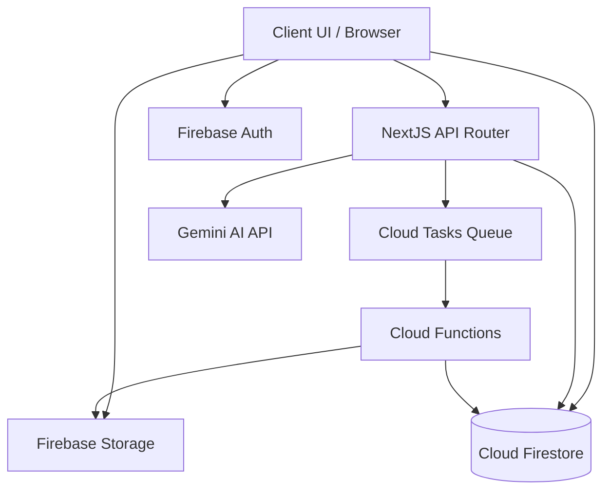
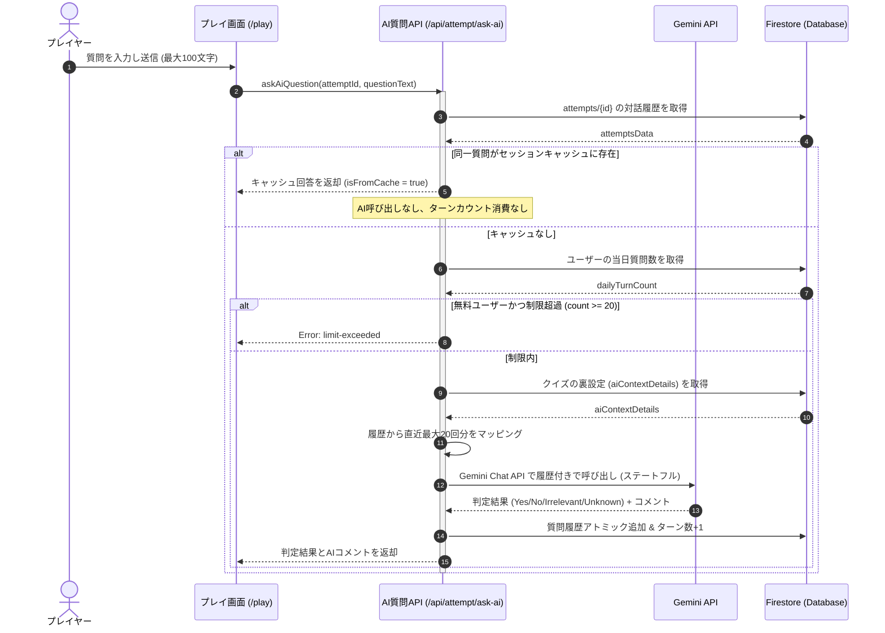
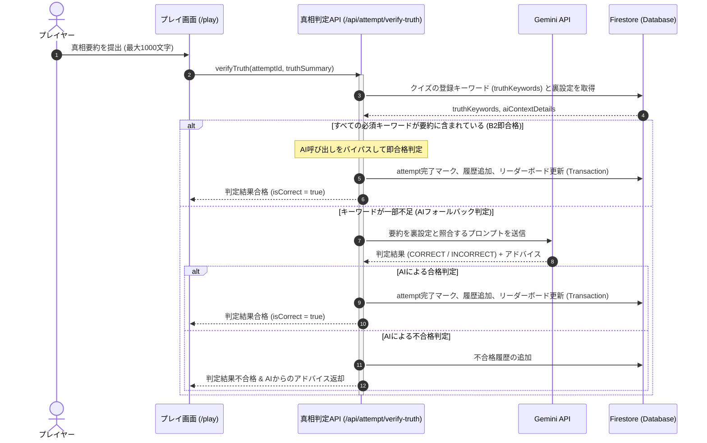
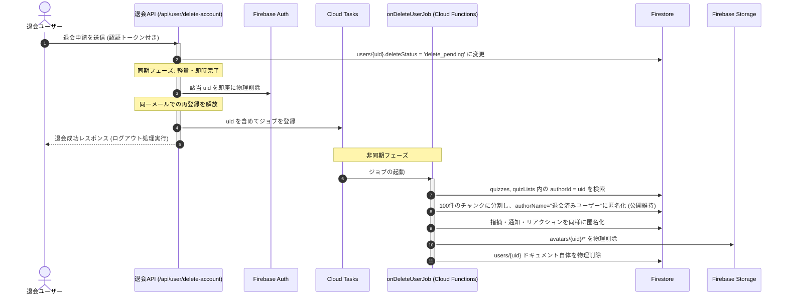

# Technical Design Document: quizeum-core

## Overview
本ドキュメントは、クイズ投稿SNS「quizeum」における核心的なコアシステム（`quizeum-core`）の技術設計仕様を定義します。クイズの作成・下書き・厳格な公開バリデーション、ローカルセッション保護と自動同期を備えたプレイ環境、AIを活用したステートレスなウミガメのスープ（水平思考クイズ）対話、退会時のAuth即時物理削除と大規模非同期クレンジング、そしてコミュニティモデレーションやマージ合意によるメタデータ仮想統合を含みます。

本システムは、Next.jsのApp RouterおよびReact、TypeScriptのフルスタック構成に加え、Firebase（Auth, Firestore, Storage）および外部AI（Gemini API）のハイブリッドアーキテクチャを採用し、セキュリティとパフォーマンス、ユーザー体験（UX）を最高レベルで実現します。

### Goals
- ページの初期HTML読み込み時間を通常トラフィック下で平均0.5秒以内に維持する。
- プレイ中の不意なリロードやオフライン切断時における解答データ損失をローカルで保護・復元する。
- ユーザー退会時、アトミックな書き込み制限（最大500件）を回避しつつ即時Auth物理削除と非同期ジョブによる関連データの安全なクレンジングを完了する。
- 水平思考クイズにおいて、セキュアなサーバーサイド呼び出し、ターン制限（1日20回）、および同一質問キャッシュによる低コストで高精度なAI判定を実装する。

### Non-Goals
- 外部システムや外部ファイルからのクイズ・クイズリストの一括インポート機能の実装。
- リアルタイムマルチプレイヤー対戦プレイ用の接続・ポーリング基盤の構築。
- 広告配信用のアドサーバー基盤そのものの構築。

---

## Boundary Commitments

### This Spec Owns
- **データ永続化と整合性**: `users`, `quizzes`, `quizLists`, `follows`, `bookmarks`, `attempts`, `feedbackReports`, `flags`, `reactions`, `notifications`, `metadata_genres`, `metadata_tags`, `mergeRequests`, `genreRequests`, `quizReviews`, `reviewResetRequests` などのFirestoreスキーマ（ウミガメスープ用必須キーワード `truthKeywords` を含む）およびトランザクション設計。
- **アカウント削除プロセス**: Next.js API Routeを経由した即時Auth物理削除と、Cloud Tasks/Cloud Functionsを連動させた非同期ジョブ分割によるアトミックバッチ匿名化。
- **水平思考プレイ判定ロジック**: サーバーAPIを仲介するGemini API連携（直近最大20回分の会話履歴参照を伴うステートフル化）、同一質問キャッシュ一致判定、1日同一クイズ20回制限（無料ユーザー）、必須キーワード全一致による即正解チェックとAIフォールバックによるハイブリッド真相判定（B2方式）。
- **メタデータ管理**: 表記揺れタグの自動名寄せおよび類似サジェスト、表記揺れタグ/ジャンルのモデレータ投票による仮想マージ関係の解決と canonical 解決。
- **オフライン/セッション保護**: クライアントローカル永続ストレージでの進捗永続化およびオンライン復帰時の自動バッチ同期。

### Out of Boundary
- 外部APIへの直接のクライアント通信（AI呼び出しなど）はSecurity Rulesで拒否され、すべてNext.js API Routeを経由します。
- クイズデータの一括JSONインポートは行わず、手動によるエクスポート（ダウンロード）パッケージ生成のみを担当します。

### Allowed Dependencies
- **外部AI API**: 生成AI自動判定に必要な外部API（Google Gemini API等）。
- **アセットストレージ**: カバー画像やアバター画像を管理する Firebase Storage。
- **バックエンド基盤**: ユーザー認証およびデータの永続化を行う Firebase Auth, Cloud Firestore。

### Revalidation Triggers
- `spec.json` の型定義（`User`, `Quiz`, `Attempt` 等）のスキーマ変更。
- 退会処理時における匿名化対象コレクションの追加。
- AI自動真相判定のプロンプト構成やGemini APIのインターフェース変更。

---

## Architecture

### Existing Architecture Analysis
既存のコードベースには、クライアントから直接Firestoreを操作する簡易的なサービス（`src/services/quiz.ts` 等）がすでに実装されています。
本設計はこれを拡張し、重要な更新処理や複雑なビジネスロジック（退会、NGワード検証、AI対話）において、Firestore Security Rulesによる不正書き込みの遮断と、セキュアなサーバーAPI Route（Next.js）および Cloud Functions による二重の検証・処理を強制するハイブリッドモデルを適用します。

### Architecture Pattern & Boundary Map



### Technology Stack

| Layer | Choice / Version | Role in Feature | Notes |
|-------|------------------|-----------------|-------|
| Frontend / CLI | Next.js v16.2.6 (App Router) | ユーザーUIの提供、ローカルセッション永続化 | React v19.2.4、TypeScript |
| Backend / Services | Next.js API Routes | セキュアなAI判定プロキシ、即時退会Auth削除、Cloud Tasks登録 | Firebase Admin SDK |
| Data / Storage | Cloud Firestore | 全データの永続化とアトミックカウント更新 | `firestore.indexes.json` で複合インデックスを管理 |
| Messaging / Events | Cloud Tasks | 退会時非同期分割匿名化ジョブの遅延実行 | Cloud Functions と連携 |
| Infrastructure / Runtime | Firebase Storage | アバターやカバー画像の保存（上限2MB） | Storage Security Rules による認証保護 |

---

## File Structure Plan

### Directory Structure
```
src/
├── app/
│   └── api/
│       ├── attempt/
│       │   ├── ask-ai/
│       │   │   └── route.ts      # AI質問判定API (4.1, 4.2)
│       │   └── verify-truth/
│       │       └── route.ts      # AI真相判定API (4.5, 4.6)
│       └── user/
│           └── delete-account/
│               └── route.ts      # 即時退会Auth物理削除API (1.4)
├── services/
│   ├── attempt.ts                # プレイ履歴・進捗同期・キャッシュ管理 (3.1, 3.2, 4.3)
│   ├── bookmark.ts               # ブックマークのアトミック管理 (5.3)
│   ├── moderation.ts             # NGワード・通報・マージリクエスト管理 (7.1, 7.2, 7.4)
│   ├── quiz-list.ts              # 問題集リストの管理 (5.4)
│   ├── quiz.ts                   # クイズ公開、編集、エクスポート (2.2, 2.3, 2.6)
│   ├── storage.ts                # Storageアセット操作、自動クレンジング (1.5, 5.1)
│   └── user.ts                   # バッジ付与、プロフィール編集 (1.2, 1.3)
└── types/
    └── index.ts                  # すべての型定義ファイル (1.1, 2.2, 3.5, etc)
```

### Modified Files
- `src/types/index.ts` — 称号、ウミガメスープ履歴、必須キーワード `truthKeywords` などの型定義を網羅。
- `src/services/quiz.ts` — クイズ公開時バリデーション（ウミガメスープにおけるキーワード設定検証）等を追加。
- `src/services/quiz-validation.ts` — ウミガメスープ形式の時、必須キーワードが最低1つ指定されているかどうかの検証を追加。
- `src/services/ask-ai-utils.ts` — 会話履歴を反映したシステムインラインプロンプト構築と Gemini Chat API 連携用マッピングロジックを追加。
- `src/services/verify-truth-utils.ts` — 登録必須キーワードがすべて含まれているかを検証する `verifyKeywords` 正規化判定関数を追加。
- `src/app/api/attempt/ask-ai/route.ts` — Firestore から履歴を取得して直近20回分の履歴を Gemini に渡しステートフルな呼び出しを行うよう修正。
- `src/app/api/attempt/verify-truth/route.ts` — 必須キーワード一致による即合格（AIバイパス）とAIフォールバックを組み合わせたハイブリッド判定処理を追加。
- `src/components/quiz/quiz-editor.tsx` — ウミガメスープ形式の問題作成時に、タグ風UIで必須キーワードを追加・削除できるフォームを追加。

---

## System Flows

### 水平思考クイズ（ウミガメのスープ）ステートフルAI質問対話フロー



### 水平思考クイズ（ウミガメのスープ）B2 ハイブリッド真相自動判定フロー



### ユーザー退会・非同期データクレンジングフロー



---

## Requirements Traceability

| Requirement | Summary | Components | Interfaces | Flows |
|-------------|---------|------------|------------|-------|
| 1.1 | ユーザー登録および認証 | User Authentication | Firebase Auth | - |
| 1.2 | プロフィール編集 | `UserService` | `updateProfile` | - |
| 1.3 | 称号バッジ自動付与 | `UserService` | `checkAndAwardBadges` | - |
| 1.4 | 退会時即時Auth削除 | `DeleteAccountAPI` | `/api/user/delete-account` | 退会フロー |
| 1.5 | 大規模関連データの非同期匿名化 | `onDeleteUserJob` | Cloud Functions Trigger | 退会フロー |
| 1.6 | 退会保留中のアクセス遮断 | Security Rules | `deleteStatus != 'delete_pending'` | - |
| 2.1 | クイズ下書き保存 | `QuizService` | `createQuiz(status='draft')` | - |
| 2.2 | 公開時バリデーション & NGチェック | `QuizService` | `publishQuiz` | - |
| 2.3 | タグ名寄せ & 類似サジェスト | `QuizService` | `normalizeTag`, `getSimilarTag` | - |
| 2.4 | クイズタイトル更新時の非正規化同期 | `QuizService` | `updateQuiz` | - |
| 2.5 | クイズ削除時のカスケードクリーンアップ | `QuizService` | `deleteQuiz` | - |
| 2.6 | 作成クイズ一括エクスポート | `QuizService` | `exportQuizzes` | - |
| 3.1 | 通常モードプレイ | `AttemptService` | `saveAttempt` | - |
| 3.2 | 解答セッションローカル永続化 | `LocalAttemptSession` | `saveToLocalStorage` | - |
| 3.3 | オフラインプレイ結果と自動同期 | `LocalAttemptSession` | `syncPendingAttempts` | - |
| 3.4 | オフラインリストプレイの進行ブロック | `LocalAttemptSession` | `checkConnectivity` | - |
| 3.5 | プレイ結果画面（良問評価・難易度投票）| `ReviewService` | `submitReview` | - |
| 3.6 | 自己ベスト・ハイスコア自動登録 | `QuizService` | `updateLeaderboard` | - |
| 2.7 | 必須キーワード(エッセンス)のタグ風UI入力 | `QuizCreator` / UI | `truthKeywords` タグ入力UI | - |
| 2.8 | クイズ公開時の必須キーワードバリデーション | `QuizService` | `validateQuizForPublish` | - |
| 4.1 | 最大20回分の会話履歴を参照したステートフルAI質問 | `AskAiQuestionAPI` | `/api/attempt/ask-ai` | 質問対話フロー |
| 4.2 | 無料ユーザーの1日20回制限 | `AskAiQuestionAPI` | `/api/attempt/ask-ai` | 質問対話フロー |
| 4.3 | 同一質問キャッシュ | `AskAiQuestionAPI` | `/api/attempt/ask-ai` | 質問対話フロー |
| 4.4 | プレイ画面2カラムレイアウト | UI Component | `LateralThinkingPlayView` | - |
| 4.5 | 必須キーワード一致による即合格(AIバイパス) | `VerifyTruthAPI` | `/api/attempt/verify-truth` | 真相判定フロー |
| 4.6 | キーワード不足時のAIフォールバック真相判定 | `VerifyTruthAPI` | `/api/attempt/verify-truth` | 真相判定フロー |
| 4.7 | 真相不合格時のAIアドバイスフィードバック | `VerifyTruthAPI` | `/api/attempt/verify-truth` | 真相判定フロー |
| 5.1 | フォロー/フォロワーアトミック更新 | `UserService` | `followUser` | - |
| 5.2 | タイムラインフィード表示 | `QuizService` | `getFollowedTimeline` | - |
| 5.3 | ブックマークアトミック更新 | `BookmarkService` | `toggleBookmark` | - |
| 5.4 | クイズリスト作成・編集・削除 | `QuizListService` | `createQuizList` | - |
| 5.5 | リスト連続プレイ (Attempt.listId) | `AttemptService` | `saveAttempt(mode='list')` | - |
| 5.6 | クイズリストパッケージエクスポート | `QuizListService` | `exportQuizList` | - |
| 6.1 | クローズド指摘フィードバック送信 | `ReviewService` | `submitFeedbackReport` | - |
| 6.2 | 指摘解決時の修正完了オート通知 | `ReviewService` | `resolveReport` | - |
| 6.3 | 👍/👎良問投票（作成者除外） | `ReviewService` | `submitReview` | - |
| 6.4 | 仮リセット期間中の評価マスク | UI Component | `QuizDetailView` | - |
| 6.5 | 評価リセット承認時の非同期クリーンアップ| `ReviewService` | `resetReviews` | - |
| 7.1 | コンテンツ通報とアトミック更新 | `ModerationService` | `flagContent` | - |
| 7.2 | 5回通報時の自動保留（非公開） | `ModerationService` | `flagContent` (Function) | - |
| 7.3 | 管理者審査（公開復帰/永久非公開） | `ModerationService` | `resolveFlag` | - |
| 7.4 | 表記揺れタグ/ジャンルの仮想マージ | `ModerationService` | `createMergeRequest` | - |
| 7.5 | 新ジャンル申請・投票 | `ModerationService` | `submitGenreRequest` | - |
| 7.6 | ジャンル可決時の自動登録・有効化 | `ModerationService` | `resolveGenreRequest` | - |
| 8.1 | 初期HTML読み込み速度0.5秒以内 | Performance | SSR Cache / Optimization | - |
| 8.2 | 高負荷時エラー率0.1%未満 | Infrastructure | High Availability | - |
| 8.3 | クローラー向け高速HTMLとOGPメタデータ | SSR Component | `getServerSideProps` / Metadata | - |

---

## Components and Interfaces

### Component Summary Table

| Component | Domain/Layer | Intent | Req Coverage | Key Dependencies (P0/P1) | Contracts |
|-----------|--------------|--------|--------------|--------------------------|-----------|
| `UserService` | Service | ユーザープロフィール、称号、フォロー管理 | 1.2, 1.3, 5.1 | Firestore (P0) | Service, State |
| `QuizService` | Service | クイズのライフサイクル、エクスポート、ハイスコア更新 | 2.1, 2.2, 2.3, 2.4, 2.5, 2.6, 3.6 | Firestore (P0), NGChecker (P1) | Service, API |
| `AttemptService` | Service | 解答結果の永続化、セッションキャッシュ、オフライン同期 | 3.1, 3.2, 3.3, 3.4, 5.5 | Firestore (P0), LocalStore (P1) | Service, State, Batch |
| `BookmarkService` | Service | クイズ・リストのブックマークアトミック管理 | 5.3 | Firestore (P0) | Service, State |
| `QuizListService` | Service | 問題集リストの作成、ドラッグ＆ドロップ、パッケージング | 5.4, 5.6 | Firestore (P0), QuizService (P1) | Service, State |
| `ReviewService` | Service | 良問評価、間違い指摘、修正通知、リセットバッチ | 3.5, 6.1, 6.2, 6.3, 6.5 | Firestore (P0), CloudTasks (P1) | Service, State, Batch |
| `ModerationService` | Service | 通報、自動保留、タグ/ジャンル仮想マージ提案、ジャンル申請 | 7.1, 7.2, 7.3, 7.4, 7.5, 7.6 | Firestore (P0) | Service, State |
| `/api/user/delete-account` | API Route | 即時Auth物理削除とCloud Tasksジョブ登録 | 1.4 | AuthAdmin (P0), CloudTasks (P0) | API |
| `/api/attempt/ask-ai` | API Route | 水平思考クイズのAI質問判定 (ターン制限・キャッシュ) | 4.1, 4.2, 4.3 | Gemini API (P0), Firestore (P0) | API |
| `/api/attempt/verify-truth` | API Route | 水平思考クイズのAI真相自動判定とフィードバック | 4.5, 4.6, 4.7 | Gemini API (P0), Firestore (P0) | API |

---

### Component Interface Details

#### `UserService`
- **Intent**: ユーザープロフィール情報の管理、アトミックな称号バッジ付与、フォロー管理。
- **Requirements**: `1.2, 1.3, 5.1`

```typescript
export interface UserService {
  // プロフィール更新 (1.2)
  updateProfile(uid: string, data: { displayName: string; bio: string; followedGenres: string[] }): Promise<void>;
  
  // 称号バッジの判定とアトミック付与 (1.3)
  checkAndAwardBadges(uid: string): Promise<Badge[]>;
  
  // ユーザーのフォロー/解除トグル (5.1)
  followUser(followerId: string, followingId: string): Promise<{ isFollowing: boolean }>;
}
```
- **Preconditions**: `uid` が Firebase Auth 上で認証されていること。
- **Postconditions**: 称号バッジ付与時に条件を満たした場合、`users.badges` 配列にアトミックに Badge オブジェクトが追加される。

#### `QuizService`
- **Intent**: クイズの保存、編集、Zod検証、NGワード二重検証付き公開、エクスポート。
- **Requirements**: `2.1, 2.2, 2.3, 2.4, 2.5, 2.6, 3.6`

```typescript
export interface QuizService {
  // クイズの新規作成または下書き保存 (2.1)
  saveQuiz(quiz: Omit<Quiz, 'id' | 'playCount' | 'bookmarksCount' | 'createdAt' | 'updatedAt'>, status: 'draft' | 'published'): Promise<string>;
  
  // タグの自動名寄せと類似サジェスト検知 (2.3)
  normalizeTag(input: string): string;
  getSimilarTagSuggest(tag: string): Promise<string | null>;
  
  // クイズの削除と関連データの非同期クリーンアップ (2.5)
  deleteQuiz(quizId: string): Promise<void>;
  
  // クイズ一括エクスポート (2.6)
  exportQuizzes(uid: string): Promise<QuizExportPackage>;
  
  // ハイスコア・タイムアタックランキングの更新 (3.6)
  updateLeaderboard(quizId: string, record: Omit<LeaderboardRecord, 'completedAt'>): Promise<void>;
}
```
- **Validation Hooks**: `saveQuiz` で公開（`published`）する際、Zodスキーマ `quizPublishSchema` を強制検証し、NGワードが含まれていれば保存を拒否する。

#### `AttemptService`
- **Intent**: プレイ結果の永続化、ローカルストレージ退避、オフライン結果同期。
- **Requirements**: `3.1, 3.2, 3.3, 3.4, 5.5`

```typescript
export interface AttemptService {
  // プレイ結果の永続永続化 (3.1)
  saveAttempt(attemptData: Omit<Attempt, 'id' | 'completedAt'>): Promise<string>;
  
  // 間違えた問題の一括更新 (3.1)
  updateFailedQuestions(uid: string, quizId: string, solvedQuestionIds: string[]): Promise<void>;
}
```

---

## Data Models

### Domain Model

```typescript
// 1. ユーザー情報 (Users)
export interface User {
  id: string;
  email: string;
  displayName: string;
  avatarUrl: string;
  bio: string;
  followedGenres: string[];
  badges: Badge[];
  createdQuizzesCount: number;
  totalPlayCount: number;
  followersCount: number;
  followingCount: number;
  reputationScore: number;
  moderationTier: 'newcomer' | 'contributor' | 'moderator' | 'senior_moderator';
  reputationHistory: ReputationEventLog[];
  lastReputationCalculatedAt: Date | null;
  totalFailedQuestionsCount: number;
  deleteStatus: 'active' | 'delete_pending';
  createdAt: Date;
  updatedAt: Date;
}

export interface Badge {
  id: string;
  title: string;
  description: string;
  iconName: string;
  unlockedAt: Date;
}

export interface ReputationEventLog {
  eventId: string;
  delta: number;
  reason: string;
  createdAt: Date;
}

// 2. クイズ (Quizzes)
export interface Quiz {
  id: string;
  authorId: string;
  authorName: string;
  authorAvatar: string;
  title: string;
  description: string;
  thumbnailUrl: string | null;
  difficulty: number; // 1〜10 の整数
  genre: string;
  tags: string[];
  originalTags: string[];
  questions: Question[];
  questionCount: number;
  status: 'draft' | 'published' | 'suspended';
  flagsCount: number;
  playCount: number;
  bookmarksCount: number;
  positiveCount: number;
  negativeCount: number;
  tempPositiveCount: number;
  tempNegativeCount: number;
  reviewScore: number | null;
  reviewBadge: string | null;
  isReviewMasked: boolean;
  activeResetRequestId: string | null;
  canonicalGenreId: string;
  canonicalTagIds: string[];
  leaderboard: LeaderboardRecord[];
  createdAt: Date;
  updatedAt: Date;
}

export interface Question {
  id: string;
  type: 'true-false' | 'multiple-choice' | 'text-input' | 'sorting' | 'association' | 'lateral-thinking';
  questionText: string;
  explanation: string;
  imageUrl: string | null;
  hint: string | null;
  limitTime: number | null;
  correctTextAnswerList?: string[];
  choices?: Choice[];
  sortingItems?: SortingItem[];
  associationHints?: string[];
  aiContextDetails?: string;
  truthKeywords?: string[]; // ウミガメスープ用必須正解キーワード (2.7)
  correctCount: number;
  incorrectCount: number;
}

export interface Choice {
  id: string;
  choiceText: string;
  isCorrect: boolean;
  selectedCount: number;
}

export interface SortingItem {
  id: string;
  text: string;
  correctOrder: number;
}

export interface LeaderboardRecord {
  userId: string;
  displayName: string;
  score: number;
  elapsedSeconds: number;
  completedAt: Date;
}

// 3. プレイ履歴 (Attempts)
export interface Attempt {
  id: string;
  userId: string;
  quizId: string;
  listId?: string;
  mode: 'normal' | 'exam' | 'flashcard' | 'review' | 'list';
  score: number;
  totalQuestions: number;
  elapsedSeconds: number;
  failedQuestionIds: string[];
  difficultyVote?: number | null;
  aiQuestionsHistory?: AiQuestion[];
  aiTurnCount: number;
  aiTurnLimit: number | null;
  completedAt: Date;
}

export interface AiQuestion {
  id: string;
  questionText: string;
  answerType: 'yes' | 'no' | 'irrelevant' | 'unknown';
  aiComment?: string;
  isFromCache: boolean;
  createdAt: Date;
}

// 4. 指摘レポート (feedbackReports)
export interface FeedbackReport {
  id: string;
  quizId: string;
  quizTitle: string;
  questionId: string;
  questionText: string;
  selectedChoiceText?: string;
  reporterId: string;
  creatorId: string;
  category: 'typo' | 'fact' | 'alternative';
  content: string;
  status: 'open' | 'resolved';
  createdAt: Date;
}
```

---

## Error Handling

### Error Strategy
- **通信切断・ネットワーク障害**:
  - `AttemptService` の保存処理に失敗した場合、プレイヤーの進捗および最終結果を `persistent local client storage` (browser local storage) にシリアライズして退避します。
  - オンライン復帰を自動検知した際、バックグラウンドで溜まった未同期履歴を一括で Firestore に同期します。
- **NGワード自動検出・コンテンツ保留**:
  - サーバーサイドでのNGワード検証で不適切表現を検知した場合は、トランザクションを強制ロールバックし、`quizzes.status` を自動的に `'suspended'` に設定した上で、作成者への警告通知を送信します。
- **ウミガメスープ制限超過**:
  - 1日20回の質問上限を超過した場合、API Routeは `429 Too Many Requests` (Error: `limit-exceeded`) を返却し、画面側でプレミアムプランへの誘導を含めた警告ダイアログをインライン表示します。

---

## Testing Strategy

### Unit Tests
- **タグ正規化の検証**: `normalizeTag` が全半角トリム、小文字化、記号排除を完璧に行うかを検証。
- **称号バッジ条件判定**: 累計プレイ数が条件（例：100回）を満たした際に、正確に該当バッジを配列に追加するロジックをモック検証。
- **同一質問キャッシュの検証**: 完全一致する質問が `aiQuestionsHistory` に存在する場合に、AIを呼び出さずキャッシュの回答を返すことを単体テスト。
- **必須キーワード検証ロジック**: `verifyKeywords` 関数が全半角正規化を行い、大文字小文字に関わらずキーワード合致を正確に判定できるかをテスト。
- **会話履歴マッピング検証**: 履歴から直近20回の Q&A ペアが正しく Gemini SDK の `Content[]` 型にマッピングされることを単体テスト。

### Integration Tests
- **退会時非同期クレンジング**: API Routeに退会リクエストを送信し、Auth物理削除完了とCloud Tasksへのジョブ登録、およびFirestore匿名化が整合性高く動作することを検証。
- **ウミガメスープB2ハイブリッド真相判定**:
  - 必須キーワードが揃っている場合にAIを呼び出さず、即時Firestoreを更新して合格レスポンスを返す統合テスト。
  - キーワードが不足している場合にGemini APIを呼び出し、AIの評価に基づいて合格またはアドバイスを返す統合テスト。

### E2E / UI Tests
- **解答中断と自動復旧**: プレイ中にブラウザを強制リロードし、`localStorage` から解答進捗が100%正しく復元され、プレイが継続できるかをシミュレート。

---

## Security Considerations
- **Firestore Security Rules**:
  - ユーザーの `badges`, `reputationScore`, `totalPlayCount` などの重要パラメータは、クライアントからの更新（`update`）を Security Rules で完全に拒否し、サーバーサイド（Cloud Functions）およびトランザクションのみで更新を許可。
  - `deleteStatus == 'delete_pending'` である間、第三者からの読み取りをSecurity Rulesで拒否。
- **APIキーの秘匿**:
  - Google Gemini API キーなどの認証情報はNext.jsのサーバー環境変数としてのみ管理し、クライアントへは一切露出させません。

---

## Performance & Scalability
- **N+1問題の完全排除 (非正規化)**:
  - クイズ一覧表示時にユーザーのアバターや名前を都度フェッチするのを防ぐため、`quizzes` ドキュメント内に `authorName`, `authorAvatar` を非正規化して非同期冗長保持します。
- **Firestore `in` クエリ制限 (30件) の回避**:
  - ブックマークやクイズリストの展開において、Firestoreの `in` クエリ上限を意識し、10件ごとのチャンクに分割して並行で非同期フェッチを行い、パフォーマンスと可用性を最大化します。
