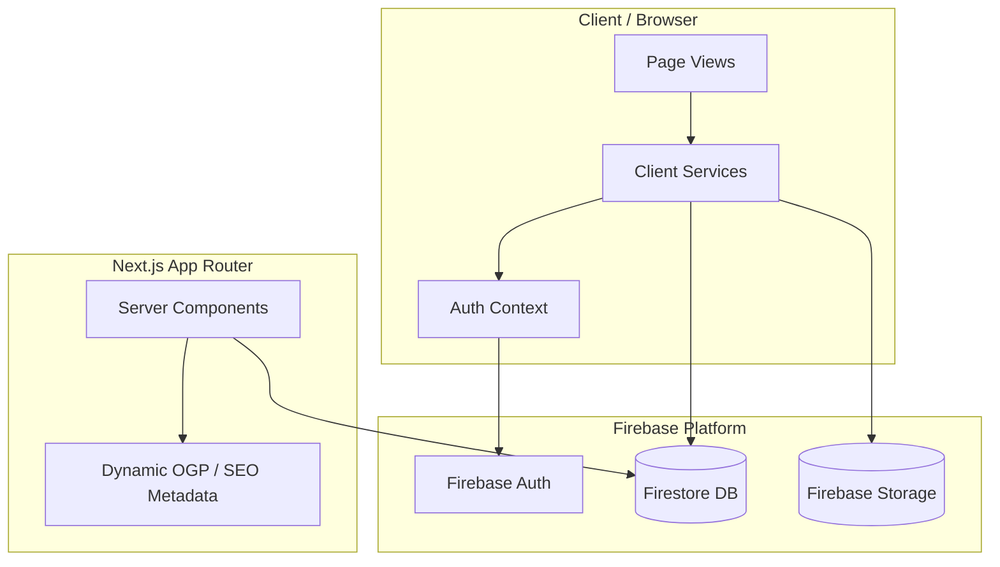
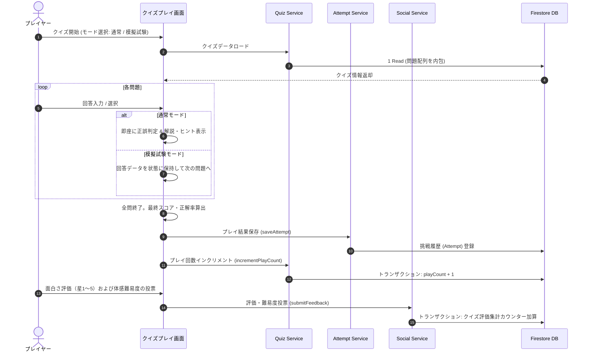
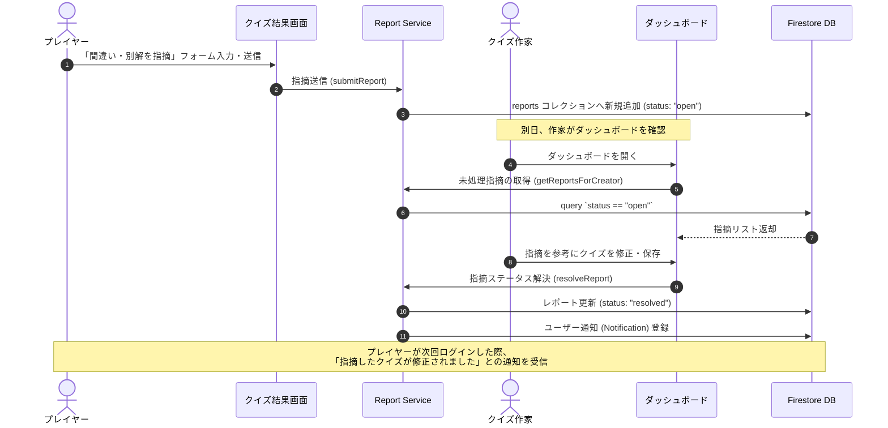

# Technical Design Document - quizeum-core

## Overview
本ドキュメントは、ユーザーがクイズを自由に作成・投稿・プレイ・管理し、お互いにフォローやブックマークを通じて双方向のコミュニケーションを楽しめる総合クイズSNS「quizeum」のコアシステム設計を定義します。

### Purpose
本フィーチャーは、一般ユーザーおよびゲストに対し、クイズを通じた知識の共有と学習・競技の体験を提供します。また、最終的な目標である「月間100万PV」を支えるため、Next.js (App Router) の Server Components をベースとした超高速なHTML応答および強力な動的SEO/OGPメタデータ生成機構を実現します。さらに、不適切なコンテンツを自動排除する「モデレーション」と、クイズの正確性を高めるクローズドな「別解・間違い指摘」により、健全で信頼できるコミュニティ環境を構築します。

### Goals
- Next.js (App Router) + Firestore を用いた、平均0.5秒以下の高速初期表示および完全なSEO/OGP動的メタデータの生成。
- クイズ問題の画像アタッチ機能、問題ごとの制限時間カウントダウン、通常・模擬試験・フラッシュカード各モードの実現。
- 競技プレイヤー向けのハイスコア＆タイムアタックリーダーボード、およびガチ問題用の「短答式（文字入力）」対応。
- クイズ作家向けのプレイ数、面白さ評価、体感難易度、問題別の正答率・誤答選択肢の割合を視覚化するダッシュボード。
- NGワード自動フィルタ、ユーザー通報（フラグ）機能、および通報数蓄積による自動非公開処理。
- コメント欄の荒れを防ぎ、クイズの品質向上を推進する、クローズドな別解・間違い指摘と修正完了の自動通知ループ。

### Non-Goals
- 運営管理者向けのマスターデータ一括メンテナンス用CLIツールの開発。
- クイズ詳細画面におけるユーザー同士のオープンなタイムライン型コメント掲示板の提供（モデレーションおよびクローズド指摘機能で代替するため）。

---

## Boundary Commitments

### This Spec Owns
- **ドメインデータモデル**: `src/types/index.ts` における `Quiz`, `Question`, `QuizReport`, `QuizFlag` などの厳格な型定義。
- **データ永続化とアトミック制御**: Firestore へのCRUD処理、アトミックなトランザクション（プレイ回数・評価のカウンタ更新、通報数蓄積時の保留化）。
- **ビジネスロジックサービス**: `src/services/` 配下のクイズ操作、プレイ履歴、ソーシャル、レポート、モデレーション。
- **ページ＆ルーティング**: `src/app/` における Server Components によるSEOメタデータ応答、および Client Components での滑らかな解答用状態管理。

### Out of Boundary
- **画像ストレージのアップロード権限制御**: ユーザー認証および Firebase Storage Security Rules 自体の詳細設定（インフラ側の baseline ポリシーに委ねる）。
- **外部SNS（X, Facebook等）のSDK統合**: シェアテキストを埋め込んだURLリンクの生成のみを対象とし、外部SDKの読み込みやダイレクト投稿APIとの直接連携は含まない。

### Allowed Dependencies
- **Next.js (App Router)**: サーバーサイドでのデータフェッチおよび動的SEOメタデータ出力のため。
- **Firebase JS Client SDK (Auth, Firestore, Storage)**: 認証、データの永続化、およびファイル参照のため。
- **Lucide React**: UI内の各種アイコン描画のため。

### Revalidation Triggers
- `Quiz` ドキュメント内の `questions` スキーマの構造変更。
- 別解指摘レポート (`QuizReport`) および通報 (`QuizFlag`) のスキーマ変更。
- 認証同期インターフェース (`AuthContextType`) のシグネチャ変更。

---

## Architecture

### Architecture Pattern & Boundary Map



### Technology Stack

| Layer | Choice / Version | Role in Feature | Notes |
|-------|------------------|-----------------|-------|
| Frontend | Next.js 16.2.6 (App Router) / React 19.2.4 | UI構造、状態管理、動的SEO/OGPメタデータ生成、Server Componentsによる高速表示 | TypeScript strictモード |
| Styling | Vanilla CSS | 美麗でレスポンシブなダーク/ライトテーマ、グラスモルフィズム、マイクロアニメーションの実現 | `@/styles/variables.css` 基準 |
| Backend / DB | Firebase Firestore | 各ドメインデータの型安全な永続化、およびトランザクション処理 | クライアント直結 + Converter |
| Auth | Firebase Auth | メール/パスワード認証、およびGoogleログイン | `auth-context.tsx` にて同期 |
| Storage | Firebase Storage | クイズカバー画像および問題画像の管理・ホスティング | `storage` オブジェクト参照 |
| Icon Library | Lucide React | インタラクティブで直感的なアイコン描画 | Lucide-React標準 |

---

## File Structure Plan

### Directory Structure
```
src/
├── app/
│   ├── quiz/
│   │   ├── [id]/
│   │   │   ├── page.tsx          # [NEW] クイズ詳細画面 (Server Component, SEO/OGP生成)
│   │   │   └── play/
│   │   │       └── page.tsx      # [NEW] クイズプレイ画面 (Client Component, 通常/模擬試験/フラッシュカード)
│   │   └── create/
│   │       └── page.tsx          # [NEW] クイズ新規作成・編集画面 (バリデーション、画像、ヒント、タイマー設定)
│   ├── creator/
│   │   └── dashboard/
│   │       └── page.tsx          # [NEW] 作家ダッシュボード (プレイ数、評価、問題別正解率グラフ)
│   └── page.tsx                  # [MODIFY] ホーム画面 (新着、人気、トレンド、タイムラインフィード表示)
├── types/
│   └── index.ts                  # [MODIFY] 共通型定義 (文字入力形式、ヒント、評価、指摘、通報スキーマの拡張)
└── services/
    ├── quiz.ts                   # [NEW] クイズCRUD、高度な検索、ジャンル・難易度絞り込み
    ├── attempt.ts                # [NEW] クイズ解答結果保存、復習問題抽出
    ├── social.ts                 # [NEW] フォロー・ブックマーク操作、タイムラインフィード生成
    ├── report.ts                 # [NEW] クローズド間違い指摘、作家向け一覧表示、修正完了自動通知
    └── moderation.ts             # [NEW] NGワード自動フィルタ、通報送信、自動非公開処理
```

### Modified Files
- `src/types/index.ts`
  - 問題タイプ（選択式・短答式）、問題ごとのヒント・画像、クイズ評価集計、別解指摘レポート、通報ドキュメントの型定義を追加し、100%タイプセーフを保証します。
- `src/app/page.tsx`
  - ホーム画面を、高度な検索・探索フィルタ（ジャンル、難易度、問題数、未プレイ/プレイ済みの複合フィルタ）を備えたダッシュボードUIへと更新します。

---

## System Flows

### 1. クイズのプレイ・正誤判定・結果登録および評価投票 (Requirements 3, 4, 10)



### 2. クローズド別解・間違い指摘および作家による修正・自動通知 (Requirement 12)



---

## Requirements Traceability

| Requirement ID | Summary | Components / Services | Interfaces / APIs | Files / Flows |
|----------------|---------|-----------------------|-------------------|---------------|
| **1.1, 1.2** | ログイン・新規登録・エラー制御 | `AuthProvider` | `signInWithEmailAndPassword`, `createUser` | `auth-context.tsx`, LoginPage |
| **1.3, 1.4** | プロフィール・ジャンル編集・反映 | `UserService` | `updateUserProfile` | `services/user.ts` |
| **2.1 - 2.5** | クイズ作成・公開・削除・下書き | `QuizService` | `createQuiz`, `updateQuiz`, `deleteQuiz` | `services/quiz.ts`, Flow 1 |
| **2.6, 2.7** | 画像アタッチ・問題タイマー設定 | `QuizService` | `uploadImage`, `questions[].limitTime` | `services/quiz.ts`, QuizCreatePage |
| **2.8** | 動的選択肢数 (2〜4択) の変更 | `QuizService` | `questions[].choices` 配列幅可変 | `services/quiz.ts` |
| **2.9** | 公開時のデータ完全性検証 | `QuizService` | `validateQuizForPublish` | `services/quiz.ts` |
| **2.10** | 任意ヒント・解説マークダウン | `QuizService` | `questions[].hint`, `explanation` | `services/quiz.ts` |
| **3.1 - 3.3** | クイズプレイ、正誤判定、結果 | `QuizGameplay` | `checkAnswer`, `totalScore` | `app/quiz/[id]/play/page.tsx` |
| **3.4, 3.5** | 履歴永続化、プレイ数カウントアップ | `AttemptService`, `QuizService` | `saveAttempt`, `incrementPlayCount` | `services/attempt.ts`, Flow 1 |
| **3.6, 3.7** | プレイ中画像表示、カウントダウンタイマー | `QuizGameplay` | `limitTimerInterval` | `app/quiz/[id]/play/page.tsx` |
| **3.8** | セッション中断保護（リロード対応） | `QuizGameplay` | `localStorageSessionRestore` | `app/quiz/[id]/play/page.tsx` |
| **3.9, 3.10**| ヒント表示、解説マークダウンレンダリング | `QuizGameplay` | `reactMarkdownRenderer` | `app/quiz/[id]/play/page.tsx` |
| **4.1 - 4.4** | フォロー、ブックマーク、TLフィード | `SocialService` | `followUser`, `toggleBookmark`, `getTimeline`| `services/social.ts` |
| **4.5, 4.6** | レーティング、難易度投票、アトミック集計 | `SocialService` | `submitFeedback`, `Quiz.ratingAverage` | `services/social.ts`, Flow 1 |
| **5.1 - 5.3** | クイズリスト作成、編集、順次プレイ | `QuizListService` | `createQuizList`, `playQuizList` | `services/social.ts` |
| **6.1 - 6.5** | 高度な複合検索、サジェスト、既読未読 | `QuizService` | `searchQuizzes`, `incrementalSuggest` | `services/quiz.ts` |
| **7.1 - 7.3** | 動的SEO/OGP、クローラー対応、SNS共有 | `MetadataEngine` | `generateMetadata` (Server Component) | `app/quiz/[id]/page.tsx` |
| **7.4, 7.5** | 応答速度0.5秒以下、負荷時エラー0.1%未満 | `Next.js Rendering`, `Firestore` | `ISR/Caching` | `app/quiz/[id]/page.tsx` |
| **8.1, 8.2** | ハイスコア＆最速全問正解リーダーボード | `LeaderboardService` | `updateLeaderboard`, `getLeaderboard` | `services/quiz.ts` |
| **8.3, 8.4** | 短答式（文字入力）問題、表記揺れ許容 | `QuizGameplay` | `verifyTextInputAnswer` | `app/quiz/[id]/play/page.tsx` |
| **9.1, 9.2** | 作家ダッシュボード、問題別正誤・誤答分析 | `CreatorAnalytics` | `getQuizAnalytics`, `getQuestionFractions` | `app/creator/dashboard/page.tsx` |
| **9.3, 9.4** | クリエイター称号バッジ、リアクション | `UserService` | `getUserBadges`, `submitReaction` | `services/user.ts` |
| **10.1** | 通常モード / 模擬試験モード | `QuizGameplay` | `playMode: 'normal' | 'exam'` | `app/quiz/[id]/play/page.tsx` |
| **10.2** | 出題順・選択肢のシャッフル | `QuizGameplay` | `shuffleArray` | `app/quiz/[id]/play/page.tsx` |
| **10.3** | 間違えた問題のみ抽出の復習プレイ | `AttemptService` | `getFailedQuestions` | `services/attempt.ts` |
| **10.4** | フラッシュカードモード（暗記カード） | `QuizGameplay` | `playMode: 'flashcard'` | `app/quiz/[id]/play/page.tsx` |
| **11.1** | 自動NGワードフィルタリング | `ModerationService` | `checkNGWords` | `services/moderation.ts` |
| **11.2, 11.3**| ユーザー通報、一定通報蓄積での自動保留 | `ModerationService` | `submitFlag`, `autoSuspendQuiz` | `services/moderation.ts` |
| **12.1 - 12.3**| 別解指摘送信、作成者画面、修正完了通知 | `ReportService` | `submitReport`, `resolveReport` | `services/report.ts`, Flow 2 |

---

## Components and Interfaces

### Component Summary Table

| Component | Domain/Layer | Intent | Req Coverage | Key Dependencies | Selected Contracts |
|-----------|--------------|--------|--------------|------------------|-------------------|
| `QuizService` | Business / Service | クイズのCRUD、高度な複合検索、サジェスト処理を担当 | 2.1-2.10, 6.1-6.5 | `quizzesRef` (P0) | Service |
| `AttemptService` | Business / Service | プレイヤーの挑戦結果の永続化、間違えた問題の復習抽出を担当 | 3.4, 10.3 | `attemptsRef` (P0) | Service |
| `SocialService` | Business / Service | フォロー、ブックマーク、プレイ後のレーティング・難易度投票の集計を担当 | 4.1-4.6, 5.1-5.3 | `followsRef` (P0), `bookmarksRef` (P0) | Service |
| `ReportService` | Business / Service | 非公開での別解・間違い指摘の送信、作家への通知・一覧、修正通知を担当 | 12.1-12.3 | `reportsRef` (P0) | Service |
| `ModerationService`| Business / Service | NGワードチェック、通報処理、および自動非公開（保留化）処理を担当 | 11.1-11.3 | `quizzesRef` (P0), `flagsRef` (P0) | Service |
| `QuizDetailPage` | Server Component | クローラーおよびユーザー向けの高速HTML応答、動的SEO/OGPメタデータ生成 | 7.1-7.5 | `QuizService` (P0) | API (HTML) |
| `QuizPlayPage` | Client Component | プレイ中の状態制御（タイマー、通常/試験/フラッシュカード、中断保護、ヒント） | 3.1-3.10, 8.3-8.4, 10.1-10.4 | `AttemptService` (P0), `ReportService` (P1) | State / Service |
| `CreatorDashboard` | Client Component | クイズ作家向けのプレイ数統計、および問題別正解率・誤答選択肢の割合グラフ表示 | 9.1-9.2 | `QuizService` (P1) | UI / State |

---

### Service Component Contracts

#### 1. QuizService Interface
`src/services/quiz.ts` にて実装するコアサービスインターフェース。

```typescript
import { Quiz, Question } from '@/types';

export interface SearchFilters {
  genre?: string;
  difficulty?: 'easy' | 'medium' | 'hard';
  minQuestions?: number;
  maxQuestions?: number;
  playStatus?: 'unplayed' | 'played'; // ログインユーザーのプレイ状態
}

export interface QuizService {
  /**
   * 指定IDのクイズを1件取得する (Server / Client 共通)
   */
  getQuiz(id: string): Promise<Quiz | null>;

  /**
   * クイズを新規作成する
   */
  createQuiz(authorId: string, quizData: Omit<Quiz, 'id' | 'authorId' | 'playCount' | 'bookmarksCount' | 'createdAt' | 'updatedAt'>): Promise<string>;

  /**
   * クイズを更新する (下書き/公開、問題の追加など)
   */
  updateQuiz(id: string, authorId: string, updates: Partial<Quiz>): Promise<void>;

  /**
   * クイズを削除する (物理削除または論理削除)
   */
  deleteQuiz(id: string, authorId: string): Promise<void>;

  /**
   * 高度な複合検索・フィルタリングを実行する
   */
  searchQuizzes(queryText: string, filters: SearchFilters, currentUserId?: string): Promise<Quiz[]>;

  /**
   * 検索窓のインクリメンタルサジェスト用の候補テキストを返す
   */
  getSearchSuggestions(queryText: string): Promise<string[]>;

  /**
   * ハイスコア / 最速タイムリーダーボードを更新する
   */
  updateLeaderboard(quizId: string, record: { userId: string; displayName: string; score: number; elapsedSeconds: number }): Promise<void>;
}
```

#### 2. AttemptService Interface
`src/services/attempt.ts` にて実装。

```typescript
import { Attempt, Question } from '@/types';

export interface AttemptService {
  /**
   * クイズ挑戦結果を保存し、アトミックにプレイ数をカウントアップする
   */
  saveAttempt(attempt: Omit<Attempt, 'id'>): Promise<string>;

  /**
   * 特定のクイズにおいて、過去にログインユーザーが間違えた問題配列を取得する
   */
  getFailedQuestions(userId: string, quizId: string): Promise<Question[]>;
}
```

#### 3. ReportService Interface
`src/services/report.ts` にて実装。

```typescript
import { QuizReport } from '@/types';

export interface ReportService {
  /**
   * クローズドな間違い・別解指摘レポートを送信する
   */
  submitReport(report: Omit<QuizReport, 'id' | 'createdAt' | 'status'>): Promise<string>;

  /**
   * クイズ作家向けに、自作クイズに対する未処理 ("open") の指摘レポート一覧を取得する
   */
  getReportsForCreator(creatorId: string): Promise<QuizReport[]>;

  /**
   * 指摘レポートを解決済にし、指摘したユーザーへの通知を生成する
   */
  resolveReport(reportId: string, resolverUserId: string): Promise<void>;
}
```

#### 4. ModerationService Interface
`src/services/moderation.ts` にて実装。

```typescript
import { QuizFlag } from '@/types';

export interface ModerationService {
  /**
   * テキスト入力に対するNGワード自動チェックを実行する (検知時は true)
   */
  checkNGWords(text: string): boolean;

  /**
   * クイズに対する不適切コンテンツの通報を送信する
   * 一定数の通報蓄積時はアトミックにクイズの公開状態を保留 (isPublished: false) にする
   */
  submitFlag(flag: Omit<QuizFlag, 'id' | 'createdAt'>): Promise<string>;
}
```

---

## Data Models

### Domain Model (Extensions to `src/types/index.ts`)

共通型定義ファイル `src/types/index.ts` に以下のデータ構造を追加拡張します。

```typescript
// 問題タイプの定義 (4択の選択式、またはテキスト入力短答式)
export type QuestionType = 'choice' | 'text-input';

// 3. 問題 (Question) の拡張
export interface Question {
  id: string;             // 問題ID
  type: QuestionType;     // [NEW] 問題のタイプ
  questionText: string;
  explanation: string;    // 正解後の解説 (マークダウン対応)
  choices: Choice[];      // 選択肢リスト (2〜4択可変)
  imageUrl?: string;      // [NEW] 問題アタッチ画像URL (任意)
  hint?: string;          // [NEW] 段階的ヒント (任意)
  limitTime?: number;     // [NEW] 解答制限時間 (秒単位, 任意)
  correctTextAnswerList?: string[]; // [NEW] 短答式用の正解パターンリスト (表記揺れ許容用)
}

// クイズ評価投票オブジェクト
export interface QuizFeedback {
  rating: number;         // 星評価 (1〜5)
  difficultyVote: 'easy' | 'medium' | 'hard'; // 体感難易度の投票
}

// 4. クイズ (Quiz) の拡張
export interface Quiz {
  // ...既存のフィールド
  ratingAverage: number;  // [NEW] 星平均評価
  ratingsCount: number;   // [NEW] 評価件数
  difficultyEasyVotes: number;   // [NEW] 簡単投票数
  difficultyMediumVotes: number; // [NEW] 普通投票数
  difficultyHardVotes: number;   // [NEW] 難しい投票数
  leaderboard?: LeaderboardRecord[]; // [NEW] ハイスコア＆最速リーダーボード
}

export interface LeaderboardRecord {
  userId: string;
  displayName: string;
  score: number;
  elapsedSeconds: number;
  completedAt: Date;
}

// [NEW] 8. 別解・間違い指摘レポート (QuizReport)
export interface QuizReport {
  id: string;
  quizId: string;
  questionId: string;     // 対象の問題ID
  reporterId: string;     // 指摘したユーザーID
  category: 'typo' | 'fact' | 'alternative'; // 誤植、事実誤認、別解の提案
  content: string;        // 指摘の具体的内容
  status: 'open' | 'resolved'; // ステータス
  createdAt: Date;
}

// [NEW] 9. コンテンツ通報 (QuizFlag)
export interface QuizFlag {
  id: string;
  quizId: string;
  reporterId: string;     // 通報したユーザーID
  reason: 'spam' | 'harassment' | 'copyright' | 'inappropriate-media' | 'other';
  content: string;        // 通報理由の詳細
  createdAt: Date;
}

// [NEW] 10. クリエイターバッジ
export interface CreatorBadge {
  id: string;
  title: string;
  description: string;
  iconName: string;
  unlockedAt: Date;
}
```

---

## Error Handling

### Error Strategy
- クライアント側（ブラウザ入力時）に不適切表現（NGワード）や空欄チェックを即座に検知し、サーバーへの無駄なリクエスト送信を防ぎます。
- Firestore の Security Rules にて、他人のクイズやレポートの不正編集を確実にエラー(403)として遮断します。
- プレイ中のネットワーク切断時(offline)は、ローカルの `localStorage` に解答セッションを退避させ、復旧時に自動でアタッチして再開を試みます。

### Error Categories and Responses

- **NGワード検知 (400)**: 保存前に該当フィールドを赤枠で強調し、「不適切な表現が含まれています」と警告します。
- **データ不整合チェック (400)**: クイズ公開申請時に「問題3の正解が設定されていません」など、どのオブジェクトにエラーがあるかをリスト化して分かりやすくガイダンスします。
- **セッション切断 (Offline)**: 画面上部に「ネットワーク接続が切れました。プレイデータは端末に保存されています。接続をお待ちください」とトースト通知を表示し、UI上のカウントダウンタイマーを一時停止（または時間切れ判定をサーバー復帰時に検証）します。

---

## Testing Strategy

### Unit Tests
- `checkNGWords(text)`: 登録されたNGワードリストに完全に一致、または部分一致した場合に正しく `true` を検知するか検証。
- `verifyTextInputAnswer(userInput, correctPatterns)`: 表記揺れ（ひらがな、カタカナ、英字大文字小文字の違い）を許容し、ユーザーのテキスト入力が正しく正解判定されるかテスト。
- `shuffleArray(array)`: クイズプレイ時の問題シャッフルおよび選択肢シャッフルが、偏りなくランダムに入れ替わるか検証。

### Integration & E2E Tests
- **クイズ作成・公開フロー**: カバー画像アップロード、問題追加、2〜4択切り替え、制限時間設定を行い、「公開」申請した際にデータ完全性検証が正しくパスして Firestore にネスト保存されるか。
- **模擬試験モード＆結果保存**: 全問解答を終えるまで解説が表示されず、最後に一括して正誤判定・詳細解説が出力され、スコアと解答時間が `attempts` に保存されクイズの `playCount` がインクリメントされるか。
- **クローズド間違い指摘・自動通知ループ**: プレイヤーが結果画面から別解指摘レポートを送信し、作家のダッシュボードに反映され、作家が修正・解決した際に指摘者の通知リストに自動的にお知らせが届くか。
- **通報蓄積による自動非公開のテスト**: 同一クイズに対し別アカウントから5回連続で通報が送信された際、クイズドキュメントの `isPublished` が自動的に `false` に切り替わり、新着・人気検索リストから即座に排除されるか検証。
