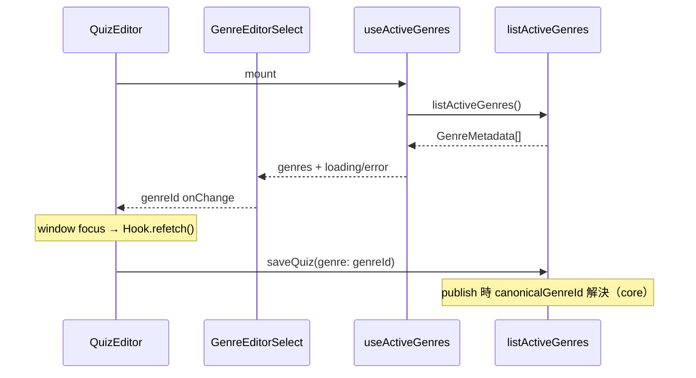
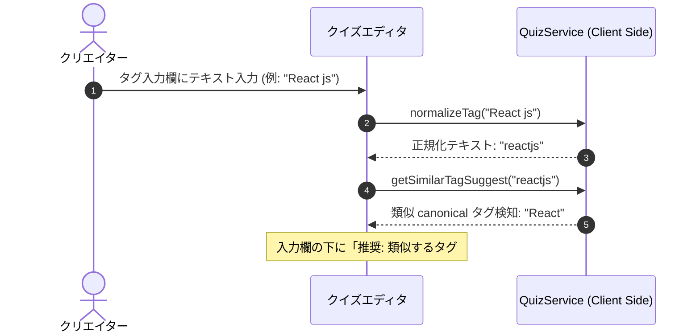

# Technical Design Document: quizeum-creator-dash-ui

## Overview
本ドキュメントは、クイズ投稿SNS「quizeum」におけるクリエイター（作家）向けUIの技術設計仕様を定義します。クイズの作成・下書き・編集機能、ドラッグ＆ドロップによるリストの作成・並べ替え、作家ダッシュボードにおけるアナリティクス可視化、間違い指摘フィードバックの管理、および自作クイズデータの一括パッケージエクスポートを構築します。

本システムは、Next.jsのApp RouterおよびReact、TypeScriptのフロントエンド構成に加え、CSS Modulesによる親しみやすく機能的なデザインシステムを実装し、Firestoreサービス（`QuizService`, `QuizListService`, `ReviewService`等）およびフロントエンド側Zodスキーマと接続します。

**Phase 6（2026-06）**: `QuizEditor` のジャンル `<select>` を `useActiveGenres` + `GenreEditorSelect` に置換。`quizeum-play-flow-ui` と同一の `listActiveGenres` フックを再利用する。

### Goals
- 設問の動的追加・削除、クイズタイプトグルを備えた直感的なクイズエディタの構築。
- タグ入力時におけるリアルタイム「自動名寄せ」正規化と類似 canonical タグのインラインサジェスト警告UI。
- Zodバリデーションを用いた、公開申請時における厳格なエラーインラインフィードバック。
- 作家ダッシュボードにおける累計数値アナリティクスおよび個別設問解答割合グラフ（円グラフ等）のビジュアル化。
- クローズド間違い指摘のキュー管理と該当問題の修正動線統合。
- クイズ一括エクスポートおよびリストパッケージエクスポートのクライアント側データダウンロード処理。
- クイズリスト作成における、スムーズなクイズ検索アタッチおよびドラッグ＆ドロップ順序並べ替えUI。

### Non-Goals
- クイズデータのJSONインポート機能（仕様変更により機能が完全に廃止されたため、インポートに関連するUIエリアは一切設置しません）。
- 管理者モデレーション画面および自治ガバナンスUI（`quizeum-moderation-governance-ui`が担当）。

---

## Boundary Commitments

### This Spec Owns
- **UIルーティング設計**: `/quiz/create`, `/quiz/[id]/edit`, `/creator/dashboard`, `/list/[id]`, `/list/create`, `/list/[id]/edit` の各ページコンポーネント。
- **クイズ・リスト編集ステート**: 動的な設問配列、ドラッグ＆ドロップアタッチ並び替えステートの管理。
- **フロントエンドバリデーション**: Zodを用いた公開前バリデーションと、警告サジェストUI。
- **エクスポートトリガー**: クイズ一括、リストパッケージのJSONダウンロード処理。
- **アナリティクス表示**: クリエイターダッシュボードのグラフ・ビジュアルパネル。

### Out of Boundary
- クイズリストやクイズのJSONインポート用ファイルのアップロード処理（インポート機能は廃止されたため、本UIは一切のインポート機能を包含しません）。

### Allowed Dependencies
- **`quizeum-auth-profile-ui`**: `Header`, `useAuth`
- **`quizeum-play-flow-ui`**: `/quiz/[id]` プレイ遷移
- **`quizeum-core`**: `QuizService`, `QuizListService`, `ReviewService`, **`listActiveGenres`（Phase 6）**
- **`quizeum-play-flow-ui`（共有）**: `useActiveGenres` フック（`src/hooks/useActiveGenres.ts`）

### Revalidation Triggers
- `QuizService.saveQuiz` または `QuizListService.createQuizList` のシリアライズ仕様変更。
- Zodによる公開バリデーションスキーマ (`quizPublishSchema`) の構成変更。

---

## Architecture

### Technology Stack
- **Frontend**: Next.js v16.2.6 (App Router), React v19.2.4, TypeScript
- **Styling**: Vanilla CSS (CSS Modules)
- **Drag-and-Drop**: HTML5 Drag and Drop API (ライブラリ依存を排除し、シンプルかつ確実な動作を実現)
- **Charts**: CSS-driven charts (シンプルな円グラフ・棒グラフのCSSコンポーネント)

---

## File Structure Plan

### Directory Structure
```
src/
├── app/
│   ├── creator/
│   │   └── dashboard/
│   │       ├── page.tsx           # 作家ダッシュボード画面 (2.1, 2.2, 2.3, 2.4, 2.5)
│   │       └── dashboard.module.css
│   ├── list/
│   │   ├── create/
│   │   │   ├── page.tsx           # リスト作成画面 (4.1, 4.2, 4.3)
│   │   │   └── edit.module.css
│   │   └── [id]/
│   │       ├── edit/
│   │       │   ├── page.tsx       # リスト編集画面 (4.1, 4.2, 4.3)
│   │       │   └── edit.module.css
│   │       ├── page.tsx           # クイズリスト詳細画面 (3.1, 3.2, 3.3)
│   │       └── list.module.css
│   └── quiz/
│       ├── create/
│       │   ├── page.tsx           # クイズ作成画面 (1.1, 1.2, 1.3, 1.4, 1.5, 1.6)
│       │   └── create.module.css
│       └── [id]/
│           └── edit/
│               ├── page.tsx       # クイズ編集画面 (1.1, 1.2, 1.3, 1.4, 1.5, 1.6)
│               └── edit.module.css
└── components/
    ├── charts/
    │   ├── analytics-chart.tsx    # 累計アナリティクス用グラフコンポーネント
    │   └── selection-pie.tsx      # 解答選択肢割合用パイチャートコンポーネント
    └── quiz/
        └── genre-editor-select.tsx  # マスタ駆動ジャンル select (5.x) 【Phase 6 新規】
hooks/
└── useActiveGenres.ts             # play-flow と共有（既存）
```

### Modified Files（Phase 6）
- `src/components/quiz/quiz-editor.tsx` — ハードコード `<option>` 削除、`GenreEditorSelect` 統合、フォーカス時 `refetch`。
- `src/components/quiz/genre-editor-select.tsx`（新規）— loading / error / orphan value 表示。

---

## System Flows

### エディタ・ジャンルマスタ取得フロー（Phase 6）


### タグ入力時のリアルタイム自動名寄せサジェストフロー


---

## Requirements Traceability

| Requirement | Summary | Components | Interfaces | Flows |
|-------------|---------|------------|------------|-------|
| 1.1 | メタデータフォーム（タグ制限・難易度等） | Quiz Editor | Form Input | - |
| 1.2 | 新ジャンル申請動線リンク | Quiz Editor | Navigation | - |
| 1.3 | タグ名寄せ・ canonical サジェスト警告UI | Quiz Editor | `QuizService` | タグサジェストフロー |
| 1.4 | 動的設問追加・削除・タイプ切替UI | Quiz Editor | Form State | - |
| 1.5 | 公開時Zod検証とエラーインライン表示 | Quiz Editor | Zod Schema | - |
| 1.6 | 下書き保存機能 | Quiz Editor | `QuizService.saveQuiz` | - |
| 2.1 | 累計アナリティクスビジュアルグラフ | Creator Dashboard | `AnalyticsChart` | - |
| 2.2 | 設問別解答選択割合パイチャート | Creator Dashboard | `SelectionPie` | - |
| 2.3 | クローズド指摘フィードバック一覧表示 | Creator Dashboard | Feedback Queue | - |
| 2.4 | 指摘「修正する」からのクイズ編集画面遷移 | Creator Dashboard | `useRouter` | - |
| 2.5 | クイズ一括エクスポートダウンロード処理 | Creator Dashboard | `QuizService.exportQuizzes` | - |
| 3.1 | リスト情報と収録クイズ一覧 | `/list/[id]` Page | List Detail | - |
| 3.2 | listId 連続プレイのトラッキング開始 | `/list/[id]` Page | `AttemptService` | - |
| 3.3 | リスト作成者本人の場合の「編集する」表示 | `/list/[id]` Page | State Guard | - |
| 4.1 | リストメタ情報とクイズ検索アタッチUI | List Editor | Search / Attach | - |
| 4.2 | HTML5 Drag and Dropによる順序並べ替えUI | List Editor | HTML5 D&D API | - |
| 4.3 | リストパッケージJSONエクスポート | List Editor | `QuizListService.exportQuizList` | - |
| 5.1 | マスタ駆動ジャンル select | `GenreEditorSelect` | `useActiveGenres` | エディタ・ジャンルフロー |
| 5.2 | ハードコード option 廃止 | `QuizEditor` | — | — |
| 5.3 | 申請動線リンク維持 | `QuizEditor` | `/community/genres` | — |
| 5.4 | フォーカス復帰時 refetch | `useActiveGenres` | `refetch` | エディタ・ジャンルフロー |
| 5.5 | レガシー genre 値の orphan 表示 | `GenreEditorSelect` | controlled value | — |
| 5.6 | 取得失敗時フォールバック禁止 | `GenreEditorSelect` | error UI | — |

---

## Components and Interfaces

### Component Summary Table

| Component | Domain/Layer | Intent | Req Coverage | Key Dependencies | Contracts |
|-----------|--------------|--------|--------------|------------------|-----------|
| `QuizEditor` | UI / Page | クイズの新規作成・編集、タグ警告、Zod検証 | 1.1–1.6, 5.1–5.7 | `QuizService`, `GenreEditorSelect` | FormState |
| `GenreEditorSelect` | UI / Component | マスタ駆動ジャンル `<select>` | 5.1–5.6 | `useActiveGenres` | Controlled |
| `CreatorDashboard` | UI / Page | 作家アナリティクス、指摘解決、クイズエクスポート | 2.1, 2.2, 2.3, 2.4, 2.5 | `ReviewService`, `QuizService` | State |
| `QuizListDetail` | UI / Page | クイズリストの閲覧、プレイ開始トラッキング | 3.1, 3.2, 3.3 | `QuizListService`, `useAuth` | State |
| `QuizListEditor` | UI / Page | リストの新規作成・編集、アタッチ、Drag&Drop、パッケージエクスポート | 4.1, 4.2, 4.3 | `QuizListService` | State |

---

## Error Handling

### Error Strategy
- **公開バリデーションエラー**:
  - タイトル未入力、問題が1つもない、正解が1つも選択されていないなどの状態のまま「公開」をクリックした場合、保存処理を完全にブロックし、画面上部に赤いボックスで「公開するには以下のエラーを修正してください：」とリスト表示して、問題のある箇所をスクロール表示します。
- **インポートの完全排除**:
  - インポート機能は仕様により廃止されたため、アップロードエラーのハンドリング自体を設計から完全に除外します。

---

## Testing Strategy

### Unit Tests
- **Zodスキーマバリデーション**:
  - `quizPublishSchema` に対し、問題なしのクイズデータ、正解がない設問を含むクイズデータ、設問がないクイズデータを流し込み、意図通りバリデーションがパス/失敗するかをテスト。

### Integration Tests
- **タグのリアルタイムサジェスト警告表示**:
  - エディタ上でタグ入力後、`getSimilarTagSuggest` のモックが canonical タグを検知した際に、警告UIがDOM上に表示されるかを統合テスト。

### E2E/UI Tests
- **HTML5 Drag and Dropによる並び替え**:
  - リスト編集画面で、収録クイズカードの並び替えハンドルをドラッグ＆ドロップした際に、データのインデックス順序が正しく入れ替わるかをテスト。
- **Phase 6 ジャンルセレクト**:
  - `data-testid="genre-editor-select"` がマスタ取得後に option を描画すること（ハードコード「programming」固定 option に依存しないこと）。
  - `/community/genres` リンクが維持されていること。
