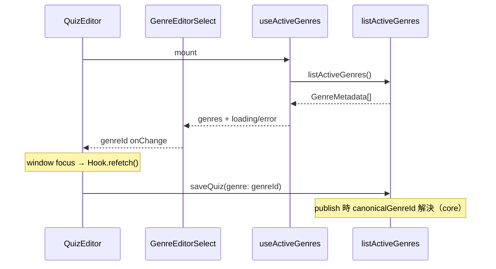
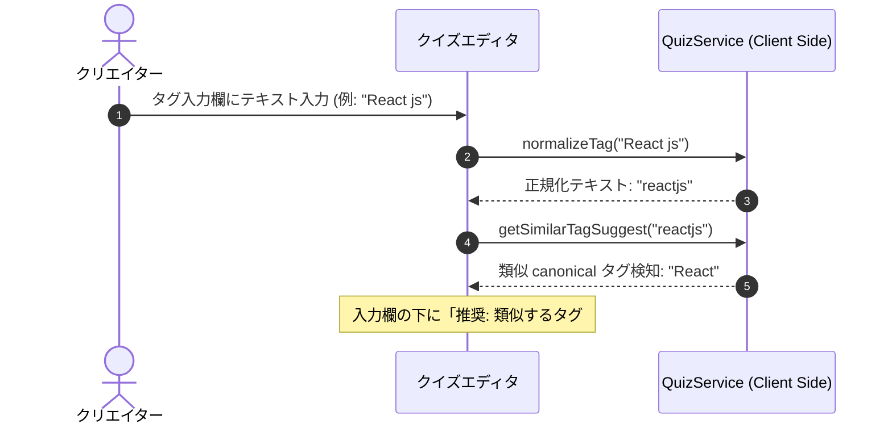
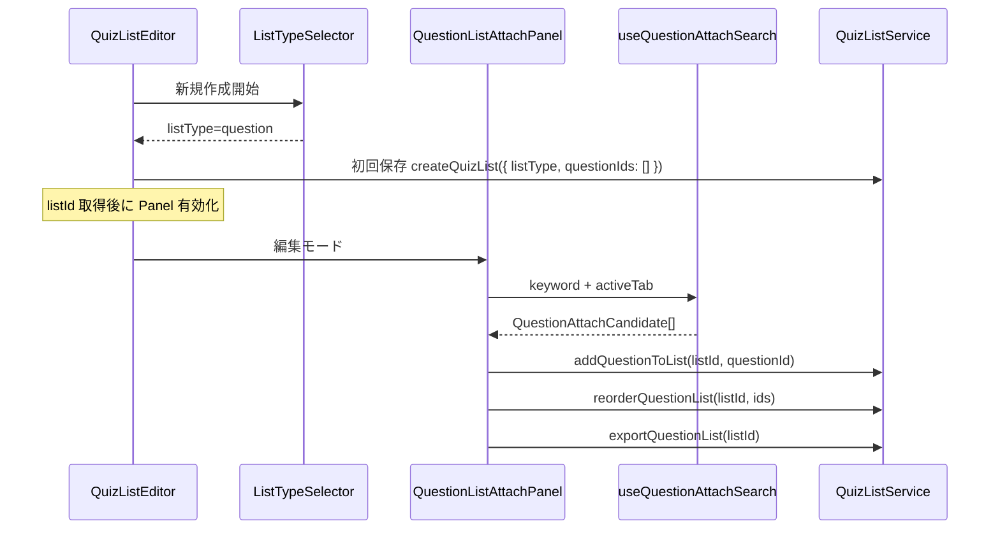
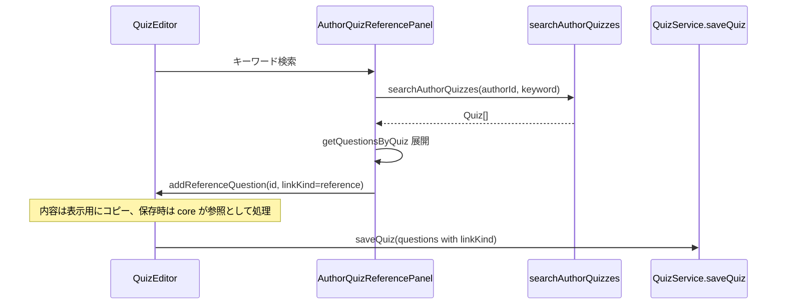

# Technical Design Document: quizeum-creator-dash-ui

## Overview
本ドキュメントは、クイズ投稿SNS「quizeum」におけるクリエイター（作家）向けUIの技術設計仕様を定義します。クイズの作成・下書き・編集機能、ドラッグ＆ドロップによるリストの作成・並べ替え、作家ダッシュボードにおけるアナリティクス可視化、間違い指摘フィードバックの管理、および自作クイズデータの一括パッケージエクスポートを構築します。

本システムは、Next.jsのApp RouterおよびReact、TypeScriptのフロントエンド構成に加え、CSS Modulesによる親しみやすく機能的なデザインシステムを実装し、Firestoreサービス（`QuizService`, `QuizListService`, `ReviewService`等）およびフロントエンド側Zodスキーマと接続します。

**Phase 6（2026-06）**: `QuizEditor` のジャンル `<select>` を `useActiveGenres` + `GenreEditorSelect` に置換。`quizeum-play-flow-ui` と同一の `listActiveGenres` フックを再利用する。

**Phase 8（2026-06）**: リスト作成時の `listType` 選択、設問リスト編集（3ソース設問検索・アタッチ・DnD・エクスポート）、クイズエディタの過去自作クイズ検索パネルと参照リンク追加 UI を追加する。永続化・検証・Copy-on-Write は `quizeum-core`（実装済み）に依存する。

### Goals
- 設問の動的追加・削除、クイズタイプトグルを備えた直感的なクイズエディタの構築。
- タグ入力時におけるリアルタイム「自動名寄せ」正規化と類似 canonical タグのインラインサジェスト警告UI。
- Zodバリデーションを用いた、公開申請時における厳格なエラーインラインフィードバック。
- 作家ダッシュボードにおける累計数値アナリティクスおよび個別設問解答割合グラフ（円グラフ等）のビジュアル化。
- クローズド間違い指摘のキュー管理と該当問題の修正動線統合。
- クイズ一括エクスポートおよびリストパッケージエクスポートのクライアント側データダウンロード処理。
- クイズリスト作成における、スムーズなクイズ検索アタッチおよびドラッグ＆ドロップ順序並べ替えUI。
- **Phase 8**: 新規リストの `listType` 必須選択、設問リストのアタッチ／並び替え／エクスポート、自作クイズからの参照リンク設問追加。

### Non-Goals
- クイズデータのJSONインポート機能（仕様変更により機能が完全に廃止されたため、インポートに関連するUIエリアは一切設置しません）。
- 管理者モデレーション画面および自治ガバナンスUI（`quizeum-moderation-governance-ui`が担当）。
- **Phase 8**: ブックマーク3タブ・設問リスト連続プレイ遷移（`quizeum-play-flow-ui`）。プロフィールのリストタイプ別タブ（`quizeum-auth-profile-ui`）。

---

## Boundary Commitments

### This Spec Owns
- **UIルーティング設計**: `/quiz/create`, `/quiz/[id]/edit`, `/creator/dashboard`, `/list/[id]`, `/list/create`, `/list/[id]/edit` の各ページコンポーネント。
- **クイズ・リスト編集ステート**: 動的な設問配列、ドラッグ＆ドロップアタッチ並び替えステートの管理。
- **フロントエンドバリデーション**: Zodを用いた公開前バリデーションと、警告サジェストUI。
- **エクスポートトリガー**: クイズ一括、リストパッケージのJSONダウンロード処理。
- **アナリティクス表示**: クリエイターダッシュボードのグラフ・ビジュアルパネル。
- **リストタイプ選択（Phase 8）**: 新規作成時の `quiz` / `question` 選択と作成後の読み取り専用表示。
- **設問リスト編集 UI（Phase 8）**: 設問検索（3ソース）、アタッチ一覧、DnD 並び替え、設問リスト JSON エクスポートトリガー。
- **参照リンク作問 UI（Phase 8）**: 自作クイズ検索パネル、参照設問のエディタ状態追加、視覚区別、CoW 保存前通知。

### Out of Boundary
- クイズリストやクイズのJSONインポート用ファイルのアップロード処理（インポート機能は廃止されたため、本UIは一切のインポート機能を包含しません）。
- **Phase 8**: リスト詳細の読み取り表示・連続プレイ開始（`quizeum-play-flow-ui` が実装済み。本スペックは編集導線と `listType` 作成時選択のみ）。
- **Phase 8**: `listType` 永続化検証、参照リンクの Firestore 書き込み、設問 doc の CoW 実行（`quizeum-core`）。

### Allowed Dependencies
- **`quizeum-auth-profile-ui`**: `Header`, `useAuth`
- **`quizeum-play-flow-ui`**: `/quiz/[id]` プレイ遷移
- **`quizeum-core`**: `QuizService`, `QuizListService`, `ReviewService`, **`listActiveGenres`（Phase 6）**, **`createQuizList`（`listType`）, `addQuestionToList`, `removeQuestionFromList`, `reorderQuestionList`, `exportQuestionList`, `getQuestionsInList`, `searchAuthorQuizzes`, `getQuestionsByQuiz`, `getBookmarkedQuestions`, `saveQuiz` 参照パス（Phase 8）**
- **`quizeum-play-flow-ui`（共有）**: `useActiveGenres` フック（`src/hooks/useActiveGenres.ts`）
- **`quizeum-core`（読み取り）**: `searchQuizzes` — 他者公開クイズ経由の設問候補探索（Phase 8・UI 集約のみ）

### Revalidation Triggers
- `QuizService.saveQuiz` または `QuizListService.createQuizList` のシリアライズ仕様変更。
- Zodによる公開バリデーションスキーマ (`quizPublishSchema`) の構成変更。
- **Phase 8**: `CreateQuizListInput.listType` 契約変更、`QuestionListExportPackage` 形状変更、`searchAuthorQuizzes` パラメータ追加、参照リンク `linkKind` セマンティクス変更。

---

## Architecture

### Technology Stack
- **Frontend**: Next.js v16.2.6 (App Router), React v19.2.4, TypeScript
- **Styling**: Vanilla CSS (CSS Modules)
- **Drag-and-Drop**: HTML5 Drag and Drop API (ライブラリ依存を排除し、シンプルかつ確実な動作を実現)
- **Charts**: CSS-driven charts (シンプルな円グラフ・棒グラフのCSSコンポーネント)

---

## File Structure Plan

### Directory Structure
```
src/
├── app/
│   ├── creator/
│   │   └── dashboard/
│   │       ├── page.tsx           # 作家ダッシュボード画面 (2.1, 2.2, 2.3, 2.4, 2.5)
│   │       └── dashboard.module.css
│   ├── list/
│   │   ├── create/
│   │   │   ├── page.tsx           # リスト作成画面 (4.1, 4.2, 4.3)
│   │   │   └── edit.module.css
│   │   └── [id]/
│   │       ├── edit/
│   │       │   ├── page.tsx       # リスト編集画面 (4.1, 4.2, 4.3)
│   │       │   └── edit.module.css
│   │       ├── page.tsx           # クイズリスト詳細画面 (3.1, 3.2, 3.3)
│   │       └── list.module.css
│   └── quiz/
│       ├── create/
│       │   ├── page.tsx           # クイズ作成画面 (1.1, 1.2, 1.3, 1.4, 1.5, 1.6)
│       │   └── create.module.css
│       └── [id]/
│           └── edit/
│               ├── page.tsx       # クイズ編集画面 (1.1, 1.2, 1.3, 1.4, 1.5, 1.6)
│               └── edit.module.css
└── components/
    ├── charts/
    │   ├── analytics-chart.tsx    # 累計アナリティクス用グラフコンポーネント
    │   └── selection-pie.tsx      # 解答選択肢割合用パイチャートコンポーネント
    ├── quiz/
    │   ├── genre-editor-select.tsx      # マスタ駆動ジャンル select (5.x)
    │   ├── author-quiz-reference-panel.tsx  # 過去自作クイズ検索 (7.x) 【Phase 8 新規】
    │   └── reference-question-badge.tsx     # 参照リンクバッジ (7.6)
    └── quiz-list/
        ├── quiz-list-editor.tsx           # リスト編集（listType 分岐）(4.x, 6.x)
        ├── list-type-selector.tsx         # 新規 listType 選択 (6.1)
        └── question-list-attach-panel.tsx # 設問検索・アタッチ・DnD (6.3–6.9)
hooks/
├── useActiveGenres.ts                 # play-flow と共有（既存）
├── useQuestionAttachSearch.ts         # 3ソース設問候補集約 (6.4)
└── useAuthorQuizReferenceSearch.ts    # 自作クイズ検索 (7.2)
lib/
└── question-attach-search.ts          # キーワードフィルタ純関数 (6.4)
```

### Modified Files（Phase 8）
- `src/components/quiz-list/quiz-list-editor.tsx` — 新規時 `ListTypeSelector`、編集時 `listType` 読み取り専用、`question` 分岐で `QuestionListAttachPanel`（**`listId` 取得後のみ有効**）、初回保存で `createQuizList({ listType, questionIds: [] })`。
- `src/components/quiz-list/list-type-selector.tsx`（新規）— `quiz` / `question` ラジオ、作成後は非表示。
- `src/components/quiz-list/question-list-attach-panel.tsx`（新規）— タブ検索（自作公開／ブックマーク／公開探索）、`addQuestionToList` / `removeQuestionFromList` / `reorderQuestionList` / `exportQuestionList`。
- `src/components/quiz/quiz-editor.tsx` — `AuthorQuizReferencePanel` 統合、参照設問の読み取り専用表示と CoW 警告ダイアログ。
- `src/components/quiz/author-quiz-reference-panel.tsx`（新規）— `searchAuthorQuizzes` + `getQuestionsByQuiz`、リンク追加は `linkKind: 'reference'` のみ。
- `src/hooks/useQuestionAttachSearch.ts`（新規）— 3ソースの非同期取得とクライアントキーワードフィルタ。
- `src/lib/question-attach-search.ts`（新規）— 設問候補の正規化・重複除去。

### Modified Files（Phase 6）
- `src/components/quiz/quiz-editor.tsx` — ハードコード `<option>` 削除、`GenreEditorSelect` 統合、フォーカス時 `refetch`。
- `src/components/quiz/genre-editor-select.tsx`（新規）— loading / error / orphan value 表示。

---

## System Flows

### エディタ・ジャンルマスタ取得フロー（Phase 6）


### タグ入力時のリアルタイム自動名寄せサジェストフロー


### 設問リスト作成・編集フロー（Phase 8）

**UX 方針（確定）**
- 新規作成のみ `listType` を選択。保存後は変更不可（コア `updateQuizList` が拒否）。
- `listType === 'question'` 時はクイズアタッチ UI を非表示。既存 HTML5 DnD パターンを設問行に再利用。
- **設問アタッチの前提（`listId` 必須）**: クイズリストは保存前にクライアント state でアタッチ可能だが、`addQuestionToList` は Firestore 上の `listId` が必要。設問リストは次の順序を固定する。
  1. メタ入力（タイトル等）+ `ListTypeSelector` で `listType` 選択
  2. **初回保存**で `createQuizList({ listType, questionIds: [] })` を実行し `listId` を取得
  3. 以降のみ `QuestionListAttachPanel` を有効化（未保存時は disabled +「先にリストを保存してください」案内）
- 設問検索は3タブ：
  - **自作公開** — `searchAuthorQuizzes` → `status === 'published'` で絞り込み → 各 `getQuestionsByQuiz` → 設問文・親タイトルでキーワードフィルタ
  - **ブックマーク** — `getBookmarkedQuestions` → 設問文・親タイトルでキーワードフィルタ
  - **公開探索** — `getLatestQuizzes(N)`（例: N=30）で公開クイズプールを取得 → 各 `getQuestionsByQuiz` で設問フラット化 → `authorId !== currentUser` かつ親 `status === 'published'` のみ残す → **設問文・親タイトル**でキーワードフィルタ（設問文のみ一致のケースをカバー）。`searchQuizzes` は任意の補助絞り込み（親タイトル／説明一致）に留め、正本の候補プール生成には使わない



### 参照リンク設問追加フロー（Phase 8）



---

## Requirements Traceability

| Requirement | Summary | Components | Interfaces | Flows |
|-------------|---------|------------|------------|-------|
| 1.1 | メタデータフォーム（タグ制限・難易度等） | Quiz Editor | Form Input | - |
| 1.2 | 新ジャンル申請動線リンク | Quiz Editor | Navigation | - |
| 1.3 | タグ名寄せ・ canonical サジェスト警告UI | Quiz Editor | `QuizService` | タグサジェストフロー |
| 1.4 | 動的設問追加・削除・タイプ切替UI | Quiz Editor | Form State | - |
| 1.5 | 公開時Zod検証とエラーインライン表示 | Quiz Editor | Zod Schema | - |
| 1.6 | 下書き保存機能 | Quiz Editor | `QuizService.saveQuiz` | - |
| 2.1 | 累計アナリティクスビジュアルグラフ | Creator Dashboard | `AnalyticsChart` | - |
| 2.2 | 設問別解答選択割合パイチャート | Creator Dashboard | `SelectionPie` | - |
| 2.3 | クローズド指摘フィードバック一覧表示 | Creator Dashboard | Feedback Queue | - |
| 2.4 | 指摘「修正する」からのクイズ編集画面遷移 | Creator Dashboard | `useRouter` | - |
| 2.5 | クイズ一括エクスポートダウンロード処理 | Creator Dashboard | `QuizService.exportQuizzes` | - |
| 3.1 | リスト情報と収録クイズ一覧 | `/list/[id]` Page | List Detail | - |
| 3.2 | listId 連続プレイのトラッキング開始 | `/list/[id]` Page | `AttemptService` | - |
| 3.3 | リスト作成者本人の場合の「編集する」表示 | `/list/[id]` Page | State Guard | - |
| 4.1 | リストメタ情報とクイズ検索アタッチUI | List Editor | Search / Attach | - |
| 4.2 | HTML5 Drag and Dropによる順序並べ替えUI | List Editor | HTML5 D&D API | - |
| 4.3 | リストパッケージJSONエクスポート | List Editor | `QuizListService.exportQuizList` | - |
| 5.1 | マスタ駆動ジャンル select | `GenreEditorSelect` | `useActiveGenres` | エディタ・ジャンルフロー |
| 5.2 | ハードコード option 廃止 | `QuizEditor` | — | — |
| 5.3 | 申請動線リンク維持 | `QuizEditor` | `/community/genres` | — |
| 5.4 | フォーカス復帰時 refetch | `useActiveGenres` | `refetch` | エディタ・ジャンルフロー |
| 5.5 | レガシー genre 値の orphan 表示 | `GenreEditorSelect` | controlled value | — |
| 5.6 | 取得失敗時フォールバック禁止 | `GenreEditorSelect` | error UI | — |
| 3.1 | リスト種別表示 | `QuizListDetail`（play-flow 実装） | `resolveListType` | Out of boundary（表示） |
| 3.2 | クイズリスト収録一覧 | `QuizListDetail` | `getQuizzesInList` | — |
| 3.3 | 設問リスト収録一覧 | `QuizListDetail` | `getQuestionsInList` | — |
| 3.4 | クイズリスト連続プレイ | `QuizListDetail` | `mode=list` | play-flow |
| 3.5 | 作成者の編集ボタン | `QuizListEditor` 導線 | `useAuth` | — |
| 6.1 | 新規 listType 必須選択 | `ListTypeSelector` | `createQuizList` | 設問リスト作成フロー |
| 6.2 | 作成後 listType 変更不可 | `QuizListEditor` | 読み取り専用 UI | — |
| 6.3 | question 時クイズパネル非表示 | `QuizListEditor` | 分岐 | — |
| 6.4 | 3ソース設問キーワード検索 | `QuestionListAttachPanel`, `useQuestionAttachSearch` | 複数 core API | 設問リスト作成フロー |
| 6.5 | addQuestionToList + 一覧表示 | `QuestionListAttachPanel` | `addQuestionToList` | — |
| 6.6 | 非公開親のエラー表示 | `QuestionListAttachPanel` | core 検証エラー | — |
| 6.7 | removeQuestionFromList | `QuestionListAttachPanel` | `removeQuestionFromList` | — |
| 6.8 | reorderQuestionList + DnD | `QuestionListAttachPanel` | HTML5 D&D | — |
| 6.9 | exportQuestionList | `QuizListEditor` | `exportQuestionList` | — |
| 6.10 | quiz 時は従来 UI 維持 | `QuizListEditor` | 既存クイズパネル | — |
| 7.1 | 折りたたみ参照パネル | `AuthorQuizReferencePanel` | — | 参照リンクフロー |
| 7.2 | searchAuthorQuizzes 一覧 | `useAuthorQuizReferenceSearch` | `searchAuthorQuizzes` | 参照リンクフロー |
| 7.3 | クイズ展開で設問選択 | `AuthorQuizReferencePanel` | `getQuestionsByQuiz` | — |
| 7.4 | linkKind=reference 追加 | `QuizEditor` | ローカル state | — |
| 7.5 | 非自作設問リンク不可 | `AuthorQuizReferencePanel` | 自作のみ UI | — |
| 7.6 | 参照バッジ表示 | `ReferenceQuestionBadge` | `isReferenceLinkQuestion` | — |
| 7.7 | 編集時 CoW 通知 | `QuizEditor` | 保存前ダイアログ | — |
| 7.8 | 削除は参照解除のみ | `QuizEditor` | ローカル除去 | — |
| 7.9 | saveQuiz へ参照 ID 送信 | `QuizEditor` | `QuizService.saveQuiz` | — |
| 7.10 | 永続化ロジックなし | 全 Phase 8 UI | core のみ | Out of boundary |

---

## Components and Interfaces

### Component Summary Table

| Component | Domain/Layer | Intent | Req Coverage | Key Dependencies | Contracts |
|-----------|--------------|--------|--------------|------------------|-----------|
| `QuizEditor` | UI / Page | クイズの新規作成・編集、タグ警告、Zod検証 | 1.1–1.6, 5.1–5.7 | `QuizService`, `GenreEditorSelect` | FormState |
| `GenreEditorSelect` | UI / Component | マスタ駆動ジャンル `<select>` | 5.1–5.6 | `useActiveGenres` | Controlled |
| `CreatorDashboard` | UI / Page | 作家アナリティクス、指摘解決、クイズエクスポート | 2.1, 2.2, 2.3, 2.4, 2.5 | `ReviewService`, `QuizService` | State |
| `QuizListDetail` | UI / Page | クイズリストの閲覧、プレイ開始トラッキング | 3.1, 3.2, 3.3 | `QuizListService`, `useAuth` | State |
| `QuizListEditor` | UI / Page | リストの新規作成・編集、listType 分岐、アタッチ、エクスポート | 4.1–4.3, 6.1–6.3, 6.10 | `QuizListService` | State |
| `ListTypeSelector` | UI / Component | 新規リストの `quiz` / `question` 選択 | 6.1, 6.2 | — | Controlled |
| `QuestionListAttachPanel` | UI / Component | 設問検索・アタッチ・DnD・解除 | 6.3–6.9 | `useQuestionAttachSearch`, question APIs | State |
| `useQuestionAttachSearch` | Hook | 3ソース候補の取得とキーワードフィルタ | 6.4 | core read APIs | State |
| `AuthorQuizReferencePanel` | UI / Component | 自作クイズ検索と参照リンク追加 | 7.1–7.5 | `searchAuthorQuizzes` | State |
| `ReferenceQuestionBadge` | UI / Component | 参照リンク設問の視覚区別 | 7.6 | `linkKind` | Presentational |
| `useAuthorQuizReferenceSearch` | Hook | キーワード・タグで自作クイズ検索 | 7.2 | `searchAuthorQuizzes` | State |

#### `ListTypeSelector`（Phase 8）

| Field | Detail |
|-------|--------|
| Intent | 新規リスト作成時に `quiz` または `question` を必須選択する |
| Requirements | 6.1, 6.2 |

**Contracts**: State [x]

```typescript
type ListTypeChoice = 'quiz' | 'question';

interface ListTypeSelectorProps {
  value: ListTypeChoice;
  onChange: (value: ListTypeChoice) => void;
  disabled?: boolean; // 編集モードでは true（表示のみ）
}
```

##### `data-testid`
| 要素 | test id |
|------|---------|
| ラッパー | `list-type-selector` |
| クイズリスト | `list-type-quiz` |
| 設問リスト | `list-type-question` |

#### `QuestionListAttachPanel`（Phase 8）

| Field | Detail |
|-------|--------|
| Intent | 設問リストの検索タブ、アタッチ一覧、DnD 並び替え、エクスポート連携 |
| Requirements | 6.3, 6.4, 6.5, 6.6, 6.7, 6.8, 6.9 |

**Responsibilities & Constraints**
- **`listId` ガード**: `listId` 未確定時は検索・アタッチ・DnD をすべて disabled。親 `QuizListEditor` が初回保存完了後に `listId` を渡す。
- 検索タブ: `own-published` | `bookmarked` | `public-explore`。キーワードはクライアント側で `questionText` / 親タイトルに部分一致（3タブ共通）。
- `own-published`: `searchAuthorQuizzes` 結果から `status === 'published'` のみ → `getQuestionsByQuiz` → キーワードフィルタ。
- `bookmarked`: `getBookmarkedQuestions` → キーワードフィルタ（親タイトルは `question.quizId` から解決済みメタを使用）。
- `public-explore`: `getLatestQuizzes(N)` でプール取得 → 設問フラット化 → 他者・公開のみ → **設問文・親タイトル**でキーワードフィルタ。UI に「探索は直近公開クイズの設問から検索します（全件保証なし）」注記を表示。デバウンス 300ms 推奨。
- アタッチ成功後は `getQuestionsInList` で一覧を再同期（または楽観的 append）。`addQuestionToList` 失敗時はコアメッセージをインライン表示。
- DnD 完了時に `reorderQuestionList(listId, newOrder)` を呼び出す。既存 `QuizListEditor` の HTML5 DnD ハンドラパターンを踏襲。

**Contracts**: State [x]

```typescript
interface QuestionAttachCandidate {
  questionId: string;
  questionText: string;
  parentQuizId: string;
  parentQuizTitle: string;
  source: 'own-published' | 'bookmarked' | 'public-explore';
}

interface QuestionListAttachPanelProps {
  listId: string;
  authorId: string;
  attached: QuestionInListEntry[];
  onAttachedChange: (entries: QuestionInListEntry[]) => void;
}
```

#### `AuthorQuizReferencePanel`（Phase 8）

| Field | Detail |
|-------|--------|
| Intent | 認証作成者が過去自作クイズから設問を参照リンクとしてエディタに追加 |
| Requirements | 7.1, 7.2, 7.3, 7.4, 7.5 |

**Responsibilities & Constraints**
- 折りたたみ `<details>` またはアコーディオン。未認証時は非表示。
- 検索結果は `searchAuthorQuizzes` のみ（他者クイズは UI に出さない → 7.5）。
- リンク追加時、エディタ state に `{ ...sourceQuestion, linkKind: 'reference' }` を追加。同一 `questionId` の二重追加は防止。
- 参照設問行は `ReferenceQuestionBadge` を表示する。

**Contracts**: State [x]

```typescript
interface AuthorQuizReferencePanelProps {
  authorId: string;
  onLinkQuestion: (question: Question) => void;
  linkedQuestionIds: Set<string>;
}
```

#### `QuizEditor` 参照リンク保存（Phase 8）

| Field | Detail |
|-------|--------|
| Intent | 参照設問の編集・削除・保存前 CoW 通知 |
| Requirements | 7.6, 7.7, 7.8, 7.9, 7.10 |

**参照設問の表示・編集状態機械（確定）**

| 状態 | UI | 遷移 |
|------|-----|------|
| `reference-readonly`（デフォルト） | 全フィールド `readOnly`。`ReferenceQuestionBadge` 表示。削除ボタンのみ有効（7.8: エディタ上の参照解除のみ） | 「内容を編集（コピーに切り離し）」クリック |
| `reference-detaching` | 7.7 通知を表示（モーダルまたは設問行上部のインライン）:「保存時に独自コピーとして切り離されます」 | ユーザーが編集を続行 |
| `reference-owned-draft` | 通常設問と同様に編集可能。`linkKind` はローカルで `'owned'` に遷移（保存前の UI 状態） | `saveQuiz` 成功で core が CoW 処理 |

**Implementation Notes**
- 参照行では設問タイプ切替・新規追加と同列のインライン編集は**デフォルト無効**。CoW 意図が明示された後のみ通常フォームへ。
- Zod 公開検証は `reference-readonly` 行をスキップ（参照先の正解定義を信頼）。`reference-owned-draft` 行は通常設問として検証。
- 下書き保存／公開保存は既存 `saveQuiz` 呼び出しのまま。`linkKind: 'reference'` と元 `id` を payload に含める（7.9）。
- エディタから参照を外す操作はローカル配列から除去するのみ（7.8）。`questions` コレクションの削除は行わない（7.10）。

---

## Error Handling

### Error Strategy
- **公開バリデーションエラー**:
  - タイトル未入力、問題が1つもない、正解が1つも選択されていないなどの状態のまま「公開」をクリックした場合、保存処理を完全にブロックし、画面上部に赤いボックスで「公開するには以下のエラーを修正してください：」とリスト表示して、問題のある箇所をスクロール表示します。
- **インポートの完全排除**:
  - インポート機能は仕様により廃止されたため、アップロードエラーのハンドリング自体を設計から完全に除外します。
- **設問リストアタッチ失敗（Phase 8）**:
  - `addQuestionToList` が非公開親等で失敗した場合、トーストまたはインラインエラーでコアメッセージを表示し、一覧は変更しない。
- **参照リンク保存失敗（Phase 8）**:
  - `saveQuiz` が `ReferenceLinkForbiddenError` 等で失敗した場合、公開をブロックしエラーリストに追加する。

---

## Testing Strategy

### Unit Tests
- **Zodスキーマバリデーション**:
  - `quizPublishSchema` に対し、問題なしのクイズデータ、正解がない設問を含むクイズデータ、設問がないクイズデータを流し込み、意図通りバリデーションがパス/失敗するかをテスト。

### Integration Tests
- **タグのリアルタイムサジェスト警告表示**:
  - エディタ上でタグ入力後、`getSimilarTagSuggest` のモックが canonical タグを検知した際に、警告UIがDOM上に表示されるかを統合テスト。

### E2E/UI Tests
- **HTML5 Drag and Dropによる並び替え**:
  - リスト編集画面で、収録クイズカードの並び替えハンドルをドラッグ＆ドロップした際に、データのインデックス順序が正しく入れ替わるかをテスト。
- **Phase 6 ジャンルセレクト**:
  - `data-testid="genre-editor-select"` がマスタ取得後に option を描画すること（ハードコード「programming」固定 option に依存しないこと）。
  - `/community/genres` リンクが維持されていること。
- **Phase 8 リストタイプ・設問リスト**:
  - 新規作成で `[data-testid="list-type-question"]` 選択後、保存されたリストが `listType: 'question'` で作成されること。
  - 設問アタッチ後に DnD で順序変更し、再読み込み後も順序が保持されること。
- **Phase 8 参照リンク**:
  - 自作クイズ検索から設問をリンク追加すると、エディタに「参照リンク」バッジが表示されること。
  - 参照設問の内容編集後に保存すると、CoW 通知が表示されること（モーダルまたはインライン）。

### Unit Tests（Phase 8）
- **`question-attach-search.ts`**:
  - 3ソース候補のマージで `questionId` 重複が除去されること。キーワード部分一致が期待どおりフィルタされること。
- **`filterAuthorQuizzes` 連携**:
  - `useAuthorQuizReferenceSearch` がキーワードを `searchAuthorQuizzes` に渡すこと（モック検証）。
