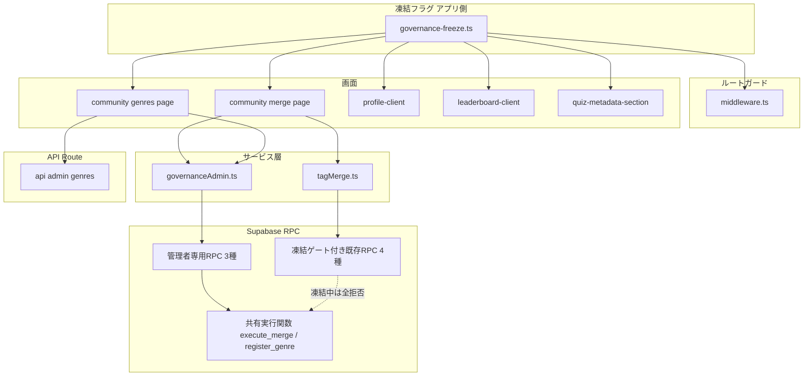
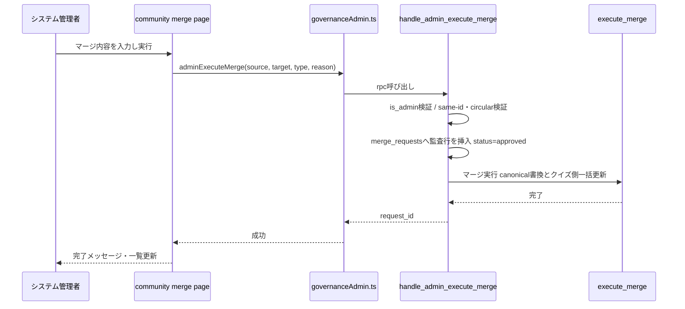
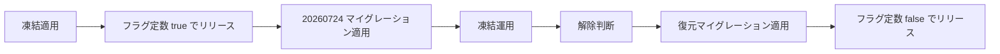

# Technical Design: quizeum-governance-freeze

## Overview

**Purpose**: 本フィーチャーは、コミュニティ主導のガバナンス（タグ/ジャンルのマージ提案・加重投票、ジャンル新設申請・投票）を運営判断で一時凍結する仕組みを Quizetika に導入する。凍結中はシステム管理者（`role === 'admin'`）のみがガバナンス操作を単独判断で即時実行できる。

**Users**: 運営者（凍結の有効化・解除）、システム管理者（凍結中のマージ・ジャンル登録の即時実行と保留案件の処理）、一般ユーザー・モデレーター（凍結中はガバナンス画面・バッジ表示が不可視になる）。

**Impact**: 既存のコミュニティガバナンス（quizeum-moderation-governance-ui / supabase-governance が実装）に対する一時的オーバーレイ。UI ガード・RPC 認可・表示制御を凍結フラグで切り替え、既存データとコードは温存する。あわせて、既存 RPC の認可欠落（`is_not_banned()` のみで誰でも直接呼び出せる脆弱性）をサーバーサイドで閉塞する。

### Goals
- 単一のアプリ側フラグでガバナンス凍結の UI/導線/ガードを一元制御する（1.1）
- 凍結中のガバナンス操作をサーバーサイド（RPC）レベルで管理者限定に強制する（5.1〜5.3）
- 管理者が投票を経ずにマージ・ジャンル登録を即時実行し、保留中案件を単独処理できる経路を提供する（3.1〜3.4, 4.1〜4.3）
- ティアバッジ・レピュテーションスコア・スコアランキングの公開表示を停止する（6.1〜6.3）
- フラグ復元 + 復元マイグレーションのみで凍結前の運用へ復帰できる可逆性を保証する（1.3, 1.4）

### Non-Goals
- 「獲得した称号バッジ」表示の変更（6.4 により表示継続）
- レピュテーションスコア蓄積ロジックの停止（1.5 により継続）
- moderationTier 制度・データモデルの廃止・変更
- `/admin/moderation`・NGワード管理等の既存管理者機能の変更
- `/api/admin/genres`（ジャンル直接管理 API）の仕様変更（そのまま再利用する）
- コミュニティ投票データ（`merge_requests` / `genre_requests` / 各投票テーブル）の削除・スキーマ変更

## Boundary Commitments

### This Spec Owns
- 凍結フラグモジュール（`src/lib/governance-freeze.ts`）とその参照規約
- 凍結中の `/community/merge`・`/community/genres` のガード条件（middleware + ページ内）と管理者向け UI（即時実行フォーム・保留案件の承認/却下・凍結中バナー）
- ガバナンス RPC 4種への凍結ゲート追加と、管理者専用 RPC（即時マージ・保留マージ処理・保留ジャンル処理）の新設マイグレーション
- マージ/ジャンル登録実行ロジックの共有 SQL 関数への抽出（投票可決経路と管理者経路の結果整合を担保）
- プロフィール・リーダーボード・エディタ導線における凍結時の表示制御
- 凍結解除手順（フラグ復元 + RPC 復元マイグレーション）の定義

### Out of Boundary
- 通報・審査フロー（`handle_flag_content` / `handle_resolve_flag` / `/admin/moderation`）
- レピュテーション計算（`services/reputation.ts`）・ティア昇格ロジック
- `POST /api/admin/genres` の内部実装（既存のまま呼び出すのみ）
- 認証・Cookie 同期基盤（`syncMiddlewareAuthCookies` / `isAdminUser` は既存のまま利用）
- 称号バッジ（`profileUser.badges`）の取得・表示

### Allowed Dependencies
- DB ヘルパー `is_admin()` / `is_moderator_or_admin()` / `is_not_banned()`（supabase-governance 提供、変更せず利用）
- `src/lib/middleware-auth-cookies.ts` の `isAdminUser()` と Cookie `quizetika_role`
- `src/services/tagMerge.ts` の RPC ラッパーパターン（同パターンで管理者用ラッパーを追加）
- `POST /api/admin/genres` とその Bearer トークン認可パターン（`authorizeAdmin`）
- 依存方向: `lib/governance-freeze` → （middleware / services / UI コンポーネント）。逆方向の import は禁止。UI から DB への書き込みは必ず services 層の RPC ラッパーまたは admin API 経由

### Revalidation Triggers
- ガバナンス RPC 4種のシグネチャ・例外メッセージ契約の変更（`tagMerge.ts` のエラーマッピングに影響）
- `quizetika_role` Cookie の意味変更や admin 判定軸の変更（middleware ガードに影響）
- `merge_requests` / `genre_requests` テーブルのスキーマ変更（管理者処理 RPC・一覧 UI に影響）
- 凍結解除時: 本スペックが定義する復元マイグレーションの適用（依存スペックの原仕様へ復帰することの再検証が必要）

## Architecture

### Existing Architecture Analysis
- ルート保護は `src/middleware.ts` の Cookie ベース判定（`quizetika_uid` / `quizetika_tier` / `quizetika_role`）+ ページ内 `useAuth` ガードの二重防御が確立している
- ガバナンス書き込みは SECURITY DEFINER RPC に集約されているが、現行の認可は `is_not_banned()` のみ（moderator 制限は UI/middleware 層だけ）。本設計はこの欠落を凍結ゲートで閉塞する
- 管理者 API Route は Bearer トークン + `isAdminUser()` の `authorizeAdmin` パターン、管理者 RPC は `IF NOT is_admin() THEN RAISE EXCEPTION 'forbidden'` パターンが確立済み。新設 RPC は後者に従う
- フラグ判定モジュールは `src/lib/posthog-enabled.ts`（純粋関数 + 単体テスト）が先例

### Architecture Pattern & Boundary Map



**Architecture Integration**:
- Selected pattern: フラグによる条件分岐オーバーレイ（ギャップ分析 Option C ハイブリッド）。既存導線を in-place 拡張し、管理者専用の実行経路のみ新設する
- Domain boundaries: 表示制御はアプリ側フラグ、実効的な認可は DB 側凍結ゲート。真実の所在はレイヤーごとに1つ（下記 Key Decisions）
- Existing patterns preserved: 二重ガード（middleware + ページ内）、RPC ラッパーの例外メッセージマッピング、`is_admin()` RPC ガード
- New components rationale: 管理者の即時実行は既存投票 RPC の可決分岐と責務が異なるため、専用 RPC に分離して可決ロジックの複雑化を回避する

**Key Decisions**:
1. **凍結状態の真実の所在**: アプリ層は `src/lib/governance-freeze.ts` の `isGovernanceFrozen()`（コード内定数を返す純粋関数）を唯一の参照点とする。DB 層はマイグレーションで凍結を焼き込む（設定テーブルは新設しない）。理由: 新テーブル + RLS + シードの追加コストを回避し、既存の `is_admin()` ガードパターンに揃える。凍結は週単位以上の運用を想定し、解除時の1マイグレーション適用は許容コストと判断（検討経緯は research.md 設計判断 D1）
2. **凍結中は既存 RPC 4種を全ユーザーに対して拒否**（管理者含む）: 管理者は専用 RPC / admin API を使うため既存経路は不要。管理者が投票経路を使えると投票集計による自動可決（5.2 違反）が起こりうるため、無条件拒否が最も安全
3. **凍結解除時の復元先は `is_moderator_or_admin()` ガード付き**: 現行 RPC の認可欠落（誰でも直接呼び出し可能）へ戻すのではなく、本来の設計意図であるモデレーター限定へ修正して復元する。復元マイグレーションの内容は本設計の Migration Strategy に定義する
4. **管理者専用 RPC は凍結解除後も残置**: `is_admin()` ガード付きであり凍結状態と独立して無害。解除後は管理者の任意ツールとして機能する

### Technology Stack

| Layer | Choice / Version | Role in Feature | Notes |
|-------|------------------|-----------------|-------|
| Frontend | Next.js App Router（既存） | ガード・条件レンダリング・管理者操作UI | 新規依存なし |
| Backend | Next.js middleware（Edge） + 既存 admin API Route | ルートガード / ジャンル直接登録 | `governance-freeze.ts` は Edge 互換の純粋 TS |
| Data | Supabase PostgreSQL（既存） | 凍結ゲート・管理者 RPC・実行ロジック抽出 | 新規マイグレーション1本 |
| Testing | Jest + Playwright（既存） | フラグモックによる両状態テスト | `jest.mock('@/lib/governance-freeze')` |

## File Structure Plan

### Directory Structure（新規作成）
```
src/
├── lib/
│   └── governance-freeze.ts          # 凍結フラグの唯一の定義（isGovernanceFrozen()）
├── services/
│   └── governanceAdmin.ts            # 管理者専用RPC 3種のラッパー（tagMerge.tsパターン踏襲）
supabase/
└── migrations/
    └── 20260724000000_governance_freeze.sql
        # (1) execute_merge / register_genre_from_request の共有関数抽出
        # (2) 既存RPC 4種の凍結ゲート（governance-frozen例外）+ 可決分岐の共有関数化
        # (3) 管理者専用RPC 3種の新設
tests/
├── lib/governance-freeze.test.ts     # フラグモジュール単体
└── services/governanceAdmin.test.ts  # ラッパーのRPC呼び出し・エラーマッピング
```

### Modified Files
- `src/middleware.ts` — 凍結時、`/community/merge`・`/community/genres` を `quizetika_role === 'admin'` 限定に切替（2.1, 2.2）
- `src/app/community/merge/page.tsx` — 凍結時: admin ページ内ガード、凍結中バナー、投票UIを「即時実行フォーム + 保留提案の承認/却下リスト」へ切替（2.2, 2.4, 3.1, 3.4）
- `src/app/community/genres/page.tsx` — 凍結時: admin ページ内ガード、凍結中バナー、申請/投票UIを「即時登録フォーム + 保留申請の承認/却下リスト」へ切替（2.2, 2.4, 4.1, 4.2）
- `src/services/tagMerge.ts` — `governance-frozen` 例外のエラーメッセージマッピング追加（5.3）
- `src/app/profile/[uid]/profile-client.tsx` — 凍結時、ティアバッジ（L276-279）とレピュテーションスコア（L292）を非レンダリング（6.1, 6.2）
- `src/app/leaderboard/page.tsx` / `src/app/leaderboard/leaderboard-client.tsx` — 凍結時、「スコア」タブを除去し初期タブをプレイ数へ（6.3）
- `src/components/quiz/editor/quiz-metadata-section.tsx` — 凍結時かつ非管理者のとき `/community/genres` リンクを非表示（2.3）
- `tests/services/tagMerge.test.ts` / `tagMerge-thresholds.test.ts` — 凍結ゲート追加後の期待値調整
- `tests/components/profile-client.test.tsx` — バッジ・スコア非表示の検証追加
- `tests/lib/leaderboard-*.test.ts` / `tests/components/quiz-dual-leaderboard.test.tsx` 等 — スコアタブ除去の影響があれば追随

## System Flows

### 凍結中の管理者即時マージ（新規提案と保留案件処理）



- 保留案件の処理は `handle_admin_resolve_merge_request(p_request_id, p_decision)` が同じ `execute_merge` を呼ぶ（approve 時）か status を rejected に更新する（reject 時）
- 非管理者が RPC を直接呼んだ場合、`is_admin()` 検証で `forbidden` 例外となりデータは変更されない（5.1, 5.3）
- 凍結ゲート済みの既存 RPC 4種はすべて `governance-frozen` 例外を送出し、投票集計自体が発生しない（5.2）

## Requirements Traceability

| Requirement | Summary | Components | Interfaces | Flows |
|-------------|---------|------------|------------|-------|
| 1.1 | 単一設定による凍結制御 | GovernanceFreezeFlag | `isGovernanceFrozen()` | - |
| 1.2 | 凍結時挙動の一括適用 | 全コンポーネント | 同上 | - |
| 1.3 | 解除時の挙動復元 | Migration Strategy（復元手順） | 復元マイグレーション | Migration |
| 1.4 | 既存データの不変性 | FreezeMigration | DDLのみ・DML禁止 | - |
| 1.5 | スコア蓄積の継続 | （変更なし: reputation.ts に触れない） | - | - |
| 2.1 | 非管理者に404 | RouteGuard, CommunityMergePage, CommunityGenresPage | Cookie `quizetika_role` | - |
| 2.2 | 管理者はアクセス可 | RouteGuard, CommunityMergePage, CommunityGenresPage | 同上 | - |
| 2.3 | 導線非表示 | EditorGenreLink | `isGovernanceFrozen()` + `isAdminUser()` | - |
| 2.4 | 凍結中バナー | CommunityMergePage, CommunityGenresPage | - | - |
| 3.1 | 即時マージ実行 | AdminMergeRPC, GovernanceAdminService | `handle_admin_execute_merge` | Sequence図 |
| 3.2 | 可決時と同等の結果整合 | SharedExecutionFunctions | `execute_merge` | Sequence図 |
| 3.3 | 実行不能時のエラー | AdminMergeRPC, GovernanceAdminService | 例外マッピング | - |
| 3.4 | 保留提案の承認/却下 | AdminMergeRPC, CommunityMergePage | `handle_admin_resolve_merge_request` | Sequence図 |
| 4.1 | 即時ジャンル登録 | CommunityGenresPage → 既存 admin genres API | `POST /api/admin/genres` | - |
| 4.2 | 保留申請の承認/却下 | AdminGenreRPC, CommunityGenresPage | `handle_admin_resolve_genre_request` | - |
| 4.3 | 登録不能時のエラー | AdminGenreRPC, 既存 admin genres API | 例外マッピング / 409 | - |
| 5.1 | 非管理者要求のサーバー拒否 | FreezeMigration, AdminRPC 群 | `governance-frozen` / `forbidden` 例外 | Sequence図 |
| 5.2 | 投票集計可決の停止 | FreezeMigration | 既存RPC 4種の無条件拒否 | - |
| 5.3 | 拒否応答とデータ不変 | TagMergeService, GovernanceAdminService | エラーメッセージマッピング | - |
| 6.1 | ティアバッジ非表示 | ProfileClient | `isGovernanceFrozen()` | - |
| 6.2 | スコア非表示 | ProfileClient | 同上 | - |
| 6.3 | スコアランキング非表示 | LeaderboardPage | 同上 | - |
| 6.4 | 称号バッジ表示継続 | ProfileClient（変更しない領域） | - | - |
| 6.5 | 解除時の表示復元 | GovernanceFreezeFlag（フラグOFFで全表示が復元） | - | - |

## Components and Interfaces

| Component | Domain/Layer | Intent | Req Coverage | Key Dependencies | Contracts |
|-----------|--------------|--------|--------------|------------------|-----------|
| GovernanceFreezeFlag | lib | 凍結状態の唯一のアプリ側定義 | 1.1, 1.2, 6.5 | なし | Service |
| FreezeMigration | DB | 既存RPC凍結ゲート + 実行関数抽出 + 管理者RPC新設 | 1.4, 3.1〜3.4, 4.2, 4.3, 5.1, 5.2 | is_admin (P0) | Service（SQL） |
| GovernanceAdminService | services | 管理者RPCラッパーとエラーマッピング | 3.1, 3.3, 3.4, 4.2, 5.3 | Supabase client (P0) | Service |
| RouteGuard | middleware | 凍結時のadmin限定ルートガード | 2.1, 2.2 | GovernanceFreezeFlag (P0), Cookie (P0) | Service |
| CommunityMergePage | UI | 凍結時の管理者マージ操作画面 | 2.2, 2.4, 3.1, 3.3, 3.4 | GovernanceAdminService (P0) | State |
| CommunityGenresPage | UI | 凍結時の管理者ジャンル操作画面 | 2.2, 2.4, 4.1, 4.2, 4.3 | GovernanceAdminService (P0), admin genres API (P0) | State |
| ProfileClient | UI | ティアバッジ・スコアの条件非表示 | 6.1, 6.2, 6.4 | GovernanceFreezeFlag (P0) | - |
| LeaderboardPage | UI | スコアタブの条件除去 | 6.3 | GovernanceFreezeFlag (P0) | - |
| EditorGenreLink | UI | ジャンル申請導線の条件非表示 | 2.3 | GovernanceFreezeFlag (P0), isAdminUser (P1) | - |
| TagMergeService | services | 凍結例外のエラーメッセージ追加 | 5.3 | 既存 | Service |

### lib

#### GovernanceFreezeFlag

| Field | Detail |
|-------|--------|
| Intent | 凍結状態のアプリ側の唯一の参照点。Edge/クライアント/サーバー全レイヤーから import 可能な純粋関数 |
| Requirements | 1.1, 1.2, 6.5 |

**Responsibilities & Constraints**
- コード内定数 `COMMUNITY_GOVERNANCE_FROZEN`（boolean リテラル）を関数経由で公開する。関数化はテストでの `jest.mock` 差し替えを可能にするため
- 外部依存ゼロ（環境変数・DB・React に依存しない）。middleware（Edge Runtime）から import されるため副作用禁止
- 凍結解除時はこの定数を `false` に変更する1行編集のみ（6.5: フラグ OFF で全表示制御が自動的に復元される）

**Contracts**: Service [x]

##### Service Interface
```typescript
/** コミュニティガバナンス凍結フラグ（凍結解除時はこの定数のみ変更する） */
export const COMMUNITY_GOVERNANCE_FROZEN: boolean;

/** 凍結中なら true。UI・middleware・サービス層はこの関数のみを参照する */
export function isGovernanceFrozen(): boolean;
```
- Preconditions: なし
- Postconditions: 同一ビルド内で常に同じ値を返す（純粋関数）
- Invariants: この値と DB 側凍結状態（マイグレーション適用状況）は運用手順（Migration Strategy）で同期させる

### DB（マイグレーション: `20260724000000_governance_freeze.sql`）

#### FreezeMigration

| Field | Detail |
|-------|--------|
| Intent | 実行ロジックの共有関数抽出、既存RPC 4種の凍結ゲート、管理者専用RPC 3種の新設を1マイグレーションで行う |
| Requirements | 1.4, 3.1, 3.2, 3.3, 3.4, 4.2, 4.3, 5.1, 5.2 |

**Responsibilities & Constraints**
- **DDL（CREATE OR REPLACE FUNCTION）のみで構成し、既存データへの DML を含まない**（1.4）
- 共有実行関数は既存の可決分岐（`handle_vote_merge_request` L307-324 / `handle_vote_genre_request` L403-407 相当）のロジックを移設したものであり、動作を変更しない（3.2）
- 全関数 SECURITY DEFINER。管理者 RPC は既存 BAN 系 RPC と同じ `IF NOT is_admin() THEN RAISE EXCEPTION 'forbidden'` パターン

**Contracts**: Service [x]（SQL 関数契約）

##### Service Interface（SQL）
```sql
-- (1) 共有実行関数（内部用・可決処理の移設。引数はNULL不可を検証）
--     マージ実行: canonical書換 + merged_ids追記 + quiz_tags付替/quizzes.genre一括更新
execute_merge(p_target_type TEXT, p_source_id TEXT, p_target_id TEXT) RETURNS VOID
--     ジャンル登録: metadata_genresへINSERT（ID重複はunique violationで失敗）
register_genre(p_genre_id TEXT, p_display_name TEXT, p_description TEXT, p_icon_image_url TEXT) RETURNS VOID

-- (2) 既存RPC 4種の凍結ゲート（先頭で無条件に RAISE EXCEPTION 'governance-frozen'）
--     handle_create_merge_request / handle_vote_merge_request
--     handle_submit_genre_request / handle_vote_genre_request
--     ※投票集計コードは残置されるが到達不能となり、可決処理は発生しない（5.2）

-- (3) 管理者専用RPC（is_admin()必須、失敗時 'forbidden'）
--     新規マージ即時実行: same-id/circular検証 → merge_requestsへ監査行(status='approved')挿入 → execute_merge
handle_admin_execute_merge(p_target_type TEXT, p_source_id TEXT, p_target_id TEXT, p_reason TEXT) RETURNS UUID
--     保留マージ処理: FOR UPDATEでpending検証 → approve時execute_merge+status更新 / reject時status='rejected'
handle_admin_resolve_merge_request(p_request_id UUID, p_decision TEXT) RETURNS VOID
--     保留ジャンル処理: FOR UPDATEでpending検証 → approve時register_genre+status更新 / reject時status='rejected'
handle_admin_resolve_genre_request(p_request_id UUID, p_decision TEXT) RETURNS VOID
```
- Preconditions: 管理者 RPC は `auth.uid()` が `is_admin()` を満たすこと。resolve 系は対象行が `status='pending'`
- Postconditions: approve 時は可決経路と同一の結果整合（3.2）。例外時はトランザクションロールバックによりデータ不変（3.3, 4.3, 5.3）
- Invariants: 例外メッセージ契約 — `'forbidden'` / `'governance-frozen'` / `'same-id'` / `'circular-merge'` / `'request-not-found'` / `'already-resolved'`、ジャンルID重複は SQLSTATE 23505

**Implementation Notes**
- Integration: `handle_admin_execute_merge` の same-id / circular 検証は既存 `handle_create_merge_request` の検証ロジックを踏襲する
- Validation: ローカル Supabase でマイグレーション適用後、可決経路（凍結前の動作）相当の結果を管理者 RPC が再現することを検証する
- Risks: 実行ロジック移設時の挙動差分が最大のリグレッションリスク。既存 `tests/services/tagMerge-thresholds.test.ts` の検証観点を SQL レベルで踏襲する

### services

#### GovernanceAdminService（`src/services/governanceAdmin.ts`）

| Field | Detail |
|-------|--------|
| Intent | 管理者専用 RPC 3種の型付きラッパーと例外→日本語メッセージのマッピング |
| Requirements | 3.1, 3.3, 3.4, 4.2, 5.3 |

**Contracts**: Service [x]

##### Service Interface
```typescript
export type MergeTargetType = 'tag' | 'genre';
export type AdminDecision = 'approve' | 'reject';

/** 管理者による新規マージの即時実行。戻り値は監査用 merge_requests の id */
export function adminExecuteMerge(
  sourceId: string, targetId: string, targetType: MergeTargetType, reason: string
): Promise<string>;

/** 保留中マージ提案の承認（即時実行）/却下 */
export function adminResolveMergeRequest(requestId: string, decision: AdminDecision): Promise<void>;

/** 保留中ジャンル申請の承認（即時登録）/却下 */
export function adminResolveGenreRequest(requestId: string, decision: AdminDecision): Promise<void>;
```
- Preconditions: 呼び出し元は認証済み管理者（RPC 側で強制されるため型上の保証は不要）
- Postconditions: 失敗時は例外メッセージ契約（`forbidden`→権限なし、`same-id`/`circular-merge`/`request-not-found`/`already-resolved`/23505→それぞれ操作可能な日本語メッセージ）に従い `Error` を throw
- Invariants: `tagMerge.ts` と同じエラーマッピング様式（`error.message` / `error.code` の分岐）

#### TagMergeService（既存 `src/services/tagMerge.ts` の変更）
Summary-only: 既存4関数のエラーマッピングに `'governance-frozen'` → 「コミュニティガバナンスは現在凍結中です。」を追加する（5.3）。シグネチャ変更なし。

### middleware / UI

#### RouteGuard（既存 `src/middleware.ts` の変更）

| Field | Detail |
|-------|--------|
| Intent | 凍結時、`/community/merge`・`/community/genres` の両方を `quizetika_role === 'admin'` 限定へ切替 |
| Requirements | 2.1, 2.2 |

**Responsibilities & Constraints**
- `isGovernanceFrozen()` が true のとき、両パスとも「`uid` あり かつ `quizetika_role === 'admin'`」以外は `/not-found` へ 307 リダイレクト（既存の 404 演出と同一）（2.1）
- false のときは現行ガード（merge: moderator 以上 / genres: 認証済み）を維持（1.3）
- 未認証ユーザーも凍結中は login リダイレクトではなく `/not-found`（ページの存在自体を秘匿）

**Implementation Notes**
- Integration: 既存の `createRedirectResponse` ヘルパーを再利用。ページ内ガード（`useAuth` + `isAdminUser`）との二重防御を維持
- Risks: Cookie は改竄可能なため、middleware ガードは UX 目的。実効的な認可は RPC / admin API 側（5.1）

#### CommunityMergePage / CommunityGenresPage（既存2ページの変更）
Summary-only（新しい境界を導入しない UI 変更）:
- 凍結時のページ内ガードを `isAdminUser(user)` に切替、非管理者は `/not-found` へ（2.1, 2.2）
- ヘッダー直下に凍結中バナー（例:「⚠️ コミュニティガバナンスは一時凍結中です。操作はシステム管理者の単独判断で即時実行されます」）を常時表示（2.4）
- merge: 投票 UI（賛成/反対ボタン・重み表示・賛成率バー）を「承認（即時実行）/却下」ボタンへ置換。起案フォームは `adminExecuteMerge` を呼ぶ即時実行フォームへ（3.1, 3.4）
- genres: 申請フォームを既存 `POST /api/admin/genres` 呼び出しの即時登録フォームへ（アイコンアップロードは既存の一時アップロード → `moveTemporaryGenreIcon` フローを踏襲）、投票 UI を「承認/却下」（`adminResolveGenreRequest`）へ置換（4.1, 4.2）。API の 409/400 応答はエラーメッセージとして表示（4.3）
- 非凍結時のコードパス（投票 UI）は温存し、`isGovernanceFrozen()` の分岐で切り替える（1.3）

#### ProfileClient / LeaderboardPage / EditorGenreLink（既存3箇所の変更）
Summary-only:
- ProfileClient: `isGovernanceFrozen()` のとき、ティアバッジ（`resolveModerationTierDisplay` 由来の `UiBadge`）とレピュテーションスコア行をレンダリングしない（6.1, 6.2）。「獲得した称号バッジ」セクション（`profileUser.badges`）には一切触れない（6.4）
- LeaderboardPage: 凍結時は「スコア」タブを `TabsTrigger` ごと除去し、初期タブ・サーバー側初期データ取得をプレイ数基準へ切替。プレイ数・作成数タブは無変更（6.3）
- EditorGenreLink（`quiz-metadata-section.tsx`）: 凍結時かつ非管理者のとき `/community/genres` リンクを非表示（2.3）

## Error Handling

### Error Strategy
RPC 例外メッセージを契約として扱い、サービス層で日本語メッセージへマッピングする既存様式を踏襲する。トランザクション境界は各 RPC（失敗時全ロールバック）で、部分適用は発生しない。

### Error Categories and Responses
- **User Errors**: 非管理者のページアクセス → 404（2.1）。非管理者の直接 RPC 呼び出し → `governance-frozen`（既存4種）/ `forbidden`（管理者RPC）→ 「操作が受け付けられない」旨を表示、データ不変（5.1, 5.3）
- **Business Logic Errors**: `same-id` / `circular-merge` / `already-resolved` / `request-not-found` / ジャンルID重複（23505 / admin API 409）→ 理由を示すフィールドレベルのエラーメッセージ（3.3, 4.3）
- **System Errors**: RPC/API の予期しない失敗 → 汎用エラーメッセージ + `console.error`（既存ページの様式）

## Testing Strategy

### Unit Tests
1. `governance-freeze.test.ts`: `isGovernanceFrozen()` が定数を返すこと（フラグモジュールの契約固定）
2. `governanceAdmin.test.ts`: 3ラッパーが正しい RPC 名・引数で呼び出すこと、`forbidden`/`same-id`/`circular-merge`/`already-resolved`/23505 の各例外が対応する日本語メッセージに変換されること（3.3, 4.3, 5.3）
3. `tagMerge.test.ts`（更新）: `governance-frozen` 例外が凍結中メッセージへ変換されること（5.3）
4. `profile-client.test.tsx`（更新）: フラグモックON時にティアバッジ・スコアが非表示、称号バッジは表示されること（6.1, 6.2, 6.4）
5. leaderboard 関連（更新）: フラグON時にスコアタブが存在せず初期タブがプレイ数であること（6.3）

### Integration Tests
1. ローカル Supabase でマイグレーション適用後、非管理者ロールで既存 RPC 4種を呼び `governance-frozen` で拒否され、対象テーブルが不変であること（5.1, 5.2, 5.3）
2. 管理者で `handle_admin_execute_merge` を実行し、凍結前の可決経路と同一のタグ/ジャンル・クイズ側書き換え結果になること（3.1, 3.2）
3. 管理者で pending 提案/申請を approve/reject し、status 遷移と実行/登録結果を検証（3.4, 4.2）。二重処理は `already-resolved` で拒否されること

### E2E Tests（Playwright）
1. モデレーターで `/community/merge` にアクセス → 404 表示（2.1）
2. 管理者で `/community/merge` にアクセス → 凍結バナーと承認/却下 UI が表示され、即時マージが完走する（2.2, 2.4, 3.1）
3. 一般ユーザーでプロフィール閲覧 → ティアバッジ・スコアが表示されず称号バッジのみ表示（6.1, 6.2, 6.4）

### フラグ両状態のテスト方針
アプリ側は `jest.mock('@/lib/governance-freeze')` で両状態を単体テストする。DB 側の非凍結時動作は既存テスト資産が担保済みのため、凍結状態のみ統合テストを追加する（E2E は凍結状態＝本番予定状態のみを対象とする）。

## Security Considerations
- **多層防御**: middleware（Cookie・UX目的）→ ページ内ガード（useAuth）→ RPC `is_admin()` / admin API `authorizeAdmin`（実効的認可）。Cookie 改竄では RPC 層を突破できない（5.1）
- **既存脆弱性の閉塞**: 現行ガバナンス RPC の認可欠落（認証済みなら誰でも起案・投票可能）を凍結ゲートが閉じる。凍結解除時も `is_moderator_or_admin()` 付きで復元し、認可なし状態には戻さない（Migration Strategy 参照）
- **監査可能性**: 管理者の即時マージも `merge_requests` へ監査行を残す（requester_id = 管理者 UID、status = 'approved'）

## Migration Strategy



- **凍結適用**: アプリリリース（フラグ true）と `20260724000000_governance_freeze.sql` 適用。順序は任意（フラグ先行なら UI が先に閉じ、マイグレーション先行なら投票が先に拒否される。どちらも安全側）
- **凍結解除（1.3）**: 復元マイグレーション（本スペックのリポジトリに `docs` またはコメントとして雛形を残す）で既存 RPC 4種を「先頭に `IF NOT is_moderator_or_admin() THEN RAISE EXCEPTION 'forbidden'`（genres 申請は `is_not_banned()` のみ）+ 共有実行関数呼び出し」の形で再定義し、フラグ定数を false へ変更してリリース。管理者専用 RPC は残置
- **ロールバック**: 凍結適用後に問題が出た場合、フラグ false へ戻すだけで UI は復旧するが、RPC は拒否のまま（安全側に倒れる）。完全復旧は復元マイグレーション適用
- **検証チェックポイント**: 適用直後にモデレーターアカウントで投票 RPC が `governance-frozen` になること、管理者の即時実行が成功することをステージングで確認
