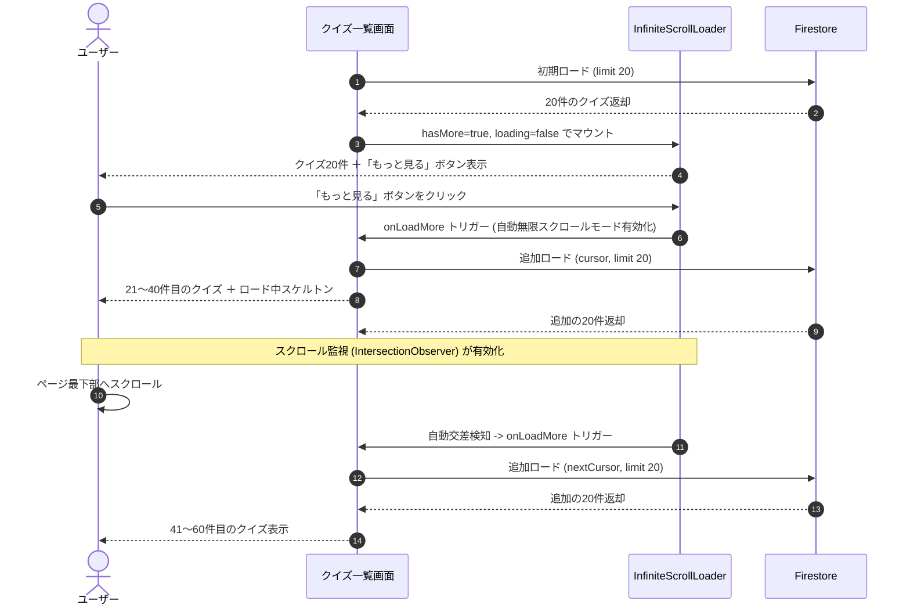

# Design Document: quizetika-infinite-scroll

## Overview
本機能は、クイズの一覧表示（検索画面、プロフィール画面の作成したクイズ）において、ページング処理による無駄なデータストア読み取りを削減しつつ、優れたスクロール体験を提供します。初期表示では「もっと見る」ボタンのみを表示し、クリックされてから自動的に追加クイズが読み込まれる無限スクロールモードにシームレスに切り替わる「ハイブリッド無限スクロール」方式を導入します。また、無料会員（`showAds === true`）に対しては、一覧に追加取得された後もクイズ10件ごとに Google AdSense 広告が必ず1件インライン挿入され続ける挙動を保証します。

### Goals
- 検索画面とプロフィール画面で統一された「もっと見る」ボタン ＋ 自動無限スクロールのUX（ハイブリッド無限スクロール）。
- プロフィール画面のクイズ取得を20件ずつのデータストアのカーソルを用いた段階取得に移行し、読み取りリクエスト数を最適化。
- 追加ロード時も、クイズ10件ごとに AdSense インライン広告がずれたり重複したりせずに自動挿入されること。

### Non-Goals
- カルーセル表示のみであるトップ画面（`/`）への無限スクロールの適用。
- 問題プール連続プレイ用 `/my-quiz` の問題一覧表示テーブルに対する無限スクロールの適用。
- 有料会員/無料会員のプラン判定ロジック自体の変更。

---

## Boundary Commitments

### This Spec Owns
- 共通 UI/UX 制御コンポーネント `InfiniteScrollLoader` のインターフェースおよびライフサイクルステート管理。
- プロフィール画面の「作成したクイズ」用段階的データ取得コンポーネント `ProfileQuizzesPanel` の定義。
- データストアから作者のクイズをカーソルで段階取得する `getQuizzesByAuthorPage` 関数（`quizetika-core`）。
- カーソルエンコード・デコード層 (`src/lib/quiz-feed-cursor.ts`) での `'author'` カーソル種類の解釈。
- 追加フェッチ時の、クイズ10件ごとの広告自動インライン挿入の順序計算。

### Out of Boundary
- トップ画面（`/`）のカルーセルの右上リンクやレイアウト変更。
- 問題プール連続プレイ用 `/my-quiz` の問題一覧テーブルの無限スクロール化。
- 有料会員/無料会員のプラン判定ロジックの管理（既存の `useAds` / 有料会員判定を利用）。

### Allowed Dependencies
- 既存の `useIntersectionLoadMore` フック（スクロール交差監視）。
- 既存の `useAds` フック（有料プラン判定）。
- 既存の `AdsenseInlineAd` コンポーネントおよび `QuizCard` コンポーネント。

### Revalidation Triggers
- `PaginatedQuizResult` および `QuizFeedCursorPayload` の型定義変更。
- `getQuizzesByAuthorPage` のシグネチャ変更。

---

## Architecture

### Existing Architecture Analysis
- 検索画面はすでに `useExploreQuizFeed` フックおよび `useIntersectionLoadMore` を使って、初期から自動で無限スクロールしています。
- プロフィール画面は `profile-client.tsx` 内で `getQuizzesByAuthor` を使って一括で全クイズをフェッチし、メモリ上で9件ずつ切り分けてボタンクリックでページネーションしています。
- 広告挿入は、検索画面の `displayQuizzes.reduce` によって10件ごとに `<AdsenseInlineAd>` を挿入しています。

### Technology Stack
本機能が影響を与えるレイヤーは以下です。

| Layer              | Choice / Version      | Role in Feature                                                | Notes                                        |
| ------------------ | --------------------- | -------------------------------------------------------------- | -------------------------------------------- |
| Frontend / CLI     | React 19 / Next.js 16 | ハイブリッド無限スクロール UI / プロフィール一覧コンポーネント | TailwindCSS ユーティリティ、CSS Modules 共用 |
| Backend / Services | Next.js API Routes    | -                                                              | 既存の API 設計に従う                        |
| Data / Storage     | Firestore SDK         | `getQuizzesByAuthorPage` でのカーソルクエリ                    | `startAfter`, `limit`, `orderBy` 使用        |

---

## File Structure Plan

### Directory Structure
```
src/
├── services/
│   └── quiz.ts            # getQuizzesByAuthorPage の実装を追加
├── lib/
│   └── quiz-feed-cursor.ts # TabKind に 'author' を追加、エンコード拡張
├── hooks/
│   └── useExploreQuizFeed.ts # 検索用フィードの limit 20 デフォルト化確認
└── components/
    ├── ui/
    │   └── infinite-scroll-loader.tsx # [NEW] 共通ハイブリッド無限スクロール UI
    └── profile/
        └── profile-quizzes-panel.tsx  # [NEW] プロフィール用のクイズ段階取得パネル
```

### Modified Files
- `src/services/quiz.ts` — `getQuizzesByAuthorPage` 関数の追加。
- `src/lib/quiz-feed-cursor.ts` — `QuizFeedTabKind` に `'author'` を追加し、`createdAt` 順のカーソルに対応させるための `orderFieldForTabKind` などの修正。
- `src/app/search/search-client.tsx` — 従来の自動ロード監視 `loadMoreSentinelRef` の直置きを廃止し、共通の `InfiniteScrollLoader` コンポーネントに差し替える。
- `src/app/profile/[uid]/profile-client.tsx` — 既存の一括ロード、クライアントページング処理を廃止し、新設する `ProfileQuizzesPanel` を配置する。

---

## System Flows

### ハイブリッド無限スクロールのロード遷移



---

## Requirements Traceability

| Requirement | Summary                                    | Components                                        | Interfaces                  | Flows                   |
| ----------- | ------------------------------------------ | ------------------------------------------------- | --------------------------- | ----------------------- |
| 1.1         | 初期表示20件 ＋ もっと見るボタン表示       | `SearchClient`, `InfiniteScrollLoader`            | `InfiniteScrollLoaderProps` | -                       |
| 1.2         | もっと見るクリックで自動ロード開始         | `SearchClient`, `InfiniteScrollLoader`            | `InfiniteScrollLoaderProps` | ロード遷移ステップ 5-8  |
| 1.3         | 有効化後のスクロールでの自動ロード         | `SearchClient`, `InfiniteScrollLoader`            | `InfiniteScrollLoaderProps` | ロード遷移ステップ 9-12 |
| 1.4         | 全件読み込み完了時のボタン非表示化         | `InfiniteScrollLoader`                            | `InfiniteScrollLoaderProps` | -                       |
| 1.5         | ロード中のプレースホルダー表示             | `InfiniteScrollLoader`, `GridSkeleton`            | -                           | -                       |
| 2.1         | プロフィール初期20件表示 ＋ もっと見る     | `ProfileQuizzesPanel`, `InfiniteScrollLoader`     | `ProfileQuizzesPanelProps`  | -                       |
| 2.2         | プロフィールもっと見るクリック時のロード   | `ProfileQuizzesPanel`, `getQuizzesByAuthorPage`   | `getQuizzesByAuthorPage`    | -                       |
| 2.3         | プロフィール有効化後の自動追加ロード       | `ProfileQuizzesPanel`, `getQuizzesByAuthorPage`   | `getQuizzesByAuthorPage`    | -                       |
| 2.4         | プロフィール検索語入力時の一括切り替え     | `ProfileQuizzesPanel`                             | -                           | -                       |
| 2.5         | プロフィール本人の際の下書き・非公開ロード | `ProfileQuizzesPanel`, `getQuizzesByAuthorPage`   | `getQuizzesByAuthorPage`    | -                       |
| 3.1         | 無料会員向け10件ごとの広告自動挿入         | `QuizCard` グリッドレンダリング (Search, Profile) | -                           | -                       |
| 3.2         | 有料会員向け広告非表示                     | `useAds`, `QuizCard` グリッドレンダリング         | -                           | -                       |
| 3.3         | 追加ロード後の広告再計算                   | `QuizCard` グリッドレンダリング (Search, Profile) | -                           | -                       |

---

## Components and Interfaces

### UI / Component Layer

#### InfiniteScrollLoader
| Field        | Detail                                                                                                            |
| ------------ | ----------------------------------------------------------------------------------------------------------------- |
| Intent       | 最初は「もっと見る」ボタンを表示し、クリックされたら自動無限スクロールモードに切り替えスクロール監視を行う共通 UI |
| Requirements | 1.1, 1.2, 1.3, 1.4, 1.5, 2.1, 2.2, 2.3                                                                            |
| Dependencies | `useIntersectionLoadMore` (Criticality: P0), `Button` (Criticality: P1), `GridSkeleton` (Criticality: P1)         |
| Contracts    | State                                                                                                             |

##### State Management
- `isInfinite`: boolean — 「もっと見る」ボタンがクリックされ、自動無限スクロールモードが有効になったかを保持します。
- 監視手法: 内部で `useIntersectionLoadMore` を呼び出し、監視対象センチネル（`h-px` の `div`）を末尾にレンダリングします。`enabled` 条件に `hasMore && !loading && isInfinite` を指定します。

##### Props Interface
```typescript
interface InfiniteScrollLoaderProps {
  hasMore: boolean;
  loading: boolean;
  onLoadMore: () => void;
  testIdPrefix?: string; // テスト時のデータ属性プレフィックス (例: "search", "profile")
}
```

#### ProfileQuizzesPanel
| Field        | Detail                                                                                                                  |
| ------------ | ----------------------------------------------------------------------------------------------------------------------- |
| Intent       | プロフィール画面におけるクイズ一覧表示と、検索入力有無に応じた段階フェッチ/一括ロード切り替え、広告挿入を管理するパネル |
| Requirements | 2.1, 2.2, 2.3, 2.4, 2.5, 3.1, 3.2, 3.3                                                                                  |
| Dependencies | `getQuizzesByAuthorPage` (P0), `getQuizzesByAuthor` (P0), `InfiniteScrollLoader` (P0), `QuizCard` (P0), `useAds` (P0)   |
| Contracts    | State, Service                                                                                                          |

##### State Management
- `quizzes`: Quiz[] — 表示対象のクイズ配列。
- `loading`: boolean — 読み込み中フラグ。
- `loadingMore`: boolean — スクロール追加読み込み中フラグ。
- `nextCursor`: string | null — Firestore段階ロードの続きを示すカーソル。
- `hasMore`: boolean — 追加データが存在するかどうか。
- `allQuizzesForSearch`: Quiz[] | null — 検索入力時のクライアントフィルタ用の一括キャッシュ配列。

##### Props Interface
```typescript
interface ProfileQuizzesPanelProps {
  authorId: string;
  isMyProfile: boolean;
}
```

##### 内部実装仕様
* **検索語未入力（空）の時**:
  * 初期ロード: `getQuizzesByAuthorPage(authorId, { limit: 20, includeUnpublished: isMyProfile })` を実行。結果を `quizzes` に設定し、`nextCursor` を保持する。
  * 追加ロード: `getQuizzesByAuthorPage` に `nextCursor` を渡して追加分を取得し、`quizzes` 配列へマージする。
* **検索語入力（1文字以上）の時**:
  * 入力されたタイミングで `allQuizzesForSearch` が `null` の場合は、`getQuizzesByAuthor(authorId, isMyProfile)` を呼び出し、その作者の全クイズ（または十分な上限数）を一括フェッチして `allQuizzesForSearch` にキャッシュします。
  * 以降は `allQuizzesForSearch` に対してクライアントサイドで検索語フィルタリングをかけ、合致した分の中から 20件ずつをスライスして表示します（追加ロード時はメモリ上の offset を進めます）。
* **広告の挿入**:
  * 無料会員（`showAds === true`）の時、描画時に `quizzes.reduce` で 10件ごとに `<AdsenseInlineAd adSlot="inline-profile-slot" />` を挟んでグリッド表示します。追加ロードが走って `quizzes` 配列が拡張された場合、広告位置も自動的に10件ごとに再構築されます。

---

### Data / Services Layer

#### getQuizzesByAuthorPage
| Field        | Detail                                                                            |
| ------------ | --------------------------------------------------------------------------------- |
| Intent       | 作者IDを指定し、Firestoreから段階的（limit 20）にクイズ一覧を取得するサービス関数 |
| Requirements | 2.1, 2.2, 2.3, 2.5                                                                |
| Dependencies | Firebase Firestore SDK (Criticality: P0)                                          |
| Contracts    | Service                                                                           |

##### Service Interface
```typescript
interface AuthorQuizPageOptions {
  limit?: number;
  cursor?: string | null;
  includeUnpublished?: boolean;
}

export async function getQuizzesByAuthorPage(
  authorId: string,
  options?: AuthorQuizPageOptions
): Promise<PaginatedQuizResult>;
```
- Preconditions: `authorId` は空でない文字列であること。
- Postconditions: `createdAt` 降順でソートされ、指定された `limit` 件数（デフォルト20）のクイズデータと、次ページがある場合はカーソル文字列を返却する。
- Invariants: `includeUnpublished` が `false` の場合は `status == 'published'` かつ `visibility == 'public'` のクイズのみを返す。本人の場合は下書きを含む全ステータスを対象とする。

---

## Data Models

### クイズカーソル型定義の拡張
`src/lib/quiz-feed-cursor.ts` の `QuizFeedTabKind` 型定義に `'author'` を追加します。

```typescript
export type QuizFeedTabKind = 'latest' | 'popular' | 'trending' | 'timeline' | 'author';
```

また、`orderFieldForTabKind` 関数において、`kind === 'author'` の場合は `'createdAt'` を返すように定義を揃えます。

```typescript
function orderFieldForTabKind(kind: QuizFeedTabKind): QuizFeedOrderField {
  if (kind === 'popular') return 'playCount';
  if (kind === 'trending') return 'bookmarksCount';
  return 'createdAt'; // latest, timeline, author は createdAt 順
}
```

---

## Error Handling
* **ロード失敗エラー**: `InfiniteScrollLoader` でのデータ追加フェッチ時にネットワークエラーや Firebase の権限エラーが発生した場合、ロード中スケルトンを非表示にし、一覧の最下部に「読み込みに失敗しました。再試行」というエラー表示とボタンをレンダリングします。
* **カーソル破損エラー**: デコードに失敗したカーソルが検知された場合、`QuizFeedCursorError` をスローし、安全に `nextCursor` を `null` に設定してそれ以上の自動読み込みを停止します。

---

## Testing Strategy

### ユニットテスト (Unit Tests)
- `tests/lib/quiz-feed-cursor.test.ts`:
  - `'author'` 種別のカーソルが、正しい `quizId` および `createdAt` ソートキーをエンコード・デコードできることを検証する。

### 結合テスト (Integration Tests)
- `tests/components/profile-quizzes-panel.test.tsx`:
  - `ProfileQuizzesPanel` コンポーネントが初期マウント時に `getQuizzesByAuthorPage` を呼び出し、20件のクイズをロードできることの検証。
  - 検索入力時に、一括取得 API に切り替わり、クライアントフィルタが正常に動作することの検証。
  - 無料プラン時と有料プラン時で、クイズ一覧への広告ユニット（`AdsenseInlineAd`）の表示/非表示が正しく切り替わることの検証。

### E2Eテスト (UI / Playwright Tests)
- `e2e/infinite-scroll.spec.ts`:
  - 検索画面に遷移した際、初期表示が20件で「もっと見る」ボタンが存在することを確認する。
  - 「もっと見る」ボタンをクリックすると追加の20件がロードされ、以降スクロールするだけで自動追加ロードがトリガーされることを確認する。
  - プロフィール画面（作成したクイズ）でも同様のハイブリッドスクロール動作を行い、無料会員状態で10件ごとに「PR」インライン広告枠が正しく挿入されることを確認する。
