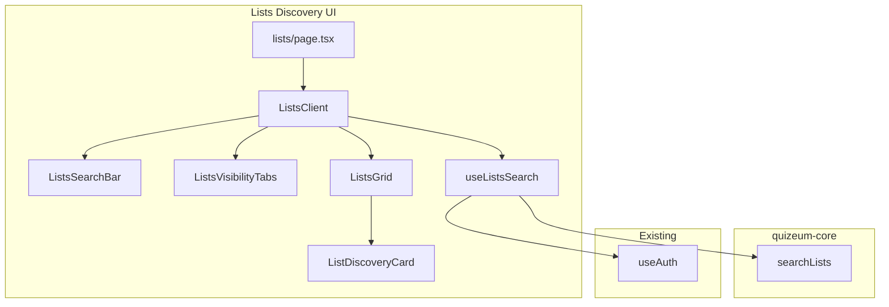
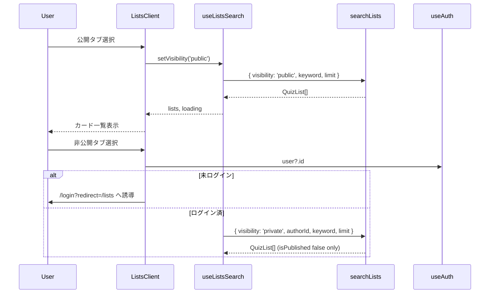
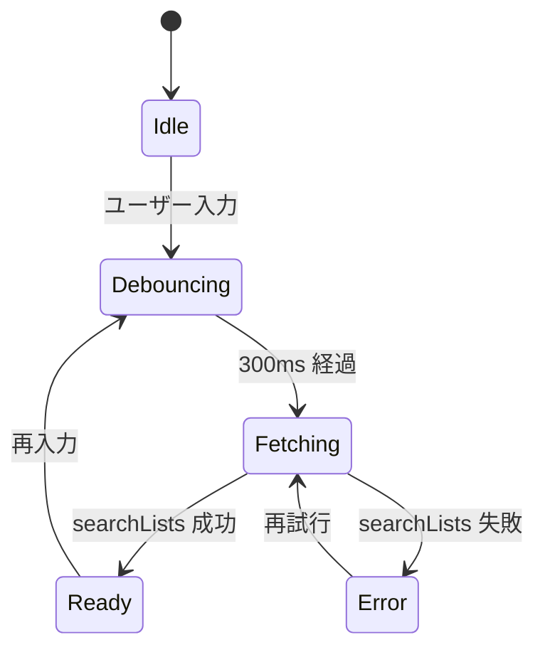

# Design Document: quizeum-lists-discovery-ui

> **⚠ OBSOLETE（Phase 26 / 2026-06-10）**: 本スペックは **obsolete（廃止）** です。理由: Phase 26 リスト機能完全廃止。Phase 23 で実装完了していた `/lists` 探索 UI は削除対象となり、以下の設計は **履歴参照のみ** とします。実装・削除の正本は `quizeum-core` Phase 26 および `quizeum-play-flow-ui` Phase 26。

## Overview
本機能は Quizeum に **グローバルなリスト探索画面**（`/lists`）を新設し、キーワード検索と公開/非公開タブ切り替えにより、ユーザーがクイズリスト・問題リストを発見し `/list/[id]` 詳細へ遷移できる導線を提供する。

**Phase 23（2026-06-09）**: リスト探索は Sidebar 優先の Phase 23 ナビ拡張の一部。ページ本体は本スペックが所有し、Sidebar/BottomNav への「リスト」リンクは `quizeum-sidebar-layout` が `/lists` ルート確定後に追加する。

### Goals
- `/lists` ルートとクライアントページ `ListsClient` を新設する
- 公開リスト（`isPublished === true`）と本人非公開リスト（`isPublished === false`）をタブで切り替える
- デバウンス付きキーワード検索でタイトル/説明を絞り込む
- リスト種別バッジ付きカード一覧から `/list/[id]` へ遷移できる
- Core `searchLists` API を唯一のデータ取得入口とする

### Non-Goals
- リスト CRUD・編集 UI（既存 `/list/create`, `/list/[id]/edit`）
- Sidebar / BottomNav メニュー項目の追加（`quizeum-sidebar-layout`）
- ソート・ページング UI（初版 limit 固定）
- 他人の非公開リスト表示

---

## Boundary Commitments

### This Spec Owns
- `/lists` App Router ルート（`page.tsx` + クライアントコンポーネント）
- リスト探索専用 UI コンポーネント（検索バー、公開/非公開タブ、カードグリッド、空状態、スケルトン）
- `useListsSearch` フック（タブ状態・キーワード・`searchLists` 呼び出し）
- 本ページ向け CSS Modules
- Jest コンポーネントテストおよび Playwright E2E（`/lists` 直接アクセス）

### Out of Boundary
- `searchLists` の Firestore クエリ実装（`quizeum-core` / `src/services/quiz-list.ts`）
- Sidebar・BottomNav への「リスト」ナビリンク（`quizeum-sidebar-layout`）
- リスト詳細・プレイ画面（既存 `/list/[id]` ルート）
- `docs/screen_transition.md` 更新（Phase 23 直接実装候補）

### Allowed Dependencies
- **`searchLists`**（`@/services/quiz-list`、Core Phase 23 で追加）: 一覧データ取得（P0）
- **`useAuth`**（`@/context/auth-context`）: ログイン UID 取得、非公開タブ制御（P0）
- **`QuizList` / `resolveListType`**（`@/types`）: リスト型（P0）
- **`getProfileListTypeLabel` / `getProfileListItemCount`**（`@/lib/profile-list-display`）: 種別ラベル・件数表示（P1）
- **`next/navigation`**: ルーティング、ログインリダイレクト（P0）
- **`lucide-react`**: アイコン（P2）

### Revalidation Triggers
- `searchLists` の引数・戻り値型変更
- `QuizList` スキーマ変更（`listType`, `isPublished` 等）
- `/lists` ルートパス変更（sidebar-layout のナビ href 同期が必要）

---

## Architecture

### Existing Architecture Analysis
- リスト CRUD は `src/services/quiz-list.ts` と `/list/*` ルートで実装済み
- ブックマークページがタブ + クライアントフェッチの参照パターン
- プロフィール `ProfileListCard` がリストカード UI の先行実装
- Sidebar に `/lists` 項目は未追加

### Architecture Pattern & Boundary Map
App Router の Server Component（`page.tsx`）がページシェル（タイトル・戻るリンク）を描画し、インタラクティブ部分は `ListsClient`（Client Component）に集約する。データ取得は `useListsSearch` → `searchLists` の単方向フロー。



### Technology Stack

| Layer | Choice / Version | Role in Feature | Notes |
| :--- | :--- | :--- | :--- |
| Frontend | Next.js 16.2.6 (App Router) | `/lists` ルート、Client ページ | RSC + Client 分離 |
| UI/Styling | Vanilla CSS (CSS Modules) | タブ・検索バー・グリッド | Tailwind 不使用 |
| Data | Firebase Firestore（Core 経由） | リスト一覧クエリ | `searchLists` が抽象化 |
| Icons | Lucide React | ページタイトル・種別アイコン | |

---

## File Structure Plan

### Directory Structure
```
src/
├── app/
│   └── lists/
│       ├── page.tsx                    # [NEW] サーバーコンポーネント（タイトル・Suspense）
│       ├── lists-client.tsx            # [NEW] クライアントページ本体
│       └── lists.module.css            # [NEW] ページレイアウト
├── components/
│   └── lists-discovery/
│       ├── lists-search-bar.tsx        # [NEW] キーワード入力（デバウンス）
│       ├── lists-search-bar.module.css
│       ├── lists-visibility-tabs.tsx   # [NEW] 公開/非公開タブ
│       ├── lists-visibility-tabs.module.css
│       ├── lists-grid.tsx              # [NEW] カードグリッド + 空状態
│       ├── lists-grid.module.css
│       ├── list-discovery-card.tsx     # [NEW] 単一リストカード
│       └── list-discovery-card.module.css
├── hooks/
│   └── useListsSearch.ts               # [NEW] タブ・キーワード・fetch 状態管理

tests/
├── hooks/
│   └── useListsSearch.test.ts          # [NEW]
└── components/
    └── lists-discovery/
        └── lists-grid.test.tsx         # [NEW]

e2e/
└── lists-discovery.spec.ts             # [NEW] 公開検索・非公開タブ・遷移
```

### Modified Files（本スペック実装範囲外だが依存）
- `src/components/layout/sidebar.tsx` — **`quizeum-sidebar-layout`** が `/lists` リンク追加

### Core-Provided Files（本スペック外・前提）
- `src/services/quiz-list.ts` — **`quizeum-core`** が `searchLists` を追加（本 UI タスクの前提。UI スペックは変更しない）

---

## System Flows

### タブ切り替えとデータ取得



### キーワード検索（デバウンス）



---

## Requirements Traceability

| Requirement | Summary | Components | Interfaces | Flows |
| :--- | :--- | :--- | :--- | :--- |
| **1.1–1.4** | ページ基本表示・testid・作成リンク | `ListsPage`, `ListsClient` | page shell | - |
| **2.1–2.6** | 公開/非公開タブ・認証 | `ListsVisibilityTabs`, `useListsSearch` | `ListSearchVisibility` | タブ切り替え |
| **3.1–3.5** | キーワード検索デバウンス | `ListsSearchBar`, `useListsSearch` | `SearchListsParams.keyword` | デバウンス |
| **4.1–4.5** | カード一覧・詳細遷移 | `ListsGrid`, `ListDiscoveryCard` | `QuizList` | - |
| **5.1–5.4** | 空状態・エラー | `ListsGrid`, `useListsSearch` | retry callback | - |
| **6.1–6.5** | Core API 契約 | `useListsSearch` | `searchLists` | タブ切り替え |

---

## Components and Interfaces

| Component | Domain/Layer | Intent | Req Coverage | Key Dependencies | Contracts |
| :--- | :--- | :--- | :--- | :--- | :--- |
| `ListsPage` | UI / Route | ページシェル・Suspense | 1.1, 1.2 | `ListsClient` | - |
| `ListsClient` | UI / Page | タブ・検索・グリッド統合 | 1, 2, 3, 5 | `useListsSearch`, `useAuth` | State |
| `ListsSearchBar` | UI | キーワード入力 | 3.1, 3.4 | 親から controlled | State |
| `ListsVisibilityTabs` | UI | 公開/非公開切替 | 2.1, 2.5 | 親 callback | State |
| `ListsGrid` | UI | グリッド・空状態・エラー | 4, 5 | `ListDiscoveryCard` | State |
| `ListDiscoveryCard` | UI | 単一カード・`/list/[id]` リンク | 4.2–4.5 | `profile-list-display` | - |
| `useListsSearch` | Hook | fetch 状態・デバウンス | 2, 3, 5, 6 | `searchLists`, `useAuth` | Service |

### [Core / Service — quizeum-core 依存]

#### searchLists（`src/services/quiz-list.ts` に追加）

| Field | Detail |
|-------|--------|
| Intent | 公開/非公開 visibility とキーワードに基づくリスト一覧取得 |
| Requirements | 6.1–6.5 |
| Owner | quizeum-core（本スペックは契約消費者） |

**Contracts**: Service [x]

##### Service Interface
```typescript
/** リスト探索の公開/非公開区分 */
export type ListSearchVisibility = 'public' | 'private';

export interface SearchListsParams {
  /** public: isPublished === true のみ / private: authorId 本人かつ isPublished === false */
  visibility: ListSearchVisibility;
  /** タイトル・説明への部分一致（case-insensitive）。空文字はフィルタなし */
  keyword?: string;
  /** visibility === 'private' のとき必須。ログインユーザー UID */
  authorId?: string;
  /** 取得上限。初版デフォルト 50 */
  limit?: number;
}

/**
 * リスト探索用一覧取得。
 * - public: getLatestQuizLists 相当 + keyword フィルタ
 * - private: getQuizListsByAuthor(uid, includeUnpublished: true) のうち isPublished === false + keyword フィルタ
 */
export async function searchLists(params: SearchListsParams): Promise<QuizList[]>;
```

- **Preconditions**:
  - `visibility === 'private'` のとき `authorId` が非空文字列
- **Postconditions**:
  - 返却配列は `createdAt` 降順
  - `keyword` 指定時、各要素の `title` または `description` が case-insensitive に部分一致
  - public タブ結果に `isPublished === false` が含まれない
  - private タブ結果に `authorId !== params.authorId` が含まれない
- **Invariants**:
  - `resolveListType()` 未設定 `listType` は `quiz` として UI 表示

**Implementation Notes（Core 側・参考）**:
- 初版 keyword フィルタは取得結果に対する in-memory filter で可
- private クエリは `where('authorId','==',uid)` + `where('isPublished','==',false)` + `orderBy('createdAt','desc')` + `limit`

---

### [UI / Lists Discovery]

#### ListsClient

| Field | Detail |
|-------|--------|
| Intent | 探索ページの Client ルート。認証・タブ・検索・一覧を束ねる |
| Requirements | 1, 2, 3, 4, 5 |

**Responsibilities & Constraints**
- `useListsSearch` から `lists`, `loading`, `error`, `visibility`, `keyword`, handlers を受け取り子コンポーネントへ分配
- 未ログインで private タブ選択時は `router.push('/login?redirect=/lists')`
- ローディング中は `ListSkeleton`（既存 `list-skeleton.tsx` または専用スケルトン）を表示

**Dependencies**
- Inbound: `ListsPage` — children としてマウント (P0)
- Outbound: `useListsSearch`, `ListsSearchBar`, `ListsVisibilityTabs`, `ListsGrid` (P0)

##### State Management
- State model: `visibility: ListSearchVisibility`, `keyword: string`, `lists: QuizList[]`, `loading`, `error`
- タブ・キーワード変更で `searchLists` 再実行（デバウンスは keyword のみ）

---

#### useListsSearch

| Field | Detail |
|-------|--------|
| Intent | リスト探索のデータ取得と UI 状態を管理するカスタムフック |
| Requirements | 2, 3, 5, 6 |

**Contracts**: Service [x] / State [x]

```typescript
/** Core `SearchListsParams.visibility` と同一。UI フック向けエイリアス */
export type ListsVisibility = ListSearchVisibility;

export interface UseListsSearchResult {
  lists: QuizList[];
  loading: boolean;
  error: Error | null;
  visibility: ListSearchVisibility;
  keyword: string;
  setVisibility: (v: ListSearchVisibility) => void;
  setKeyword: (k: string) => void;
  retry: () => void;
}

export function useListsSearch(userId: string | undefined): UseListsSearchResult;
```

- keyword 変更は 300ms デバウンス後に fetch
- `visibility === 'private' && !userId` のとき fetch せず空配列
- `limit` 初版固定値 `50`

---

#### ListDiscoveryCard

| Field | Detail |
|-------|--------|
| Intent | 単一 `QuizList` をカード表示し `/list/[id]` へリンク |
| Requirements | 4.2–4.5 |

**Implementation Notes**
- `getProfileListTypeLabel(resolveListType(list))` で種別バッジ
- `getProfileListItemCount(list)` で収録件数
- `data-testid="lists-discovery-card"`、`data-list-id={list.id}`

---

## Data Models

### Domain Model
- 既存 `QuizList` 型を変更しない
- UI 表示のみ `resolveListType()` で後方互換

### Physical Data Model（Firestore — Core 参照）
- コレクション: `quizLists`
- public クエリ: `isPublished == true`, `orderBy createdAt desc`
- private クエリ: `authorId == uid`, `isPublished == false`, `orderBy createdAt desc`
- 必要に応じ `firestore.indexes.json` に composite index（Core タスク）

---

## Error Handling

### Error Strategy
- `searchLists` 例外は `useListsSearch.error` に格納
- `ListsGrid` がエラーメッセージ + 「再試行」ボタン（`retry()`）を表示
- ネットワークエラーは日本語汎用メッセージ「リストの取得に失敗しました」

### Monitoring
- `console.error('[useListsSearch]', err)` — 既存サービス層パターンに準拠

---

## Testing Strategy

### Unit Tests
1. `useListsSearch` — public タブで `searchLists({ visibility: 'public' })` が呼ばれる
2. `useListsSearch` — keyword デバウンス後に `keyword` 引数付きで再 fetch
3. `useListsSearch` — private + userId ありで `authorId` 付き呼び出し
4. `ListsGrid` — 空配列で `lists-empty-state` 表示
5. `ListsVisibilityTabs` — アクティブタブの `tabActive` クラス

### Integration Tests
1. `ListsClient` + モック `searchLists` — タブ切替で結果更新
2. 未ログイン private タブ — リダイレクトまたはログイン促し

### E2E Tests（`e2e/lists-discovery.spec.ts`）
1. `/lists` アクセス — 公開タブデフォルト、検索バー・タブ表示
2. キーワード入力 — デバウンス後結果変化（テストデータ依存）
3. ログインユーザー — 非公開タブ切替で本人未公開リスト表示
4. カードクリック — `/list/[id]` 遷移
5. 空状態 — 該当なし時 `lists-empty-state`

### Performance
- 初版 limit 50 固定。追加ページングは follow-up

---

## Security Considerations
- 非公開リストは Core `searchLists` が `authorId` + `isPublished === false` でサーバー側（Firestore Rules + クエリ）限定
- UI 側の未ログインガードは UX のみ。データ漏洩防止は Core/Rules が authoritative

---

## Supporting References
- 詳細調査: `.kiro/specs/quizeum-lists-discovery-ui/research.md`
- 参照 UI: `src/app/bookmarks/bookmarks-client.tsx`, `src/components/profile/profile-list-card.tsx`

---

## Phase 26: スペック obsolete 化

### 1. Overview

本スペックで設計・実装された `/lists` 探索 UI（`ListsClient`、`useListsSearch`、リスト探索コンポーネント群）は、Phase 26 リスト機能完全廃止により **すべて削除対象** となる。本 design 文書は obsolete として凍結し、新規実装の根拠に使用しない。

### 2. 削除対象（play-flow-ui / core Phase 26 が実行）

| パス | 操作 |
|------|------|
| `src/app/lists/` | Delete |
| `src/components/lists/` または `lists-discovery/` | Delete |
| `src/hooks/useListsSearch.ts` | Delete |
| `e2e/lists-discovery.spec.ts` | Delete |
| `tests/hooks/useListsSearch.test.ts` | Delete |
| `tests/components/lists-discovery/` | Delete |

### 3. 関連スペック

- `quizeum-ui-discovery` Phase 26 — リスト探索を Phase 24 移行スコープから除外
- `quizeum-sidebar-layout` — Sidebar「リスト」ナビ除去
- `quizeum-core` Phase 26 — `searchLists` API 削除

**Document Status（Phase 26 設計）**: **OBSOLETE**。本節以降の設計は履歴参照のみ。
