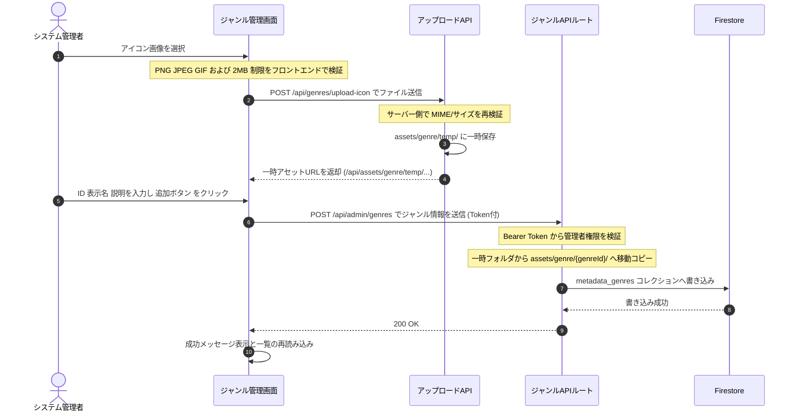
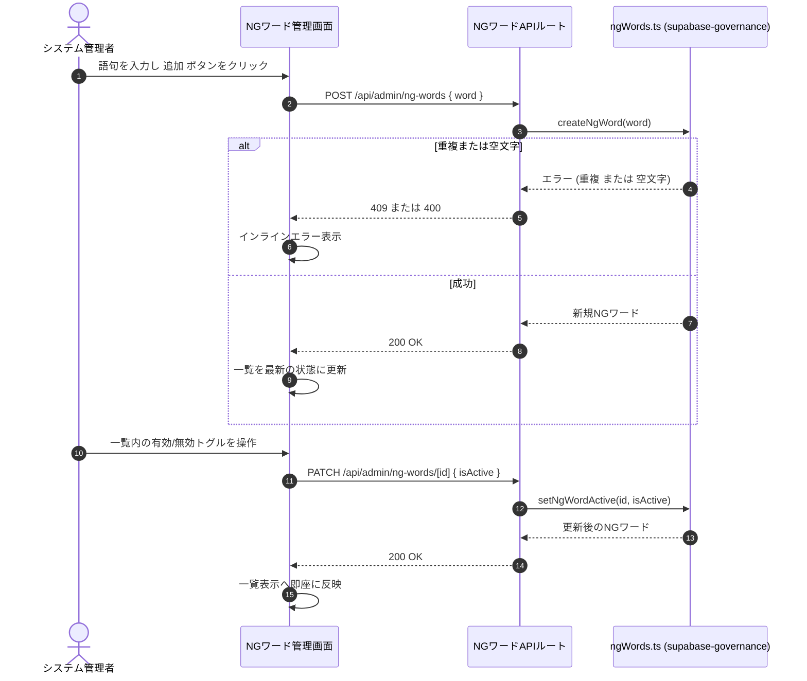

# Technical Design Document: quizetika-moderation-governance-ui

## Overview
本ドキュメントは、クイズ投稿SNS「quizetika」における管理者モデレーションおよびコミュニティ自治（ガバナンス）に関する専用UIの技術設計仕様を定義します。5回通報され一時保留状態にあるクイズ等の審査を行う管理者専用のモデレーションキュー、表記揺れタグやジャンルのマージ提案および加重投票UI、認証ユーザーによる新ジャンル新設申請フォームとモデレータ投票による自治承認UI、および管理者専用のジャンル直接追加・管理画面を構築します。

本システムは、Next.jsのApp RouterおよびReact、TypeScriptのフロントエンド構成に加え、Tailwind CSSおよびshadcn/uiコンポーネントを用いたガバナンスUIを実装し、Firestoreサービス（`ModerationService`等）およびサーバーサイドAPIと接続します。

**Phase 6（2026-06）**: ジャンルアイコンアップロードの設計・エラーメッセージを **SEC-08（SVG 禁止、PNG/JPEG/GIF のみ、2MB）** に仕様統一。
**管理者ジャンル直接追加機能の追加（2026-06-18 追加）**: システム管理者が直接ジャンルを定義・新設できる専用画面（`/admin/genres`）と、そこへの相互ナビゲーションを追加する。
**ジャンル画像のローカル保存化（2026-06-18 追加）**: ジャンルアイコン画像および一時画像の保存先を Firebase Storage からローカルファイルシステム（`assets/genre/`）へ変更し、エミュレータバケットエラーを解消してファイル管理を簡素化する。
**NGワードマスタ管理画面の追加（Phase 39・2026-07 追加）**: `supabase-governance` が新規に提供する NGワードマスタ CRUD（要件9）を管理者が操作するための専用画面（`/admin/ng-words`）を追加する。既存の `AdminGenresPage` と同型の「一覧 + 追加フォーム + インライン編集」パターンを踏襲する。

### Goals
- 不適切通報審査キューおよび管理者特別審査閲覧ビューの構築。
- タグ/ジャンルの仮想マージ提案起案、モデレータ加重投票（シニアモデレータの重みx2）、および賛成率プログレスバー表示の構築。
- 新ジャンル申請フォーム（ID、日本語名、ローカル画像アップロード）および投票、可決条件達成時の自動有効化フィードバック。
- 初期ジャンルの一括投入（シード）および個別ジャンルの直接追加機能の構築。
- ユーザーの `moderationTier` または管理者ロールに基づいた、厳格なディレクトリ・ページ保護（403または404フォールバック）の実装。
- ジャンル画像アセット（一時保存および正式アセット）のローカルファイルシステム上での管理、および Next.js API Routes による動的アセット配信の構築。
- NGワードマスタ（禁止語句一覧）の一覧表示、登録、表記編集、有効/無効切替を行う管理者専用画面（`/admin/ng-words`）の構築（Phase 39）。

### Non-Goals
- 一般ユーザーがクイズをプレイする画面、またはクイズ作成画面のUI設計そのもの（別スペックが担当）。
- 既存ジャンルの物理的な削除機能（不要になったジャンルは非表示または非アクティブ化で対応し、物理削除は本要件の対象外とする）。
- Firebase Storage バケットを利用したジャンルアイコン画像のアップロード・保存処理。
- NGワードマスタへの実際の書き込みロジック・判定アルゴリズム自体（`supabase-governance`／`quizetika-core` が担当、Phase 39）。NGワードの物理削除機能（無効化のみ）。

---

## Boundary Commitments

### This Spec Owns
- **UIルーティング設計**: `/admin/moderation`, `/admin/genres`, `/community/merge`, `/community/genres` の各ページコンポーネント。
- **権限ガード**: クライアントサイドおよび Next.js Server Components での `moderationTier` または `role` に基づくページアクセス制御（403/404表示）。
- **ローカルアップロードUI & API**: ジャンル申請時および管理者直接追加時の一時画像ローカルアップロードフォームと、一時画像を `assets/genre/temp/` に保存する API `/api/genres/upload-icon`（SVG禁止、2MB制限をフロントとバックの両方で検証）。
- **AI画像生成の一時ローカル保存**: Gemini (Imagen) で生成した画像 Buffer の `assets/genre/temp/` への保存処理。
- **ローカル画像配信 API**: 保存されたアセットを動的配信する GET `/api/assets/genre/[...path]` API。
- **投票インタラクション**: 賛成・反対投票時の加重値計算とプログレスバーの描画。
- **ジャンルデータ管理**: 初期ジャンルの一括投入（シード）および個別ジャンルの直接追加APIルート `/api/admin/genres`、および一時画像から正式フォルダへの移動を行う `/api/genres/migrate-icon`。
- **NGワード管理UI（Phase 39）**: `/admin/ng-words` ページコンポーネント、一覧・登録・編集・有効/無効切替 API ルート `/api/admin/ng-words`／`/api/admin/ng-words/[id]` のリクエストハンドリング（データアクセス自体は `supabase-governance` の `ngWords.ts` サービスへ委譲）。

### Out of Boundary
- Cloud Functions を用いた非同期の投票可決バックエンドトリガー処理（`quizetika-core`が担当）。
- ローカル画像ファイルの永続化やホストサーバー上でのバックアップ運用（ホスト環境に依存）。
- NGワードマスタへの実際のDB書き込みロジック・RPC実装（`supabase-governance` の `ngWords.ts` が担当、Phase 39）。クイズ公開時のNGワード判定アルゴリズム（`quizetika-core` が担当、Phase 39）。

### Allowed Dependencies
- **`quizetika-auth-profile-ui`**: `Header`, `useAuth`, プロフィール権限バッジ
- **`quizetika-play-flow-ui`**: `/quiz/[id]` 審査用特別閲覧ビュー
- **`quizetika-core`**: `ModerationService`, Firebase Admin SDK
- **Static Assets**: `src/data/initial_genres.json` (初期ジャンル定義データ)
- **Local Directory**: `assets/genre/` (アセット書き込み・読み込み用)
- **`supabase-governance`（Phase 39）**: `ngWords.ts` サービス（`listNgWords`／`createNgWord`／`updateNgWord`／`setNgWordActive`）

### Revalidation Triggers
- `ModerationService` またはジャンル管理 API のシグネチャ変更。
- ユーザーロール・ `moderationTier` の種別追加。
- ローカルファイルシステム上の書き込み権限やパス構造の変更。
- `supabase-governance` の `ngWords.ts` サービスインターフェース変更（Phase 39）。

---

## Architecture

### Technology Stack
- **Frontend**: Next.js v16.2.6 (App Router), React v19.2.4, TypeScript
- **Styling**: Tailwind CSS / shadcn/ui (Radix Primitives)
- **Asset Storage**: Local Filesystem (リポジトリルートの `assets/genre/` 内、配信は Next.js API Route)
- **Backend / API**: Next.js API Routes (Firebase Admin SDK 経由の Firestore 書き込み、および `fs` モジュールによるローカル画像処理)

### Dependency Direction
- Types → Config → API Routings / Local Filesystem (`fs` helper) → Service → UI Pages

---

## File Structure Plan

### Directory Structure
```
src/
├── app/
│   ├── admin/
│   │   ├── page.tsx           # 管理者メニューポータル画面 (8.1, 8.2, 8.3)
│   │   ├── moderation/
│   │   │   └── page.tsx       # 管理者モデレーション審査画面 (1.1-1.5, 5.1-5.3, 5.6, 5.7, 7.8)
│   │   ├── users/
│   │   │   └── page.tsx       # 管理者ユーザー管理画面 (7.8) - 既存修正（相互リンク追加）
│   │   ├── genres/
│   │   │   ├── page.tsx       # 管理者専用ジャンル管理・直接追加画面 (7.1-7.7)
│   │   │   └── admin-genres-client.tsx  # 管理者ジャンル画面用クライアントコンポーネント (7.1-7.7, 9.1-9.4, 9.6)
│   │   └── ng-words/
│   │       ├── page.tsx       # [NEW] 管理者専用NGワード管理画面 (10.1-10.10, Phase 39)
│   │       └── admin-ng-words-client.tsx  # [NEW] NGワード管理画面用クライアントコンポーネント (10.1-10.10, Phase 39)
│   ├── api/
│   │   ├── admin/
│   │   │   ├── seed-genres/
│   │   │   │   └── route.ts   # 初期ジャンル一括投入APIルート (5.1, 5.3-5.5)
│   │   │   ├── genres/
│   │   │   │   └── route.ts   # 管理者専用ジャンル管理・登録APIルート (7.1, 7.4, 7.5) - [MODIFY] ローカル移行対応
│   │   │   └── ng-words/
│   │   │       ├── route.ts       # [NEW] GET(一覧取得)/POST(新規登録) (10.3, 10.4, 10.5, 10.6, Phase 39)
│   │   │       └── [id]/
│   │   │           └── route.ts   # [NEW] PATCH(表記編集・有効/無効切替) (10.7, 10.8, Phase 39)
│   │   ├── genres/
│   │   │   ├── generate-icon/
│   │   │   │   └── route.ts   # AIジャンルアイコン生成APIルート (9.1, 9.4-9.6) - [MODIFY] ローカル一時保存対応
│   │   │   ├── migrate-icon/
│   │   │   │   └── route.ts   # AI生成・アップロード一時画像移行APIルート (3.4, 4.4) - [MODIFY] ローカルファイル移行対応
│   │   │   └── upload-icon/
│   │   │       └── route.ts   # [NEW] 手動選択画像の一時ローカルアップロードAPIルート (3.1, 4.3, 7.6)
│   │   └── assets/
│   │       └── genre/
│   │           └── [...path]/
│   │               └── route.ts # [NEW] ローカルジャンル画像アセット配信APIルート (7.4, 9.3)
│   └── community/
│       ├── merge/
│       │   └── page.tsx       # タグ/ジャンルマージリクエスト画面 (2.1-2.7)
│       └── genres/
│           └── page.tsx       # ジャンル新設申請・投票画面 (3.1-3.5, 4.2-4.4)
├── services/
│   └── tagMerge.ts            # シード投入サービス関数 seedInitialGenres (5.4, 5.5)
└── middleware.ts              # ロール別ルートガードミドルウェア (1.1, 2.1, 7.1)
```

---

## System Flows

### 管理者によるジャンル直接追加フロー


### 管理者によるNGワード登録・無効化フロー（Phase 39）


---

## Requirements Traceability

| Requirement | Summary                                        | Components                                 | Interfaces                 | Flows              |
| ----------- | ---------------------------------------------- | ------------------------------------------ | -------------------------- | ------------------ |
| 1.1         | 管理者・シニアモデレータ専用アクセス制限       | `/admin/moderation` Page                   | `middleware.ts`            | -                  |
| 1.2         | 通報5回到達コンテンツの審査キュー表示          | `/admin/moderation` Page                   | Flagged Queue              | -                  |
| 1.3         | 通報理由および詳細内容の表示                   | `/admin/moderation` Page                   | Flagged Queue              | -                  |
| 1.4         | 公開復帰（通報リセット）およびコンテンツ削除   | `/admin/moderation` Page                   | `ModerationService`        | -                  |
| 1.5         | 審査用特別閲覧ビュー遷移                       | `/admin/moderation` Page                   | Special Quiz View          | -                  |
| 2.1         | モデレータ資格ルートガード                     | `/community/merge` Page                    | `middleware.ts`            | -                  |
| 2.2         | マージ提案起案フォーム                         | `/community/merge` Page                    | Form Input                 | -                  |
| 2.3         | 保留中マージリクエスト投票一覧表示             | `/community/merge` Page                    | Request Queue              | -                  |
| 2.4         | ソースタグ/ジャンル分割一覧閲覧                | `/community/merge` Page                    | Split List View            | -                  |
| 2.5         | 賛成/反対加重投票UI                            | `/community/merge` Page                    | `ModerationService`        | -                  |
| 2.6         | シニアモデレータ「重みx2」表示と計算           | `/community/merge` Page                    | `ModerationService`        | -                  |
| 2.7         | 賛成率のリアルタイムプログレスバー表示         | `/community/merge` Page                    | CSS Progress Bar           | -                  |
| 3.1         | 認証ユーザー向け新ジャンル申請フォーム         | `/community/genres` Page                   | Form (PNG/JPEG/GIF upload) | -                  |
| 4.1         | SEC-08 仕様文言整合                            | Spec docs                                  | —                          | —                  |
| 4.2         | MIME/size クライアント検証                     | `genre-icon-upload` / Page                 | `validateGenreIconFile`    | —                  |
| 4.3         | SVG 拒否 UX とローカル保存のブロック           | `/community/genres` Page                   | inline error               | 直接追加フロー     |
| 4.4         | 承認時のアセットローカル移行とURL登録          | `/api/genres/migrate-icon`                 | File copy / DB update      | 直接追加フロー     |
| 3.2         | 保留中ジャンル新設申請の一覧と投票UI           | `/community/genres` Page                   | `ModerationService`        | -                  |
| 3.3         | モデレータ賛否投票                             | `/community/genres` Page                   | `ModerationService`        | -                  |
| 3.4         | 可決条件判定とアセット移行処理                 | `/community/genres` Page                   | `/api/genres/migrate-icon` | -                  |
| 3.5         | 承認/否決履歴タブ表示                          | `/community/genres` Page                   | History Tab                | -                  |
| 5.1         | 管理者専用シードUIアクセス制限                 | `/admin/moderation` Page / API             | check admin role           | -                  |
| 5.2         | 一括投入セクション・ボタン表示                 | `/admin/moderation` Page                   | Button                     | -                  |
| 5.3         | 一括登録APIへのリクエスト送信                  | `/admin/moderation` Page                   | `fetch()` request          | -                  |
| 5.4         | Firestore一括書き込みと冪等性                  | `tagMerge.ts`                              | `seedInitialGenres`        | -                  |
| 5.5         | 重複回避（スキップ/アップデート）              | `tagMerge.ts`                              | `seedInitialGenres`        | -                  |
| 5.6         | 実行時ローディング表示とボタン無効化           | `/admin/moderation` Page                   | UI state                   | -                  |
| 5.7         | 結果（件数）または失敗アラート表示             | `/admin/moderation` Page                   | Alert Messages             | -                  |
| 6.4         | マージ画面アクセス時の静的フレーム描画         | `/community/merge` Page                    | Suspense / Streaming       | -                  |
| 6.5         | マージ一覧取得中のスケルトン表示               | `/community/merge` Page                    | merge-requests-skeleton    | -                  |
| 6.6         | マージ一覧取得後のコンテンツ描画               | `/community/merge` Page                    | React rendering            | -                  |
| 6.7         | ジャンル申請画面アクセス時の静的フレーム描画   | `/community/genres` Page                   | Suspense / Streaming       | -                  |
| 6.8         | ジャンル申請一覧取得中のスケルトン表示         | `/community/genres` Page                   | genres-moderation-skeleton | -                  |
| 6.9         | ジャンル申請一覧取得後のコンテンツ描画         | `/community/genres` Page                   | React rendering            | -                  |
| 6.10        | ジャンル管理画面アクセス時の静的フレーム描画   | `/admin/genres` Page                       | Suspense / Streaming       | 直接追加フロー     |
| 6.11        | ジャンル管理画面の一覧取得中のスケルトン表示   | `/admin/genres` Page                       | genres-management-skeleton | 直接追加フロー     |
| 6.12        | ジャンル管理画面の一覧取得後のコンテンツ描画   | `/admin/genres` Page                       | React rendering            | 直接追加フロー     |
| 6.13        | 通報審査キューのスケルトン属性付与             | `/admin/moderation` Page                   | moderation-queue-skeleton  | -                  |
| 6.14        | マージ投票スケルトン属性付与                   | `/community/merge` Page                    | merge-requests-skeleton    | -                  |
| 6.15        | ジャンル申請スケルトン属性付与                 | `/community/genres` Page                   | genres-moderation-skeleton | -                  |
| 6.16        | ジャンル管理画面スケルトン属性付与             | `/admin/genres` Page                       | genres-management-skeleton | 直接追加フロー     |
| 7.1         | 管理者以外のジャンル管理画面アクセス制限       | `/admin/genres` Page / API                 | middleware.ts / guard      | 直接追加フロー     |
| 7.2         | ジャンル管理画面ロード中インジケータ表示       | `/admin/genres` Page                       | UI spinner                 | -                  |
| 7.3         | 登録済みジャンル一覧および追加フォーム提供     | `/admin/genres` Page                       | UI Card / Form             | 直接追加フロー     |
| 7.4         | 有効値入力時のローカル保存と直接書き込み       | `/admin/genres` Page / API                 | api-genres API             | 直接追加フロー     |
| 7.5         | 重複ジャンルIDのエラーハンドリング             | `/admin/genres` Page / API                 | api-genres API             | 直接追加フロー     |
| 7.6         | アイコン画像のローカル保存検証                 | `/admin/genres` Page                       | `validateGenreIconFile`    | 直接追加フロー     |
| 7.7         | 登録成功時のジャンル一覧自動更新               | `/admin/genres` Page                       | React state refresh        | 直接追加フロー     |
| 7.8         | モデレーション画面でのジャンル管理リンク表示   | `/admin/moderation` Page                   | Navigation link            | 直接追加フロー     |
| 8.1         | 管理者以外のポータル画面アクセス制限           | `/admin` Page                              | middleware.ts / guard      | ポータル表示フロー |
| 8.2         | ポータル画面ロード中インジケータ表示           | `/admin` Page                              | UI spinner                 | ポータル表示フロー |
| 8.3         | 各管理者メニューカードおよびリンクの表示       | `/admin` Page                              | UI Card                    | ポータル表示フロー |
| 9.1         | AI生成時入力バリデーション（インラインエラー） | `/admin/genres` Page / `/community/genres` | Button interaction         | AI生成フロー       |
| 9.2         | 生成中ローディングインジケータと非活性化       | `/admin/genres` Page / `/community/genres` | Button / Spinner           | AI生成フロー       |
| 9.3         | 生成成功画像ローカル一時保存とプレビュー設定   | `/admin/genres` Page / `/community/genres` | Preview / State            | AI生成フロー       |
| 9.4         | 生成失敗エラー表示とボタン活性化復帰           | `/admin/genres` Page / `/community/genres` | Error banner / State       | AI生成フロー       |
| 9.5         | 一般ユーザーデイリー生成上限制限（1日5回）     | `/api/genres/generate-icon`                | checkDailyLimit            | AI生成フロー       |
| 9.6         | 管理者生成上限免除（無制限）                   | `/api/genres/generate-icon`                | skipDailyLimit             | AI生成フロー       |
| 10.1        | 管理者以外のNGワード管理画面アクセス制限       | `/admin/ng-words` Page                     | `middleware.ts`            | -                  |
| 10.2        | 認証情報確認中のローディング表示               | `/admin/ng-words` Page                     | UI spinner                 | -                  |
| 10.3        | NGワード一覧および登録フォーム表示             | `/admin/ng-words` Page                     | `admin-ng-words API` (GET) | NGワード登録・無効化フロー |
| 10.4        | NGワード新規登録                               | `/admin/ng-words` Page / API               | `admin-ng-words API` (POST)| NGワード登録・無効化フロー |
| 10.5        | 重複語句の登録拒否                             | `/admin/ng-words` Page / API               | `admin-ng-words API` (POST)| NGワード登録・無効化フロー |
| 10.6        | 空文字・空白のみの登録・編集拒否               | `/admin/ng-words` Page                     | Inline validation          | -                  |
| 10.7        | NGワードの表記編集                             | `/admin/ng-words` Page / API               | `admin-ng-words [id] API`  | -                  |
| 10.8        | NGワードの有効/無効切替                        | `/admin/ng-words` Page / API               | `admin-ng-words [id] API`  | NGワード登録・無効化フロー |
| 10.9        | 操作成功・失敗時のフィードバック表示           | `/admin/ng-words` Page                     | Alert / Toast              | NGワード登録・無効化フロー |
| 10.10       | 管理者ポータルからのナビゲーション導線         | `/admin` Page                              | `AdminPortal`               | -                  |

---

## Components and Interfaces

### Component Summary Table

| Component           | Domain/Layer | Intent                                             | Req Coverage                             | Key Dependencies                                                                                        | Contracts      |
| ------------------- | ------------ | -------------------------------------------------- | ---------------------------------------- | ------------------------------------------------------------------------------------------------------- | -------------- |
| `AdminPortal`       | UI / Page    | 各種管理者用サブ画面へのナビゲーションポータル     | 8.1-8.3                                  | `useAuth`                                                                                               | UI State       |
| `AdminModeration`   | UI / Page    | 通報審査、初期ジャンル投入UI                       | 1.1-1.5, 5.1-5.3, 5.6, 5.7, 7.8, 6.13    | `useAuth`, `/api/admin/seed-genres`                                                                     | UI State       |
| `AdminGenres`       | UI / Page    | 登録済みジャンル一覧、ジャンル直接登録フォーム     | 7.1-7.7, 6.10-6.12, 6.16                 | `useAuth`, `/api/admin/genres`, `/api/genres/upload-icon`, `validateGenreIconFile`                      | UI State / TSX |
| `CommunityMerge`    | UI / Page    | マージ起案、加重投票、進捗可視化                   | 2.1-2.7, 6.4-6.6, 6.14                   | `ModerationService`, `useAuth`                                                                          | UI State       |
| `CommunityGenres`   | UI / Page    | ジャンル新設申請（画像付）、投票、履歴閲覧         | 3.1-3.5, 4.2-4.4, 6.7-6.9, 6.15, 9.1-9.5 | `ModerationService`, `/api/genres/upload-icon`, `/api/genres/generate-icon`, `/api/genres/migrate-icon` | UI State       |
| `seed-genres API`   | API Route    | 初期ジャンル一括登録認可・実行                     | 5.1, 5.3, 5.4, 5.5                       | `tagMerge` service, Firebase Admin Auth                                                                 | JSON response  |
| `admin-genres API`  | API Route    | 全ジャンル取得、新規ジャンル直接登録・画像移行     | 7.1, 7.4, 7.5                            | Firebase Admin Auth / Firestore, `fs` module                                                            | JSON response  |
| `generate-icon API` | API Route    | AIによるジャンルアイコン画像生成・ローカル一時保存 | 9.5, 9.6                                 | Gemini GenAI, Admin SDK Auth, `fs` module                                                               | JSON response  |
| `upload-icon API`   | API Route    | 手動選択画像ファイルのローカル一時保存             | 3.1, 4.3, 7.6                            | `fs` module, `validateGenreIconFile`                                                                    | JSON response  |
| `assets/genre API`  | API Route    | ローカルジャンル画像ファイルのバイナリ配信         | 7.4, 9.3                                 | `fs` module, `path` module                                                                              | Image response |
| `AdminNgWords`      | UI / Page    | NGワード一覧表示、登録フォーム、編集・有効/無効切替 | 10.1-10.10                              | `useAuth`, `/api/admin/ng-words`, `/api/admin/ng-words/[id]`                                            | UI State / TSX |
| `admin-ng-words API` | API Route   | NGワード一覧取得・新規登録                        | 10.3-10.6                                | `ngWords.ts`（`supabase-governance`）                                                                    | JSON response  |
| `admin-ng-words [id] API` | API Route | NGワードの表記編集・有効/無効切替                 | 10.7, 10.8                               | `ngWords.ts`（`supabase-governance`）                                                                    | JSON response  |

---

### UI Page / Components

#### AdminGenresPage Component (`src/app/admin/genres/page.tsx` および `admin-genres-client.tsx`)
- **Intent**: 管理者が現在登録されているすべてのジャンルを一覧表示し、新しいジャンルを即時に作成・追加するためのインターフェースを提供。
- **Requirements**: 7.1-7.7, 6.10-6.12, 6.16, 9.1-9.4, 9.6
- **Responsibilities & Constraints**:
  - `isAdminUser` ガードにより、`admin` ロール以外のユーザーのアクセスを遮断し `/not-found` へ遷移。
  - 無効なジャンルも含めた全ジャンルデータを取得する内部API `/api/admin/genres` をコールしてテーブル形式で一覧表示。
  - ジャンル追加フォームを提供（ID、表示名、説明、アイコンファイル選択）。
  - アイコン選択時、`validateGenreIconFile` を使用して PNG/JPEG/GIF の MIME タイプおよび 2MB 上限をクライアント側で厳密にチェック。
  - 追加処理は、手動アイコン画像がある場合は `/api/genres/upload-icon` へ `multipart/form-data` で POST して一時URL（`/api/assets/genre/temp/...`）を取得する。
  - 最終的に、取得した一時画像URL（またはAI生成の一時URL）を含めた情報を `/api/admin/genres` に POST し、サーバー側でアセットを正式ディレクトリに移行する。
  - 登録が成功すると、ジャンル一覧のステートを更新して画面表示に即時反映。

**Dependencies**
- Inbound: なし
- Outbound: `/api/genres/upload-icon` (P0), `/api/admin/genres` (P0), `validateGenreIconFile` (P0)

**Contracts**: State [x] / TSX [x]

---

#### AdminNgWordsPage Component (`src/app/admin/ng-words/page.tsx` および `admin-ng-words-client.tsx`)（Phase 39）
- **Intent**: 管理者が登録済みのNGワード一覧を表示し、新規語句の登録、既存語句の表記編集、有効/無効切替を行うインターフェースを提供。`AdminGenresPage` と同型の「一覧 + 追加フォーム + インライン編集」パターンを踏襲する。
- **Requirements**: 10.1-10.10
- **Responsibilities & Constraints**:
  - `isAdminUser` ガードにより、`admin` ロール以外のユーザーのアクセスを遮断し `/not-found` へ遷移（`AdminGenresPage` と同一パターン）。
  - `/api/admin/ng-words`（GET）を呼び出して登録済みNGワード一覧（語句・有効/無効状態）をテーブル形式で表示。
  - 新規登録フォームを提供（語句のテキスト入力のみ、画像アップロードは不要）。送信前にクライアント側で空文字・空白のみの入力をインライン検証し送信をブロックする。
  - 登録は `/api/admin/ng-words`（POST）へ `{ word }` を送信。`409`（重複）応答時は「この語句はすでに登録されています」のインラインエラーを表示。
  - 一覧内の各行に編集（表記変更）と有効/無効トグルを提供し、`/api/admin/ng-words/[id]`（PATCH）へ送信。
  - 登録・編集・有効/無効切替が成功すると、一覧のステートを更新して画面表示に即時反映し、成功メッセージを表示する。

**Dependencies**
- Inbound: なし
- Outbound: `/api/admin/ng-words` (P0), `/api/admin/ng-words/[id]` (P0)

**Contracts**: State [x] / TSX [x]

---

### API Routes

#### upload-icon API (`src/app/api/genres/upload-icon/route.ts`)
- **Intent**: クライアントからアップロードされた画像ファイルをローカル一時保存ディレクトリに保存し、一時アクセスURLを返す。
- **Requirements**: 3.1, 4.3, 7.6
- **Contracts**: API [x]
- **処理フロー**:
  1. `request.formData()` を使用してマルチパートフォームからファイルオブジェクトを取得。
  2. サーバー側でのファイルバリデーション（`validateGenreIconFile` 相当）を再適用（PNG/JPEG/GIF、最大2MB、SVG禁止）。
  3. `assets/genre/temp/` ディレクトリが存在しない場合は自動作成。
  4. ファイル名を `{uid}_{timestamp}.png`（または適切な拡張子）として `assets/genre/temp/` 配下に保存。
  5. プレビュー用URLとして `/api/assets/genre/temp/{filename}` をレスポンス（status 200）で返す。

##### API Contract
| Method | Endpoint                  | Request               | Response                                | Errors                                                      |
| ------ | ------------------------- | --------------------- | --------------------------------------- | ----------------------------------------------------------- |
| POST   | `/api/genres/upload-icon` | FormData (file: File) | `{ success: boolean, tempUrl: string }` | 400 (Bad Request), 401 (Unauthorized), 500 (Internal Error) |

#### assets/genre API (`src/app/api/assets/genre/[...path]/route.ts`)
- **Intent**: `assets/genre/` ディレクトリに保存された画像ファイルを安全に読み込み、画像レスポンスとして配信する。
- **Requirements**: 7.4, 9.3
- **Contracts**: API [x]
- **処理フロー**:
  1. パスパラメータからアセットファイルへの相対パスを取得（例: `temp/xxx.png` または `math-science/icon_123.png`）。
  2. ディレクトリトラバーサル防止のため、パスパラメータに `..` が含まれていないか、また `assets/genre/` の外部を指していないかを厳密にチェック。含まれる場合は 400 Bad Request。
  3. ファイルの存在確認を行い、存在しない場合は 404 Not Found。
  4. `path.extname` から MIME タイプ（`image/png`, `image/jpeg`, `image/gif`）を特定。
  5. ファイルをバイナリとして読み出し、MIME ヘッダーを指定して返却。

##### API Contract
| Method | Endpoint                      | Request | Response    | Errors                                                    |
| ------ | ----------------------------- | ------- | ----------- | --------------------------------------------------------- |
| GET    | `/api/assets/genre/[...path]` | なし    | File Binary | 400 (Invalid Path), 404 (Not Found), 500 (Internal Error) |

#### admin-genres API (`src/app/api/admin/genres/route.ts`)
- **Intent**: 管理者認証を行い、全ジャンル情報の取得、および一時画像の正式保存移行処理を伴う新規ジャンル登録を提供する。
- **Requirements**: 7.1, 7.4, 7.5
- **Contracts**: API [x]
- **処理フロー**:
  - **POST 処理時の画像移行**:
    1. 送信された `iconImageUrl` が一時アセットパス `/api/assets/genre/temp/` を指している場合、そのファイルパスを実システム上の `assets/genre/temp/xxx.png` にマッピング。
    2. コピー先として `assets/genre/{genreId}/icon_{timestamp}.png` ディレクトリを作成。
    3. `fs.copyFileSync` または `fs.renameSync` を用いて、一時フォルダから正式フォルダへファイルをコピー・移動。
    4. `iconImageUrl` の値を正式アセットURL `/api/assets/genre/{genreId}/icon_{timestamp}.png` として Firestore に書き込む。
    5. 不要になった一時ファイルを削除。

##### API Contract
| Method | Endpoint            | Request                                                                                  | Response                                    | Errors                                                                      |
| ------ | ------------------- | ---------------------------------------------------------------------------------------- | ------------------------------------------- | --------------------------------------------------------------------------- |
| GET    | `/api/admin/genres` | なし (Auth Token 必須)                                                                   | `GenreMetadata[]`                           | 401 (Unauthorized), 403 (Forbidden), 500                                    |
| POST   | `/api/admin/genres` | `{ id: string, displayName: string, description: string, iconImageUrl: string \| null }` | `{ success: boolean, data: GenreMetadata }` | 400 (Bad Request), 401 (Unauthorized), 403 (Forbidden), 409 (Conflict), 500 |

#### generate-icon API (`src/app/api/genres/generate-icon/route.ts`)
- **Intent**: 認証済みセッションのもとで、Geminiモデルを呼び出してジャンル名等に応じたアイコン画像（PNG）を生成し、ローカル一時保存したURLを返却する。
- **Requirements**: 9.3, 9.4-9.6
- **Contracts**: API [x]
- **処理フロー**:
  - 画像 Buffer の保存先変更:
    1. Gemini Imagen モデルから生成された画像 Buffer を取得。
    2. `assets/genre/temp/` ディレクトリ配下に `{uid}_{timestamp}.png` というファイル名で `fs.writeFileSync` を用いて保存。
    3. 返却する `iconImageUrl` を `/api/assets/genre/temp/{filename}` として JSON レスポンス。

##### API Contract
| Method | Endpoint                    | Request                                                        | Response                                                                                 | Errors                                      |
| ------ | --------------------------- | -------------------------------------------------------------- | ---------------------------------------------------------------------------------------- | ------------------------------------------- |
| POST   | `/api/genres/generate-icon` | `{ displayName: string, description: string, userId: string }` | `{ success: boolean, iconImageUrl: string, usage?: { current: number, limit: number } }` | 400, 401, 429 (Too Many Requests), 503, 500 |

#### migrate-icon API (`src/app/api/genres/migrate-icon/route.ts`)
- **Intent**: コミュニティジャンル申請の送信前に、一時保存されているローカルファイルを正式なジャンルディレクトリに移動・コピーする。
- **Requirements**: 3.4, 4.4
- **Contracts**: API [x]
- **処理フロー**:
  1. `tempUrl` (例: `/api/assets/genre/temp/xxx.png`) を解析して、ローカル一時ファイル `assets/genre/temp/xxx.png` の実体を取得。
  2. ディレクトリトラバーサル防止チェックを適用。
  3. コピー先 `assets/genre/{genreId}/icon_{timestamp}.png` を作成し、ファイルをコピー。
  4. 新しいアセットURL `/api/assets/genre/{genreId}/icon_{timestamp}.png` を返却し、元のファイルを削除。

##### API Contract
| Method | Endpoint                   | Request                                                | Response                                     | Errors                                                      |
| ------ | -------------------------- | ------------------------------------------------------ | -------------------------------------------- | ----------------------------------------------------------- |
| POST   | `/api/genres/migrate-icon` | `{ tempUrl: string, genreId: string, userId: string }` | `{ success: boolean, iconImageUrl: string }` | 400 (Bad Request), 401 (Unauthorized), 404 (Not Found), 500 |

#### admin-ng-words API (`src/app/api/admin/ng-words/route.ts`)（Phase 39）
- **Intent**: 管理者認証を行い、NGワードマスタ一覧の取得、および新規語句の登録を提供する。データ書き込み自体は `supabase-governance` の `ngWords.ts`（`createNgWord`）へ委譲する。
- **Requirements**: 10.3, 10.4, 10.5, 10.6
- **Contracts**: API [x]
- **処理フロー**:
  - **GET**: セッションから管理者権限を検証し、`ngWords.ts` の `listNgWords()` を呼び出して一覧を返す。
  - **POST**: リクエストボディの `word` をトリムし空文字なら `400`。`ngWords.ts` の `createNgWord(word)` を呼び出す。重複エラー（`23505` 由来）を検知した場合は `409` へ変換して返却する。

##### API Contract
| Method | Endpoint              | Request           | Response                              | Errors                                                          |
| ------ | ---------------------- | ------------------ | -------------------------------------- | ---------------------------------------------------------------- |
| GET    | `/api/admin/ng-words`  | なし (Auth Token 必須) | `NgWord[]`                             | 401 (Unauthorized), 403 (Forbidden), 500                        |
| POST   | `/api/admin/ng-words`  | `{ word: string }` | `{ success: boolean, data: NgWord }`   | 400 (Bad Request), 401 (Unauthorized), 403 (Forbidden), 409 (Conflict), 500 |

#### admin-ng-words [id] API (`src/app/api/admin/ng-words/[id]/route.ts`)（Phase 39）
- **Intent**: 管理者認証を行い、既存NGワードの表記編集および有効/無効切替を提供する。
- **Requirements**: 10.7, 10.8
- **Contracts**: API [x]
- **処理フロー**:
  - **PATCH**: リクエストボディに `word` が含まれる場合は `ngWords.ts` の `updateNgWord(id, word)` を呼び出す。`isActive` が含まれる場合は `setNgWordActive(id, isActive)` を呼び出す。対象IDが存在しない場合は `404`。

##### API Contract
| Method | Endpoint                      | Request                                              | Response                              | Errors                                                     |
| ------ | ------------------------------ | ----------------------------------------------------- | -------------------------------------- | ------------------------------------------------------------ |
| PATCH  | `/api/admin/ng-words/[id]`     | `{ word?: string, isActive?: boolean }`               | `{ success: boolean, data: NgWord }`  | 400 (Bad Request), 401 (Unauthorized), 403 (Forbidden), 404 (Not Found), 409 (Conflict), 500 |

---

## Data Models

### Domain Model: GenreMetadata (`src/types/index.ts`)
```typescript
export interface GenreMetadata {
  id: string;                  // 一意なジャンルID
  displayName: string;         // 表示名（日本語）
  description?: string;        // 説明文（任意）
  iconImageUrl: string | null; // アイコン画像のローカルアセット配信URL
  canonicalId: string | null;  // マージ先の canonicalId（直接追加時は null）
  mergedGenreIds: string[];    // マージされたジャンルID配列（直接追加時は空配列）
  isActive: boolean;           // 有効フラグ（直接追加時は true）
  createdAt?: Date;
  updatedAt?: Date;
}
```

### Domain Model: NgWord (`src/types/index.ts`)（Phase 39）
```typescript
export interface NgWord {
  id: string;
  word: string;
  isActive: boolean;
  createdAt: string;
  updatedAt: string;
}
```
`supabase-governance` の `ngWords.ts` が定義する型をそのまま再利用する（型定義の重複を避けるため、`quizetika-moderation-governance-ui` 側で独自に再定義しない）。

---

## Error Handling

### Error Strategy
- **管理者以外のアクセス**:
  - `/admin/genres` ページ遷移時、`admin` でないユーザーに対してはルートガードにより即時 `404` ページ表示、または API 側での `403` を返却する。
- **重複ID登録**:
  - `/api/admin/genres` の POST 時に一意性チェックに引っかかった場合、`409 Conflict` を返し、フロントエンド側でアラートを表示。
- **画像アップロードエラー**:
  - 画像選択時に `validateGenreIconFile` で非許容フォーマット（SVG含む）や2MB容量超過を検知した場合、フォーム送信をロックしてインラインでエラーを表示。
- **ファイルアクセスとセキュリティガード**:
  - `assets/genre/` へのファイル書き込み/読み込み時、パスパラメータに `..` 等が含まれる場合は、APIレイヤー（`/api/assets/genre/[...path]` 等）で即座に `400 Bad Request` を返却し、不正なディレクトリ参照をブロックする。
- **NGワード重複登録（Phase 39）**:
  - `/api/admin/ng-words` の POST 時、`ngWords.ts` からの重複エラーを検知した場合 `409 Conflict` を返し、フロントエンド側で「この語句はすでに登録されています」とインライン表示。
- **NGワード空文字入力（Phase 39）**:
  - クライアント側で空文字・空白のみの入力を検知した場合、送信自体をブロックしてインラインエラーを表示（サーバー側の検証もフェイルセーフとして残る）。

---

## Testing Strategy

### Unit Tests
- **ジャンルアイコン・バリデーション (validateGenreIconFile)**:
  - SVGファイルが拒否されること。
  - PNG/JPEG/GIFファイルかつ2MB以内の場合に `{ ok: true }` が返ること。
- **ローカルファイル移行処理 (fs helpers)**:
  - `migrate-icon` や `admin-genres` 内のファイルコピー＆削除の挙動が正常に動作すること（`fs` モジュールのスタブを用いてテスト可能）。

### Integration Tests
- **アセット配信 API (`/api/assets/genre/[...path]`)**:
  - 有効なローカルファイルパス（`math-science/icon_123.png`）をリクエストした際、正しい MIME ヘッダー（`image/png`）でバイナリが返ること。
  - `..` を含む無効なパスや範囲外のファイルをリクエストした際、`400 Bad Request` または `404` が返ること（ディレクトリトラバーサルの防御テスト）。
- **ローカルアップロード API (`/api/genres/upload-icon`)**:
  - SVG ファイルや 2MB を超える画像ファイルを POST した場合に `400 Bad Request` が返ること。

### E2E/UI Tests
- **ジャンル直接追加と一覧更新フロー**:
  - 管理者として `/admin/genres` にアクセスした際、ジャンル一覧が表示され、手動選択した PNG 画像をアップロードして追加した際に、ローカルファイルとして保存され、一覧テーブルへ自動的かつ即時反映されること。

### Unit Tests（Phase 39）
- **NGワード管理API (`/api/admin/ng-words`)**:
  - 空文字・空白のみの `word` を POST した場合に `400 Bad Request` が返ること。
  - `ngWords.ts` が重複エラーをスローした場合に `409 Conflict` へ変換されること。

### E2E/UI Tests（Phase 39）
- **NGワード登録・無効化フロー**:
  - 管理者として `/admin/ng-words` にアクセスした際、NGワード一覧が表示され、新規語句を登録した際に一覧テーブルへ即時反映されること。
  - 既存語句と重複する語句を登録しようとした際、インラインエラーが表示され登録が行われないこと。
  - 一覧内の有効/無効トグルを操作した際、状態が即座に画面へ反映されること。
- **管理者ポータルからの導線**:
  - `/admin` へアクセスした際、「NGワード管理」のナビゲーションカードが表示され、クリックで `/admin/ng-words` へ遷移すること。
