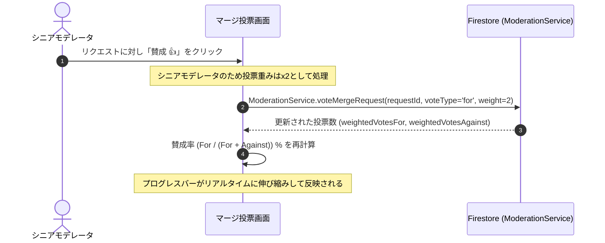

# Technical Design Document: quizeum-moderation-governance-ui

## Overview
本ドキュメントは、クイズ投稿SNS「quizeum」における管理者モデレーションおよびコミュニティ自治（ガバナンス）に関する専用UIの技術設計仕様を定義します。5回通報され一時保留状態にあるクイズ等の審査を行う管理者専用のモデレーションキュー、表記揺れタグやジャンルのマージ提案および加重投票UI、認証ユーザーによる新ジャンル新設申請フォームとモデレータ投票による自治承認UIを構築します。

本システムは、Next.jsのApp RouterおよびReact、TypeScriptのフロントエンド構成に加え、CSS Modulesによる親しみやすく機能的なガバナンスUIを実装し、Firestoreサービス（`ModerationService`等）および権限ガードと接続します。

### Goals
- 不適切通報審査キューおよび管理者特別審査閲覧ビューの構築。
- タグ/ジャンルの仮想マージ提案起案、モデレータ加重投票（シニアモデレータの重みx2）、および賛成率プログレスバー表示の構築。
- 新ジャンル申請フォーム（ID、日本語名、画像アップロード）および投票、可決条件達成時の自動有効化フィードバック。
- ユーザーの `moderationTier` または管理者ロールに基づいた、厳格なディレクトリ・ページ保護（403または404フォールバック）の実装。

### Non-Goals
- 一般ユーザーがクイズをプレイする画面、またはクイズ作成画面のUI設計そのもの（別スペックが担当）。

---

## Boundary Commitments

### This Spec Owns
- **UIルーティング設計**: `/admin/moderation`, `/community/merge`, `/community/genres` の各ページコンポーネント。
- **権限ガード**: クライアントサイドおよび Next.js Server Components での `moderationTier` に基づくページアクセス制御（403/404表示）。
- **アップロードUI**: ジャンル申請時の PNG/SVG ファイルアップロード（Firebase Storage統合）。
- **投票インタラクション**: 賛成・反対投票時の加重値計算とプログレスバーの描画。

### Out of Boundary
- Cloud Functions を用いた非同期の投票可決バックエンドトリガー処理（`quizeum-core`が担当）。

### Allowed Dependencies
- **`quizeum-auth-profile-ui`**: `Header`, `useAuth`, プロフィール権限バッジ
- **`quizeum-play-flow-ui`**: `/quiz/[id]` 審査用特別閲覧ビュー
- **`quizeum-core`**: `ModerationService`, Firebase Storage

### Revalidation Triggers
- `ModerationService` のAPIシグネチャ変更。
- ユーザーロール・ `moderationTier` の種別追加。

---

## Architecture

### Technology Stack
- **Frontend**: Next.js v16.2.6 (App Router), React v19.2.4, TypeScript
- **Styling**: Vanilla CSS (CSS Modules)
- **Asset Storage**: Firebase Storage (ジャンルアイコン用)

---

## File Structure Plan

### Directory Structure
```
src/
├── app/
│   ├── admin/
│   │   └── moderation/
│   │       ├── page.tsx           # 管理者モデレーション審査画面 (1.1, 1.2, 1.3, 1.4, 1.5)
│   │       └── moderation.module.css
│   └── community/
│       ├── merge/
│       │   ├── page.tsx           # タグ/ジャンルマージリクエスト画面 (2.1, 2.2, 2.3, 2.4, 2.5, 2.6, 2.7)
│       │   └── merge.module.css
│       └── genres/
│           ├── page.tsx           # ジャンル新設申請・投票画面 (3.1, 3.2, 3.3, 3.4, 3.5)
│           └── genres.module.css
└── middleware.ts                  # ロール別ルートガードミドルウェア (1.1, 2.1)
```

---

## System Flows

### モデレータ加重投票とプログレスバー表示フロー


---

## Requirements Traceability

| Requirement | Summary | Components | Interfaces | Flows |
|-------------|---------|------------|------------|-------|
| 1.1 | 管理者・シニアモデレータ専用アクセス制限 | `/admin/moderation` Page | `middleware.ts` | - |
| 1.2 | 通報5回到達コンテンツの審査キュー表示 | `/admin/moderation` Page | Flagged Queue | - |
| 1.3 | 通報理由および詳細内容の表示 | `/admin/moderation` Page | Flagged Queue | - |
| 1.4 | 公開復帰（通報リセット）およびコンテンツ削除 | `/admin/moderation` Page | `ModerationService` | - |
| 1.5 | 審査用特別閲覧ビュー遷移 | `/admin/moderation` Page | Special Quiz View | - |
| 2.1 | モデレータ資格ルートガード | `/community/merge` Page | `middleware.ts` | - |
| 2.2 | マージ提案起案フォーム | `/community/merge` Page | Form Input | - |
| 2.3 | 保留中マージリクエスト投票一覧表示 | `/community/merge` Page | Request Queue | - |
| 2.4 | ソースタグ/ジャンル分割一覧閲覧 | `/community/merge` Page | Split List View | - |
| 2.5 | 賛成/反対加重投票UI | `/community/merge` Page | `ModerationService` | 投票フロー |
| 2.6 | シニアモデレータ「重みx2」表示と計算 | `/community/merge` Page | `ModerationService` | 投票フロー |
| 2.7 | 賛成率のリアルタイムプログレスバー表示 | `/community/merge` Page | CSS Progress Bar | 投票フロー |
| 3.1 | 認証ユーザー向け新ジャンル申請フォーム | `/community/genres` Page | Form (PNG/SVG upload) | - |
| 3.2 | 保留中ジャンル新設申請の一覧と投票UI | `/community/genres` Page | `ModerationService` | - |
| 3.3 | モデレータ賛否投票 | `/community/genres` Page | `ModerationService` | - |
| 3.4 | 可決条件判定とシステム反映通知 | `/community/genres` Page | Cloud Functions / UI | - |
| 3.5 | 承認/否決履歴タブ表示 | `/community/genres` Page | History Tab | - |

---

## Components and Interfaces

### Component Summary Table

| Component | Domain/Layer | Intent | Req Coverage | Key Dependencies | Contracts |
|-----------|--------------|--------|--------------|------------------|-----------|
| `AdminModeration` | UI / Page | 通報コンテンツの審査と特別プレビュー | 1.1, 1.2, 1.3, 1.4, 1.5 | `ModerationService`, `useAuth` | State |
| `CommunityMerge` | UI / Page | マージ起案、加重投票、進捗可視化 | 2.1, 2.2, 2.3, 2.4, 2.5, 2.6, 2.7 | `ModerationService`, `useAuth` | State |
| `CommunityGenres` | UI / Page | ジャンル新設申請（画像付）、投票、履歴閲覧 | 3.1, 3.2, 3.3, 3.4, 3.5 | `ModerationService`, Storage | State |

---

## Error Handling

### Error Strategy
- **アクセス権限不足 (403/404)**:
  - 一般ユーザーが `/admin/moderation` などの制限されたページに直接URL入力等でアクセスしようとした場合、ミドルウェア（`middleware.ts`）またはページマウント時に即座に検知し、親切な「お探しのページは見つかりませんでした（または権限がありません）」という404/403画面へと安全にフォールバックします。
- **画像アップロードエラー**:
  - ジャンル新設時の PNG/SVG 画像アップロードでファイルサイズオーバーや形式不整合（PNG/SVG以外）を検知した場合は、インラインで警告を表示し、アップロード処理を安全にブロックします。

---

## Testing Strategy

### Unit Tests
- **加重投票値の計算**:
  - 投票関数が、一般モデレータの場合は `weight: 1`、シニアモデレータの場合は `weight: 2` として正しく呼び出され、比率が計算されるかをテスト。

### Integration Tests
- **ルートガード（ミドルウェア保護）**:
  - `moderationTier` が `newcomer` のユーザーセッションに対し、`/admin/moderation` および `/community/merge` へのアクセスが遮断されることを統合テスト。

### E2E/UI Tests
- **マージ賛成率プログレスバー**:
  - 投票一覧で賛成票が投じられた際、`weightedVotesFor` の更新と連動して、DOM上のプログレスバーの `width` パーセンテージスタイルが正確に変更されるかをテスト。
