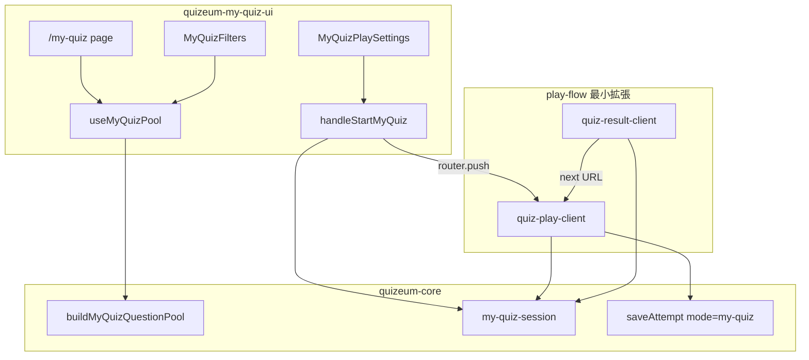
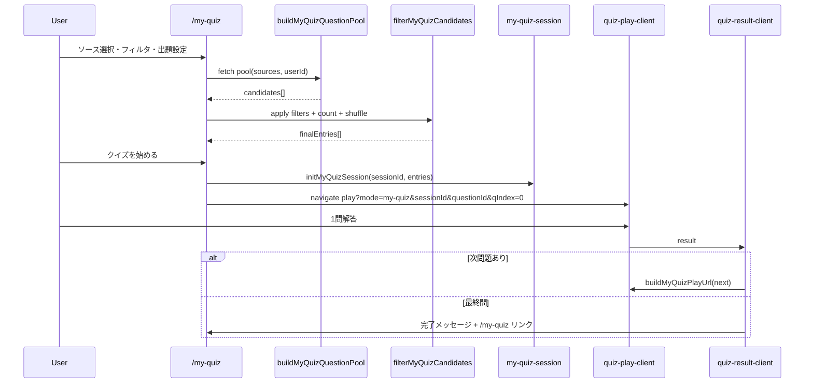

# 技術設計書: quizeum-my-quiz-ui

## Overview

**Purpose**: ログインユーザーが3ソース（自作・ブックマーククイズ・ブックマーク問題）から問題プールを合成し、フィルタ・出題数・シャッフルを指定してアドホック連続プレイを開始できる `/my-quiz` 画面を提供する。（Phase 26 でブックマークリストソースを除去）

**Users**: 学習者（プレイヤー）が、分散したブックマーク・自作問題を「カスタムクイズ」として横断的に復習・挑戦する。

**Impact**: 現状ソースごとに分断されていた問題探索（リストエディタ attach search、ブックマーク画面）を統合し、既存 `question-list` プレイエンジンを `mode=my-quiz` + アドホックセッションで再利用する。

### Goals

- `/my-quiz` ページと3ソーストグル UI
- 検索画面フィルタパターンを簡略化したフィルタパネル（キーワード・ジャンル・タグ・形式・難易度）
- 出題数（10 / 20 / 全件 / カスタム）・シャッフル・件数プレビュー
- `my-quiz-session` による `sessionStorage` セッション生成とプレイ起動
- `quiz-play-client` / `quiz-result-client` の最小拡張（`mode=my-quiz`）

### Non-Goals

- フィルタプリセット保存、URL 共有、Sidebar ナビ追加（他スペック）
- `buildMyQuizQuestionPool` 実装本体（`quizeum-core`）
- リスト探索 UI、クイズ編集、弱点克服統合
- 通常モード即時フィードバック（Phase 15）のカスタムクイズへの適用

---

## Boundary Commitments

### This Spec Owns

- **UI ルーティング**: `/my-quiz` ページ（RSC シェル + クライアント）
- **3ソース選択 UI**: チェックボックス群とプール再取得トリガ
- **フィルタ UI**: `MyQuizFilters` — 探索 UI の簡略版（`ExploreSearchSection` からジャンル/形式カルーセル・プレイ状況・sticky は除外）
- **出題設定 UI**: 出題数プリセット/カスタム、シャッフルトグル
- **クライアント側フィルタ**: `filterMyQuizCandidates` — キーワード・ジャンル・タグ・形式・難易度の AND 合成
- **プレイ開始フロー**: 最終出題リスト確定 → `initMyQuizSession` → 先頭問題 URL へ `router.push`
- **プレイ連携（最小・本スペック所有）**: `quiz-play-client.tsx` / `quiz-result-client.tsx` に `mode=my-quiz` 分岐追加（セッション読み取り・次問題遷移・完了導線）。`quizeum-play-flow-ui` は本フェーズ非変更
- **E2E**: `e2e/my-quiz.spec.ts`

### Out of Boundary

- **`quizeum-core`**: `buildMyQuizQuestionPool`、`my-quiz-session.ts` lib、`Attempt.mode: 'my-quiz'` 永続化、`saveAttempt` スキーマ
- **`quizeum-sidebar-layout`**: Sidebar / BottomNav「カスタムクイズ」項目
- **`quizeum-play-flow-ui`**: 通常プレイ・結果画面のコア UX。**本フェーズでは `quizeum-play-flow-ui` スペックは変更しない**。`quiz-play-client.tsx` / `quiz-result-client.tsx` への `mode=my-quiz` 最小分岐は **quizeum-my-quiz-ui** が所有（タスク 6–7）。play-flow との関係は coordination のみ
- **`quizeum-creator-dash-ui`**: `useQuestionAttachSearch` / リスト attach パネル（重複回避のため共有 lib 化は core が担当）

### Allowed Dependencies

| 依存                                                 | 用途                            | 必須度           |
| ---------------------------------------------------- | ------------------------------- | ---------------- |
| `quizeum-core` — `buildMyQuizQuestionPool`           | 3ソース統合取得                 | P0               |
| `quizeum-core` — `my-quiz-session`                   | sessionStorage CRUD + URL 生成  | P0               |
| `quizeum-core` — `saveAttempt` (`mode: 'my-quiz'`)   | 各問 attempt 記録               | P0               |
| `useAuth`                                            | ログインガード                  | P0               |
| `listActiveGenres` / `listActiveTags`                | フィルタ候補                    | P1               |
| `question-attach-search`                             | dedupe / keyword フィルタ再利用 | P1               |
| `home-feed-filters` 型・`ActiveFilterChips` パターン | フィルタ UI 整合                | P1               |
| `ExploreSearchSection` 内 `UnifiedSearchField`       | タグチップ入力                  | P2（部分再利用） |

### Revalidation Triggers

- `MyQuizQuestionCandidate` / `MyQuizSession` 形状変更
- `buildMyQuizQuestionPool` ソース契約変更（published 限定ルール等）
- `mode=my-quiz` URL クエリまたは attempt フィールド変更
- `question-list-session` とのキー衝突・統合方針変更

---

## Architecture

### Existing Architecture Analysis

- **Attach search（現状）**: `useQuestionAttachSearch` はタブ単位で own-published / bookmarked / public-explore の3ソース。カスタムクイズは4ソース統合 + public-explore 除外。
- **問題リストプレイ（現状）**: `question-list-session.ts` が `listId` + `entries[]` + `currentIndex` を `sessionStorage` に保持。URL は `mode=question-list&listId=&questionId=&qIndex=`。
- **プレイクライアント（現状）**: `questionListMode` 時は `questionIdParam` で1問のみ `playQuestions` に載せ、完了後 `quiz-result-client` が `advanceQuestionListSession` で次 URL へ。

### Architecture Pattern & Boundary Map

**Selected pattern**: Feature-sliced UI + Core lib 委譲。UI は候補取得を core に委ね、フィルタ・出題リスト確定はクライアント純関数。プレイは既存エンジン拡張。



### Technology Stack

| Layer    | Choice                          | Role in Feature              | Notes                                                 |
| -------- | ------------------------------- | ---------------------------- | ----------------------------------------------------- |
| Frontend | Next.js 16 App Router, React 19 | `/my-quiz` RSC + client      | ログインガードは client `useAuth` + middleware 補助可 |
| Styling  | Vanilla CSS Modules             | ページ・フィルタ・設定       | 探索 UI トークン再利用                                |
| State    | React hooks + sessionStorage    | プール・フィルタ・セッション | Firestore 書込なし                                    |
| Data     | Firebase via services           | ブックマーク・自作クイズ読取 | core lib がラップ                                     |

---

## File Structure Plan

### Directory Structure

```
src/
├── app/
│   └── my-quiz/
│       ├── page.tsx                    # RSC シェル、メタ、Suspense
│       ├── my-quiz-client.tsx          # 認証ガード、レイアウト、子コンポーネント合成
│       └── my-quiz.module.css          # ページスタイル
├── components/
│   └── my-quiz/
│       ├── my-quiz-source-panel.tsx    # 4ソースチェックボックス
│       ├── my-quiz-filters.tsx         # キーワード・ジャンル・タグ・形式・難易度
│       ├── my-quiz-play-settings.tsx   # 出題数・シャッフル
│       ├── my-quiz-preview-bar.tsx     # 件数プレビュー + 開始ボタン
│       └── my-quiz-source-panel.module.css  # 他 module.css は必要に応じ同階層
├── hooks/
│   └── useMyQuizPool.ts                # ソース+core pool 取得、フィルタ、出題リスト確定
├── lib/
│   └── my-quiz-filter.ts               # クライアント側 AND フィルタ（UI 専用）
└── app/quiz/[id]/
    ├── play/quiz-play-client.tsx         # 【変更】mode=my-quiz 分岐
    └── result/quiz-result-client.tsx     # 【変更】次問題/完了導線

tests/
├── lib/my-quiz-filter.test.ts          # フィルタ純関数
└── hooks/useMyQuizPool.test.tsx        # 出題数 clamp・shuffle（任意）

e2e/
└── my-quiz.spec.ts                     # スモーク E2E
```

### Modified Files Registry

本スペックが変更するファイルと、他スペック所有ファイルの境界を明示する。

| ファイル                                          | 所有者                 | 変更内容                                                                                   | 備考                                                     |
| ------------------------------------------------- | ---------------------- | ------------------------------------------------------------------------------------------ | -------------------------------------------------------- |
| `src/app/quiz/[id]/play/quiz-play-client.tsx`     | **quizeum-my-quiz-ui** | `myQuizMode` 分岐、`readMyQuizSession`、`playQuestions` 1問抽出、attempt `mode: 'my-quiz'` | play-flow coordination のみ。play-flow-ui スペック非変更 |
| `src/app/quiz/[id]/result/quiz-result-client.tsx` | **quizeum-my-quiz-ui** | `my-quiz` 次問題 URL、`buildMyQuizPlayUrl`、最終問完了 UI                                  | 同上（タスク 7）                                         |

### Core-Provided Files（本スペック外・前提）

- `src/lib/my-quiz-session.ts` — `quizeum-core` が新設（`question-list-session` 同型 + `sessionId`）
- `src/lib/my-quiz-pool.ts` — `buildMyQuizQuestionPool`, `MyQuizSourceFlags`, `MyQuizQuestionCandidate`

---

## System Flows

### カスタムクイズ開始〜連続プレイ



**Flow decisions**:
- セッション ID は `crypto.randomUUID()`（クライアント生成、保存リスト不要）
- 同一タブ内のみ有効（`sessionStorage`）。別タブ共有は非ゴール
- ウミガメのスープ問題は形式フィルタで除外可能（デフォルトフィルタなし＝含む。design 確定: **初版は除外しない**。ユーザーが形式フィルタで `lateral-thinking` を外せる）

---

## Requirements Traceability

| Requirement | Summary            | Components                               | Interfaces                           | Flows         |
| ----------- | ------------------ | ---------------------------------------- | ------------------------------------ | ------------- |
| 1.1–1.5     | 認証・ルーティング | `my-quiz-client`, `page.tsx`             | `useAuth`                            | —             |
| 2.1–2.7     | 4ソースプール      | `my-quiz-source-panel`, `useMyQuizPool`  | `buildMyQuizQuestionPool`            | pool fetch    |
| 3.1–3.12    | フィルタ           | `my-quiz-filters`, `my-quiz-filter.ts`   | `listActiveGenres`, `listActiveTags` | client filter |
| 4.1–4.8     | 出題設定           | `my-quiz-play-settings`, `useMyQuizPool` | —                                    | shuffle/slice |
| 5.1–5.6     | プレビュー・開始   | `my-quiz-preview-bar`                    | `initMyQuizSession`                  | start flow    |
| 6.1–6.7     | プレイ連携         | `quiz-play-client`, `quiz-result-client` | `my-quiz-session`, `saveAttempt`     | play sequence |
| 7.1–7.5     | E2E・UX            | skeleton, `e2e/my-quiz.spec.ts`          | —                                    | —             |

---

## Components and Interfaces

| Component             | Layer | Intent                     | Req | Key Dependencies                  |
| --------------------- | ----- | -------------------------- | --- | --------------------------------- |
| MyQuizPage            | UI    | `/my-quiz` シェル          | 1   | `useAuth`                         |
| MyQuizSourcePanel     | UI    | 4ソーストグル              | 2   | `useMyQuizPool`                   |
| MyQuizFilters         | UI    | 探索型フィルタ簡略版       | 3   | `UnifiedSearchField`, genres/tags |
| MyQuizPlaySettings    | UI    | 出題数・シャッフル         | 4   | —                                 |
| MyQuizPreviewBar      | UI    | 件数表示・開始             | 5   | `useMyQuizPool`                   |
| useMyQuizPool         | Hook  | プール取得・フィルタ・確定 | 2–5 | core pool lib                     |
| my-quiz-filter        | Lib   | クライアント AND フィルタ  | 3   | `question-attach-search` keyword  |
| MyQuizPlayIntegration | Play  | mode=my-quiz 分岐          | 6   | `my-quiz-session`                 |

### Hook Layer

#### useMyQuizPool

| Field        | Detail                                                                                    |
| ------------ | ----------------------------------------------------------------------------------------- |
| Intent       | ソースフラグ・フィルタ状態・出題設定を保持し、core からプール取得→フィルタ→出題リスト確定 |
| Requirements | 2, 3, 4, 5                                                                                |

**State model**:
```typescript
interface MyQuizSourceFlags {
  ownQuizzes: boolean;
  bookmarkedQuizzes: boolean;
  bookmarkedLists: boolean;
  bookmarkedQuestions: boolean;
}

interface MyQuizFilterState {
  keyword: string;
  genreId: string;
  tagChips: string[];
  format: QuizFormat | '';
  difficultyMin: number;
  difficultyMax: number;
}

interface MyQuizPlaySettings {
  countPreset: '10' | '20' | 'all' | 'custom';
  customCount: number;
  shuffle: boolean;
}
```

**Contracts**: State [x]

- `filteredCount`: フィルタ後件数
- `effectivePlayCount`: clamp 後出題数
- `buildFinalEntries(): MyQuizSessionEntry[]` — シャッフル/スライス適用
- `loading` / `error` / `refetch()`

**Implementation Notes**:
- ソース変更時に core `buildMyQuizQuestionPool(userId, flags)` を呼ぶ
- フィルタは取得済み `rawCandidates` に対し `filterMyQuizCandidates` を適用（再フェッチ不要）
- 安定順: ソース priority（own → bq → bl → bqst）→ `parentQuizTitle` → `questionId`

### Core Contracts（Allowed Dependency — quizeum-core 実装）

#### buildMyQuizQuestionPool

```typescript
export type MyQuizSource = 'own' | 'bookmarked-quiz' | 'bookmarked-list' | 'bookmarked-question';

export interface MyQuizQuestionCandidate {
  questionId: string;
  questionText: string;
  parentQuizId: string;
  parentQuizTitle: string;
  source: MyQuizSource;
  genreId: string;
  tags: string[];
  format: QuizFormat;
  difficulty: number; // 親クイズ difficulty 1-5
}

export interface MyQuizSourceFlags {
  ownQuizzes: boolean;
  bookmarkedQuizzes: boolean;
  bookmarkedLists: boolean;
  bookmarkedQuestions: boolean;
}

export async function buildMyQuizQuestionPool(
  userId: string,
  flags: MyQuizSourceFlags
): Promise<MyQuizQuestionCandidate[]>;
```

**Source rules**:
- **own**: `searchAuthorQuizzes({ authorId, includeDrafts: true })` → 全 status のクイズから `getQuestionsByQuiz`
- **bookmarked-quiz**: `getBookmarkedQuizzes` → published のみ → 各クイズの全問題
- **bookmarked-list**: `getBookmarkedLists` → `listType: 'quiz'` のみ → `getQuizzesInList` → published クイズの問題（問題リストは除外）
- **bookmarked-question**: `enrichBookmarkedQuestions` → 公開親のみ
- Dedupe: `questionId` 先勝ち（`dedupeQuestionCandidates` 再利用）

#### my-quiz-session

```typescript
export const MY_QUIZ_SESSION_KEY = 'quizeum_my_quiz_session';

export interface MyQuizSessionEntry {
  questionId: string;
  parentQuizId: string;
}

export interface MyQuizSession {
  sessionId: string;
  entries: MyQuizSessionEntry[];
  currentIndex: number;
}

export function initMyQuizSession(sessionId: string, entries: MyQuizSessionEntry[]): void;
export function readMyQuizSession(): MyQuizSession | null;
export function syncMyQuizSessionIndex(index: number): void;
export function advanceMyQuizSession(): MyQuizSessionEntry | null;
export function peekNextMyQuizEntry(): MyQuizSessionEntry | null;
export function clearMyQuizSession(): void;
export function buildMyQuizPlayUrl(session: MyQuizSession, index: number): string;
```

**URL contract**:
```
/quiz/{parentQuizId}/play?mode=my-quiz&sessionId={uuid}&questionId={id}&qIndex={n}
```

Postconditions: `readMyQuizSession()?.sessionId === sessionId` かつ URL `qIndex` と `currentIndex` 同期（`question-list` と同型）。

### UI Layer

#### MyQuizFilters

| Field        | Detail                                                                                      |
| ------------ | ------------------------------------------------------------------------------------------- |
| Intent       | 探索フィルタの簡略版。`ExploreSearchSection` から難易度スライダー・形式カルーセル相当を抽出 |
| Requirements | 3.1–3.12                                                                                    |

**Reuse strategy**:
- タグ: `UnifiedSearchField`（タグチップのみ、ジャンルサジェスト統合は無効化可）
- ジャンル: `GenreSearchField` またはセレクト1件
- 形式: `FormatCarousel` の1行版または `<select>`（モバイル配慮）
- 難易度: 探索パネルと同型レンジ（1–5）
- アクティブチップ: `ActiveFilterChips` を `MyQuizFilterState` アダプタで再利用

#### MyQuizPlaySettings

- ラジオ: 10 / 20 / 全件 / カスタム（数値 input）
- チェックボックス: シャッフル（default true）
- `effectivePlayCount` を親 hook から受け取り表示

### Play Integration（最小拡張 — quizeum-my-quiz-ui 所有、play-flow-ui 非変更）

`mode=my-quiz` 分岐は本スペック（タスク 6–7）が `quiz-play-client` / `quiz-result-client` に直接追加する。`quizeum-play-flow-ui` スペック・要件書は本フェーズでは更新しない。

#### quiz-play-client 変更点

| Field        | Detail                                              |
| ------------ | --------------------------------------------------- |
| Intent       | `mode=my-quiz` 時に `readMyQuizSession` で1問プレイ |
| Requirements | 6.1, 6.4–6.6                                        |

```typescript
const myQuizMode = rawMode === 'my-quiz';
// playQuestions: myQuizMode && questionIdParam → 1問抽出（question-list と同型）
// buildAttemptData: mode 'my-quiz', sessionId from query, totalQuestions: 1
// useEffect: syncMyQuizSessionIndex(qIndex) when sessionId matches
```

#### quiz-result-client 変更点

| Field        | Detail                                                                |
| ------------ | --------------------------------------------------------------------- |
| Intent       | 結果完了後 `peekNextMyQuizEntry` → `buildMyQuizPlayUrl` または完了 UI |
| Requirements | 6.2, 6.3, 6.5                                                         |

- 既存 `question-list-next` ボタンパターンを `my-quiz-next` として並行追加
- 最終問: 「カスタムクイズを完了」+ `Link href="/my-quiz"`

---

## Data Models

### Domain Model

- **MyQuizQuestionCandidate**: UI 表示・フィルタ用フラット候補（core 提供）
- **MyQuizSession**: エフェメラルプレイ順序（`sessionStorage`、タブスコープ）
- 永続化なし（プリセット・URL 状態なし）

### Logical Data Model

```
User ──selects──> MyQuizSourceFlags
MyQuizSourceFlags ──buildMyQuizQuestionPool──> Candidate[]
Candidate[] ──filterMyQuizCandidates──> Filtered[]
Filtered[] ──slice/shuffle──> MyQuizSessionEntry[]
MyQuizSessionEntry[] ──initMyQuizSession──> MyQuizSession (sessionStorage)
```

---

## Error Handling

| Category                   | Response                                    |
| -------------------------- | ------------------------------------------- |
| 未ログイン                 | `/login?redirect=/my-quiz`                  |
| プール取得失敗             | インラインエラー + 再試行ボタン             |
| ソース未選択               | 空状態案内、開始ボタン disabled             |
| フィルタ後0件              | 空状態 + フィルタ緩和案内                   |
| セッション欠落（プレイ中） | プレイ/結果画面でエラー + `/my-quiz` リンク |
| 親クイズ非公開（edge）     | core pool 構築時に除外（UI では表示しない） |

---

## Testing Strategy

### Unit Tests

1. `filterMyQuizCandidates` — ジャンル・タグ AND・難易度レンジ・形式・キーワード合成
2. `resolveEffectivePlayCount` — clamp、全件、0件
3. `shuffleEntries` — 同一 seed で決定論的テスト（optional mock Math.random）

### Integration Tests

1. `useMyQuizPool` — ソース変更で core mock が期待回数呼ばれる
2. `buildMyQuizPlayUrl` — core lib の URL 形状（core 側テストが正本、UI は import smoke）

### E2E (`e2e/my-quiz.spec.ts`)

1. ログイン → `/my-quiz` 表示、`data-testid="my-quiz-page"`
2. デフォルトソースでプレビュー件数 > 0（シードデータ依存、0 件時 skip）
3. 出題数 10・開始 → URL に `mode=my-quiz`
4. 1問解答 → 結果画面 → 次問題または完了導線

---

## Security Considerations

- ログイン必須。他ユーザーの自作クイズは own ソースに含めない（`authorId === userId`）
- ブックマークソースは published 親のみ（core  enforced）
- `sessionStorage` のセッションは改ざん可能だが、プレイは公開問題のみ・1問ずつ server-side quiz fetch — 権限昇格リスクは低
- XSS: 問題文表示は既存 `QuestionTextDisplay` / sanitize 経由

---

## Supporting References

- 既存 `question-list-session.ts` — セッション API の模倣正本
- `quizeum-play-flow-ui` 要件 11 — 問題リストプレイ URL・attempt 契約
- Phase 23 roadmap — 4ソース定義、BottomNav は sidebar-layout が別途決定

---

## Phase 26: ブックマークリストソースの除去

### 1. Overview

カスタムクイズの問題取得元を **4ソース → 3ソース** に縮小する。「ブックマークリスト」トグルと `bookmarkedLists` / `bookmarked-list` ラベルを除去し、`quizeum-core` の `buildMyQuizQuestionPool`（3フラグ）と整合させる。`my-quiz` プレイ体験は維持する。

### 2. Boundary Commitments（Phase 26）

| Owns                             | Out                                    |
| -------------------------------- | -------------------------------------- |
| `my-quiz-source-panel` 3トグル化 | `buildMyQuizQuestionPool` 実装（core） |
| フィルタ表の取得元ラベル更新     | リスト機能全般                         |

### 3. Data Model

```typescript
// my-quiz-source-panel.tsx
export type MyQuizSourceKey =
  | 'own'
  | 'bookmarkedQuizzes'
  | 'bookmarkedQuestions';
  // 'bookmarkedLists' 削除
```

`MyQuizPoolFlags`（core）とキー名を1:1対応させる。

### 4. File Structure Plan（Phase 26）

| ファイル                                            | 操作       | 責務                           |
| --------------------------------------------------- | ---------- | ------------------------------ |
| `src/components/my-quiz/my-quiz-source-panel.tsx`   | **Modify** | 3トグル                        |
| `src/components/my-quiz/my-quiz-filtered-table.tsx` | **Modify** | `bookmarked-list` ラベル削除   |
| `src/hooks/useMyQuizPool.ts`                        | **Modify** | flags 型縮小                   |
| `tests/lib/my-quiz-pool.test.ts`                    | **Modify** | core 側と連携                  |
| `tests/components/my-quiz/*.test.tsx`               | **Modify** | 3ソース                        |
| `e2e/my-quiz.spec.ts`                               | **Modify** | `bookmarked-list` シナリオ削除 |

### 5. UI Behavior

- ページ説明文: 「4ソース」→「3ソース」
- デフォルト有効ソース: Phase 23 同様（`own` + `bookmarkedQuizzes` 等 — 実装現状を維持、design で変更不要ならそのまま）
- `getBookmarkedLists` の import・呼び出しをコードベースから除去

### 6. Requirements Traceability（Phase 26）

| Req | Summary          | Component                |
| --- | ---------------- | ------------------------ |
| 8.1 | リストトグル削除 | `my-quiz-source-panel`   |
| 8.2 | デフォルトソース | 同上 + hook              |
| 8.3 | pool flags       | `useMyQuizPool`          |
| 8.4 | テーブルラベル   | `my-quiz-filtered-table` |
| 8.5 | API 呼び出し禁止 | import 掃除              |
| 8.8 | テスト更新       | tests / e2e              |

### 7. Testing Strategy（Phase 26）

| 種別          | 検証                                       |
| ------------- | ------------------------------------------ |
| **Component** | ソースパネル — 3 `data-testid` のみ        |
| **Unit**      | `useMyQuizPool` — `bookmarkedLists` 未送信 |
| **E2E**       | カスタムクイズ起動フロー（3ソースで回帰）  |

**Effort**: **S**（0.5〜1日、Core 完了後）

**Document Status（Phase 26 設計）**: 本節に反映。Overview の「4ソース」記述は実装時に **3ソース** へ更新すること。
