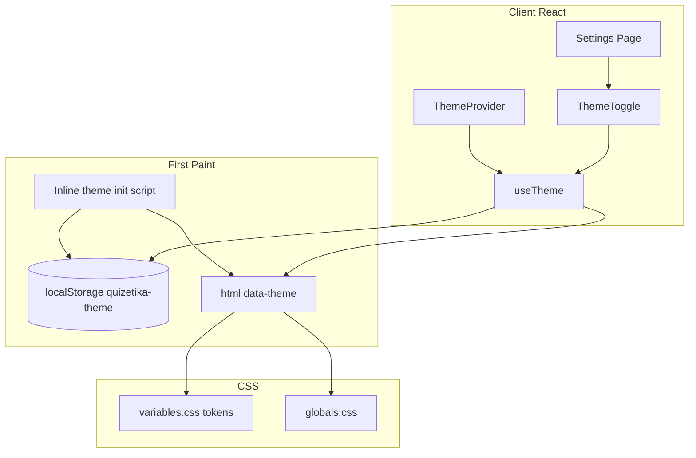
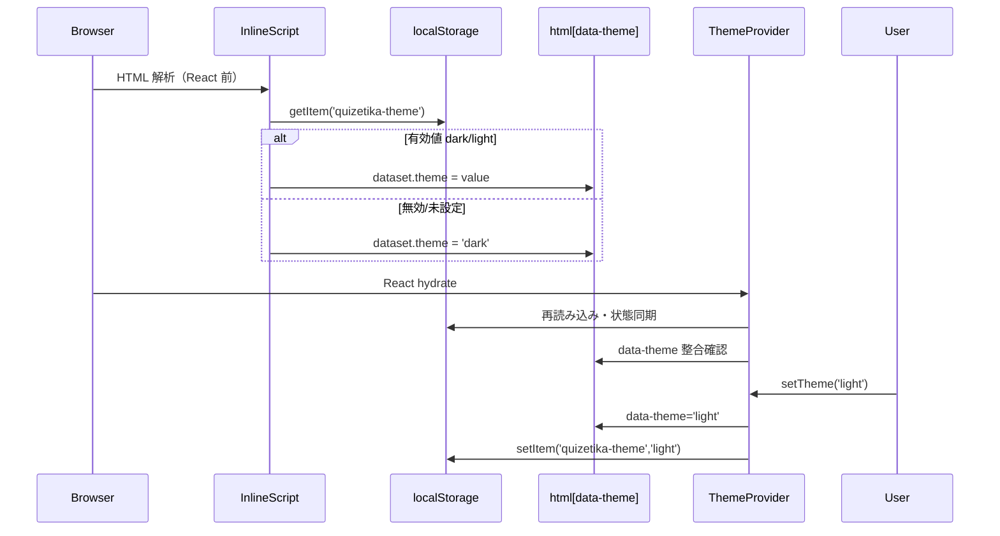
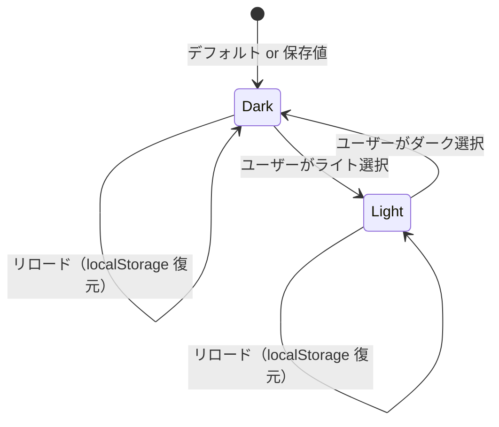

# Design Document: quizetika-user-settings-ui

## Overview
本機能は Quizetika に **ユーザー設定ページ**（`/settings`）と **アプリ横断のテーマシステム**（ダーク / ライト）を導入する。`ThemeProvider` と `<html data-theme>` による CSS 変数切替、`localStorage` キー `quizetika-theme` による永続化、初回描画時のフラッシュ防止を実装し、設定画面からテーマ切替とプロフィール編集（`/profile/edit`）への導線を提供する。

**Phase 23（2026-06-09）**: 設定は Sidebar アカウントポップアップからの到達を想定するが、ポップアップへの「設定」項目追加は `quizetika-sidebar-layout` が `/settings` ルート確定後に実装する。本スペックはページ本体とテーマ基盤を所有する。

### Goals
- `ThemeProvider` / `useTheme` によるクライアントテーマ状態管理
- `<html data-theme="dark|light">` と `variables.css` トークン二系統によるテーマ切替
- `localStorage`（`quizetika-theme`）永続化と inline script によるフラッシュ防止
- `/settings` ページ（テーマトグル + プロフィール編集リンク）
- ライトテーマ用トークン整備と `globals.css` のテーマ依存スタイル調整

### Non-Goals
- Sidebar / BottomNav ポップアップへの「設定」リンク（`quizetika-sidebar-layout`）
- プロフィール編集フォーム（`quizetika-auth-profile-ui`）
- サーバー側設定永続化、`prefers-color-scheme` 追従
- 通知・言語・アクセシビリティ設定

---

## Boundary Commitments

### This Spec Owns
- `src/context/theme-context.tsx`（`ThemeProvider`, `useTheme`）
- `src/lib/theme.ts`（定数、localStorage 読み書き、検証ヘルパー）
- `layout.tsx` への `ThemeProvider` 統合と inline theme init script（Provider ツリー順序は下記 Coordination 参照）
- `variables.css` の `[data-theme="light"]` 整備、必要な `[data-theme="dark"]` / `:root` 整理
- `globals.css` のテーマ依存スタイル調整（**theme-only scope**: テーマ切替に必要な body 背景・フォーム focus 等のみ。シェル構造・Sidebar レイアウトは対象外）
- `/settings` App Router ルートと設定 UI コンポーネント
- Jest（theme lib / ThemeToggle）、Playwright E2E（テーマ切替・永続化）

### Out of Boundary
- Sidebar フッターアカウントポップアップの「設定」`popupItem`（`quizetika-sidebar-layout`）
- `/profile/edit` のフォーム・保存ロジック（`quizetika-auth-profile-ui`）
- `docs/screen_transition.md` 更新（Phase 23 直接実装候補）

### Allowed Dependencies
- **`useAuth`**（`@/context/auth-context`）: ログイン状態判定、プロフィール編集リンク出し分け（P0）
- **`AuthProvider` 配下の Provider 順序**: `ThemeProvider` は `AuthProvider` と並列または内側で children を包む（P0）
- **`next/link` / `next/navigation`**: プロフィール編集遷移（P1）
- **@mui/icons-material**: 設定ページ・トグル用アイコン（P2）
- **既存 CSS ユーティリティ**（`glass-card`, `btn` 等）: 設定ページスタイル（P1）

### Revalidation Triggers
- `quizetika-theme` キー名または許可値（`dark` | `light`）の変更
- `data-theme` 属性名・トークン変数名の変更（全画面 CSS 影響）
- `/settings` ルートパス変更（sidebar-layout の href 同期が必要）
- `layout.tsx` Provider ツリー構造の変更

---

## Architecture

### Existing Architecture Analysis
- `variables.css` の `:root` にダークトークンが定義済み。`[data-theme='light']` ブロックはプレースホルダーとして存在するが、全画面でライト表示を検証した実績はない。
- `globals.css` の `body` 背景は `rgba(157, 78, 221, ...)` 等のハードコードグラデーションを含み、ライトテーマ時に不整合が生じる可能性がある。
- `layout.tsx` は Server Component。`AuthProvider` → `LayoutWrapper` の構造。テーマ Provider は未導入。
- Sidebar ポップアップ（`sidebar.tsx`）は「プロフィール」「ログアウト」のみ。`popupItem` + `glass-card` パターンが確立済み（sidebar-layout design 参照）。

### Architecture Pattern & Boundary Map
テーマは **DOM 属性 + CSS 変数** を唯一の描画ソースとし、React Context は UI 同期とユーザー操作の入口とする。初回描画は **inline script** で `localStorage` を同期的に読み、`document.documentElement.dataset.theme` を設定してフラッシュを防ぐ。



### Technology Stack

| Layer       | Choice / Version                      | Role in Feature                       | Notes                  |
| :---------- | :------------------------------------ | :------------------------------------ | :--------------------- |
| Frontend    | Next.js 16.2.6 (App Router)           | `/settings` ルート、`layout.tsx` 統合 | RSC + Client 分離      |
| State       | React Context                         | `ThemeProvider` / `useTheme`          | `auth-context` と同型  |
| Persistence | `localStorage`                        | テーマ永続化                          | キー `quizetika-theme` |
| UI/Styling  | Vanilla CSS (CSS Modules + variables) | テーマトークン、設定ページ            | Tailwind 不使用        |
| Icons       | Material Icons                        | 太陽 / 月アイコン等                   |                        |

---

## File Structure Plan

### Directory Structure
```
src/
├── app/
│   ├── layout.tsx                      # [MODIFY] ThemeProvider、inline script、suppressHydrationWarning
│   ├── globals.css                     # [MODIFY] body 背景・ハードコード色のテーマ対応
│   └── settings/
│       ├── page.tsx                    # [NEW] サーバーコンポーネント（タイトル・Suspense）
│       ├── settings-client.tsx         # [NEW] クライアントページ本体
│       └── settings.module.css         # [NEW] ページレイアウト
├── context/
│   └── theme-context.tsx               # [NEW] ThemeProvider, useTheme
├── components/
│   └── settings/
│       ├── theme-toggle.tsx            # [NEW] ダーク/ライト切替 UI
│       └── theme-toggle.module.css
├── lib/
│   └── theme.ts                        # [NEW] THEME_STORAGE_KEY, parseTheme, read/write helpers
└── styles/
    └── variables.css                   # [MODIFY] light/dark トークン整備

tests/
├── lib/
│   └── theme.test.ts                   # [NEW] parseTheme, storage helpers
└── components/
    └── settings/
        └── theme-toggle.test.tsx       # [NEW]

e2e/
└── user-settings.spec.ts               # [NEW] テーマ切替・localStorage 永続化
```

### Modified Files（本スペック実装範囲外だが依存・連携）
- `src/components/layout/sidebar.tsx` — **`quizetika-sidebar-layout`** が「設定」`popupItem`（`/settings`）をプロフィールとログアウトの間に追加

### Coordination: layout.tsx 所有境界

| 関心                                                                    | 所有者                         | 内容                                                                                              |
| ----------------------------------------------------------------------- | ------------------------------ | ------------------------------------------------------------------------------------------------- |
| アプリシェル構造（Sidebar / Header / BottomNav / `LayoutWrapper` 骨格） | **quizetika-sidebar-layout**   | ナビ・レスポンシブシェル。本スペックは変更しない                                                  |
| Provider ツリー・テーマ基盤                                             | **quizetika-user-settings-ui** | `PostHogProvider` → `AuthProvider` → `ThemeProvider` → `LayoutWrapper` の順序で children を包む   |
| 初回描画フラッシュ防止                                                  | **quizetika-user-settings-ui** | `<head>` 内 inline theme init script、`suppressHydrationWarning`                                  |
| `globals.css` 変更範囲                                                  | **quizetika-user-settings-ui** | **theme-only scope** — body 背景グラデーション・フォーム focus 等、テーマ切替に必要なスタイルのみ |

`layout.tsx` への `ThemeProvider` / script 追加は本スペックが実施するが、シェル DOM 構造の正本は sidebar-layout に留まる。両スペックは Provider 順序と `<html>` 属性について coordination する。

---

## System Flows

### 初回描画とフラッシュ防止



### 設定ページでのテーマ切替



---

## Requirements Traceability

| Requirement | Summary                 | Components                                      | Interfaces                 | Flows      |
| :---------- | :---------------------- | :---------------------------------------------- | :------------------------- | :--------- |
| **1.1–1.4** | 設定ページ基本表示      | `SettingsPage`, `SettingsClient`                | page shell                 | -          |
| **2.1–2.7** | テーマ切替 UI・CSS 変数 | `ThemeToggle`, `ThemeProvider`, `variables.css` | `Theme`, `setTheme`        | テーマ切替 |
| **3.1–3.4** | localStorage 永続化     | `theme.ts`, `ThemeProvider`                     | `THEME_STORAGE_KEY`        | 初回描画   |
| **4.1–4.3** | フラッシュ防止          | inline script, `layout.tsx`                     | sync init                  | 初回描画   |
| **5.1–5.5** | プロフィール編集導線    | `SettingsClient`                                | `useAuth`, `/profile/edit` | -          |
| **6.1–6.3** | グローバル Provider     | `ThemeProvider`, `useTheme`                     | `ThemeContext`             | テーマ切替 |

---

## Components and Interfaces

| Component        | Domain/Layer | Intent                             | Req Coverage | Key Dependencies          | Contracts      |
| :--------------- | :----------- | :--------------------------------- | :----------- | :------------------------ | :------------- |
| `theme.ts`       | Lib          | 定数・検証・storage ヘルパー       | 3, 4         | -                         | Pure functions |
| `ThemeProvider`  | Context      | テーマ状態と DOM/localStorage 同期 | 2, 3, 4, 6   | `theme.ts`                | State          |
| `useTheme`       | Hook         | テーマ読み書き API                 | 6            | `ThemeProvider`           | State          |
| inline script    | Layout       | 初回同期 `data-theme`              | 4            | `theme.ts` 定数と同一キー | -              |
| `ThemeToggle`    | UI           | ダーク/ライト選択 UI               | 2            | `useTheme`                | State          |
| `SettingsClient` | UI           | 設定ページ本体                     | 1, 5         | `useAuth`, `ThemeToggle`  | -              |

### Lib: theme.ts

```typescript
export type Theme = 'dark' | 'light';

export const THEME_STORAGE_KEY = 'quizetika-theme';
export const DEFAULT_THEME: Theme = 'dark';

export function parseTheme(value: string | null): Theme;
export function readStoredTheme(): Theme;
export function writeStoredTheme(theme: Theme): void;
```

- `parseTheme`: `dark` / `light` 以外は `DEFAULT_THEME` を返す
- `readStoredTheme` / `writeStoredTheme`: `typeof window` ガード、`localStorage` 例外時はデフォルトまたはサイレントフォールバック

### Context: ThemeProvider

```typescript
interface ThemeContextValue {
  theme: Theme;
  setTheme: (theme: Theme) => void;
}

export function ThemeProvider({ children }: { children: React.ReactNode }): JSX.Element;
export function useTheme(): ThemeContextValue;
```

**Responsibilities**:
- マウント時に `readStoredTheme()` で初期化し `document.documentElement.dataset.theme` と一致させる
- `setTheme` で Context、`data-theme`、`localStorage` を同時更新
- `useLayoutEffect` で初回 DOM 同期（inline script との二重適用は同一値なら問題なし）

### Inline Theme Init Script（layout.tsx）

`theme.ts` と **同一のキー名・許可値** を inline script 内に埋め込む（バンドル不可のため文字列テンプレートで生成、または `lib/theme-init-script.ts` で export して layout から注入）。

```javascript
(function () {
  try {
    var k = 'quizetika-theme';
    var v = localStorage.getItem(k);
    var t = v === 'light' ? 'light' : 'dark';
    document.documentElement.dataset.theme = t;
  } catch (e) {
    document.documentElement.dataset.theme = 'dark';
  }
})();
```

- `<html lang="ja" suppressHydrationWarning>` を設定
- script は `<head>` 内、スタイルシートより前または直後に配置

### UI: ThemeToggle

- ラジオボタングループまたはスイッチで「ダーク」「ライト」を選択
- `data-testid="settings-theme-toggle"` をルートに付与
- 選択変更で `setTheme` を呼ぶ
- `glass-card` 内セクションとして Settings ページに配置

### UI: Settings Page

- Server `page.tsx`: タイトル「設定」、説明、Suspense
- Client `settings-client.tsx`:
  - `data-testid="settings-page-container"`
  - 「表示テーマ」セクション + `ThemeToggle`
  - ログイン時: `data-testid="settings-profile-edit-link"` で `/profile/edit` リンク
  - 未ログイン: プロフィールリンク非表示またはログイン誘導

---

## Data Models

### Client-Only Theme Preference

| Field             | Type                | Storage        | Notes            |
| :---------------- | :------------------ | :------------- | :--------------- |
| `quizetika-theme` | `'dark' \| 'light'` | `localStorage` | サーバー同期なし |

### CSS Token Strategy

| Selector                       | Role                               |
| :----------------------------- | :--------------------------------- |
| `:root`, `[data-theme='dark']` | ダークトークン（既存 neon dark）   |
| `[data-theme='light']`         | ライトトークン（紫アクセント維持） |

`variables.css` の既存 `[data-theme='light']` をベースに、`--text-inverse`、`--border-glow` 等の不足トークンをライト向けに補完する。

`globals.css` 調整例:
- `body` の `radial-gradient` を CSS 変数化、または `[data-theme='light']` 下で弱いグラデーションに上書き
- `.form-input:focus` の `background: rgba(20, 16, 36, 0.9)` 等ハードコードを `var(--bg-input)` へ寄せる（ライトで破綻しないよう）

---

## Error Handling

### Error Strategy
- **localStorage 不可**（プライベートモード等）: テーマはセッション内の `data-theme` + Context のみ。エラー UI は出さず `dark` デフォルト継続。
- **useTheme を Provider 外で呼び出し**: 開発時エラー throw（`auth-context` と同型）。
- **不正 storage 値**: `parseTheme` で `dark` にフォールバック。ユーザー操作で正値を再保存。

---

## Testing Strategy

### Unit Tests
- `theme.test.ts`: `parseTheme` の valid/invalid/null、`readStoredTheme` / `writeStoredTheme` モック
- `theme-toggle.test.tsx`: クリックで `setTheme` 呼び出し、active 状態表示

### E2E（`e2e/user-settings.spec.ts`）
- `/settings` 直接アクセスで `settings-page-container` 表示
- ライト選択 → `html[data-theme="light"]`、主要背景色の変化（computed style またはスクリーンショット代替の class 検証）
- リロード後も `localStorage.getItem('quizetika-theme') === 'light'` かつ `data-theme` 維持
- ログインユーザーで `settings-profile-edit-link` → `/profile/edit` 遷移（Emulator シード使用）

### ナビ導線 E2E
- Sidebar ポップアップ「設定」→ `/settings` は **`quizetika-sidebar-layout` の E2E** で検証。本スペック E2E は URL 直接アクセスを正とする。

---

## Supporting References

### Sidebar ポップアップ連携（quizetika-sidebar-layout）

`sidebar.tsx` の既存パターン:

```tsx
<Link href={`/profile/${user.id}`} className={styles.popupItem}>
  <UserIcon size={18} />
  <span>プロフィール</span>
</Link>
<hr className={styles.divider} />
```

sidebar-layout Phase 23 で同型の「設定」項目を **プロフィールの下・divider の上** に追加する想定:

```tsx
<Link href="/settings" className={styles.popupItem} data-testid="sidebar-settings-link">
  <SettingsIcon sx={{ fontSize: 18 }} />
  <span>設定</span>
</Link>
```

本スペックは `/settings` ルートとページを提供する。リンク追加は sidebar-layout の責務。
