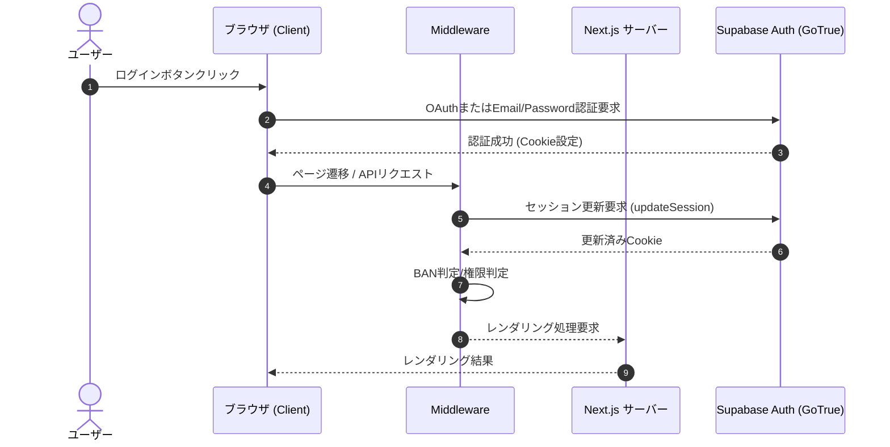

# Design Document - supabase-auth-migration

## Overview
本機能設計は、Quizetika の認証システムを従来の Firebase Auth から Supabase Auth へ完全移行するための共通インタフェースと認証コンテキスト、ミドルウェア、API アクセストークン検証を設計します。

### Goals
- 認証セッション管理と Cookie 連携を `@supabase/ssr` ベースに置き換える。
- クライアントサイドでの認証状態変更検知およびデータベースプロフィールとの同期。
- ミドルウェアでのセッション自動更新と、BAN判定・権限判定ルートガードの維持。
- API ルート用のアクセストークン（Bearer JWT）署名検証。

### Non-Goals
- アプリケーション全体のデータベースクエリ（Firestore から Supabase PostgreSQL）の切り替え（`supabase-core-data` スペックが担当）。
- 既存ユーザー認証情報の移行。

## Boundary Commitments

### This Spec Owns
- 認証ライフサイクル管理 (Sign In, Sign Up, Sign Out, Session state)
- クライアント Cookie 同期および Next.js Middleware におけるセッション更新フロー
- API トークンのサーバーサイド検証
- ログイン画面における Supabase 認証の呼び出し

### Out of Boundary
- サービス層（`src/services/`）におけるデータベースクエリの移行
- UI レイアウトの大幅な改修
- 静的アセット（画像等）のストレージ移行

### Allowed Dependencies
- `supabase-foundation` 仕様で定義された Supabase クライアントファクトリ (`src/lib/supabase/client.ts`, `server.ts`, `middleware.ts`)

### Revalidation Triggers
- 認証 Cookie 名の変更
- トークン検証メソッドのシグネチャ変更
- ミドルウェア処理順序の変更

## Architecture

認証フロー全体の結合および遷移図を示します。



### Technology Stack
- **Authentication**: Supabase Auth (GoTrue)
- **SSR Helper**: `@supabase/ssr` (v0.5.x)
- **Token Verification**: JsonWebToken (Supabase JWT Secret による直接署名検証、または `supabase.auth.getUser()`)

## File Structure Plan

### Directory Structure
```
src/
├── app/
│   └── login/
│       └── page.tsx                # [MODIFY] ログイン画面 UI
├── context/
│   └── auth-context.tsx            # [MODIFY] Supabase Auth に完全移行
├── lib/
│   ├── firebase/
│   │   ├── auth.ts                 # [DELETE] 削除
│   │   └── auth-verify.ts          # [DELETE] 削除
│   └── supabase/
│       ├── auth.ts                 # [NEW] 認証処理ラッパー
│       └── auth-verify.ts          # [NEW] API用のアクセストークン検証モジュール
├── middleware.ts                   # [MODIFY] updateSession を組み込み
```

### Modified Files Detail
- **`src/app/login/page.tsx`**: Firebase の OAuth / メール認証呼び出しを `src/lib/supabase/auth.ts` の関数群に置換する。
- **`src/context/auth-context.tsx`**:
  - `onAuthStateChanged` から `supabase.auth.onAuthStateChange` に切り替える。
  - セッション情報更新に合わせて Firestore (および将来の Supabase PG) プロフィールをフェッチし、同期 Cookie を出力。
- **`src/middleware.ts`**: `src/lib/supabase/middleware.ts` から `updateSession(request)` を呼び出すように変更し、セッション Cookie 更新を実行した後に従来の認可チェックを実行する。
- **`src/services/ai-authoring-route-helpers.ts` などの API Route**:
  - `verifyFirebaseIdToken` を `verifySupabaseAccessToken` に置き換える。

## Components and Interfaces

### `src/lib/supabase/auth.ts`
認証処理を実行するためのラッパーユーティリティ。

```typescript
export async function signInWithGoogle(): Promise<{ error: Error | null }>;
export async function signInWithTwitter(): Promise<{ error: Error | null }>;
export async function signInWithMicrosoft(): Promise<{ error: Error | null }>;
export async function signInWithEmail(email: string, password: string): Promise<{ error: Error | null }>;
export async function signUpWithEmail(email: string, password: string): Promise<{ error: Error | null }>;
export async function signOut(): Promise<{ error: Error | null }>;
```

### `src/lib/supabase/auth-verify.ts`
リクエストヘッダーからトークンを抽出し、署名検証を行います。

```typescript
export async function verifySupabaseAccessToken(token: string | null): Promise<string | null>;
```
- `verifySupabaseAccessToken` は、渡された Bearer Token に対し、`supabase.auth.getUser(token)` を呼び出して正当性を確認し、ユーザーの `id` (UID) を返します。無効なトークンの場合は `null` を返します。

## Testing Strategy

### Unit Tests
- `auth-verify.ts` のユニットテスト:
  - 正当な Supabase アクセストークンを模した JWT が渡されたとき、`getUser()` のモックが正しいユーザーIDを返すこと。
  - 署名が無効なトークンが渡されたとき、`null` が返ること。

### Integration Tests
- ログイン API ルートテスト:
  - 認証済みリクエストをモックし、API ルートが正しいレスポンスを返すこと。
  - テスト対象となる API ルート（`ai-authoring`、`give-up-lateral` 等）内の `verifyFirebaseIdToken` を `verifySupabaseAccessToken` のモックに差し替え、疎通を確認すること。

### Manual Verification
- 開発環境（Docker ローカル Supabase）を用いて、Google またはダミー認証（Email/Password）を実行し、正常に `auth-context` が更新され、マイページへのリダイレクトが成功すること。
- BAN クッキーの有効期間およびミドルウェアでの検知リダイレクトが動作すること。
