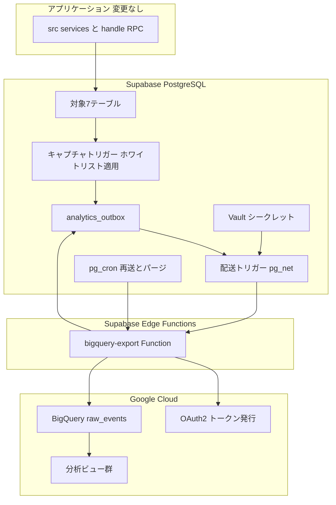
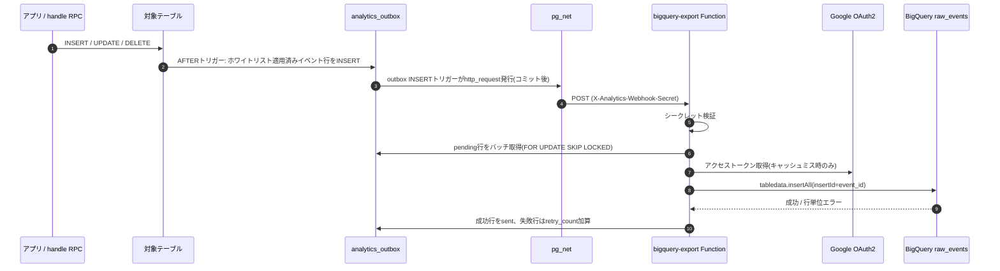
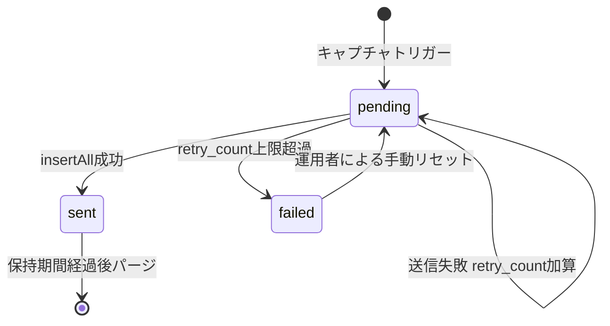

# Design Document: supabase-bigquery-export

## Overview

**Purpose**: 本機能は、Firebase→Supabase移行で断絶したBigQuery分析データパイプラインを再構築し、AI学習データとしての外部提供（販売）に耐えるデータ蓄積基盤をパイプライン運用者（開発者）に提供します。

**Users**: パイプライン運用者は、対象テーブルへの書き込みが自動的にBigQueryへ蓄積されることを前提に、BigQuery上のビューを通じて学習データセットを抽出します。プレイヤー・クリエイターのアプリ体験には一切変更を加えません。

**Impact**: 現在のSupabase単独構成に対し、DB内にアウトボックステーブル・トリガー・cronジョブを追加し、リポジトリ初のEdge Function（`bigquery-export`）を新設します。旧Firestoreベースの連携資産（Extension設定・旧手順書）は退役させます。

### Goals
- `attempts`・`quizzes`・`questions`・`quiz_questions`・`quiz_tags`・`difficulty_votes`・`quiz_reviews`の変更をイベント駆動でBigQueryへ自動同期する（at-least-once保証）
- 個人情報（`users`テーブル全体、`author_name`/`author_avatar`カラム）がDB外へ出ない構造的保証
- 追記専用イベントログにより、クイズの版履歴・削除トゥームストーン・プレイ時点整合性を提供する
- 失敗イベントの可視化と自動再送

### Non-Goals
- 既存データの一括バックフィル（別タスク。ただしoutbox構造は将来のバックフィル挿入に再利用可能）
- BigQueryを参照するアプリ画面・ダッシュボード
- データ販売の法務・利用規約整備
- `users`テーブルおよびPostHog管轄の行動トラッキング

## Boundary Commitments

### This Spec Owns
- `analytics_outbox`テーブルとそのライフサイクル（キャプチャ・配送・再送・パージ）
- 対象7テーブルへのキャプチャトリガーとカラムホワイトリスト定義
- Edge Function `bigquery-export`（受信検証・Google認証・insertAll送信・outbox消込）
- BigQueryデータセット`quizetika_analytics`のスキーマ（`raw_events`テーブル）と分析ビュー群のDDL
- Webhook共有シークレット・GCPサービスアカウントのシークレット管理規約
- 旧Firestoreベース資産の退役ドキュメント

### Out of Boundary
- ソーステーブル（`attempts`等）のスキーマ定義・書き込みRPC（`handle_save_attempt`等）— `supabase-gameplay`/`supabase-core-data`が所有
- クライアント側の解答詳細トラッキング実装（`QuestionAnswerDetail`構築）— 旧spec実装をそのまま利用
- BigQuery上での実際のデータセット販売・エクスポート運用
- PostHogによるプロダクト分析

### Allowed Dependencies
- Supabaseプラットフォーム機能: pg_net、pg_cron、Vault、Edge Functions、`supabase secrets`
- Google Cloud: BigQuery `tabledata.insertAll` REST API、OAuth2サービスアカウントフロー
- ソーステーブルのスキーマ（読み取りのみ。ソーステーブルへの書き込みロジックには一切手を入れない）

### Revalidation Triggers
- 対象テーブルのカラム追加・削除・型変更（ホワイトリストとBQビューの更新要否を確認）
- 新しい同期対象テーブルの追加（トリガー+ホワイトリスト追加）
- `raw_events`のイベントエンベロープ形状の変更（Edge Function・全ビューに波及）
- Supabase Edge Functionsの認証仕様・pg_netのAPI変更

## Architecture

### Existing Architecture Analysis
- 書き込みの多くは`handle_*` SECURITY DEFINER RPC経由だが、AFTERトリガーはRPC経由・クライアント直接経由を問わず発火するため、キャプチャ層は書き込み経路に依存しない。
- `supabase/functions/`は未作成。Edge Function導入はリポジトリ初であり、`config.toml`への`[functions.*]`追加とローカル開発手順の整備を含む。
- 有効拡張は`uuid-ossp`のみ。pg_net・pg_cronの`CREATE EXTENSION`を新規マイグレーションで行う。

### Architecture Pattern & Boundary Map

選定パターン: **Transactional Outbox + イベント駆動配送 + cron再送**（評価過程は`research.md`参照）。



**Architecture Integration**:
- ドメイン境界: アプリ層は本機能の存在を知らない（トリガーによる完全な疎結合）。DB内キャプチャ/配送とEdge Function送信、BigQuery内モデリングの3セグメントに責務分割。
- 依存方向: ソーステーブル → outbox → Edge Function → BigQuery の一方向。逆方向の参照はEdge Functionによるoutbox消込UPDATEのみ。
- Steering準拠: 二重検証（Webhookシークレット+ホワイトリスト）、型安全（Denoモジュールも strict TypeScript）、サービス層分離の各原則を維持。

### Technology Stack

| Layer | Choice / Version | Role in Feature | Notes |
|-------|------------------|-----------------|-------|
| DB / Capture | PostgreSQL trigger + pg_net + pg_cron + Vault | 変更捕捉・outbox永続化・即時配送・再送・シークレット保持 | pg_net/pg_cronは新規CREATE EXTENSION |
| Serverless | Supabase Edge Functions（Deno 2 / TypeScript strict） | Webhook受信・Google認証・insertAll送信・outbox消込 | リポジトリ初のEdge Function |
| 認証 | Web Crypto API（RS256 JWT自前署名） | サービスアカウントのアクセストークン取得 | ライブラリ不採用の理由はresearch.md |
| Data Warehouse | BigQuery（`tabledata.insertAll` REST、JSON型、日次パーティション） | 追記専用イベントログ+分析ビュー | Storage Write APIはDeno非対応のため不採用 |
| Secrets | Supabase Vault（DB側）+ `supabase secrets`（Function側） | Webhook共有シークレット・SA鍵の二面管理 | ローテーション手順をドキュメント化 |

## File Structure Plan

### Directory Structure
```
supabase/
├── migrations/
│   └── 20260711000000_bigquery_export_pipeline.sql
│       # pg_net/pg_cron有効化、analytics_outboxテーブル、
│       # キャプチャトリガー関数(テーブル別ホワイトリスト)+7テーブルへのトリガー、
│       # outbox配送トリガー(pg_net)、pg_cron再送/パージジョブ、Vaultシークレット参照
├── functions/
│   └── bigquery-export/
│       ├── index.ts          # HTTPハンドラ: シークレット検証→バッチ取得→送信→消込
│       ├── google-auth.ts    # SA鍵からRS256 JWT署名→アクセストークン取得(キャッシュ付)
│       ├── bigquery.ts       # insertAllリクエスト構築・送信・レスポンス解釈
│       ├── outbox.ts         # outbox行の取得/consume(sent/failed更新) Supabaseクライアント
│       └── types.ts          # OutboxEvent, InsertAllRequest等の型定義
│       └── deno.json         # Denoタスク・import map
scripts/
└── bigquery/
    ├── setup.sql             # データセットquizetika_analytics + raw_eventsテーブルDDL
    ├── views.sql             # 重複排除/最新状態/版整合/学習データセット用ビュー
    └── README.md             # セットアップ手順・監視クエリ・シークレットローテーション手順・
                              # 旧Firestoreパイプライン退役の経緯(Req 6)
tests/
└── functions/
    └── bigquery-export.test.ts  # 純ロジック(ペイロード変換・リクエスト構築・認証JWT組立)のJestテスト
```

### Modified Files
- `supabase/config.toml` — `[functions.bigquery-export]`（`verify_jwt = false`）を追加
- `.env.local.example` — `GCP_SERVICE_ACCOUNT_JSON`・`BQ_PROJECT_ID`・`BQ_DATASET_ID`・`ANALYTICS_WEBHOOK_SECRET`のプレースホルダ追加
- `.kiro/specs/quizeum-analytics-bigquery/spec.json` — アーカイブ済みであることを示すメタデータ追記（Req 6.2）
- `extensions/firestore-bigquery-export.env` — 削除（Req 6.1。経緯は`scripts/bigquery/README.md`に記録）
- `scripts/bq-import-guide.md` — 削除（同上。旧Firestore手順はgit履歴に残る）

## System Flows

### イベントキャプチャから BigQuery 反映まで



- 配送トリガーはイベント個別のペイロードを運ばず「起床通知」のみ。Function側がoutboxから`pending`行をまとめて取得するため、通知の欠落・重複はどちらも無害（次の通知またはcronが回収する）。
- pg_cronは2系統: ①`pending`が一定時間残留していれば同じFunctionを呼ぶ再送ジョブ、②`sent`行の保持期間超過分を削除するパージジョブ。`retry_count`が上限を超えた行は`failed`に遷移し、パージ対象外として残留する。

### 状態遷移（outbox行）



## Requirements Traceability

| Requirement | Summary | Components | Interfaces | Flows |
|-------------|---------|------------|------------|-------|
| 1.1 | attempts変更の自動送信 | CaptureTriggers, ExportFunction | Event Contract | キャプチャ〜反映 |
| 1.2 | quizzes/questions変更の自動送信 | CaptureTriggers, ExportFunction | Event Contract | 同上 |
| 1.3 | 品質シグナルの自動送信 | CaptureTriggers, ExportFunction | Event Contract | 同上 |
| 1.4 | 手動操作なしのイベント駆動 | DeliveryTrigger, CronJobs | Batch Contract | 同上 |
| 2.1 | クイズ内容の同期範囲 | CaptureTriggers（ホワイトリスト） | Event Contract payload | — |
| 2.2 | 解答詳細の同期範囲 | CaptureTriggers（attempts全カラム） | 同上 | — |
| 2.3 | AI対話履歴の同期 | CaptureTriggers（`ai_questions_history`/`ai_truth_attempts`含む） | 同上 | — |
| 2.4 | 品質シグナルの同期範囲 | CaptureTriggers（difficulty_votes/quiz_reviews） | 同上 | — |
| 2.5 | 発生時刻の保持 | RawEventsSchema（`occurred_at`+payload内タイムスタンプ） | raw_eventsスキーマ | — |
| 2.6 | 解答詳細と設問の結合識別子 | AnalyticsViews（question_id結合） | views.sql | — |
| 3.1 | 版履歴の追記蓄積 | RawEventsSchema（追記専用） | raw_eventsスキーマ | — |
| 3.2 | プレイ時点の版との対応付け | AnalyticsViews（版整合ビュー） | views.sql | — |
| 4.1 | usersテーブル非同期 | CaptureTriggers（トリガー未設置） | — | — |
| 4.2 | PIIカラム除外 | CaptureTriggers（ホワイトリスト） | Event Contract payload | — |
| 4.3 | UUID参照のみ保持 | CaptureTriggers（ホワイトリスト） | 同上 | — |
| 4.4 | 対象外イベントの除外 | CaptureTriggers（対象7テーブル以外にトリガーなし） | — | — |
| 4.5 | 自由記述PIIリスクの明記 | OperationsDoc | README.md | — |
| 5.1 | 一時失敗時の自動再送 | OutboxTable, CronJobs | Batch Contract | 状態遷移 |
| 5.2 | 恒久失敗の運用者検知 | OutboxTable（`failed`状態）, OperationsDoc | 監視クエリ | 状態遷移 |
| 5.3 | 重複排除情報の保持 | ExportFunction（insertId）, AnalyticsViews（event_id重複排除） | raw_eventsスキーマ | — |
| 5.4 | 削除の判別・提供除外 | CaptureTriggers（DELETEイベント）, AnalyticsViews（トゥームストーン除外） | Event Contract | — |
| 6.1 | 旧Extension非現行の明示 | OperationsDoc, 旧ファイル削除 | README.md | — |
| 6.2 | 旧手順書・旧specの位置づけ | OperationsDoc, 旧specメタデータ | README.md | — |

## Components and Interfaces

| Component | Domain/Layer | Intent | Req Coverage | Key Dependencies | Contracts |
|-----------|--------------|--------|--------------|------------------|-----------|
| OutboxTable | DB / Capture | イベントの一次永続化と配送状態管理 | 5.1, 5.2 | なし | State |
| CaptureTriggers | DB / Capture | 変更捕捉とホワイトリストによるサニタイズ | 1.1–1.3, 2.1–2.4, 4.1–4.4, 5.4 | OutboxTable (P0) | Event |
| DeliveryTrigger | DB / Delivery | outbox INSERT時のFunction起床通知 | 1.4 | pg_net (P0), Vault (P0) | Event |
| CronJobs | DB / Delivery | 再送・パージの定期実行 | 1.4, 5.1 | pg_cron (P0), pg_net (P0) | Batch |
| ExportFunction | Edge / Export | 受信検証・バッチ送信・消込 | 1.1–1.4, 5.1, 5.3 | OutboxTable (P0), Google OAuth2 (P0), BigQuery (P0) | API, Service |
| RawEventsSchema | BQ / Model | 追記専用イベントログの物理スキーマ | 2.5, 3.1, 5.3 | — | State |
| AnalyticsViews | BQ / Model | 重複排除・最新状態・版整合・学習データセットビュー | 2.6, 3.2, 5.3, 5.4 | RawEventsSchema (P0) | State |
| OperationsDoc | Docs | セットアップ・監視・ローテーション・旧資産退役 | 4.5, 5.2, 6.1, 6.2 | — | — |

### DB / Capture

#### OutboxTable（`analytics_outbox`）

| Field | Detail |
|-------|--------|
| Intent | 全同期イベントの一次記録と配送ライフサイクル管理 |
| Requirements | 5.1, 5.2 |

**Responsibilities & Constraints**
- カラム: `event_id UUID PK DEFAULT gen_random_uuid()`, `table_name TEXT`, `event_type TEXT CHECK IN ('INSERT','UPDATE','DELETE')`, `payload JSONB`（サニタイズ済み）, `occurred_at TIMESTAMPTZ DEFAULT now()`, `status TEXT DEFAULT 'pending' CHECK IN ('pending','sent','failed')`, `retry_count INT DEFAULT 0`, `last_error TEXT`, `sent_at TIMESTAMPTZ`
- インデックス: `(status, occurred_at)` 部分インデックス（`WHERE status = 'pending'`）
- RLS有効・ポリシーなし（service roleのみアクセス可。クライアントからは不可視）

##### State Management
- State model: `pending → sent | failed`（状態遷移図参照）。`failed → pending`は運用者の手動UPDATEのみ。
- Persistence & consistency: キャプチャはソース書き込みと同一トランザクション（AFTERトリガー）のため、コミットされた変更は必ずoutboxに存在する。
- Concurrency strategy: Function側の取得は`FOR UPDATE SKIP LOCKED`で多重起動時の二重送信を抑止（それでも起こる重複はinsertId+ビューで吸収）。

#### CaptureTriggers（キャプチャトリガー関数群）

| Field | Detail |
|-------|--------|
| Intent | 対象7テーブルの変更をホワイトリスト適用済みイベントとしてoutboxへ記録 |
| Requirements | 1.1, 1.2, 1.3, 2.1, 2.2, 2.3, 2.4, 4.1, 4.2, 4.3, 4.4, 5.4 |

**Responsibilities & Constraints**
- 対象と除外カラム:
  - `attempts` — 全カラム（`ai_questions_history`/`ai_truth_attempts`/`question_answer_details`含む）
  - `quizzes` — `author_name`・`author_avatar`を除く全カラム
  - `questions` — `author_name`・`author_avatar`を除く全カラム
  - `quiz_questions` / `quiz_tags` / `difficulty_votes` / `quiz_reviews` — 全カラム
  - `users`ほか上記以外の全テーブル — トリガー未設置（4.1, 4.4の構造的保証）
- ホワイトリストは「除外方式（`to_jsonb() - 'col'`）」ではなく**許可カラム列挙方式**で実装する。ソーステーブルに将来PIIカラムが追加されても自動流出しない（fail-safe）。
- DELETE時は`OLD`行のサニタイズ済みスナップショットを`payload`に格納し`event_type='DELETE'`で記録（5.4）。
- トリガー関数はSECURITY DEFINERとし、outboxへのINSERT失敗はソーストランザクションを失敗させる（欠損よりロールバックを優先）。

**Contracts**: Event [x]

##### Event Contract
- Published: outbox行 = イベントエンベロープ
  | フィールド | 内容 |
  |-----------|------|
  | event_id | UUID（BigQuery insertId・重複排除キー） |
  | table_name | ソーステーブル名 |
  | event_type | INSERT / UPDATE / DELETE |
  | payload | 許可カラムのみのJSONB（DELETE時は削除直前スナップショット） |
  | occurred_at | イベント発生時刻 |
- Ordering / delivery: at-least-once。順序保証なし（分析側は`occurred_at`+`event_id`で決定的に順序付け）。

#### DeliveryTrigger / CronJobs

| Field | Detail |
|-------|--------|
| Intent | Function起床通知（即時）と再送・パージ（定期） |
| Requirements | 1.4, 5.1 |

**Responsibilities & Constraints**
- DeliveryTrigger: `analytics_outbox`へのINSERT AFTERトリガーが`supabase_functions.http_request`（pg_net）でFunction URLへPOST。ヘッダーの`X-Analytics-Webhook-Secret`はVaultから取得。ペイロードは空（起床通知のみ）。タイムアウトは5000msに明示設定。
- CronJobs（pg_cron）:
  - 再送ジョブ（毎分）: `pending`かつ`occurred_at`が2分以上前の行が存在すれば同じFunction URLへPOST（起床通知）。retry加算はFunction側で実施。
  - パージジョブ（毎日）: `sent`かつ`sent_at`が30日超の行を削除。`failed`は削除しない（5.2）。

**Contracts**: Batch [x]
- Trigger: pg_cronスケジュール（`* * * * *` / `0 4 * * *`）
- Idempotency & recovery: 通知はべき等（Function側がpending行の有無で自律判断）。cron自体の失敗は次回実行で自然回復。

### Edge / Export

#### ExportFunction（`supabase/functions/bigquery-export`）

| Field | Detail |
|-------|--------|
| Intent | outboxのpendingイベントをBigQueryへバッチ送信し消込する唯一の送信経路 |
| Requirements | 1.1, 1.2, 1.3, 1.4, 5.1, 5.3 |

**Responsibilities & Constraints**
- 起床通知を受けて自律的にoutboxから取得・送信・消込を行う（通知ペイロードに依存しない）。
- 1回の呼び出しで最大500行×複数バッチを処理し、pendingが残っていれば処理を継続（Edge Functionのwall-clock制限内で打ち切り、残りは次回通知/cronに委ねる）。
- retry_countが上限（10回）を超えた行は`failed`へ更新し`last_error`を記録。

**Dependencies**
- Inbound: DeliveryTrigger / CronJobs — 起床通知（P0）
- Outbound: OutboxTable — 取得・消込（P0）、BigQuery insertAll（P0）、Google OAuth2トークンエンドポイント（P0）
- External: なし（npm依存ゼロ。Web Crypto APIとfetchのみ）

**Contracts**: API [x] / Service [x]

##### API Contract
| Method | Endpoint | Request | Response | Errors |
|--------|----------|---------|----------|--------|
| POST | /functions/v1/bigquery-export | ヘッダー`X-Analytics-Webhook-Secret`必須、ボディ不問 | `{ processed: number, failed: number }` | 401（シークレット不一致）, 500（内部エラー。outboxは未消込のまま） |

##### Service Interface
```typescript
// types.ts
interface OutboxEvent {
  event_id: string;
  table_name: string;
  event_type: 'INSERT' | 'UPDATE' | 'DELETE';
  payload: Record<string, unknown>;
  occurred_at: string;
  retry_count: number;
}

type ExportResult =
  | { ok: true; sentEventIds: string[] }
  | { ok: false; error: string; retryableEventIds: string[] };

// google-auth.ts — トークンはモジュールスコープで有効期限までキャッシュ
interface GoogleTokenProvider {
  getAccessToken(saKeyJson: string, fetchFn?: typeof fetch): Promise<string>;
}

// bigquery.ts — insertId = event_id を必ず設定
interface BigQueryInserter {
  insertEvents(
    token: string,
    config: { projectId: string; datasetId: string; tableId: string },
    events: OutboxEvent[],
    fetchFn?: typeof fetch
  ): Promise<ExportResult>;
}
```
- Preconditions: `supabase secrets`に`GCP_SERVICE_ACCOUNT_JSON`・`BQ_PROJECT_ID`・`BQ_DATASET_ID`・`ANALYTICS_WEBHOOK_SECRET`が設定済み。
- Postconditions: 送信成功イベントはoutboxで`sent`。insertAllの行単位エラーは該当行のみretry対象に残す。
- Invariants: `any`不使用。fetch注入によりDenoグローバル非依存でJestテスト可能。

**Implementation Notes**
- Integration: `config.toml`に`[functions.bigquery-export] verify_jwt = false`を追加（認証は共有シークレットで実施）。
- Validation: デプロイ後、テストプレイ→outbox`sent`→BQ`raw_events`到達を確認する手順をREADMEに記載。
- Risks: コールドスタート時のトークン取得（+1往復）は許容。insertAllの部分失敗レスポンス（`insertErrors`）の行indexマッピングに注意。

### BQ / Model

#### RawEventsSchema（`scripts/bigquery/setup.sql`）

| Field | Detail |
|-------|--------|
| Intent | 全イベントを収容する追記専用の物理テーブル |
| Requirements | 2.5, 3.1, 5.3 |

**Responsibilities & Constraints**
- `quizetika_analytics.raw_events`: `event_id STRING`, `table_name STRING`, `event_type STRING`, `occurred_at TIMESTAMP`, `payload JSON`
- `DATE(occurred_at)`で日次パーティション、`table_name`でクラスタリング
- UPDATE/DELETE文は運用上禁止（追記専用）。これが版履歴（3.1）とトゥームストーン（5.4）の基盤。

#### AnalyticsViews（`scripts/bigquery/views.sql`）

| Field | Detail |
|-------|--------|
| Intent | 生イベントを学習データセットとして利用可能な形に整形する論理層 |
| Requirements | 2.6, 3.2, 5.3, 5.4 |

**Responsibilities & Constraints**
- `v_dedup_events`: `event_id`ベースの`ROW_NUMBER()`重複排除（5.3の最終防衛線）
- `v_current_<table>`（テーブル別）: PKごとに最新イベントを採用し、`event_type='DELETE'`が最新の行を除外した現在状態（5.4）
- `v_question_versions`: `questions`の変更イベントから各版の有効期間（`valid_from`/`valid_to`）を導出
- `v_attempt_answers_training`: `attempts.payload`の`question_answer_details`をUNNESTし、`question_id`+プレイ完了時刻で`v_question_versions`と結合した「出題内容×解答行動」フラットビュー（2.6, 3.2）
- `v_quality_signals`: difficulty_votes/quiz_reviewsの現在状態をquiz_idで集約

### Docs

#### OperationsDoc（`scripts/bigquery/README.md`）
- Intent: セットアップ手順（GCP SA作成→BQ DDL適用→secrets設定→マイグレーション→デプロイ）、監視クエリ（`failed`行検出。5.2）、シークレットローテーション手順、自由記述PIIリスクの留意事項（4.5）、旧Firestoreパイプラインの退役経緯と旧spec/手順書の位置づけ（6.1, 6.2）を単一ドキュメントに集約。
- 旧資産の扱い: `extensions/firestore-bigquery-export.env`と`scripts/bq-import-guide.md`は削除（git履歴に保存）。旧spec `quizeum-analytics-bigquery`はディレクトリを残し`spec.json`にアーカイブ注記を追加（クライアント側トラッキング実装の設計記録として現役のため）。

## Data Models

### Domain Model
- 集約: 「分析イベント」（event_id をIDとする不変の値オブジェクト）。ソーステーブルの行そのものではなく「ある時点の変更の記録」を第一級概念とする。
- 不変条件: イベントは生成後に内容変更されない（statusとretry管理カラムのみ可変）。payloadは常にホワイトリスト通過済み。

### Data Contracts & Integration
- スキーマ進化: ソーステーブルへのカラム追加は、ホワイトリスト（トリガー関数）に追加した時点から`payload`に現れる。BigQueryはJSON型のためDDL変更不要。ビューだけが新カラムの解釈を知る。
- 後方互換: `payload`内のキー欠落はビュー側で`JSON_VALUE(...)`がNULLを返すため破壊的でない。イベントエンベロープ自体（5カラム）の変更のみ破壊的変更として扱う（Revalidation Trigger）。

## Error Handling

### Error Strategy
「欠損させない」ことを最優先とし、失敗はすべてoutboxの状態として表現する。

### Error Categories and Responses
- **キャプチャ失敗**（トリガー内エラー）: ソーストランザクションごとロールバック。アプリ側には通常のDBエラーとして伝播（データと分析ログの原子性を優先）。
- **配送失敗**（pg_netタイムアウト・Function未達）: 何もしない。pending行が残り、cron再送が回収。
- **送信失敗**（Google認証エラー・insertAll 5xx）: retry_count加算のみ。上限超過で`failed`+`last_error`記録。
- **認可失敗**（シークレット不一致）: 401を返しoutboxに触れない。ローテーションミスの検知はREADMEの監視クエリ（pending滞留）で行う。
- **行単位エラー**（insertAllの`insertErrors`）: 該当行のみpendingに残し、成功行は消し込む。

### Monitoring
- 監視クエリ2本をREADMEに定義: ①`failed`行の存在（即対応）②`pending`が10分超滞留（配送系の障害兆候）。
- Edge Functionのログ（Supabaseダッシュボード）に送信件数・エラー内容を構造化出力。

## Testing Strategy

### Unit Tests（Jest, `tests/functions/bigquery-export.test.ts`）
1. `bigquery.ts`: OutboxEvent配列→insertAllリクエスト構築で`insertId=event_id`が全行に設定されること（5.3）
2. `bigquery.ts`: `insertErrors`を含む部分失敗レスポンスから、失敗行のみが`retryableEventIds`に分類されること（5.1）
3. `google-auth.ts`: SA鍵からのJWT組立（header/claimの形状）と、有効期限内トークンのキャッシュ再利用
4. `index.ts`ハンドラロジック: シークレット不一致で401かつoutbox未接触（4章 認可失敗）

### Integration Tests（ローカルSupabase, `supabase start`）
1. `handle_save_attempt`実行→`analytics_outbox`に`attempts`イベントが生成され、payloadに`question_answer_details`が含まれること（1.1, 2.2, 2.3）
2. `quizzes`/`questions`のUPDATE→outboxイベントのpayloadに`author_name`/`author_avatar`が**含まれない**こと（4.2）
3. `users`のUPDATE→outboxに行が増えないこと（4.1, 4.4）
4. `attempts`行のDELETE（ユーザー削除カスケード）→`event_type='DELETE'`イベントが生成されること（5.4）

### E2E / Operational Validation（デプロイ後手順としてREADMEに記載）
1. テストプレイ→outbox`sent`遷移→BQ`raw_events`到達の一気通貫確認
2. Function URLを一時的に無効化→pending滞留→復旧後にcron再送で回収されること（5.1）
3. `v_attempt_answers_training`でプレイ時点の設問内容と解答詳細が正しく結合されること（2.6, 3.2）

## Security Considerations
- サービスアカウントはBigQueryの対象データセット限定の`roles/bigquery.dataEditor`のみ付与（最小権限）。
- 共有シークレットはVault（DB）と`supabase secrets`（Function）の2箇所のみに存在し、リポジトリ・クライアントバンドルには一切含めない。
- `analytics_outbox`はRLSでクライアント不可視。PIIはホワイトリストにより構造的にDB外へ出ない（4.1–4.4）。
- 自由記述フィールドのPII混入リスクは構造的に排除不能のため、外部提供前のレビュー必須事項としてREADMEに明記（4.5）。

## Performance & Scalability
- 現状のプレイ頻度ではpg_net上限（約200req/s）に対し十分な余裕。起床通知方式のため書き込みバーストはFunction側のバッチ処理（500行/insertAll）で自然に吸収される。
- 将来のスループット超過時は、DeliveryTriggerを外しcronのみのマイクロバッチ配送へ縮退可能（アーキテクチャ変更不要）。
- BigQueryクエリコストは日次パーティション+`table_name`クラスタリングで抑制。学習データセット抽出が高頻度化したらビューのマテリアライズ化を検討。
