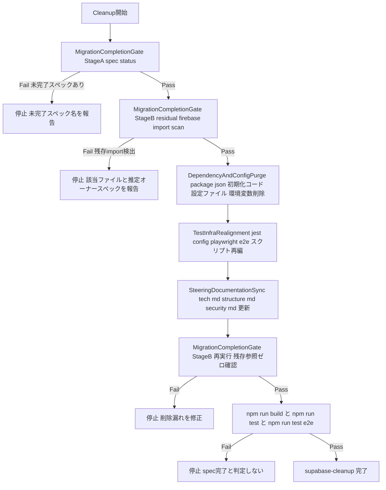
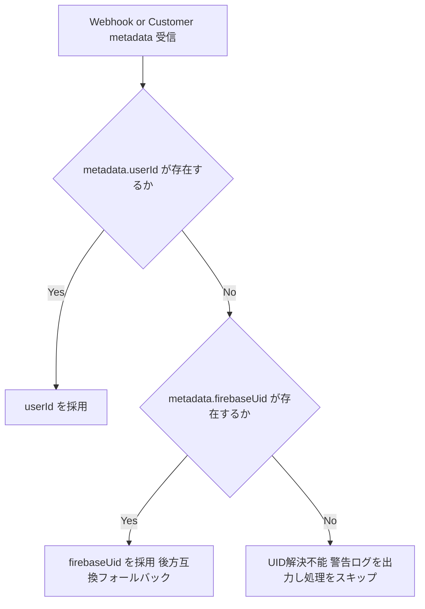

# Technical Design - supabase-cleanup

## Overview

本機能は、Firebase → Supabase 段階移行（Phase 35）の最終工程として、Firebase 関連のパッケージ・初期化コード・設定ファイル・テストインフラを安全に除去し、Steering ドキュメントを Supabase 単独構成へ更新する。

**Purpose**: 移行担当チームに対し、「本当に Firebase を削除しても安全か」を機械的に検証するゲート機構と、検証通過後の物理的なクリーンアップ手順を提供する。
**Users**: 移行担当の開発者およびリリース判定を行うチームリードが、本設計に基づき削除作業を実行・検証する。
**Impact**: `research.md` の調査により、`spec.json.phase` が `implementation-complete` と記録されているドメイン（core-data / gameplay / governance）であっても、実コードには最低14ファイルの生きた Firebase 依存が残存していることが判明した。本設計は、この事実と要件の前提（Boundary Context）との矛盾を解消するため、削除対象そのものの設計に加えて「削除してよいか」を継続的に検証するゲートを中心コンポーネントとして据える。

**Impact（Phase 36 追加）**: 本スペックの実装完了後、パッケージ依存としては検出されない「Firebase由来の識別子命名」（`firebaseUser`/`firebaseUid`）が `AuthContext` を起点に約12ファイルへ残存していることが判明した（Requirement 9）。これらは `MigrationCompletionGate` が意図的に誤検知除外している識別子名一致であり、機能的な Firebase 依存ではないが、新規参加者への誤解を防ぐため命名の是正を本スペックの追加スコープとして引き受ける。

### Goals
- 宣言上の完了状態（`spec.json.phase`）と実コード上の完了状態（Firebase import の有無）の両方を確認しない限り、削除作業を開始・完了と判定しない検証ゲートを提供する
- Firebase パッケージ・初期化コード・設定ファイル・テストインフラ・Steering ドキュメントを漏れなく Supabase 単独構成へ移行する
- 削除後もビルドおよびテストスイートが破綻しないことを保証する
- Firebase 由来の識別子命名（`firebaseUser`/`firebaseUid`）を実態（Supabase / Stripe）を反映した名前へ是正し、既存 Stripe Customer メタデータとの互換性を維持する

### Non-Goals
- `research.md` で発見された25ファイル（本番コード）の Firestore 直接依存の是正そのもの（`supabase-auth-migration` / `supabase-core-data` / `supabase-gameplay` / `supabase-governance` へフォローアップタスクとして差し戻し済み。本設計では検出のみ行う）
- `src/services/ai-authoring-route-helpers.ts` を含む AI作問利用制限機能の移行実装（帰属先は `supabase-governance` に決定済み。実装は同スペックの責務）
- `community/genres`・`community/merge` の `onSnapshot` リアルタイム要件を Supabase Realtime または ポーリングへ置き換える具体的な実装（要件は `supabase-governance` Requirement 8.2 に記録済み。実装は同スペックの責務）
- 既存 Firestore / Firebase Storage データの物理マイグレーション（`supabase-storage-legacy-migration` の責務）
- `src/components/quiz/quiz-editor.tsx` の `CANONICAL_TAGS` に含まれる技術タグ文字列 `'Firebase'` のリネーム（ユーザーが付与する正当なタグ値であり識別子ではない）
- Stripe Customer 側に既に保存されている `metadata.firebaseUid` の一括書き換え（デュアルリードで吸収し、物理更新は行わない）

## Boundary Commitments

### This Spec Owns
- 前提条件（依存スペックの完了状態）と実コードの Firebase 参照有無を機械的に検証する `MigrationCompletionGate`（`scripts/verify-firebase-removed.js`）
- `firebase`/`firebase-admin`/`firebase-tools` パッケージおよび `package-lock.json` の除去
- `src/lib/firebase/` および Firebase 設定ファイル（`.firebaserc`, `firebase.json`, `firestore.indexes.json`, `firestore.rules`, `storage.rules`）の削除
- `.env.local.example` の Firebase エントリ除去
- テストインフラ（`jest.config.js` の `moduleNameMapper`、`tests/__mocks__/firebase*`、`playwright.config.ts`、`e2e/global-setup.ts`）の Supabase 単独構成への再編
- Firestore 専用の開発スクリプト（`scripts/seed-test-data.mjs` 等）および対応する npm scripts の廃止
- `.kiro/steering/tech.md` / `structure.md` / `security.md` の Supabase 単独構成への更新
- 最終ビルド・テスト検証ゲート
- （Phase 36 追加）`AuthContext` の `firebaseUser` および エンタイトルメント/サブスクリプション/Stripe Webhook の `firebaseUid` 識別子のリネーム、および Stripe Customer メタデータキーの新旧デュアルリード互換ロジック

### Out of Boundary
- `research.md` に列挙された25本番ファイルの Firestore／Firebase Auth 直接依存の書き換え。オーナースペックへ差し戻し済み:
  - `supabase-auth-migration`（Requirement 5, Task 6）: `billing-client.ts`, `useAiChatAssistant.ts`, `useAiPlayState.ts`, `useAiQuizAuthoring.ts`, `quiz-play-client.tsx`
  - `supabase-core-data`（Requirement 5, Task 5）: `delete-account/route.ts`, `notifications-client.tsx`, `announcements-tab.tsx`, `search/weekly-top/route.ts`
  - `supabase-gameplay`（Requirement 5, Task 4）: `attempt.ts`, `review.ts`, `leaderboard-client.tsx`, `leaderboard/page.tsx`, `quiz-result-client.tsx`, `player-dashboard-client.tsx`, `genres/weekly-top/route.ts`
  - `supabase-governance`（Requirement 8, Task 4）: `admin/moderation/page.tsx`, `community/genres/page.tsx`, `community/merge/page.tsx`, `seed-genres-access.ts`, `genres/generate-icon/route.ts`, `ai-authoring-route-helpers.ts`, `ai-chat-authoring/route.ts`, `ai-generate-questions/route.ts`, `ai-generate-thumbnail/route.ts`
- 上記各ファイルの実際の書き換え実装（`onSnapshot` の Realtime／ポーリング置換、AI作問利用制限のSupabaseテーブル移行を含む）
- `supabase-core-data` / `supabase-gameplay` の `spec.json.phase` は本スペックの調査を受けて `implementation-complete` から `implementation` へ差し戻し済み。以後の完了判定は各スペック側の作業（本設計はこれを前提条件として**参照**するのみ）
- 既存 Firestore / Firebase Storage データの物理移行（`supabase-storage-legacy-migration` が所有）
- （Phase 36 追加）Stripe Customer に既に保存されている `metadata.firebaseUid` の実データ書き換え。デュアルリードで恒久的または一時的に吸収し、Stripe側の一括更新バッチは実装しない
- （Phase 36 追加）`src/components/quiz/quiz-editor.tsx` の `CANONICAL_TAGS` 配列内の文字列値

### Allowed Dependencies
- `.kiro/specs/supabase-auth-migration/spec.json`, `supabase-core-data/spec.json`, `supabase-gameplay/spec.json`, `supabase-storage-migration/spec.json`, `supabase-governance/spec.json` の `phase` フィールド（読み取り専用）
- Supabase CLI ローカル環境（`supabase start` / `supabase db reset` / `supabase/seed.sql`）
- 既存の `jest.mock('@/lib/supabase/client')` チェーンモックパターン（`tech.md` 記載の確立済みパターンを踏襲、新規モック基盤は作らない）
- （Phase 36 追加）Stripe API（`stripe.customers.create` / `stripe.customers.retrieve`）— メタデータキーの読み書き対象

### Revalidation Triggers
- `MigrationCompletionGate` のゲート通過後に、`src/`/`tests/`/`e2e/` 配下へ `firebase`/`firebase-admin` を import する新規ファイルが追加された場合
- Out of Boundary の14ファイルのオーナースペックが Firebase 依存を解消し、依存スペックの `spec.json.phase` が更新された場合（本スペックの着手条件が満たされたことを意味する）
- `package.json` に Firebase CLI（`firebase-tools`）を要求するスクリプトが再導入された場合
- （Phase 36 追加）既存 Stripe Customer 全件の `metadata.userId` へのバックフィルが別途完了し、`metadata.firebaseUid` フォールバック分岐が不要と判断された場合（フォールバック除去の再検証トリガー）

## Architecture

### Existing Architecture Analysis

- 現行アーキテクチャは `tech.md` に記載の通り、認証・コアデータ（Supabase 移行済み）とゲームプレイ・ガバナンス・ストレージ（移行済みと記録されているが実態は一部未了）が `src/lib/firebase/` と `src/lib/supabase/` の二重初期化パターンで併存している。
- `jest.config.js` の `moduleNameMapper` が Firebase SDK をグローバルに自動モック化しており、テスト実行時の隠れた統合点になっている。
- `e2e/global-setup.ts` は Playwright 実行前に `firebase-admin` でジャンルマスタ等のフィクスチャを Firestore Emulator に投入しており、E2E インフラ全体が Firestore Emulator を前提にしている。
- 維持すべき既存パターン: サービス層のブラックボックス置換方針（外部インターフェースを変えず内部実装のみ差し替える、`supabase-core-data`/`supabase-gameplay` が確立）。本スペックはこのパターンを踏襲せず、逆に「サービス層の中身には触れない」境界を明示する。

### Architecture Pattern & Boundary Map

**Selected Pattern**: ゲート付き逐次パイプライン（Gated Sequential Pipeline）— 単一の検証ツール（`MigrationCompletionGate`）を削除作業の**前**と**後**の両方で再利用し、各段階の完了を機械的に確認してから次段階へ進む。



**Architecture Integration**:
- 選定パターンの理由: 削除は不可逆に近い操作（設定ファイル・パッケージの物理削除）であるため、各段階の前に機械的なゲートを置き、判断を「宣言」ではなく「実測」に基づかせる
- ドメイン境界: 本スペックは Firebase インフラの物理除去とテスト・ドキュメントの体裁整備のみを担当し、業務ロジック（サービス層・UIのFirestore直接依存の書き換え）には踏み込まない
- 既存パターンの維持: `scripts/*.mjs` の Node ESM スクリプト規約、`jest.mock('@/lib/supabase/client')` チェーンモックパターン
- 新規コンポーネントの理由: `MigrationCompletionGate` は既存に同等の検証ツールが存在しないため新規作成する。それ以外（Purge/TestRealign/DocsSync）は既存ファイルの削除・編集であり新規ロジックを持たない
- Steering 準拠: `tech.md` の「サービス層のブラックボックス置換」原則を尊重し、本スペックはその対象外（インフラ層のみ）であることを明示
- （Phase 36 追加）`LegacyIdentifierRename` は識別子名のみの変更であり `MigrationCompletionGate` の Stage A/B いずれにも依存しない。上記パイプラインとは独立して任意のタイミングで実行可能な並行ワークストリームとし、唯一 `BuildTest`（`npm run build`/`npm run test`）ゲートのみを共有する

### Technology Stack

| Layer | Choice / Version | Role in Feature | Notes |
|-------|------------------|------------------|-------|
| Tooling / Scripts | Node.js ESM（`.mjs`）| `MigrationCompletionGate` の実装言語 | 既存 `scripts/*.mjs` と同一規約（TypeScriptではなくプレーンNode ESM） |
| Test / CI | Jest 30 + ts-jest, Playwright 1.60 | `jest.config.js` の `moduleNameMapper` 再編、`playwright.config.ts` の Emulator 環境変数除去 | 既存バージョンを変更しない |
| Local Backend | Supabase CLI（`supabase start` / `supabase db reset`） | `e2e/global-setup.ts` のフィクスチャ投入先、Firestore Emulator の代替 | `supabase/seed.sql` は既に存在し流用可能 |
| Package Manager | npm | `firebase`, `firebase-admin`, `firebase-tools` の除去、`package-lock.json` 再生成 | 既存構成を変更しない |

## File Structure Plan

### Directory Structure
```
scripts/
├── verify-firebase-removed.js    # 新規: MigrationCompletionGate 本体（CJS。Jest から require するため .js とした）
├── seed-test-data.mjs            # 削除: Firestore専用シード
├── reset-firestore.mjs           # 削除: Firestore専用リセット
├── migrate-delete-quizlists.mjs  # 削除: Firestore専用の一回限りデータ移行（実行済み・死んだコード）
└── migrate-quiz-visibility-public.mjs # 削除: 同上

src/lib/firebase/                 # 削除: ディレクトリごと（admin.ts, config.ts, firestore.ts）

tests/__mocks__/
├── firebase/                     # 削除: ディレクトリごと（app.ts, app-check.ts, auth.ts, firestore.ts, storage.ts）
├── firebase-config.ts            # 削除
└── firebase-firestore.ts         # 削除

e2e/
└── global-setup.ts               # 修正: firebase-admin フィクスチャ投入 → Supabase サーバークライアントでの投入に置換
```

### Modified Files
- `package.json` — `dependencies` から `firebase`, `firebase-admin` を削除。`devDependencies` から `firebase-tools` を削除。`scripts` から `emulators`, `deploy:rules`, `seed:test-data`, `seed:test-data:emulator`, `db:reset`, `db:reset:emulator`, `db:reset-and-seed`, `db:reset-and-seed:emulator` を削除。新規に `verify:firebase-removed` を追加
- `package-lock.json` — `npm install` により再生成し Firebase 関連エントリを除去
- `.env.local.example` — `NEXT_PUBLIC_FIREBASE_*` および `FIREBASE_SERVICE_ACCOUNT_JSON` コメント行を削除
- `jest.config.js` — `moduleNameMapper` から `^firebase/(.*)$`, `firebase[\/]config$`, `firebase[\/]firestore$` の3エントリを削除
- `playwright.config.ts` — `webServer.env`（CI/ローカル両方）から `FIREBASE_AUTH_EMULATOR_HOST` 等6つの環境変数を削除。コメント中の「Firebase」記述を Supabase 前提の文言に更新
- `.firebaserc`, `firebase.json`, `firestore.indexes.json`, `firestore.rules`, `storage.rules` — 削除
- `firebase-debug.log`, `firestore-debug.log` — 存在する場合は削除
- `.kiro/steering/tech.md` — 「移行中」の併存記述を除去し、Supabase 単独構成の記述に更新（Phase 1-34 の履歴段落は保持）
- `.kiro/steering/structure.md` — サービス層・`src/lib/` 節から `src/lib/firebase/` 併存の記述を除去
- `.kiro/steering/security.md` — §7（Firebase Storage アップロード制限）を Supabase Storage 向けの記述に更新、§9（Supabase RLS と Firestore Security Rules の並存）セクションを削除し RLS 単独の記述に統合

### Modified Files（Phase 36 追加: LegacyIdentifierRename）
- `src/context/auth-context.tsx` — `AuthContextType.firebaseUser` → `authUser`、`useState`/`setFirebaseUser` → `authUser`/`setAuthUser`、Provider value、関連コメントを更新
- `src/app/admin/users/page.tsx` / `src/app/admin/moderation/page.tsx` / `src/app/admin/genres/admin-genres-client.tsx` / `src/app/community/genres/page.tsx` — `useAuth()` の分割代入と `firebaseUser.getIdToken()`/`firebaseUser.uid` 参照を `authUser` に置換
- `src/components/explore/quiz-carousel.tsx` / `src/app/search/search-client.tsx` — `firebaseUser?.uid` 参照を `authUser?.uid` に置換
- `src/types/subscription.ts` — `StripeSubscriptionSnapshot.firebaseUid` → `uid`
- `src/services/entitlement.ts` — `applySubscriptionFromStripe`/`clearPaidEntitlements` の `firebaseUid` 引数・`snapshot.firebaseUid` 参照を `uid` に置換
- `src/services/subscription.ts` — `stripe.customers.create` のメタデータキーを `{ userId: uid }` に変更（新規作成分のみ）
- `src/services/stripe-webhook.ts` — `resolveFirebaseUidFromSubscription` → `resolveUidFromSubscription`（`metadata.userId` 優先 → `metadata.firebaseUid` フォールバック）、`resolveUidFromCustomer` も同様のデュアルリードに変更、各関数のローカル変数・引数名を `uid` に統一
- `tests/services/entitlement.test.ts` / `tests/services/subscription.test.ts` / `tests/services/stripe-webhook.test.ts` — リネームに追随したアサーション更新、および `metadata.firebaseUid` のみが存在する既存顧客ケースの互換性テストを追加
- `tests/app/community/genres.test.tsx` / `tests/app/admin/portal.test.tsx` / `tests/app/admin/moderation-seed.test.tsx` / `tests/app/admin/genres.test.tsx` / `tests/components/home-discovery-client.test.tsx` / `tests/components/home-page.test.tsx` / `tests/components/quiz-carousel.test.tsx` / `tests/components/quiz-detail-client.test.tsx` — `useAuth()` の型付きモック（`jest.MockedFunction<typeof useAuth>.mockReturnValue` または `jest.mock` ファクトリ）が返すオブジェクトの `firebaseUser` フィールドを `authUser` に更新する。`AuthContextType` の型を変更するため、これらのファイルは実際にコンポーネントが `authUser` を消費するか否かに関わらず、型チェック（`npm run build`/`tsc`）を通過させるために更新が必須
- `tests/scripts/verify-firebase-removed.test.ts` は対象外とする。`firebaseUser` を含む文字列はこのテストが「識別子名のみの一致を誤検知しないこと」を検証するための合成フィクスチャであり、実ファイルのリネームとは無関係

## System Flows（Phase 36 追加）

Stripe Customer メタデータの UID 解決は、新キー優先・旧キーフォールバックの分岐を持つ（Requirement 9.4）。



この分岐は `resolveUidFromSubscription`（Subscription オブジェクトの `metadata`）と `resolveUidFromCustomer`（Customer オブジェクトの `metadata`）の双方で共通のフォールバック順序を適用する。`Unresolved` 到達時の挙動（`console.warn` して処理をスキップ）は既存実装から変更しない。

## Requirements Traceability

| Requirement | Summary | Components | Interfaces | Flows |
|---|---|---|---|---|
| 1.1 | 依存5スペックの `spec.json.phase` 確認 | MigrationCompletionGate | Batch (Stage A) | GateA |
| 1.2 | 未完了時は削除を実行せずエラー報告 | MigrationCompletionGate | Batch (Stage A) | GateA → Block1 |
| 1.3 | 検証結果の記録 | MigrationCompletionGate | Batch (Stage A) | GateA |
| 2.1 | `firebase`/`firebase-admin` パッケージ削除 | DependencyAndConfigPurge | — | Purge |
| 2.2 | `package-lock.json` 再生成 | DependencyAndConfigPurge | — | Purge |
| 2.3 | 依存関係ツリーに Firebase を含まない | DependencyAndConfigPurge | — | Purge, GateC |
| 3.1 | `src/lib/firebase/` 削除 | DependencyAndConfigPurge | — | Purge |
| 3.2 | Firebase設定ファイル削除 | DependencyAndConfigPurge | — | Purge |
| 3.3 | デバッグログ削除 | DependencyAndConfigPurge | — | Purge |
| 3.4 | 型チェック通過 | DependencyAndConfigPurge | — | BuildTest |
| 4.1 | `.env.local.example` から Firebase 変数除去 | DependencyAndConfigPurge | — | Purge |
| 4.2 | Supabase 変数のみ残存 | DependencyAndConfigPurge | — | Purge |
| 5.1 | `tests/__mocks__/firebase/` 削除 | TestInfraRealignment | Batch | TestRealign |
| 5.2 | テストファイルの Supabase 用置換 | TestInfraRealignment | Batch | TestRealign |
| 5.3 | E2E設定から Emulator 除去 | TestInfraRealignment | Batch | TestRealign |
| 5.4 | テストスイート成功 | TestInfraRealignment | Batch | BuildTest |
| 6.1 | `tech.md` 更新 | SteeringDocumentationSync | — | DocsSync |
| 6.2 | `structure.md` 更新 | SteeringDocumentationSync | — | DocsSync |
| 6.3 | `security.md` 更新 | SteeringDocumentationSync | — | DocsSync |
| 6.4 | Phase 1-34履歴の保持 | SteeringDocumentationSync | — | DocsSync |
| 7.1 | 網羅的 Firebase 参照検索 | MigrationCompletionGate | Batch (Stage B) | GateB, GateC |
| 7.2 | 検出時は完了と判定しない | MigrationCompletionGate | Batch (Stage B) | GateB → Block2, GateC → Block3 |
| 8.1 | `npm run build` 成功確認 | — | — | BuildTest |
| 8.2 | `npm run test` / `test:e2e` 成功確認 | — | — | BuildTest |
| 8.3 | 失敗時は完了報告しない | — | — | BuildTest → Block4 |
| 9.1 | `AuthContext.firebaseUser` および参照コンポーネントのリネーム | LegacyIdentifierRename | — | （独立ワークストリーム） |
| 9.2 | `firebaseUid` フィールド・変数名のリネーム | LegacyIdentifierRename | — | （独立ワークストリーム） |
| 9.3 | 認証・課金・Webhook処理の挙動非変更 | LegacyIdentifierRename | — | BuildTest |
| 9.4 | Stripe メタデータの新旧デュアルリード互換 | LegacyIdentifierRename | Batch | UID解決フロー（System Flows） |
| 9.5 | `CANONICAL_TAGS` の `'Firebase'` を対象外とする | — | — | （Non-Goals として明記、実装対象なし） |
| 9.6 | リネーム後の `npm run build`/`npm run test` 成功確認 | LegacyIdentifierRename | — | BuildTest |

## Components and Interfaces

| Component | Domain/Layer | Intent | Req Coverage | Key Dependencies (P0/P1) | Contracts |
|---|---|---|---|---|---|
| MigrationCompletionGate | Tooling / CLI | 宣言上の完了状態と実コードの Firebase 参照有無を検証する | 1.1, 1.2, 1.3, 7.1, 7.2 | `.kiro/specs/supabase-*/spec.json`（P0）, `src/`・`tests/`・`e2e/` ソースツリー（P0） | Batch |
| TestInfraRealignment | Test Infrastructure | Jest/Playwright/E2E のテストインフラを Supabase 単独構成へ再編する | 5.1, 5.2, 5.3, 5.4 | `jest.config.js`（P0）, `playwright.config.ts`（P0）, Supabase CLI ローカル環境（P0） | Batch |
| DependencyAndConfigPurge | Build / Config | Firebase パッケージ・初期化コード・設定ファイル・環境変数を物理削除する | 2.1, 2.2, 2.3, 3.1, 3.2, 3.3, 3.4, 4.1, 4.2 | MigrationCompletionGate の Pass 結果（P0） | — |
| SteeringDocumentationSync | Documentation | Steering ドキュメントを Supabase 単独構成の記述に更新する | 6.1, 6.2, 6.3, 6.4 | DependencyAndConfigPurge 完了（P1） | — |
| LegacyIdentifierRename | Auth / Billing | Firebase由来の識別子命名を是正し、Stripe メタデータの新旧互換を維持する | 9.1, 9.2, 9.3, 9.4, 9.6 | `AuthContext`（P0）, Stripe API（P0） | Batch |

### Tooling / CLI

#### MigrationCompletionGate

| Field | Detail |
|-------|--------|
| Intent | 依存スペックの完了宣言とソースツリー上の Firebase 参照の実態を突き合わせ、削除作業の開始可否・完了可否を判定する |
| Requirements | 1.1, 1.2, 1.3, 7.1, 7.2 |

**Responsibilities & Constraints**
- Stage A: `supabase-auth-migration`, `supabase-core-data`, `supabase-gameplay`, `supabase-storage-migration`, `supabase-governance` の各 `spec.json` を読み取り、`phase` が `implementation-complete` であることを確認する
- Stage B: `src/`, `tests/`, `e2e/` を再帰的に走査し、import/require の specifier が `firebase`, `firebase-admin`, `firebase-admin/*`, `firebase/*`、または `src/lib/firebase/` を指すエイリアス（`@/lib/firebase*`, 相対パス `lib/firebase*`）に一致するファイルを検出する
- `firebaseUser`・`firebaseUid` 等、パッケージ import を伴わない識別子名の一致は誤検知として除外する（import/require 文の構文的検出に限定し、単純文字列検索は行わない）
- 削除作業の**前**（Stage A + Stage B）と**後**（Stage B の再実行）の両方で同一ツールを再利用する
- 本ツールはソースツリーの読み取りのみを行い、いかなるファイルも変更しない

**Dependencies**
- Inbound: 開発者（CLI から手動実行）、または `npm run verify:firebase-removed`（P0）
- Outbound: なし
- External: `.kiro/specs/supabase-*/spec.json`（P0、読み取り専用）

**Contracts**: Service [ ] / API [ ] / Event [ ] / Batch [x] / State [ ]

##### Batch / Job Contract
- Trigger: 開発者による手動実行（`npm run verify:firebase-removed`）。削除作業着手前と、Requirement 7/8 の最終確認時の2回以上実行する運用
- Input / validation: 引数なし。`.kiro/specs/supabase-*/spec.json`（5ファイル固定パス）とソースツリーを入力とする
- Output / destination: 標準出力に Stage A / Stage B それぞれの合否と、不合格時は該当スペック名またはファイルパス一覧を人間可読な形式で出力する。プロセス終了コードは全ステージ Pass で `0`、いずれか Fail で非ゼロとする
- Idempotency & recovery: 読み取り専用のため何度でも安全に再実行できる。Fail 時は原因（未完了スペック名 or 残存ファイル一覧）を提示し、開発者が該当箇所を解消してから再実行する運用とする

**Implementation Notes**
- Integration: `package.json` に `"verify:firebase-removed": "node scripts/verify-firebase-removed.js"` を追加する
- Validation: Stage B の検出ロジックは正規表現によるソースコード静的解析とし、実行時（require時）の動的解決には依存しない
- Risks: 動的 import（`await import('firebase/firestore')` のような文字列変数化されたパス）を使うファイルがあると静的解析で見逃す可能性がある。`quiz-result-client.tsx` に動的 import の実例があるため、Stage B の実装では静的 import 文だけでなく `import\(['"]` パターンの動的 import も検出対象に含める

### Test Infrastructure

#### TestInfraRealignment

| Field | Detail |
|-------|--------|
| Intent | Jest のグローバル自動モックと Playwright/E2E のセットアップから Firebase Emulator 前提を除去し、Supabase ローカル環境に一本化する |
| Requirements | 5.1, 5.2, 5.3, 5.4 |

**Responsibilities & Constraints**
- `jest.config.js` の `moduleNameMapper` から Firebase 関連3エントリを削除する（この削除は `MigrationCompletionGate` の Stage B が対象コード側でゼロ件を確認した後にのみ安全となる）
- `tests/__mocks__/firebase/`・`firebase-config.ts`・`firebase-firestore.ts` を削除する
- `e2e/global-setup.ts` を、`firebase-admin` によるジャンルマスタ投入から、Supabase サーバークライアント（`SUPABASE_SERVICE_ROLE_KEY`）による同等データ投入に置き換える
- `playwright.config.ts` の `webServer.env`（CI・ローカル双方）から Firebase Emulator ホスト環境変数6件を削除する
- Firestore 専用の開発スクリプト（`scripts/seed-test-data.mjs`, `scripts/reset-firestore.mjs`, `scripts/migrate-delete-quizlists.mjs`, `scripts/migrate-quiz-visibility-public.mjs`）と対応する npm scripts を削除し、既存の `supabase/seed.sql` + `supabase db reset`（Supabase CLI 標準機能）に一本化する

**Dependencies**
- Inbound: `npm run test`, `npm run test:e2e`（P0）
- Outbound: なし
- External: Supabase CLI ローカル環境（`supabase start`）、`supabase/seed.sql`（P0）

**Contracts**: Service [ ] / API [ ] / Event [ ] / Batch [x] / State [ ]

##### Batch / Job Contract
- Trigger: `npm run test:e2e` 実行時に Playwright の `globalSetup` として自動起動
- Input / validation: Supabase ローカル環境が起動済みであること（`supabase start`）を前提とする
- Output / destination: Supabase の対象テーブル（ジャンルマスタ等、既存 `e2e/global-setup.ts` が Firestore に投入していたものと同一データ）にフィクスチャを投入する
- Idempotency & recovery: 既存の `e2e/global-setup.ts` と同様、重複投入を避けるための存在チェック（upsert 相当）を維持する

**Implementation Notes**
- Integration: 既存の `jest.mock('@/lib/supabase/client')` チェーンモックパターン（`tech.md` 記載）をテスト側でそのまま踏襲し、新規共有モックは作らない
- Validation: 削除前に `moduleNameMapper` に依存しているテストが存在しないこと（＝Out of Boundaryの14ファイル側の移行完了）を `MigrationCompletionGate` で確認する
- Risks: `moduleNameMapper` 削除のタイミングが Out of Boundary 側の移行完了より早いと、対象テストが軒並み失敗する。実行順序は本設計の Architecture パイプライン（GateB Pass 後にのみ Purge/TestRealign へ進む）で担保する

### Auth / Billing（Phase 36 追加）

#### LegacyIdentifierRename

| Field | Detail |
|-------|--------|
| Intent | `AuthContext` および課金関連サービス層に残存する Firebase 由来の識別子命名を是正し、既存 Stripe Customer メタデータとの後方互換を保つ |
| Requirements | 9.1, 9.2, 9.3, 9.4, 9.6 |

**Responsibilities & Constraints**
- `AuthContextType.firebaseUser` / `useState` の `firebaseUser` / Provider が公開する `firebaseUser` を `authUser` にリネームし、`src/app/admin/users/page.tsx` 等7ファイルの参照箇所を追随させる
- `StripeSubscriptionSnapshot.firebaseUid`、`applySubscriptionFromStripe`/`clearPaidEntitlements` の引数、`resolveFirebaseUidFromSubscription`/`resolveUidFromCustomer` 内のローカル変数・引数名を `uid` に統一する
- 新規に作成する Stripe Customer のメタデータキーを `userId` に変更する。読み取り時は `metadata.userId` を優先し、存在しない場合のみ `metadata.firebaseUid` にフォールバックする（System Flows 参照）
- リネームは純粋な識別子変更であり、認証状態判定・課金プラン判定・Webhookイベント処理の入出力・分岐条件を変更しない

**Dependencies**
- Inbound: `useAuth()` を呼び出す全コンポーネント（P0）、Stripe Webhook ハンドラ（P0）
- Outbound: なし
- External: Stripe API（`customers.create`, `customers.retrieve`）（P0）

**Contracts**: Service [ ] / API [ ] / Event [ ] / Batch [x] / State [ ]

##### Batch / Job Contract
- Trigger: 開発者によるリファクタリング作業として一度限り実行（継続的なジョブではない）
- Input / validation: 対象ファイル一覧（File Structure Plan 参照）。TypeScript コンパイラによる型チェックで参照漏れを検出する
- Output / destination: リネーム後のソースコード。挙動の変更なし
- Idempotency & recovery: 一度限りの変更のため冪等性は対象外。リネーム漏れは `npm run build`（型エラー）で検出できる

**Implementation Notes**
- Integration: `resolveUidFromSubscription`/`resolveUidFromCustomer` は `metadata.userId ?? metadata.firebaseUid` の順で解決し、`Unresolved` 時の `console.warn` ログ文言は既存のまま維持する
- Validation: `tests/services/stripe-webhook.test.ts` に「`metadata.firebaseUid` のみが存在する（新キー未設定の）既存顧客」を模したテストケースを追加し、フォールバックが機能することを検証する。既存の `tests/services/entitlement.test.ts`/`tests/services/subscription.test.ts`/`tests/services/stripe-webhook.test.ts` のフィクスチャは `firebaseUid`/`uid`/メタデータキーの命名変更に追随させて更新する（単なる回帰確認ではなく編集対象）
- Risks: `AuthContext` は多数の消費コンポーネントから参照されるため、TypeScript の型エラーとして検出されない動的アクセス（文字列キーでの分割代入等）があれば見逃す可能性がある。File Structure Plan に列挙した全消費ファイルおよび対応するテストファイル（`useAuth()` を型付きモックする8ファイル）を対象に `npm run build` と `npm run test` で検証する。特に `jest.MockedFunction<typeof useAuth>.mockReturnValue()` を使うテストは、`AuthContextType` のフィールド名変更に伴い型チェックが失敗するため、モック側の更新が必須（コンポーネントが実際に `authUser` を消費するか否かに関わらず）

## Error Handling

### Error Strategy
削除は物理的で戻しにくい操作であるため、各段階の失敗は「進行を止めて原因を報告する」ことを基本方針とし、自動リトライや部分的続行は行わない。

### Error Categories and Responses
- **前提未達（Requirement 1.2）**: `MigrationCompletionGate` Stage A が Fail した場合、削除作業（Purge 以降）を一切開始せず、未完了スペック名の一覧を出力して終了する
- **残存参照検出（Requirement 7.2）**: Stage B が Fail した場合、該当ファイルパスの一覧と推定オーナードメイン（`research.md` のファイル別オーナー表を参照）を出力し、削除完了とみなさない
- **ビルド/テスト失敗（Requirement 8.3）**: `npm run build` または `npm run test` / `npm run test:e2e` のいずれかが失敗した場合、`spec.json` の `phase` を `implementation-complete` に更新せず、失敗ログを記録する
- **UID解決不能（Requirement 9.4、既存挙動の維持）**: `LegacyIdentifierRename` の `resolveUidFromSubscription`/`resolveUidFromCustomer` が `metadata.userId` と `metadata.firebaseUid` のいずれからも UID を解決できない場合、`console.warn` を出力し当該 Webhook イベントの処理をスキップする（エラーを送出せず処理継続。既存実装からの変更なし）

### Monitoring
本スペックは一度限りの移行完了作業であるため常時監視は不要。`MigrationCompletionGate` の実行結果（標準出力ログ）を作業記録として残す。

## Testing Strategy

- **Unit Tests**: `MigrationCompletionGate` の Stage B 検出ロジックが `from 'firebase'` / `from 'firebase-admin/app'` / `from '@/lib/firebase/config'` / 動的 `import('firebase/firestore')` を検出し、`firebaseUser` や `firebaseUid` という識別子名のみのファイルを誤検知しないことを確認する
- **Integration Tests**: Purge 完了後に `npx tsc --noEmit` 相当（`npm run build` に内包）が `src/lib/firebase/` への参照エラーなしに成功することを確認する
- **E2E Tests**: `npm run test:e2e` が Supabase ローカル環境ベースの `global-setup.ts` で全件成功することを確認する
- **Regression Test**: Purge・TestInfraRealignment・DocsSync 完了後に `MigrationCompletionGate` を再実行し、Stage A・Stage B ともに Pass することを確認する（Requirement 7.2 / 8 の自己検証）
- **Unit Tests（Phase 36 追加）**: `resolveUidFromSubscription`/`resolveUidFromCustomer` が `metadata.userId` を優先し、`metadata.userId` 不在時のみ `metadata.firebaseUid` にフォールバックすることを検証する（新規顧客ケース・既存顧客ケースの両方）
- **Regression Test（Phase 36 追加）**: `auth-context.tsx` の `authUser` リネーム後、`useAuth()` を型付きモックしている全テストファイル（`tests/app/community/genres.test.tsx`, `tests/app/admin/portal.test.tsx`, `tests/app/admin/moderation-seed.test.tsx`, `tests/app/admin/genres.test.tsx`, `tests/components/home-discovery-client.test.tsx`, `tests/components/home-page.test.tsx`, `tests/components/quiz-carousel.test.tsx`, `tests/components/quiz-detail-client.test.tsx`）のモックフィールドを `authUser` に更新したうえで成功することを確認する（リネームが挙動を変えない純粋なリファクタリングであることの裏付け）

## Supporting References

- 発見済みの Firebase 生存依存ファイル一覧とオーナードメイン対応表: [research.md](./research.md) の「実コードにおける Firebase SDK 生存確認」節
- 実装オプションの比較（Option A/B/C）と Option C 採用理由: [research.md](./research.md) の「Implementation Approach Options」節
- 識別子リネーム対象ファイルの棚卸しと Stripe メタデータキーのデュアルリード方式採用理由: [research.md](./research.md) の「Phase 36 Discovery: 残存識別子命名の是正」節
