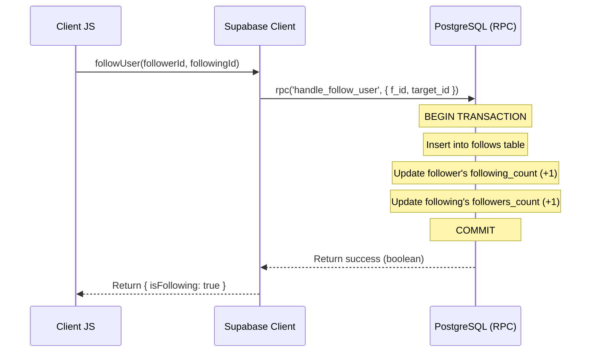

# Technical Design Document - supabase-core-data

## Overview
本ドキュメントは、Quizetika のコアデータ管理（ユーザープロフィール、クイズ、問題、ブックマーク、通知、お知らせ）における Firebase Firestore から Supabase (PostgreSQL) への全面的なデータアクセス層移行に関する設計定義です。

### Goals
- 22ファイル以上のサービス・ライブラリから Firestore SDK の依存を完全に除去し、Supabase JS Client へ移行する。
- データの整合性を保ちつつ、フォロー/アンフォローおよびバッジ授与のトランザクション操作を PostgreSQL ストアドファンクション (RPC) で再実装する。
- `npx supabase gen types` で自動生成された `Database` 型による静的な型安全を保証する。
- キーセットページネーション (keyset pagination) およびクイズのキーワード検索を PostgreSQL クエリで正しく実行する。

### Non-Goals
- クイズプレイ（解答の評価・アテンプト・リアクションなど）の移行（`supabase-gameplay` が担当）
- 管理者モデレーション、タグ統合、Stripe Webhook 連携等のガバナンス機能の移行（`supabase-governance` が担当）
- 画像ファイルやアイコン等のストレージアップロード機構の移行（`supabase-storage-migration` が担当）
- 既存のフロントエンド・コンポーネント側の直接的な表示ロジックの変更

## Boundary Commitments

### This Spec Owns
- コアデータに関する CRUD サービス（`src/services/` 配下の `user.ts`, `quiz.ts`, `question.ts`, `bookmark.ts`, `notification.ts`, `announcement.ts`）の Supabase クライアント API への全面書き換え。
- コアデータのメタデータ解決ロジック (`metadata-resolution.ts`) および検索ログの記録機構 (`search-log.ts`) の移行。
- フォロー、アンフォロー、バッジ付与をアトミックに実行するための PostgreSQL ストアドファンクション (RPC) の新規マイグレーション定義。

### Out of Boundary
- ゲームプレイ・解答履歴（`attempts`）、クイズ評価・リアクション（`quiz_reviews`、リアクション）
- 管理操作・モデレーション（`feedback_reports`）、タグ統合（`tag_merges`）
- ストレージ操作のバックエンド実装（`deleteImage` 等はスタブ化または別スペックでの移行）

### Allowed Dependencies
- `supabase-auth-migration`（認証済み Supabase クライアントの初期化・取得パターン）
- `@supabase/ssr` (Cookie を用いたサーバー・クライアントサイドのセッション維持)

### Revalidation Triggers
- `src/lib/supabase/database.types.ts` 内の型構造（テーブル定義）の変更
- トランザクション処理用 RPC 関数のシグネチャ変更
- ページネーション用カーソルのエンコード / デコード仕様の変更

## Architecture

本移行では、Next.js のコンポーネント・API層と Supabase (PostgreSQL) の間に位置するサービス層 (Services) の内部実装を Firestore から Supabase へと差し替えます。フロントエンドおよび API Routes から見ると、関数のインターフェース（インプット/アウトプット）および返却される型が同じまま維持される「ブラックボックス置換」を行います。

```mermaid
graph TB
    ClientUI[Client UI Components] --> AuthCtx[Auth Context]
    ClientUI --> CoreServices[Core Services]
    ApiRoutes[API Route Handlers] --> CoreServices
    
    subgraph Core Services (src/services/)
        user[user.ts]
        quiz[quiz.ts]
        question[question.ts]
        bookmark[bookmark.ts]
        notification[notification.ts]
        announcement[announcement.ts]
    end

    CoreServices --> SupabaseClient[Supabase Client / @supabase/ssr]
    SupabaseClient --> DB[(Supabase PostgreSQL)]
    SupabaseClient --> RPC[PostgreSQL RPC Functions]
```

### Technology Stack

| Layer | Choice / Version | Role in Feature | Notes |
|-------|------------------|-----------------|-------|
| Frontend | React / Next.js | クライアントコンポーネント呼び出し元の維持 | 影響なし |
| Services / Core | TypeScript | サービス層関数の書き換え | 型定義に `Database` 型を使用 |
| Data / Storage | Supabase (PostgreSQL) 15+ | 永続データストア | RLS ポリシーの適用 |
| Infrastructure | Supabase Edge Infrastructure | RPC (ストアドプロシージャ) の実行 | フォロー/バッジトランザクションの保証 |

## File Structure Plan

### Directory Structure
```
src/
├── services/
│   ├── user.ts              # [MODIFY] Supabase クライアントに移行、フォロー/バッジは RPC を呼ぶ
│   ├── quiz.ts              # [MODIFY] クイズ CRUD・検索・ページネーションを Supabase に移行
│   ├── question.ts          # [MODIFY] 問題 CRUD・順序更新を Supabase に移行
│   ├── bookmark.ts          # [MODIFY] ブックマーク CRUD を Supabase に移行
│   ├── notification.ts      # [MODIFY] 通知 CRUD を Supabase に移行
│   ├── announcement.ts      # [MODIFY] お知らせ CRUD を Supabase に移行
│   └── quiz-validation.ts   # [MODIFY] Firestore への参照とスキーマ依存を完全に除去
├── lib/
│   ├── firebase/
│   │   └── firestore.ts     # [DELETE] 不要となったコンバーター定義等のファイルを物理削除
│   ├── metadata-resolution.ts # [MODIFY] メタデータ解決を Supabase クエリ・スキーマ用に移行
│   └── search-log.ts        # [MODIFY] 検索ログ記録を Supabase (search_logs) テーブルに移行
```

## System Flows

### フォロー処理トランザクションフロー
JS クライアントから直接複数テーブルを更新するとアトミック性が損なわれるため、RPC 関数 `handle_follow_user` を定義して、DB サーバー側で一括して実行します。



## Requirements Traceability

| Requirement | Summary | Components | Interfaces | Flows |
|-------------|---------|------------|------------|-------|
| 1.1 | プロフィール更新 | user.ts | updateProfile | - |
| 1.2 | フォロー処理 | user.ts | followUser | フォロー処理トランザクション |
| 1.3 | アンフォロー処理 | user.ts | unfollowUser | - |
| 1.4 | バッジ自動獲得 | user.ts | checkAndAwardBadges | - |
| 2.1 | クイズ作成 | quiz.ts | createQuiz | - |
| 2.2 | クイズ更新 | quiz.ts | updateQuiz | - |
| 2.3 | 問題順序更新 | question.ts | updateQuestionOrder | - |
| 2.4 | クイズキーワード検索 | quiz.ts | searchQuizzes | - |
| 2.5 | ジャンル指定クイズ一覧 | quiz.ts | getQuizzesByGenre | - |
| 3.1 | ブックマーク追加 | bookmark.ts | addBookmark | - |
| 3.2 | ブックマーク削除 | bookmark.ts | removeBookmark | - |
| 3.3 | ブックマーク一覧取得 | bookmark.ts | getBookmarkedQuizzes | - |
| 4.1 | 通知作成 | notification.ts| createNotification | - |
| 4.2 | 未読通知一覧・既読化 | notification.ts| getUnreadNotifications, markAsRead | - |
| 4.3 | お知らせ一覧取得 | announcement.ts| getPublishedAnnouncements | - |

## Components and Interfaces

### Core Services

#### user.ts (User Service)
- **Intent**: ユーザープロフィール情報の取得・更新、フォロー関係、獲得バッジ情報の管理を行う。
- **Requirements**: 1.1, 1.2, 1.3, 1.4

##### Service Interface
```typescript
export interface UserService {
  getUserProfile(uid: string): Promise<User | null>;
  updateProfile(uid: string, data: UpdateProfileData): Promise<void>;
  createUser(user: Omit<User, 'createdAt' | 'updatedAt'>): Promise<void>;
  followUser(followerId: string, followingId: string): Promise<{ isFollowing: boolean }>;
  unfollowUser(followerId: string, followingId: string): Promise<void>;
  isFollowing(followerId: string, followingId: string): Promise<boolean>;
  getFollowingUsers(userId: string): Promise<User[]>;
  getFollowerUsers(userId: string): Promise<User[]>;
  checkAndAwardBadges(uid: string): Promise<Badge[]>;
}
```

#### quiz.ts (Quiz Service)
- **Intent**: クイズの作成・更新・削除・一覧取得・検索を行う。
- **Requirements**: 2.1, 2.2, 2.4, 2.5

##### Service Interface
```typescript
export interface QuizService {
  getQuiz(id: string): Promise<Quiz | null>;
  createQuiz(authorId: string, data: Partial<Quiz>): Promise<string>;
  updateQuiz(id: string, updates: Partial<Quiz>): Promise<void>;
  deleteQuiz(id: string): Promise<void>;
  searchQuizzes(queryStr: string, limitNum: number, cursor?: string): Promise<PaginatedQuizResult>;
  getQuizzesByGenre(genreId: string, limitNum: number, cursor?: string): Promise<PaginatedQuizResult>;
}
```

## Data Models

### Physical Data Model (New RPC Functions)

#### 1. フォロー・アンフォロー用の RPC 関数
```sql
CREATE OR REPLACE FUNCTION handle_follow_user(
  p_follower_id UUID,
  p_following_id UUID
) RETURNS BOOLEAN AS $$
DECLARE
  v_doc_id TEXT;
  v_already_exists BOOLEAN;
BEGIN
  v_doc_id := p_follower_id::TEXT || '_' || p_following_id::TEXT;
  
  -- 重複チェック
  SELECT EXISTS(SELECT 1 FROM follows WHERE id = v_doc_id) INTO v_already_exists;
  IF v_already_exists THEN
    RETURN FALSE;
  END IF;
  
  -- フォローテーブルへ登録
  INSERT INTO follows (id, follower_id, following_id, created_at)
  VALUES (v_doc_id, p_follower_id, p_following_id, now());
  
  -- カウントの更新
  UPDATE users SET following_count = following_count + 1, updated_at = now() WHERE id = p_follower_id;
  UPDATE users SET followers_count = followers_count + 1, updated_at = now() WHERE id = p_following_id;
  
  RETURN TRUE;
END;
$$ LANGUAGE plpgsql SECURITY DEFINER;


CREATE OR REPLACE FUNCTION handle_unfollow_user(
  p_follower_id UUID,
  p_following_id UUID
) RETURNS BOOLEAN AS $$
DECLARE
  v_doc_id TEXT;
  v_exists BOOLEAN;
BEGIN
  v_doc_id := p_follower_id::TEXT || '_' || p_following_id::TEXT;
  
  -- 存在チェック
  SELECT EXISTS(SELECT 1 FROM follows WHERE id = v_doc_id) INTO v_exists;
  IF NOT v_exists THEN
    RETURN FALSE;
  END IF;
  
  -- フォローテーブルから削除
  DELETE FROM follows WHERE id = v_doc_id;
  
  -- カウントの更新
  UPDATE users SET following_count = GREATEST(0, following_count - 1), updated_at = now() WHERE id = p_follower_id;
  UPDATE users SET followers_count = GREATEST(0, followers_count - 1), updated_at = now() WHERE id = p_following_id;
  
  RETURN TRUE;
END;
$$ LANGUAGE plpgsql SECURITY DEFINER;
```

#### 2. バッジ付与用 RPC 関数
```sql
CREATE OR REPLACE FUNCTION handle_check_and_award_badges(
  p_user_id UUID,
  p_badges JSONB
) RETURNS JSONB AS $$
DECLARE
  v_existing_badges JSONB;
  v_merged_badges JSONB;
  v_newly_awarded JSONB;
BEGIN
  -- ロックを獲得しつつ既存バッジの取得
  SELECT badges INTO v_existing_badges FROM users WHERE id = p_user_id FOR UPDATE;
  
  -- 重複しないバッジだけを抽出・マージするロジック（JSONB 配列結合）
  -- ※ JS 側で差分を計算して渡し、ここでは単にマージする
  v_merged_badges := v_existing_badges || p_badges;
  
  UPDATE users 
  SET badges = v_merged_badges, updated_at = now()
  WHERE id = p_user_id;
  
  RETURN p_badges;
END;
$$ LANGUAGE plpgsql SECURITY DEFINER;
```

## Error Handling

### Error Strategy
- DB 操作でエラーが発生した場合、`PostgrestError` をキャッチし、ドメインエラー（`Error`）としてエラーメッセージを詳細化した上でスローします。
- トランザクション処理 (RPC) では、内部で例外が発生した場合はロールバックが自動的に実行されます。
- クエリ結果が空（レコード未検出）の場合、`.single()` では 406 エラーが返るため、`.maybeSingle()` を使用して `null` を安全に返せるようにします。

## Testing Strategy

### Unit Tests
- `tests/lib/supabase/auth-verify.test.ts` (確認済み)
- `tests/services/user.test.ts`: ユーザープロフィール取得・更新、フォロー/アンフォロー（RPCモック）、バッジ付与（RPCモック）の検証。
- `tests/services/quiz.test.ts`: クイズ CRUD、ページネーション・クエリおよび検索ログ書き込みの検証。

### Integration Verification
- ローカル Supabase エミュレータを用いた DDL (RPC) 適用テスト。
- Jest によるテストスイートの全パス確認。
