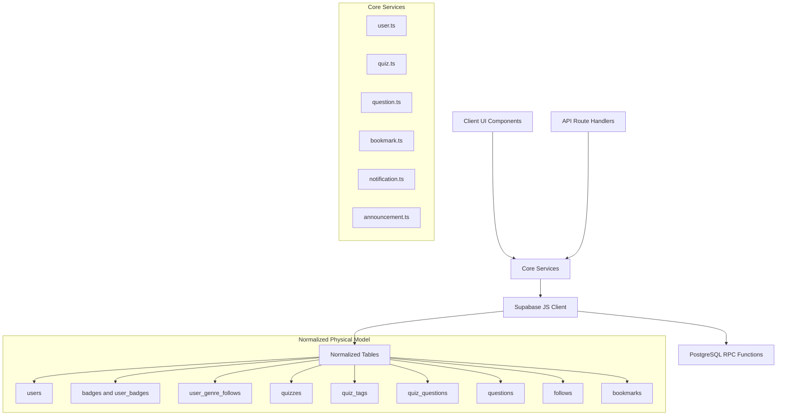
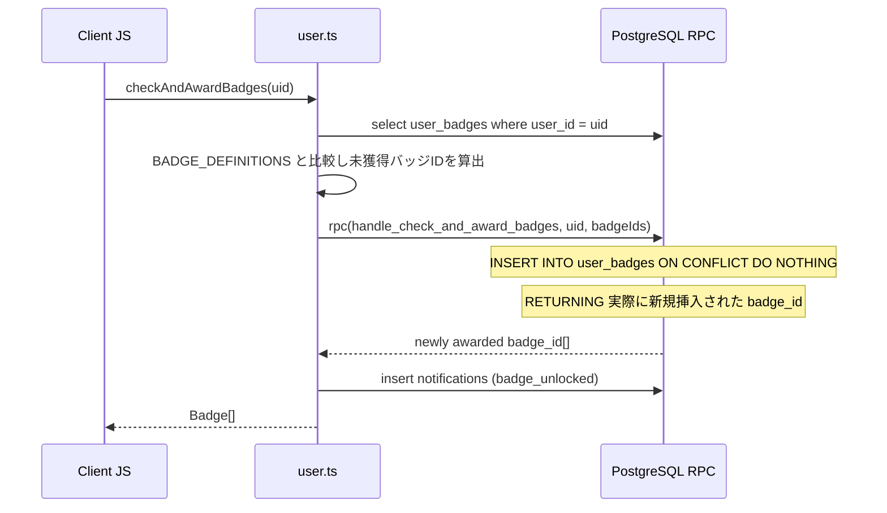
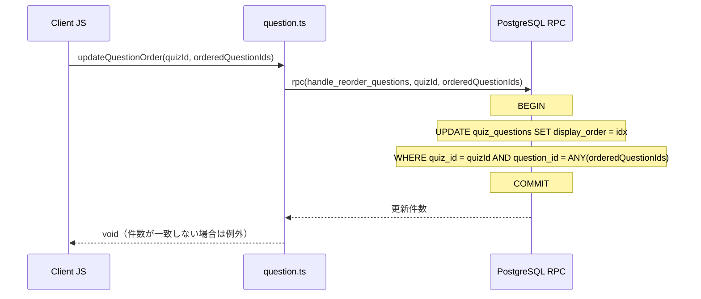
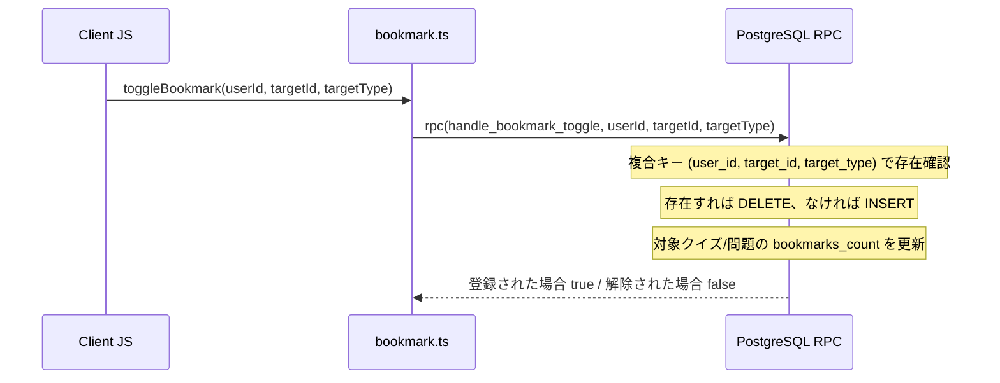
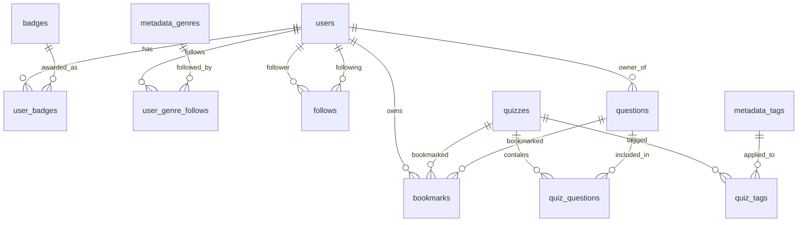
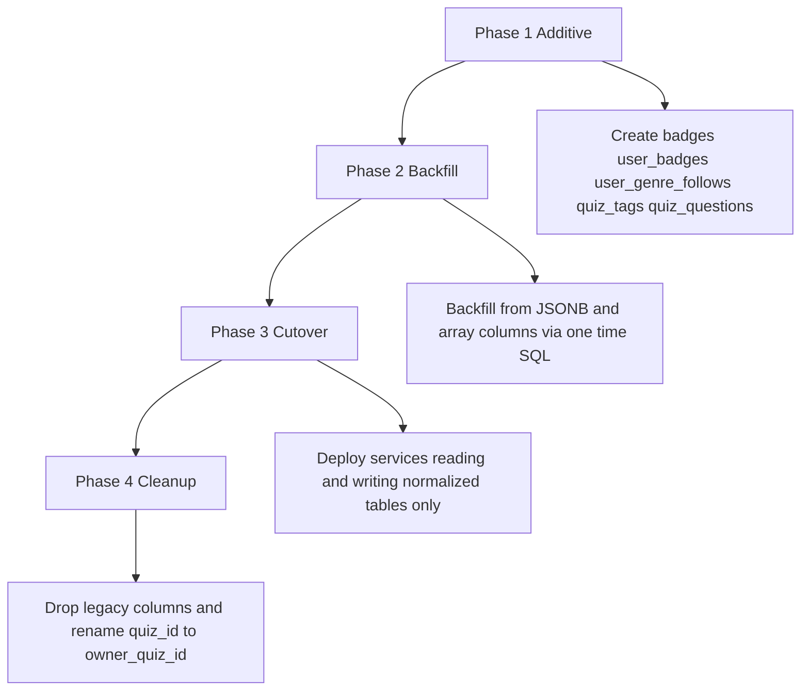

# Technical Design Document - supabase-core-data

## Overview
本ドキュメントは、Quizetika のコアデータ管理（ユーザープロフィール、クイズ、問題、ブックマーク、通知、お知らせ）における Firebase Firestore から Supabase (PostgreSQL) への移行を、**ドキュメント指向モデルの直訳ではなく RDB として完全に最適化されたスキーマ**で再設計するものです。

初回移行（`20260702000000_init.sql` 〜 `20260702000002_bookmark_rpc.sql`）は Firestore のコレクション／ドキュメント構造をほぼそのまま PostgreSQL テーブルへ転写しており、`follower_id + '_' + following_id` のような文字列連結主キー、`questions` の内容を複製した JSONB 埋め込み列、タグ・フォロージャンル・バッジを保持する配列/JSONB 列など、Firestore 時代の非正規化パターンが残存している。本設計はこれらを洗い出し、複合主キー・ジャンクションテーブル・外部キー制約による正規化構造へ置き換える。

### Goals
- `follows` / `bookmarks` の文字列連結 ID（Firestore ドキュメント ID の模倣）を廃止し、複合主キーによる自然キー設計へ置き換える。
- `users.badges` (JSONB) を `badges` マスタ + `user_badges` 中間テーブルへ正規化し、バッジ付与を `INSERT ... ON CONFLICT DO NOTHING` による冪等操作にする。
- `users.followed_genres` (TEXT[]) を `user_genre_follows` 中間テーブルへ正規化し、`metadata_genres` への外部キー整合性を持たせる。
- `quizzes.tags` / `original_tags` / `canonical_tag_ids` (TEXT[]) を `quiz_tags` 中間テーブルへ正規化し、`metadata_tags` への外部キー整合性と JOIN ベースの検索を実現する。
- `quizzes.questions` (JSONB 非正規化コピー) と `quizzes.question_ids` (UUID[]) を廃止し、`quiz_questions` 中間テーブル（`display_order` 列を持つ）による多対多関係へ置き換える。これにより「問題並び替え」(2.3) と「参照リンク問題の複数クイズからの共有」を単一の正規化構造で表現する。
- サービス層の TypeScript インターフェース（`User` / `Quiz` / `Question` / 各 Service 関数シグネチャ）は外部から見て変更しない。ブラックボックス置換の原則を継続し、UI・API Routes 側の改修を発生させない。

### Non-Goals
- クイズプレイ・解答履歴・レビュー・リアクション関連テーブル（`attempts`, `quiz_reviews`, `leaderboard_entries` 等）の再設計（`supabase-gameplay` が担当）
- モデレーション・タグ統合承認・Stripe 課金関連テーブル（`feedback_reports`, `merge_requests`, `genre_requests`, `admin_logs` 等）の再設計（`supabase-governance` が担当）
- 画像・アイコン等のストレージオブジェクト構造の変更（`supabase-storage-migration` が担当）
- `quizzes` テーブル上のゲームプレイ系カウンタ列（`play_count`, `positive_count`, `negative_count`, `review_score` 等）の構造変更。これらは他スペックが所有し、本設計では列定義を変更しない。
- 新規ユーザー向け機能の追加（本設計は既存要件 1〜4 の実現手段の最適化に限定する）

## Boundary Commitments

### This Spec Owns
- `users` テーブルのコアプロフィール列、および新設する `badges` / `user_badges` / `user_genre_follows` テーブルの構造とマイグレーション。
- `quizzes` / `questions` テーブルのうち、コンテンツ・所有権・タグ・問題構成に関わる列と、新設する `quiz_tags` / `quiz_questions` テーブルの構造とマイグレーション。
- `follows` / `bookmarks` テーブルの主キー構造とアトミック処理用 RPC（`handle_follow_user`, `handle_unfollow_user`, `handle_bookmark_toggle`, `handle_check_and_award_badges`, 新設 `handle_reorder_questions`）。
- `notifications` / `announcements` テーブルへの CRUD（構造変更なし）。
- `src/services/user.ts`, `quiz.ts`, `question.ts`, `bookmark.ts`, `notification.ts`, `announcement.ts` および `src/lib/metadata-resolution.ts` の実装。

### Out of Boundary
- `quizzes` テーブル上のゲームプレイ系カウンタ・リーダーボード列（`supabase-gameplay` が所有）。本設計はこれらの列を読み書きする既存コードパスの契約を変更しない。
- `quiz_reviews`, `feedback_reports`, `merge_requests`, `genre_requests`, `admin_logs`（他スペックが所有）。
- `reputation_history` (JSONB) および `reputation.ts`（`supabase-governance` が所有）。本設計では触れない。
- ストレージバケット・RLS ポリシーの新規追加（既存 RLS は列削除に追従して更新するのみ）。

### Allowed Dependencies
- `supabase-auth-migration`（認証済み Supabase クライアントの初期化・取得パターン）
- `metadata_genres` / `metadata_tags`（`supabase-governance` 系のガバナンスフローが更新するが、読み取り専用の外部キー参照先として利用）

### Revalidation Triggers
- `quiz_questions` / `quiz_tags` / `user_badges` / `user_genre_follows` のテーブル構造変更
- `follows` / `bookmarks` の主キー構成変更
- RPC (`handle_follow_user`, `handle_unfollow_user`, `handle_bookmark_toggle`, `handle_check_and_award_badges`, `handle_reorder_questions`) のシグネチャ変更
- `Quiz.tags` / `Quiz.questionIds` / `Quiz.questions` / `User.badges` / `User.followedGenres` の TypeScript 型構造変更（他スペックの型参照に影響するため）

## Architecture

### Existing Architecture Analysis
現行スキーマ（`supabase/migrations/20260702000000_init.sql`）は Firestore のコレクション構造を 1 対 1 で転写しており、以下の Firestore 固有パターンがそのまま残存している。

| パターン | 現状 | 問題点 |
|---------|------|--------|
| 文字列連結ドキュメント ID | `follows.id`, `bookmarks.id` が `"{a}_{b}"` 形式の TEXT 主キー | 複合キーで表現可能な関係を疑似 ID 化しており、JOIN・インデックス効率が低下する。`bookmarks.id` は `target_type` を含まないため理論上の衝突余地がある |
| 配列による多対多の疑似表現 | `quizzes.question_ids UUID[]` と `questions.quiz_id` FK が並存 | 「参照リンク問題」（`link_kind='reference'`）は複数クイズから同一問題を共有できる設計だが、`questions.quiz_id` は単一の親しか表現できず、実際の関連は `question_ids` 配列の `contains()` 全表スキャンに依存している（GIN インデックス未定義） |
| 非正規化コピー | `quizzes.questions JSONB` が `questions` テーブルの内容を複製 | 2 つの情報源が食い違うリスクを常に抱え、実装側も不整合検知のフォールバック処理（`question.ts` の `getQuestionsByQuiz`）を必要としている |
| JSONB/配列によるコレクション埋め込み | `users.badges JSONB`, `users.followed_genres TEXT[]`, `quizzes.tags/original_tags/canonical_tag_ids TEXT[]` | 追加・削除のたびに配列全体を読み込んで書き戻す必要があり（`followGenre`/`unfollowGenre` は read-modify-write）、同時更新でロストアップデートが発生し得る。タグ検索は GIN インデックスの `contains()` に依存し、`metadata_tags` への参照整合性を保証できない |

本設計は上記すべてに対して、複合主キー・中間テーブル・外部キー制約による正規化構造を導入する。**サービス層の外部インターフェース（`User`, `Quiz`, `Question`, `Follow`, `Bookmark` 型および各関数シグネチャ）は変更しない**——`mapRowTo*` 側で JOIN 結果を集約し、既存の配列/オブジェクト形状を再構成して返す。

### Architecture Pattern & Boundary Map



**Architecture Integration**:
- 採用パターン: サービス層をブラックボックスとして維持したままの「物理スキーマ正規化リファクタリング」。ドメイン型と関数シグネチャは不変、内部クエリのみ変更する。
- ドメイン境界: ユーザー基礎データ（`users`系）、クイズ・問題コンテンツ（`quizzes`/`questions`系）、関係性（`follows`/`bookmarks`）の 3 領域に分離し、それぞれ独立した中間テーブルを持つ。
- 既存パターンの継続: RPC によるアトミック処理（`supabase-core-data` 初回設計で採用済み）は継続し、正規化後のテーブルに対して同じ RPC 呼び出し規約を維持する。
- 新規コンポーネントの根拠: `quiz_questions` は「問題の並び替え」と「参照リンク問題の複数クイズ共有」という 2 つの要件を同時に満たす唯一の正規化手段であるため新設する。

### Technology Stack

| Layer | Choice / Version | Role in Feature | Notes |
|-------|------------------|-----------------|-------|
| Services / Core | TypeScript (strict) | サービス層のマッピング・クエリ実装 | `Database` 型 (`supabase gen types`) を再生成し利用 |
| Data / Storage | Supabase (PostgreSQL) 15+ | 正規化された永続データストア | 複合主キー・外部キー制約・部分インデックスを追加 |
| Infrastructure | Supabase RPC (PL/pgSQL) | アトミックなトランザクション処理 | 既存 RPC を複合キー対応に修正し、`handle_reorder_questions` を新設 |

## File Structure Plan

### Directory Structure
```
supabase/
├── migrations/
│   ├── 20260702000000_init.sql        # [変更なし] 既存ベーステーブル定義
│   ├── 20260702000001_rpc.sql         # [変更なし] 既存 RPC（後続マイグレーションで上書き）
│   ├── 20260702000002_bookmark_rpc.sql # [変更なし]
│   └── 20260703000000_core_data_normalization.sql # [NEW] 正規化テーブル・RPC 再定義・データ移行・旧列削除
src/
├── services/
│   ├── user.ts         # [MODIFY] badges / followedGenres のマッピングを JOIN ベースへ変更
│   ├── quiz.ts          # [MODIFY] tags / questionIds / questions のマッピングを JOIN ベースへ変更
│   ├── question.ts      # [MODIFY] quiz_questions 経由の取得・並び替え(updateQuestionOrder)を追加
│   ├── bookmark.ts      # [MODIFY] 複合キーへのクエリ変更、doc-id 生成ロジック除去
├── lib/
│   ├── metadata-resolution.ts # [MODIFY] タグ解決結果を quiz_tags へ反映する関数を追加
├── types/
│   └── index.ts          # [MODIFY] Follow / Bookmark から合成 id フィールドを削除
```

### Modified Files
- `supabase/migrations/20260703000000_core_data_normalization.sql` — 新テーブル作成、データバックフィル、RPC 再定義、旧列削除を 1 マイグレーションに集約（詳細は Data Models を参照）。
- 上記以外は「Modify」注記の通り、既存関数シグネチャを保ったまま内部実装のみ変更する。

## System Flows

### バッジ付与フロー（正規化後）

`ON CONFLICT DO NOTHING` により、同時実行された複数リクエストが同一バッジを二重付与することはない。JSONB マージ方式（旧実装）は明示的な `FOR UPDATE` ロックが必要だったが、複合主キーの一意制約が同じ保証を宣言的に提供する。

### 問題並び替えフロー（新設）


### ブックマークトグルフロー（複合キー化後）


## Requirements Traceability

| Requirement | Summary | Components | Interfaces | Flows |
|-------------|---------|------------|------------|-------|
| 1.1 | プロフィール更新 | user.ts | updateProfile | - |
| 1.2 | フォロー処理 | user.ts | followUser | - |
| 1.3 | アンフォロー処理 | user.ts | unfollowUser | - |
| 1.4 | バッジ自動獲得 | user.ts, badges, user_badges | checkAndAwardBadges | バッジ付与フロー |
| 2.1 | クイズ作成 | quiz.ts, quiz_tags, quiz_questions | createQuiz | - |
| 2.2 | クイズ更新 | quiz.ts | updateQuiz | - |
| 2.3 | 問題順序更新 | question.ts, quiz_questions | updateQuestionOrder | 問題並び替えフロー |
| 2.4 | クイズキーワード検索 | quiz.ts, quiz_tags | searchQuizzes | - |
| 2.5 | ジャンル指定クイズ一覧 | quiz.ts | getQuizzesByGenre | - |
| 3.1 | ブックマーク追加 | bookmark.ts, bookmarks | addBookmark | ブックマークトグルフロー |
| 3.2 | ブックマーク削除 | bookmark.ts, bookmarks | removeBookmark | ブックマークトグルフロー |
| 3.3 | ブックマーク一覧取得 | bookmark.ts | getBookmarkedQuizzes | - |
| 4.1 | 通知作成 | notification.ts | createNotification | - |
| 4.2 | 未読通知一覧・既読化 | notification.ts | getUnreadNotifications, markAsRead | - |
| 4.3 | お知らせ一覧取得 | announcement.ts | getPublishedAnnouncements | - |

## Components and Interfaces

### Core Services 概要

| Component | Domain/Layer | Intent | Req Coverage | Key Dependencies (P0/P1) | Contracts |
|-----------|--------------|--------|--------------|--------------------------|-----------|
| user.ts | Service | プロフィール・フォロー・バッジ管理 | 1.1-1.4 | badges, user_badges, user_genre_follows, follows (P0) | Service |
| quiz.ts | Service | クイズ CRUD・検索・ページネーション | 2.1, 2.2, 2.4, 2.5 | quiz_tags, quiz_questions (P0) | Service |
| question.ts | Service | 問題 CRUD・並び替え | 2.3 | quiz_questions (P0) | Service |
| bookmark.ts | Service | ブックマーク CRUD | 3.1-3.3 | bookmarks (P0) | Service |
| notification.ts | Service | 通知 CRUD | 4.1, 4.2 | notifications (P1) | Service |
| announcement.ts | Service | お知らせ取得 | 4.3 | announcements (P1) | Service |

### user.ts (User Service)

| Field | Detail |
|-------|--------|
| Intent | ユーザープロフィール、フォロー関係、バッジ、フォロー中ジャンルを正規化テーブル経由で提供する |
| Requirements | 1.1, 1.2, 1.3, 1.4 |

**Responsibilities & Constraints**
- `User.badges` / `User.followedGenres` は引き続き配列型として公開するが、内部では `user_badges` / `user_genre_follows` への JOIN で構築する。
- フォロー・バッジ付与のアトミック性は RPC に委譲する（クライアント側で複数テーブルを逐次更新しない）。

**Dependencies**
- Outbound: `badges`, `user_badges`, `user_genre_follows`, `follows`（P0） — 正規化テーブル
- Outbound: `notifications`（P1） — フォロー/バッジ獲得通知の作成

**Contracts**: Service [x]

##### Service Interface
```typescript
export interface UserService {
  getUserProfile(uid: string): Promise<User | null>;
  updateProfile(uid: string, data: UpdateProfileData): Promise<void>;
  createUser(user: Omit<User, 'createdAt' | 'updatedAt'>): Promise<void>;
  followUser(followerId: string, followingId: string): Promise<{ isFollowing: boolean }>;
  unfollowUser(followerId: string, followingId: string): Promise<void>;
  isFollowing(followerId: string, followingId: string): Promise<boolean>;
  getFollowingUsers(userId: string): Promise<User[]>;
  getFollowerUsers(userId: string): Promise<User[]>;
  checkAndAwardBadges(uid: string): Promise<Badge[]>;
  followGenre(userId: string, genreId: string): Promise<void>;
  unfollowGenre(userId: string, genreId: string): Promise<void>;
}
```
- Preconditions: `followGenre`/`unfollowGenre` は `metadata_genres` に存在する `genreId` を受け取る（存在しない場合は外部キー制約違反として例外化する）。
- Postconditions: `followGenre`/`unfollowGenre` は単一行の `INSERT ... ON CONFLICT DO NOTHING` / `DELETE` として実行され、他の同時実行リクエストの結果を上書きしない（旧実装の read-modify-write によるロストアップデートを排除）。
- Invariants: `user_badges` の `(user_id, badge_id)` は一意。同一バッジは二重付与されない。

### quiz.ts (Quiz Service)

| Field | Detail |
|-------|--------|
| Intent | クイズの作成・更新・削除・一覧取得・検索を、タグ/問題構成の正規化テーブル経由で提供する |
| Requirements | 2.1, 2.2, 2.4, 2.5 |

**Responsibilities & Constraints**
- `Quiz.tags` / `Quiz.originalTags` / `Quiz.canonicalTagIds` は `quiz_tags` への JOIN から再構成する。書き込み時は `quiz_tags` の差分 upsert/delete を行う。
- `Quiz.questionIds` / `Quiz.questions` は `quiz_questions` を `display_order` 順に JOIN して再構成する。書き込み時は `question.ts` の並び替え・追加・除去処理に委譲する。

**Dependencies**
- Outbound: `quiz_tags`, `quiz_questions`（P0） — クイズが所有するタグ・問題構成
- Outbound: `metadata_tags`, `metadata_genres`（P1） — 正規化 ID 解決（既存 `metadata-resolution.ts` を継続利用）

**Contracts**: Service [x]

##### Service Interface
```typescript
export interface QuizService {
  getQuiz(id: string): Promise<Quiz | null>;
  createQuiz(authorId: string, data: Partial<Quiz>): Promise<string>;
  updateQuiz(id: string, updates: Partial<Quiz>): Promise<void>;
  deleteQuiz(id: string): Promise<void>;
  searchQuizzes(queryStr: string, limitNum: number, cursor?: string): Promise<PaginatedQuizResult>;
  getQuizzesByGenre(genreId: string, limitNum: number, cursor?: string): Promise<PaginatedQuizResult>;
}
```
- Postconditions: `createQuiz`/`updateQuiz` は `quiz_tags` の行集合をクイズのタグ内容と一致させる（追加分を INSERT、除去分を DELETE）。JSONB マージやフルスキャンによる `contains()` 検索には依存しない。

### question.ts (Question Service)

| Field | Detail |
|-------|--------|
| Intent | 問題の CRUD、および `quiz_questions` を用いた並び替え・複数クイズからの参照共有を提供する |
| Requirements | 2.3 |

**Responsibilities & Constraints**
- `questions.owner_quiz_id`（旧 `quiz_id` を改称、削除権限判定用の所有クイズ）と、`quiz_questions`（表示・順序のための多対多関連）を明確に分離する。
- `canDeleteQuestionDoc` の判定は `quiz_questions` に対する `COUNT` クエリとなり、インデックス (`idx_quiz_questions_question_id`) を利用した効率的な参照カウントに置き換わる（旧: `question_ids` 配列の全表 `contains()` スキャン）。

**Dependencies**
- Outbound: `quiz_questions`（P0） — 問題とクイズの多対多関連・表示順序

**Contracts**: Service [x]

##### Service Interface
```typescript
export interface QuestionService {
  getQuestion(id: string): Promise<Question | null>;
  getQuestionsByQuiz(quizId: string): Promise<Question[]>;
  updateQuestionOrder(quizId: string, orderedQuestionIds: string[]): Promise<void>;
}
```
- Preconditions: `orderedQuestionIds` は対象クイズの `quiz_questions` に既に存在する `question_id` の完全な並び替えである。
- Postconditions: `quiz_questions.display_order` が `orderedQuestionIds` の配列インデックスと一致する。RPC 内の更新件数が `orderedQuestionIds.length` と一致しない場合は例外を送出する。
- Invariants: 同一 `quiz_id` 内で `display_order` は一意（`UNIQUE(quiz_id, display_order) DEFERRABLE INITIALLY DEFERRED`）。

### bookmark.ts (Bookmark Service)

| Field | Detail |
|-------|--------|
| Intent | ブックマークの追加・削除・一覧取得を複合キーテーブル経由で提供する |
| Requirements | 3.1, 3.2, 3.3 |

**Responsibilities & Constraints**
- `getBookmarkDocId` のような疑似ドキュメント ID 生成関数を廃止し、`(user_id, target_id, target_type)` の複合条件で直接クエリする。

**Contracts**: Service [x]

##### Service Interface
```typescript
export interface BookmarkService {
  isBookmarked(userId: string, targetId: string, targetType?: 'quiz' | 'question'): Promise<boolean>;
  toggleBookmark(userId: string, targetId: string, targetType: 'quiz' | 'question'): Promise<boolean>;
  getBookmarkedQuizzes(userId: string): Promise<Quiz[]>;
  getBookmarkedQuestions(userId: string): Promise<Question[]>;
}
```
- Preconditions: `isBookmarked` の `targetType` は省略可能とする。既存呼び出し元（UI コンポーネント6箇所以上が `isBookmarked(user.id, q.id)` の2引数形式で呼び出している）への破壊的変更を避けるため、省略時は `target_id` のみで複合キーを検索する（型を跨いだ UUID 衝突は理論上のみで実運用上のリスクはない）。`toggleBookmark` 内部では常に `targetType` を明示して呼び出す。

### notification.ts / announcement.ts
構造変更なし。既存インターフェース（`getNotifications`, `markAsRead`, `createNotification`, `getUnreadNotificationsCount`, `markAllNotificationsAsRead`, `getAnnouncements`, `getAnnouncementById`, `adminGetAnnouncements`, `createAnnouncement`, `updateAnnouncement`, `deleteAnnouncement`, `getUnreadAnnouncementsCount`）を維持する（Requirements 4.1-4.3 は Summary-only）。

## Data Models

### Logical Data Model



**構造の要点**:
- `user_badges`, `user_genre_follows`, `quiz_tags`, `quiz_questions` はすべて複合主キーを持つ中間テーブルであり、代理キー（サロゲート ID）を持たない。
- `follows`, `bookmarks` は複合主キーのみを持ち、Firestore 由来の文字列連結 `id` 列を廃止する。
- `questions.owner_quiz_id` は「所有・削除権限の起点となるクイズ」を表す 1 対多の関連であり、`quiz_questions` の「表示上どのクイズに含まれるか」という多対多の関連とは独立した意味を持つ。

### Physical Data Model

#### 新設・変更テーブル定義
```sql
-- バッジカタログ（BADGE_DEFINITIONS と同期させるマスタテーブル）
CREATE TABLE badges (
    id TEXT PRIMARY KEY,
    title TEXT NOT NULL,
    description TEXT NOT NULL,
    icon_name TEXT NOT NULL
);

-- ユーザー獲得バッジ（旧 users.badges JSONB を正規化）
CREATE TABLE user_badges (
    user_id UUID REFERENCES users(id) ON DELETE CASCADE NOT NULL,
    badge_id TEXT REFERENCES badges(id) ON DELETE RESTRICT NOT NULL,
    unlocked_at TIMESTAMPTZ DEFAULT now() NOT NULL,
    PRIMARY KEY (user_id, badge_id)
);

-- ユーザーのフォロー中ジャンル（旧 users.followed_genres TEXT[] を正規化）
CREATE TABLE user_genre_follows (
    user_id UUID REFERENCES users(id) ON DELETE CASCADE NOT NULL,
    genre_id TEXT REFERENCES metadata_genres(id) ON DELETE CASCADE NOT NULL,
    created_at TIMESTAMPTZ DEFAULT now() NOT NULL,
    PRIMARY KEY (user_id, genre_id)
);

-- クイズタグの多対多関連（旧 quizzes.tags / original_tags / canonical_tag_ids TEXT[] を正規化）
CREATE TABLE quiz_tags (
    quiz_id UUID REFERENCES quizzes(id) ON DELETE CASCADE NOT NULL,
    tag_id TEXT REFERENCES metadata_tags(id) ON DELETE RESTRICT NOT NULL,
    original_label TEXT NOT NULL,
    PRIMARY KEY (quiz_id, tag_id)
);
CREATE INDEX idx_quiz_tags_tag_id ON quiz_tags(tag_id);

-- クイズと問題の多対多関連 + 表示順序（旧 quizzes.question_ids / questions JSONB を正規化）
CREATE TABLE quiz_questions (
    quiz_id UUID REFERENCES quizzes(id) ON DELETE CASCADE NOT NULL,
    question_id UUID REFERENCES questions(id) ON DELETE CASCADE NOT NULL,
    display_order INTEGER NOT NULL,
    PRIMARY KEY (quiz_id, question_id),
    UNIQUE (quiz_id, display_order) DEFERRABLE INITIALLY DEFERRED
);
CREATE INDEX idx_quiz_questions_question_id ON quiz_questions(question_id);

-- questions.quiz_id を所有クイズ参照として明示的に改称
ALTER TABLE questions RENAME COLUMN quiz_id TO owner_quiz_id;

-- 旧 Firestore 由来の非正規化列を削除
ALTER TABLE quizzes DROP COLUMN tags, DROP COLUMN original_tags, DROP COLUMN canonical_tag_ids,
    DROP COLUMN question_ids, DROP COLUMN questions;
ALTER TABLE users DROP COLUMN badges, DROP COLUMN followed_genres;

-- follows / bookmarks の複合主キー化（文字列連結 id を廃止）
ALTER TABLE follows DROP CONSTRAINT follows_pkey, DROP COLUMN id;
ALTER TABLE follows ADD PRIMARY KEY (follower_id, following_id);

ALTER TABLE bookmarks DROP CONSTRAINT bookmarks_pkey, DROP COLUMN id;
ALTER TABLE bookmarks ADD PRIMARY KEY (user_id, target_id, target_type);
```

#### RPC 関数の再定義
```sql
CREATE OR REPLACE FUNCTION handle_follow_user(
  p_follower_id UUID,
  p_following_id UUID
) RETURNS BOOLEAN AS $$
DECLARE
  v_inserted BOOLEAN := FALSE;
BEGIN
  INSERT INTO follows (follower_id, following_id, created_at)
  VALUES (p_follower_id, p_following_id, now())
  ON CONFLICT (follower_id, following_id) DO NOTHING;

  GET DIAGNOSTICS v_inserted = ROW_COUNT;
  IF NOT v_inserted THEN
    RETURN FALSE;
  END IF;

  UPDATE users SET following_count = following_count + 1, updated_at = now() WHERE id = p_follower_id;
  UPDATE users SET followers_count = followers_count + 1, updated_at = now() WHERE id = p_following_id;
  RETURN TRUE;
END;
$$ LANGUAGE plpgsql SECURITY DEFINER;

CREATE OR REPLACE FUNCTION handle_unfollow_user(
  p_follower_id UUID,
  p_following_id UUID
) RETURNS BOOLEAN AS $$
DECLARE
  v_deleted BOOLEAN := FALSE;
BEGIN
  DELETE FROM follows WHERE follower_id = p_follower_id AND following_id = p_following_id;
  GET DIAGNOSTICS v_deleted = ROW_COUNT;
  IF NOT v_deleted THEN
    RETURN FALSE;
  END IF;

  UPDATE users SET following_count = GREATEST(0, following_count - 1), updated_at = now() WHERE id = p_follower_id;
  UPDATE users SET followers_count = GREATEST(0, followers_count - 1), updated_at = now() WHERE id = p_following_id;
  RETURN TRUE;
END;
$$ LANGUAGE plpgsql SECURITY DEFINER;

CREATE OR REPLACE FUNCTION handle_check_and_award_badges(
  p_user_id UUID,
  p_badge_ids TEXT[]
) RETURNS TEXT[] AS $$
DECLARE
  v_awarded TEXT[];
BEGIN
  INSERT INTO user_badges (user_id, badge_id, unlocked_at)
  SELECT p_user_id, b, now() FROM unnest(p_badge_ids) AS b
  ON CONFLICT (user_id, badge_id) DO NOTHING
  RETURNING badge_id INTO v_awarded;

  RETURN COALESCE(v_awarded, ARRAY[]::TEXT[]);
END;
$$ LANGUAGE plpgsql SECURITY DEFINER;

CREATE OR REPLACE FUNCTION handle_bookmark_toggle(
  p_user_id UUID,
  p_target_id UUID,
  p_target_type TEXT
) RETURNS BOOLEAN AS $$
DECLARE
  v_already_exists BOOLEAN;
  v_target_exists BOOLEAN;
BEGIN
  IF p_target_type = 'quiz' THEN
    SELECT EXISTS(SELECT 1 FROM quizzes WHERE id = p_target_id) INTO v_target_exists;
  ELSIF p_target_type = 'question' THEN
    SELECT EXISTS(SELECT 1 FROM questions WHERE id = p_target_id) INTO v_target_exists;
  ELSE
    RAISE EXCEPTION 'Invalid bookmark target type';
  END IF;
  IF NOT v_target_exists THEN
    RAISE EXCEPTION 'Target document does not exist.';
  END IF;

  SELECT EXISTS(
    SELECT 1 FROM bookmarks WHERE user_id = p_user_id AND target_id = p_target_id AND target_type = p_target_type::bookmark_target_type_enum
  ) INTO v_already_exists;

  IF v_already_exists THEN
    DELETE FROM bookmarks WHERE user_id = p_user_id AND target_id = p_target_id AND target_type = p_target_type::bookmark_target_type_enum;
    IF p_target_type = 'quiz' THEN
      UPDATE quizzes SET bookmarks_count = GREATEST(0, COALESCE(bookmarks_count, 0) - 1), updated_at = now() WHERE id = p_target_id;
    ELSE
      UPDATE questions SET bookmarks_count = GREATEST(0, COALESCE(bookmarks_count, 0) - 1) WHERE id = p_target_id;
    END IF;
    RETURN FALSE;
  ELSE
    INSERT INTO bookmarks (user_id, target_id, target_type, created_at)
    VALUES (p_user_id, p_target_id, p_target_type::bookmark_target_type_enum, now());
    IF p_target_type = 'quiz' THEN
      UPDATE quizzes SET bookmarks_count = COALESCE(bookmarks_count, 0) + 1, updated_at = now() WHERE id = p_target_id;
    ELSE
      UPDATE questions SET bookmarks_count = COALESCE(bookmarks_count, 0) + 1 WHERE id = p_target_id;
    END IF;
    RETURN TRUE;
  END IF;
END;
$$ LANGUAGE plpgsql SECURITY DEFINER;

-- 新設: 問題並び替え（要件 2.3 を初めて実装する RPC）
CREATE OR REPLACE FUNCTION handle_reorder_questions(
  p_quiz_id UUID,
  p_question_ids UUID[]
) RETURNS INTEGER AS $$
DECLARE
  v_updated INTEGER;
BEGIN
  UPDATE quiz_questions AS qq
  SET display_order = ordering.ord
  FROM (
    SELECT unnest(p_question_ids) AS question_id, generate_series(0, array_length(p_question_ids, 1) - 1) AS ord
  ) AS ordering
  WHERE qq.quiz_id = p_quiz_id AND qq.question_id = ordering.question_id;

  GET DIAGNOSTICS v_updated = ROW_COUNT;
  IF v_updated <> array_length(p_question_ids, 1) THEN
    RAISE EXCEPTION 'Question set does not match quiz_questions membership for quiz %', p_quiz_id;
  END IF;
  RETURN v_updated;
END;
$$ LANGUAGE plpgsql SECURITY DEFINER;
```

**バッジカタログのシード**: `badges` テーブルは `src/services/user.ts` の `BADGE_DEFINITIONS`（11件）と 1:1 で対応するデータをマイグレーション内で `INSERT` する。`BADGE_DEFINITIONS` は条件判定ロジック（`condition` 関数）の正とし続け、`badges` テーブルは表示メタデータと外部キー整合性のためのカタログとして機能する。両者の乖離は Testing Strategy のシード整合性テストで検出する。

### Data Contracts & Integration

**行 ↔ ドメイン型のマッピング方針**:
- `getUserProfile`: `users` に対し `user_badges JOIN badges`、`user_genre_follows` をサブクエリで集約し、`User.badges: Badge[]` / `User.followedGenres: string[]` を従来と同じ形状で構築する。
- `getQuiz` / `mapRowToQuiz`: `quiz_tags JOIN metadata_tags` から `Quiz.tags` / `Quiz.originalTags` / `Quiz.canonicalTagIds` を再構成し、`quiz_questions ORDER BY display_order JOIN questions` から `Quiz.questionIds` / `Quiz.questions` を再構成する。
- `Follow` / `Bookmark` 型からは合成 `id` フィールドを削除する（`src/types/index.ts`）。コードベース内に `Follow.id` / `Bookmark.id` の参照は存在しないため、外部契約への影響はない。
- `createQuiz` / `updateQuiz`: タグは正規化された `tags` 配列との差分を `quiz_tags` に対して `INSERT ... ON CONFLICT DO NOTHING` + 除去分 `DELETE` で反映する。問題構成は `quiz_questions` への `INSERT`/`DELETE` と `handle_reorder_questions` の組み合わせで反映する。

## Migration Strategy



- **Phase 1 (Additive)**: `20260703000000_core_data_normalization.sql` にて中間テーブル・カタログテーブルを追加する。
- **Phase 2 (Backfill)**: 同ファイル内で `jsonb_array_elements(users.badges)` 等を用いた 1 回限りのバックフィル SQL を実行し、新テーブルへ既存データを複製する。
- **Phase 3 (Cutover)**: 同ファイル内で `follows`/`bookmarks` の複合主キー化、`questions.quiz_id`→`owner_quiz_id` のリネーム、RPC 関数の再定義まで完了させ、サービス層（`user.ts`, `quiz.ts`, `question.ts`, `bookmark.ts`）を新テーブル参照へ切り替えてデプロイする。JSONB/配列の旧列（`users.badges/followed_genres`, `quizzes.tags/original_tags/canonical_tag_ids/question_ids/questions`）は読み取り専用のフォールバックとして物理的に残す。
- **Phase 4 (Cleanup)**: `20260703000100_core_data_cleanup.sql` にて、挙動確認後に残存する JSONB/配列の旧列を削除する。

## Error Handling

### Error Strategy
- `PostgrestError` を捕捉し、ドメインエラー（`Error`）としてメッセージを詳細化した上でスローする方針を継続する。
- 複合主キーの一意制約違反（`23505`）は「既に存在する」という業務的に正常な分岐として扱う（例: `followUser` の重複フォロー） — RPC 側で `ON CONFLICT DO NOTHING` により制御し、例外化しない。
- `handle_reorder_questions` は更新件数が入力配列長と一致しない場合に例外を送出し、呼び出し元は「クイズに属さない問題 ID が含まれていた」ことを検知できる。
- 外部キー制約違反（`23503`）、例えば存在しない `genre_id` への `followGenre` は、そのまま `PostgrestError` を包んだドメインエラーとして呼び出し元に伝播する。

## Testing Strategy

### Unit Tests
- `tests/services/user.test.ts`: プロフィール取得・更新、フォロー/アンフォロー（RPC モック）、バッジ付与の冪等性（同一バッジを重複付与しても `user_badges` が 1 行のみになること）、`followGenre`/`unfollowGenre` の単一行 INSERT/DELETE 化の検証。
- `tests/services/quiz.test.ts`: `quiz_tags` / `quiz_questions` の JOIN 結果が `Quiz.tags` / `Quiz.questionIds` / `Quiz.questions` の形状と一致することの検証。
- `tests/services/question.test.ts`: `updateQuestionOrder` が `display_order` を正しく更新すること、対象外の問題 ID を含む場合に例外となることの検証。
- `tests/services/bookmark.test.ts`: 複合キーによる `isBookmarked` / `toggleBookmark` の検証（`target_type` を跨いだ ID 衝突が発生しないことを含む）。

### Integration Verification
- ローカル Supabase 環境に `20260703000000_core_data_normalization.sql` を適用し、バックフィル後のデータ件数（`user_badges` 件数が旧 `users.badges` 配列要素数の総和と一致する等）を検証する。
- `badges` テーブルのシードデータが `BADGE_DEFINITIONS` の件数・ID と一致することを検証するシード整合性テストを追加する。
- Jest によるテストスイートの全パス確認、および `npm run build` による型エラーゼロの確認。
