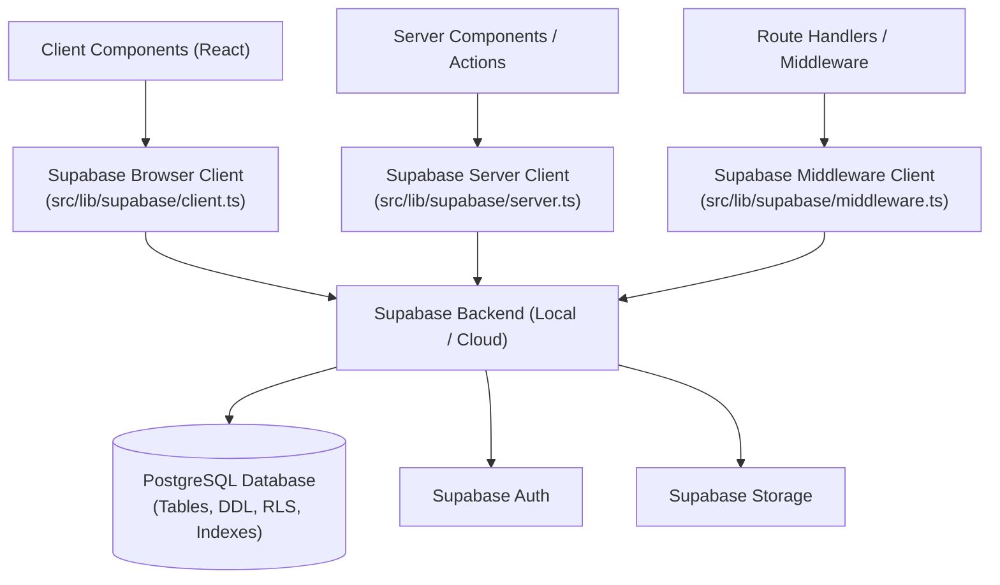
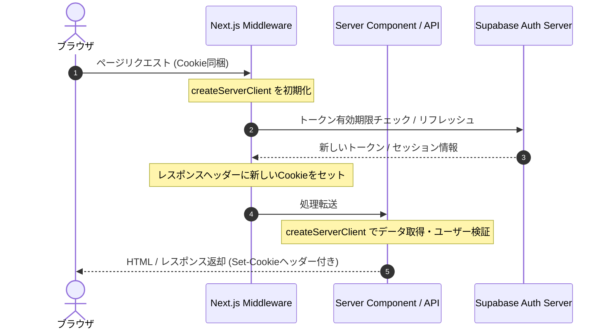

# Design Document: supabase-foundation

## Overview
本デザインは、Firebase から Supabase への完全移行プロジェクトにおける共通基盤（Foundation）の設計書です。プロジェクト全体のデータベース（Firestore → PostgreSQL）、認証（Firebase Auth → Supabase Auth）、ストレージ（Firebase Storage → Supabase Storage）を置き換えるための初期スキーマ定義、セキュリティルール（RLS ポリシー）、Next.js 用のクライアント初期化、ローカル開発環境を定義します。

### Goals
- Next.js App Router で動作する Cookie ベースの Supabase クライアント初期化ユーティリティの確立。
- 既存の全 Firestore コレクションとセキュリティルールを忠実に移行した PostgreSQL スキーマと RLS ポリシーの定義。
- Supabase CLI によるローカル開発環境のセットアップ。
- スキーマに基づく TypeScript 型定義の自動生成フローの構築。

### Non-Goals
- 個別のアプリケーションサービス層（`src/services/` 配下）のコード書き換え（`supabase-core-data` 以降が担当）。
- フロントエンド UI コンポーネント内のデータソース切り替え。
- 既存 Firebase データの物理的な移行処理。

## Boundary Commitments

### This Spec Owns
- Supabase 初期化構成ファイル（`supabase/config.toml`）。
- 全 22 テーブルおよび外部キー、インデックスの定義を含む PostgreSQL DDL。
- データベースおよびストレージに対する RLS（Row Level Security）ポリシーの定義。
- `src/lib/supabase/` 配下のブラウザ、サーバー、ミドルウェア用のクライアント初期化コード。
- 自動生成されたデータベース型定義 `src/lib/supabase/database.types.ts`。

### Out of Boundary
- `src/services/` 内の個別データベース読み書き処理の変更。
- `auth-context.tsx` やログインページの認証ロジック書き換え。
- 既存 E2E テストおよびユニットテストの Supabase 対応。

### Allowed Dependencies
- **Docker**: ローカル開発環境で Supabase Local Emulator を稼働するために必須。
- **@supabase/supabase-js, @supabase/ssr**: Supabase と Next.js SSR 連携のための公式パッケージ。

### Revalidation Triggers
- `database.types.ts` 内のスキーマ定義（カラム追加・削除・変更）。
- クライアント初期化ユーティリティ（`src/lib/supabase/server.ts` 等）のシグネチャ変更。

## Architecture

### Architecture Pattern & Boundary Map



### Technology Stack

| Layer | Choice / Version | Role in Feature | Notes |
|-------|------------------|-----------------|-------|
| Frontend / CLI | Supabase CLI | ローカル開発・マイグレーション管理 | `npx supabase` コマンドで制御 |
| Backend / SDK | `@supabase/supabase-js` | クライアント / サーバーでの通信用 SDK | v2.x |
| SSR Helper | `@supabase/ssr` | Next.js App Router での Cookie 連携・セッション更新 | |
| Data / Storage | PostgreSQL 15+ | データベースエンジン | Supabase 標準 |

## File Structure Plan

### Directory Structure
```
supabase/
├── config.toml                     # Supabase CLI 設定ファイル
├── migrations/
│   └── 20260702000000_init.sql     # 初期の全テーブル定義、インデックス、RLS ポリシー
└── seed.sql                        # ローカル開発環境用の初期シードデータ
src/
└── lib/
    └── supabase/
        ├── client.ts               # ブラウザ用 Supabase クライアント
        ├── server.ts               # サーバー用 Supabase クライアント
        ├── middleware.ts           # ミドルウェア用 Supabase クライアント
        └── database.types.ts       # 自動生成される型定義ファイル
```

### Modified Files
- `package.json` — `@supabase/supabase-js`, `@supabase/ssr` の追加、型生成スクリプト `gen:types` の追加
- `.env.local.example` — Supabase 関連環境変数のプレースホルダー追加

## System Flows

### Cookie-based Session Handling (Next.js SSR)



## Requirements Traceability

| Requirement | Summary | Components | Interfaces | Flows |
|-------------|---------|------------|------------|-------|
| 1.1 | ブラウザ用クライアント | Browser Client | `createBrowserClient` | - |
| 1.2 | サーバー用クライアント | Server Client | `createServerClient` | Cookie-based Session |
| 1.3 | ミドルウェア用クライアント | Middleware Client | `createServerClient` (Middleware) | Cookie-based Session |
| 1.4 | 環境変数の利用 | Configuration | Config loading | - |
| 1.5 | サービスロール特権クライアント | Admin Client | `createAdminClient` | - |
| 2.1 | 全テーブル DDL 定義 | PostgreSQL Schema | DDL Scripts | - |
| 2.2 | 主キー UUID 統一 | PostgreSQL Schema | UUID Constraints | - |
| 2.3 | 日時型 timestamptz 統一 | PostgreSQL Schema | Timestamptz Constraints | - |
| 2.4 | 配列型の変換 | PostgreSQL Schema | Array columns | - |
| 2.5 | ネスト構造の JSONB 変換 | PostgreSQL Schema | JSONB columns | - |
| 2.6 | 外部キー制約の設定 | PostgreSQL Schema | FK constraints | - |
| 2.7 | 列挙型制約 | PostgreSQL Schema | CHECK constraints | - |
| 3.1 | RLS 有効化 | RLS Engine | `ENABLE ROW LEVEL SECURITY` | - |
| 3.2 | `users` RLS ポリシー | RLS Engine | RLS Policy | - |
| 3.3 | `quizzes` 閲覧範囲 RLS | RLS Engine | RLS Policy | - |
| 3.4 | BAN ユーザー拒否 RLS | RLS Engine | Global RLS | - |
| 3.5 | `admin_logs` 書き込み制限 | RLS Engine | Service Role Policy | - |
| 3.6 | `bookmarks` ユーザー制限 | RLS Engine | RLS Policy | - |
| 3.7 | `attempts` ユーザー制限 | RLS Engine | RLS Policy | - |
| 3.8 | `notifications` ユーザー制限 | RLS Engine | RLS Policy | - |
| 3.9 | モデレータ `flags` 閲覧制限 | RLS Engine | RLS Policy | - |
| 3.10| `announcements` 管理者制限 | RLS Engine | RLS Policy | - |
| 4.1 | クイズ複合インデックス | DB Indexes | Indexes | - |
| 4.2 | タグ検索 GIN インデックス | DB Indexes | GIN Indexes | - |
| 4.3 | アテンプト履歴インデックス | DB Indexes | Indexes | - |
| 4.4 | 作者別クイズ一覧インデックス | DB Indexes | Indexes | - |
| 4.5 | 外部キーインデックス | DB Indexes | Indexes | - |
| 5.1 | ストレージバケット定義 | Storage Engine | Buckets | - |
| 5.2 | sns-logos パブリック設定 | Storage Engine | Bucket Policy | - |
| 5.3 | ストレージアクセスポリシー | Storage Engine | Storage RLS | - |
| 5.4 | ストレージ MIME 制限 | Storage Engine | Storage Policy | - |
| 5.5 | ストレージ容量制限 | Storage Engine | Storage Policy | - |
| 6.1 | supabase init | CLI Environment | config.toml | - |
| 6.2 | supabase start | CLI Environment | Emulators | - |
| 6.3 | シードデータ | CLI Environment | seed.sql | - |
| 6.4 | supabase db reset | CLI Environment | DDL + Seed refresh | - |
| 7.1 | supabase gen types | CLI Environment | database.types.ts | - |
| 7.2 | 全テーブル型情報 | CLI Environment | Types validation | - |
| 7.3 | scripts 登録 | CLI Environment | package.json scripts | - |
| 8.1 | 環境変数テンプレート | Configuration | .env.local.example | - |
| 8.2 | サービスロール秘匿 | Configuration | .env.local.example | - |
| 8.3 | 移行メモ記載 | Configuration | .env.local.example | - |
| 9.1 | 共通ヘルパー関数定義 | RPC / DB Functions | Functions DDL | - |
| 9.2 | SECURITY 定義 | RPC / DB Functions | Functions DDL | - |
| 9.3 | 拡張性維持 | RPC / DB Functions | Migrations pattern | - |

## Components and Interfaces

### Supabase SDK Integration Layer

#### Browser Client
- **Intent**: クライアントサイドでの認証チェックやクエリ用のクライアントを提供。 (1.1)
- **Requirements**: 1.1, 1.4
- **Dependencies**: 
  - External: `@supabase/ssr` (P0)
- **Contracts**: Service [x] / API [ ] / Event [ ] / Batch [ ] / State [ ]
- **Service Interface**:
```typescript
import { createBrowserClient } from '@supabase/ssr';
import { Database } from './database.types';

export function createClient() {
  return createBrowserClient<Database>(
    process.env.NEXT_PUBLIC_SUPABASE_URL!,
    process.env.NEXT_PUBLIC_SUPABASE_ANON_KEY!
  );
}
```

#### Server Client
- **Intent**: サーバーサイド環境で Cookie セッション管理を有効にしたクライアントを提供。 (1.2)
- **Requirements**: 1.2, 1.4
- **Dependencies**: 
  - External: `@supabase/ssr` (P0), `next/headers` (P0)
- **Contracts**: Service [x] / API [ ] / Event [ ] / Batch [ ] / State [ ]
- **Service Interface**:
```typescript
import { createServerClient } from '@supabase/ssr';
import { cookies } from 'next/headers';
import { Database } from './database.types';

export async function createClient() {
  const cookieStore = await cookies();
  return createServerClient<Database>(
    process.env.NEXT_PUBLIC_SUPABASE_URL!,
    process.env.NEXT_PUBLIC_SUPABASE_ANON_KEY!,
    {
      cookies: {
        getAll() {
          return cookieStore.getAll();
        },
        setAll(cookiesToSet) {
          try {
            cookiesToSet.forEach(({ name, value, options }) =>
              cookieStore.set(name, value, options)
            );
          } catch {
            // ミドルウェアでリフレッシュ処理が動いている場合、Server Component からの set は無視してよい
          }
        },
      },
    }
  );
}
```

#### Middleware Client
- **Intent**: Next.js Middleware でセッション期限切れトークンの自動延長を安全に行う。 (1.3)
- **Requirements**: 1.3, 1.4
- **Dependencies**: 
  - External: `@supabase/ssr` (P0), `next/server` (P0)
- **Contracts**: Service [x] / API [ ] / Event [ ] / Batch [ ] / State [ ]
- **Service Interface**:
```typescript
import { createServerClient } from '@supabase/ssr';
import { NextResponse, type NextRequest } from 'next/server';
import { Database } from './database.types';

export async function updateSession(request: NextRequest) {
  let supabaseResponse = NextResponse.next({
    request,
  });

  const supabase = createServerClient<Database>(
    process.env.NEXT_PUBLIC_SUPABASE_URL!,
    process.env.NEXT_PUBLIC_SUPABASE_ANON_KEY!,
    {
      cookies: {
        getAll() {
          return request.cookies.getAll();
        },
        setAll(cookiesToSet) {
          cookiesToSet.forEach(({ name, value, options }) => request.cookies.set(name, value));
          supabaseResponse = NextResponse.next({
            request,
          });
          cookiesToSet.forEach(({ name, value, options }) =>
            supabaseResponse.cookies.set(name, value, options)
          );
        },
      },
    }
  );

  // トークンの自動リフレッシュのためにユーザー情報をロードする
  await supabase.auth.getUser();

  return supabaseResponse;
}
```

#### Admin Client
- **Intent**: サーバーサイド限定で RLS をバイパスし、特権操作を実行するクライアントを提供。 (1.5)
- **Requirements**: 1.5
- **Dependencies**: 
  - External: `@supabase/supabase-js` (P0)
- **Contracts**: Service [x] / API [ ] / Event [ ] / Batch [ ] / State [ ]
- **Service Interface**:
```typescript
import { createClient } from '@supabase/supabase-js';
import { Database } from './database.types';

export function createAdminClient() {
  return createClient<Database>(
    process.env.NEXT_PUBLIC_SUPABASE_URL!,
    process.env.SUPABASE_SERVICE_ROLE_KEY!
  );
}
```

## Data Models

### Physical Data Model

PostgreSQL スキーマ DDL 設計（`supabase/migrations/20260702000000_init.sql` に配置）。

```sql
-- 拡張機能の有効化
CREATE EXTENSION IF NOT EXISTS "uuid-ossp";

-- カスタム列挙型の定義
CREATE TYPE moderation_tier_enum AS ENUM ('newcomer', 'contributor', 'moderator', 'senior_moderator', 'admin');
CREATE TYPE quiz_visibility_enum AS ENUM ('public', 'private', 'followers');
CREATE TYPE quiz_status_enum AS ENUM ('draft', 'published', 'suspended');
CREATE TYPE feedback_report_category_enum AS ENUM ('typo', 'fact', 'alternative');
CREATE TYPE feedback_report_status_enum AS ENUM ('open', 'resolved', 'rejected');
CREATE TYPE bookmark_target_type_enum AS ENUM ('quiz', 'question');
CREATE TYPE announcement_category_enum AS ENUM ('info', 'maintenance', 'update', 'bug', 'important');
CREATE TYPE admin_log_action_enum AS ENUM ('reputation_reset', 'ban', 'unban');

-- 1. users テーブル
CREATE TABLE users (
    id UUID PRIMARY KEY, -- Auth.users.id と紐付け
    email TEXT UNIQUE NOT NULL,
    display_name TEXT NOT NULL,
    avatar_url TEXT,
    bio TEXT DEFAULT '',
    followed_genres TEXT[] DEFAULT '{}',
    badges JSONB DEFAULT '[]',
    created_quizzes_count INTEGER DEFAULT 0,
    total_play_count INTEGER DEFAULT 0,
    followers_count INTEGER DEFAULT 0,
    following_count INTEGER DEFAULT 0,
    reputation_score INTEGER DEFAULT 0,
    total_reactions_count INTEGER DEFAULT 0,
    moderation_tier moderation_tier_enum DEFAULT 'newcomer',
    role TEXT,
    reputation_history JSONB DEFAULT '[]',
    last_reputation_calculated_at TIMESTAMPTZ,
    total_failed_questions_count INTEGER DEFAULT 0,
    delete_status TEXT DEFAULT 'active' CHECK (delete_status IN ('active', 'delete_pending')),
    is_banned BOOLEAN DEFAULT FALSE,
    banned_reason TEXT,
    banned_at TIMESTAMPTZ,
    subscription_tier TEXT DEFAULT 'free',
    stripe_customer_id TEXT,
    stripe_subscription_id TEXT,
    subscription_status TEXT,
    current_period_end TIMESTAMPTZ,
    is_premium BOOLEAN DEFAULT FALSE,
    sns_links JSONB DEFAULT '{}',
    created_at TIMESTAMPTZ DEFAULT now() NOT NULL,
    updated_at TIMESTAMPTZ DEFAULT now() NOT NULL
);

-- 2. quizzes テーブル
CREATE TABLE quizzes (
    id UUID PRIMARY KEY DEFAULT gen_random_uuid(),
    author_id UUID REFERENCES users(id) ON DELETE CASCADE NOT NULL,
    author_name TEXT NOT NULL,
    author_avatar TEXT,
    title TEXT NOT NULL,
    description TEXT NOT NULL,
    thumbnail_url TEXT,
    difficulty INTEGER NOT NULL CHECK (difficulty BETWEEN 1 AND 5),
    genre TEXT NOT NULL,
    tags TEXT[] DEFAULT '{}',
    original_tags TEXT[] DEFAULT '{}',
    question_ids UUID[] DEFAULT '{}',
    questions JSONB DEFAULT '[]',
    question_count INTEGER DEFAULT 0,
    status quiz_status_enum DEFAULT 'draft' NOT NULL,
    visibility quiz_visibility_enum DEFAULT 'public' NOT NULL,
    flags_count INTEGER DEFAULT 0,
    play_count INTEGER DEFAULT 0,
    bookmarks_count INTEGER DEFAULT 0,
    positive_count INTEGER DEFAULT 0,
    negative_count INTEGER DEFAULT 0,
    temp_positive_count INTEGER DEFAULT 0,
    temp_negative_count INTEGER DEFAULT 0,
    review_score NUMERIC,
    review_badge TEXT,
    is_review_masked BOOLEAN DEFAULT FALSE,
    active_reset_request_id TEXT,
    canonical_genre_id TEXT NOT NULL,
    canonical_tag_ids TEXT[] DEFAULT '{}',
    format TEXT,
    created_at TIMESTAMPTZ DEFAULT now() NOT NULL,
    updated_at TIMESTAMPTZ DEFAULT now() NOT NULL
);

-- 3. questions テーブル
CREATE TABLE questions (
    id UUID PRIMARY KEY DEFAULT gen_random_uuid(),
    quiz_id UUID REFERENCES quizzes(id) ON DELETE CASCADE,
    link_kind TEXT DEFAULT 'owned',
    author_id UUID REFERENCES users(id) ON DELETE SET NULL,
    author_name TEXT,
    author_avatar TEXT,
    type TEXT NOT NULL,
    question_text TEXT NOT NULL,
    explanation TEXT NOT NULL,
    image_url TEXT,
    hint TEXT,
    limit_time INTEGER,
    correct_text_answer_list TEXT[] DEFAULT '{}',
    text_input_mode TEXT,
    text_input_char_count INTEGER,
    choices JSONB DEFAULT '[]',
    sorting_items JSONB DEFAULT '[]',
    association_hints TEXT[] DEFAULT '{}',
    ai_context_details TEXT,
    truth_keywords TEXT[] DEFAULT '{}',
    source_url TEXT,
    correct_count INTEGER DEFAULT 0,
    incorrect_count INTEGER DEFAULT 0,
    bookmarks_count INTEGER DEFAULT 0,
    created_at TIMESTAMPTZ DEFAULT now() NOT NULL,
    updated_at TIMESTAMPTZ DEFAULT now() NOT NULL
);

-- 4. attempts テーブル
CREATE TABLE attempts (
    id UUID PRIMARY KEY DEFAULT gen_random_uuid(),
    user_id UUID REFERENCES users(id) ON DELETE CASCADE NOT NULL,
    quiz_id UUID REFERENCES quizzes(id) ON DELETE CASCADE NOT NULL,
    list_id UUID,
    mode TEXT NOT NULL,
    session_id TEXT,
    score INTEGER NOT NULL,
    total_questions INTEGER NOT NULL,
    elapsed_seconds NUMERIC NOT NULL,
    failed_question_ids UUID[] DEFAULT '{}',
    question_answers JSONB DEFAULT '[]',
    question_answer_details JSONB DEFAULT '[]',
    difficulty_vote INTEGER,
    ai_questions_history JSONB DEFAULT '[]',
    ai_truth_attempts JSONB DEFAULT '[]',
    ai_turn_count INTEGER DEFAULT 0,
    ai_turn_limit INTEGER,
    completed_at TIMESTAMPTZ DEFAULT now() NOT NULL
);

-- 5. follows テーブル
CREATE TABLE follows (
    id TEXT PRIMARY KEY, -- follower_id + '_' + following_id
    follower_id UUID REFERENCES users(id) ON DELETE CASCADE NOT NULL,
    following_id UUID REFERENCES users(id) ON DELETE CASCADE NOT NULL,
    created_at TIMESTAMPTZ DEFAULT now() NOT NULL
);

-- 6. bookmarks テーブル
CREATE TABLE bookmarks (
    id TEXT PRIMARY KEY, -- user_id + '_' + target_id
    user_id UUID REFERENCES users(id) ON DELETE CASCADE NOT NULL,
    target_id UUID NOT NULL,
    target_type bookmark_target_type_enum NOT NULL,
    created_at TIMESTAMPTZ DEFAULT now() NOT NULL
);

-- 7. feedback_reports テーブル
CREATE TABLE feedback_reports (
    id UUID PRIMARY KEY DEFAULT gen_random_uuid(),
    quiz_id UUID REFERENCES quizzes(id) ON DELETE CASCADE NOT NULL,
    quiz_title TEXT NOT NULL,
    question_id UUID REFERENCES questions(id) ON DELETE CASCADE NOT NULL,
    question_text TEXT NOT NULL,
    selected_choice_text TEXT,
    reporter_id UUID REFERENCES users(id) ON DELETE CASCADE NOT NULL,
    creator_id UUID REFERENCES users(id) ON DELETE CASCADE NOT NULL,
    category feedback_report_category_enum NOT NULL,
    content TEXT NOT NULL,
    status feedback_report_status_enum DEFAULT 'open' NOT NULL,
    created_at TIMESTAMPTZ DEFAULT now() NOT NULL
);

-- 8. quiz_reviews テーブル
CREATE TABLE quiz_reviews (
    id TEXT PRIMARY KEY, -- reviewer_id + '_' + quiz_id
    reviewer_id UUID REFERENCES users(id) ON DELETE CASCADE NOT NULL,
    quiz_id UUID REFERENCES quizzes(id) ON DELETE CASCADE NOT NULL,
    rating INTEGER CHECK (rating BETWEEN 1 AND 5),
    comment TEXT,
    created_at TIMESTAMPTZ DEFAULT now() NOT NULL
);

-- 9. notifications テーブル
CREATE TABLE notifications (
    id UUID PRIMARY KEY DEFAULT gen_random_uuid(),
    user_id UUID REFERENCES users(id) ON DELETE CASCADE NOT NULL,
    title TEXT NOT NULL,
    content TEXT NOT NULL,
    is_read BOOLEAN DEFAULT FALSE NOT NULL,
    created_at TIMESTAMPTZ DEFAULT now() NOT NULL
);

-- 10. announcements テーブル
CREATE TABLE announcements (
    id UUID PRIMARY KEY DEFAULT gen_random_uuid(),
    title TEXT NOT NULL,
    content TEXT NOT NULL,
    category announcement_category_enum NOT NULL,
    status TEXT NOT NULL CHECK (status IN ('draft', 'published')),
    published_at TIMESTAMPTZ,
    created_at TIMESTAMPTZ DEFAULT now() NOT NULL,
    updated_at TIMESTAMPTZ DEFAULT now() NOT NULL,
    author_id UUID REFERENCES users(id) ON DELETE SET NULL
);

-- 11. admin_logs テーブル
CREATE TABLE admin_logs (
    id UUID PRIMARY KEY DEFAULT gen_random_uuid(),
    target_uid UUID REFERENCES users(id) ON DELETE CASCADE NOT NULL,
    executor_id UUID REFERENCES users(id) ON DELETE SET NULL,
    action admin_log_action_enum NOT NULL,
    reason TEXT,
    created_at TIMESTAMPTZ DEFAULT now() NOT NULL
);

-- 12. search_logs
CREATE TABLE search_logs (
    id UUID PRIMARY KEY DEFAULT gen_random_uuid(),
    user_id UUID REFERENCES users(id) ON DELETE CASCADE NOT NULL,
    query TEXT NOT NULL,
    created_at TIMESTAMPTZ DEFAULT now() NOT NULL
);

-- 13. flags テーブル
CREATE TABLE flags (
    id UUID PRIMARY KEY DEFAULT gen_random_uuid(),
    quiz_id UUID REFERENCES quizzes(id) ON DELETE CASCADE NOT NULL,
    reporter_id UUID REFERENCES users(id) ON DELETE CASCADE NOT NULL,
    reason TEXT NOT NULL,
    created_at TIMESTAMPTZ DEFAULT now() NOT NULL
);

-- 14. quiz_lists
CREATE TABLE quiz_lists (
    id UUID PRIMARY KEY DEFAULT gen_random_uuid(),
    author_id UUID REFERENCES users(id) ON DELETE CASCADE NOT NULL,
    title TEXT NOT NULL,
    description TEXT,
    quiz_ids UUID[] DEFAULT '{}',
    list_type TEXT CHECK (list_type IN ('quiz', 'question')),
    created_at TIMESTAMPTZ DEFAULT now() NOT NULL
);

-- 15. daily_ai_authoring_counts
CREATE TABLE daily_ai_authoring_counts (
    id UUID PRIMARY KEY DEFAULT gen_random_uuid(),
    user_id UUID REFERENCES users(id) ON DELETE CASCADE NOT NULL,
    date DATE DEFAULT CURRENT_DATE NOT NULL,
    count INTEGER DEFAULT 0 NOT NULL,
    UNIQUE(user_id, date)
);

-- 16. leaderboard_entries (quizzes.leaderboard の正規化)
CREATE TABLE leaderboard_entries (
    id UUID PRIMARY KEY DEFAULT gen_random_uuid(),
    quiz_id UUID REFERENCES quizzes(id) ON DELETE CASCADE NOT NULL,
    user_id UUID REFERENCES users(id) ON DELETE CASCADE NOT NULL,
    display_name TEXT NOT NULL,
    score INTEGER NOT NULL,
    elapsed_seconds NUMERIC NOT NULL,
    type TEXT NOT NULL CHECK (type IN ('first_play', 'replay')),
    completed_at TIMESTAMPTZ DEFAULT now() NOT NULL,
    UNIQUE(quiz_id, user_id, type)
);
```

### PostgreSQL Indexes

```sql
-- クイズ検索・フィルタ・ソート用複合インデックス (4.1)
CREATE INDEX idx_quizzes_search ON quizzes(status, canonical_genre_id, created_at DESC);
CREATE INDEX idx_quizzes_popularity ON quizzes(status, canonical_genre_id, play_count DESC);
CREATE INDEX idx_quizzes_bookmarks ON quizzes(status, canonical_genre_id, bookmarks_count DESC);

-- クイズタグ検索用 GIN インデックス (4.2)
CREATE INDEX idx_quizzes_tag_ids ON quizzes USING gin(canonical_tag_ids);

-- アテンプト履歴取得インデックス (4.3)
CREATE INDEX idx_attempts_user_history ON attempts(user_id, completed_at DESC);

-- 作者別クイズ取得インデックス (4.4)
CREATE INDEX idx_quizzes_author_history ON quizzes(author_id, status, visibility, created_at DESC);

-- 外部キー向けインデックス (4.5)
CREATE INDEX idx_quizzes_author_id ON quizzes(author_id);
CREATE INDEX idx_questions_quiz_id ON questions(quiz_id);
CREATE INDEX idx_attempts_quiz_id ON attempts(quiz_id);
```

### Row Level Security (RLS) policies

```sql
-- RLSの有効化 (3.1)
ALTER TABLE users ENABLE ROW LEVEL SECURITY;
ALTER TABLE quizzes ENABLE ROW LEVEL SECURITY;
ALTER TABLE questions ENABLE ROW LEVEL SECURITY;
ALTER TABLE attempts ENABLE ROW LEVEL SECURITY;
ALTER TABLE follows ENABLE ROW LEVEL SECURITY;
ALTER TABLE bookmarks ENABLE ROW LEVEL SECURITY;
ALTER TABLE feedback_reports ENABLE ROW LEVEL SECURITY;
ALTER TABLE quiz_reviews ENABLE ROW LEVEL SECURITY;
ALTER TABLE notifications ENABLE ROW LEVEL SECURITY;
ALTER TABLE announcements ENABLE ROW LEVEL SECURITY;
ALTER TABLE admin_logs ENABLE ROW LEVEL SECURITY;
ALTER TABLE search_logs ENABLE ROW LEVEL SECURITY;
ALTER TABLE flags ENABLE ROW LEVEL SECURITY;
ALTER TABLE quiz_lists ENABLE ROW LEVEL SECURITY;
ALTER TABLE daily_ai_authoring_counts ENABLE ROW LEVEL SECURITY;
ALTER TABLE leaderboard_entries ENABLE ROW LEVEL SECURITY;

-- 共通ヘルパー関数 (9.1, 9.2)
CREATE OR REPLACE FUNCTION is_not_banned()
RETURNS BOOLEAN AS $$
BEGIN
    RETURN NOT EXISTS (
        SELECT 1 FROM users WHERE id = auth.uid() AND is_banned = TRUE
    );
END;
$$ LANGUAGE plpgsql SECURITY DEFINER;

-- users ポリシー (3.2)
CREATE POLICY users_read ON users FOR SELECT USING (TRUE);
CREATE POLICY users_update ON users FOR UPDATE 
    USING (auth.uid() = id AND is_not_banned())
    WITH CHECK (
        auth.uid() = id 
        AND moderation_tier = OLD.moderation_tier
        AND reputation_score = OLD.reputation_score
        AND subscription_tier = OLD.subscription_tier
    );

-- quizzes 閲覧制限ポリシー (3.3)
CREATE POLICY quizzes_read ON quizzes FOR SELECT
    USING (
        status = 'published' AND visibility = 'public'
        OR (auth.uid() = author_id)
        OR (visibility = 'followers' AND EXISTS (
            SELECT 1 FROM follows WHERE follower_id = auth.uid() AND following_id = quizzes.author_id
        ))
    );

-- BANユーザーによる書き込み制限の共通チェックポリシー (3.4)
CREATE POLICY quizzes_write ON quizzes FOR ALL
    USING (auth.uid() = author_id AND is_not_banned());

-- bookmarks ポリシー (3.6)
CREATE POLICY bookmarks_all ON bookmarks FOR ALL
    USING (auth.uid() = user_id AND is_not_banned());

-- attempts ポリシー (3.7)
CREATE POLICY attempts_all ON attempts FOR ALL
    USING (auth.uid() = user_id AND is_not_banned());

-- notifications ポリシー (3.8)
CREATE POLICY notifications_all ON notifications FOR ALL
    USING (auth.uid() = user_id AND is_not_banned());

-- announcements ポリシー (3.10)
CREATE POLICY announcements_read ON announcements FOR SELECT USING (status = 'published' OR (SELECT role FROM users WHERE id = auth.uid()) = 'admin');

-- admin_logs (3.5)
CREATE POLICY admin_logs_policy ON admin_logs FOR ALL USING (FALSE); -- クライアントからは全遮断
```

## Error Handling

### Error Strategy
- データベース接続、クエリ、RLS 違反などのエラーは、Supabase JS Client が返却する `PostgrestError` オブジェクトをキャッチして判別する。
- 認証エラーは `AuthError` オブジェクトで処理する。
- ユーザー向けの例外コードを定義し、API レイヤーまたはフロントエンド側で多言語対応のエラー表示を行う。

## Testing Strategy

### Unit Tests
- `src/lib/supabase/client.ts` がクライアント環境で正しい Supabase インスタンスを生成することの検証。 (1.1)
- `src/lib/supabase/server.ts` がサーバー環境で Cookies に適切にアクセスしてインスタンスを生成することの検証。 (1.2)

### Integration Tests
- `supabase start` によるローカルコンテナの正常起動とテーブル DDL スキーマの自動マイグレーション成功の検証。 (6.2)
- 共通ヘルパー関数 `is_not_banned()` による BAN ユーザー識別および RLS ポリシーによる書き込み遮断の結合テスト。 (3.4, 9.1)
- テストレコード挿入によるインデックス適用とクエリのパフォーマンス確認。 (4.1)
