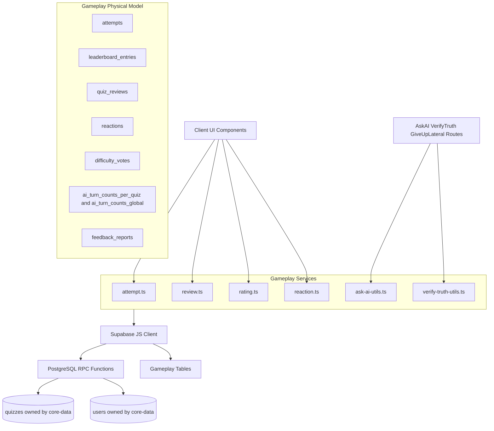
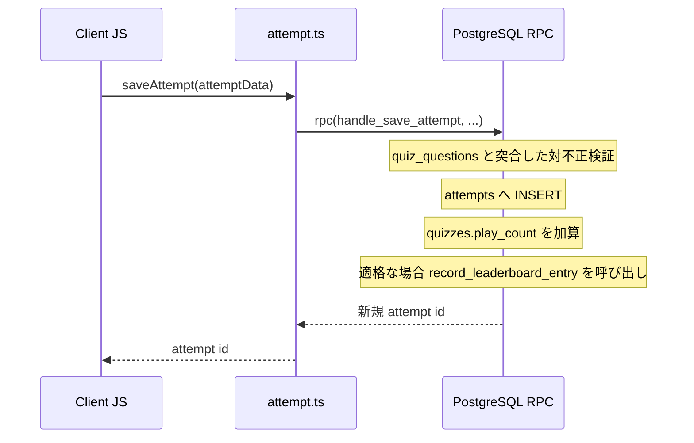
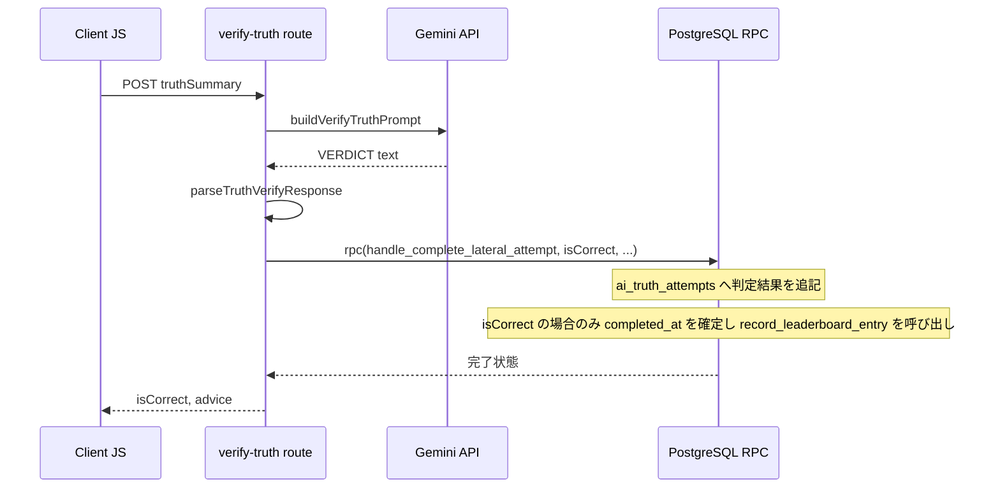
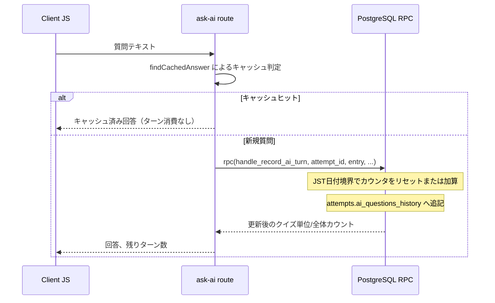
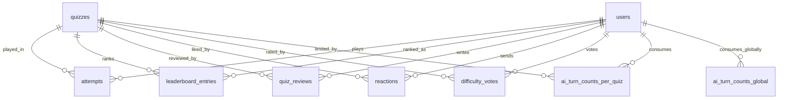

# Technical Design Document - supabase-gameplay

## Overview
本ドキュメントは、Quizetika のゲームプレイ機能（クイズ解答履歴、リーダーボード、クイズ評価・リアクション、レビュー・指摘報告、水平思考クイズのAI対話・合格判定）における Firebase Firestore から Supabase (PostgreSQL) への移行に関する設計定義です。

`supabase-core-data` が既に確立した「サービス層の外部インターフェースは変更せず、内部実装のみを RDB 正規化構造へ差し替えるブラックボックス置換」の方針、および「文字列連結の疑似ドキュメントIDではなく複合主キーで関係を表現する」正規化方針をそのまま踏襲する。

### Goals
- `attempts`（解答履歴）・`leaderboard_entries`（リーダーボード）・`quiz_reviews`（良問/悪問レビュー）・`feedback_reports`（問題への指摘）を Supabase JS Client / RPC ベースで読み書きする。
- `reactions`（いいねトグル）・`difficulty_votes`（難易度星投票）・AI対話の日次ターン制限カウンタ（`ai_turn_counts_per_quiz`/`ai_turn_counts_global`）を新規テーブルとして正規化する。
- Firestore の `runTransaction` に依存していたリーダーボード更新・レビュー投票・難易度投票・リアクショントグルを PostgreSQL の `SECURITY DEFINER` RPC に置き換え、アトミック性を維持する。
- 水平思考クイズ（ウミガメのスープ）の「進行中セッション」（未完了アテンプト）を表現できるよう `attempts.completed_at` を NULL 許容に是正する。
- AI対話の日次ターン制限カウンタに現存する lost-update レースを RPC 化によって是正する。
- リーダーボードの上位保持方式を「配列に上位5件のみ保持」から「全ユーザーの自己ベストを保持し、読み取り時に上位5件へ絞る」方式へ改善する。

### Non-Goals
- クイズ・問題・ユーザーデータ自体の CRUD（`supabase-core-data` が担当済み）。
- モデレーション実行、クイズへのポリシー違反通報（`flags` テーブル）、タグ/ジャンル統合（`supabase-governance` が担当）。
- レビュー再評価申請フロー（`isReviewMasked`／`tempPositiveCount`／`tempNegativeCount`／`activeResetRequestId`／`reviewResetRequests`）— `requirements.md` に記載がなく本スペックの対象外。必要な場合は別途 `supabase-governance` 等で扱う。
- 「感謝（thank）」リアクション — `requirements.md` に記載がなく、要件が明記する「いいね（like）」のみを対象とする。
- Gemini API 連携ロジック自体の変更（DB接続先のみを変更する）。
- UI コンポーネントの変更。

## Boundary Commitments

### This Spec Owns
- `attempts`（解答履歴・水平思考セッション状態を含む）、`leaderboard_entries`（初回/リプレイ別リーダーボード）、`quiz_reviews`（良問/悪問レビュー）、`feedback_reports`（問題への指摘報告）、`reactions`（いいねトグル）、`difficulty_votes`（難易度星投票）、`ai_turn_counts_per_quiz`／`ai_turn_counts_global`（AI対話日次カウンタ）の各テーブルの構造とマイグレーション。
- `quizzes` テーブル上のゲームプレイ系集計列（`play_count`、`positive_count`／`negative_count`／`review_score`／`review_badge`、`likes_count`（新設）、`difficulty_votes_sum`／`difficulty_votes_count`（新設））への書き込み。列定義自体は `supabase-foundation`／`supabase-core-data` が作成したテーブルに属するが、これらゲームプレイ系集計列の読み書きロジックは本スペックが所有する。
- `src/services/attempt.ts`, `attempt-server.ts`, `review.ts`, `rating.ts`, `reaction.ts`, `ask-ai-utils.ts`, `verify-truth-utils.ts` の実装、および `src/lib/play-history-client.ts`, `played-quiz-ids-client.ts` の実装。
- `/api/attempt/ask-ai`, `/api/attempt/verify-truth`, `/api/attempt/give-up-lateral`, `/api/quiz/quick-press-stream`, `/api/user/play-history`, `/api/user/played-quiz-ids` のデータアクセス部分（認証は `supabase-auth-migration` で移行済みのため変更しない）。

### Out of Boundary
- `quizzes`／`questions`／`quiz_tags`／`quiz_questions` の構造そのもの、およびそれらへの CRUD ロジック（`supabase-core-data` が所有）。
- `flags`（クイズへのポリシー違反通報）、`merge_requests`、`genre_requests`、`admin_logs`、`entitlement`／`subscription`（`supabase-governance` が所有）。
- ストレージ操作（`supabase-storage-migration` が所有）。

### Allowed Dependencies
- `supabase-auth-migration`（認証済み Supabase クライアントの取得パターン、`verifySupabaseAccessToken`）。
- `supabase-core-data`（`users`／`quizzes`／`questions`／`quiz_questions` テーブルへの外部キー参照、および `mapRowToQuiz`／`mapQuestionRowToQuestion` 等の既存マッピング関数）。

### Revalidation Triggers
- `attempts`／`leaderboard_entries`／`quiz_reviews`／`reactions`／`difficulty_votes` のテーブル構造変更。
- 本スペックが定義する RPC（`handle_save_attempt` 等、後述）のシグネチャ変更。
- `quizzes` テーブルへのゲームプレイ系集計列の追加・変更（`supabase-governance` 等、他スペックとの列名衝突リスクがあるため）。

## Architecture

### Existing Architecture Analysis
`supabase-foundation` によって `attempts`／`quiz_reviews`／`leaderboard_entries`／`flags`／`feedback_reports` の DDL は既に作成済みだが、以下の不整合が確認された。

| テーブル | 現状の問題 | 本設計での対応 |
|---------|-----------|----------------|
| `attempts` | `completed_at TIMESTAMPTZ NOT NULL DEFAULT now()` — 水平思考クイズの「進行中（未完了）」状態を表現できない | `completed_at` を NULL 許容へ ALTER。`gave_up_lateral BOOLEAN` 列を新設 |
| `quiz_reviews` | `id TEXT`（文字列連結の疑似ID）、`rating INTEGER 1-5 + comment TEXT` — 実際の良問/悪問二値投票（`type`/`reason`）と不一致 | 複合主キー `(reviewer_id, quiz_id)` 化、`type`／`reason` 列へ ALTER |
| `leaderboard_entries` | 構造は適切（`UNIQUE(quiz_id, user_id, type)`）だが、読み書きするRPCが一切存在しない | 新規 RPC で読み書きロジックを実装。上位5件は読み取り時に `ORDER BY ... LIMIT 5` で算出（Firestore 時代の「書き込み時に上位5件のみ保持」から改善） |
| `reactions` | テーブル自体が存在しない | 新規作成。要件どおり追加/解除可能な真のトグルとして設計 |
| `difficulty_votes` | テーブル自体が存在しない | 新規作成 |
| AI日次ターンカウンタ | テーブルが存在せず、現行 Firestore 実装は事前読み取り+非トランザクション更新による lost-update レースを抱える | `ai_turn_counts_per_quiz`／`ai_turn_counts_global` を新設し、RPC 内でアトミックに加算・日付リセットする |

### Architecture Pattern & Boundary Map



**Architecture Integration**:
- 採用パターン: `supabase-core-data` と同一の「サービス層ブラックボックス置換 + RPC によるアトミック処理」。
- ドメイン境界: 解答履歴・リーダーボード（1系統）、評価・リアクション（2系統）、レビュー・指摘報告（3系統）、AI対話・合格判定（4系統）の4領域に分離しつつ、リーダーボード更新ロジックのみ「通常完了」と「水平思考合格」の両経路から共有呼び出しする。
- 既存パターンの継続: `SECURITY DEFINER` の PL/pgSQL 関数によるアトミック処理は `supabase-core-data` の `handle_follow_user` 等と同一の実装idiom（`INSERT ... ON CONFLICT` → 差分計算 → 関連カウンタ更新）を踏襲する。
- 新規コンポーネントの根拠: `record_leaderboard_entry` は「通常完了」と「水平思考合格」という2つの独立した完了経路から同一のリーダーボード規則を適用するために必要な共有内部関数。

### Technology Stack

| Layer | Choice / Version | Role in Feature | Notes |
|-------|------------------|-----------------|-------|
| Services / Core | TypeScript (strict) | サービス層のマッピング・RPC呼び出し実装 | `Database` 型（`supabase gen types`）を使用 |
| Data / Storage | Supabase (PostgreSQL) 15+ | 正規化された永続データストア | 複合主キー・部分ユニークインデックスを追加 |
| Infrastructure | Supabase RPC (PL/pgSQL) | アトミックなトランザクション処理 | 新規7種のRPCを定義 |

## File Structure Plan

### Directory Structure
```
supabase/
├── migrations/
│   └── 20260703000200_gameplay_normalization.sql  # [NEW] gameplay系テーブルDDL・ALTER・RPC定義
src/
├── services/
│   ├── attempt.ts            # [MODIFY] saveAttempt等をRPC呼び出しに書き換え
│   ├── attempt-server.ts     # [MODIFY] Firebase Admin -> Supabaseサーバークライアント
│   ├── review.ts             # [MODIFY] submitReview/retractReview/報告系をRPC呼び出しに書き換え
│   ├── rating.ts             # [MODIFY] submitDifficultyVoteをRPC呼び出しに書き換え
│   ├── reaction.ts           # [MODIFY] sendReactionを真のトグルRPC呼び出しに書き換え
│   ├── ask-ai-utils.ts        # [MODIFY] 純関数は維持、永続化呼び出し元をRPCに接続
│   └── verify-truth-utils.ts  # [変更なし] 純関数のみ、DB非依存
├── lib/
│   ├── play-history-client.ts     # [MODIFY] Supabase経由のlistUserPlayHistory呼び出しへ
│   ├── played-quiz-ids-client.ts  # [MODIFY] Supabase経由のlistUserPlayedQuizIds呼び出しへ
│   ├── leaderboard-update.ts      # [変更なし] 純関数（適格性判定）はRPC呼び出し前のガードとして継続利用
│   └── leaderboard-ranking.ts     # [変更なし] 純関数（比較・マージ規則）はテスト・ドキュメント用に継続、実処理はRPCへ移管
├── app/api/
│   ├── attempt/ask-ai/route.ts         # [MODIFY] Firebase Admin -> Supabaseサーバークライアント + RPC
│   ├── attempt/verify-truth/route.ts   # [MODIFY] 同上
│   ├── attempt/give-up-lateral/route.ts # [MODIFY] 同上
│   └── quiz/quick-press-stream/route.ts # [MODIFY] questionsテーブル参照へ（core-data移行済み）
```

## System Flows

### 通常クイズ完了とリーダーボード更新フロー


### 水平思考クイズ（ウミガメのスープ）の合格判定フロー


### AI対話ターン記録フロー（日次カウンタのアトミック化）


## Requirements Traceability

| Requirement | Summary | Components | Interfaces | Flows |
|-------------|---------|------------|------------|-------|
| 1.1 | 解答完了時のアテンプト記録・プレイ回数更新 | attempt.ts | saveAttempt | 通常クイズ完了フロー |
| 1.2 | 初回プレイのリーダーボード登録 | attempt.ts, leaderboard_entries | saveAttempt | 通常クイズ完了フロー |
| 1.3 | リプレイ時のリーダーボード非更新 | attempt.ts, leaderboard_entries | saveAttempt | 通常クイズ完了フロー |
| 1.4 | リーダーボード取得（スコア降順・同点は時間昇順） | attempt.ts | getLeaderboard | - |
| 2.1 | 難易度星投票の集計反映 | rating.ts | submitDifficultyVote | - |
| 2.2 | いいね有効化とクイズ総いいね数の加算 | reaction.ts | toggleReaction | - |
| 2.3 | いいね解除とクイズ総いいね数の減算 | reaction.ts | toggleReaction | - |
| 3.1 | レビュー投稿と即時反映 | review.ts | submitReview | - |
| 3.2 | 問題への指摘報告と重複防止 | review.ts | submitFeedbackReport | - |
| 4.1 | AI質問応答履歴の追加保存 | ask-ai-utils.ts, /api/attempt/ask-ai | recordAiTurn | AI対話ターン記録フロー |
| 4.2 | 真相判定リクエストと結果記録 | verify-truth-utils.ts, /api/attempt/verify-truth | completeLateralAttempt | 水平思考合格判定フロー |

## Components and Interfaces

### Core Services 概要

| Component | Domain/Layer | Intent | Req Coverage | Key Dependencies (P0/P1) | Contracts |
|-----------|--------------|--------|--------------|--------------------------|-----------|
| attempt.ts | Service | 解答履歴・リーダーボード | 1.1-1.4 | quiz_questions（P0）, leaderboard_entries（P0） | Service |
| review.ts | Service | レビュー・指摘報告 | 3.1, 3.2 | quiz_reviews（P0）, feedback_reports（P0） | Service |
| rating.ts | Service | 難易度星投票 | 2.1 | difficulty_votes（P0） | Service |
| reaction.ts | Service | いいねトグル | 2.2, 2.3 | reactions（P0） | Service |
| ask-ai-utils.ts / verify-truth-utils.ts | Service | AI対話・合格判定 | 4.1, 4.2 | attempts（P0）, ai_turn_counts_*（P0） | Service |

### attempt.ts (Attempt Service)

| Field | Detail |
|-------|--------|
| Intent | クイズ解答結果の記録、リーダーボードの更新・取得、水平思考セッションのライフサイクル管理を行う |
| Requirements | 1.1, 1.2, 1.3, 1.4 |

**Responsibilities & Constraints**
- 対不正検証（総問題数・有効な問題ID集合の突合）は `quiz_questions` を参照して行う（`quizzes.questions` の非正規化コピーには依存しない）。
- 初回/リプレイ判定・上位5件切り詰め・スコア降順+時間昇順のソートは RPC 内で完結させ、クライアントは判定結果に関与しない。

**Dependencies**
- Outbound: `quiz_questions`, `questions`（P0） — 対不正検証
- Outbound: `leaderboard_entries`（P0） — リーダーボード読み書き

**Contracts**: Service [x]

##### Service Interface
```typescript
export interface AttemptService {
  saveAttempt(attemptData: Omit<Attempt, 'id' | 'completedAt'>): Promise<string>;
  createLateralAttemptSession(userId: string, quizId: string, questionIds: string[]): Promise<string>;
  getLeaderboard(quizId: string, board: 'first_play' | 'replay', limit?: number): Promise<LeaderboardRecord[]>;
  listUserPlayHistory(params: { uid: string; limit?: number; cursor?: string | null }): Promise<PlayHistoryPage>;
  listUserPlayedQuizIds(uid: string): Promise<string[]>;
}
```
- Preconditions: `saveAttempt` の `failedQuestionIds` は対象クイズの `quiz_questions` に実在する問題IDのみを含む。
- Postconditions: リーダーボード適格な完了（`mode` が `test-play`/`exam`/`flashcard` 以外、作成者本人以外、ゲスト以外）の場合のみ `leaderboard_entries` が更新される。表示名はクライアントから受け取らず、RPC内で `users.display_name` から導出する（なりすまし防止、旧 Firestore トランザクションと同じ取得元に回帰）。
- Invariants: `leaderboard_entries` は `(quiz_id, user_id, type)` ごとに常に1行（自己ベストのみ）。

### review.ts (Review Service)

| Field | Detail |
|-------|--------|
| Intent | クイズへの良問/悪問レビュー投票、および問題への指摘報告を管理する |
| Requirements | 3.1, 3.2 |

**Responsibilities & Constraints**
- レビューは reviewer×quiz あたり1票（複合主キーで一意性を保証）。投票変更時は差分に基づき `quizzes.positive_count`／`negative_count`／`review_score`／`review_badge` を再計算する。
- 指摘報告の重複防止は `(quiz_id, question_id, reporter_id) WHERE status='open'` の部分ユニークインデックスで保証する（Firestore 時代には存在しなかった保証を追加）。

**Contracts**: Service [x]

##### Service Interface
```typescript
export interface ReviewService {
  submitReview(quizId: string, reviewerId: string, type: 'positive' | 'negative', reason?: string): Promise<void>;
  retractReview(quizId: string, reviewerId: string): Promise<void>;
  getUserReviewForQuiz(quizId: string, reviewerId: string): Promise<QuizReview | null>;
  submitFeedbackReport(report: Omit<FeedbackReport, 'id' | 'createdAt' | 'status'>): Promise<void>;
  getOpenReportsByQuizId(quizId: string, creatorId: string): Promise<FeedbackReport[]>;
  resolveReport(reportId: string): Promise<void>;
  rejectReport(reportId: string): Promise<void>;
}
```
- Preconditions: クイズ作成者自身は自クイズにレビューできない（`canVote`）。
- Postconditions: 同一 `(quiz_id, question_id, reporter_id)` で `status='open'` の指摘報告が既に存在する場合、新規報告は無視される（冪等）。

### rating.ts (Difficulty Rating Service)

| Field | Detail |
|-------|--------|
| Intent | クイズの体感難易度に対する星投票（1〜5）を管理する |
| Requirements | 2.1 |

**Contracts**: Service [x]

##### Service Interface
```typescript
export interface RatingService {
  submitDifficultyVote(quizId: string, userId: string | null, vote: number): Promise<void>;
}
```
- Preconditions: `1 <= vote <= 5`。
- Postconditions: ログイン済みユーザーは自分の前回投票を上書きし、`quizzes.difficulty_votes_sum` は差分のみ反映する（再投票による二重加算を防ぐ）。匿名投票は常に新規行として加算する。

### reaction.ts (Reaction Service)

| Field | Detail |
|-------|--------|
| Intent | クイズへの「いいね」を追加・解除するトグル操作を管理する |
| Requirements | 2.2, 2.3 |

**Contracts**: Service [x]

##### Service Interface
```typescript
export interface ReactionService {
  toggleReaction(senderId: string, quizId: string): Promise<boolean>;
  getSentReactions(userId: string): Promise<Reaction[]>;
  getReceivedReactions(userId: string): Promise<Reaction[]>;
}
```
- Preconditions: `senderId` が対象クイズの作成者本人と一致する場合は自己反応として無視される（`receiverId` はクライアントから受け取らず、RPC内で `quizzes.author_id` から導出する — なりすまし防止）。
- Postconditions: 戻り値 `true` は追加、`false` は解除を示す。追加時は `quizzes.likes_count` と `users.total_reactions_count`（受信者）を加算、解除時は両方を減算する。

### ask-ai-utils.ts / verify-truth-utils.ts (AI Dialogue Services)

| Field | Detail |
|-------|--------|
| Intent | 水平思考クイズのAI対話履歴管理、日次ターン制限、および真相判定結果の記録を行う |
| Requirements | 4.1, 4.2 |

**Responsibilities & Constraints**
- 純粋関数（プロンプト構築・レスポンス解析・キャッシュ判定）は変更しない。永続化のみ RPC 経由に置き換える。
- 日次カウンタのリセット判定は JST（`Asia/Tokyo`）基準で行う。

**Contracts**: Service [x]

##### Service Interface
```typescript
export interface AiTurnResult {
  perQuizCount: number;
  globalDailyCount: number;
}

export interface GameplayAiService {
  recordAiTurn(
    attemptId: string,
    userId: string,
    quizId: string,
    entry: AiQuestion
  ): Promise<AiTurnResult>;
  completeLateralAttempt(
    attemptId: string,
    isCorrect: boolean,
    truthAttempt: AiTruthAttempt,
    context: { userId: string; quizId: string; elapsedSeconds: number }
  ): Promise<void>;
  giveUpLateralAttempt(attemptId: string, elapsedSeconds: number): Promise<void>;
}
```
- Preconditions: `giveUpLateralAttempt`／`completeLateralAttempt` は対象アテンプトが未完了（`completed_at IS NULL`）であること。
- Postconditions: `completeLateralAttempt` は `isCorrect=true` の場合のみ `completed_at` を確定しリーダーボードを更新する。リーダーボードの表示名はクライアントから受け取らず、RPC内で `users.display_name` から導出する（なりすまし防止）。`giveUpLateralAttempt` はリーダーボードを更新しない。

## Data Models

### Logical Data Model



**構造の要点**:
- `leaderboard_entries` は既存の `UNIQUE(quiz_id, user_id, type)` をそのまま「ユーザーごとの自己ベスト1行」の不変条件として利用する。
- `quiz_reviews`／`reactions`／`difficulty_votes`（ログイン済みユーザー）は複合主キーで一意性を保証し、Firestore の文字列連結IDを排除する。
- `ai_turn_counts_per_quiz`／`ai_turn_counts_global` は「クイズ単位」「全体」という異なる粒度を、NULL許容カラムに頼らず別テーブルとして分離する。

### Physical Data Model

#### 既存テーブルへの ALTER
```sql
-- attempts: 水平思考クイズの進行中セッションを表現できるようにする
ALTER TABLE attempts ALTER COLUMN completed_at DROP DEFAULT;
ALTER TABLE attempts ALTER COLUMN completed_at DROP NOT NULL;
ALTER TABLE attempts ADD COLUMN gave_up_lateral BOOLEAN DEFAULT FALSE;

-- quiz_reviews: 良問/悪問の二値投票モデルへ是正し、複合主キー化する
ALTER TABLE quiz_reviews DROP CONSTRAINT quiz_reviews_pkey;
ALTER TABLE quiz_reviews DROP COLUMN id;
ALTER TABLE quiz_reviews DROP COLUMN rating;
ALTER TABLE quiz_reviews DROP COLUMN comment;
ALTER TABLE quiz_reviews ADD COLUMN type TEXT NOT NULL CHECK (type IN ('positive', 'negative'));
ALTER TABLE quiz_reviews ADD COLUMN reason TEXT;
ALTER TABLE quiz_reviews ADD COLUMN updated_at TIMESTAMPTZ DEFAULT now() NOT NULL;
ALTER TABLE quiz_reviews ADD PRIMARY KEY (reviewer_id, quiz_id);

-- feedback_reports: 同一報告者による同一問題への重複オープン報告を防止する
CREATE UNIQUE INDEX idx_feedback_reports_open_dedup
    ON feedback_reports (quiz_id, question_id, reporter_id)
    WHERE status = 'open';

-- quizzes: 本スペックが所有するゲームプレイ系集計列を追加する
ALTER TABLE quizzes ADD COLUMN likes_count INTEGER DEFAULT 0 NOT NULL;
ALTER TABLE quizzes ADD COLUMN difficulty_votes_sum INTEGER DEFAULT 0 NOT NULL;
ALTER TABLE quizzes ADD COLUMN difficulty_votes_count INTEGER DEFAULT 0 NOT NULL;
```

#### 新規テーブル
```sql
-- リアクション（いいねトグル）
CREATE TABLE reactions (
    sender_id UUID REFERENCES users(id) ON DELETE CASCADE NOT NULL,
    receiver_id UUID REFERENCES users(id) ON DELETE CASCADE NOT NULL,
    quiz_id UUID REFERENCES quizzes(id) ON DELETE CASCADE NOT NULL,
    type TEXT NOT NULL CHECK (type IN ('like')),
    created_at TIMESTAMPTZ DEFAULT now() NOT NULL,
    PRIMARY KEY (sender_id, quiz_id, type)
);
CREATE INDEX idx_reactions_receiver ON reactions(receiver_id);

-- 難易度星投票
CREATE TABLE difficulty_votes (
    id UUID PRIMARY KEY DEFAULT gen_random_uuid(),
    user_id UUID REFERENCES users(id) ON DELETE CASCADE,
    quiz_id UUID REFERENCES quizzes(id) ON DELETE CASCADE NOT NULL,
    vote INTEGER NOT NULL CHECK (vote BETWEEN 1 AND 5),
    created_at TIMESTAMPTZ DEFAULT now() NOT NULL,
    updated_at TIMESTAMPTZ DEFAULT now() NOT NULL
);
-- ログイン済みユーザーは quiz あたり1票のみ（匿名行は対象外）
CREATE UNIQUE INDEX idx_difficulty_votes_user_quiz
    ON difficulty_votes (user_id, quiz_id) WHERE user_id IS NOT NULL;

-- AI対話 日次ターンカウンタ（クイズ単位）
CREATE TABLE ai_turn_counts_per_quiz (
    user_id UUID REFERENCES users(id) ON DELETE CASCADE NOT NULL,
    quiz_id UUID REFERENCES quizzes(id) ON DELETE CASCADE NOT NULL,
    count INTEGER NOT NULL DEFAULT 0,
    count_date DATE NOT NULL,
    PRIMARY KEY (user_id, quiz_id)
);

-- AI対話 日次ターンカウンタ（全体）
CREATE TABLE ai_turn_counts_global (
    user_id UUID PRIMARY KEY REFERENCES users(id) ON DELETE CASCADE,
    count INTEGER NOT NULL DEFAULT 0,
    count_date DATE NOT NULL
);

-- RLS
ALTER TABLE reactions ENABLE ROW LEVEL SECURITY;
ALTER TABLE difficulty_votes ENABLE ROW LEVEL SECURITY;
ALTER TABLE ai_turn_counts_per_quiz ENABLE ROW LEVEL SECURITY;
ALTER TABLE ai_turn_counts_global ENABLE ROW LEVEL SECURITY;

CREATE POLICY reactions_read ON reactions FOR SELECT USING (TRUE);
CREATE POLICY reactions_write ON reactions FOR ALL
    USING (auth.uid() = sender_id AND is_not_banned());

CREATE POLICY difficulty_votes_read ON difficulty_votes FOR SELECT USING (TRUE);
-- INSERT: ログイン済みユーザーは自分の投票のみ、匿名投票（user_id IS NULL）も許可する
CREATE POLICY difficulty_votes_insert ON difficulty_votes FOR INSERT
    WITH CHECK ((auth.uid() = user_id OR user_id IS NULL) AND is_not_banned());
-- UPDATE/DELETE: 匿名行（user_id IS NULL）は誰も更新・削除できない（自分の行のみ対象）
CREATE POLICY difficulty_votes_update ON difficulty_votes FOR UPDATE
    USING (auth.uid() = user_id AND is_not_banned());
CREATE POLICY difficulty_votes_delete ON difficulty_votes FOR DELETE
    USING (auth.uid() = user_id AND is_not_banned());

CREATE POLICY ai_turn_counts_per_quiz_read ON ai_turn_counts_per_quiz FOR SELECT
    USING (auth.uid() = user_id);
CREATE POLICY ai_turn_counts_global_read ON ai_turn_counts_global FOR SELECT
    USING (auth.uid() = user_id);
-- 書き込みは SECURITY DEFINER RPC 経由のみ許可し、クライアントからの直接書き込みは拒否する
```

#### RPC 関数の定義
```sql
-- 共有内部関数: リーダーボードへの自己ベスト反映（新記録が厳密に優れている場合のみ差し替え）
CREATE OR REPLACE FUNCTION record_leaderboard_entry(
  p_quiz_id UUID,
  p_user_id UUID,
  p_display_name TEXT,
  p_score INTEGER,
  p_elapsed_seconds NUMERIC,
  p_board TEXT
) RETURNS VOID AS $$
BEGIN
  INSERT INTO leaderboard_entries (quiz_id, user_id, display_name, score, elapsed_seconds, type, completed_at)
  VALUES (p_quiz_id, p_user_id, p_display_name, p_score, p_elapsed_seconds, p_board, now())
  ON CONFLICT (quiz_id, user_id, type) DO UPDATE
  SET display_name = EXCLUDED.display_name,
      score = EXCLUDED.score,
      elapsed_seconds = EXCLUDED.elapsed_seconds,
      completed_at = EXCLUDED.completed_at
  WHERE EXCLUDED.score > leaderboard_entries.score
     OR (EXCLUDED.score = leaderboard_entries.score AND EXCLUDED.elapsed_seconds < leaderboard_entries.elapsed_seconds);
END;
$$ LANGUAGE plpgsql SECURITY DEFINER;

-- 内部専用関数: display_name を任意の値で直接呼び出せないよう、クライアントからの直接RPC実行を禁止する
REVOKE EXECUTE ON FUNCTION record_leaderboard_entry(UUID, UUID, TEXT, INTEGER, NUMERIC, TEXT) FROM PUBLIC, anon, authenticated;

-- 通常クイズ完了の保存（対不正検証 + アテンプト保存 + playCount + リーダーボード）
CREATE OR REPLACE FUNCTION handle_save_attempt(
  p_user_id UUID,
  p_quiz_id UUID,
  p_mode TEXT,
  p_score INTEGER,
  p_total_questions INTEGER,
  p_elapsed_seconds NUMERIC,
  p_failed_question_ids UUID[],
  p_question_answers JSONB,
  p_question_answer_details JSONB
) RETURNS UUID AS $$
DECLARE
  v_attempt_id UUID;
  v_author_id UUID;
  v_display_name TEXT;
  v_actual_total INTEGER;
  v_invalid_count INTEGER;
  v_prior_completed_count INTEGER;
  v_board TEXT;
BEGIN
  SELECT author_id INTO v_author_id FROM quizzes WHERE id = p_quiz_id;
  IF v_author_id IS NULL THEN
    RAISE EXCEPTION 'クイズが見つかりません: %', p_quiz_id;
  END IF;

  -- 表示名はクライアント供給値を信用せず、サーバー側で導出する（なりすまし防止）
  SELECT COALESCE(display_name, '名無しさん') INTO v_display_name FROM users WHERE id = p_user_id;

  SELECT COUNT(*) INTO v_actual_total FROM quiz_questions WHERE quiz_id = p_quiz_id;
  IF p_mode NOT IN ('my-quiz', 'question-list', 'list') AND p_total_questions <> v_actual_total THEN
    RAISE EXCEPTION '問題数が一致しません';
  END IF;

  SELECT COUNT(*) INTO v_invalid_count
  FROM unnest(p_failed_question_ids) AS fid
  WHERE NOT EXISTS (SELECT 1 FROM quiz_questions WHERE quiz_id = p_quiz_id AND question_id = fid);
  IF v_invalid_count > 0 THEN
    RAISE EXCEPTION '不正な問題IDが含まれています';
  END IF;

  INSERT INTO attempts (
    user_id, quiz_id, mode, score, total_questions, elapsed_seconds,
    failed_question_ids, question_answers, question_answer_details, completed_at
  ) VALUES (
    p_user_id, p_quiz_id, p_mode, p_score, p_total_questions, p_elapsed_seconds,
    p_failed_question_ids, p_question_answers, p_question_answer_details, now()
  ) RETURNING id INTO v_attempt_id;

  UPDATE quizzes SET play_count = play_count + 1, updated_at = now() WHERE id = p_quiz_id;

  IF p_mode NOT IN ('test-play', 'exam', 'flashcard') AND p_user_id <> v_author_id THEN
    SELECT COUNT(*) INTO v_prior_completed_count
    FROM attempts
    WHERE user_id = p_user_id AND quiz_id = p_quiz_id AND completed_at IS NOT NULL AND id <> v_attempt_id;

    v_board := CASE WHEN v_prior_completed_count = 0 THEN 'first_play' ELSE 'replay' END;
    PERFORM record_leaderboard_entry(p_quiz_id, p_user_id, v_display_name, p_score, p_elapsed_seconds, v_board);
  END IF;

  RETURN v_attempt_id;
END;
$$ LANGUAGE plpgsql SECURITY DEFINER;

-- 水平思考クイズ: 進行中セッション開始
CREATE OR REPLACE FUNCTION handle_start_lateral_attempt(
  p_user_id UUID,
  p_quiz_id UUID,
  p_total_questions INTEGER,
  p_ai_turn_limit INTEGER
) RETURNS UUID AS $$
DECLARE
  v_attempt_id UUID;
BEGIN
  INSERT INTO attempts (
    user_id, quiz_id, mode, score, total_questions, elapsed_seconds,
    ai_turn_count, ai_turn_limit, completed_at
  ) VALUES (
    p_user_id, p_quiz_id, 'normal', 0, p_total_questions, 0, 0, p_ai_turn_limit, NULL
  ) RETURNING id INTO v_attempt_id;
  RETURN v_attempt_id;
END;
$$ LANGUAGE plpgsql SECURITY DEFINER;

-- 水平思考クイズ: AI対話ターンのアトミックな記録（日次カウンタのレース是正 + 上限のアトミックな強制）
-- p_per_quiz_limit / p_global_limit に NULL を渡すと無制限（Pro等の hasUnlimitedAiQuestions 相当）として扱う
-- 2026-07-18（quizeum-core Phase 43 / migration 20260718000000）で NULL 許容に拡張:
--   p_attempt_id / p_history_entry が NULL → attempts への履歴追記・ai_turn_count 加算をスキップ（verify-truth の共通ターン消費用）
--   p_quiz_id が NULL → per-quiz カウントをスキップし global のみ加算（テストプレイ判定 test-verify-truth 用）
CREATE OR REPLACE FUNCTION handle_record_ai_turn(
  p_attempt_id UUID,
  p_user_id UUID,
  p_quiz_id UUID,
  p_history_entry JSONB,
  p_per_quiz_limit INTEGER,
  p_global_limit INTEGER
) RETURNS TABLE(per_quiz_count INTEGER, global_count INTEGER) AS $$
DECLARE
  v_today DATE := (now() AT TIME ZONE 'Asia/Tokyo')::date;
  v_per_quiz INTEGER;
  v_global INTEGER;
BEGIN
  INSERT INTO ai_turn_counts_per_quiz (user_id, quiz_id, count, count_date)
  VALUES (p_user_id, p_quiz_id, 1, v_today)
  ON CONFLICT (user_id, quiz_id) DO UPDATE
  SET count = CASE WHEN ai_turn_counts_per_quiz.count_date = v_today THEN ai_turn_counts_per_quiz.count + 1 ELSE 1 END,
      count_date = v_today
  RETURNING count INTO v_per_quiz;

  -- 上限判定はこのアトミックな加算の直後に行うことで、事前チェックとRPC呼び出しの間のレースを閉じる
  IF p_per_quiz_limit IS NOT NULL AND v_per_quiz > p_per_quiz_limit THEN
    RAISE EXCEPTION 'per-quiz-limit-exceeded';
  END IF;

  INSERT INTO ai_turn_counts_global (user_id, count, count_date)
  VALUES (p_user_id, 1, v_today)
  ON CONFLICT (user_id) DO UPDATE
  SET count = CASE WHEN ai_turn_counts_global.count_date = v_today THEN ai_turn_counts_global.count + 1 ELSE 1 END,
      count_date = v_today
  RETURNING count INTO v_global;

  IF p_global_limit IS NOT NULL AND v_global > p_global_limit THEN
    RAISE EXCEPTION 'global-limit-exceeded';
  END IF;

  UPDATE attempts
  SET ai_questions_history = ai_questions_history || p_history_entry,
      ai_turn_count = ai_turn_count + 1
  WHERE id = p_attempt_id;

  RETURN QUERY SELECT v_per_quiz, v_global;
END;
$$ LANGUAGE plpgsql SECURITY DEFINER;

-- 水平思考クイズ: 真相判定結果の記録（合格時のみ完了・リーダーボード反映）
CREATE OR REPLACE FUNCTION handle_complete_lateral_attempt(
  p_attempt_id UUID,
  p_user_id UUID,
  p_quiz_id UUID,
  p_is_correct BOOLEAN,
  p_truth_attempt JSONB,
  p_elapsed_seconds NUMERIC,
  p_total_questions INTEGER
) RETURNS VOID AS $$
DECLARE
  v_author_id UUID;
  v_display_name TEXT;
  v_prior_completed_count INTEGER;
  v_board TEXT;
BEGIN
  UPDATE attempts
  SET ai_truth_attempts = ai_truth_attempts || p_truth_attempt
  WHERE id = p_attempt_id AND completed_at IS NULL;

  IF NOT p_is_correct THEN
    RETURN;
  END IF;

  UPDATE attempts
  SET completed_at = now(), score = p_total_questions, failed_question_ids = '{}',
      elapsed_seconds = p_elapsed_seconds
  WHERE id = p_attempt_id;

  SELECT author_id INTO v_author_id FROM quizzes WHERE id = p_quiz_id;
  UPDATE quizzes SET play_count = play_count + 1, updated_at = now() WHERE id = p_quiz_id;

  IF p_user_id <> v_author_id THEN
    -- 表示名はクライアント供給値を信用せず、サーバー側で導出する（なりすまし防止）
    SELECT COALESCE(display_name, '名無しさん') INTO v_display_name FROM users WHERE id = p_user_id;

    SELECT COUNT(*) INTO v_prior_completed_count
    FROM attempts
    WHERE user_id = p_user_id AND quiz_id = p_quiz_id AND completed_at IS NOT NULL AND id <> p_attempt_id;

    v_board := CASE WHEN v_prior_completed_count = 0 THEN 'first_play' ELSE 'replay' END;
    PERFORM record_leaderboard_entry(p_quiz_id, p_user_id, v_display_name, p_total_questions, p_elapsed_seconds, v_board);
  END IF;
END;
$$ LANGUAGE plpgsql SECURITY DEFINER;

-- 水平思考クイズ: 諦め（ギブアップ）
CREATE OR REPLACE FUNCTION handle_give_up_lateral_attempt(
  p_attempt_id UUID,
  p_quiz_id UUID,
  p_elapsed_seconds NUMERIC
) RETURNS VOID AS $$
DECLARE
  v_already_completed BOOLEAN;
BEGIN
  SELECT completed_at IS NOT NULL INTO v_already_completed FROM attempts WHERE id = p_attempt_id;
  IF v_already_completed THEN
    RAISE EXCEPTION 'already-completed';
  END IF;

  UPDATE attempts
  SET completed_at = now(), score = 0, gave_up_lateral = TRUE, elapsed_seconds = p_elapsed_seconds
  WHERE id = p_attempt_id;

  UPDATE quizzes SET play_count = play_count + 1, updated_at = now() WHERE id = p_quiz_id;
END;
$$ LANGUAGE plpgsql SECURITY DEFINER;

-- レビュー投稿（良問/悪問の二値投票）
CREATE OR REPLACE FUNCTION handle_submit_review(
  p_reviewer_id UUID,
  p_quiz_id UUID,
  p_type TEXT,
  p_reason TEXT
) RETURNS VOID AS $$
DECLARE
  v_old_type TEXT;
  v_positive INTEGER;
  v_negative INTEGER;
BEGIN
  SELECT type INTO v_old_type FROM quiz_reviews WHERE reviewer_id = p_reviewer_id AND quiz_id = p_quiz_id;

  IF v_old_type IS NOT NULL AND v_old_type = p_type THEN
    RETURN; -- 同一票の再送信は無視
  END IF;

  INSERT INTO quiz_reviews (reviewer_id, quiz_id, type, reason, updated_at)
  VALUES (p_reviewer_id, p_quiz_id, p_type, p_reason, now())
  ON CONFLICT (reviewer_id, quiz_id) DO UPDATE
  SET type = p_type, reason = p_reason, updated_at = now();

  UPDATE quizzes SET
    positive_count = positive_count
      + CASE WHEN p_type = 'positive' THEN 1 ELSE 0 END
      - CASE WHEN v_old_type = 'positive' THEN 1 ELSE 0 END,
    negative_count = negative_count
      + CASE WHEN p_type = 'negative' THEN 1 ELSE 0 END
      - CASE WHEN v_old_type = 'negative' THEN 1 ELSE 0 END
  WHERE id = p_quiz_id
  RETURNING positive_count, negative_count INTO v_positive, v_negative;

  UPDATE quizzes SET
    review_score = CASE WHEN v_positive + v_negative = 0 THEN NULL ELSE v_positive::NUMERIC / (v_positive + v_negative) END,
    updated_at = now()
  WHERE id = p_quiz_id;
END;
$$ LANGUAGE plpgsql SECURITY DEFINER;

-- レビュー取消
CREATE OR REPLACE FUNCTION handle_retract_review(
  p_reviewer_id UUID,
  p_quiz_id UUID
) RETURNS VOID AS $$
DECLARE
  v_type TEXT;
  v_positive INTEGER;
  v_negative INTEGER;
BEGIN
  DELETE FROM quiz_reviews WHERE reviewer_id = p_reviewer_id AND quiz_id = p_quiz_id RETURNING type INTO v_type;
  IF v_type IS NULL THEN
    RETURN;
  END IF;

  UPDATE quizzes SET
    positive_count = GREATEST(0, positive_count - CASE WHEN v_type = 'positive' THEN 1 ELSE 0 END),
    negative_count = GREATEST(0, negative_count - CASE WHEN v_type = 'negative' THEN 1 ELSE 0 END)
  WHERE id = p_quiz_id
  RETURNING positive_count, negative_count INTO v_positive, v_negative;

  UPDATE quizzes SET
    review_score = CASE WHEN v_positive + v_negative = 0 THEN NULL ELSE v_positive::NUMERIC / (v_positive + v_negative) END,
    updated_at = now()
  WHERE id = p_quiz_id;
END;
$$ LANGUAGE plpgsql SECURITY DEFINER;

-- 難易度星投票
CREATE OR REPLACE FUNCTION handle_submit_difficulty_vote(
  p_quiz_id UUID,
  p_user_id UUID,
  p_vote INTEGER
) RETURNS VOID AS $$
DECLARE
  v_old_vote INTEGER;
BEGIN
  IF p_vote < 1 OR p_vote > 5 THEN
    RAISE EXCEPTION '評価は1から5の範囲で指定してください';
  END IF;

  IF p_user_id IS NOT NULL THEN
    SELECT vote INTO v_old_vote FROM difficulty_votes WHERE user_id = p_user_id AND quiz_id = p_quiz_id;

    INSERT INTO difficulty_votes (user_id, quiz_id, vote, updated_at)
    VALUES (p_user_id, p_quiz_id, p_vote, now())
    ON CONFLICT (user_id, quiz_id) WHERE user_id IS NOT NULL DO UPDATE
    SET vote = p_vote, updated_at = now();

    IF v_old_vote IS NULL THEN
      UPDATE quizzes SET difficulty_votes_sum = difficulty_votes_sum + p_vote,
                          difficulty_votes_count = difficulty_votes_count + 1
      WHERE id = p_quiz_id;
    ELSE
      UPDATE quizzes SET difficulty_votes_sum = difficulty_votes_sum + (p_vote - v_old_vote)
      WHERE id = p_quiz_id;
    END IF;
  ELSE
    INSERT INTO difficulty_votes (user_id, quiz_id, vote) VALUES (NULL, p_quiz_id, p_vote);
    UPDATE quizzes SET difficulty_votes_sum = difficulty_votes_sum + p_vote,
                        difficulty_votes_count = difficulty_votes_count + 1
    WHERE id = p_quiz_id;
  END IF;
END;
$$ LANGUAGE plpgsql SECURITY DEFINER;

-- いいねトグル
CREATE OR REPLACE FUNCTION handle_toggle_reaction(
  p_sender_id UUID,
  p_quiz_id UUID
) RETURNS BOOLEAN AS $$
DECLARE
  v_receiver_id UUID;
  v_exists BOOLEAN;
BEGIN
  -- 受信者（クイズ作成者）はクライアント供給値を信用せず、サーバー側で導出する（なりすまし防止）
  SELECT author_id INTO v_receiver_id FROM quizzes WHERE id = p_quiz_id;
  IF v_receiver_id IS NULL THEN
    RAISE EXCEPTION 'クイズが見つかりません: %', p_quiz_id;
  END IF;

  IF p_sender_id = v_receiver_id THEN
    RETURN FALSE;
  END IF;

  SELECT EXISTS(
    SELECT 1 FROM reactions WHERE sender_id = p_sender_id AND quiz_id = p_quiz_id AND type = 'like'
  ) INTO v_exists;

  IF v_exists THEN
    DELETE FROM reactions WHERE sender_id = p_sender_id AND quiz_id = p_quiz_id AND type = 'like';
    UPDATE quizzes SET likes_count = GREATEST(0, likes_count - 1) WHERE id = p_quiz_id;
    UPDATE users SET total_reactions_count = GREATEST(0, total_reactions_count - 1) WHERE id = v_receiver_id;
    RETURN FALSE;
  ELSE
    INSERT INTO reactions (sender_id, receiver_id, quiz_id, type) VALUES (p_sender_id, v_receiver_id, p_quiz_id, 'like');
    UPDATE quizzes SET likes_count = likes_count + 1 WHERE id = p_quiz_id;
    UPDATE users SET total_reactions_count = total_reactions_count + 1 WHERE id = v_receiver_id;
    RETURN TRUE;
  END IF;
END;
$$ LANGUAGE plpgsql SECURITY DEFINER;
```

### Data Contracts & Integration

**行 ↔ ドメイン型のマッピング方針**:
- `Attempt.completedAt` の型を `Date | null` に修正する（現状 `Date` 非オプショナルだが実態は水平思考の進行中セッションで欠落し得る）。
- `QuizReview`／`Reaction`／`DifficultyVote` は `src/services/review.ts`／`reaction.ts`／`rating.ts` のモジュールローカル型のまま維持する（`types/index.ts` への昇格は本スペックのスコープ外の整理作業とし、既存の参照経路を変更しない）。
- `getLeaderboard` は `leaderboard_entries` から `.eq('quiz_id', id).eq('type', board).order('score', {ascending:false}).order('elapsed_seconds', {ascending:true}).limit(5)` で取得し、`LeaderboardRecord[]` へマッピングする。

## Error Handling

### Error Strategy
- RPC 内で `RAISE EXCEPTION` されたエラーは `PostgrestError` として返却され、既存パターン同様にドメインエラー（`Error`）として詳細化した上でスローする。
- `handle_give_up_lateral_attempt` の「既に完了済み」エラー（`already-completed`）は、API Route 側で `409` として扱う（現行の Firestore 実装と同じ HTTP セマンティクスを維持）。
- `handle_submit_feedback_report` は部分ユニークインデックスによる重複を、明示的なチェックの後に `INSERT` する形で防ぐ（一意制約違反を例外として扱うのではなく、事前の `EXISTS` 判定で冪等に振る舞う）。

## Testing Strategy

### Unit Tests
- `tests/services/attempt.test.ts`, `attempt-leaderboard.test.ts`, `attempt-single-question.test.ts`: RPC呼び出しをモックし、既存のリーダーボード適格性・初回/リプレイ分岐・対不正検証の期待値を維持する。
- `tests/services/review.test.ts`, `review-utils.test.ts`: `handle_submit_review`／`handle_retract_review` のRPC呼び出しパラメータ検証、`calculateReviewScore`／`getReviewBadge` 等の純関数は変更なしで継続。
- `tests/services/rating.test.ts`, `reaction.test.ts`: 新設RPC（`handle_submit_difficulty_vote`, `handle_toggle_reaction`）呼び出しの検証、および `reaction.test.ts` にトグルオフ（解除）ケースを新規追加する。
- `tests/services/ask-ai-utils.test.ts`, `verify-truth-utils.test.ts`: 純関数部分は変更なし。

### Integration Verification
- ローカル Supabase 環境に `20260703000200_gameplay_normalization.sql` を適用し、`attempts.completed_at` の NULL 許容化、`quiz_reviews` の複合主キー化が既存データ（存在する場合）を壊さないことを確認する。
- `handle_save_attempt`／`handle_complete_lateral_attempt` の双方から `record_leaderboard_entry` が同一規則で呼び出され、`leaderboard_entries` の `UNIQUE(quiz_id, user_id, type)` 制約下で自己ベストのみが保持されることを検証する。
- Jest テストスイートの全パス確認、および `npm run build` による型エラーゼロの確認。
