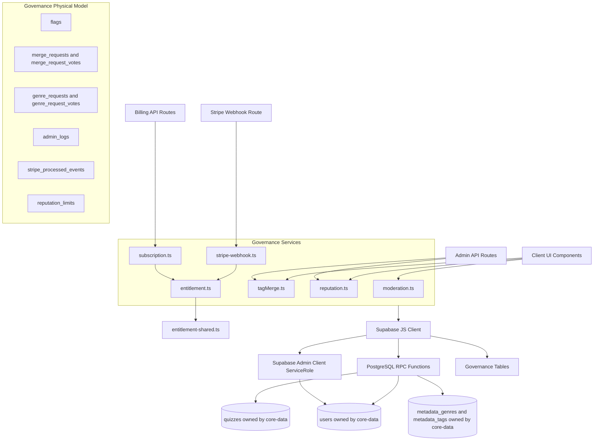
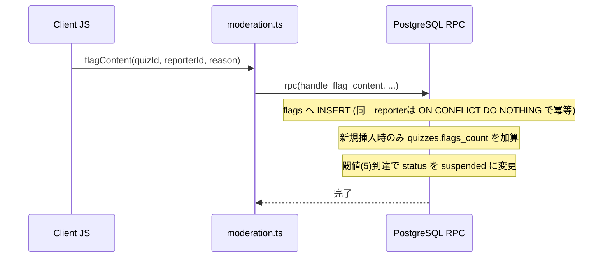
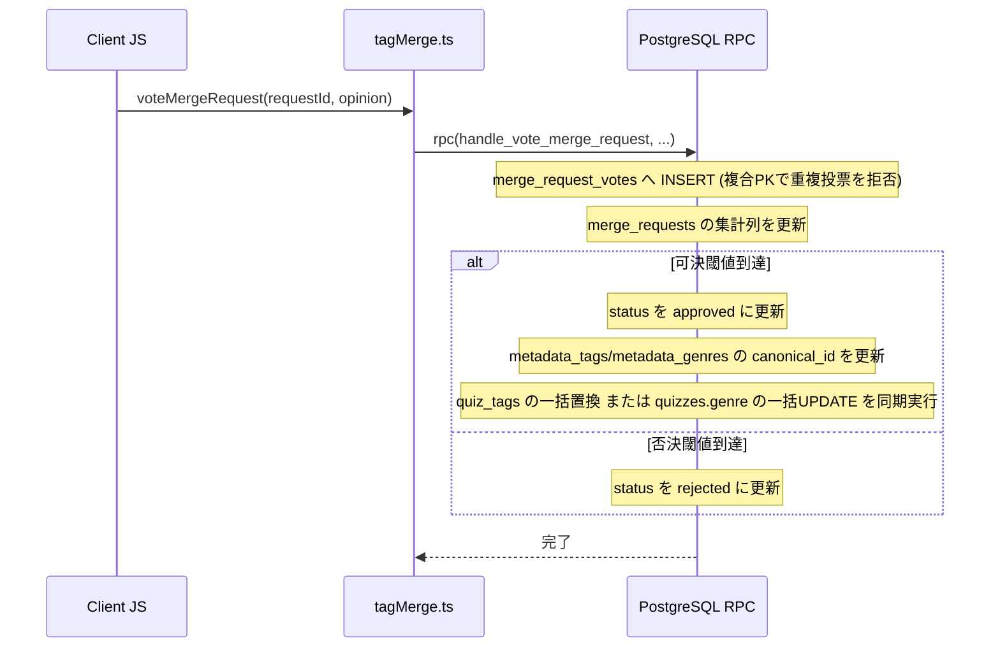
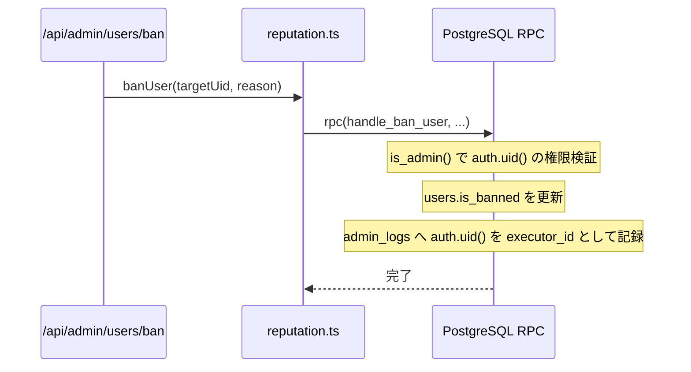
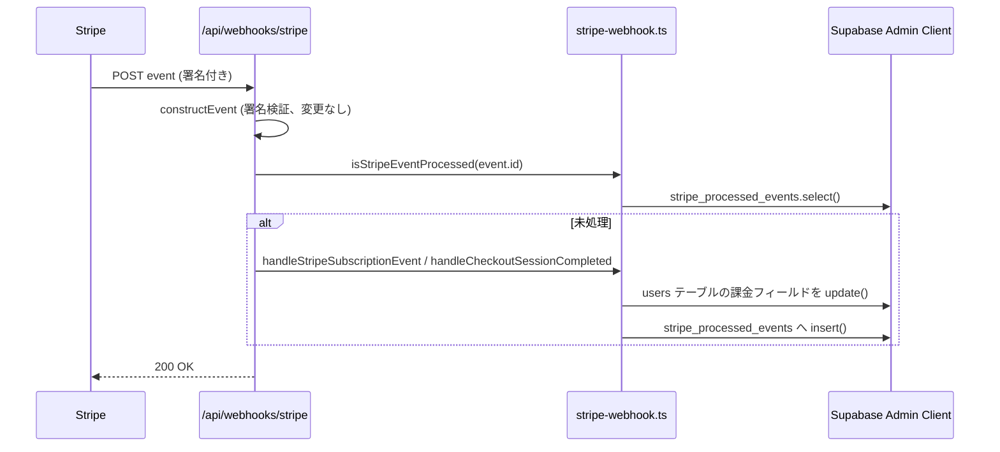
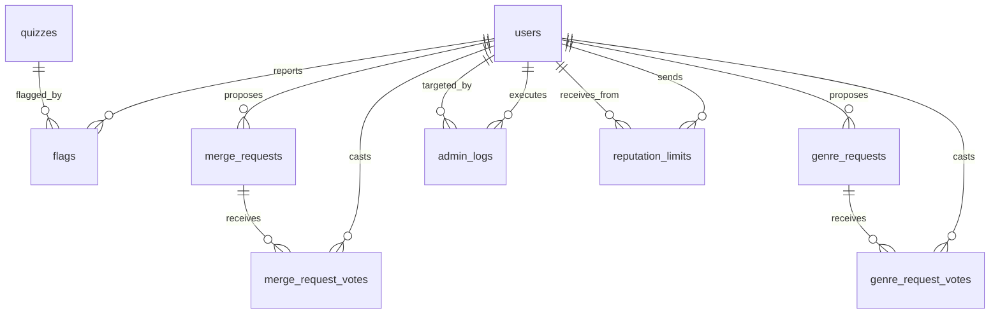

# Technical Design Document - supabase-governance

## Overview
本ドキュメントは、Quizetika のガバナンス機能（コンテンツ通報審査、タグ/ジャンル統合およびジャンル新設のコミュニティ投票、信頼スコア・BANによるモデレーション、Stripe 連携によるサブスクリプション権限判定）における Firebase Firestore／Firebase Admin SDK から Supabase (PostgreSQL) への移行に関する設計定義である。

`supabase-core-data`／`supabase-gameplay` が確立した「サービス層の外部インターフェースは変更せず、内部実装のみ RDB 正規化構造へ差し替えるブラックボックス置換」の方針、および「文字列連結の疑似ドキュメントIDではなく複合主キーで関係を表現する」正規化方針をそのまま踏襲する。加えて、`supabase-foundation` が本ドメイン向けに事前作成した `merge_requests`／`genre_requests`（`details JSONB` の汎用プレースホルダー）を、`quiz_reviews`（`supabase-gameplay`）と同様に実際の業務要件に即した明示列・投票用中間テーブルへ是正する。

### Goals
- 管理者によるユーザーの BAN／UNBAN／信頼スコアリセットを PostgreSQL の `SECURITY DEFINER` RPC でアトミックに実行し、`admin_logs` へ監査ログを記録する。
- コンテンツ通報（`flags`）の重複防止と自動保留、および管理者審査（復帰／削除）を RPC 化する。
- タグ/ジャンル統合提案（`merge_requests`）およびジャンル新設申請（`genre_requests`）の重み付き投票を、複合主キーによる原子的な重複投票防止を備えた RPC として再設計する。
- マージ可決時のクイズ一括書き換え（`runMigration` 相当）を、RDB の集合演算を用いて可決 RPC 内で同期完結させ、Firestore 時代の非同期バックグラウンドジョブ（`setTimeout` キック、100件チャンクループ、`migrationStatus` ライフサイクル）を廃止する。
- Stripe Webhook・Checkout・Customer Portal 連携（`entitlement.ts`／`subscription.ts`／`stripe-webhook.ts`）のデータアクセス層を Supabase サーバークライアント（サービスロール）へ置き換える。
- 初期ジャンルマスタの一括投入（シード）を Supabase 経由の単一実装へ統合する。
- 既存コードに存在する管理者判定の不整合（`role='admin'` と `moderation_tier='admin'` の二重判定の不一致）を `is_admin()` ヘルパーへ統一して解消する。

### Non-Goals
- クイズ・問題・ユーザーデータ自体の CRUD（`supabase-core-data` が担当済み）。
- ゲームプレイ関連（解答履歴・リーダーボード・レビュー・リアクション等、`supabase-gameplay` が担当済み）。
- Stripe のビジネスロジック変更（Webhook 署名検証、価格ID/Tierマッピング、Checkout/Portal のフロー自体は維持し、DB接続先のみ変更する）。
- ストレージ操作そのもの（`supabase-storage-migration` が担当済み。本スペックは `moveTemporaryGenreIcon()` 等の既存関数を呼び出すのみ）。
- Firestore/Firebase の物理データ移行（別途手動対応、本スペックのスコープ外）。
- `moderation_tier` enum の `'admin'` 値自体の廃止（`role` への一本化は将来の `supabase-cleanup` 等で再検討、本スペックでは `is_admin()` による吸収に留める）。

## Boundary Commitments

### This Spec Owns
- `flags`（コンテンツ通報）、`merge_requests`／`merge_request_votes`（タグ/ジャンル統合提案・投票）、`genre_requests`／`genre_request_votes`（ジャンル新設申請・投票）、`admin_logs`（管理者操作監査ログ）、`stripe_processed_events`（Webhook冪等性台帳）、`reputation_limits`（レピュテーション加算上限）の各テーブルの構造とマイグレーション。
- `metadata_genres`／`metadata_tags`（構造自体は `supabase-core-data` が作成済み）への書き込みロジック（マージ可決時の `canonical_id`／`merged_*_ids` 更新、ジャンル新設可決時の新規登録、初期シード投入）。
- `users` テーブル上のガバナンス系フィールド（`is_banned`／`banned_reason`／`banned_at`／`reputation_score`／`moderation_tier`／`reputation_history`／`role`／`subscription_tier`／`stripe_customer_id`／`stripe_subscription_id`／`subscription_status`／`current_period_end`／`is_premium`）への書き込みロジック。列定義自体は `supabase-foundation` が作成済みだが、これらの読み書きロジックは本スペックが所有する。
- `quizzes` テーブルへの書き込みのうち、`flags_count`／`status`（通報審査に伴う保留・復帰）、および `genre`／`canonical_genre_id`（マージ可決に伴う一括置換）。列定義自体は他スペックが所有するテーブルに属するが、これらガバナンス系の読み書きロジックは本スペックが所有する。
- `src/services/moderation.ts`, `tagMerge.ts`, `reputation.ts`, `entitlement.ts`, `entitlement-shared.ts`, `subscription.ts`, `stripe-webhook.ts`, `seedInitialGenresAdmin.ts` の実装。
- `/api/admin/users/ban`, `/api/admin/users/unban`, `/api/admin/users/reset`, `/api/admin/seed-genres`, `/api/admin/genres`, `/api/billing/checkout-session`, `/api/billing/portal-session`, `/api/webhooks/stripe` のデータアクセス部分（認証トークン検証自体は `supabase-auth-migration` で移行済みのため変更しない）。

### Out of Boundary
- `quizzes`／`questions`／`quiz_tags`／`quiz_questions`／`users` の基本構造そのもの、およびそれらの一般 CRUD ロジック（`supabase-core-data` が所有）。
- `attempts`／`leaderboard_entries`／`quiz_reviews`／`reactions`／`difficulty_votes`／`feedback_reports`（`supabase-gameplay` が所有）。
- ストレージバケット・アップロード/ダウンロード処理（`supabase-storage-migration` が所有）。本スペックは `moveTemporaryGenreIcon()` を呼び出すのみで再実装しない。
- Stripe Customer / Subscription / Checkout Session の API 呼び出し自体（署名検証、Price ID マッピング等）。

### Allowed Dependencies
- `supabase-auth-migration`（認証済み Supabase クライアントの取得パターン、`verifySupabaseAccessToken`、`extractBearerToken`）。
- `supabase-core-data`（`users`／`quizzes`／`metadata_genres`／`metadata_tags` テーブルへの外部キー参照、および `mapRowToUser` 等の既存マッピング関数）。
- `supabase-storage-migration`（`moveTemporaryGenreIcon()`／`uploadTemporaryGenreIconBuffer()` 等のジャンルアイコン移行関数）。

### Revalidation Triggers
- `flags`／`merge_requests`／`genre_requests`／`admin_logs`／`stripe_processed_events`／`reputation_limits` のテーブル構造変更。
- 本スペックが定義する RPC（`handle_ban_user` 等、後述）のシグネチャ変更。
- `is_admin()`／`is_moderator_or_admin()` の判定条件変更（他スペックの RLS ポリシーからも参照される可能性があるため）。
- `users` テーブルへの課金・信頼スコア関連列の追加・変更。

## Architecture

### Existing Architecture Analysis
`supabase-foundation` によって `flags`／`merge_requests`／`genre_requests`／`admin_logs`／`metadata_genres`／`metadata_tags` の DDL は既に作成済みだが、以下の不整合が確認された（詳細は `research.md` 参照）。

| テーブル/ロジック | 現状の問題 | 本設計での対応 |
|---|---|---|
| `flags` | `(quiz_id, reporter_id)` の一意制約がなく、現行 Firestore 実装は同一報告者の再通報のたびに `flagsCount` を二重計上するバグを抱える | `UNIQUE(quiz_id, reporter_id)` を追加し、`ON CONFLICT DO NOTHING` で冪等化 |
| `merge_requests`／`genre_requests` | `details JSONB` の汎用プレースホルダーで、実際の重み付き投票・`votedUserIds` 構造を表現できない。RLS も「モデレータ以上のみ書き込み可」で実際の「誰でも提案・投票可」という業務規則と矛盾 | 明示列化 + `merge_request_votes`／`genre_request_votes` 中間テーブルへ正規化。直接書き込みを RLS で全面禁止し、`SECURITY DEFINER` RPC 経由に一本化 |
| `metadata_genres` | `updated_at` 列が存在しない（`metadata_tags` には存在し非対称） | `ALTER TABLE metadata_genres ADD COLUMN updated_at` |
| 管理者判定 | `banUser`/`unbanUser`/`resetUserReputation` は `moderationTier === 'admin'` のみ判定し `role === 'admin'` を無視。一方 `resolveFlag` は `moderationTier === 'senior_moderator' || role === 'admin'` を判定し、`isAdminUser()`（`role === 'admin' OR moderationTier === 'admin'`）とも異なる、3系統の不整合した判定ロジックが併存 | `is_admin()`（`role='admin' OR moderation_tier='admin'`）と `is_moderator_or_admin()`（`moderation_tier='senior_moderator' OR is_admin()`）の2つの SQL ヘルパーへ統一 |
| `runMigration`（マージ可決後の一括書き換え） | 可決トランザクション確定後に `setTimeout(..., 0)` で非同期キックする Firestore 時代のワークアラウンドで、Next.js サーバーレス環境ではレスポンス送信後に関数が終了し実行漏れが起き得る | 可決 RPC 内で `UPDATE`/`INSERT SELECT` による同期的な集合演算として実行し、`migrationStatus` ライフサイクル自体を廃止 |
| `stripe_processed_events`／`reputation_limits` | テーブルが存在しない | 新規作成 |

### Architecture Pattern & Boundary Map



**Architecture Integration**:
- 採用パターン: `supabase-core-data`／`supabase-gameplay` と同一の「サービス層ブラックボックス置換 + RPC によるアトミック処理」。ただし Stripe 連携（`entitlement.ts`/`subscription.ts`）はサーバー専用の単一行更新のみで並行性クリティカルな不変条件を持たないため、RPC 化せず Supabase Admin クライアント（サービスロール）による直接 CRUD とする。
- ドメイン境界: コンテンツ通報審査（1系統）、タグ/ジャンル統合・新設投票（2系統）、BAN/レピュテーション管理（3系統）、Stripe エンタイトルメント・サブスクリプション（4系統）の4領域に分離。
- 既存パターンの継続: `SECURITY DEFINER` の PL/pgSQL 関数によるアトミック処理は `supabase-gameplay` の `handle_submit_review` 等と同一の実装idiom（`INSERT ... ON CONFLICT` → 差分計算 → 関連カウンタ更新）を踏襲する。
- 新規コンポーネントの根拠: `is_admin()`／`is_moderator_or_admin()`／`resolve_vote_weight()` は、複数ドメイン（BAN、レピュテーション、コンテンツ審査、マージ・ジャンル投票）から共通利用される認可・重み計算ロジックを一箇所に集約するために必要な共有内部関数。

### Technology Stack

| Layer | Choice / Version | Role in Feature | Notes |
|-------|------------------|-----------------|-------|
| Services / Core | TypeScript (strict) | サービス層のマッピング・RPC呼び出し・Admin クライアント呼び出し実装 | `Database` 型（`supabase gen types`）を使用 |
| Data / Storage | Supabase (PostgreSQL) 15+ | 正規化された永続データストア | 複合主キー・部分ユニークインデックスを追加 |
| Infrastructure | Supabase RPC (PL/pgSQL) | アトミックなトランザクション処理 | 新規12種のRPCを定義 |
| Infrastructure | Supabase Admin Client (Service Role) | RLSをバイパスする特権操作（Stripe同期、ジャンル直接登録・シード） | 既存 `createAdminClient()`（`supabase-storage-migration` 等で確立済みパターン）を再利用 |

## File Structure Plan

### Directory Structure
```
supabase/
├── migrations/
│   └── 20260705000000_governance_normalization.sql  # [NEW] governance系テーブルDDL・ALTER・RPC定義
src/
├── services/
│   ├── moderation.ts              # [MODIFY] flagContent/resolveFlagをRPC呼び出しに書き換え
│   ├── tagMerge.ts                # [MODIFY] マージ・ジャンル申請系をRPC呼び出しに書き換え、runMigration/seedInitialGenres(未使用)を削除
│   ├── reputation.ts              # [MODIFY] BAN/UNBAN/リセットをRPC呼び出しに書き換え、is_admin()判定へ統一
│   ├── entitlement.ts             # [MODIFY] firebase-admin -> Supabase Admin クライアント
│   ├── entitlement-shared.ts      # [変更なし] 純粋関数のみ、DB非依存
│   ├── subscription.ts            # [MODIFY] firebase-admin -> Supabase Admin クライアント
│   ├── stripe-webhook.ts          # [MODIFY] firebase-admin -> Supabase Admin クライアント、stripe_processed_events参照
│   └── seedInitialGenresAdmin.ts  # [MODIFY] firebase-admin -> Supabase Admin クライアント
├── app/api/
│   ├── admin/users/ban/route.ts      # [変更なし] 既にSupabase認証済み、reputation.ts呼び出しのみ
│   ├── admin/users/unban/route.ts    # [変更なし] 同上
│   ├── admin/users/reset/route.ts    # [変更なし] 同上
│   ├── admin/seed-genres/route.ts    # [MODIFY] 管理者チェックをSupabaseベースへ
│   ├── admin/genres/route.ts         # [MODIFY] Firestore読み書き -> Supabase、アイコン移行をmoveTemporaryGenreIcon()へ委譲
│   ├── billing/checkout-session/route.ts  # [MODIFY] BANチェックをSupabaseベースへ
│   ├── billing/portal-session/route.ts    # [MODIFY] 同上
│   └── webhooks/stripe/route.ts           # [変更なし] サービス呼び出しのみ、DB非依存
```

## System Flows

### コンテンツ通報と自動保留フロー


### マージ提案の可決とクイズ一括書き換えフロー


### 管理者BAN処理フロー


### Stripe Webhook 同期フロー


## Requirements Traceability

| Requirement | Summary | Components | Interfaces | Flows |
|-------------|---------|------------|------------|-------|
| 1.1 | BAN実行と監査ログ記録 | reputation.ts | banUser | 管理者BAN処理フロー |
| 1.2 | UNBAN実行と監査ログ記録 | reputation.ts | unbanUser | - |
| 1.3 | BANユーザーのアクセス拒否 | RLS (`is_not_banned()`)（既存、変更なし） | - | - |
| 2.1 | マージ提案の起案 | tagMerge.ts | createMergeRequest | - |
| 2.2 | マージ提案への重み付き重複防止投票 | tagMerge.ts | voteMergeRequest | マージ提案の可決フロー |
| 2.3 | 可決時のクイズタグ一括置換 | tagMerge.ts | voteMergeRequest | マージ提案の可決フロー |
| 3.1 | 信頼スコア更新時のティア自動判定 | reputation.ts | resolveModerationTier（純関数、変更なし） | - |
| 3.2 | 管理者による信頼スコアリセット | reputation.ts | resetUserReputation | - |
| 4.1 | Stripe作成・更新イベントの同期 | stripe-webhook.ts, entitlement.ts | handleStripeSubscriptionEvent | Stripe Webhook 同期フロー |
| 4.2 | Stripeキャンセル・失効時のダウングレード | stripe-webhook.ts, entitlement.ts | handleStripeSubscriptionEvent | Stripe Webhook 同期フロー |
| 4.3 | 有効期間内のProプランアクセス許可 | entitlement-shared.ts | computeUserEntitlements（純関数、変更なし） | - |
| 5.1 | 通報の重複防止と累計加算 | moderation.ts | flagContent | コンテンツ通報と自動保留フロー |
| 5.2 | 閾値到達時の自動保留 | moderation.ts | flagContent | コンテンツ通報と自動保留フロー |
| 5.3 | 管理者による公開復帰 | moderation.ts | resolveFlag | - |
| 5.4 | 管理者による永久削除と通知 | moderation.ts | resolveFlag | - |
| 6.1 | ジャンル新設申請の起案 | tagMerge.ts | submitGenreRequest | - |
| 6.2 | ジャンル新設申請への重複防止投票 | tagMerge.ts | voteGenreRequest | - |
| 6.3 | 可決時のジャンルマスタ登録 | tagMerge.ts | voteGenreRequest | - |
| 7.1 | 初期ジャンルの冪等投入 | seedInitialGenresAdmin.ts | seedInitialGenresWithAdmin | - |

## Components and Interfaces

### Core Services 概要

| Component | Domain/Layer | Intent | Req Coverage | Key Dependencies (P0/P1) | Contracts |
|-----------|--------------|--------|--------------|--------------------------|-----------|
| moderation.ts | Service | コンテンツ通報・審査 | 5.1-5.4 | flags（P0）, quizzes（P0） | Service |
| tagMerge.ts | Service | タグ/ジャンル統合・新設投票 | 2.1-2.3, 6.1-6.3 | merge_requests（P0）, genre_requests（P0）, metadata_tags/metadata_genres（P0） | Service |
| reputation.ts | Service | BAN/UNBAN/信頼スコアリセット | 1.1-1.3, 3.1-3.2 | admin_logs（P0）, users（P0） | Service |
| entitlement.ts | Service | エンタイトルメント解決・Stripe同期の永続化 | 4.1-4.3 | users（P0） | Service |
| entitlement-shared.ts | Service（純関数） | エンタイトルメント判定ロジック | 4.3 | なし | Service |
| subscription.ts | Service | Checkout/Portal Session発行 | 4.1 | Stripe API（P0）, users（P1） | Service |
| stripe-webhook.ts | Service | Webhookイベント処理・冪等性管理 | 4.1, 4.2 | stripe_processed_events（P0） | Service |
| seedInitialGenresAdmin.ts | Service | 初期ジャンルシード | 7.1 | metadata_genres（P0） | Service |

### モデレーション・タグ統合ドメイン

#### moderation.ts (Moderation Service)

| Field | Detail |
|-------|--------|
| Intent | クイズへのコンテンツ通報の受付・累計・自動保留、および管理者による審査（公開復帰／削除）を行う |
| Requirements | 5.1, 5.2, 5.3, 5.4 |

**Responsibilities & Constraints**
- 同一報告者による同一クイズへの重複通報は `flags` の複合ユニーク制約により原子的に無視される（冪等）。
- 審査権限は `is_moderator_or_admin()`（`senior_moderator` 以上または管理者）が必要。権限検証はクライアント供給値を信用せず `auth.uid()` から導出する。

**Dependencies**
- Outbound: `flags`, `quizzes`（P0）
- Outbound: `notifications`（P1） — 削除時の作成者通知

**Contracts**: Service [x]

##### Service Interface
```typescript
export interface ModerationService {
  flagContent(quizId: string, reporterId: string, reason: string): Promise<void>;
  resolveFlag(quizId: string, action: 'restore' | 'delete'): Promise<void>;
}
```
- Preconditions: `resolveFlag` は呼び出しユーザーが `is_moderator_or_admin()` を満たすこと（RPC内で検証、満たさない場合 `permission-denied` を送出）。
- Postconditions: `flagContent` は新規通報の場合のみ `flags_count` を加算し、5件到達で `status='suspended'` に変更する。`resolveFlag('delete')` は対象クイズを削除し、作成者へ通知を1件作成する。
- Invariants: `flags` は `(quiz_id, reporter_id)` ごとに常に高々1行。

### タグ・ジャンル統合ドメイン

#### tagMerge.ts (Tag/Genre Merge & Genre Request Service)

| Field | Detail |
|-------|--------|
| Intent | タグ/ジャンルの統合提案・投票・可決処理、ジャンル新設申請・投票・可決処理を管理する |
| Requirements | 2.1, 2.2, 2.3, 6.1, 6.2, 6.3 |

**Responsibilities & Constraints**
- 循環マージ検知（target の `canonical_id` チェーンを辿り source の出現を検知）は RPC 内で完結させる。
- 投票の重みはユーザーの `moderation_tier`（`senior_moderator` は2、それ以外は1）から RPC 内で導出し、クライアント供給値を信用しない。
- 可決時のクイズ書き換え（タグは `quiz_tags` の `INSERT SELECT` + `DELETE`、ジャンルは `quizzes` の `UPDATE`）は投票 RPC と同一トランザクション内で同期実行し、非同期ジョブ・`migrationStatus` を廃止する（`research.md` Decision 参照）。
- `runMigration`（旧・非同期バックグラウンド関数）および `seedInitialGenres`（呼び出し元が存在しない重複実装、`seedInitialGenresAdmin.ts` に統合）は削除する。

**Dependencies**
- Outbound: `metadata_tags`, `metadata_genres`（P0） — canonical解決・マスタ登録
- Outbound: `quiz_tags`, `quizzes`（P0） — マージ可決時の一括書き換え

**Contracts**: Service [x]

##### Service Interface
```typescript
export interface TagMergeService {
  createMergeRequest(
    sourceId: string,
    targetId: string,
    targetType: 'tag' | 'genre',
    reason: string
  ): Promise<string>;
  voteMergeRequest(requestId: string, opinion: 'approve' | 'reject'): Promise<void>;
  submitGenreRequest(
    genreId: string,
    displayName: string,
    description: string,
    iconImageUrl: string
  ): Promise<string>;
  voteGenreRequest(requestId: string, opinion: 'approve' | 'reject'): Promise<void>;
}
```
- Preconditions: `createMergeRequest`/`submitGenreRequest`/`voteMergeRequest`/`voteGenreRequest` の呼び出しユーザーは `is_not_banned()` を満たすこと。起案者IDおよび投票者IDはクライアントから受け取らず `auth.uid()` から導出する（なりすまし防止、Firestore版からの改善）。
- Postconditions: マージは重み付き賛成 >= 5 かつ賛成率 >= 70% で可決、ジャンル新設は重み付き賛成 >= 5 かつ賛成率 >= 80% で可決。可決時点でクイズ側の書き換え（マージ）またはマスタ登録（ジャンル新設）まで完了している。
- Invariants: `merge_request_votes`／`genre_request_votes` は `(request_id, voter_id)` ごとに常に高々1行（複合PKで保証）。同一 `(source_id, target_id)` の pending マージ提案は常に高々1件（部分ユニークインデックスで保証）。

### レピュテーション・BAN管理ドメイン

#### reputation.ts (Reputation & Ban Service)

| Field | Detail |
|-------|--------|
| Intent | ユーザーの信頼スコア・モデレータティアーの参照、管理者による強制リセット、アカウントのBAN/UNBANを管理する |
| Requirements | 1.1, 1.2, 1.3, 3.1, 3.2 |

**Responsibilities & Constraints**
- `resolveModerationTier`（スコア→ティア変換）は純関数のまま変更しない（要件3.1の判定規則そのもの）。
- 管理者操作（BAN/UNBAN/リセット）は `is_admin()`（`role='admin' OR moderation_tier='admin'`）で検証し、既存コードの判定不整合（`moderation_tier='admin'` のみを見ていた既存バグ）を解消する。
- `getReputationScore`／`checkModeratorEligibility`／`getReputationLimit` は単純な読み取りのため RPC 化せず `users`／`reputation_limits` への直接 `SELECT` とする。

**Dependencies**
- Outbound: `admin_logs`（P0） — 監査ログ
- Outbound: `users`（P0） — BAN/スコア/ティア更新
- Outbound: `reputation_limits`（P1） — 加算上限読み取り

**Contracts**: Service [x]

##### Service Interface
```typescript
export type ModerationTier = 'newcomer' | 'contributor' | 'moderator' | 'senior_moderator';

export interface ReputationService {
  resolveModerationTier(reputationScore: number): ModerationTier;
  getReputationScore(uid: string): Promise<{
    reputationScore: number;
    moderationTier: ModerationTier;
    reputationHistory: ReputationEventLog[];
  }>;
  checkModeratorEligibility(uid: string): Promise<boolean>;
  getReputationLimit(authorId: string, senderId: string): Promise<{ totalDelta: number }>;
  resetUserReputation(targetUid: string, reason: string): Promise<void>;
  banUser(targetUid: string, reason: string): Promise<void>;
  unbanUser(targetUid: string): Promise<void>;
}
```
- Preconditions: `resetUserReputation`／`banUser` の `reason` は10文字以上（TS層とRPC層の双方でガードする多重防衛）。実行者は `is_admin()` を満たすこと。
- Postconditions: `resetUserReputation` は `reputation_score=0`／`moderation_tier='newcomer'` に更新し `admin_logs` に `action='reputation_reset'` を記録する。`banUser`／`unbanUser` は `is_banned` を切り替え、それぞれ `action='ban'`／`'unban'` を記録する。`executor_id` はクライアント供給値を使わず `auth.uid()` から導出する（旧実装からの簡素化・改善: Supabase RPC は JWT クレームから `auth.uid()` を直接取得できるため、Firestore 版のように呼び出し元で再検証したUIDを明示的に引き回す必要がない）。
- Invariants: 権限のないユーザーからの呼び出しは常に `permission-denied` で拒否される（RLSではなくRPC内チェックだが、管理者操作専用の `admin_logs` はRLSで直接書き込み不可のため、実質的にRPC経由のみが書き込み経路となる）。

### エンタイトルメント・サブスクリプションドメイン

#### entitlement.ts / subscription.ts / stripe-webhook.ts (Billing Services)

| Field | Detail |
|-------|--------|
| Intent | Stripe Webhook/Checkout/Portal 連携による課金状態の同期、およびユーザーのエンタイトルメント解決を行う |
| Requirements | 4.1, 4.2, 4.3 |

**Responsibilities & Constraints**
- サーバー専用モジュール群（`entitlement.ts`／`subscription.ts`／`stripe-webhook.ts`）は Supabase Admin クライアント（サービスロール、RLSバイパス）を使用する。単一ユーザー行への直接更新のみで、複数行にまたがるアトミック性は不要なため RPC 化しない。
- `computeUserEntitlements`（`entitlement-shared.ts`）は DB非依存の純関数のまま変更しない。
- Stripe Webhook の冪等性は `stripe_processed_events`（新設）で担保する。

**Dependencies**
- Outbound: `users`（P0） — 課金フィールド更新
- Outbound: `stripe_processed_events`（P0） — 冪等性チェック
- External: Stripe API（P0） — 変更なし

**Contracts**: Service [x]

##### Service Interface
```typescript
export interface EntitlementService {
  resolveUserEntitlements(uid: string): Promise<UserEntitlements>;
  applySubscriptionFromStripe(snapshot: StripeSubscriptionSnapshot): Promise<void>;
  clearPaidEntitlements(uid: string, stripeCustomerId: string): Promise<void>;
}

export interface SubscriptionService {
  getOrCreateStripeCustomer(uid: string, email: string): Promise<string>;
  createCheckoutSession(input: CreateCheckoutSessionInput): Promise<CreateCheckoutSessionResult>;
  createPortalSession(input: CreatePortalSessionInput): Promise<{ sessionUrl: string }>;
}

export interface StripeWebhookService {
  isStripeEventProcessed(eventId: string): Promise<boolean>;
  markStripeEventProcessed(eventId: string, type: string): Promise<void>;
  handleStripeSubscriptionEvent(subscription: Stripe.Subscription, uid?: string | null): Promise<void>;
  handleCheckoutSessionCompleted(session: Stripe.Checkout.Session): Promise<void>;
  handleInvoicePaymentFailed(invoice: Stripe.Invoice): Promise<void>;
}
```
- Preconditions: `createCheckoutSession`／`createPortalSession` を呼び出す API Route は事前に `users.is_banned` を確認する（既存パターン維持）。
- Postconditions: Webhook イベントは `stripe_processed_events` に記録済みの `event_id` に対しては再処理されない（`isStripeEventProcessed` による事前チェック、既存パターン維持）。
- Invariants: 型・関数シグネチャは Firestore 版から変更しない（呼び出し元 API Routes・テストへの影響を最小化）。

### ジャンルシード・管理ドメイン

#### seedInitialGenresAdmin.ts

| Field | Detail |
|-------|--------|
| Intent | 定義済み初期ジャンルデータを `metadata_genres` へ冪等に投入する |
| Requirements | 7.1 |

**Contracts**: Service [x]

##### Service Interface
```typescript
export interface SeedGenresService {
  seedInitialGenresWithAdmin(): Promise<{ added: number; updated: number }>;
}
```
- Postconditions: Supabase Admin クライアント（サービスロール）で `metadata_genres` に対し既存IDは更新、未存在IDは新規作成する（`upsert` 相当）。

## Data Models

### Logical Data Model



**構造の要点**:
- `flags` は `(quiz_id, reporter_id)` の複合ユニーク制約で「報告者ごとに1回のみ」を不変条件として保証する。
- `merge_request_votes`／`genre_request_votes` は `(request_id, voter_id)` 複合主キーで「投票者ごとに1回のみ」を保証し、Firestore の `votedUserIds`/`votes` 配列を排除する。
- `merge_requests`／`genre_requests` は集計列（`votes_for_count` 等）を非正規化して保持し、投票のたびに RPC 内で差分更新する（`quiz_reviews` の `positive_count`/`negative_count` と同型のパターン）。

### Physical Data Model

#### 既存テーブルへの ALTER
```sql
-- flags: 同一報告者による重複通報を原子的に防止する
ALTER TABLE flags ADD CONSTRAINT flags_quiz_reporter_unique UNIQUE (quiz_id, reporter_id);

-- metadata_genres: metadata_tags と非対称だった updated_at を追加する
ALTER TABLE metadata_genres ADD COLUMN updated_at TIMESTAMPTZ DEFAULT now() NOT NULL;

-- merge_requests: 汎用プレースホルダー(details JSONB)から実際の業務要件に即した明示列へ是正する
ALTER TABLE merge_requests DROP COLUMN details;
ALTER TABLE merge_requests RENAME COLUMN created_by TO requester_id;
ALTER TABLE merge_requests ADD COLUMN target_type TEXT NOT NULL CHECK (target_type IN ('tag', 'genre'));
ALTER TABLE merge_requests ADD COLUMN source_id TEXT NOT NULL;
ALTER TABLE merge_requests ADD COLUMN target_id TEXT NOT NULL;
ALTER TABLE merge_requests ADD COLUMN reason TEXT NOT NULL DEFAULT '';
ALTER TABLE merge_requests ADD COLUMN votes_for_count INTEGER NOT NULL DEFAULT 0;
ALTER TABLE merge_requests ADD COLUMN votes_against_count INTEGER NOT NULL DEFAULT 0;
ALTER TABLE merge_requests ADD COLUMN weighted_votes_for INTEGER NOT NULL DEFAULT 0;
ALTER TABLE merge_requests ADD COLUMN weighted_votes_against INTEGER NOT NULL DEFAULT 0;
-- 同一 (source_id, target_id) の pending提案は常に高々1件
CREATE UNIQUE INDEX idx_merge_requests_pending_dedup ON merge_requests (source_id, target_id) WHERE status = 'pending';

-- genre_requests: 同様に明示列へ是正する
ALTER TABLE genre_requests DROP COLUMN details;
ALTER TABLE genre_requests RENAME COLUMN created_by TO requester_id;
ALTER TABLE genre_requests ADD COLUMN genre_id TEXT NOT NULL;
ALTER TABLE genre_requests ADD COLUMN display_name TEXT NOT NULL;
ALTER TABLE genre_requests ADD COLUMN description TEXT NOT NULL DEFAULT '';
ALTER TABLE genre_requests ADD COLUMN icon_image_url TEXT;
ALTER TABLE genre_requests ADD COLUMN votes_for_count INTEGER NOT NULL DEFAULT 0;
ALTER TABLE genre_requests ADD COLUMN votes_against_count INTEGER NOT NULL DEFAULT 0;
ALTER TABLE genre_requests ADD COLUMN weighted_votes_for INTEGER NOT NULL DEFAULT 0;
ALTER TABLE genre_requests ADD COLUMN weighted_votes_against INTEGER NOT NULL DEFAULT 0;
```

#### 新規テーブル
```sql
-- マージ提案への投票（votedUserIds/votes配列の正規化）
CREATE TABLE merge_request_votes (
    request_id UUID REFERENCES merge_requests(id) ON DELETE CASCADE NOT NULL,
    voter_id UUID REFERENCES users(id) ON DELETE CASCADE NOT NULL,
    opinion TEXT NOT NULL CHECK (opinion IN ('for', 'against')),
    weight INTEGER NOT NULL,
    voted_at TIMESTAMPTZ DEFAULT now() NOT NULL,
    PRIMARY KEY (request_id, voter_id)
);

-- ジャンル新設申請への投票
CREATE TABLE genre_request_votes (
    request_id UUID REFERENCES genre_requests(id) ON DELETE CASCADE NOT NULL,
    voter_id UUID REFERENCES users(id) ON DELETE CASCADE NOT NULL,
    opinion TEXT NOT NULL CHECK (opinion IN ('for', 'against')),
    weight INTEGER NOT NULL,
    voted_at TIMESTAMPTZ DEFAULT now() NOT NULL,
    PRIMARY KEY (request_id, voter_id)
);

-- Stripe Webhook 冪等性台帳
CREATE TABLE stripe_processed_events (
    event_id TEXT PRIMARY KEY,
    type TEXT NOT NULL,
    processed_at TIMESTAMPTZ DEFAULT now() NOT NULL
);

-- レピュテーション加算上限（users/{uid}/reputationLimits/{senderId} 相当）
CREATE TABLE reputation_limits (
    author_id UUID REFERENCES users(id) ON DELETE CASCADE NOT NULL,
    sender_id UUID REFERENCES users(id) ON DELETE CASCADE NOT NULL,
    total_delta INTEGER NOT NULL DEFAULT 0,
    PRIMARY KEY (author_id, sender_id)
);

-- RLS
ALTER TABLE merge_request_votes ENABLE ROW LEVEL SECURITY;
ALTER TABLE genre_request_votes ENABLE ROW LEVEL SECURITY;
ALTER TABLE stripe_processed_events ENABLE ROW LEVEL SECURITY;
ALTER TABLE reputation_limits ENABLE ROW LEVEL SECURITY;

CREATE POLICY merge_request_votes_read ON merge_request_votes FOR SELECT USING (TRUE);
CREATE POLICY genre_request_votes_read ON genre_request_votes FOR SELECT USING (TRUE);
-- 書き込みは SECURITY DEFINER RPC 経由のみ許可し、クライアントからの直接書き込みは拒否する

CREATE POLICY stripe_processed_events_policy ON stripe_processed_events FOR ALL USING (FALSE); -- service_role のみアクセス可
CREATE POLICY reputation_limits_read ON reputation_limits FOR SELECT
    USING (auth.uid() = author_id OR auth.uid() = sender_id);

-- 既存 RLS の是正: merge_requests / genre_requests への直接書き込みを禁止し RPC 経由に一本化する
-- （現行ポリシーは「モデレータ以上のみ書き込み可」だが、実際の業務規則は「BANされていない任意ユーザーが提案・投票可」であり不整合のため）
DROP POLICY IF EXISTS merge_requests_write ON merge_requests;
DROP POLICY IF EXISTS genre_requests_write ON genre_requests;
```

#### RPC 関数の定義
```sql
-- 共有ヘルパー: role='admin' または moderation_tier='admin' を統一的に判定する
-- (既存コードの isAdminUser() と対称。reputation.ts が moderation_tier のみを見ていた不整合を解消)
CREATE OR REPLACE FUNCTION is_admin()
RETURNS BOOLEAN AS $$
BEGIN
  RETURN EXISTS (
    SELECT 1 FROM users WHERE id = auth.uid() AND (role = 'admin' OR moderation_tier = 'admin')
  );
END;
$$ LANGUAGE plpgsql SECURITY DEFINER STABLE;

-- 共有ヘルパー: コンテンツ審査権限（シニアモデレータ以上、または管理者）を判定する
CREATE OR REPLACE FUNCTION is_moderator_or_admin()
RETURNS BOOLEAN AS $$
BEGIN
  RETURN EXISTS (
    SELECT 1 FROM users WHERE id = auth.uid() AND (moderation_tier = 'senior_moderator' OR role = 'admin' OR moderation_tier = 'admin')
  );
END;
$$ LANGUAGE plpgsql SECURITY DEFINER STABLE;

-- 共有ヘルパー: モデレーションティアに応じた投票重みを解決する
CREATE OR REPLACE FUNCTION resolve_vote_weight(p_user_id UUID)
RETURNS INTEGER AS $$
DECLARE
  v_tier moderation_tier_enum;
BEGIN
  SELECT moderation_tier INTO v_tier FROM users WHERE id = p_user_id;
  RETURN CASE WHEN v_tier = 'senior_moderator' THEN 2 ELSE 1 END;
END;
$$ LANGUAGE plpgsql SECURITY DEFINER STABLE;

-- コンテンツ通報（同一報告者の重複を冪等に無視し、閾値到達で自動保留する）
CREATE OR REPLACE FUNCTION handle_flag_content(
  p_quiz_id UUID,
  p_reason TEXT
) RETURNS VOID AS $$
DECLARE
  v_new_count INTEGER;
BEGIN
  IF NOT is_not_banned() THEN
    RAISE EXCEPTION 'banned';
  END IF;

  INSERT INTO flags (quiz_id, reporter_id, reason)
  VALUES (p_quiz_id, auth.uid(), p_reason)
  ON CONFLICT (quiz_id, reporter_id) DO NOTHING;

  IF NOT FOUND THEN
    RETURN; -- 既に通報済み（冪等）
  END IF;

  UPDATE quizzes SET flags_count = flags_count + 1 WHERE id = p_quiz_id
  RETURNING flags_count INTO v_new_count;

  IF v_new_count IS NULL THEN
    RAISE EXCEPTION 'クイズが見つかりません: %', p_quiz_id;
  END IF;

  IF v_new_count >= 5 THEN
    UPDATE quizzes SET status = 'suspended' WHERE id = p_quiz_id;
  END IF;
END;
$$ LANGUAGE plpgsql SECURITY DEFINER;

-- 管理者によるコンテンツ審査（公開復帰 または 永久削除）
CREATE OR REPLACE FUNCTION handle_resolve_flag(
  p_quiz_id UUID,
  p_action TEXT
) RETURNS VOID AS $$
DECLARE
  v_author_id UUID;
  v_title TEXT;
BEGIN
  IF NOT is_moderator_or_admin() THEN
    RAISE EXCEPTION 'permission-denied';
  END IF;

  IF p_action = 'restore' THEN
    UPDATE quizzes SET status = 'published', flags_count = 0, updated_at = now() WHERE id = p_quiz_id;
  ELSIF p_action = 'delete' THEN
    SELECT author_id, title INTO v_author_id, v_title FROM quizzes WHERE id = p_quiz_id;
    IF v_author_id IS NOT NULL THEN
      INSERT INTO notifications (user_id, title, content)
      VALUES (v_author_id, 'コンテンツが削除されました', 'コミュニティガイドライン違反のため、「' || COALESCE(v_title, '') || '」が削除されました。');
    END IF;
    DELETE FROM quizzes WHERE id = p_quiz_id;
  ELSE
    RAISE EXCEPTION 'invalid-action: %', p_action;
  END IF;
END;
$$ LANGUAGE plpgsql SECURITY DEFINER;

-- マージ提案の起案（循環参照チェック + 自動賛成票）
CREATE OR REPLACE FUNCTION handle_create_merge_request(
  p_target_type TEXT,
  p_source_id TEXT,
  p_target_id TEXT,
  p_reason TEXT
) RETURNS UUID AS $$
DECLARE
  v_request_id UUID;
  v_weight INTEGER;
  v_current TEXT;
  v_visited TEXT[] := ARRAY[p_target_id];
BEGIN
  IF NOT is_not_banned() THEN
    RAISE EXCEPTION 'banned';
  END IF;
  IF p_source_id = p_target_id THEN
    RAISE EXCEPTION 'same-id';
  END IF;

  IF p_target_type = 'tag' THEN
    SELECT canonical_id INTO v_current FROM metadata_tags WHERE id = p_target_id;
  ELSE
    SELECT canonical_id INTO v_current FROM metadata_genres WHERE id = p_target_id;
  END IF;

  WHILE v_current IS NOT NULL LOOP
    IF v_current = p_source_id THEN
      RAISE EXCEPTION 'circular-merge';
    END IF;
    IF v_current = ANY(v_visited) THEN
      EXIT;
    END IF;
    v_visited := array_append(v_visited, v_current);

    IF p_target_type = 'tag' THEN
      SELECT canonical_id INTO v_current FROM metadata_tags WHERE id = v_current;
    ELSE
      SELECT canonical_id INTO v_current FROM metadata_genres WHERE id = v_current;
    END IF;
  END LOOP;

  v_weight := resolve_vote_weight(auth.uid());

  INSERT INTO merge_requests (target_type, source_id, target_id, requester_id, reason, votes_for_count, weighted_votes_for)
  VALUES (p_target_type, p_source_id, p_target_id, auth.uid(), p_reason, 1, v_weight)
  RETURNING id INTO v_request_id;

  INSERT INTO merge_request_votes (request_id, voter_id, opinion, weight)
  VALUES (v_request_id, auth.uid(), 'for', v_weight);

  RETURN v_request_id;
END;
$$ LANGUAGE plpgsql SECURITY DEFINER;

-- マージ提案への投票（可決/否決時はクイズ側の一括書き換えまで同期完結する）
CREATE OR REPLACE FUNCTION handle_vote_merge_request(
  p_request_id UUID,
  p_opinion TEXT
) RETURNS VOID AS $$
DECLARE
  v_status TEXT;
  v_source_id TEXT;
  v_target_id TEXT;
  v_target_type TEXT;
  v_weight INTEGER;
  v_weighted_for INTEGER;
  v_weighted_against INTEGER;
BEGIN
  IF NOT is_not_banned() THEN
    RAISE EXCEPTION 'banned';
  END IF;

  SELECT status, source_id, target_id, target_type
  INTO v_status, v_source_id, v_target_id, v_target_type
  FROM merge_requests WHERE id = p_request_id FOR UPDATE;

  IF v_status IS NULL THEN
    RAISE EXCEPTION 'request-not-found';
  END IF;
  IF v_status <> 'pending' THEN
    RAISE EXCEPTION 'already-resolved';
  END IF;

  v_weight := resolve_vote_weight(auth.uid());

  -- 複合PK制約により、同一投票者からの重複投票は一意制約違反として自動的に拒否される
  INSERT INTO merge_request_votes (request_id, voter_id, opinion, weight)
  VALUES (p_request_id, auth.uid(), CASE WHEN p_opinion = 'approve' THEN 'for' ELSE 'against' END, v_weight);

  UPDATE merge_requests SET
    votes_for_count = votes_for_count + CASE WHEN p_opinion = 'approve' THEN 1 ELSE 0 END,
    votes_against_count = votes_against_count + CASE WHEN p_opinion = 'approve' THEN 0 ELSE 1 END,
    weighted_votes_for = weighted_votes_for + CASE WHEN p_opinion = 'approve' THEN v_weight ELSE 0 END,
    weighted_votes_against = weighted_votes_against + CASE WHEN p_opinion = 'approve' THEN 0 ELSE v_weight END,
    updated_at = now()
  WHERE id = p_request_id
  RETURNING weighted_votes_for, weighted_votes_against INTO v_weighted_for, v_weighted_against;

  IF v_weighted_for >= 5 AND v_weighted_for::NUMERIC / (v_weighted_for + v_weighted_against) >= 0.7 THEN
    UPDATE merge_requests SET status = 'approved', updated_at = now() WHERE id = p_request_id;

    IF v_target_type = 'tag' THEN
      UPDATE metadata_tags SET canonical_id = v_target_id, updated_at = now() WHERE id = v_source_id;
      UPDATE metadata_tags SET merged_tag_ids = array_append(merged_tag_ids, v_source_id), updated_at = now() WHERE id = v_target_id;

      INSERT INTO quiz_tags (quiz_id, tag_id, original_label)
      SELECT quiz_id, v_target_id, original_label FROM quiz_tags WHERE tag_id = v_source_id
      ON CONFLICT (quiz_id, tag_id) DO NOTHING;
      DELETE FROM quiz_tags WHERE tag_id = v_source_id;
    ELSE
      UPDATE metadata_genres SET canonical_id = v_target_id, updated_at = now() WHERE id = v_source_id;
      UPDATE metadata_genres SET merged_genre_ids = array_append(merged_genre_ids, v_source_id), updated_at = now() WHERE id = v_target_id;

      UPDATE quizzes SET genre = v_target_id, canonical_genre_id = v_target_id, updated_at = now()
      WHERE canonical_genre_id = v_source_id;
    END IF;
  ELSIF v_weighted_against >= 5 THEN
    UPDATE merge_requests SET status = 'rejected', updated_at = now() WHERE id = p_request_id;
  END IF;
END;
$$ LANGUAGE plpgsql SECURITY DEFINER;

-- ジャンル新設申請の起案
CREATE OR REPLACE FUNCTION handle_submit_genre_request(
  p_genre_id TEXT,
  p_display_name TEXT,
  p_description TEXT,
  p_icon_image_url TEXT
) RETURNS UUID AS $$
DECLARE
  v_request_id UUID;
  v_weight INTEGER;
BEGIN
  IF NOT is_not_banned() THEN
    RAISE EXCEPTION 'banned';
  END IF;

  v_weight := resolve_vote_weight(auth.uid());

  INSERT INTO genre_requests (genre_id, display_name, description, icon_image_url, requester_id, votes_for_count, weighted_votes_for)
  VALUES (p_genre_id, p_display_name, p_description, p_icon_image_url, auth.uid(), 1, v_weight)
  RETURNING id INTO v_request_id;

  INSERT INTO genre_request_votes (request_id, voter_id, opinion, weight)
  VALUES (v_request_id, auth.uid(), 'for', v_weight);

  RETURN v_request_id;
END;
$$ LANGUAGE plpgsql SECURITY DEFINER;

-- ジャンル新設申請への投票（可決時はジャンルマスタへ登録するまで同期完結する）
CREATE OR REPLACE FUNCTION handle_vote_genre_request(
  p_request_id UUID,
  p_opinion TEXT
) RETURNS VOID AS $$
DECLARE
  v_status TEXT;
  v_genre_id TEXT;
  v_display_name TEXT;
  v_description TEXT;
  v_icon_image_url TEXT;
  v_weight INTEGER;
  v_weighted_for INTEGER;
  v_weighted_against INTEGER;
BEGIN
  IF NOT is_not_banned() THEN
    RAISE EXCEPTION 'banned';
  END IF;

  SELECT status, genre_id, display_name, description, icon_image_url
  INTO v_status, v_genre_id, v_display_name, v_description, v_icon_image_url
  FROM genre_requests WHERE id = p_request_id FOR UPDATE;

  IF v_status IS NULL THEN
    RAISE EXCEPTION 'request-not-found';
  END IF;
  IF v_status <> 'pending' THEN
    RAISE EXCEPTION 'already-resolved';
  END IF;

  v_weight := resolve_vote_weight(auth.uid());

  INSERT INTO genre_request_votes (request_id, voter_id, opinion, weight)
  VALUES (p_request_id, auth.uid(), CASE WHEN p_opinion = 'approve' THEN 'for' ELSE 'against' END, v_weight);

  UPDATE genre_requests SET
    votes_for_count = votes_for_count + CASE WHEN p_opinion = 'approve' THEN 1 ELSE 0 END,
    votes_against_count = votes_against_count + CASE WHEN p_opinion = 'approve' THEN 0 ELSE 1 END,
    weighted_votes_for = weighted_votes_for + CASE WHEN p_opinion = 'approve' THEN v_weight ELSE 0 END,
    weighted_votes_against = weighted_votes_against + CASE WHEN p_opinion = 'approve' THEN 0 ELSE v_weight END,
    updated_at = now()
  WHERE id = p_request_id
  RETURNING weighted_votes_for, weighted_votes_against INTO v_weighted_for, v_weighted_against;

  IF v_weighted_for >= 5 AND v_weighted_for::NUMERIC / (v_weighted_for + v_weighted_against) >= 0.8 THEN
    UPDATE genre_requests SET status = 'approved', updated_at = now() WHERE id = p_request_id;

    INSERT INTO metadata_genres (id, display_name, description, icon_image_url, canonical_id, merged_genre_ids, is_active, updated_at)
    VALUES (v_genre_id, v_display_name, COALESCE(v_description, ''), v_icon_image_url, NULL, '{}', TRUE, now());
  ELSIF v_weighted_against >= 5 THEN
    UPDATE genre_requests SET status = 'rejected', updated_at = now() WHERE id = p_request_id;
  END IF;
END;
$$ LANGUAGE plpgsql SECURITY DEFINER;

-- 管理者によるBAN
CREATE OR REPLACE FUNCTION handle_ban_user(
  p_target_uid UUID,
  p_reason TEXT
) RETURNS VOID AS $$
BEGIN
  IF NOT is_admin() THEN
    RAISE EXCEPTION 'permission-denied';
  END IF;
  IF length(p_reason) < 10 THEN
    RAISE EXCEPTION 'reason-too-short';
  END IF;
  IF NOT EXISTS (SELECT 1 FROM users WHERE id = p_target_uid) THEN
    RAISE EXCEPTION 'target-not-found';
  END IF;

  UPDATE users SET is_banned = TRUE, banned_reason = p_reason, banned_at = now(), updated_at = now()
  WHERE id = p_target_uid;

  INSERT INTO admin_logs (target_uid, executor_id, action, reason)
  VALUES (p_target_uid, auth.uid(), 'ban', p_reason);
END;
$$ LANGUAGE plpgsql SECURITY DEFINER;

-- 管理者によるUNBAN
CREATE OR REPLACE FUNCTION handle_unban_user(
  p_target_uid UUID
) RETURNS VOID AS $$
BEGIN
  IF NOT is_admin() THEN
    RAISE EXCEPTION 'permission-denied';
  END IF;
  IF NOT EXISTS (SELECT 1 FROM users WHERE id = p_target_uid) THEN
    RAISE EXCEPTION 'target-not-found';
  END IF;

  UPDATE users SET is_banned = FALSE, banned_reason = NULL, banned_at = NULL, updated_at = now()
  WHERE id = p_target_uid;

  INSERT INTO admin_logs (target_uid, executor_id, action)
  VALUES (p_target_uid, auth.uid(), 'unban');
END;
$$ LANGUAGE plpgsql SECURITY DEFINER;

-- 管理者による信頼スコア・ティア強制リセット
CREATE OR REPLACE FUNCTION handle_reset_user_reputation(
  p_target_uid UUID,
  p_reason TEXT
) RETURNS VOID AS $$
BEGIN
  IF NOT is_admin() THEN
    RAISE EXCEPTION 'permission-denied';
  END IF;
  IF length(p_reason) < 10 THEN
    RAISE EXCEPTION 'reason-too-short';
  END IF;
  IF NOT EXISTS (SELECT 1 FROM users WHERE id = p_target_uid) THEN
    RAISE EXCEPTION 'target-not-found';
  END IF;

  UPDATE users SET reputation_score = 0, moderation_tier = 'newcomer', updated_at = now()
  WHERE id = p_target_uid;

  INSERT INTO admin_logs (target_uid, executor_id, action, reason)
  VALUES (p_target_uid, auth.uid(), 'reputation_reset', p_reason);
END;
$$ LANGUAGE plpgsql SECURITY DEFINER;
```

### Data Contracts & Integration

**行 ↔ ドメイン型のマッピング方針**:
- `MergeRequest`／`GenreRequest` の TS 型は `votedUserIds`／`votes` 配列フィールドを廃止し、投票状況が必要な画面は `merge_request_votes`／`genre_request_votes` を別途 `SELECT` して組み立てる（`quiz_reviews` の `getUserReviewForQuiz` と同型のパターン）。
- `MergeRequest.migrationStatus` フィールドは廃止する（同期実行のため常に可決 = 完了、`research.md` Decision 参照）。呼び出し元 UI（`quizetika-moderation-governance-ui`）は当該フィールド参照時に `approved` を「完了」として扱うよう改修が必要（本スペックはサービス層のみを所有するため、UI側の追随は別途 `supabase-cleanup` または UI スペックのフォローアップ課題として記録する）。
- `StripeSubscriptionSnapshot`／`UserEntitlements` 等の型は変更しない。

## Error Handling

### Error Strategy
- RPC 内で `RAISE EXCEPTION` されたエラーは `PostgrestError` として返却され、既存パターン同様にドメインエラー（`Error`）として詳細化した上でスローする。
- `permission-denied`（`is_admin()`/`is_moderator_or_admin()` 不足）は API Route 側で `403` として扱う。
- `circular-merge`／`same-id`／`already-resolved` はユーザー入力起因のエラーとして `400`/`409` に分類する（`already-resolved` は投票締切後の二重送信のため `409`）。
- `idx_merge_requests_pending_dedup` の一意制約違反（重複マージ提案）は `23505`（unique_violation）として捕捉し、「既に同じマージ提案が進行中です」というドメインエラーメッセージへ変換する。

### Monitoring
既存の `console.error` によるサーバーログ出力パターンを維持する（`supabase-gameplay`/`supabase-core-data` と同様、専用の監視基盤追加は本スペックのスコープ外）。

## Testing Strategy

### Unit Tests
- `tests/services/moderation.test.ts`: `handle_flag_content`／`handle_resolve_flag` のRPC呼び出しパラメータ検証、重複通報時の冪等性、権限不足時のエラーハンドリング。
- `tests/services/tagMerge.test.ts`, `tagMerge-thresholds.test.ts`: `handle_create_merge_request`／`handle_vote_merge_request`／`handle_submit_genre_request`／`handle_vote_genre_request` のRPC呼び出し検証。閾値判定（70%/80%、重み5）は既存の期待値を維持する。
- `tests/services/reputation.test.ts`: `handle_ban_user`／`handle_unban_user`／`handle_reset_user_reputation` のRPC呼び出し検証へ書き換え。`resolveModerationTier`（純関数）のテストは変更なし。
- `tests/services/entitlement.test.ts`, `subscription.test.ts`, `stripe-webhook.test.ts`: Supabase Admin クライアントのモック（`from().update()`/`select()` チェーンモック）へ書き換え。

### Integration Verification
- ローカル Supabase 環境に `20260705000000_governance_normalization.sql` を適用し、既存 `merge_requests`/`genre_requests` の列削除・追加がエラーなく完了することを確認する（開発環境データのため既存データ互換は考慮不要）。
- `handle_vote_merge_request` の可決分岐で、`quiz_tags`／`quizzes` の書き換えが同一トランザクション内で完結し、可決直後に `SELECT` した結果に反映されていることを検証する（非同期ジョブが残存していないことの確認）。
- `is_admin()` が `role='admin'` のみ／`moderation_tier='admin'` のみ／両方／どちらもなし の4パターンで正しく判定することを検証する。
- Jest テストスイートの全パス確認、および `npm run build` による型エラーゼロの確認。
