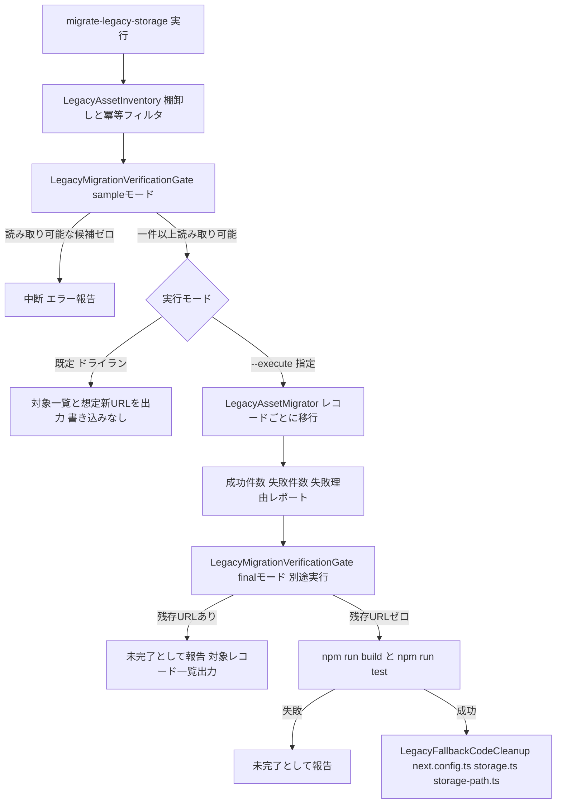
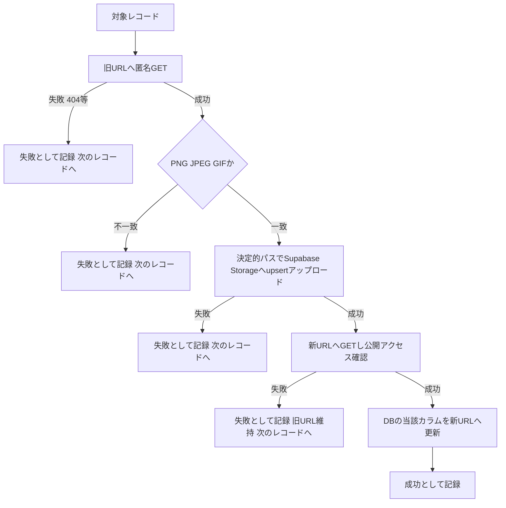

# Technical Design - supabase-storage-legacy-migration

## Overview

本機能は、Firebase → Supabase 移行（Phase 35）完了後もコード上の便宜的フォールバックによって延命されている、Firebase Storage 上の実データ（ユーザーアバター・クイズカバー画像・問題画像・ジャンルアイコン等）を Supabase Storage へ実体移行する。

**Purpose**: 運用担当者に対し、対象データの安全なドライラン確認・一括移行・失敗の個別分離・最終検証までを一貫して行うツール群を提供し、Firebase Storage への実データ依存をゼロにする。
**Users**: 移行を実行する開発者/運用担当者。
**Impact**: `research.md` の調査により、対象データは brief.md の想定（3種類）より広い7カラム（`users.avatar_url`, `quizzes.thumbnail_url`, `quizzes.author_avatar`, `questions.image_url`, `questions.author_avatar`, `metadata_genres.icon_image_url`, `genre_requests.icon_image_url`）に及ぶことが判明した。また、現行アプリがこれらの旧URLを認証なしで `` タグから表示できている実績から、Firebase Storage の読み取りは匿名HTTP GETのみで完結する設計を採用し、`firebase`/`firebase-admin` パッケージは一切再導入しない（ユーザー確認済み、`research.md` Design Decisions 参照）。

### Goals
- 対象7カラムの棚卸しとドライランにより、本番データを変更する前に影響範囲を可視化する
- ファイル複製と公開アクセス確認が完了したレコードについてのみDB参照を更新し、移行途中でも画像表示を途切れさせない
- 個別レコードの失敗を分離し、全体の移行を止めずに結果レポートを残す
- 再実行しても安全（冪等）な移行ツールを提供する
- 移行完了検証がPassした場合にのみ、`next.config.ts`・`storage.ts`・`storage-path.ts` の旧URL向け迂回設定を撤去する

### Non-Goals
- Firebase Admin SDK 等の認証付きフォールバック取得の実装（ユーザー決定により対象外。匿名取得に失敗したレコードは失敗として分離・報告するのみに留める）
- 新規アップロード機能や既存アップロードフロー（`storage.ts`/`storage-admin.ts` の既存関数）の変更
- Supabase Storage のバケット構成・ポリシー自体の変更
- Firestore（ドキュメントDB側）データの物理マイグレーション
- `sns-logos` バケット（開発者管理の静的アセット）の移行
- Firebase プロジェクトそのものの解約操作
- `src/services/storage.ts`/`src/lib/storage-path.ts` の「非Supabase URLは無視する」というガードロジック自体の削除（Dicebearデフォルトアバター等、Firebase以外の外部URLに対しても必要な汎用ガードのため維持し、コメント中の「旧 Firebase URL」「旧 Firebase Storage URL」という限定的表現のみを更新する。`research.md` Design Decisions 参照）

## Boundary Commitments

### This Spec Owns
- 対象7カラム（5テーブル）の棚卸しクエリと、Supabase URL形式レコードを除外する冪等フィルタ
- 読み取り可能性のサンプル検証（前提条件ゲート）と、移行完了後の残存URL全数検証（最終ゲート）
- ドライラン（既定動作）と実移行モードの切り替え
- Firebase Storage からの匿名HTTP GETによるファイル取得、Supabase Storage への複製、複製後の公開アクセス確認
- 複製・公開アクセス確認が完了したレコードのみのDB参照更新
- 個別レコード単位の失敗分離と結果レポート出力
- `next.config.ts` の `firebasestorage.googleapis.com` remotePatterns エントリの削除（最終ゲートPass後）
- `src/services/storage.ts`・`src/lib/storage-path.ts` のコメント更新（最終ゲートPass後、ロジックは変更しない）

### Out of Boundary
- Firebase Admin SDK 等の認証付き取得手段の実装・`firebase`/`firebase-admin` パッケージの追加（恒久・一時を問わず）
- 新規画像アップロード機能・既存アップロードフローの変更
- Supabase Storage バケット構成・ポリシー・RLSの変更
- Firestore データの物理マイグレーション
- `sns-logos` バケットの移行
- Firebase プロジェクトの解約操作
- `deleteImage()`/`parseSupabasePublicUrl()` の非Supabase URL無視ロジック自体の削除

### Allowed Dependencies
- `createAdminClient()`（`@/lib/supabase/server`、Service Role Key）— 対象テーブルの読み取り・更新
- 既存の `resolveBucketAndPath`/`parseSupabasePublicUrl`（`@/lib/storage-path`）— Supabase URL判定・冪等フィルタへの再利用
- Node.js 標準の `fetch` — Firebase Storage 旧URLへの匿名HTTP GET、および移行後URLの公開アクセス確認
- `tsx`（新規 devDependency）— TypeScript製CLIスクリプトの実行ランナー（Build vs Adopt: 一般的に確立されたツールを採用し独自ローダーは実装しない）

### Revalidation Triggers
- 匿名HTTP GETによる取得が対象データの大部分で失敗することが判明した場合（Requirement 6 の失敗レポートで検出）。その場合、認証付きフォールバックの要否を再検討する新規スペックまたは本スペックの拡張が必要になる
- 本スペック完了後、対象7カラム以外に画像URLを保持する新規カラムが追加された場合（本スペックは追加のカラムを自動検出しない）
- `next.config.ts`/`storage.ts`/`storage-path.ts` の撤去後に、`firebasestorage.googleapis.com` への新たな参照がコードベースに追加された場合

## Architecture

### Existing Architecture Analysis
- `src/services/storage-admin.ts` が Service Role Key（`createAdminClient()`）を用いたサーバー専用の Buffer アップロードパターン（`uploadQuizCoverBuffer` 等）を既に確立しており、本機能の「複製先へのアップロード」はこのパターンをそのまま踏襲できる。
- `src/lib/storage-path.ts` の `resolveBucketAndPath`/`parseSupabasePublicUrl` が Supabase の bucket/path 分離モデルと公開URL判定を既に提供しており、冪等フィルタ（既にSupabase URLのレコードを除外）にそのまま再利用できる。
- `supabase/migrations/20260702000000_init.sql` により Storage バケットは `quizzes`, `users`, `genres`, `sns-logos` の4つに固定されている。
- `scripts/verify-firebase-removed.js`（`supabase-cleanup`）が「宣言された完了状態」と「実際のコード状態」を突き合わせるゲート方式の先例となっているが、対象はソースコードの import 文であり、本機能が検証する対象（DBレコードのURL値）とは異なるため、別ツールとして新設する。

### Architecture Pattern & Boundary Map

**Selected Pattern**: ドライラン既定のゲート付きバッチパイプライン（Dry-Run-by-Default Gated Batch Pipeline）。



**Architecture Integration**:
- 選定パターンの理由: 本番データへの一括書き込みを伴うため、ドライランを既定動作とし、明示的なフラグ指定でのみ実データ変更を許可する。前提条件ゲートと最終ゲートは同一コンポーネントの異なるモードとして実装し（Generalization、`research.md` 参照）、判定ロジックの重複を避ける。
- ドメイン境界: 本スペックはStorage実データの複製とDB参照の同期のみを担当し、アップロード機能自体やバケット構成には踏み込まない。
- 既存パターンの維持: `storage-admin.ts` のアップロードパターン、`storage-path.ts` のbucket/path解決・公開URL判定パターンをそのまま再利用する。
- 新規コンポーネントの理由: 「DBレコードのURL値の棚卸し・移行・検証」という責務は既存のどのモジュールにも存在しないため新設する。
- Steering 準拠: `tech.md` の「型安全性（`any` 禁止）」「Service Role Keyのサーバー専用利用」を遵守する。

### Technology Stack

| Layer | Choice / Version | Role in Feature | Notes |
|-------|------------------|------------------|-------|
| Script Runtime | `tsx`（新規 devDependency） | TypeScript製CLIスクリプトを直接実行 | 確立された標準ツールを採用（Build vs Adopt）。恒久的な devDependency として追加するが、`firebase`/`firebase-admin` とは異なり Firebase 依存ではない |
| Data Access | `@supabase/supabase-js`（既存） | `createAdminClient()` によるテーブル読み取り・更新、Storageアップロード | 既存パターンを完全に踏襲 |
| File Fetch | Node.js 標準 `fetch` | Firebase Storage 旧URLへの匿名GET、移行後URLの公開アクセス確認 | 新規依存なし |
| Test | Jest（既存） | 単体・結合テスト | 既存の `jest.mock('@/lib/supabase/client')` 系パターンを踏襲 |

## File Structure Plan

### Directory Structure
```
src/
├── lib/
│   ├── legacy-storage-targets.ts     # 新規: 対象5テーブル×7カラム×バケットの静的定義
│   └── legacy-fallback-cleanup.ts    # 新規: next.config.ts の対象エントリ削除、storage.ts/storage-path.ts のコメント文字列置換を行う純粋関数（ファイル内容の文字列変換のみを担当し、実ファイルの読み書きは呼び出し側に委ねる）
├── services/
│   └── legacy-storage-migration.ts   # 新規: テスト対象となる全コアロジック（棚卸し・冪等フィルタ・サンプル読み取り検証関数・残存件数検証関数・レコード単位の移行処理関数）をエクスポートする単一サービスファイル

scripts/
├── migrate-legacy-storage.ts         # 新規: 薄いCLIラッパー。フラグ解析（既定ドライラン/--execute）と結果出力のみを担い、実処理は legacy-storage-migration.ts の関数を呼び出す
└── verify-legacy-storage-migration.ts # 新規: 薄いCLIラッパー。sample/finalモード引数を受け取り legacy-storage-migration.ts のサンプル読み取り検証関数・残存件数検証関数を呼び出す。finalモードで残存ゼロ確認 + npm run build/test 成功の両方を満たした場合にのみ、legacy-fallback-cleanup.ts の関数を呼び出して実ファイル（next.config.ts, storage.ts, storage-path.ts）を書き換える

tests/
└── services/
    └── legacy-storage-migration.test.ts  # 新規: 単体・結合テスト
```

### Modified Files
- `package.json` — `devDependencies` に `tsx` を追加。`scripts` に `migrate:legacy-storage`（`tsx scripts/migrate-legacy-storage.ts`）と `verify:legacy-storage-migration`（`tsx scripts/verify-legacy-storage-migration.ts`）を追加
- `next.config.ts` — 最終ゲートPass後、`images.remotePatterns` から `firebasestorage.googleapis.com` エントリを削除
- `src/services/storage.ts` — 最終ゲートPass後、`deleteImage()` のコメント「旧 Firebase URL・外部アバター等」を「Supabase 以外の外部URL（Dicebearデフォルトアバター等）」に更新（ロジックは変更しない）
- `src/lib/storage-path.ts` — 最終ゲートPass後、`parseSupabasePublicUrl()` のdocstring中の「旧 Firebase Storage URL・外部URL等」表現を同様に更新（ロジックは変更しない）

## System Flows

対象レコード1件あたりの移行判定フロー（Requirement 4-6）:



いずれの失敗分岐でも当該レコードのDB値は変更されず、旧URLによる画像表示が継続する（Requirement 5.2, 5.3）。決定的パス（`{bucket}/legacy-migrated/{table}-{recordId}-{column}.{ext}`）への `upsert: true` アップロードにより、再実行時も同一ファイルに冪等に上書きされる（Requirement 7.2）。

## Requirements Traceability

| Requirement | Summary | Components | Flows |
|---|---|---|---|
| 1.1 | 棚卸し後にサンプル読み取り検証を実施 | LegacyMigrationVerificationGate | Gate1 |
| 1.2 | サンプル全滅時は中断 | LegacyMigrationVerificationGate | Gate1 → Block1 |
| 1.3 | 検証結果の記録 | LegacyMigrationVerificationGate | Gate1 |
| 2.1 | 7カラムの棚卸し検出 | LegacyAssetInventory | Inventory |
| 2.2 | 対象領域別件数の報告 | LegacyAssetInventory | Inventory |
| 3.1 | 既定はドライランモード | LegacyAssetMigrator | ModeCheck |
| 3.2 | ドライランは書き込みなし | LegacyAssetMigrator | DryRunOutput |
| 3.3 | ドライラン結果に総件数・内訳を含む | LegacyAssetMigrator | DryRunOutput |
| 4.1 | Firebase側ファイル取得とSupabase複製 | LegacyAssetMigrator | Record→Fetch→Upload |
| 4.2 | 複製後の公開アクセス確認 | LegacyAssetMigrator | Verify |
| 4.3 | 画像形式制限の遵守確認 | LegacyAssetMigrator | MimeCheck |
| 4.4 | 取得元ファイル不存在時の個別失敗 | LegacyAssetMigrator | Fail1 |
| 5.1 | 複製・公開確認後にDB更新 | LegacyAssetMigrator | UpdateDb |
| 5.2 | 失敗時はDB未変更 | LegacyAssetMigrator | Fail1-4 |
| 5.3 | 未更新レコードは旧URL表示を維持 | LegacyAssetMigrator | Fail1-4 |
| 6.1 | 個別失敗の記録と処理継続 | LegacyAssetMigrator | Fail1-4 |
| 6.2 | 結果レポート出力 | LegacyAssetMigrator | Report |
| 7.1 | 既移行レコードの除外 | LegacyAssetInventory | Inventory |
| 7.2 | 再実行時の重複防止 | LegacyAssetMigrator | Upload（upsert） |
| 8.1 | next.config.ts のエントリ削除 | LegacyFallbackCodeCleanup | Cleanup |
| 8.2 | storage.ts/storage-path.ts のコメント更新 | LegacyFallbackCodeCleanup | Cleanup |
| 8.3 | ゲート未Pass時は撤去しない | LegacyFallbackCodeCleanup | Gate2 → Block2 |
| 9.1 | 残存URLの全数再検証 | LegacyMigrationVerificationGate | Gate2 |
| 9.2 | 残存検出時は未完了として報告 | LegacyMigrationVerificationGate | Gate2 → Block2 |
| 9.3 | build/testゲート | LegacyMigrationVerificationGate | BuildTest |
| 9.4 | build/test失敗時は未完了 | LegacyMigrationVerificationGate | BuildTest → Block3 |

## Components and Interfaces

| Component | Domain/Layer | Intent | Req Coverage | Key Dependencies (P0/P1) | Contracts |
|---|---|---|---|---|---|
| LegacyAssetInventory | Data / Query | 対象7カラムの棚卸しと冪等フィルタ | 2.1, 2.2, 7.1 | Supabase Admin Client（P0） | Service |
| LegacyAssetMigrator | Service / Orchestration | レコード単位の取得・検証・複製・DB更新・失敗分離 | 3.1-3.3, 4.1-4.4, 5.1-5.3, 6.1-6.2, 7.2 | LegacyAssetInventory（P0）, Supabase Storage（P0）, Firebase Storage 旧URL（P0、匿名アクセス） | Batch |
| LegacyMigrationVerificationGate | Tooling / CLI | サンプル読み取り検証（前提）と残存URL全数検証+build/testゲート（最終）の2モード | 1.1-1.3, 9.1-9.4 | LegacyAssetInventory（P0） | Batch |
| LegacyFallbackCodeCleanup | Config / Documentation | ゲートPass後に `next.config.ts` のエントリ削除・`storage.ts`/`storage-path.ts` のコメント更新を自動適用する純粋関数群 | 8.1, 8.2, 8.3 | LegacyMigrationVerificationGate の final モードPass（P0） | Service |

### Data / Query

#### LegacyAssetInventory

| Field | Detail |
|-------|--------|
| Intent | `LEGACY_STORAGE_TARGETS` 定義に基づき、`firebasestorage.googleapis.com` を含むURLを保持するレコードを検出し、既にSupabase URL形式のレコードを除外する |
| Requirements | 2.1, 2.2, 7.1 |

**Responsibilities & Constraints**
- `src/lib/legacy-storage-targets.ts` の静的定義（5テーブル×7カラム×バケット対応）を単一の情報源とする
- 各対象カラムに対し、`firebasestorage.googleapis.com` を含む値を持つレコードを検出する
- `parseSupabasePublicUrl()`（既存関数）でSupabase URL形式と判定できるレコードは対象から除外する（冪等性の起点）

**Dependencies**
- Inbound: LegacyAssetMigrator（P0）, LegacyMigrationVerificationGate（P0）
- Outbound: なし
- External: Supabase Admin Client（P0、読み取り専用）

**Contracts**: Service [x] / API [ ] / Event [ ] / Batch [ ] / State [ ]

##### Service Interface
```typescript
interface LegacyAssetRecord {
  table: 'users' | 'quizzes' | 'questions' | 'metadata_genres' | 'genre_requests';
  idColumn: string;
  recordId: string;
  urlColumn: string;
  legacyUrl: string;
  bucket: 'users' | 'quizzes' | 'genres';
}

interface LegacyAssetInventoryService {
  scanLegacyAssets(): Promise<Result<LegacyAssetRecord[], InventoryError>>;
}

type InventoryError = { kind: 'query_failed'; table: string; message: string };
```
- Preconditions: Supabase Admin Client が有効な Service Role Key で初期化済みであること
- Postconditions: 返却される全レコードは `legacyUrl` が `firebasestorage.googleapis.com` を含み、かつ Supabase URL形式ではないことが保証される
- Invariants: `LEGACY_STORAGE_TARGETS` に定義されていないテーブル/カラムは走査対象に含まれない

**Implementation Notes**
- Integration: `src/lib/storage-path.ts` の `parseSupabasePublicUrl` をそのままインポートして冪等フィルタに使う
- Validation: 各カラムへのクエリは `ilike` 等の部分一致検索で `firebasestorage.googleapis.com` を検出する
- Risks: 対象カラムが今後追加された場合、`LEGACY_STORAGE_TARGETS` への手動追加が必要（自動検出はNon-Goal）

### Service / Orchestration

#### LegacyAssetMigrator

| Field | Detail |
|-------|--------|
| Intent | レコードごとに「取得→検証→複製→公開確認→DB更新」を実行し、失敗を個別分離しながら結果を集計する |
| Requirements | 3.1, 3.2, 3.3, 4.1, 4.2, 4.3, 4.4, 5.1, 5.2, 5.3, 6.1, 6.2, 7.2 |

**Responsibilities & Constraints**
- 既定はドライランモード。`--execute` フラグが明示された場合のみ実書き込みを行う（3.1）
- ドライランでは対象レコード一覧と `{bucket}/legacy-migrated/{table}-{recordId}-{column}.{ext}` 形式の想定新URLのみを出力し、Storage/DBへの書き込みは一切行わない（3.2, 3.3）
- 実行モードでは、レコードごとに System Flows の判定フローに従って処理する
- アップロードは既存の画像形式制限（PNG/JPEG/GIFのみ）を満たさない場合は失敗として扱う（4.3、`tech.md` のSVG禁止方針に準拠）
- アップロードには `upsert: true` を指定し、決定的パスへの冪等な書き込みを行う（7.2）
- いずれかの段階で失敗したレコードは、DB値を変更せずに失敗理由とともに記録し、後続レコードの処理を継続する（5.2, 5.3, 6.1）
- 全レコード処理後、成功件数・失敗件数・失敗理由一覧を含むレポートを出力する（6.2）

**Dependencies**
- Inbound: `scripts/migrate-legacy-storage.ts`（P0）
- Outbound: LegacyAssetInventory（P0）
- External: Firebase Storage 旧URL（P0、匿名GET）, Supabase Storage（P0）, Supabase Admin Client（P0）

**Contracts**: Service [ ] / API [ ] / Event [ ] / Batch [x] / State [ ]

##### Batch / Job Contract
- Trigger: `npm run migrate:legacy-storage`（既定ドライラン）または `npm run migrate:legacy-storage -- --execute`
- Input / validation: `LegacyAssetInventory.scanLegacyAssets()` の出力。追加の入力は実行時フラグ（`--execute`）のみ
- Output / destination: 標準出力に人間可読なレポート（成功/失敗件数、失敗理由一覧）を出力する。ドライラン時は書き込み予定内容のプレビューを出力する
- Idempotency & recovery: 決定的パス + `upsert: true` により、中断後の再実行は既に成功したレコードを冪等に再処理し（同一結果になる）、未処理レコードのみ実質的に新規処理される

**Implementation Notes**
- Integration: 複製先パス生成は既存の `getUserAvatarPath` 等（タイムスタンプ付き、ライブアップロード専用）とは意図的に分離し、移行専用の決定的パス生成関数を新設する（`research.md` Design Decisions 参照）
- Validation: 公開アクセス確認は新URLへの `GET`（HTTP 200判定）で行う。`HEAD` は一部オブジェクトストレージ実装で非対応の場合があるため使用しない
- Risks: 匿名GETが大部分で失敗した場合、本スペックの範囲では救済できない（Non-Goal）。その場合は結果レポートを根拠に別途フォローアップを判断する（Revalidation Trigger）

### Tooling / CLI

#### LegacyMigrationVerificationGate

| Field | Detail |
|-------|--------|
| Intent | 「サンプル読み取り検証（前提条件）」と「残存URL全数検証+build/testゲート（最終検証）」の2モードを提供する |
| Requirements | 1.1, 1.2, 1.3, 9.1, 9.2, 9.3, 9.4 |

**Responsibilities & Constraints**
- `sample` モード: `LegacyAssetInventory.scanLegacyAssets()` の結果から最大5件（総数がそれ未満の場合は全件）を抽出し、匿名GETで実際に読み取れるかを検証する。1件も読み取れない場合は移行処理を開始させない（1.1, 1.2）
- `final` モード: `LegacyAssetInventory.scanLegacyAssets()` を再実行し、残存件数がゼロであることを確認する。ゼロでない場合は未完了として残存レコード一覧を出力する（9.1, 9.2）
- `final` モードで残存ゼロが確認された場合のみ、`npm run build` と `npm run test` を実行し、いずれかが失敗した場合は未完了として報告する（9.3, 9.4）
- いずれのモードも検証結果を標準出力に記録として残す（1.3）

**Dependencies**
- Inbound: 開発者（CLIから手動実行）、または `npm run verify:legacy-storage-migration`（P0）
- Outbound: LegacyAssetInventory（P0）
- External: なし（`final` モードのみ `npm run build`/`npm run test` をサブプロセスとして起動）

**Contracts**: Service [ ] / API [ ] / Event [ ] / Batch [x] / State [ ]

##### Batch / Job Contract
- Trigger: 開発者による手動実行。`sample` モードは移行開始前、`final` モードは全レコード処理完了後
- Input / validation: 引数でモード（`sample` | `final`）を指定
- Output / destination: 標準出力に合否と根拠（サンプル読み取り結果、残存レコード一覧、build/test結果）を人間可読な形式で出力。終了コードは Pass で `0`、Fail で非ゼロ
- Idempotency & recovery: 読み取り専用（`final` モードのbuild/test実行を除く）のため何度でも安全に再実行できる

**Implementation Notes**
- Integration: `supabase-cleanup` の `MigrationCompletionGate`（`scripts/verify-firebase-removed.js`）と同じ「宣言 vs 実態」検証という設計思想を踏襲するが、対象がDBデータであるため独立したツールとして実装する
- Validation: `final` モードのbuild/testは既存の `npm run build`/`npm run test` をそのまま呼び出し、新たなテストランナーは導入しない

### Config / Documentation

#### LegacyFallbackCodeCleanup

| Field | Detail |
|-------|--------|
| Intent | `next.config.ts` の対象エントリ削除、および `storage.ts`/`storage-path.ts` のコメント文字列置換を、決定的な文字列変換関数として提供する |
| Requirements | 8.1, 8.2, 8.3 |

**Responsibilities & Constraints**
- `next.config.ts` のソース文字列を受け取り、`images.remotePatterns` から `hostname: 'firebasestorage.googleapis.com'` を含むパターンエントリを1件削除した文字列を返す純粋関数を提供する
- `storage.ts`/`storage-path.ts` のソース文字列を受け取り、限定的表現を「Supabase 以外の外部URL（Dicebearデフォルトアバター等）」に置換した文字列を返す純粋関数を提供する。両ファイルで実際の文言が異なる（`storage.ts`: 「旧 Firebase URL・外部アバター等」、`storage-path.ts`: 「旧 Firebase Storage URL・外部URL等」）ため、両方の異表記に対応する（`research.md` Design Decisions の通り、ロジック自体は変更しない）
- 各関数はファイルI/Oを行わない純粋関数とし、呼び出し側（`scripts/verify-legacy-storage-migration.ts`）が `final` モードの残存ゼロ確認と `npm run build`/`npm run test` 成功の両方を満たした場合にのみ、実ファイルの読み込み・関数適用・書き戻しを行う（8.3）

**Dependencies**
- Inbound: `scripts/verify-legacy-storage-migration.ts`（P0、`final` モードでのみ呼び出し）
- Outbound: なし
- External: なし

**Contracts**: Service [x] / API [ ] / Event [ ] / Batch [ ] / State [ ]

##### Service Interface
```typescript
interface FallbackCleanupResult {
  changed: boolean;
  content: string;
}

interface LegacyFallbackCleanupService {
  removeFirebaseStorageRemotePattern(nextConfigSource: string): FallbackCleanupResult;
  updateLegacyUrlComment(sourceCode: string): FallbackCleanupResult;
}
```
- Preconditions: 入力文字列は対象ファイルの現在の内容そのものであること
- Postconditions: 対象パターン/コメントが存在しない場合は `changed: false` を返し、内容を変更しない（冪等）
- Invariants: 非Supabase URLガードのロジック（`if (!parsed) { return; }` 等）自体は関数内で一切変更されない

**Implementation Notes**
- Integration: 実ファイルの読み込み・書き戻しは `scripts/verify-legacy-storage-migration.ts` 側で `fs.readFileSync`/`fs.writeFileSync` により行う（本関数群は純粋関数としてテスト容易性を確保する）
- Validation: 単体テストは実プロジェクトファイルではなく、対象パターンを含む文字列フィクスチャに対して行う
- Risks: `next.config.ts`/`storage.ts`/`storage-path.ts` の実際の文言が将来変更された場合、置換対象の文字列パターンが一致しなくなる可能性がある。その場合 `changed: false` が返り、`final` モードは警告付きで完了する（後続の手動確認を促す）

## Error Handling

### Error Strategy
個別レコードの失敗は処理を止めずに分離・記録する一方、前提条件・最終検証・build/testの失敗は、後続の書き込みや「完了」報告を一切許可しない方針とする。

### Error Categories and Responses
- **サンプル読み取り全滅（Requirement 1.2）**: `LegacyMigrationVerificationGate`（sampleモード）が全滅を検出した場合、`LegacyAssetMigrator` の実行を開始させない
- **個別レコード失敗（Requirement 4.4, 5.2, 6.1）**: 取得失敗・形式不一致・アップロード失敗・公開アクセス確認失敗のいずれも、当該レコードのDB値を変更せず、失敗理由とともに記録して後続レコードの処理を継続する
- **残存URL検出（Requirement 9.2）**: `LegacyMigrationVerificationGate`（finalモード）が残存を検出した場合、`LegacyFallbackCodeCleanup` の実行（コード撤去）を許可しない
- **ビルド/テスト失敗（Requirement 9.4）**: 残存ゼロ確認後の `npm run build`/`npm run test` のいずれかが失敗した場合、移行完了として報告しない

### Monitoring
本スペックは一度限りの移行完了作業であるため常時監視は不要。`LegacyAssetMigrator` の実行結果レポートと `LegacyMigrationVerificationGate` の実行結果ログを作業記録として残す。

## Testing Strategy

- **Unit Tests**: `LEGACY_STORAGE_TARGETS` が7カラム全てを定義していることの静的検証。`scanLegacyAssets()` がSupabase URL形式のレコードを正しく除外すること（冪等フィルタ）。レコード単位の移行判定関数が、成功時のDB更新・取得失敗時のDB非更新・MIME不一致時の失敗記録・公開アクセス確認失敗時のDB非更新をそれぞれ正しく行うこと
- **Integration Tests**: ドライランモードで実行した場合、Storage/DBへの書き込みAPIが一切呼び出されないこと。`LegacyMigrationVerificationGate` の `sample` モードが、読み取り可能レコード0件で中断し、1件以上で処理を許可すること。`final` モードが残存レコードの有無に応じて正しく合否判定すること
- **Regression Tests**: `deleteImage()`/`parseSupabasePublicUrl()` のコメント更新後も、既存のDicebearアバター等の非Supabase URLに対する無視動作が変更されないこと（既存テストスイートの回帰確認）

## Supporting References

- 対象データの棚卸し結果（7カラムの内訳）とFirebase Storage読み取り方式の実現可能性調査: [research.md](./research.md) の「Firebase Storage 読み取り方式の実現可能性調査」節
- 匿名HTTP GET採用の決定経緯、決定的パス設計、`storage.ts`/`storage-path.ts` コメント更新方針の根拠: [research.md](./research.md) の「Design Decisions（設計フェーズ）」節
