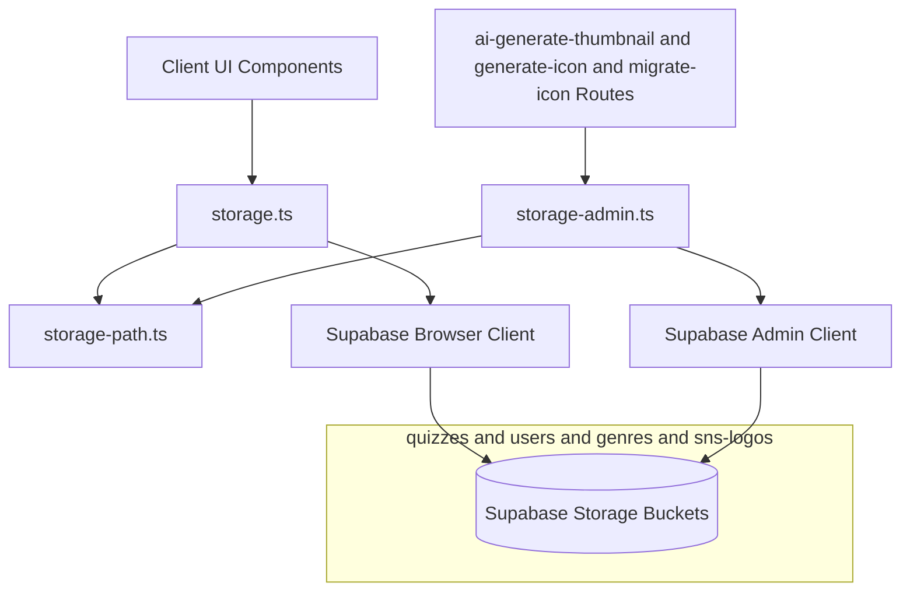
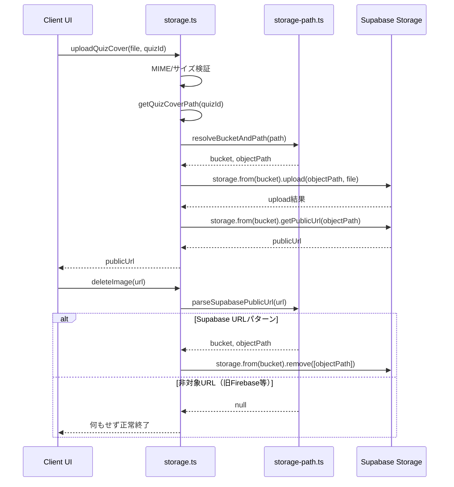
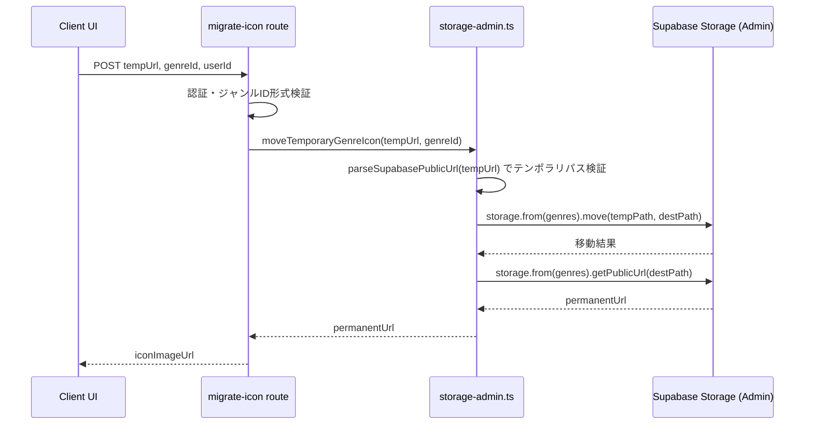

# Technical Design Document - supabase-storage-migration

## Overview
本ドキュメントは、Quizetika のファイルストレージ機能（クイズカバー画像、ジャンルアイコン、ユーザーアバター、SNSロゴの保存・削除・配信）における Firebase Storage から Supabase Storage への移行に関する設計定義です。

`supabase-foundation` が既に `quizzes`／`users`／`genres`／`sns-logos` の4バケットと基本 RLS ポリシーを定義済みであるため、本スペックはバケットの新規作成を行わず、（1）サービス層（`storage.ts`／`storage-admin.ts`）の実装差し替え、（2）匿名閲覧要件に合わせたバケット公開設定の是正、（3）関連 API Route のストレージ操作集約、の3点に責務を絞る。

### Goals
- `src/services/storage.ts` の全関数（`uploadImage`, `deleteImage`, `uploadQuizCover`, `getSnsLogoUrl`, パスヘルパー群）を Supabase Storage SDK ベースの実装に置き換える。既存の関数シグネチャ・パス構造・呼び出し元コードは変更しない。
- `src/services/storage-admin.ts` の全関数（`uploadQuizCoverBuffer`, `uploadTemporaryGenreIconBuffer`）を Supabase サーバークライアント（Service Role Key）ベースの実装に置き換える。
- `quizzes`／`users`／`genres` バケットの公開設定を是正し、未ログインユーザーでも画像を閲覧できるようにする（`sns-logos` は既に `public: true` のため変更不要）。
- `deleteImage` の URL 判定ロジックを Supabase Storage の公開URLパターンに対応させ、旧 Firebase Storage URL は安全にスキップする。
- `migrate-icon` API Route が直接操作していた Storage バケット操作ロジックを `storage-admin.ts` に集約する。

### Non-Goals
- 既存 Firebase Storage 内ファイルの物理移行（新規アップロードのみ Supabase 経由とする）。
- データベース（Firestore/Supabase）内に保存済みの画像URL参照の一括書き換え。
- `supabase-foundation` で定義済みのバケット新規作成・INSERT/DELETE系 RLS ポリシーの変更（本スペックは SELECT 可視性のみ是正する）。
- 認証フロー・UIコンポーネントの変更。

## Boundary Commitments

### This Spec Owns
- `src/services/storage.ts`、`src/services/storage-admin.ts` の実装。
- 新設する `src/lib/storage-path.ts`（バケット/パス解決・URL解析の純関数）。
- `quizzes`／`users`／`genres` バケットの `public` フラグ（読み取り可視性のみ）。
- `src/app/api/genres/migrate-icon/route.ts` のストレージ操作部分（バリデーション・レスポンス整形は現状維持）。

### Out of Boundary
- ストレージバケットの新規作成、`INSERT`/`DELETE` 系 RLS ポリシーの定義（`supabase-foundation` が所有、変更しない）。
- `src/lib/genre-icon-upload.ts` のバリデーションルール自体（維持のみで変更しない）。
- `src/app/api/quiz/ai-generate-thumbnail/route.ts`、`src/app/api/genres/generate-icon/route.ts` の認証・AI生成ロジック（`storage-admin.ts` の関数呼び出し部分は関数シグネチャ不変のため無改修）。
- データベーステーブルの構造・RLS（`supabase-core-data`／`supabase-gameplay`／`supabase-governance` が所有）。

### Allowed Dependencies
- `supabase-foundation`（バケット定義、`quizzes`/`users`/`genres`/`sns-logos` のINSERT/DELETE RLS ポリシー、`is_not_banned()` 関数）。
- `src/lib/supabase/client.ts`（`createClient()`）、`src/lib/supabase/server.ts`（`createAdminClient()`）。

### Revalidation Triggers
- バケットIDの追加・変更・削除。
- パスヘルパー（`getQuizCoverPath` 等）が返すパス構造の変更。
- `storage.ts`／`storage-admin.ts` の公開関数シグネチャの変更。

## Architecture

### Existing Architecture Analysis
`supabase-foundation` の初期マイグレーション（`supabase/migrations/20260702000000_init.sql`）で以下が確認された。

| 項目 | 現状 | 本設計での対応 |
|------|------|----------------|
| バケット定義 | `quizzes`/`users`/`genres` が `public: false`、`sns-logos` が `public: true` で作成済み | `quizzes`/`users`/`genres` を `public: true` へ ALTER（匿名閲覧要件のため。書き込み/削除 RLS は変更しない） |
| SELECT RLS | `Authenticated Read Access for buckets` ポリシーは実質ロール制限なし（未使用のまま） | バケット公開化により `getPublicUrl()` が機能するため、当該 RLS ポリシーの実用上の意味は薄れるが、既存ポリシーの削除・変更は行わない（Out of Boundary） |
| パス構造 | `getQuizCoverPath` 等がバケット名を先頭セグメントに含む文字列（例: `quizzes/{quizId}/cover_{ts}.png`）を返す | `resolveBucketAndPath()` で先頭セグメント＝バケットID、残り＝オブジェクトパスとして解決し、パス構造自体は変更しない |
| `migrate-icon` | API Route が `getAdminStorage()` を直接操作 | `storage-admin.ts` に一時アイコン移動関数を追加し、Route から Storage 直接操作を排除 |

### Architecture Pattern & Boundary Map



**Architecture Integration**:
- 採用パターン: 既存の `supabase-core-data`／`supabase-gameplay` と同一の「サービス層ブラックボックス置換」。外部インターフェース（関数シグネチャ・パス構造）を変えず内部実装のみ差し替える。
- ドメイン境界: クライアントサイド（`storage.ts`）とサーバーサイド特権操作（`storage-admin.ts`）を分離し、両者は共通の純関数ユーティリティ（`storage-path.ts`）のみを共有する。
- 既存パターンの継続: `src/lib/supabase/client.ts`／`server.ts` で確立済みの `createClient()`／`createAdminClient()` 取得パターンをそのまま利用する。
- 新規コンポーネントの根拠: `storage-path.ts` は、Firebase の単一バケット階層パスと Supabase の bucket/path 分離モデルとのギャップを吸収するために必要。クライアント・サーバー双方から参照されるため共有ライブラリとして新設する。

### Technology Stack

| Layer | Choice / Version | Role in Feature | Notes |
|-------|------------------|-----------------|-------|
| Client SDK | `@supabase/supabase-js` ^2.110.0（既存依存） | クライアントサイドの `storage.from().upload()`/`getPublicUrl()`/`remove()` | 新規依存追加なし |
| Server SDK | `@supabase/supabase-js`（`createAdminClient()` 経由） | Service Role Key による特権アップロード・移動 | `src/lib/supabase/server.ts` 既存実装を再利用 |
| Data / Storage | Supabase Storage（S3互換） | `quizzes`/`users`/`genres`/`sns-logos` バケット | バケット・RLSは `supabase-foundation` 定義済み |

## File Structure Plan

### Directory Structure
```
supabase/
├── migrations/
│   └── <timestamp>_storage_public_read.sql  # [NEW] quizzes/users/genres バケットを public:true へALTER
src/
├── lib/
│   └── storage-path.ts        # [NEW] resolveBucketAndPath, parseSupabasePublicUrl（純関数）
├── services/
│   ├── storage.ts             # [MODIFY] Firebase SDK -> Supabase Storage SDK
│   └── storage-admin.ts       # [MODIFY] Firebase Admin SDK -> Supabase Admin Client、moveTemporaryGenreIcon を追加
├── app/api/genres/
│   └── migrate-icon/route.ts  # [MODIFY] Storage直接操作を storage-admin.ts の関数呼び出しへ置換
```

### Modified Files
- `src/app/api/quiz/ai-generate-thumbnail/route.ts` — 変更なし（`uploadQuizCoverBuffer` のシグネチャ不変のため）
- `src/app/api/genres/generate-icon/route.ts` — 変更なし（`uploadTemporaryGenreIconBuffer` のシグネチャ不変のため）

## System Flows

### クライアントサイド画像アップロード・削除フロー


### ジャンルアイコン一時保存 -> 本移動フロー（migrate-icon）


## Requirements Traceability

| Requirement | Summary | Components | Interfaces | Flows |
|-------------|---------|------------|------------|-------|
| 1.1, 1.2, 1.4 | クライアントアップロードと公開URL返却 | storage.ts, storage-path.ts | uploadImage, uploadQuizCover | クライアントアップロード・削除フロー |
| 1.3 | 許可外MIMEタイプの拒否 | storage.ts | uploadImage, uploadQuizCover | - |
| 2.1, 2.2 | URLパターン判定による削除・スキップ | storage.ts, storage-path.ts | deleteImage | クライアントアップロード・削除フロー |
| 3.1, 3.2 | サーバー特権アップロード（Service Role Key） | storage-admin.ts | uploadQuizCoverBuffer, uploadTemporaryGenreIconBuffer | - |
| 4.1, 4.2, 4.3 | バケット公開設定・アクセス制御・容量制限 | Storage Engine（既存） | Bucket Policy | - |
| 5.1 | API Routes のストレージ呼び出し更新 | storage-admin.ts, migrate-icon route | moveTemporaryGenreIcon | ジャンルアイコン移動フロー |
| 5.2 | SVGアップロード禁止の維持 | genre-icon-upload.ts（既存・変更なし） | assertGenreIconFileValid | - |

## Components and Interfaces

| Component | Domain/Layer | Intent | Req Coverage | Key Dependencies (P0/P1) | Contracts |
|-----------|--------------|--------|--------------|--------------------------|-----------|
| storage.ts | Service (Client) | クライアントサイドの画像アップロード・削除・パスヘルパー | 1.1-1.4, 2.1, 2.2 | storage-path.ts（P0）, Supabase Browser Client（P0） | Service |
| storage-admin.ts | Service (Server) | サーバー特権アップロード・ジャンルアイコン本移動 | 3.1, 3.2, 5.1 | storage-path.ts（P0）, Supabase Admin Client（P0） | Service |
| storage-path.ts | Lib (Shared) | バケット/パス解決、公開URL解析の純関数 | 1.1, 2.1 | なし | Service |

### storage.ts (Client Storage Service)

| Field | Detail |
|-------|--------|
| Intent | クイズカバー・アバター・ジャンルアイコンのアップロード、画像削除、SNSロゴ取得、パスヘルパーを提供する |
| Requirements | 1.1, 1.2, 1.3, 1.4, 2.1, 2.2 |

**Responsibilities & Constraints**
- MIME タイプ（PNG/JPEG/GIF）・サイズ制限（クイズカバー10MB、ジャンルアイコン2MB）のバリデーションは既存ロジックをそのまま維持する。
- パスヘルパー（`getQuizCoverPath`, `getQuestionImagePath`, `getUserAvatarPath`, `getGenreIconPath`）の戻り値文字列（構造・命名規則）は変更しない。

**Dependencies**
- Outbound: `storage-path.ts`（P0） — bucket/path 解決
- Outbound: `src/lib/supabase/client.ts`（P0） — `createClient()`
- Outbound: `src/lib/genre-icon-upload.ts`（P1） — `assertGenreIconFileValid`（既存、変更なし）

**Contracts**: Service [x]

##### Service Interface
```typescript
export interface StorageService {
  uploadImage(file: File, path: string): Promise<string>;
  deleteImage(imageUrl: string): Promise<void>;
  uploadQuizCover(file: File | Blob, quizId: string): Promise<string>;
  getSnsLogoUrl(snsName: string): Promise<string>;
  getQuizCoverPath(quizId: string, extension?: string): string;
  getQuestionImagePath(quizId: string, questionId: string, extension?: string): string;
  getUserAvatarPath(uid: string, extension?: string): string;
  getGenreIconPath(genreId: string, extension?: string): string;
}
```
- Preconditions: `uploadImage`／`uploadQuizCover` に渡す `file` は許可された MIME タイプかつサイズ制限内であること（違反時は例外）。
- Postconditions: アップロード成功時は Supabase Storage の恒久公開URL（`getPublicUrl()` 由来）を返す。`deleteImage` は Supabase URL 以外（旧 Firebase URL・外部アバター等）に対して何もせず正常終了する。
- Invariants: パスヘルパーの戻り値の先頭セグメントは常に既存バケットID（`quizzes`/`users`/`genres`）のいずれかと一致する。

### storage-admin.ts (Server Storage Service)

| Field | Detail |
|-------|--------|
| Intent | Service Role Key を用いたサーバーサイド特権アップロードと、ジャンルアイコンの一時保存先から本パスへの移動を行う |
| Requirements | 3.1, 3.2, 5.1 |

**Responsibilities & Constraints**
- Service Role Key はサーバーサイド（`createAdminClient()`）でのみ使用し、クライアントバンドルやレスポンスに含めない。
- `moveTemporaryGenreIcon` は `genres` バケット内のオブジェクト移動（同一バケット内の `move()`）のみを行い、バケットをまたぐ操作は行わない。

**Dependencies**
- Outbound: `storage-path.ts`（P0） — 一時URLの解析
- Outbound: `src/lib/supabase/server.ts`（P0） — `createAdminClient()`

**Contracts**: Service [x]

##### Service Interface
```typescript
export interface StorageAdminService {
  uploadQuizCoverBuffer(
    buffer: Buffer,
    options: { quizId?: string; uid: string }
  ): Promise<string>;
  uploadTemporaryGenreIconBuffer(buffer: Buffer, uid: string): Promise<string>;
  moveTemporaryGenreIcon(tempUrl: string, genreId: string): Promise<string>;
}
```
- Preconditions: `moveTemporaryGenreIcon` の `tempUrl` は `genres` バケットの `temp/` 配下オブジェクトを指す Supabase 公開URLであること（不一致時は例外）。`genreId` は半角英数字・ハイフンのみ（既存ルート側バリデーションを維持）。
- Postconditions: `moveTemporaryGenreIcon` は移動先オブジェクトの恒久公開URLを返し、一時オブジェクトは移動後に存在しない。
- Invariants: アップロード先パスは常にタイムスタンプを含み、既存オブジェクトを上書きしない。

### storage-path.ts (Shared Path/URL Utility)

| Field | Detail |
|-------|--------|
| Intent | Firebase由来のバケット名を先頭セグメントに含むパス文字列と、Supabase Storage の bucket/path 分離モデルとの相互変換を行う |
| Requirements | 1.1, 2.1 |

**Contracts**: Service [x]

##### Service Interface
```typescript
export interface BucketAndPath {
  bucket: string;
  objectPath: string;
}

export function resolveBucketAndPath(path: string): BucketAndPath;
export function parseSupabasePublicUrl(url: string): BucketAndPath | null;
```
- Preconditions: `resolveBucketAndPath` に渡す `path` は先頭スラッシュの有無を問わず、最初のセグメントがバケットIDであること。
- Postconditions: `parseSupabasePublicUrl` は `.../storage/v1/object/public/{bucket}/{objectPath}` 形式に一致しないURL（旧Firebase URL、外部アバター等）に対して `null` を返す。

## Data Models

### Physical Data Model

```sql
-- quizzes/users/genres バケットを匿名閲覧可能にする
-- (書き込み・削除は supabase-foundation 定義の既存RLSポリシーのまま維持)
UPDATE storage.buckets
SET public = TRUE
WHERE id IN ('quizzes', 'users', 'genres');
```

## Error Handling

### Error Strategy
- `uploadImage`／`uploadQuizCover` の MIME/サイズ検証エラーは既存同様、呼び出し元へ日本語メッセージ付き `Error` としてスローする。
- `deleteImage` は Supabase Storage の `remove()` がオブジェクト不在でもエラーを返さない挙動（冪等）を前提とし、Firebase版にあった「object-not-found を握りつぶす」特別処理は不要になる。`error` が返却された場合（権限エラー等）のみログ出力の上で再スローする。
- `moveTemporaryGenreIcon` は `tempUrl` が想定パターンと一致しない場合、または `move()` がエラーを返した場合に例外をスローし、route 側で既存の `400`/`500` レスポンスへマッピングする。

## Testing Strategy

### Unit Tests
- `tests/services/storage.test.ts`: `@/lib/supabase/client` をモックし、`uploadQuizCover`／`getSnsLogoUrl`／`uploadImage` が正しい bucket・path で `upload`/`getPublicUrl` を呼び出すことを検証。既存のMIME/サイズ異常系テストは維持。
- `tests/services/storage-admin.test.ts`: `@/lib/supabase/server` の `createAdminClient` をモックし、`uploadQuizCoverBuffer`／`uploadTemporaryGenreIconBuffer`／`moveTemporaryGenreIcon` の呼び出しパラメータを検証。
- `tests/lib/storage-path.test.ts`（新規）: `resolveBucketAndPath`／`parseSupabasePublicUrl` の正常系・非対象URLでの `null` 返却を検証。

### Integration Verification
- ローカル Supabase 環境で新規マイグレーション適用後、`quizzes`/`users`/`genres` バケットが匿名セッションから画像取得可能であることを確認する。
- `migrate-icon` route 経由で一時アイコンが `genres/{genreId}/` 配下へ移動し、一時ファイルが存在しなくなることを確認する。
