# ER図とデータベース設計 (ER Diagram & Database Schema)

本ドキュメントは、クイズ投稿SNS「quizetika」の Supabase (PostgreSQL) における論理ER図および各テーブルの設計標準を定義します。
Firestore から Supabase PostgreSQL への移行に伴い、データ構造は RDB として完全に正規化されています。

## 1. 論理ER図 (Mermaid)

```mermaid
erDiagram
    users {
        uuid id PK
        string email
        string display_name
        string avatar_url
        text bio
        integer created_quizzes_count
        integer total_play_count
        integer followers_count
        integer following_count
        integer reputation_score
        string moderation_tier
        string delete_status
        string subscription_tier
        string subscription_status
        string stripe_customer_id
        string stripe_subscription_id
        boolean is_premium
        timestamp current_period_end
        timestamp created_at
        timestamp updated_at
    }

    badges {
        string id PK
        string title
        text description
        string icon_name
        timestamp unlocked_at
    }

    user_badges {
        uuid user_id PK, FK
        string badge_id PK, FK
        timestamp created_at
    }

    metadata_genres {
        string id PK
        string display_name
        string icon_image_url
        boolean is_active
        timestamp created_at
    }

    user_genre_follows {
        uuid user_id PK, FK
        string genre_id PK, FK
        timestamp created_at
    }

    quizzes {
        uuid id PK
        uuid author_id FK
        string author_name
        string author_avatar
        string title
        text description
        string thumbnail_url
        integer difficulty
        string status
        integer flags_count
        integer play_count
        integer bookmarks_count
        integer positive_count
        integer negative_count
        integer temp_positive_count
        integer temp_negative_count
        integer review_score
        string review_badge
        boolean is_review_masked
        string active_reset_request_id
        string canonical_genre_id FK
        string format
        timestamp created_at
        timestamp updated_at
    }

    questions {
        uuid id PK
        uuid author_id FK
        string author_name
        string author_avatar
        string type
        text question_text
        text explanation
        string image_url
        text hint
        integer limit_time
        jsonb choices
        jsonb sorting_items
        jsonb association_hints
        text ai_context_details
        string[] truth_keywords
        string source_url
        integer correct_count
        integer incorrect_count
        timestamp created_at
    }

    quiz_questions {
        uuid quiz_id PK, FK
        uuid question_id PK, FK
        integer sort_order
    }

    metadata_tags {
        string id PK
        string display_name
        string canonical_id FK
        timestamp created_at
    }

    quiz_tags {
        uuid quiz_id PK, FK
        string tag_id PK, FK
    }

    bookmarks {
        uuid id PK
        uuid user_id FK
        uuid target_id
        string target_type
        timestamp created_at
    }

    attempts {
        uuid id PK
        uuid user_id FK
        uuid quiz_id FK
        integer score
        integer elapsed_seconds
        string mode
        jsonb question_answer_details
        timestamp completed_at
    }

    follows {
        uuid follower_id PK, FK
        uuid following_id PK, FK
        timestamp created_at
    }

    feedback_reports {
        uuid id PK
        uuid user_id FK
        uuid quiz_id FK
        uuid question_id FK
        string category
        text content
        boolean is_resolved
        timestamp created_at
    }

    flags {
        uuid id PK
        uuid user_id FK
        uuid target_id
        string target_type
        string reason
        text details
        string status
        timestamp created_at
    }

    reactions {
        uuid id PK
        uuid sender_id FK
        uuid target_id
        string target_type
        string reaction_type
        timestamp created_at
    }

    notifications {
        uuid id PK
        uuid user_id FK
        string type
        jsonb data
        boolean is_read
        timestamp created_at
    }

    admin_logs {
        uuid id PK
        uuid executor_id FK
        uuid target_uid FK
        string action
        text reason
        timestamp created_at
    }

    user_reports {
        uuid id PK
        uuid reporter_id FK
        uuid target_uid FK
        text reason
        timestamp created_at
    }

    ai_turn_counts_global {
        uuid user_id PK, FK
        integer count
        date count_date PK
    }

    ai_turn_counts_per_quiz {
        uuid user_id PK, FK
        uuid quiz_id PK, FK
        integer count
        date count_date PK
    }

    analytics_outbox {
        uuid event_id PK
        string table_name
        string event_type
        jsonb payload
        timestamp occurred_at
        string status
        integer retry_count
        text last_error
        timestamp sent_at
    }

    users ||--o{ user_badges : "has"
    badges ||--o{ user_badges : "assigned to"
    users ||--o{ user_genre_follows : "follows"
    metadata_genres ||--o{ user_genre_follows : "followed by"
    users ||--o{ quizzes : "creates"
    quizzes ||--o{ quiz_questions : "contains"
    questions ||--o{ quiz_questions : "references"
    quizzes ||--o{ quiz_tags : "has"
    metadata_tags ||--o{ quiz_tags : "associated with"
    users ||--o{ bookmarks : "bookmarks"
    users ||--o{ attempts : "performs"
    quizzes ||--o{ attempts : "targeted by"
    users ||--o{ follows : "follower"
    users ||--o{ follows : "following"
    users ||--o{ feedback_reports : "submits"
    quizzes ||--o{ feedback_reports : "reported in"
    users ||--o{ flags : "flags"
    quizzes ||--o{ flags : "flagged"
    users ||--o{ reactions : "gives"
    quizzes ||--o{ reactions : "receives"
    users ||--o{ notifications : "receives"
    users ||--o{ admin_logs : "executes/target"
    users ||--o{ user_reports : "reported"
    users ||--o{ ai_turn_counts_global : "counted"
    users ||--o{ ai_turn_counts_per_quiz : "counted"
```

## 2. 主要テーブルの説明

### 2.1 コアデータ
* **`users`**: ユーザーの基本プロフィール情報、および Stripe サブスクリプション状態（`subscription_tier` : `free`, `player`, `creator`, `premium`）を保持します。
* **`quizzes`**: クイズの基本情報。ジャンル（`canonical_genre_id`）やリーダーボード（JSON）を含みます。
* **`questions`**: 問題のデータ。選択肢（`choices`）、並び替え用のアイテム（`sorting_items`）、水平思考用の裏設定（`ai_context_details`）等を JSONB や 配列形式で内包します。
* **`quiz_questions`**: クイズと問題の中間テーブル（順序保持のための `sort_order` を含む）。

### 2.2 リレーションと探索
* **`user_badges` / `badges`**: ユーザーが獲得した称号バッジとマスタ。
* **`user_genre_follows` / `metadata_genres`**: ユーザーがフォローしているジャンルとマスタ。
* **`quiz_tags` / `metadata_tags`**: クイズに関連付けられたタグとマスタ（仮想統合のための `canonical_id` をサポート）。
* **`follows`**: ユーザー間のフォロー/フォロワー関係。

### 2.3 プレイログとモデレーション
* **`attempts`**: プレイヤーのクイズ解答結果ログ。各問題の解答詳細を `question_answer_details` JSONB に蓄積します。
* **`bookmarks`**: クイズおよび問題単体に対するお気に入り登録。
* **`feedback_reports`**: プレイヤーから作家へ送信される間違いや別解の指摘フィードバック。
* **`flags`**: 不適切なコンテンツに対する通報データ。
* **`reactions`**: プレイ完了時などに作家へ送るリアクション（いいね・感謝など）。
* **`user_reports`**: 不健全なユーザーに対する通報（レピュテーション管理用）。
* **`admin_logs`**: 管理者アクション（BAN/UNBAN等）の監査ログ。

### 2.4 システム制御
* **`ai_turn_counts_global` / `ai_turn_counts_per_quiz`**: 水平思考クイズ（ウミガメのスープ）における、無料ユーザーの質問制限カウンタ（1日あたり全体150回、クイズごと30回制限）。
* **`stripe_processed_events`**: 決済Webhookの冪等処理用ログ。
* **`search_logs`**: スマートサジェスト集計用の検索履歴サイレントログ（認証済みユーザーのみ、TTL管理）。

### 2.5 データ分析・パイプライン
* **`analytics_outbox`**: 同期対象テーブル（attempts、quizzes等）の変更イベント（INSERT/UPDATE/DELETE）を一次保存するアウトボックステーブル。サニタイズされたペイロードを保持し、BigQuery へ配送されるまで配送ステータスを管理します。
