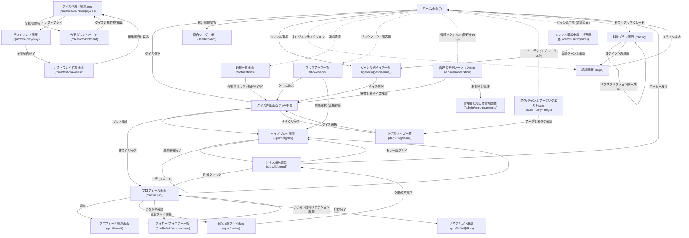

# 画面遷移図と画面一覧 (Screen Transitions & Screen List)

本ドキュメントは、クイズ投稿SNS「quizetika」における画面の一覧、各画面の役割、および画面間の遷移設計を定義します。
なお、クイズリストおよび問題リスト機能は、仕様のクリーンアップ（Phase 26）に伴い完全に廃止されています。

## 1. 画面遷移図 (Mermaid)

## 2. 各画面の機能仕様

### 2.1 プレイヤー向け主要画面
* **ホーム画面 (`/`)**: 
  * 「新着順」「人気順」「トレンド順」「フォロータイムライン（ログイン時のみ）」をタブで表示。
  * ジャンルナビゲーションと、タグ・難易度・問題数・未プレイなどの複合検索フィルタを提供。
* **認証画面 (`/login`)**:
  * Supabase Auth によるサードパーティソーシャル認証（Google 等）を提供。※E2Eテスト用のモックログインボタンは本番環境では物理的に除外されます。
* **クイズ詳細画面 (`/quiz/[id]`)**:
  * クイズ情報（タイトル、説明、問題数、難易度、ジャンル、タグ、作成者）の表示。
  * 「初回プレイ」と「リプレイ」のリーダーボード（各上位5名）をタブで切り替えて表示。
  * 「通常」「模擬試験」「フラッシュカード」の3つのプレイモードを選択してプレイを開始。
* **クイズプレイ画面 (`/quiz/[id]/play`)**:
  * クイズの解答を行うインタラクティブ画面。進捗はローカルストレージで自動復旧・保護されます。
  * **選択式 (`multiple-choice` / `true-false`)**: 単一正解はラジオボタン、複数正解はチェックボックスで「解答を確定する」ボタンを使用します。
  * **並び替え (`sorting`)**: ドラッグ＆ドロップで並べ替えたあと「解答を確定する」ボタンで決定。
  * **連想 (`association`)**: 段階的ヒントを開示しながら、任意のタイミングで短答テキスト解答を送信。
  * **早押し (`quick-press`)**: 200ms/文字でワイプアニメーション表示される問題文を早押ししてテキスト解答。
  * **水平思考 (`lateral-thinking`)**: 2カラム構成で、左カラムはAI質問チャット（ターン制限あり）、右カラムはQ&A履歴リスト。真相回答を提出してAIが意味的合格判定を行うとクリア。諦めフローも提供。
* **クイズ結果画面 (`/quiz/[id]/result`)**:
  * 正解率、経過時間、問題別の解説・正誤状況一覧を表示。
  * 良問評価（👍良問 / 👎悪問、悪問は理由付き）、体感難易度の投票フォーム。
  * 間違い・別解指摘フィードバック送信、作家へのリアクション、SNS共有リンク。
* **弱点克服プレイ画面 (`/quiz/review`)**:
  * 過去に間違えた問題（`totalFailedQuestionsCount > 0`）を対象とする復習プレイ画面。開始前にジャンルで絞り込みが可能。正解した問題はリストから除外されます。

### 2.2 クリエイター向け画面
* **クイズ作成・編集画面 (`/quiz/create`, `/quiz/[id]/edit`)**:
  * タイトル、説明、カバー画像、ジャンルマスタ選択、タグ自動名寄せサジェストを一箇所で行う縦1カラムの作成UI。
  * 問題エディタは、簡易マークダウンプレビュー付きで問題文・解説を入力可能。出典URL入力欄も実装。
  * 「下書き保存」「公開する」に加え、未保存の状態でもすぐに確認できる「テストプレイ」機能（`sessionStorage` 経由）を提供。
* **テストプレイ画面 (`/quiz/test-play/play`) / 結果画面 (`/quiz/test-play/result`)**:
  * 作成中の未完成データで体験プレイするデバッグ用画面（統計・リーダーボード非対象）。完了後に「編集画面に戻る」ことができます。
* **作家ダッシュボード (`/creator/dashboard`)**:
  * 投稿したクイズの一覧、アクセス・評価サマリーのグラフ分析。
  * 各問題の選択肢・正解率別解答割合のビジュアル化。
  * プレイヤーから送信された「間違い指摘フィードバック」の確認とクイズ編集への連携。
  * 投稿した全クイズデータのJSON一括エクスポート。

### 2.3 ソーシャル・サポート画面
* **プロフィール画面 (`/profile/[uid]`)**:
  * アバター、表示名、自己紹介、フォロー/フォロワー数、称号バッジ一覧、レピュテーションスコア、ティアーバッジを表示。
  * タブ切り替え：「作成したクイズ」「プレイ履歴（本人のみ）」。
  * 弱点克服セクション（間違い問題がある場合のみ露出）。
* **フォロー/フォロワー一覧 (`/profile/[uid]/connections`)**:
  * フォロー/フォロワーの関係者一覧を表示し、その場でフォロー解除等を切り替え。
* **ブックマーク一覧 (`/bookmarks`)**:
  * お気に入りしたクイズおよび問題（公開済みのみ）を個別に管理・プレイ開始。
* **リアクション履歴 (`/profile/[uid]/likes`)**:
  * 送信したリアクション、および獲得したリアクション（いいね・感謝）の履歴一覧。
* **タグ別 / ジャンル別クイズ一覧 (`/tags/[tagName]`, `/genres/[genreId]`)**:
  * 特定タグまたは特定ジャンルに属する公開中クイズの一覧（マージ統合による正規IDマッピング済み）。
* **料金プラン画面 (`/pricing`)**:
  * ユーザーの有料サブスクリプションプラン（Player, Creator, Premium）の比較・購入および管理。二重購読の防止ロジックが組み込まれています。

### 2.4 モデレーション・コミュニティ画面
* **通知一覧画面 (`/notifications`)**:
  * ゲストも閲覧可能な「運営からのお知らせ」と、認証ユーザー向けの「通知（フォロー、指摘修正完了、ブックマーク）」を表示。
* **タグ/ジャンルマージリクエスト画面 (`/community/merge`)**:
  * 表記揺れタグ等を整理統合するためのリクエスト提案およびモデレータ投票画面。
* **ジャンル新設申請・投票画面 (`/community/genres`)**:
  * 存在しない新規ジャンルをコミュニティ内で提案・新設審査するための申請・投票画面。
* **管理者モデレーション画面 (`/admin/moderation`)**:
  * 監査ログ、および通報しきい値（5回）に達した一時保留中コンテンツを審査・管理する画面。
* **管理者お知らせ管理画面 (`/admin/announcements`)**:
  * 運営からのお知らせ記事をマークダウンで作成・即時/予約公開する管理者専用画面。
