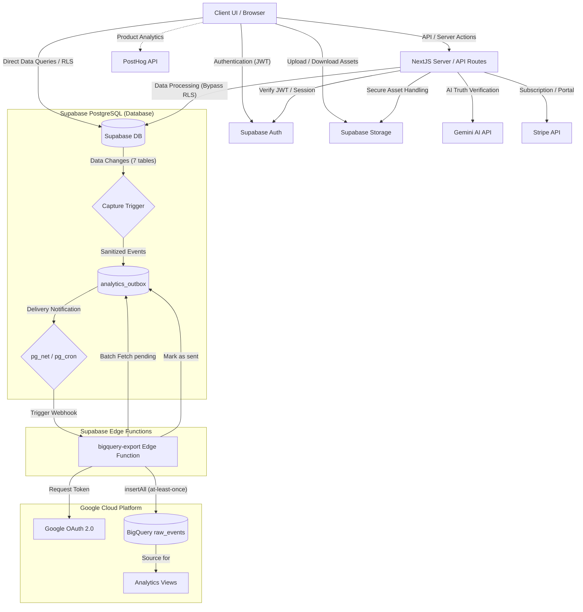

# システム構成図 (System Architecture)

本ドキュメントは、クイズ投稿SNS「quizetika」における最新のシステム構成とコンポーネント間の連携設計を定義します。
バックエンド基盤は Firebase から Supabase (Auth, Storage, PostgreSQL) に一本化されています。

## 1. システム構成図 (Mermaid)

## 2. 各コンポーネントの役割と機能

### 2.1 クライアント層 (Client / Browser)
* **Client UI (React 19 / Next.js 16.2.6)**: ユーザーインターフェースを提供。状態管理、セッションの中断保護（`localStorage`）、テストプレイのドラフト管理（`sessionStorage`）を行います。
* **Supabase Client SDK**: クライアントから直接 Supabase Auth で認証処理を行い、読み取り/単純な更新は Row Level Security (RLS) を前提として直接 Supabase PostgreSQL に接続します。画像のアップロードは直接 Supabase Storage と通信します。
* **PostHog SDK**: ユーザーの操作分析、ページ遷移イベント、機能利用状況などのプロダクトアナリティクスデータを収集して非同期で PostHog サーバーに送信します。

### 2.2 サーバーアプリケーション層 (Next.js Server / API Routes)
* **Next.js API Routes / Server Actions**: 複雑なビジネスロジック、二重課金の防止、管理者向けの特権操作（BAN/UNBAN等）、セキュリティ上秘密鍵が必要な外部APIとの通信を担当します。
* **Supabase Admin Client (Service Role Key)**: API Routes 等のサーバーコンテキストでは、RLSをバイパスしてデータベース操作をアトミックに実行するために Service Role Key を使用します（クライアントへの漏洩を防ぐためサーバー側でのみ参照します）。
* **Stripe Webhook ハンドラー (`/api/webhooks/stripe`)**: Stripe から受信した決済イベント（サブスクリプション作成・更新・キャンセル）を処理し、`users` の `subscription_tier` やエンタイトルメント状態を同期します。
* **AI真相判定プロキシ (`/api/attempt/verify-truth`, `ask-ai`)**: Gemini AI API を呼び出すためのサーバーサイドプロキシ。会話履歴のコンテキスト制御、日次質問回数制限のサーバーサイド検証、および質問文の正規化キャッシュ判定を実行します。

### 2.3 データベース & インフラ層 (Supabase / BaaS)
* **Supabase Auth**: ソーシャルログイン（Google 等）の認証トークン（JWT）を発行・管理します。
* **Supabase Storage**: ユーザーのアバター、クイズのカバー画像、ジャンルアイコン等の静的アセットを管理します（SVGアップロード禁止ポリシー適用）。
* **Supabase PostgreSQL (Database)**: 全てのアプリケーションデータを正規化されたRDBスキーマで永続化します。
  * **Row Level Security (RLS)**: 各テーブルに対して操作種別ごとに RLS ポリシーを定義し、データベースレベルでの強固な認可を保証します。

### 2.4 データ分析・パイプライン層 (BigQuery Pipeline)
* **`analytics_outbox` (Transactional Outbox)**: 同期対象イベントを一次記録・配送状態管理するアウトボックステーブル。
* **キャプチャトリガー (Capture Trigger)**: 対象7テーブル（`attempts`、`quizzes`、`questions`等）の変更（INSERT/UPDATE/DELETE）を検知して個人情報（PII）を除去・サニタイズした上で、同一トランザクション内で `analytics_outbox` テーブルにイベントを挿入します（Transactional Outbox パターンによる at-least-once 保証）。
* **pg_net / pg_cron**: outbox への書き込み時に pg_net で即時に Edge Function を起床させ、pg_cron で未配送（pending）の自動再送（毎分）と、配送済み（sent）データの定期パージ（毎日）を実行します。
* **`bigquery-export` Edge Function**: Deno 環境で動作するサーバーレス関数。Google Cloud サービスアカウント認証（OAuth 2.0 / RS256 JWT署名）を用いて BigQuery にバッチ送信（`insertAll`）し、成功した行を `sent` に更新します。

### 2.5 外部サービス (Third-Party APIs)
* **Google Gemini API (`@google/genai`)**: 水平思考クイズの対話質問に対する返答と、真相要約提出時の意味判定、AI問題生成、サムネイル/ジャンルアイコン画像生成を担当します。
* **Stripe API**: 料金プランの決済（Checkout Session）、購読管理（Customer Portal）、サブスクリプション契約情報の管理を担当します。
* **PostHog**: プロダクト分析、イベントの収集・集計プラットフォーム。
* **Google BigQuery (GCP)**: AI学習データの蓄積および分析用データウェアハウス。`raw_events` テーブル（追記専用、日次パーティショニング）に生イベントを格納し、論理ビューによって重複排除や版整合（クイズの履歴変化）を行って学習データセットを抽出します。
