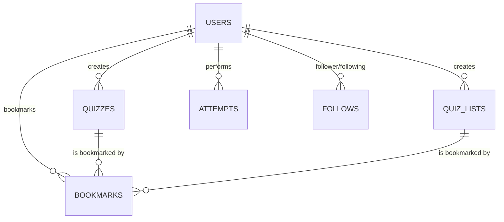

# クイズ投稿SNS「quizeum」要件定義書

本ドキュメントは、ユーザーがクイズを自由に作成・投稿し、他のユーザーがプレイ・評価し、お互いにフォローできるクイズ投稿SNS「quizeum」のシステム要件を定義するものです。

---

## 1. システム概要

### 1.1 開発の目的と背景
「quizeum」は、クイズを通じた知識の共有とユーザー間のコミュニケーションを促進するSNSプラットフォームです。
ユーザーは自作のクイズを投稿するクリエイターとして、あるいは他者のクイズを解くプレイヤーとして参加し、双方向のやり取りを楽しむことができます。

### 1.2 コアバリュー
- **クリエイティビティの解放**: 直感的なクイズ作成インターフェースにより、誰でも簡単にクイズを発信可能にする。
- **インタラクティブな学習・遊び**: 各問題に詳細な「解説」を用意し、単なる回答に留まらない学習効果を提供する。
- **ソーシャルによる活性化**: フォロー機能、ブックマーク、問題集（リスト）共有機能により、良質なクイズが自然と拡散される仕組みを構築する。

### 1.3 技術スタック
- **Frontend / Fullstack**: Next.js (App Router, v16.2.6), React (v19.2.4), TypeScript
- **Styling**: Vanilla CSS (globals.css, page.module.css)
- **Backend / Database**: Firebase (Auth, Firestore)
- **Icons**: Lucide React

---

## 2. アクターとユーザー分類

本システムにおけるユーザー（アクター）は、以下の3つに分類されます。

| アクター名 | 定義・説明 |
| :--- | :--- |
| **ゲスト（未認証）** | サービスにログインしていないユーザー。クイズの閲覧やプレイ（結果の保存なし）など、一部の読み取り機能のみ利用可能。 |
| **一般ユーザー（認証済）** | Firebase Authを介してログインしたユーザー。クイズの作成・投稿、結果の永続化、ブックマーク、ユーザーのフォロー、クイズリストの作成など、すべての機能が利用可能。 |
| **システム（Firestore/Auth）** | Firebaseの認証ルールやバックエンドの処理。データの整合性やアトミックなトランザクションを担保する。 |

---

## 3. 機能要件

### 3.1 認証・プロフィール管理機能

| ID | 機能名 | 詳細仕様 | 認証要否 |
| :--- | :--- | :--- | :--- |
| F-101 | 新規登録 / ログイン | メールアドレス/パスワード、または各種ソーシャルログインを利用した認証。 (Firebase Auth) | 不要 |
| F-102 | プロフィール編集 | 表示名 (`displayName`)、アバター画像 (`avatarUrl`)、自己紹介 (`bio`) の更新。 | 必要 |
| F-103 | 興味ジャンル設定 | ユーザーが関心のあるジャンル (`followedGenres`) を複数選択・設定し、フィードに反映。 | 必要 |

### 3.2 クイズ作成・投稿機能

| ID | 機能名 | 詳細仕様 | 認証要否 |
| :--- | :--- | :--- | :--- |
| F-201 | クイズの新規作成 | タイトル、説明、サムネイル、難易度（`easy` / `medium` / `hard`）、ジャンル、タグを設定して新規作成。 | 必要 |
| F-202 | 問題（Question）の編集 | クイズ内に複数の問題を内包。各問題には「問題文」「解説（`explanation`）」「選択肢リスト（最大4択を想定）」を設定。選択肢には正解フラグ (`isCorrect`) を付与。 | 必要 |
| F-203 | 下書き・公開制御 | 作成したクイズを「公開 (`isPublished = true`)」にするか、「下書き（非公開）」のままにするかを制御。 | 必要 |
| F-204 | クイズの編集・削除 | 自身が作成したクイズ情報の更新、または削除。 | 必要 |

### 3.3 クイズプレイ機能

| ID | 機能名 | 詳細仕様 | 認証要否 |
| :--- | :--- | :--- | :--- |
| F-301 | クイズ詳細表示 | タイトル、説明、問題数、作者情報、プレイ回数、ブックマーク数を表示。 | 不要 |
| F-302 | クイズの実行・正誤判定 | 1問ずつ問題と選択肢を表示し、ユーザーの回答に対してリアルタイムに正誤判定を表示。 | 不要 |
| F-303 | 結果・解説の表示 | 全問回答完了後、最終スコア（正解率）を表示。各問題の正解と作成者による「解説」を表示。 | 不要 |
| F-304 | プレイ履歴・結果の永続化 | ログイン中ユーザーがプレイした場合、挑戦結果 (`Attempt`) をデータベースに保存。 | 必要 |
| F-305 | プレイ数カウントアップ | クイズがプレイされるたびに、クイズドキュメントの `playCount` をインクリメント。 | 不要 |

### 3.4 ソーシャル・コミュニケーション機能

| ID | 機能名 | 詳細仕様 | 認証要否 |
| :--- | :--- | :--- | :--- |
| F-401 | ユーザーフォロー | 他のクイズ作成者をフォロー/フォロー解除する機能。重複登録を防ぐため、ドキュメントIDは `${followerId}_${followingId}` とする。 | 必要 |
| F-402 | ブックマーク登録/解除 | クイズまたはクイズリストをブックマークに追加/削除。トランザクションを使用し、ブックマークデータ登録と同時に対象の `bookmarksCount` をアトミックに加減算する。 | 必要 |
| F-403 | タイムラインフィード | 自分がフォローしているユーザーが作成した最新の公開クイズ一覧を表示。 | 必要 |

### 3.5 問題集（クイズリスト）機能

| ID | 機能名 | 詳細仕様 | 認証要否 |
| :--- | :--- | :--- | :--- |
| F-501 | クイズリストの作成 | 複数のクイズを一つのテーマやフォルダのようにまとめる「問題集（`QuizList`）」を作成。タイトル、説明、公開フラグを設定。 | 必要 |
| F-502 | リストへのクイズ追加/削除 | 既存のクイズIDをリストに紐付け、または除外 (`arrayUnion` / `arrayRemove` を使用)。 | 必要 |
| F-503 | リストのプレイ・閲覧 | リストに含まれるクイズを順番にプレイ、または一覧表示する。 | 不要 |

### 3.6 クイズ検索・探索機能

| ID | 機能名 | 詳細仕様 | 認証要否 |
| :--- | :--- | :--- | :--- |
| F-601 | 新着クイズ一覧 | 公開されているクイズを投稿日時 (`createdAt`) の降順で取得。 | 不要 |
| F-602 | 人気ランキング | プレイ数 (`playCount`) の降順で公開クイズを取得。 | 不要 |
| F-603 | トレンドクイズ | ブックマーク数 (`bookmarksCount`) の降順で公開クイズを取得。 | 不要 |
| F-604 | タグ・ジャンル検索 | 特定のタグ (`array-contains`) やジャンル (`==`) にマッチする公開クイズを検索・取得。 | 不要 |

---

## 4. データモデル定義 (Firestore Schema)

Firestore に設計されているデータ構造と、各エンティティのスキーマ定義です。

### 4.1 `users` コレクション (単一ドキュメントID: `uid`)
ユーザーの基本情報および興味のあるジャンルを管理します。

| フィールド名 | 型 | 説明 |
| :--- | :--- | :--- |
| `id` | `string` | Firebase Auth の `uid` と同一値。 |
| `email` | `string` | メールアドレス。 |
| `displayName` | `string` | プロフィール表示名。 |
| `avatarUrl` | `string` | プロフィールアバター画像 URL。 |
| `bio` | `string` | 自己紹介文。 |
| `followedGenres`| `string[]` | フォロー（関心がある）ジャンル名の配列。 |
| `createdAt` | `timestamp` | アカウント作成日時。 |
| `updatedAt` | `timestamp` | プロフィール最終更新日時。 |

### 4.2 `quizzes` コレクション (自動割り当てID)
クイズのメタ情報と、そのクイズに紐づくすべての問題・選択肢を内包するドメインの中心的なモデルです。

| フィールド名 | 型 | 説明 |
| :--- | :--- | :--- |
| `id` | `string` | ドキュメントID。 |
| `authorId` | `string` | クイズを作成したユーザーの `uid`。 |
| `authorName` | `string` | 作成者の表示名（高速描画のための非正規化保持）。 |
| `authorAvatar` | `string` | 作成者のアバターURL（高速描画のための非正規化保持）。 |
| `title` | `string` | クイズのタイトル。 |
| `description` | `string` | クイズの詳細説明。 |
| `thumbnailUrl` | `string` | サムネイル画像の URL。 |
| `difficulty` | `'easy' \| 'medium' \| 'hard'` | 難易度。 |
| `genre` | `string` | クイズのジャンル（例: `programming`, `history`）。 |
| `tags` | `string[]` | クイズに付与されたタグの配列。 |
| `questions` | `array (Question)` | 以下に示す `Question` オブジェクトの配列。 |
| `isPublished` | `boolean` | 公開フラグ。`true` で全体公開、`false` で下書き状態。 |
| `playCount` | `number` | クイズがプレイされた総回数。 |
| `bookmarksCount`| `number` | ブックマークされている総数。 |
| `createdAt` | `timestamp` | 作成日時。 |
| `updatedAt` | `timestamp` | 更新日時。 |

#### ネストされる型定義

##### `Question` オブジェクト
- `id`: `string` (問題ID: UUID または連番)
- `questionText`: `string` (問題文)
- `explanation`: `string` (正解判定後に表示される解説)
- `choices`: `Choice[]` (選択肢の配列)

##### `Choice` オブジェクト
- `id`: `string` (選択肢ID: UUID または連番)
- `choiceText`: `string` (選択肢のテキスト)
- `isCorrect`: `boolean` (正解フラグ)

### 4.3 `quizLists` コレクション (自動割り当てID)
ユーザーが自由にクイズを組み合わせて作成できる問題集です。

| フィールド名 | 型 | 説明 |
| :--- | :--- | :--- |
| `id` | `string` | ドキュメントID。 |
| `authorId` | `string` | リストを作成したユーザーの `uid`。 |
| `authorName` | `string` | 作成者の表示名（非正規化保持）。 |
| `authorAvatar` | `string` | 作成者のアバターURL（非正規化保持）。 |
| `title` | `string` | リストのタイトル。 |
| `description` | `string` | リストの説明。 |
| `quizIds` | `string[]` | リストに含まれるクイズの Firestore ドキュメントIDの配列。 |
| `isPublished` | `boolean` | 公開フラグ。 |
| `bookmarksCount`| `number` | リストがブックマークされている総数。 |
| `createdAt` | `timestamp` | リスト作成日時。 |
| `updatedAt` | `timestamp` | リスト更新日時。 |

### 4.4 `follows` コレクション (ドキュメントID: `${followerId}_${followingId}`)
ユーザー同士のフォロー関係を管理する中間コレクションです。

| フィールド名 | 型 | 説明 |
| :--- | :--- | :--- |
| `id` | `string` | `${followerId}_${followingId}` の形式。 |
| `followerId` | `string` | フォローした側のユーザーID (`uid`)。 |
| `followingId` | `string` | フォローされた側のユーザーID (`uid`)。 |
| `createdAt` | `timestamp` | フォローした日時。 |

### 4.5 `bookmarks` コレクション (ドキュメントID: `${userId}_${targetId}`)
ユーザーがクイズまたはクイズリストをブックマークした情報を保持します。

| フィールド名 | 型 | 説明 |
| :--- | :--- | :--- |
| `id` | `string` | `${userId}_${targetId}` の形式。 |
| `userId` | `string` | ブックマークしたユーザーのID (`uid`)。 |
| `targetId` | `string` | ブックマーク対象のID（クイズID、またはクイズリストID）。 |
| `targetType` | `'quiz' \| 'list'`| 対象の種類。 |
| `createdAt` | `timestamp` | ブックマークした日時。 |

### 4.6 `attempts` コレクション (自動割り当てID)
クイズの解答結果を記録し、ユーザー自身が後から振り返るためのプレイ履歴です。

| フィールド名 | 型 | 説明 |
| :--- | :--- | :--- |
| `id` | `string` | ドキュメントID（省略可能）。 |
| `userId` | `string` | プレイしたユーザーのID (`uid`)。 |
| `quizId` | `string` | プレイしたクイズのID。 |
| `score` | `number` | 正解した問題数。 |
| `totalQuestions`| `number` | クイズの総問題数。 |
| `completedAt` | `timestamp` | クイズを解き終えた日時。 |

---

## 5. 非機能要件

### 5.1 セキュリティとアクセス制御 (Firestore Security Rules)
- **認証保護**: クイズの作成、編集、削除、ブックマークのトグル、フォロー、挑戦結果の記録などは、すべて認証されたユーザー (`request.auth != null`) のみ許可する。
- **所有者制限**: クイズやクイズリストの編集・削除は、ドキュメントの `authorId` が実行ユーザーの `request.auth.uid` と一致する場合のみ許可する。
- **データ不整合の防止**: ブックマークのトグルやフォローなどのカウンタ更新、重複登録が発生しうる箇所にはアトミックなトランザクション、またはバッチ書き込みを採用し、カウントの乖離を防ぐ。

### 5.2 パフォーマンス・スケーラビリティ
- **非正規化設計**: 投稿の一覧表示において、各投稿ごとにユーザー情報を都度クエリ（N+1問題）するのを防ぐため、クイズやクイズリスト側にも作成者の `displayName` や `avatarUrl` を非正規化して保持。プロフィール更新時にこれらを同期する仕組み（または Cloud Functions等）の検討を容易にする。
- **クエリの最適化**: タイムラインやランキングの取得では複合インデックスを適切に設定し、`where` と `orderBy` の組み合わせを高速化する。
- **チャンク読み込み**: ブックマークやクイズリストなど、複数のIDからまとめてクイズオブジェクトを引く際は、Firestore の `in` クエリの上限（30件）を意識して、10件ずつのチャンクに分割し並行でデータを取得する (`getBookmarkedQuizzes` などのロジックに適用済み)。

### 5.3 ユーザビリティ (UI/UX 要件)
- **レスポンシブデザイン**: PC/タブレット/スマートフォンすべてのデバイスから等しくクイズが快適に解けるレイアウト。
- **マイクロインタラクション**: 選択肢をクリックした際の反応、正誤判定アニメーション、結果発表時の演出などを取り入れ、プレイ体験を高める。
- **ダークモードの親和性**: モダンで視認性の高いダーク/ライトの配色設計。

---
本要件定義書に定義された内容を基に、各フロントエンドコンポーネントおよびFirebaseとのデータ統合実装を進めます。
